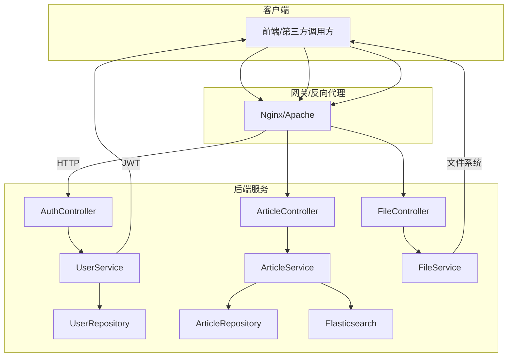
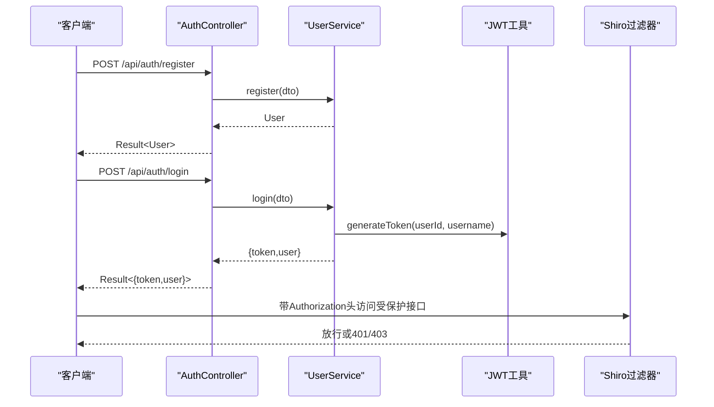
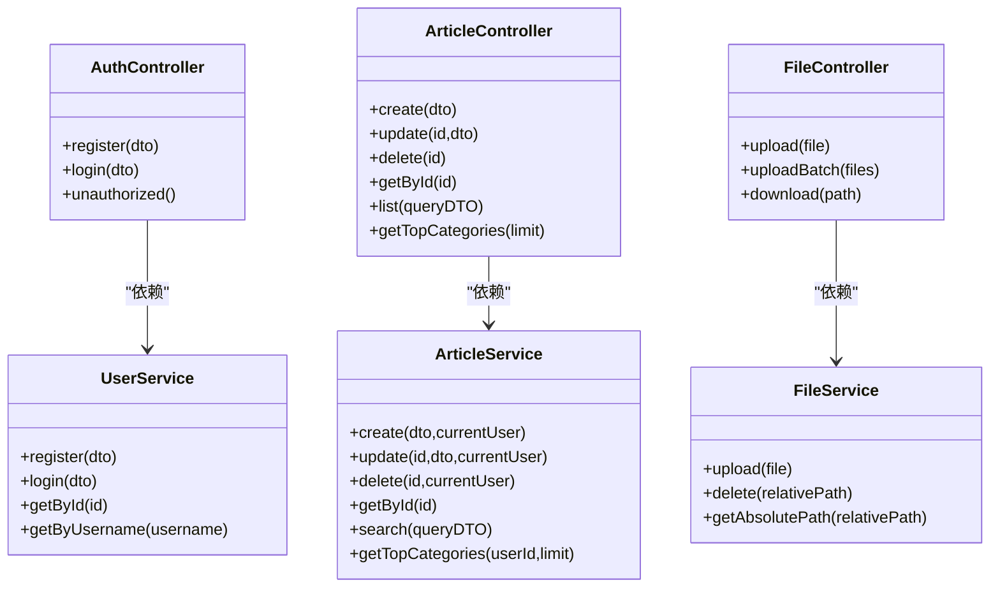

# API接口参考

<cite>
**本文引用的文件**
- [AuthController.java](file://src/main/java/com/zhishilu/controller/AuthController.java)
- [ArticleController.java](file://src/main/java/com/zhishilu/controller/ArticleController.java)
- [FileController.java](file://src/main/java/com/zhishilu/controller/FileController.java)
- [UserService.java](file://src/main/java/com/zhishilu/service/UserService.java)
- [ArticleService.java](file://src/main/java/com/zhishilu/service/ArticleService.java)
- [FileService.java](file://src/main/java/com/zhishilu/service/FileService.java)
- [LoginDTO.java](file://src/main/java/com/zhishilu/dto/LoginDTO.java)
- [RegisterDTO.java](file://src/main/java/com/zhishilu/dto/RegisterDTO.java)
- [ArticleCreateDTO.java](file://src/main/java/com/zhishilu/dto/ArticleCreateDTO.java)
- [ArticleUpdateDTO.java](file://src/main/java/com/zhishilu/dto/ArticleUpdateDTO.java)
- [ArticleQueryDTO.java](file://src/main/java/com/zhishilu/dto/ArticleQueryDTO.java)
- [Result.java](file://src/main/java/com/zhishilu/common/Result.java)
- [PageResult.java](file://src/main/java/com/zhishilu/common/PageResult.java)
- [User.java](file://src/main/java/com/zhishilu/entity/User.java)
- [Article.java](file://src/main/java/com/zhishilu/entity/Article.java)
- [application.yml](file://src/main/resources/application.yml)
</cite>

## 目录
1. [简介](#简介)
2. [项目结构](#项目结构)
3. [核心组件](#核心组件)
4. [架构总览](#架构总览)
5. [详细接口规范](#详细接口规范)
6. [依赖关系分析](#依赖关系分析)
7. [性能与安全考量](#性能与安全考量)
8. [故障排查指南](#故障排查指南)
9. [结论](#结论)
10. [附录](#附录)

## 简介
本文件为“知拾录”项目的完整REST API接口参考文档，覆盖认证（注册、登录）、文章（创建、更新、删除、查询、分类统计）、文件（上传、下载、批量上传）三大模块。文档提供每个接口的HTTP方法、URL模式、请求参数、响应格式、状态码说明，并给出认证要求、权限控制、参数校验规则、最佳实践与常见问题处理建议。同时说明接口版本管理、向后兼容性与迁移注意事项，帮助前端与第三方快速集成。

## 项目结构
- 后端采用Spring Boot + Spring MVC + Spring Data Elasticsearch + Apache Shiro + JWT实现。
- 控制器位于controller包，服务层位于service包，数据传输对象位于dto包，实体类位于entity包，统一返回体位于common包，应用配置位于resources/application.yml。
- 接口基础路径为 /api（由context-path定义），各模块前缀分别为 /auth、/article、/file。

图表来源
- [AuthController.java](file://src/main/java/com/zhishilu/controller/AuthController.java#L17-L49)
- [ArticleController.java](file://src/main/java/com/zhishilu/controller/ArticleController.java#L22-L87)
- [FileController.java](file://src/main/java/com/zhishilu/controller/FileController.java#L23-L70)
- [UserService.java](file://src/main/java/com/zhishilu/service/UserService.java#L25-L127)
- [ArticleService.java](file://src/main/java/com/zhishilu/service/ArticleService.java#L37-L199)
- [FileService.java](file://src/main/java/com/zhishilu/service/FileService.java#L27-L107)
- [application.yml](file://src/main/resources/application.yml#L1-L47)

章节来源
- [application.yml](file://src/main/resources/application.yml#L1-L47)

## 核心组件
- 统一返回体 Result：封装code、message、data、timestamp，提供success/error/unauthorized/forbidden等静态工厂方法。
- 分页结果 PageResult：封装content、page、size、total、totalPages。
- DTO：LoginDTO、RegisterDTO、ArticleCreateDTO、ArticleUpdateDTO、ArticleQueryDTO，承载请求参数与校验规则。
- 实体类：User、Article，映射Elasticsearch索引。
- 控制器：AuthController、ArticleController、FileController，暴露REST接口。
- 服务层：UserService、ArticleService、FileService，实现业务逻辑与校验。
- 配置：application.yml，定义服务器端口、上下文路径、ES连接、Shiro/JWT/上传配置等。

章节来源
- [Result.java](file://src/main/java/com/zhishilu/common/Result.java#L8-L70)
- [PageResult.java](file://src/main/java/com/zhishilu/common/PageResult.java#L12-L51)
- [LoginDTO.java](file://src/main/java/com/zhishilu/dto/LoginDTO.java#L9-L17)
- [RegisterDTO.java](file://src/main/java/com/zhishilu/dto/RegisterDTO.java#L11-L27)
- [ArticleCreateDTO.java](file://src/main/java/com/zhishilu/dto/ArticleCreateDTO.java#L12-L31)
- [ArticleUpdateDTO.java](file://src/main/java/com/zhishilu/dto/ArticleUpdateDTO.java#L11-L23)
- [ArticleQueryDTO.java](file://src/main/java/com/zhishilu/dto/ArticleQueryDTO.java#L8-L45)
- [User.java](file://src/main/java/com/zhishilu/entity/User.java#L13-L67)
- [Article.java](file://src/main/java/com/zhishilu/entity/Article.java#L14-L80)
- [application.yml](file://src/main/resources/application.yml#L1-L47)

## 架构总览
- 认证流程：注册时校验唯一性并保存；登录时校验凭据与状态，签发JWT；后续接口通过拦截器/过滤器进行鉴权。
- 文章流程：基于Elasticsearch进行全文检索与聚合统计；权限控制仅允许作者修改/删除。
- 文件流程：基于multipart上传，按日期分目录存储，支持单文件与批量上传；下载通过资源返回。

图表来源
- [AuthController.java](file://src/main/java/com/zhishilu/controller/AuthController.java#L27-L40)
- [UserService.java](file://src/main/java/com/zhishilu/service/UserService.java#L35-L87)
- [application.yml](file://src/main/resources/application.yml#L20-L31)

## 详细接口规范

### 认证接口
- 基础路径：/api/auth
- 公共响应：统一返回体 Result，成功code=200，失败code=500，未授权code=401，权限不足code=403。

1) 注册
- 方法与路径：POST /api/auth/register
- 请求体：RegisterDTO
  - 字段说明
    - username：必填，3-20字符
    - password：必填，6-32字符
    - nickname：可选，最多20字符
    - email：可选，邮箱格式
- 成功响应：Result<User>
- 错误码
  - 400：用户名/邮箱重复
  - 500：其他异常
- 示例
  - 请求示例：见“章节来源”
  - 响应示例：见“章节来源”

2) 登录
- 方法与路径：POST /api/auth/login
- 请求体：LoginDTO
  - 字段说明
    - username：必填
    - password：必填
- 成功响应：Result<{token, user}>
- 错误码
  - 400：用户名或密码错误、账号被禁用
  - 500：其他异常
- 示例
  - 请求示例：见“章节来源”
  - 响应示例：见“章节来源”

3) 未授权提示
- 方法与路径：GET /api/auth/unauthorized
- 响应：Result<Void>，code=401

章节来源
- [AuthController.java](file://src/main/java/com/zhishilu/controller/AuthController.java#L27-L48)
- [RegisterDTO.java](file://src/main/java/com/zhishilu/dto/RegisterDTO.java#L14-L26)
- [LoginDTO.java](file://src/main/java/com/zhishilu/dto/LoginDTO.java#L12-L16)
- [UserService.java](file://src/main/java/com/zhishilu/service/UserService.java#L35-L87)
- [Result.java](file://src/main/java/com/zhishilu/common/Result.java#L57-L69)

### 文章接口
- 基础路径：/api/article
- 公共响应：统一返回体 Result；分页查询返回 PageResult<Article>。
- 认证与权限
  - 需要登录态（Authorization: Bearer <token>）
  - 修改/删除需校验文章创建者身份（403）

1) 创建文章
- 方法与路径：POST /api/article
- 请求体：ArticleCreateDTO
  - 字段说明
    - title：必填，最大64字符
    - category：必填，最大32字符
    - content：可选
    - url：可选，最大64字符
    - images：可选，字符串数组
    - location：可选
- 成功响应：Result<Article>
- 错误码
  - 400：参数校验失败
  - 401：未授权
  - 403：无权限
  - 500：其他异常
- 示例
  - 请求示例：见“章节来源”
  - 响应示例：见“章节来源”

2) 更新文章
- 方法与路径：PUT /api/article/{id}
- 路径参数：id（字符串）
- 请求体：ArticleUpdateDTO
  - 字段说明
    - title：可选，最大64字符
    - content：可选
    - url：可选，最大64字符
    - images：可选，字符串数组
- 成功响应：Result<Article>
- 错误码
  - 400：参数校验失败
  - 401：未授权
  - 403：无权限
  - 500：其他异常

3) 删除文章
- 方法与路径：DELETE /api/article/{id}
- 路径参数：id（字符串）
- 成功响应：Result<Void>
- 错误码
  - 401：未授权
  - 403：无权限
  - 500：其他异常

4) 获取文章详情
- 方法与路径：GET /api/article/{id}
- 路径参数：id（字符串）
- 成功响应：Result<Article>

5) 分页查询文章
- 方法与路径：GET /api/article/list
- 查询参数：ArticleQueryDTO
  - title：可选（模糊匹配）
  - category：可选（精确匹配）
  - content：可选（模糊匹配）
  - username：可选（精确匹配）
  - location：可选（精确匹配）
  - page：可选，默认0
  - size：可选，默认10
- 成功响应：Result<PageResult<Article>>
- 错误码
  - 401：未授权
  - 500：其他异常

6) 获取用户常用类别（用于推荐）
- 方法与路径：GET /api/article/categories/top
- 查询参数：limit：可选，默认10
- 成功响应：Result<List<Map<String, Object>>>
  - 结果字段：category、count
- 错误码
  - 401：未授权
  - 500：其他异常

章节来源
- [ArticleController.java](file://src/main/java/com/zhishilu/controller/ArticleController.java#L32-L86)
- [ArticleCreateDTO.java](file://src/main/java/com/zhishilu/dto/ArticleCreateDTO.java#L15-L31)
- [ArticleUpdateDTO.java](file://src/main/java/com/zhishilu/dto/ArticleUpdateDTO.java#L14-L23)
- [ArticleQueryDTO.java](file://src/main/java/com/zhishilu/dto/ArticleQueryDTO.java#L14-L44)
- [ArticleService.java](file://src/main/java/com/zhishilu/service/ArticleService.java#L45-L198)
- [PageResult.java](file://src/main/java/com/zhishilu/common/PageResult.java#L42-L50)

### 文件接口
- 基础路径：/api/file
- 公共响应：统一返回体 Result；下载返回 ResponseEntity<Resource>。

1) 单文件上传
- 方法与路径：POST /api/file/upload
- 表单参数：file（MultipartFile）
- 成功响应：Result<String>（返回相对路径）
- 错误码
  - 400：文件为空、大小超限、类型不支持
  - 500：IO异常
- 示例
  - 请求示例：见“章节来源”
  - 响应示例：见“章节来源”

2) 批量上传
- 方法与路径：POST /api/file/upload/batch
- 表单参数：files（MultipartFile[]）
- 成功响应：Result<List<String>>（返回相对路径列表）
- 错误码
  - 400：文件为空、大小超限、类型不支持
  - 500：IO异常

3) 下载
- 方法与路径：GET /api/file/download/**（通配路由）
- 查询参数：path（相对路径）
- 成功响应：ResponseEntity<Resource>（根据文件类型设置Content-Type）
- 错误码
  - 404：文件不存在
  - 500：IO异常

章节来源
- [FileController.java](file://src/main/java/com/zhishilu/controller/FileController.java#L33-L69)
- [FileService.java](file://src/main/java/com/zhishilu/service/FileService.java#L54-L106)
- [application.yml](file://src/main/resources/application.yml#L33-L37)

## 依赖关系分析
- 控制器到服务层：AuthController依赖UserService；ArticleController依赖ArticleService；FileController依赖FileService。
- 服务层到仓储/Elasticsearch：ArticleService依赖ArticleRepository与ElasticsearchOperations；UserService依赖UserRepository与JWT工具；FileService依赖配置与文件系统。
- 统一返回体：Result与PageResult贯穿所有接口，保证响应一致性。

图表来源
- [AuthController.java](file://src/main/java/com/zhishilu/controller/AuthController.java#L22-L48)
- [ArticleController.java](file://src/main/java/com/zhishilu/controller/ArticleController.java#L27-L86)
- [FileController.java](file://src/main/java/com/zhishilu/controller/FileController.java#L28-L69)
- [UserService.java](file://src/main/java/com/zhishilu/service/UserService.java#L35-L103)
- [ArticleService.java](file://src/main/java/com/zhishilu/service/ArticleService.java#L45-L198)
- [FileService.java](file://src/main/java/com/zhishilu/service/FileService.java#L54-L106)

## 性能与安全考量
- 性能
  - 文章查询基于Elasticsearch，建议合理设置分页参数，避免过大size。
  - 批量上传建议限制文件数量与大小，结合服务端配置。
- 安全
  - 所有受保护接口需携带Authorization: Bearer <token>。
  - 密码采用固定盐值的哈希存储，登录时校验状态。
  - 文件上传限制类型与大小，防止恶意文件。
- 可靠性
  - 统一返回体便于前端处理；错误码明确区分业务错误与系统错误。
  - 下载接口对不存在文件返回404，避免内部异常泄露。

[本节为通用指导，无需列出具体文件来源]

## 故障排查指南
- 400错误
  - 认证：用户名/密码为空或不合法；注册：用户名/邮箱重复。
  - 文章：参数校验失败；更新/删除：非文章作者。
  - 文件：文件为空、类型不支持、大小超限。
- 401未授权
  - 缺少或无效token；未登录访问受保护接口。
- 403权限不足
  - 尝试修改/删除他人文章。
- 404文件不存在
  - 下载路径错误或文件已被删除。
- 500系统错误
  - IO异常、数据库异常、ES连接异常等。

章节来源
- [UserService.java](file://src/main/java/com/zhishilu/service/UserService.java#L37-L72)
- [ArticleService.java](file://src/main/java/com/zhishilu/service/ArticleService.java#L68-L100)
- [FileService.java](file://src/main/java/com/zhishilu/service/FileService.java#L56-L69)
- [Result.java](file://src/main/java/com/zhishilu/common/Result.java#L57-L69)

## 结论
本API文档覆盖了“知拾录”的核心功能接口，明确了认证、文章管理与文件上传下载的规范。通过统一返回体、严格的参数校验与权限控制，确保接口易用、安全且可维护。建议在生产环境完善网关鉴权、限流熔断与日志审计，并持续关注ES与文件存储的容量规划。

[本节为总结，无需列出具体文件来源]

## 附录

### 统一响应结构
- Result<T>
  - code：整型，200表示成功，401/403/500表示不同错误
  - message：字符串，描述信息
  - data：泛型数据
  - timestamp：毫秒级时间戳
- PageResult<T>
  - content：当前页数据列表
  - page：页码
  - size：每页大小
  - total：总数
  - totalPages：总页数

章节来源
- [Result.java](file://src/main/java/com/zhishilu/common/Result.java#L9-L18)
- [PageResult.java](file://src/main/java/com/zhishilu/common/PageResult.java#L15-L50)

### 接口版本与兼容性
- 版本策略
  - 当前接口未显式带版本号，建议在URL中引入/v1、/v2等前缀以支持多版本并存。
- 向后兼容
  - 新增字段建议保持默认值与可选，避免破坏既有客户端行为。
  - 删除字段需保留并标记废弃，提供迁移指引。
- 迁移指南
  - 引入新版本后，旧版本保留至少一个季度，提供变更日志与升级脚本。
  - 对于认证头格式，建议逐步切换至Bearer前缀并兼容旧格式。

[本节为通用指导，无需列出具体文件来源]

### 参数校验规则速览
- 认证
  - LoginDTO：username/password均非空
  - RegisterDTO：username(3-20)、password(6-32)、email格式、nickname(<=20)
- 文章
  - ArticleCreateDTO：title/category非空，url/title/category/content/images/location长度限制
  - ArticleUpdateDTO：title/url长度限制，images可选
  - ArticleQueryDTO：page/size默认值，其他字段模糊/精确匹配
- 文件
  - Upload：大小<=10MB，类型在允许列表内

章节来源
- [LoginDTO.java](file://src/main/java/com/zhishilu/dto/LoginDTO.java#L12-L16)
- [RegisterDTO.java](file://src/main/java/com/zhishilu/dto/RegisterDTO.java#L15-L26)
- [ArticleCreateDTO.java](file://src/main/java/com/zhishilu/dto/ArticleCreateDTO.java#L16-L31)
- [ArticleUpdateDTO.java](file://src/main/java/com/zhishilu/dto/ArticleUpdateDTO.java#L14-L23)
- [ArticleQueryDTO.java](file://src/main/java/com/zhishilu/dto/ArticleQueryDTO.java#L39-L44)
- [FileService.java](file://src/main/java/com/zhishilu/service/FileService.java#L61-L69)

### 请求/响应示例（路径定位）
- 注册
  - 请求示例：参见 [AuthController.register](file://src/main/java/com/zhishilu/controller/AuthController.java#L27-L31)
  - 响应示例：参见 [Result.success](file://src/main/java/com/zhishilu/common/Result.java#L27-L41)
- 登录
  - 请求示例：参见 [AuthController.login](file://src/main/java/com/zhishilu/controller/AuthController.java#L36-L40)
  - 响应示例：参见 [Result.success](file://src/main/java/com/zhishilu/common/Result.java#L27-L41)
- 创建文章
  - 请求示例：参见 [ArticleController.create](file://src/main/java/com/zhishilu/controller/ArticleController.java#L32-L37)
  - 响应示例：参见 [Result.success](file://src/main/java/com/zhishilu/common/Result.java#L27-L41)
- 单文件上传
  - 请求示例：参见 [FileController.upload](file://src/main/java/com/zhishilu/controller/FileController.java#L33-L37)
  - 响应示例：参见 [Result.success](file://src/main/java/com/zhishilu/common/Result.java#L27-L41)