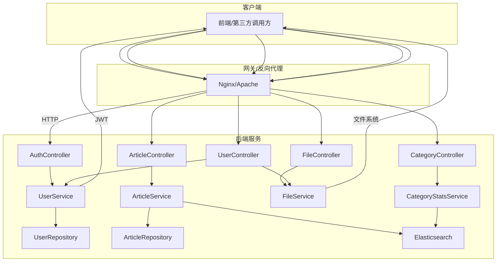
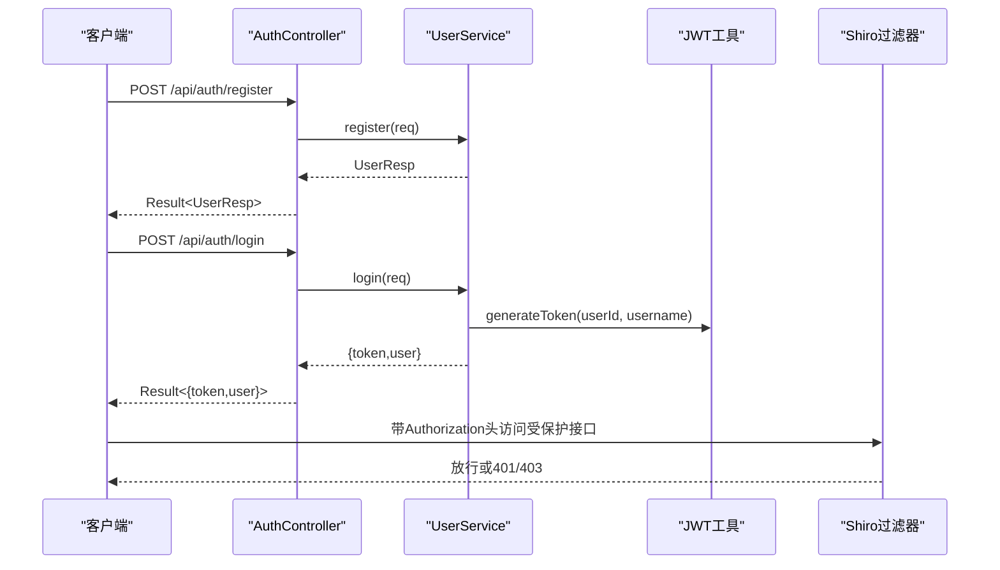
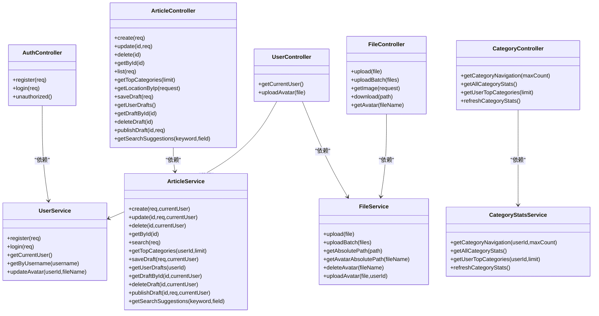

# API接口参考

<cite>
**本文档引用的文件**
- [AuthController.java](file://src/main/java/com/zhishilu/controller/AuthController.java)
- [ArticleController.java](file://src/main/java/com/zhishilu/controller/ArticleController.java)
- [FileController.java](file://src/main/java/com/zhishilu/controller/FileController.java)
- [UserController.java](file://src/main/java/com/zhishilu/controller/UserController.java)
- [CategoryController.java](file://src/main/java/com/zhishilu/controller/CategoryController.java)
- [UserService.java](file://src/main/java/com/zhishilu/service/UserService.java)
- [ArticleService.java](file://src/main/java/com/zhishilu/service/ArticleService.java)
- [FileService.java](file://src/main/java/com/zhishilu/service/FileService.java)
- [LoginReq.java](file://src/main/java/com/zhishilu/req/LoginReq.java)
- [RegisterReq.java](file://src/main/java/com/zhishilu/req/RegisterReq.java)
- [ArticleCreateReq.java](file://src/main/java/com/zhishilu/req/ArticleCreateReq.java)
- [ArticleUpdateReq.java](file://src/main/java/com/zhishilu/req/ArticleUpdateReq.java)
- [ArticleQueryReq.java](file://src/main/java/com/zhishilu/req/ArticleQueryReq.java)
- [DraftSaveReq.java](file://src/main/java/com/zhishilu/req/DraftSaveReq.java)
- [Result.java](file://src/main/java/com/zhishilu/common/Result.java)
- [PageResult.java](file://src/main/java/com/zhishilu/common/PageResult.java)
- [User.java](file://src/main/java/com/zhishilu/entity/User.java)
- [Article.java](file://src/main/java/com/zhishilu/entity/Article.java)
- [LoginResp.java](file://src/main/java/com/zhishilu/resp/LoginResp.java)
- [UserResp.java](file://src/main/java/com/zhishilu/resp/UserResp.java)
- [ArticleResp.java](file://src/main/java/com/zhishilu/resp/ArticleResp.java)
- [FileUploadResp.java](file://src/main/java/com/zhishilu/resp/FileUploadResp.java)
- [application.yml](file://src/main/resources/application.yml)
</cite>

## 目录
1. [简介](#简介)
2. [项目结构](#项目结构)
3. [核心组件](#核心组件)
4. [架构总览](#架构总览)
5. [详细接口规范](#详细接口规范)
6. [依赖关系分析](#依赖关系分析)
7. [性能与安全考量](#性能与安全考量)
8. [故障排查指南](#故障排查指南)
9. [结论](#结论)
10. [附录](#附录)

## 简介
本文件为"知拾录"项目的完整REST API接口参考文档，覆盖认证（注册、登录）、文章（创建、更新、删除、查询、分类统计、草稿管理、搜索补全）、文件（上传、下载、图片获取、头像上传）、用户（个人信息、头像上传）、类别导航（导航栏、统计、用户常用类别）五大模块。文档提供每个接口的HTTP方法、URL模式、请求参数、响应格式、状态码说明，并给出认证要求、权限控制、参数校验规则、最佳实践与常见问题处理建议。同时说明接口版本管理、向后兼容性与迁移注意事项，帮助前端与第三方快速集成。

## 项目结构
- 后端采用Spring Boot + Spring MVC + Spring Data Elasticsearch + Apache Shiro + JWT实现。
- 控制器位于controller包，服务层位于service包，请求对象位于req包，响应对象位于resp包，实体类位于entity包，统一返回体位于common包，应用配置位于resources/application.yml。
- 接口基础路径为 /api（由context-path定义），各模块前缀分别为 /auth、/article、/file、/user、/category。

```mermaid
graph TB
subgraph "客户端"
FE["前端/第三方调用方"]
end
subgraph "网关/反向代理"
GW["Nginx/Apache"]
end
subgraph "后端服务"
AC["AuthController"]
ARIC["ArticleController"]
FC["FileController"]
UC["UserController"]
CC["CategoryController"]
US["UserService"]
AS["ArticleService"]
FS["FileService"]
CSS["CategoryStatsService"]
REPO_U["UserRepository"]
REPO_A["ArticleRepository"]
ES["Elasticsearch"]
end
FE --> GW --> |"HTTP"| AC
FE --> GW --> ARIC
FE --> GW --> FC
FE --> GW --> UC
FE --> GW --> CC
AC --> US
US --> REPO_U
US --> |"JWT"| FE
ARIC --> AS
AS --> REPO_A
AS --> ES
CC --> CSS
CSS --> ES
FC --> FS
FS --> |"文件系统"| FE
UC --> US
UC --> FS
```

**图表来源**
- [AuthController.java](file://src/main/java/com/zhishilu/controller/AuthController.java#L16-L48)
- [ArticleController.java](file://src/main/java/com/zhishilu/controller/ArticleController.java#L28-L172)
- [FileController.java](file://src/main/java/com/zhishilu/controller/FileController.java#L27-L133)
- [UserController.java](file://src/main/java/com/zhishilu/controller/UserController.java#L22-L79)
- [CategoryController.java](file://src/main/java/com/zhishilu/controller/CategoryController.java#L17-L77)
- [UserService.java](file://src/main/java/com/zhishilu/service/UserService.java)
- [ArticleService.java](file://src/main/java/com/zhishilu/service/ArticleService.java)
- [FileService.java](file://src/main/java/com/zhishilu/service/FileService.java)
- [CategoryStatsService.java](file://src/main/java/com/zhishilu/service/CategoryStatsService.java)

**章节来源**
- [application.yml](file://src/main/resources/application.yml)

## 核心组件
- 统一返回体 Result：封装code、message、data、timestamp，提供success/error/unauthorized/forbidden等静态工厂方法。
- 分页结果 PageResult：封装content、page、size、total、totalPages。
- 请求对象：LoginReq、RegisterReq、ArticleCreateReq、ArticleUpdateReq、ArticleQueryReq、DraftSaveReq，承载请求参数与校验规则。
- 响应对象：LoginResp、UserResp、ArticleResp、FileUploadResp，标准化响应数据结构。
- 实体类：User、Article，映射Elasticsearch索引。
- 控制器：AuthController、ArticleController、FileController、UserController、CategoryController，暴露REST接口。
- 服务层：UserService、ArticleService、FileService、CategoryStatsService，实现业务逻辑与校验。
- 配置：application.yml，定义服务器端口、上下文路径、ES连接、Shiro/JWT/上传配置等。

**章节来源**
- [Result.java](file://src/main/java/com/zhishilu/common/Result.java)
- [PageResult.java](file://src/main/java/com/zhishilu/common/PageResult.java)
- [LoginReq.java](file://src/main/java/com/zhishilu/req/LoginReq.java)
- [RegisterReq.java](file://src/main/java/com/zhishilu/req/RegisterReq.java)
- [ArticleCreateReq.java](file://src/main/java/com/zhishilu/req/ArticleCreateReq.java)
- [ArticleUpdateReq.java](file://src/main/java/com/zhishilu/req/ArticleUpdateReq.java)
- [ArticleQueryReq.java](file://src/main/java/com/zhishilu/req/ArticleQueryReq.java)
- [DraftSaveReq.java](file://src/main/java/com/zhishilu/req/DraftSaveReq.java)
- [LoginResp.java](file://src/main/java/com/zhishilu/resp/LoginResp.java)
- [UserResp.java](file://src/main/java/com/zhishilu/resp/UserResp.java)
- [ArticleResp.java](file://src/main/java/com/zhishilu/resp/ArticleResp.java)
- [FileUploadResp.java](file://src/main/java/com/zhishilu/resp/FileUploadResp.java)
- [User.java](file://src/main/java/com/zhishilu/entity/User.java)
- [Article.java](file://src/main/java/com/zhishilu/entity/Article.java)
- [application.yml](file://src/main/resources/application.yml)

## 架构总览
- 认证流程：注册时校验唯一性并保存；登录时校验凭据与状态，签发JWT；后续接口通过拦截器/过滤器进行鉴权。
- 文章流程：基于Elasticsearch进行全文检索与聚合统计；权限控制仅允许作者修改/删除；支持草稿管理与搜索补全。
- 文件流程：基于multipart上传，按日期分目录存储，支持单文件与批量上传；图片通过/img/**路由访问，头像通过/avatar/**路由访问；下载通过资源返回。
- 用户流程：当前登录用户信息获取，头像上传与替换。
- 类别流程：首页导航栏类别推荐，用户常用类别统计，全站类别统计。

```mermaid
sequenceDiagram
participant C as "客户端"
participant AC as "AuthController"
participant US as "UserService"
participant JWT as "JWT工具"
participant SHIRO as "Shiro过滤器"
C->>AC : POST /api/auth/register
AC->>US : register(req)
US-->>AC : UserResp
AC-->>C : Result<UserResp>
C->>AC : POST /api/auth/login
AC->>US : login(req)
US->>JWT : generateToken(userId, username)
US-->>AC : {token,user}
AC-->>C : Result<{token,user}>
C->>SHIRO : 带Authorization头访问受保护接口
SHIRO-->>C : 放行或401/403
```

**图表来源**
- [AuthController.java](file://src/main/java/com/zhishilu/controller/AuthController.java#L26-L39)
- [UserService.java](file://src/main/java/com/zhishilu/service/UserService.java)
- [application.yml](file://src/main/resources/application.yml)

## 详细接口规范

### 认证接口
- 基础路径：/api/auth
- 公共响应：统一返回体 Result，成功code=200，失败code=500，未授权code=401，权限不足code=403。

1) 注册
- 方法与路径：POST /api/auth/register
- 请求体：RegisterReq
  - 字段说明
    - username：必填，3-20字符
    - password：必填，6-20字符
    - nickname：可选，最多20字符
    - email：可选，邮箱格式
- 成功响应：Result<UserResp>
- 错误码
  - 400：用户名/邮箱重复、参数校验失败
  - 500：其他异常
- 示例
  - 请求示例：见"章节来源"
  - 响应示例：见"章节来源"

2) 登录
- 方法与路径：POST /api/auth/login
- 请求体：LoginReq
  - 字段说明
    - username：必填
    - password：必填
- 成功响应：Result<LoginResp>
- 错误码
  - 400：用户名或密码错误、账号被禁用
  - 500：其他异常
- 示例
  - 请求示例：见"章节来源"
  - 响应示例：见"章节来源"

3) 未授权提示
- 方法与路径：GET /api/auth/unauthorized
- 响应：Result<Void>，code=401

**章节来源**
- [AuthController.java](file://src/main/java/com/zhishilu/controller/AuthController.java#L26-L47)
- [RegisterReq.java](file://src/main/java/com/zhishilu/req/RegisterReq.java#L18-L39)
- [LoginReq.java](file://src/main/java/com/zhishilu/req/LoginReq.java#L16-L23)
- [UserService.java](file://src/main/java/com/zhishilu/service/UserService.java)
- [Result.java](file://src/main/java/com/zhishilu/common/Result.java)

### 文章接口
- 基础路径：/api/article
- 公共响应：统一返回体 Result；分页查询返回 PageResult<ArticleResp>。
- 认证与权限
  - 需要登录态（Authorization: Bearer <token>）
  - 修改/删除需校验文章创建者身份（403）

1) 创建文章
- 方法与路径：POST /api/article
- 请求体：ArticleCreateReq
  - 字段说明
    - title：必填，最大64字符
    - categories：必填，字符串数组
    - content：可选
    - url：可选，最大64字符
    - images：可选，字符串数组
    - location：可选
- 成功响应：Result<ArticleResp>
- 错误码
  - 400：参数校验失败
  - 401：未授权
  - 403：无权限
  - 500：其他异常
- 示例
  - 请求示例：见"章节来源"
  - 响应示例：见"章节来源"

2) 更新文章
- 方法与路径：PUT /api/article/{id}
- 路径参数：id（字符串）
- 请求体：ArticleUpdateReq
  - 字段说明
    - title：可选，最大64字符
    - content：可选
    - categories：可选，字符串数组
    - url：可选，最大64字符
    - images：可选，字符串数组
    - location：可选
- 成功响应：Result<ArticleResp>
- 错误码
  - 400：参数校验失败
  - 401：未授权
  - 403：无权限
  - 500：其他异常

3) 删除文章
- 方法与路径：DELETE /api/article/{id}
- 路径参数：id（字符串）
- 成功响应：Result<Void>
- 错误码
  - 401：未授权
  - 403：无权限
  - 500：其他异常

4) 获取文章详情
- 方法与路径：GET /api/article/{id}
- 路径参数：id（字符串）
- 成功响应：Result<ArticleResp>

5) 分页查询文章
- 方法与路径：GET /api/article/list
- 查询参数：ArticleQueryReq
  - keyword：可选（全部字段模糊查询）
  - title：可选（模糊匹配）
  - categories：可选（精确匹配，满足任一类别）
  - content：可选（模糊匹配）
  - username：可选（精确匹配）
  - location：可选（模糊匹配）
  - page：可选，默认0
  - size：可选，默认10
- 成功响应：Result<PageResult<ArticleResp>>
- 错误码
  - 401：未授权
  - 500：其他异常

6) 获取用户最常用类别（用于推荐）
- 方法与路径：GET /api/article/categories/top
- 查询参数：limit：可选，默认10
- 成功响应：Result<List<CategoryStatResp>>
- 错误码
  - 401：未授权
  - 500：其他异常

7) 根据IP获取地理位置
- 方法与路径：GET /api/article/location
- 请求参数：HttpServletRequest
- 成功响应：Result<String>
- 错误码
  - 500：其他异常

8) 保存草稿
- 方法与路径：POST /api/article/draft
- 请求体：DraftSaveReq
  - 字段说明：同文章创建，但包含id字段用于更新
- 成功响应：Result<DraftResp>
- 错误码
  - 400：参数校验失败
  - 401：未授权
  - 500：其他异常

9) 获取当前用户草稿列表
- 方法与路径：GET /api/article/draft/list
- 成功响应：Result<List<DraftResp>>
- 错误码
  - 401：未授权
  - 500：其他异常

10) 获取草稿详情
- 方法与路径：GET /api/article/draft/{id}
- 路径参数：id（字符串）
- 成功响应：Result<DraftResp>
- 错误码
  - 401：未授权
  - 500：其他异常

11) 删除草稿
- 方法与路径：DELETE /api/article/draft/{id}
- 路径参数：id（字符串）
- 成功响应：Result<Void>
- 错误码
  - 401：未授权
  - 500：其他异常

12) 发布草稿
- 方法与路径：POST /api/article/draft/{id}/publish
- 路径参数：id（字符串）
- 请求体：ArticleCreateReq
- 成功响应：Result<ArticleResp>
- 错误码
  - 400：参数校验失败
  - 401：未授权
  - 500：其他异常

13) 搜索补全
- 方法与路径：GET /api/article/suggestions
- 查询参数：
  - keyword：必填（搜索关键词）
  - field：可选，默认all，可选值：all/title/category/content/username/location
- 成功响应：Result<SearchSuggestionResp>
- 错误码
  - 400：参数校验失败
  - 500：其他异常

**章节来源**
- [ArticleController.java](file://src/main/java/com/zhishilu/controller/ArticleController.java#L39-L171)
- [ArticleCreateReq.java](file://src/main/java/com/zhishilu/req/ArticleCreateReq.java#L18-L46)
- [ArticleUpdateReq.java](file://src/main/java/com/zhishilu/req/ArticleUpdateReq.java#L16-L42)
- [ArticleQueryReq.java](file://src/main/java/com/zhishilu/req/ArticleQueryReq.java#L16-L52)
- [DraftSaveReq.java](file://src/main/java/com/zhishilu/req/DraftSaveReq.java#L21-L47)
- [ArticleService.java](file://src/main/java/com/zhishilu/service/ArticleService.java)
- [PageResult.java](file://src/main/java/com/zhishilu/common/PageResult.java)

### 文件接口
- 基础路径：/api/file
- 公共响应：统一返回体 Result；下载返回 ResponseEntity<Resource>。

1) 单文件上传
- 方法与路径：POST /api/file/upload
- 表单参数：file（MultipartFile）
- 成功响应：Result<FileUploadResp>
- 错误码
  - 400：文件为空、大小超限、类型不支持
  - 500：IO异常
- 示例
  - 请求示例：见"章节来源"
  - 响应示例：见"章节来源"

2) 批量上传
- 方法与路径：POST /api/file/upload/batch
- 表单参数：files（MultipartFile[]）
- 成功响应：Result<FileUploadResp>
- 错误码
  - 400：文件为空、大小超限、类型不支持
  - 500：IO异常

3) 获取图片
- 方法与路径：GET /api/file/img/**
- 请求参数：HttpServletRequest
- 成功响应：ResponseEntity<Resource>（根据文件类型设置Content-Type）
- 错误码
  - 404：文件不存在
  - 500：IO异常

4) 下载文件（兼容旧接口）
- 方法与路径：GET /api/file/download/**
- 查询参数：path（相对路径）
- 成功响应：ResponseEntity<Resource>（根据文件类型设置Content-Type）
- 错误码
  - 404：文件不存在
  - 500：IO异常

5) 获取头像
- 方法与路径：GET /api/file/avatar/{fileName}
- 路径参数：fileName（字符串）
- 成功响应：ResponseEntity<Resource>（根据文件类型设置Content-Type）
- 错误码
  - 404：文件不存在
  - 500：IO异常

**章节来源**
- [FileController.java](file://src/main/java/com/zhishilu/controller/FileController.java#L37-L132)
- [FileService.java](file://src/main/java/com/zhishilu/service/FileService.java)
- [FileUploadResp.java](file://src/main/java/com/zhishilu/resp/FileUploadResp.java)

### 用户接口
- 基础路径：/api/user
- 公共响应：统一返回体 Result。

1) 获取当前登录用户信息
- 方法与路径：GET /api/user/info
- 成功响应：Result<UserResp>
- 错误码
  - 401：未授权
  - 500：其他异常

2) 上传头像
- 方法与路径：POST /api/user/avatar
- 表单参数：file（MultipartFile）
- 成功响应：Result<Map<String,String>>
- 错误码
  - 400：文件为空、大小超限、类型不支持
  - 401：未授权
  - 500：IO异常

**章节来源**
- [UserController.java](file://src/main/java/com/zhishilu/controller/UserController.java#L32-L78)
- [UserResp.java](file://src/main/java/com/zhishilu/resp/UserResp.java)

### 类别接口
- 基础路径：/api/category
- 公共响应：统一返回体 Result。

1) 获取首页类别导航栏数据
- 方法与路径：GET /api/category/navigation
- 查询参数：maxCount：可选，默认20，最大100
- 成功响应：Result<List<CategoryStatResp>>
- 错误码
  - 500：其他异常

2) 获取所有类别统计
- 方法与路径：GET /api/category/stats
- 成功响应：Result<List<CategoryStatResp>>
- 错误码
  - 500：其他异常

3) 获取用户最常用类别
- 方法与路径：GET /api/category/user/top
- 查询参数：limit：可选，默认10
- 成功响应：Result<List<CategoryStatResp>>
- 错误码
  - 401：未授权
  - 500：其他异常

4) 刷新类别统计
- 方法与路径：POST /api/category/refresh
- 成功响应：Result<Void>
- 错误码
  - 500：其他异常

**章节来源**
- [CategoryController.java](file://src/main/java/com/zhishilu/controller/CategoryController.java#L32-L76)
- [CategoryStatsService.java](file://src/main/java/com/zhishilu/service/CategoryStatsService.java)

## 依赖关系分析
- 控制器到服务层：AuthController依赖UserService；ArticleController依赖ArticleService；FileController依赖FileService；UserController依赖UserService和FileService；CategoryController依赖CategoryStatsService。
- 服务层到仓储/Elasticsearch：ArticleService依赖ArticleRepository与ElasticsearchOperations；UserService依赖UserRepository与JWT工具；FileService依赖配置与文件系统；CategoryStatsService依赖Elasticsearch进行统计。
- 统一返回体：Result与PageResult贯穿所有接口，保证响应一致性。

```mermaid
classDiagram
class AuthController {
+register(req)
+login(req)
+unauthorized()
}
class ArticleController {
+create(req)
+update(id,req)
+delete(id)
+getById(id)
+list(req)
+getTopCategories(limit)
+getLocationByIp(request)
+saveDraft(req)
+getUserDrafts()
+getDraftById(id)
+deleteDraft(id)
+publishDraft(id,req)
+getSearchSuggestions(keyword,field)
}
class FileController {
+upload(file)
+uploadBatch(files)
+getImage(request)
+download(path)
+getAvatar(fileName)
}
class UserController {
+getCurrentUser()
+uploadAvatar(file)
}
class CategoryController {
+getCategoryNavigation(maxCount)
+getAllCategoryStats()
+getUserTopCategories(limit)
+refreshCategoryStats()
}
class UserService {
+register(req)
+login(req)
+getCurrentUser()
+getByUsername(username)
+updateAvatar(userId,fileName)
}
class ArticleService {
+create(req,currentUser)
+update(id,req,currentUser)
+delete(id,currentUser)
+getById(id)
+search(req)
+getTopCategories(userId,limit)
+saveDraft(req,currentUser)
+getUserDrafts(userId)
+getDraftById(id,currentUser)
+deleteDraft(id,currentUser)
+publishDraft(id,req,currentUser)
+getSearchSuggestions(keyword,field)
}
class FileService {
+upload(file)
+uploadBatch(files)
+getAbsolutePath(path)
+getAvatarAbsolutePath(fileName)
+deleteAvatar(fileName)
+uploadAvatar(file,userId)
}
class CategoryStatsService {
+getCategoryNavigation(userId,maxCount)
+getAllCategoryStats()
+getUserTopCategories(userId,limit)
+refreshCategoryStats()
}
AuthController --> UserService : "依赖"
ArticleController --> ArticleService : "依赖"
FileController --> FileService : "依赖"
UserController --> UserService : "依赖"
UserController --> FileService : "依赖"
CategoryController --> CategoryStatsService : "依赖"
```

**图表来源**
- [AuthController.java](file://src/main/java/com/zhishilu/controller/AuthController.java#L19-L47)
- [ArticleController.java](file://src/main/java/com/zhishilu/controller/ArticleController.java#L33-L171)
- [FileController.java](file://src/main/java/com/zhishilu/controller/FileController.java#L32-L132)
- [UserController.java](file://src/main/java/com/zhishilu/controller/UserController.java#L26-L78)
- [CategoryController.java](file://src/main/java/com/zhishilu/controller/CategoryController.java#L21-L76)
- [UserService.java](file://src/main/java/com/zhishilu/service/UserService.java)
- [ArticleService.java](file://src/main/java/com/zhishilu/service/ArticleService.java)
- [FileService.java](file://src/main/java/com/zhishilu/service/FileService.java)
- [CategoryStatsService.java](file://src/main/java/com/zhishilu/service/CategoryStatsService.java)

## 性能与安全考量
- 性能
  - 文章查询基于Elasticsearch，建议合理设置分页参数，避免过大size。
  - 批量上传建议限制文件数量与大小，结合服务端配置。
  - 类别导航栏数据限制最大数量（100），防止数据滥用。
- 安全
  - 所有受保护接口需携带Authorization: Bearer <token>。
  - 密码采用固定盐值的哈希存储，登录时校验状态。
  - 文件上传限制类型与大小，防止恶意文件。
  - 头像上传会自动删除旧头像，防止垃圾文件积累。
- 可靠性
  - 统一返回体便于前端处理；错误码明确区分业务错误与系统错误。
  - 下载接口对不存在文件返回404，避免内部异常泄露。
  - IP地理位置查询失败时返回友好提示而非错误码。

## 故障排查指南
- 400错误
  - 认证：用户名/密码为空或不合法；注册：用户名/邮箱重复。
  - 文章：参数校验失败；更新/删除：非文章作者；草稿保存失败。
  - 文件：文件为空、类型不支持、大小超限；头像上传失败。
  - 类别：导航栏maxCount超出范围。
- 401未授权
  - 缺少或无效token；未登录访问受保护接口。
- 403权限不足
  - 尝试修改/删除他人文章。
- 404文件不存在
  - 下载路径错误或文件已被删除；头像文件不存在。
- 500系统错误
  - IO异常、数据库异常、ES连接异常、IP地理位置查询异常等。

**章节来源**
- [UserService.java](file://src/main/java/com/zhishilu/service/UserService.java)
- [ArticleService.java](file://src/main/java/com/zhishilu/service/ArticleService.java)
- [FileService.java](file://src/main/java/com/zhishilu/service/FileService.java)
- [CategoryStatsService.java](file://src/main/java/com/zhishilu/service/CategoryStatsService.java)
- [Result.java](file://src/main/java/com/zhishilu/common/Result.java)

## 结论
本API文档覆盖了"知拾录"的完整功能接口，明确了认证、文章管理（含草稿）、文件上传下载、用户信息、类别导航的规范。通过统一返回体、严格的参数校验与权限控制，确保接口易用、安全且可维护。建议在生产环境完善网关鉴权、限流熔断与日志审计，并持续关注ES与文件存储的容量规划。

## 附录

### 统一响应结构
- Result<T>
  - code：整型，200表示成功，401/403/500表示不同错误
  - message：字符串，描述信息
  - data：泛型数据
  - timestamp：毫秒级时间戳
- PageResult<T>
  - content：当前页数据列表
  - page：页码
  - size：每页大小
  - total：总数
  - totalPages：总页数

**章节来源**
- [Result.java](file://src/main/java/com/zhishilu/common/Result.java)
- [PageResult.java](file://src/main/java/com/zhishilu/common/PageResult.java)

### 接口版本与兼容性
- 版本策略
  - 当前接口未显式带版本号，建议在URL中引入/v1、/v2等前缀以支持多版本并存。
- 向后兼容
  - 新增字段建议保持默认值与可选，避免破坏既有客户端行为。
  - 删除字段需保留并标记废弃，提供迁移指引。
- 迁移指南
  - 引入新版本后，旧版本保留至少一个季度，提供变更日志与升级脚本。
  - 对于认证头格式，建议逐步切换至Bearer前缀并兼容旧格式。

### 参数校验规则速览
- 认证
  - LoginReq：username/password均非空
  - RegisterReq：username(3-20)、password(6-20)、email格式、nickname(<=20)
- 文章
  - ArticleCreateReq：title非空、categories非空、url/title/content/images/location长度限制
  - ArticleUpdateReq：title/url长度限制、categories/images可选
  - ArticleQueryReq：page/size默认值，keyword/title/content/username/location模糊/精确匹配
  - DraftSaveReq：id可选、其他字段与创建相同
- 文件
  - Upload：大小<=10MB，类型在允许列表内
  - Batch：同上，支持多文件
- 用户
  - Avatar：文件大小限制，类型限制
- 类别
  - Navigation：maxCount限制在1-100

**章节来源**
- [LoginReq.java](file://src/main/java/com/zhishilu/req/LoginReq.java#L16-L23)
- [RegisterReq.java](file://src/main/java/com/zhishilu/req/RegisterReq.java#L18-L39)
- [ArticleCreateReq.java](file://src/main/java/com/zhishilu/req/ArticleCreateReq.java#L18-L46)
- [ArticleUpdateReq.java](file://src/main/java/com/zhishilu/req/ArticleUpdateReq.java#L16-L42)
- [ArticleQueryReq.java](file://src/main/java/com/zhishilu/req/ArticleQueryReq.java#L16-L52)
- [DraftSaveReq.java](file://src/main/java/com/zhishilu/req/DraftSaveReq.java#L21-L47)
- [FileService.java](file://src/main/java/com/zhishilu/service/FileService.java)
- [UserController.java](file://src/main/java/com/zhishilu/controller/UserController.java#L54-L78)
- [CategoryController.java](file://src/main/java/com/zhishilu/controller/CategoryController.java#L34-L46)

### 请求/响应示例（路径定位）
- 注册
  - 请求示例：参见 [AuthController.register](file://src/main/java/com/zhishilu/controller/AuthController.java#L27-L29)
  - 响应示例：参见 [Result.success](file://src/main/java/com/zhishilu/common/Result.java)
- 登录
  - 请求示例：参见 [AuthController.login](file://src/main/java/com/zhishilu/controller/AuthController.java#L36-L38)
  - 响应示例：参见 [Result.success](file://src/main/java/com/zhishilu/common/Result.java)
- 创建文章
  - 请求示例：参见 [ArticleController.create](file://src/main/java/com/zhishilu/controller/ArticleController.java#L40-L43)
  - 响应示例：参见 [Result.success](file://src/main/java/com/zhishilu/common/Result.java)
- 单文件上传
  - 请求示例：参见 [FileController.upload](file://src/main/java/com/zhishilu/controller/FileController.java#L39-L42)
  - 响应示例：参见 [Result.success](file://src/main/java/com/zhishilu/common/Result.java)
- 上传头像
  - 请求示例：参见 [UserController.uploadAvatar](file://src/main/java/com/zhishilu/controller/UserController.java#L54-L78)
  - 响应示例：参见 [Result.success](file://src/main/java/com/zhishilu/common/Result.java)