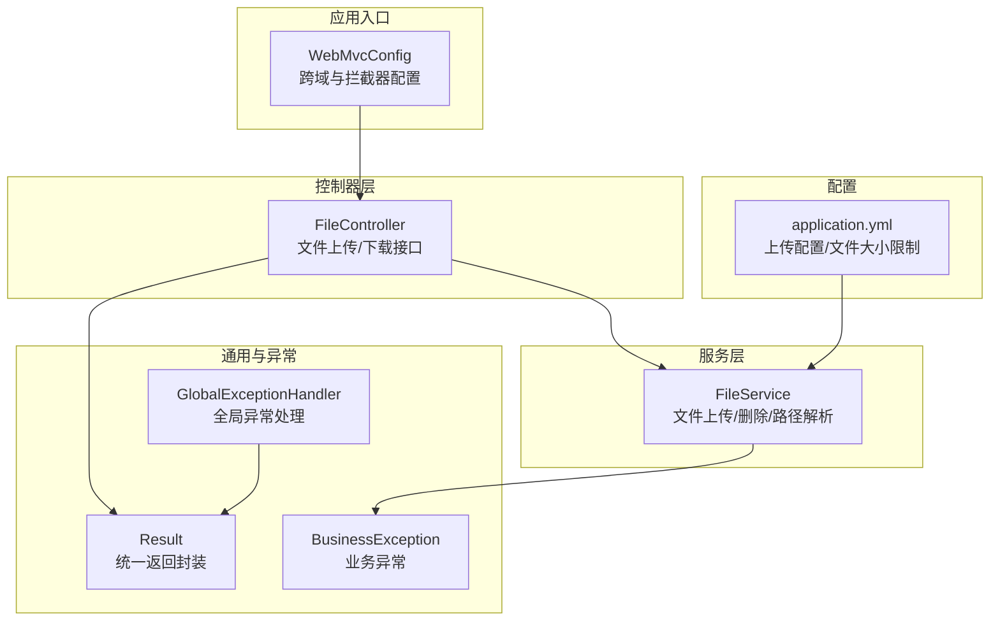
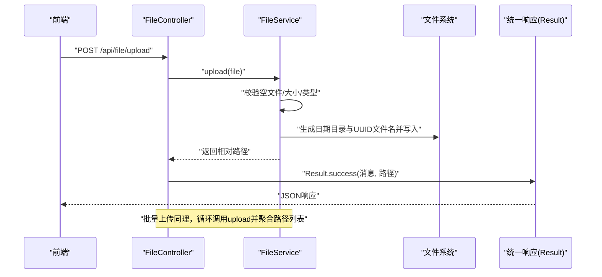
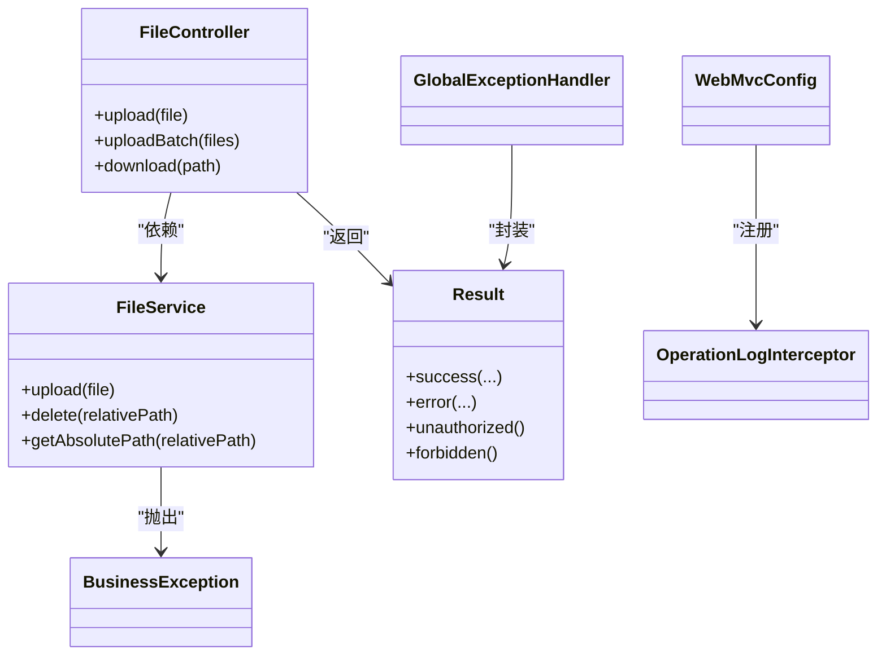

# 文件接口

<cite>
**本文引用的文件**
- [FileController.java](file://src/main/java/com/zhishilu/controller/FileController.java)
- [FileService.java](file://src/main/java/com/zhishilu/service/FileService.java)
- [application.yml](file://src/main/resources/application.yml)
- [Result.java](file://src/main/java/com/zhishilu/common/Result.java)
- [BusinessException.java](file://src/main/java/com/zhishilu/exception/BusinessException.java)
- [GlobalExceptionHandler.java](file://src/main/java/com/zhishilu/exception/GlobalExceptionHandler.java)
- [WebMvcConfig.java](file://src/main/java/com/zhishilu/config/WebMvcConfig.java)
- [OperationLogInterceptor.java](file://src/main/java/com/zhishilu/interceptor/OperationLogInterceptor.java)
- [README.md](file://README.md)
</cite>

## 目录
1. [简介](#简介)
2. [项目结构](#项目结构)
3. [核心组件](#核心组件)
4. [架构总览](#架构总览)
5. [详细组件分析](#详细组件分析)
6. [依赖关系分析](#依赖关系分析)
7. [性能与安全考虑](#性能与安全考虑)
8. [故障排查指南](#故障排查指南)
9. [结论](#结论)
10. [附录](#附录)

## 简介
本文件接口文档面向“文件上传与下载”能力，覆盖以下接口：
- POST /api/file/upload：单文件上传
- POST /api/file/upload/batch：批量上传
- GET /api/file/download/**：文件下载

文档从接口规范、参数与约束、响应格式、实现细节、安全与性能、最佳实践到前端示例与常见问题进行系统化说明，帮助开发者快速理解与正确使用文件接口。

## 项目结构
文件接口位于 Spring Boot 应用的控制器与服务层，配合统一返回封装与异常处理，形成清晰的分层架构。

图表来源
- [WebMvcConfig.java](file://src/main/java/com/zhishilu/config/WebMvcConfig.java#L1-L40)
- [FileController.java](file://src/main/java/com/zhishilu/controller/FileController.java#L1-L71)
- [FileService.java](file://src/main/java/com/zhishilu/service/FileService.java#L1-L108)
- [Result.java](file://src/main/java/com/zhishilu/common/Result.java#L1-L71)
- [BusinessException.java](file://src/main/java/com/zhishilu/exception/BusinessException.java#L1-L23)
- [GlobalExceptionHandler.java](file://src/main/java/com/zhishilu/exception/GlobalExceptionHandler.java#L1-L87)
- [application.yml](file://src/main/resources/application.yml#L33-L37)

章节来源
- [README.md](file://README.md#L67-L72)
- [application.yml](file://src/main/resources/application.yml#L1-L47)

## 核心组件
- FileController：提供文件上传与下载接口，负责参数接收、调用服务层并返回统一结果。
- FileService：实现文件校验、命名、存储与路径解析，负责业务逻辑与IO操作。
- Result：统一响应结构，包含状态码、消息、数据与时间戳。
- BusinessException：业务异常封装，便于全局异常处理器统一处理。
- GlobalExceptionHandler：集中处理业务异常、认证/授权异常、参数校验异常等。
- WebMvcConfig：跨域与拦截器配置，确保接口可被前端访问并记录操作日志。
- OperationLogInterceptor：拦截所有请求，异步记录访问日志（含用户、参数、耗时等）。

章节来源
- [FileController.java](file://src/main/java/com/zhishilu/controller/FileController.java#L23-L71)
- [FileService.java](file://src/main/java/com/zhishilu/service/FileService.java#L25-L108)
- [Result.java](file://src/main/java/com/zhishilu/common/Result.java#L8-L71)
- [BusinessException.java](file://src/main/java/com/zhishilu/exception/BusinessException.java#L8-L23)
- [GlobalExceptionHandler.java](file://src/main/java/com/zhishilu/exception/GlobalExceptionHandler.java#L20-L87)
- [WebMvcConfig.java](file://src/main/java/com/zhishilu/config/WebMvcConfig.java#L14-L40)
- [OperationLogInterceptor.java](file://src/main/java/com/zhishilu/interceptor/OperationLogInterceptor.java#L22-L128)

## 架构总览
文件接口的典型调用流程如下：

图表来源
- [FileController.java](file://src/main/java/com/zhishilu/controller/FileController.java#L33-L49)
- [FileService.java](file://src/main/java/com/zhishilu/service/FileService.java#L54-L88)
- [Result.java](file://src/main/java/com/zhishilu/common/Result.java#L20-L41)

## 详细组件分析

### 接口清单与规范
- 单文件上传
  - 方法：POST
  - 路径：/api/file/upload
  - 请求体：multipart/form-data，字段名为 file
  - 成功响应：Result<String>，data 为文件相对路径（例如 yyyy/MM/dd/uuid.ext）
- 批量上传
  - 方法：POST
  - 路径：/api/file/upload/batch
  - 请求体：multipart/form-data，字段名为 files（数组）
  - 成功响应：Result<List<String>>，data 为每个文件的相对路径列表
- 文件下载
  - 方法：GET
  - 路径：/api/file/download/**（通配符路由）
  - 查询参数：path（相对路径）
  - 成功响应：二进制流（根据文件类型设置 Content-Type）

章节来源
- [README.md](file://README.md#L67-L72)
- [FileController.java](file://src/main/java/com/zhishilu/controller/FileController.java#L33-L69)
- [application.yml](file://src/main/resources/application.yml#L1-L47)

### 文件上传参数与约束
- 文件大小限制
  - 服务端校验：最大 10MB（字节）
  - 客户端上传限制：Spring 配置允许单文件 50MB，请求总大小 100MB
- 文件类型限制
  - 当前允许类型：jpg、jpeg、png、gif、webp、bmp
- 存储路径
  - 上传根目录：./uploads（可通过配置项调整）
  - 存放策略：按日期分目录（yyyy/MM/dd），文件名为 UUID.ext
- 返回值
  - 仅返回相对路径，便于后续拼接访问域名或CDN域名

章节来源
- [FileService.java](file://src/main/java/com/zhishilu/service/FileService.java#L32-L37)
- [FileService.java](file://src/main/java/com/zhishilu/service/FileService.java#L60-L69)
- [FileService.java](file://src/main/java/com/zhishilu/service/FileService.java#L71-L84)
- [application.yml](file://src/main/resources/application.yml#L33-L37)
- [application.yml](file://src/main/resources/application.yml#L10-L12)

### 文件命名规则与重复处理
- 命名规则
  - 目录：按当前日期拆分为年/月/日层级
  - 文件名：UUID + 原扩展名
- 重复处理
  - 采用 UUID 命名，天然避免同名冲突
  - 若需去重策略，可在业务侧基于哈希或元数据实现（当前实现未包含）

章节来源
- [FileService.java](file://src/main/java/com/zhishilu/service/FileService.java#L71-L84)

### 安全性检查与权限控制
- 认证与授权
  - 项目采用 Shiro + JWT 进行认证与权限控制，但文件接口未显式添加拦截规则
  - 建议在网关或控制器层增加鉴权注解或拦截器，防止未授权访问
- 路径遍历防护
  - 下载时通过 getAbsolutePath 将相对路径拼接到上传根目录，避免外部路径注入
- 文件类型与大小
  - 服务端严格校验类型与大小，降低恶意文件风险

章节来源
- [FileController.java](file://src/main/java/com/zhishilu/controller/FileController.java#L54-L69)
- [FileService.java](file://src/main/java/com/zhishilu/service/FileService.java#L54-L88)
- [application.yml](file://src/main/resources/application.yml#L20-L31)

### 下载接口实现细节
- 路由设计：使用通配符匹配 /api/file/download/**，实际通过查询参数 path 指定目标文件相对路径
- 文件存在性检查：若文件不存在，返回 404
- MIME 类型推断：通过文件系统探测 Content-Type，缺失时回退为 application/octet-stream
- 响应体：以 Resource 形式返回文件流

章节来源
- [FileController.java](file://src/main/java/com/zhishilu/controller/FileController.java#L54-L69)
- [FileService.java](file://src/main/java/com/zhishilu/service/FileService.java#L104-L106)

### 统一响应与异常处理
- 统一响应结构
  - 字段：code、message、data、timestamp
  - 成功：code=200；错误：code=500 或 401/403（视异常类型）
- 业务异常
  - BusinessException：抛出后由 GlobalExceptionHandler 统一包装为 Result.error
- 其他异常
  - 认证/授权异常映射为 401/403
  - 参数校验异常映射为 400

章节来源
- [Result.java](file://src/main/java/com/zhishilu/common/Result.java#L8-L71)
- [BusinessException.java](file://src/main/java/com/zhishilu/exception/BusinessException.java#L8-L23)
- [GlobalExceptionHandler.java](file://src/main/java/com/zhishilu/exception/GlobalExceptionHandler.java#L20-L87)

### 跨域与日志拦截
- 跨域：允许任意源、方法与头，并允许携带凭证
- 操作日志：拦截器记录请求路径、方法、参数、IP、状态码与耗时，异步保存

章节来源
- [WebMvcConfig.java](file://src/main/java/com/zhishilu/config/WebMvcConfig.java#L23-L31)
- [OperationLogInterceptor.java](file://src/main/java/com/zhishilu/interceptor/OperationLogInterceptor.java#L32-L64)

## 依赖关系分析

图表来源
- [FileController.java](file://src/main/java/com/zhishilu/controller/FileController.java#L23-L71)
- [FileService.java](file://src/main/java/com/zhishilu/service/FileService.java#L25-L108)
- [Result.java](file://src/main/java/com/zhishilu/common/Result.java#L8-L71)
- [BusinessException.java](file://src/main/java/com/zhishilu/exception/BusinessException.java#L8-L23)
- [GlobalExceptionHandler.java](file://src/main/java/com/zhishilu/exception/GlobalExceptionHandler.java#L20-L87)
- [WebMvcConfig.java](file://src/main/java/com/zhishilu/config/WebMvcConfig.java#L14-L40)
- [OperationLogInterceptor.java](file://src/main/java/com/zhishilu/interceptor/OperationLogInterceptor.java#L22-L128)

## 性能与安全考虑
- 性能
  - 上传：建议前端分片上传与断点续传（当前实现未包含），以提升大文件体验
  - 下载：建议结合 CDN 与缓存策略，减少服务器压力
- 安全
  - 建议对下载接口增加鉴权与白名单校验，防止公开暴露
  - 对外暴露的下载地址建议启用防盗链策略
- 可靠性
  - 建议引入异步任务队列处理大文件转码、缩略图生成等耗时操作
  - 对上传目录进行磁盘配额与清理策略

[本节为通用指导，无需列出具体文件来源]

## 故障排查指南
- 上传失败（业务异常）
  - 症状：返回 code=500，message 为业务异常描述
  - 常见原因：文件为空、超出大小限制、类型不被允许
  - 处理：检查客户端上传大小与类型，确认 application.yml 中的配置
- 下载 404
  - 症状：返回 404 Not Found
  - 常见原因：path 指向的相对路径不存在
  - 处理：确认返回的相对路径是否正确，以及上传根目录是否存在
- 跨域问题
  - 症状：浏览器提示跨域拒绝
  - 处理：确认 WebMvcConfig 的 CORS 配置已生效
- 权限问题
  - 症状：返回 401/403
  - 处理：为文件接口增加鉴权注解或拦截器，确保登录态有效

章节来源
- [FileService.java](file://src/main/java/com/zhishilu/service/FileService.java#L54-L88)
- [FileController.java](file://src/main/java/com/zhishilu/controller/FileController.java#L54-L69)
- [GlobalExceptionHandler.java](file://src/main/java/com/zhishilu/exception/GlobalExceptionHandler.java#L27-L51)
- [WebMvcConfig.java](file://src/main/java/com/zhishilu/config/WebMvcConfig.java#L23-L31)

## 结论
该文件接口实现了基础的上传与下载能力，具备明确的参数约束与统一响应格式。建议在生产环境中补充鉴权、CDN、缓存与安全策略，并考虑引入分片上传与异步处理以提升性能与可靠性。

[本节为总结性内容，无需列出具体文件来源]

## 附录

### 请求与响应示例
- 单文件上传
  - 请求
    - 方法：POST
    - 路径：/api/file/upload
    - 表单字段：file（二进制文件）
  - 成功响应
    - 结构：Result<String>
    - 示例：{"code":200,"message":"上传成功","data":"yyyy/MM/dd/uuid.ext","timestamp":...}
- 批量上传
  - 请求
    - 方法：POST
    - 路径：/api/file/upload/batch
    - 表单字段：files（数组，多个 file）
  - 成功响应
    - 结构：Result<List<String>>
    - 示例：{"code":200,"message":"上传成功","data":["yyyy/MM/dd/uuid1.ext","yyyy/MM/dd/uuid2.ext"],"timestamp":...}
- 下载
  - 请求
    - 方法：GET
    - 路径：/api/file/download/**?path=yyyy/MM/dd/uuid.ext
  - 成功响应
    - 结构：二进制流（Content-Type 由文件类型决定）
    - 失败响应：404（文件不存在）

章节来源
- [FileController.java](file://src/main/java/com/zhishilu/controller/FileController.java#L33-L69)
- [Result.java](file://src/main/java/com/zhishilu/common/Result.java#L20-L41)
- [README.md](file://README.md#L67-L72)

### 最佳实践
- 文件压缩
  - 建议在上传前进行压缩（如图片），降低带宽与存储成本
- CDN 集成
  - 将相对路径拼接为 CDN 域名，实现全球加速
- 防盗链
  - 为下载接口增加签名或 Referer 校验，防止资源外链
- 访问统计与缓存
  - 下载接口可结合缓存与访问统计，优化热点资源加载

[本节为通用指导，无需列出具体文件来源]

### 前端上传示例（思路与要点）
- HTML 表单
  - 使用 multipart/form-data 提交，字段名为 file 或 files（批量）
- JavaScript（Fetch）
  - 构造 FormData，append 文件
  - 发送 POST 请求至 /api/file/upload 或 /api/file/upload/batch
  - 解析 Result.data 获取相对路径
- 下载
  - GET /api/file/download/**?path=相对路径
  - 将返回的二进制流保存为文件或直接预览

[本节为通用指导，无需列出具体文件来源]