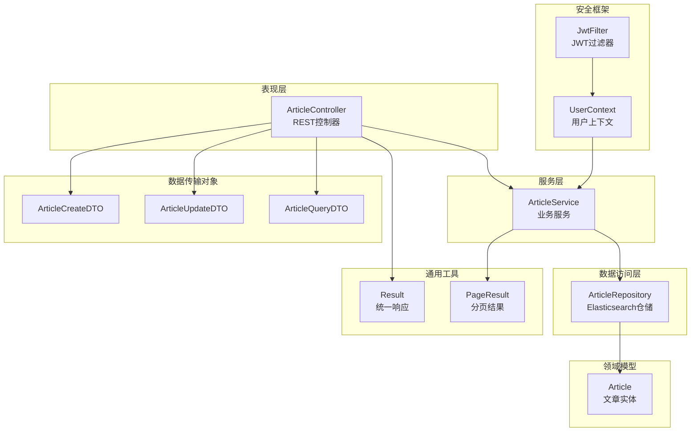
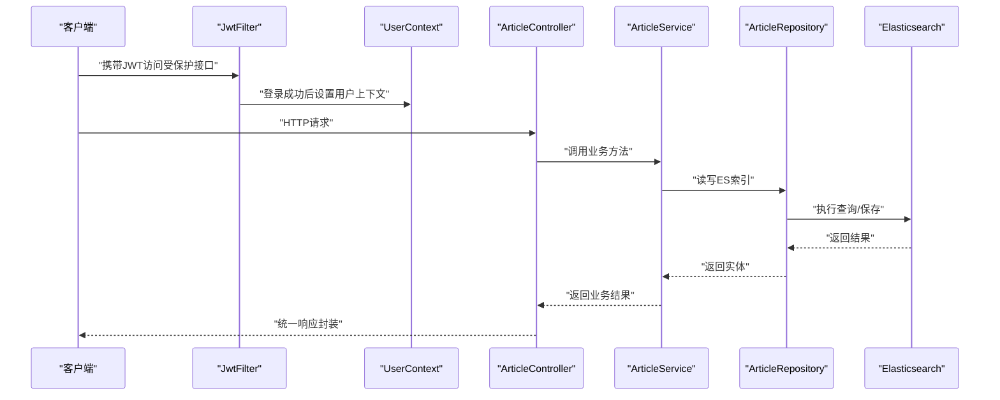
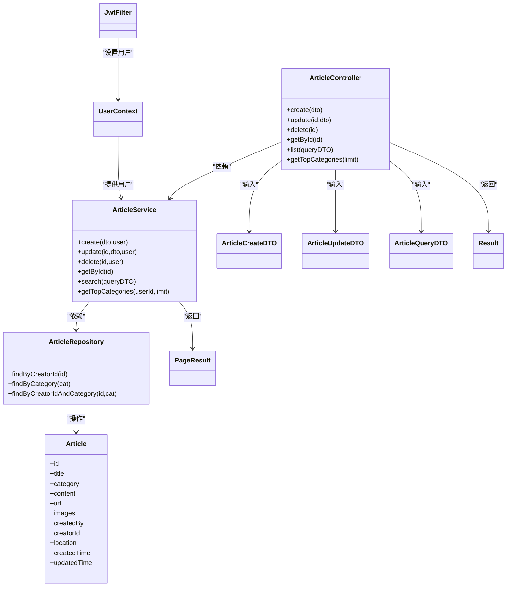

# 文章接口

<cite>
**本文档引用的文件**
- [ArticleController.java](file://src/main/java/com/zhishilu/controller/ArticleController.java)
- [ArticleService.java](file://src/main/java/com/zhishilu/service/ArticleService.java)
- [ArticleRepository.java](file://src/main/java/com/zhishilu/repository/ArticleRepository.java)
- [Article.java](file://src/main/java/com/zhishilu/entity/Article.java)
- [ArticleCreateDTO.java](file://src/main/java/com/zhishilu/dto/ArticleCreateDTO.java)
- [ArticleUpdateDTO.java](file://src/main/java/com/zhishilu/dto/ArticleUpdateDTO.java)
- [ArticleQueryDTO.java](file://src/main/java/com/zhishilu/dto/ArticleQueryDTO.java)
- [Result.java](file://src/main/java/com/zhishilu/common/Result.java)
- [PageResult.java](file://src/main/java/com/zhishilu/common/PageResult.java)
- [GlobalExceptionHandler.java](file://src/main/java/com/zhishilu/exception/GlobalExceptionHandler.java)
- [JwtFilter.java](file://src/main/java/com/zhishilu/shiro/JwtFilter.java)
- [UserContext.java](file://src/main/java/com/zhishilu/util/UserContext.java)
- [application.yml](file://src/main/resources/application.yml)
- [README.md](file://README.md)
</cite>

## 目录
1. [简介](#简介)
2. [项目结构](#项目结构)
3. [核心组件](#核心组件)
4. [架构总览](#架构总览)
5. [详细组件分析](#详细组件分析)
6. [依赖关系分析](#依赖关系分析)
7. [性能考虑](#性能考虑)
8. [故障排除指南](#故障排除指南)
9. [结论](#结论)
10. [附录](#附录)

## 简介
本文件为“文章管理接口”的完整API文档，覆盖文章CRUD操作与高级查询能力，包括：
- GET /api/article/{id} 获取单篇文章
- GET /api/article/list 分页查询
- POST /api/article 创建文章
- PUT /api/article/{id} 更新文章
- DELETE /api/article/{id} 删除文章
- GET /api/article/categories/top 获取用户常用类别

同时详细说明高级查询功能（标题搜索、全文检索、分类筛选等）、数据传输对象（ArticleCreateDTO、ArticleUpdateDTO、ArticleQueryDTO）的数据结构与验证规则、分页参数与排序规则、权限控制与数据一致性保障，并提供性能优化建议与最佳实践。

## 项目结构
系统采用分层架构，主要模块如下：
- 控制器层：接收HTTP请求，调用服务层，返回统一响应格式
- 服务层：实现业务逻辑，进行权限校验与查询构建
- 数据访问层：基于Spring Data Elasticsearch进行索引操作
- 实体与DTO：定义数据模型与传输结构
- 通用工具：统一响应封装、分页封装
- 安全框架：基于Shiro + JWT进行认证与授权

图表来源
- [ArticleController.java](file://src/main/java/com/zhishilu/controller/ArticleController.java#L22-L87)
- [ArticleService.java](file://src/main/java/com/zhishilu/service/ArticleService.java#L34-L199)
- [ArticleRepository.java](file://src/main/java/com/zhishilu/repository/ArticleRepository.java#L12-L29)
- [Article.java](file://src/main/java/com/zhishilu/entity/Article.java#L14-L80)
- [Result.java](file://src/main/java/com/zhishilu/common/Result.java#L8-L71)
- [PageResult.java](file://src/main/java/com/zhishilu/common/PageResult.java#L12-L52)
- [JwtFilter.java](file://src/main/java/com/zhishilu/shiro/JwtFilter.java#L27-L109)
- [UserContext.java](file://src/main/java/com/zhishilu/util/UserContext.java#L8-L33)

章节来源
- [README.md](file://README.md#L1-L133)

## 核心组件
- ArticleController：暴露REST接口，负责参数接收、权限上下文注入与统一响应包装
- ArticleService：实现业务逻辑，包括创建、更新、删除、查询、权限校验与全文检索
- ArticleRepository：基于Elasticsearch的仓储接口，提供基础查询能力
- Article实体：映射到ES索引“zhishilu_article”，字段具备IK分词器配置
- DTOs：ArticleCreateDTO、ArticleUpdateDTO、ArticleQueryDTO，分别用于创建、更新、查询
- Result/PageResult：统一响应与分页封装
- 安全框架：JwtFilter负责认证拦截，UserContext提供线程级用户上下文

章节来源
- [ArticleController.java](file://src/main/java/com/zhishilu/controller/ArticleController.java#L22-L87)
- [ArticleService.java](file://src/main/java/com/zhishilu/service/ArticleService.java#L34-L199)
- [ArticleRepository.java](file://src/main/java/com/zhishilu/repository/ArticleRepository.java#L12-L29)
- [Article.java](file://src/main/java/com/zhishilu/entity/Article.java#L14-L80)
- [ArticleCreateDTO.java](file://src/main/java/com/zhishilu/dto/ArticleCreateDTO.java#L12-L32)
- [ArticleUpdateDTO.java](file://src/main/java/com/zhishilu/dto/ArticleUpdateDTO.java#L11-L24)
- [ArticleQueryDTO.java](file://src/main/java/com/zhishilu/dto/ArticleQueryDTO.java#L8-L46)
- [Result.java](file://src/main/java/com/zhishilu/common/Result.java#L8-L71)
- [PageResult.java](file://src/main/java/com/zhishilu/common/PageResult.java#L12-L52)
- [JwtFilter.java](file://src/main/java/com/zhishilu/shiro/JwtFilter.java#L27-L109)
- [UserContext.java](file://src/main/java/com/zhishilu/util/UserContext.java#L8-L33)

## 架构总览
下图展示了文章接口的端到端调用流程，包括认证、权限校验、业务处理与响应封装。

图表来源
- [JwtFilter.java](file://src/main/java/com/zhishilu/shiro/JwtFilter.java#L69-L75)
- [UserContext.java](file://src/main/java/com/zhishilu/util/UserContext.java#L15-L24)
- [ArticleController.java](file://src/main/java/com/zhishilu/controller/ArticleController.java#L32-L75)
- [ArticleService.java](file://src/main/java/com/zhishilu/service/ArticleService.java#L45-L103)
- [ArticleRepository.java](file://src/main/java/com/zhishilu/repository/ArticleRepository.java#L13-L29)

## 详细组件分析

### REST接口规范

- 基础路径
  - 基础URL：http://localhost:8080/api
  - 文章接口前缀：/article

- 认证与授权
  - 所有文章接口均需通过JWT认证，未登录或令牌无效时返回401
  - 更新与删除操作会校验文章创建者身份，非本人不可操作，返回403

- 统一响应结构
  - 字段：code、message、data、timestamp
  - 成功：code=200；失败：code=400/401/403/500

- 分页与排序
  - 分页参数：page（默认0）、size（默认10）
  - 排序：按createdTime降序

- 高级查询
  - 标题：模糊匹配（match）
  - 内容：全文检索（match）
  - 类别：精确匹配（term）
  - 用户名：精确匹配（term）
  - 地点：精确匹配（term）

章节来源
- [application.yml](file://src/main/resources/application.yml#L1-L47)
- [Result.java](file://src/main/java/com/zhishilu/common/Result.java#L8-L71)
- [PageResult.java](file://src/main/java/com/zhishilu/common/PageResult.java#L12-L52)
- [ArticleService.java](file://src/main/java/com/zhishilu/service/ArticleService.java#L116-L168)
- [JwtFilter.java](file://src/main/java/com/zhishilu/shiro/JwtFilter.java#L69-L85)

#### GET /api/article/{id}
- 功能：获取指定ID的文章详情
- 路径参数：id（字符串）
- 权限：无需额外权限，但需登录
- 响应：Article实体
- 错误：文章不存在返回404（业务异常）

章节来源
- [ArticleController.java](file://src/main/java/com/zhishilu/controller/ArticleController.java#L62-L66)
- [ArticleService.java](file://src/main/java/com/zhishilu/service/ArticleService.java#L108-L111)

#### GET /api/article/list
- 功能：分页查询文章，支持多条件过滤
- 查询参数：
  - title：标题（模糊）
  - category：类别（精确）
  - content：内容（全文检索）
  - username：创建者用户名（精确）
  - location：地点（精确）
  - page：页码（默认0）
  - size：每页条数（默认10）
- 响应：PageResult<Article>
- 排序：createdTime DESC

章节来源
- [ArticleController.java](file://src/main/java/com/zhishilu/controller/ArticleController.java#L71-L75)
- [ArticleService.java](file://src/main/java/com/zhishilu/service/ArticleService.java#L116-L168)
- [ArticleQueryDTO.java](file://src/main/java/com/zhishilu/dto/ArticleQueryDTO.java#L8-L46)

#### POST /api/article
- 功能：创建新文章
- 请求体：ArticleCreateDTO
- 权限：登录用户
- 响应：Article实体
- 关键行为：自动填充创建者信息、创建时间、更新时间

章节来源
- [ArticleController.java](file://src/main/java/com/zhishilu/controller/ArticleController.java#L32-L37)
- [ArticleService.java](file://src/main/java/com/zhishilu/service/ArticleService.java#L45-L59)
- [ArticleCreateDTO.java](file://src/main/java/com/zhishilu/dto/ArticleCreateDTO.java#L12-L32)

#### PUT /api/article/{id}
- 功能：更新文章（部分字段可更新）
- 路径参数：id（字符串）
- 请求体：ArticleUpdateDTO
- 权限：仅文章创建者可更新
- 响应：Article实体
- 关键行为：更新时间自动刷新

章节来源
- [ArticleController.java](file://src/main/java/com/zhishilu/controller/ArticleController.java#L42-L47)
- [ArticleService.java](file://src/main/java/com/zhishilu/service/ArticleService.java#L64-L88)
- [ArticleUpdateDTO.java](file://src/main/java/com/zhishilu/dto/ArticleUpdateDTO.java#L11-L24)

#### DELETE /api/article/{id}
- 功能：删除文章
- 路径参数：id（字符串）
- 权限：仅文章创建者可删除
- 响应：空数据（成功即200）

章节来源
- [ArticleController.java](file://src/main/java/com/zhishilu/controller/ArticleController.java#L52-L57)
- [ArticleService.java](file://src/main/java/com/zhishilu/service/ArticleService.java#L93-L103)

#### GET /api/article/categories/top
- 功能：获取当前用户最常用的类别（前N个）
- 查询参数：limit（默认10）
- 响应：List<Map<String,Object>>，包含category与count
- 应用场景：用于类别推荐

章节来源
- [ArticleController.java](file://src/main/java/com/zhishilu/controller/ArticleController.java#L80-L86)
- [ArticleService.java](file://src/main/java/com/zhishilu/service/ArticleService.java#L173-L198)

### 数据传输对象（DTO）

#### ArticleCreateDTO
- 字段与约束
  - title：必填，最大64字符
  - category：必填，最大32字符
  - content：可选
  - url：可选，最大64字符
  - images：可选，字符串数组
  - location：可选
- 用途：创建文章时的输入校验与装配

章节来源
- [ArticleCreateDTO.java](file://src/main/java/com/zhishilu/dto/ArticleCreateDTO.java#L12-L32)

#### ArticleUpdateDTO
- 字段与约束
  - title：可选，最大64字符
  - content：可选
  - url：可选，最大64字符
  - images：可选，字符串数组
- 用途：更新文章时的部分字段更新

章节来源
- [ArticleUpdateDTO.java](file://src/main/java/com/zhishilu/dto/ArticleUpdateDTO.java#L11-L24)

#### ArticleQueryDTO
- 字段与默认值
  - title：可选（模糊）
  - category：可选（精确）
  - content：可选（全文检索）
  - username：可选（精确）
  - location：可选（精确）
  - page：默认0
  - size：默认10
- 用途：分页查询与多条件过滤

章节来源
- [ArticleQueryDTO.java](file://src/main/java/com/zhishilu/dto/ArticleQueryDTO.java#L8-L46)

### 数据模型与索引

#### Article实体
- 映射索引：zhishilu_article
- 字段类型与分词
  - title/content：Text，使用IK分词器（ik_max_word/ik_smart）
  - category/url/images/location：Keyword
  - createdBy/creatorId：Keyword
  - createdTime/updatedTime：Date
- 关键业务字段
  - createdBy：创建者用户名
  - creatorId：创建者ID
  - createdTime/updatedTime：自动维护

章节来源
- [Article.java](file://src/main/java/com/zhishilu/entity/Article.java#L14-L80)

### 权限控制与数据一致性

- 认证机制
  - JWT令牌放置于请求头Authorization中，前缀为Bearer
  - JwtFilter负责拦截、解析令牌并在登录成功后将用户信息写入UserContext
- 授权策略
  - 更新与删除接口会比对文章的creatorId与当前用户ID，不一致则拒绝
- 数据一致性
  - 创建与更新时自动维护createdTime与updatedTime
  - ES作为唯一持久化介质，确保查询与写入的一致性

章节来源
- [application.yml](file://src/main/resources/application.yml#L26-L31)
- [JwtFilter.java](file://src/main/java/com/zhishilu/shiro/JwtFilter.java#L27-L109)
- [UserContext.java](file://src/main/java/com/zhishilu/util/UserContext.java#L8-L33)
- [ArticleService.java](file://src/main/java/com/zhishilu/service/ArticleService.java#L68-L71)
- [ArticleService.java](file://src/main/java/com/zhishilu/service/ArticleService.java#L97-L100)

### 错误处理与统一响应

- 统一响应结构
  - code：状态码
  - message：消息
  - data：业务数据
  - timestamp：时间戳
- 常见错误
  - 400：参数校验失败
  - 401：未登录或令牌无效
  - 403：无权限
  - 500：系统异常
- 全局异常处理
  - BusinessException：业务异常，透传错误码与消息
  - 认证/授权异常：返回相应状态码与提示
  - 参数校验异常：收集字段错误并返回

章节来源
- [Result.java](file://src/main/java/com/zhishilu/common/Result.java#L8-L71)
- [GlobalExceptionHandler.java](file://src/main/java/com/zhishilu/exception/GlobalExceptionHandler.java#L20-L86)

## 依赖关系分析

图表来源
- [ArticleController.java](file://src/main/java/com/zhishilu/controller/ArticleController.java#L22-L87)
- [ArticleService.java](file://src/main/java/com/zhishilu/service/ArticleService.java#L34-L199)
- [ArticleRepository.java](file://src/main/java/com/zhishilu/repository/ArticleRepository.java#L12-L29)
- [Article.java](file://src/main/java/com/zhishilu/entity/Article.java#L14-L80)
- [Result.java](file://src/main/java/com/zhishilu/common/Result.java#L8-L71)
- [PageResult.java](file://src/main/java/com/zhishilu/common/PageResult.java#L12-L52)
- [JwtFilter.java](file://src/main/java/com/zhishilu/shiro/JwtFilter.java#L27-L109)
- [UserContext.java](file://src/main/java/com/zhishilu/util/UserContext.java#L8-L33)

## 性能考虑
- 索引设计
  - 使用IK分词器提升中文检索效果
  - Keyword字段用于精确匹配，避免分词开销
- 查询优化
  - 多条件组合使用Bool查询，减少不必要的扫描
  - 默认按创建时间倒序，利于热点内容优先展示
- 分页与排序
  - 合理设置page与size，避免超大偏移导致的性能问题
- 缓存与聚合
  - 利用ES聚合统计用户常用类别，减少重复计算
- 并发与事务
  - ES写入为最终一致性，适合高并发读写场景
- 建议
  - 对高频查询字段建立合适的索引映射
  - 控制请求体大小，避免过大的images数组
  - 在网关层限制请求速率，防止滥用

[本节为通用性能建议，不直接分析具体文件]

## 故障排除指南
- 401 未授权
  - 检查Authorization头是否正确，令牌是否过期
  - 确认JwtFilter已正确拦截并解析令牌
- 403 禁止访问
  - 确认当前用户是否为文章创建者
  - 检查UserContext是否正确设置
- 400 参数校验失败
  - 检查DTO字段长度与必填约束
  - 查看全局异常处理器返回的具体字段错误
- 500 系统异常
  - 查看服务端日志，定位异常堆栈
  - 确认Elasticsearch连接配置正确

章节来源
- [GlobalExceptionHandler.java](file://src/main/java/com/zhishilu/exception/GlobalExceptionHandler.java#L20-L86)
- [JwtFilter.java](file://src/main/java/com/zhishilu/shiro/JwtFilter.java#L69-L85)
- [ArticleService.java](file://src/main/java/com/zhishilu/service/ArticleService.java#L68-L71)
- [application.yml](file://src/main/resources/application.yml#L13-L18)

## 结论
本文档系统性地梳理了文章管理接口的REST规范、数据模型、权限控制与错误处理机制，并提供了查询参数、分页与排序的使用方法。通过ES全文检索与聚合能力，系统实现了高效的内容检索与类别推荐。建议在生产环境中结合缓存、限流与监控进一步优化性能与稳定性。

[本节为总结性内容，不直接分析具体文件]

## 附录

### 请求与响应示例（结构化描述）
- 创建文章（POST /api/article）
  - 请求体：ArticleCreateDTO
  - 成功响应：Result<Article>
- 更新文章（PUT /api/article/{id}）
  - 请求体：ArticleUpdateDTO
  - 成功响应：Result<Article>
- 删除文章（DELETE /api/article/{id}）
  - 成功响应：Result<Void>
- 获取文章详情（GET /api/article/{id}）
  - 成功响应：Result<Article>
- 分页查询（GET /api/article/list）
  - 查询参数：ArticleQueryDTO
  - 成功响应：Result<PageResult<Article>>
- 获取常用类别（GET /api/article/categories/top）
  - 查询参数：limit
  - 成功响应：Result<List<Map<String,Object>>>

章节来源
- [ArticleController.java](file://src/main/java/com/zhishilu/controller/ArticleController.java#L32-L86)
- [Result.java](file://src/main/java/com/zhishilu/common/Result.java#L8-L71)
- [PageResult.java](file://src/main/java/com/zhishilu/common/PageResult.java#L12-L52)

### 配置要点
- 服务器端口与上下文路径：server.port、server.servlet.context-path
- Elasticsearch连接：uris、username、password、超时配置
- JWT配置：secret、expiration、header、prefix
- 文件上传：max-file-size、max-request-size、允许类型、最大大小
- 日志级别：root、com.zhishilu、org.springframework.data.elasticsearch

章节来源
- [application.yml](file://src/main/resources/application.yml#L1-L47)