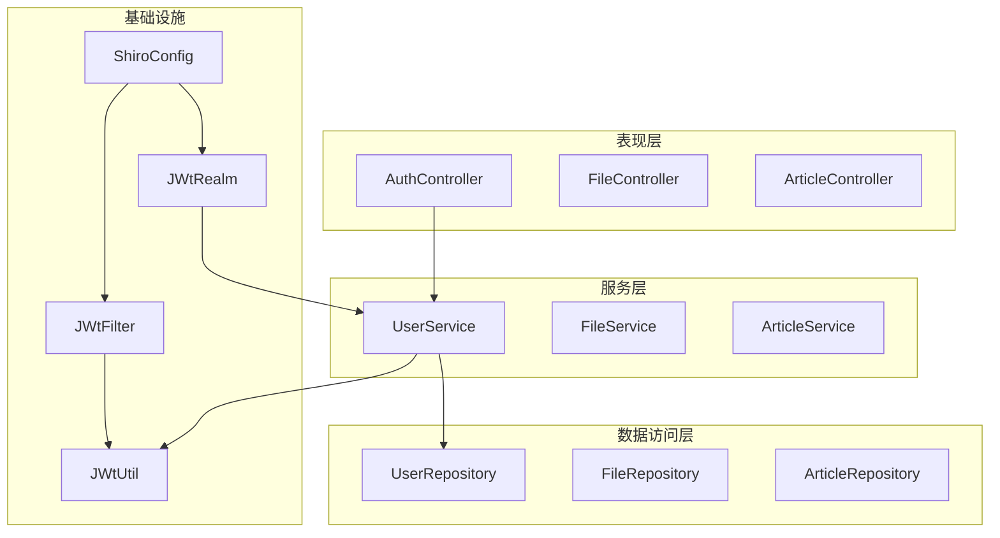
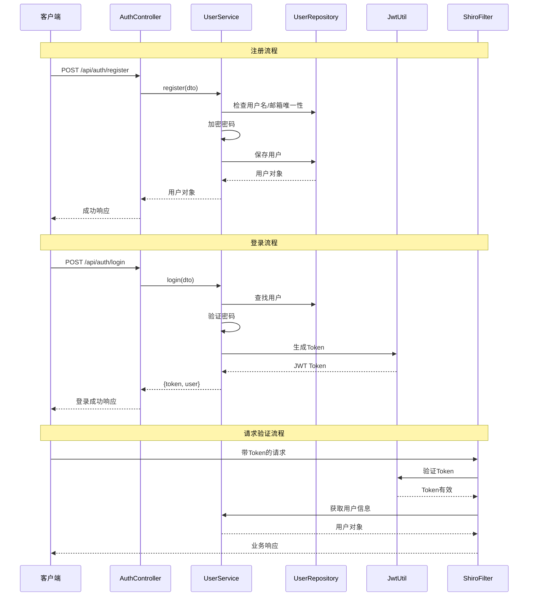
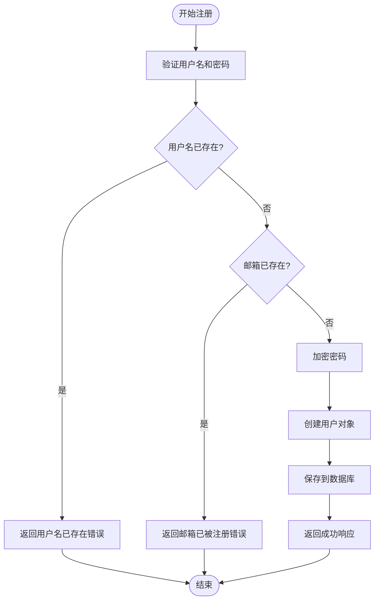
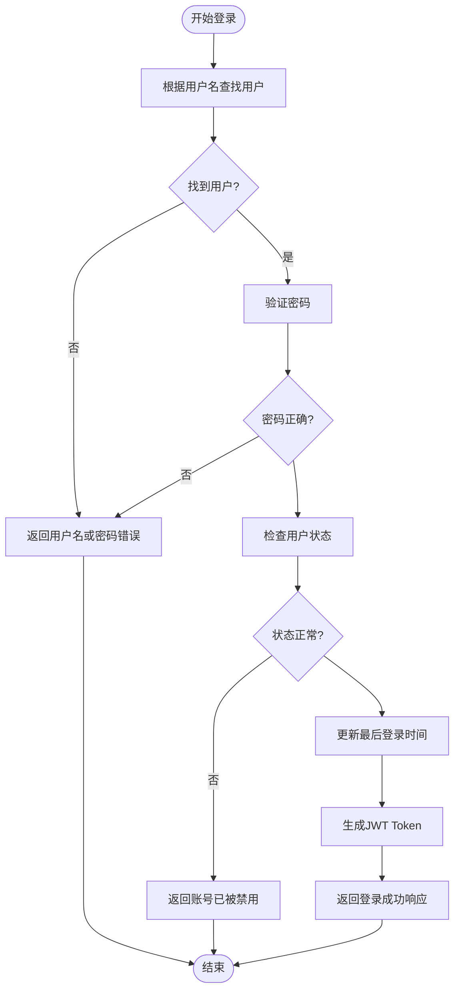
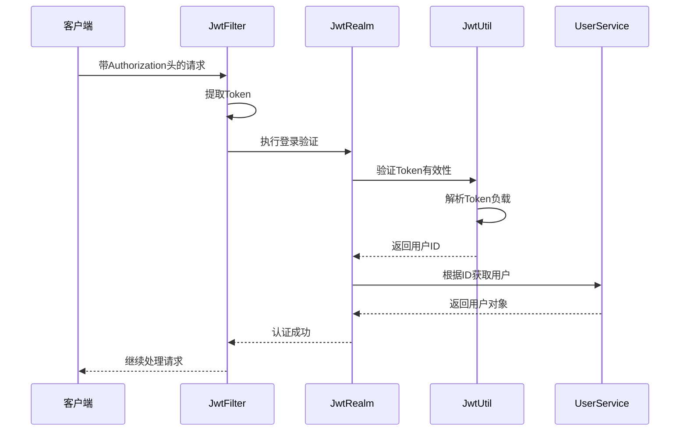
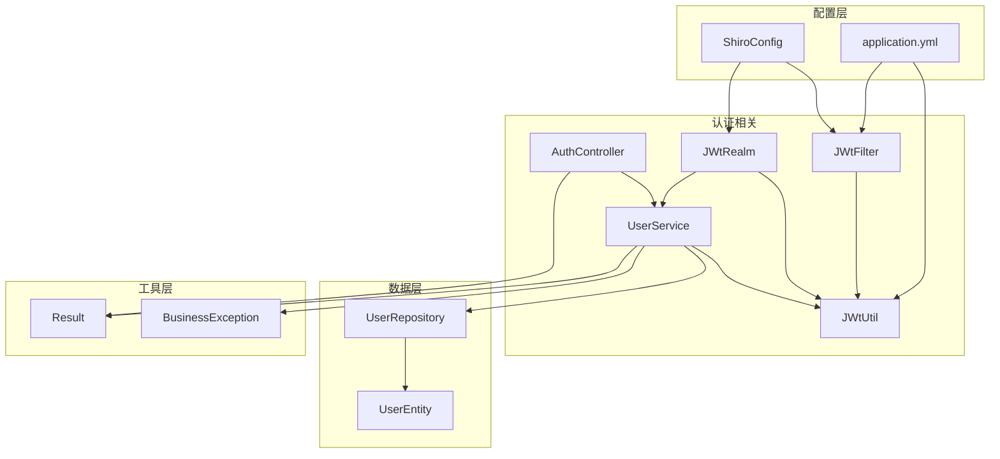

# 认证接口

<cite>
**本文档引用的文件**
- [AuthController.java](file://src/main/java/com/zhishilu/controller/AuthController.java)
- [RegisterDTO.java](file://src/main/java/com/zhishilu/dto/RegisterDTO.java)
- [LoginDTO.java](file://src/main/java/com/zhishilu/dto/LoginDTO.java)
- [UserService.java](file://src/main/java/com/zhishilu/service/UserService.java)
- [User.java](file://src/main/java/com/zhishilu/entity/User.java)
- [JwtUtil.java](file://src/main/java/com/zhishilu/util/JwtUtil.java)
- [JwtFilter.java](file://src/main/java/com/zhishilu/shiro/JwtFilter.java)
- [JwtRealm.java](file://src/main/java/com/zhishilu/shiro/JwtRealm.java)
- [ShiroConfig.java](file://src/main/java/com/zhishilu/config/ShiroConfig.java)
- [Result.java](file://src/main/java/com/zhishilu/common/Result.java)
- [BusinessException.java](file://src/main/java/com/zhishilu/exception/BusinessException.java)
- [application.yml](file://src/main/resources/application.yml)
- [README.md](file://README.md)
</cite>

## 目录
1. [简介](#简介)
2. [项目结构](#项目结构)
3. [核心组件](#核心组件)
4. [架构概览](#架构概览)
5. [详细组件分析](#详细组件分析)
6. [依赖关系分析](#依赖关系分析)
7. [性能考虑](#性能考虑)
8. [故障排除指南](#故障排除指南)
9. [结论](#结论)
10. [附录](#附录)

## 简介

本项目是一个基于Spring Boot的个人知识收藏管理系统，采用Apache Shiro + JWT实现认证鉴权功能。认证接口提供了用户注册和登录两大核心功能，通过统一的RESTful API对外提供服务。

## 项目结构

系统采用标准的分层架构设计，主要包含以下层次：



**图表来源**
- [AuthController.java](file://src/main/java/com/zhishilu/controller/AuthController.java#L17-L20)
- [UserService.java](file://src/main/java/com/zhishilu/service/UserService.java#L24-L25)
- [ShiroConfig.java](file://src/main/java/com/zhishilu/config/ShiroConfig.java#L21-L22)

**章节来源**
- [AuthController.java](file://src/main/java/com/zhishilu/controller/AuthController.java#L1-L50)
- [UserService.java](file://src/main/java/com/zhishilu/service/UserService.java#L1-L128)
- [ShiroConfig.java](file://src/main/java/com/zhishilu/config/ShiroConfig.java#L1-L72)

## 核心组件

### 认证控制器

认证控制器负责处理所有与用户认证相关的HTTP请求，提供注册和登录两个核心接口。

**章节来源**
- [AuthController.java](file://src/main/java/com/zhishilu/controller/AuthController.java#L14-L50)

### 用户服务层

用户服务层实现了具体的业务逻辑，包括用户注册、登录验证、密码加密等功能。

**章节来源**
- [UserService.java](file://src/main/java/com/zhishilu/service/UserService.java#L19-L128)

### DTO数据传输对象

数据传输对象用于封装API请求参数，提供参数验证和数据结构定义。

**章节来源**
- [RegisterDTO.java](file://src/main/java/com/zhishilu/dto/RegisterDTO.java#L8-L28)
- [LoginDTO.java](file://src/main/java/com/zhishilu/dto/LoginDTO.java#L6-L18)

## 架构概览

系统采用JWT + Apache Shiro的认证架构，实现了无状态的认证机制：



**图表来源**
- [AuthController.java](file://src/main/java/com/zhishilu/controller/AuthController.java#L27-L40)
- [UserService.java](file://src/main/java/com/zhishilu/service/UserService.java#L35-L87)
- [JwtUtil.java](file://src/main/java/com/zhishilu/util/JwtUtil.java#L31-L43)
- [JwtFilter.java](file://src/main/java/com/zhishilu/shiro/JwtFilter.java#L39-L85)

## 详细组件分析

### 注册接口 (POST /api/auth/register)

#### 接口规范

**请求URL**: `POST /api/auth/register`

**请求头**:
- Content-Type: application/json
- Accept: application/json

**请求参数**:

| 参数名 | 类型 | 必填 | 长度限制 | 验证规则 | 描述 |
|--------|------|------|----------|----------|------|
| username | String | 是 | 3-20字符 | 非空，字母数字下划线 | 用户名 |
| password | String | 是 | 6-32字符 | 非空，至少6位 | 登录密码 |
| nickname | String | 否 | 最大20字符 | 可选 | 用户昵称 |
| email | String | 否 | 无固定限制 | 邮箱格式 | 用户邮箱 |

**请求示例**:
```json
{
  "username": "john_doe",
  "password": "password123",
  "nickname": "John",
  "email": "john@example.com"
}
```

**响应参数**:

| 字段名 | 类型 | 描述 |
|--------|------|------|
| code | Integer | 响应码，200表示成功 |
| message | String | 响应消息 |
| data | User | 用户对象 |
| timestamp | Long | 时间戳 |

**成功响应示例**:
```json
{
  "code": 200,
  "message": "注册成功",
  "data": {
    "id": "550e8400-e29b-41d4-a716-446655440000",
    "username": "john_doe",
    "nickname": "John",
    "email": "john@example.com",
    "status": 1,
    "createdTime": "2024-01-01T10:00:00",
    "lastLoginTime": null
  },
  "timestamp": 1704067200000
}
```

**错误响应示例**:
```json
{
  "code": 500,
  "message": "用户名已存在",
  "data": null,
  "timestamp": 1704067200000
}
```

**章节来源**
- [AuthController.java](file://src/main/java/com/zhishilu/controller/AuthController.java#L27-L31)
- [RegisterDTO.java](file://src/main/java/com/zhishilu/dto/RegisterDTO.java#L14-L26)
- [UserService.java](file://src/main/java/com/zhishilu/service/UserService.java#L35-L56)
- [Result.java](file://src/main/java/com/zhishilu/common/Result.java#L20-L41)

#### 注册流程图



**图表来源**
- [UserService.java](file://src/main/java/com/zhishilu/service/UserService.java#L35-L56)

### 登录接口 (POST /api/auth/login)

#### 接口规范

**请求URL**: `POST /api/auth/login`

**请求头**:
- Content-Type: application/json
- Accept: application/json

**请求参数**:

| 参数名 | 类型 | 必填 | 验证规则 | 描述 |
|--------|------|------|----------|------|
| username | String | 是 | 非空 | 用户名 |
| password | String | 是 | 非空 | 登录密码 |

**请求示例**:
```json
{
  "username": "john_doe",
  "password": "password123"
}
```

**响应参数**:

| 字段名 | 类型 | 描述 |
|--------|------|------|
| code | Integer | 响应码，200表示成功 |
| message | String | 响应消息 |
| data | Map | 包含token和user对象 |
| timestamp | Long | 时间戳 |

**成功响应示例**:
```json
{
  "code": 200,
  "message": "登录成功",
  "data": {
    "token": "eyJhbGciOiJIUzI1NiIsInR5cCI6IkpXVCJ9...",
    "user": {
      "id": "550e8400-e29b-41d4-a716-446655440000",
      "username": "john_doe",
      "nickname": "John",
      "email": "john@example.com",
      "avatar": null,
      "status": 1,
      "createdTime": "2024-01-01T10:00:00",
      "lastLoginTime": "2024-01-01T15:30:00"
    }
  },
  "timestamp": 1704067200000
}
```

**错误响应示例**:
```json
{
  "code": 500,
  "message": "用户名或密码错误",
  "data": null,
  "timestamp": 1704067200000
}
```

**章节来源**
- [AuthController.java](file://src/main/java/com/zhishilu/controller/AuthController.java#L36-L40)
- [LoginDTO.java](file://src/main/java/com/zhishilu/dto/LoginDTO.java#L12-L16)
- [UserService.java](file://src/main/java/com/zhishilu/service/UserService.java#L61-L87)
- [Result.java](file://src/main/java/com/zhishilu/common/Result.java#L20-L41)

#### 登录流程图



**图表来源**
- [UserService.java](file://src/main/java/com/zhishilu/service/UserService.java#L61-L87)

### JWT Token 机制

#### Token 生成

系统使用HS256算法生成JWT Token，包含以下信息：

**Token 结构**:
- Header: `{ "alg": "HS256", "typ": "JWT" }`
- Payload: 包含用户标识和声明信息
- Signature: 基于密钥的签名

**Token 声明**:
- `userId`: 用户唯一标识符
- `username`: 用户名
- `iat`: 签发时间
- `exp`: 过期时间

#### Token 配置

根据配置文件，Token具有以下属性：
- 密钥: `zhishilu-secret-key-must-be-at-least-256-bits-long-for-hs256`
- 过期时间: 24小时 (86400000毫秒)
- 请求头: `Authorization`
- 前缀: `Bearer `

**章节来源**
- [JwtUtil.java](file://src/main/java/com/zhishilu/util/JwtUtil.java#L22-L43)
- [application.yml](file://src/main/resources/application.yml#L26-L31)

#### Token 验证流程



**图表来源**
- [JwtFilter.java](file://src/main/java/com/zhishilu/shiro/JwtFilter.java#L39-L85)
- [JwtRealm.java](file://src/main/java/com/zhishilu/shiro/JwtRealm.java#L44-L69)
- [JwtUtil.java](file://src/main/java/com/zhishilu/util/JwtUtil.java#L48-L74)

### 安全考虑

#### 密码加密

系统采用SHA-256算法对用户密码进行加密存储，使用固定的盐值进行哈希运算。

**加密流程**:
1. 使用固定盐值 "zhishilu"
2. 对密码进行1024次迭代哈希
3. 将结果以十六进制字符串存储

**章节来源**
- [UserService.java](file://src/main/java/com/zhishilu/service/UserService.java#L108-L110)

#### Token 安全

- 使用HTTPS传输避免中间人攻击
- Token包含过期时间防止长期有效
- 支持从请求头和URL参数两种方式获取Token
- 服务器端严格验证Token有效性

#### 参数验证

系统使用Bean Validation注解确保输入参数的有效性：

**注册参数验证**:
- 用户名: 非空且长度3-20字符
- 密码: 非空且长度6-32字符  
- 昵称: 可选，最大20字符
- 邮箱: 可选，必须符合邮箱格式

**登录参数验证**:
- 用户名: 非空
- 密码: 非空

**章节来源**
- [RegisterDTO.java](file://src/main/java/com/zhishilu/dto/RegisterDTO.java#L14-L26)
- [LoginDTO.java](file://src/main/java/com/zhishilu/dto/LoginDTO.java#L12-L16)

## 依赖关系分析

系统采用模块化设计，各组件之间的依赖关系如下：



**图表来源**
- [AuthController.java](file://src/main/java/com/zhishilu/controller/AuthController.java#L22-L23)
- [UserService.java](file://src/main/java/com/zhishilu/service/UserService.java#L27-L28)
- [ShiroConfig.java](file://src/main/java/com/zhishilu/config/ShiroConfig.java#L27-L39)

**章节来源**
- [AuthController.java](file://src/main/java/com/zhishilu/controller/AuthController.java#L1-L50)
- [UserService.java](file://src/main/java/com/zhishilu/service/UserService.java#L1-L128)
- [ShiroConfig.java](file://src/main/java/com/zhishilu/config/ShiroConfig.java#L1-L72)

## 性能考虑

### 缓存策略

- 用户信息缓存: 建议在应用层添加用户信息缓存，减少数据库查询次数
- Token验证缓存: 可以缓存最近使用的Token，避免重复解析

### 数据库优化

- 用户名和邮箱建立唯一索引，提高查询效率
- 对常用查询字段建立适当的索引

### 并发处理

- 使用连接池管理数据库连接
- 合理设置线程池大小处理异步任务

## 故障排除指南

### 常见错误码

| 错误码 | 错误类型 | 描述 | 解决方案 |
|--------|----------|------|----------|
| 400 | 参数验证错误 | 请求参数不符合验证规则 | 检查请求参数格式和长度 |
| 401 | 未授权 | Token缺失或无效 | 检查Token是否正确传递 |
| 403 | 权限不足 | 用户状态异常 | 检查用户状态是否正常 |
| 500 | 业务错误 | 服务器内部错误 | 查看服务器日志 |

### 错误处理机制

系统通过统一的异常处理机制处理各种错误情况：

**业务异常处理**:
- 用户名已存在
- 邮箱已被注册  
- 用户名或密码错误
- 账号已被禁用

**章节来源**
- [BusinessException.java](file://src/main/java/com/zhishilu/exception/BusinessException.java#L9-L22)
- [UserService.java](file://src/main/java/com/zhishilu/service/UserService.java#L38-L73)

### 前端集成示例

#### JavaScript 示例

```javascript
// 注册示例
async function register(username, password, email) {
    const response = await fetch('/api/auth/register', {
        method: 'POST',
        headers: {
            'Content-Type': 'application/json'
        },
        body: JSON.stringify({
            username,
            password,
            email
        })
    });
    
    const result = await response.json();
    return result;
}

// 登录示例
async function login(username, password) {
    const response = await fetch('/api/auth/login', {
        method: 'POST',
        headers: {
            'Content-Type': 'application/json'
        },
        body: JSON.stringify({
            username,
            password
        })
    });
    
    const result = await response.json();
    if (result.code === 200) {
        // 存储Token
        localStorage.setItem('token', result.data.token);
        return result.data.user;
    }
    return null;
}

// 带Token的请求示例
async function apiCall(url, data) {
    const token = localStorage.getItem('token');
    const response = await fetch(url, {
        method: 'POST',
        headers: {
            'Content-Type': 'application/json',
            'Authorization': `Bearer ${token}`
        },
        body: JSON.stringify(data)
    });
    
    return response.json();
}
```

#### 常见问题解决

**问题1: Token过期**
- 现象: 请求返回401未授权
- 解决: 重新登录获取新Token

**问题2: CORS跨域问题**
- 现象: 浏览器控制台出现跨域错误
- 解决: 配置正确的CORS头或使用代理

**问题3: 参数验证失败**
- 现象: 返回参数验证错误
- 解决: 检查用户名、密码长度和格式

## 结论

本认证系统采用现代的JWT + Apache Shiro架构，提供了安全可靠的用户认证功能。系统具有以下特点：

1. **安全性**: 采用密码哈希加密、Token过期机制、参数验证等多重安全措施
2. **易用性**: 提供清晰的API接口和详细的错误信息
3. **可扩展性**: 模块化设计便于功能扩展和维护
4. **性能**: 无状态设计支持水平扩展

建议在生产环境中进一步增强安全措施，如添加密码强度验证、IP白名单、登录尝试限制等功能。

## 附录

### API 完整列表

| 接口 | 方法 | 描述 |
|------|------|------|
| /api/auth/register | POST | 用户注册 |
| /api/auth/login | POST | 用户登录 |
| /api/auth/unauthorized | GET | 未授权提示 |

### 配置参考

**JWT配置项**:
- `jwt.secret`: JWT密钥
- `jwt.expiration`: Token过期时间(毫秒)
- `jwt.header`: 请求头名称
- `jwt.prefix`: Token前缀

**章节来源**
- [application.yml](file://src/main/resources/application.yml#L26-L31)
- [README.md](file://README.md#L49-L55)