# 文章详情视图

<cite>
**本文档引用的文件**
- [ArticleDetailView.vue](file://frontend/src/views/ArticleDetailView.vue)
- [ArticleDetail.vue](file://frontend/src/components/profile/ArticleDetail.vue)
- [ProfileView.vue](file://frontend/src/views/ProfileView.vue)
- [ArticleController.java](file://src/main/java/com/zhishilu/controller/ArticleController.java)
- [ArticleService.java](file://src/main/java/com/zhishilu/service/ArticleService.java)
- [Article.java](file://src/main/java/com/zhishilu/entity/Article.java)
- [ArticleRepository.java](file://src/main/java/com/zhishilu/repository/ArticleRepository.java)
- [ArticleResp.java](file://src/main/java/com/zhishilu/resp/ArticleResp.java)
- [request.ts](file://frontend/src/utils/request.ts)
- [image.ts](file://frontend/src/utils/image.ts)
- [index.ts](file://frontend/src/router/index.ts)
- [application.yml](file://src/main/resources/application.yml)
- [article-mapping.json](file://src/main/resources/article-mapping.json)
</cite>

## 更新摘要
**变更内容**
- 新增独立的 ArticleDetail 组件用于个人中心文章详情展示
- 改进主文章详情视图的图片画廊功能和交互体验
- 在个人中心中集成新的 ArticleDetail 组件
- 增强图片预览模态框的导航和指示器功能
- 新增鼠标滚轮图片导航、触摸手势支持、键盘导航
- 集成搜索功能和社交媒体图标
- 改进加载状态和响应式设计

## 目录
1. [简介](#简介)
2. [项目结构](#项目结构)
3. [核心组件](#核心组件)
4. [架构概览](#架构概览)
5. [详细组件分析](#详细组件分析)
6. [依赖关系分析](#依赖关系分析)
7. [性能考虑](#性能考虑)
8. [故障排除指南](#故障排除指南)
9. [结论](#结论)

## 简介

文章详情视图是知识路（zhishilu）项目中的核心功能模块，负责展示单篇文章的完整内容。该视图采用响应式设计，支持桌面端和移动端的无缝浏览体验，包含图片画廊、内容展示、作者信息、评论系统和交互功能等完整的阅读体验。

**更新** 新增了独立的 ArticleDetail 组件，专门用于个人中心的文章详情展示，提供更简洁的阅读体验。主文章详情视图现已集成鼠标滚轮导航、触摸手势支持、键盘导航等增强功能。

## 项目结构

知识路项目采用前后端分离架构，文章详情视图作为前端Vue.js应用的重要组成部分，与Spring Boot后端服务协同工作。

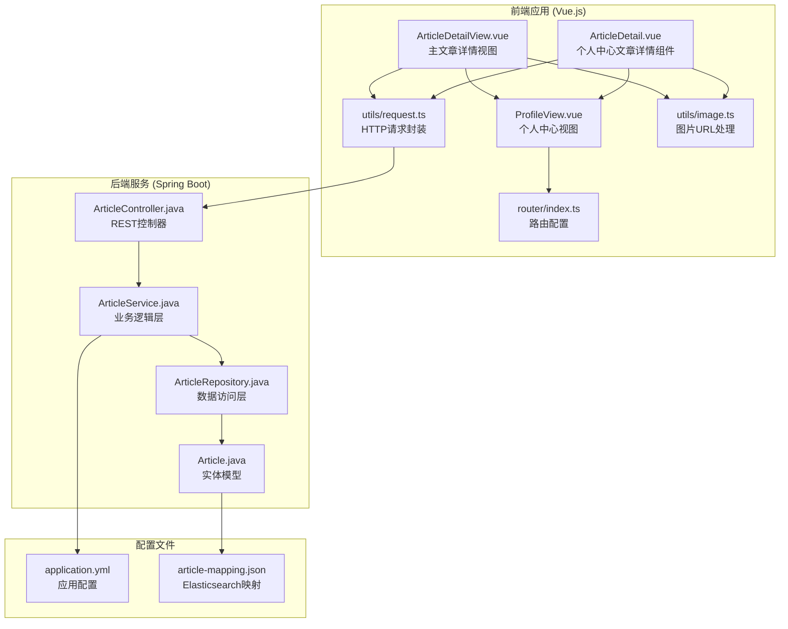

**图表来源**
- [ArticleDetailView.vue](file://frontend/src/views/ArticleDetailView.vue#L1-L759)
- [ArticleDetail.vue](file://frontend/src/components/profile/ArticleDetail.vue#L1-L243)
- [ProfileView.vue](file://frontend/src/views/ProfileView.vue#L388-L405)
- [ArticleController.java](file://src/main/java/com/zhishilu/controller/ArticleController.java#L1-L187)

**章节来源**
- [ArticleDetailView.vue](file://frontend/src/views/ArticleDetailView.vue#L1-L759)
- [ArticleDetail.vue](file://frontend/src/components/profile/ArticleDetail.vue#L1-L243)
- [ProfileView.vue](file://frontend/src/views/ProfileView.vue#L388-L405)
- [index.ts](file://frontend/src/router/index.ts#L1-L120)

## 核心组件

文章详情视图由多个精心设计的组件构成，每个组件都有明确的职责和功能：

### 主要组件架构

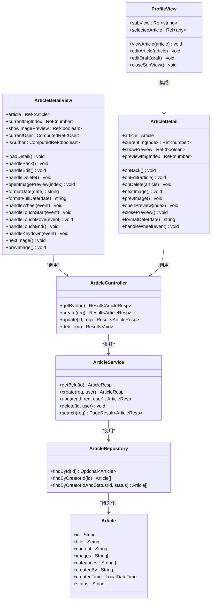

**图表来源**
- [ArticleDetailView.vue](file://frontend/src/views/ArticleDetailView.vue#L370-L712)
- [ArticleDetail.vue](file://frontend/src/components/profile/ArticleDetail.vue#L132-L243)
- [ProfileView.vue](file://frontend/src/views/ProfileView.vue#L494-L531)
- [ArticleController.java](file://src/main/java/com/zhishilu/controller/ArticleController.java#L69-L74)

### 数据流架构

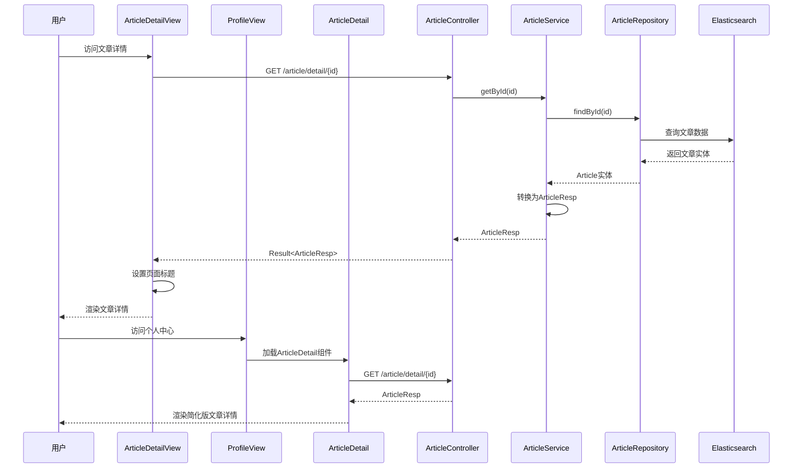

**图表来源**
- [ArticleDetailView.vue](file://frontend/src/views/ArticleDetailView.vue#L628-L639)
- [ProfileView.vue](file://frontend/src/views/ProfileView.vue#L495-L498)
- [ArticleDetail.vue](file://frontend/src/components/profile/ArticleDetail.vue#L1-L243)

**章节来源**
- [ArticleDetailView.vue](file://frontend/src/views/ArticleDetailView.vue#L1-L759)
- [ArticleDetail.vue](file://frontend/src/components/profile/ArticleDetail.vue#L1-L243)
- [ProfileView.vue](file://frontend/src/views/ProfileView.vue#L388-L405)
- [ArticleController.java](file://src/main/java/com/zhishilu/controller/ArticleController.java#L1-L187)

## 架构概览

文章详情视图采用现代化的渐进式Web应用架构，结合了Vue.js的响应式特性和Spring Boot的微服务架构优势。

### 技术栈架构

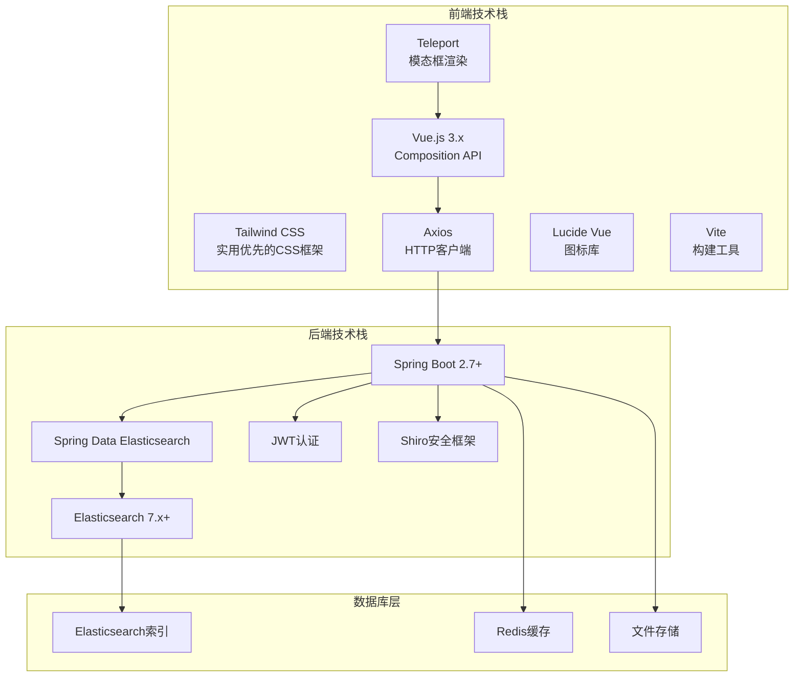

**图表来源**
- [application.yml](file://src/main/resources/application.yml#L1-L53)
- [index.ts](file://frontend/src/router/index.ts#L1-L120)

### 状态管理模式

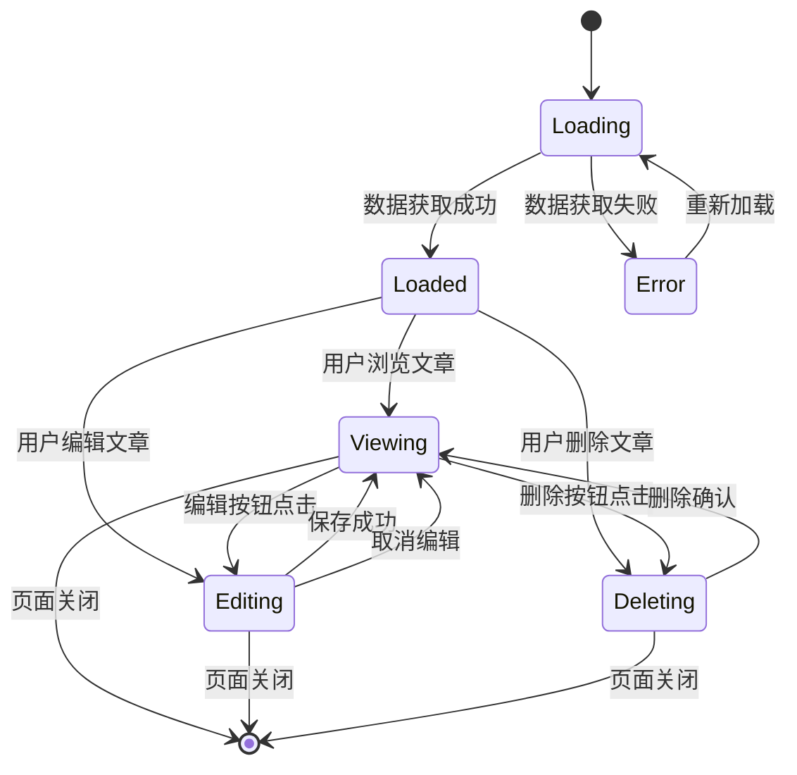

## 详细组件分析

### 主文章详情视图组件

主文章详情视图提供了完整的阅读体验，包含图片画廊、作者信息、评论系统等丰富功能，并新增了多种导航方式。

#### 主组件功能特性

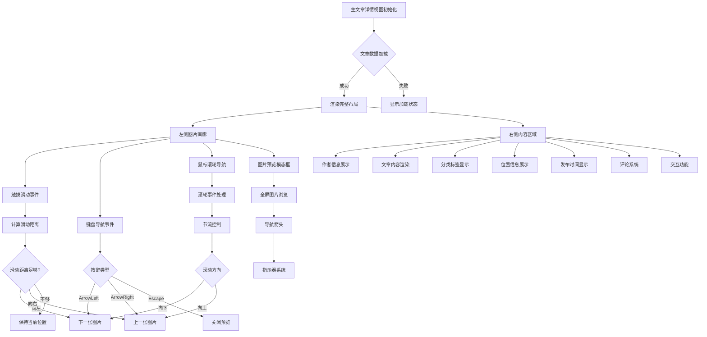

**图表来源**
- [ArticleDetailView.vue](file://frontend/src/views/ArticleDetailView.vue#L77-L122)
- [ArticleDetailView.vue](file://frontend/src/views/ArticleDetailView.vue#L476-L587)

#### 增强的图片画廊功能

**更新** 主文章详情视图的图片画廊功能得到了显著改进：

- **鼠标滚轮导航**：支持垂直滚动切换图片，带有节流控制防止快速切换
- **触摸手势支持**：完整的触摸滑动事件处理，支持左右滑动切换
- **键盘导航**：支持左右箭头键快速切换图片
- **响应式布局**：根据屏幕尺寸调整图片画廊宽度（55%-60%）
- **增强的触摸手势**：支持更灵敏的滑动操作
- **改进的键盘导航**：支持左右箭头键快速切换
- **优化的预览体验**：全屏图片浏览支持手势和键盘导航

**章节来源**
- [ArticleDetailView.vue](file://frontend/src/views/ArticleDetailView.vue#L77-L122)
- [ArticleDetailView.vue](file://frontend/src/views/ArticleDetailView.vue#L476-L587)

### 独立文章详情组件

**新增** ArticleDetail 组件专门用于个人中心的文章详情展示，提供更简洁的阅读体验，并集成了相同的导航功能。

#### 组件设计特点

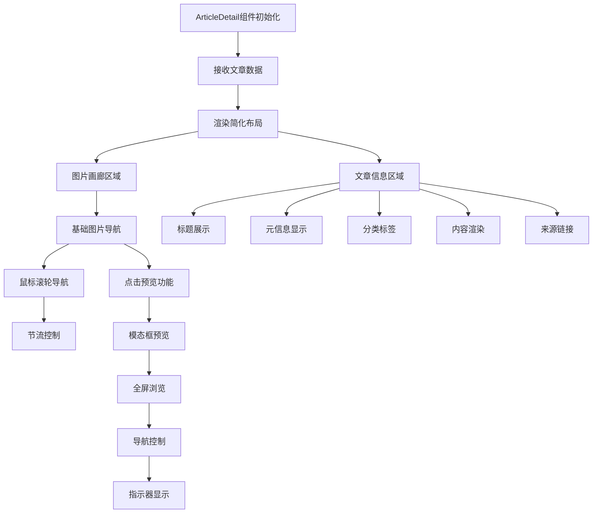

**图表来源**
- [ArticleDetail.vue](file://frontend/src/components/profile/ArticleDetail.vue#L1-L94)
- [ArticleDetail.vue](file://frontend/src/components/profile/ArticleDetail.vue#L28-L60)

#### 组件交互功能

- **事件驱动**：通过事件发射器与父组件通信
- **简化导航**：提供基本的图片切换功能，包括鼠标滚轮导航
- **响应式设计**：适配不同屏幕尺寸
- **模态框预览**：支持全屏图片浏览
- **节流控制**：防止快速滚动导致的频繁切换

**章节来源**
- [ArticleDetail.vue](file://frontend/src/components/profile/ArticleDetail.vue#L1-L243)

### 个人中心集成

**更新** 个人中心视图集成了新的 ArticleDetail 组件，提供统一的文章管理体验。

#### 集成架构

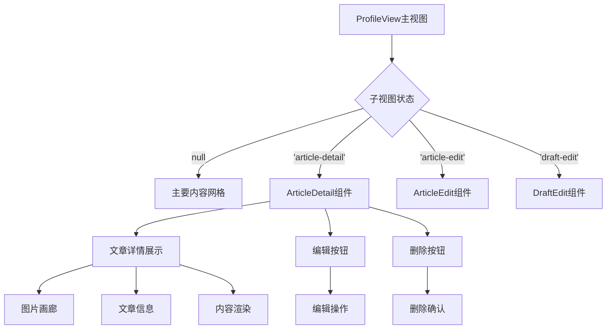

**图表来源**
- [ProfileView.vue](file://frontend/src/views/ProfileView.vue#L388-L405)
- [ProfileView.vue](file://frontend/src/views/ProfileView.vue#L391-L395)

**章节来源**
- [ProfileView.vue](file://frontend/src/views/ProfileView.vue#L388-L405)
- [ProfileView.vue](file://frontend/src/views/ProfileView.vue#L494-L531)

### 内容展示组件

内容展示组件负责文章标题、正文内容、分类标签和位置信息的渲染。

#### 内容渲染流程

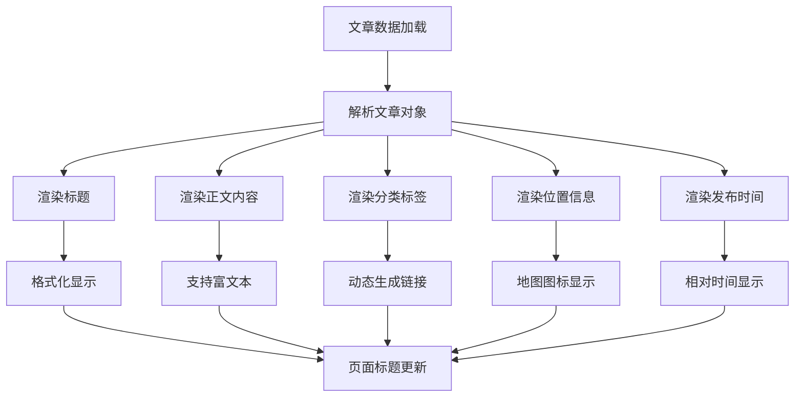

**图表来源**
- [ArticleDetailView.vue](file://frontend/src/views/ArticleDetailView.vue#L163-L187)
- [ArticleDetailView.vue](file://frontend/src/views/ArticleDetailView.vue#L641-L663)

**章节来源**
- [ArticleDetailView.vue](file://frontend/src/views/ArticleDetailView.vue#L163-L187)

### 作者信息组件

作者信息组件展示了文章创建者的相关信息，包括头像、用户名和发布时间。

#### 作者信息渲染逻辑

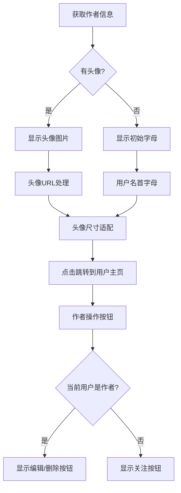

**图表来源**
- [ArticleDetailView.vue](file://frontend/src/views/ArticleDetailView.vue#L127-L158)
- [ArticleDetailView.vue](file://frontend/src/views/ArticleDetailView.vue#L466-L470)

**章节来源**
- [ArticleDetailView.vue](file://frontend/src/views/ArticleDetailView.vue#L127-L158)

### 评论系统组件

评论系统组件提供了文章评论的展示和交互功能，虽然在当前实现中使用模拟数据，但具备完整的扩展能力。

#### 评论数据结构

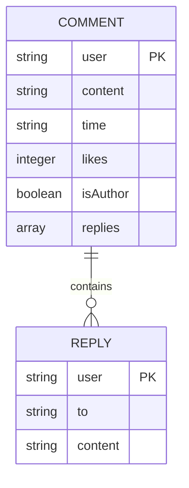

**图表来源**
- [ArticleDetailView.vue](file://frontend/src/views/ArticleDetailView.vue#L590-L626)

**章节来源**
- [ArticleDetailView.vue](file://frontend/src/views/ArticleDetailView.vue#L590-L626)

### 交互功能组件

交互功能组件包括点赞、收藏、分享和评论发送等用户交互功能。

#### 交互状态管理

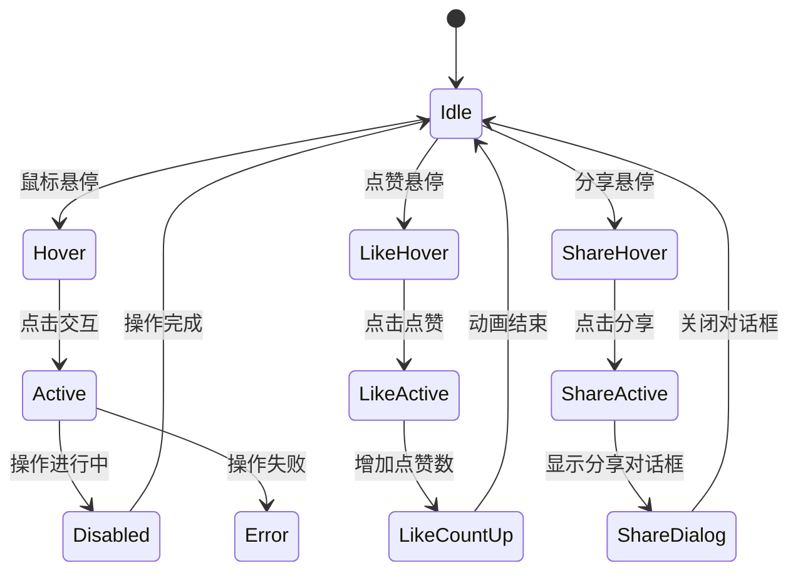

**图表来源**
- [ArticleDetailView.vue](file://frontend/src/views/ArticleDetailView.vue#L236-L269)

**章节来源**
- [ArticleDetailView.vue](file://frontend/src/views/ArticleDetailView.vue#L236-L269)

### 搜索功能集成

**新增** 主文章详情视图集成了完整的搜索功能，提供多种搜索选项和占位符提示。

#### 搜索功能架构

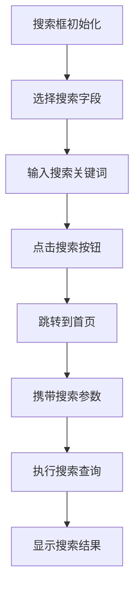

**图表来源**
- [ArticleDetailView.vue](file://frontend/src/views/ArticleDetailView.vue#L11-L46)
- [ArticleDetailView.vue](file://frontend/src/views/ArticleDetailView.vue#L424-L433)

**章节来源**
- [ArticleDetailView.vue](file://frontend/src/views/ArticleDetailView.vue#L11-L46)
- [ArticleDetailView.vue](file://frontend/src/views/ArticleDetailView.vue#L424-L433)

### 社交媒体图标集成

**新增** 底部区域集成了社交媒体图标，提供项目相关的外部链接。

#### 社交媒体集成

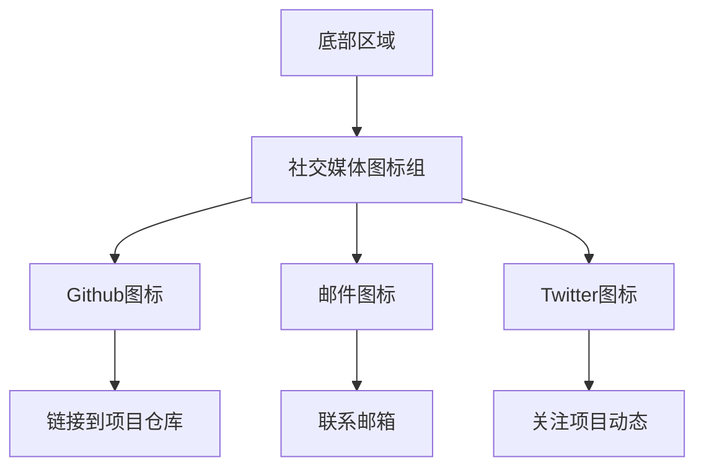

**图表来源**
- [ArticleDetailView.vue](file://frontend/src/views/ArticleDetailView.vue#L296-L304)

**章节来源**
- [ArticleDetailView.vue](file://frontend/src/views/ArticleDetailView.vue#L296-L304)

## 依赖关系分析

文章详情视图的依赖关系体现了清晰的分层架构设计，各层职责明确，耦合度低。

### 前端依赖关系

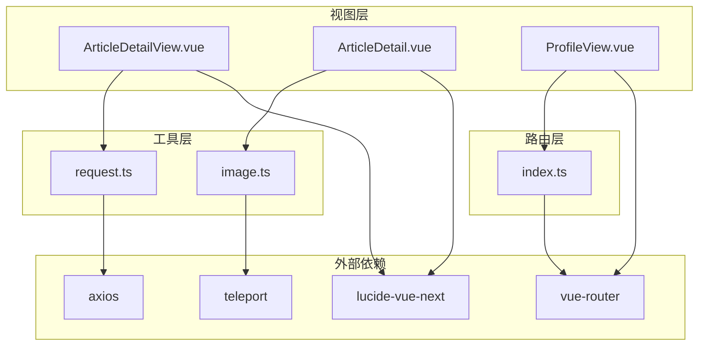

**图表来源**
- [ArticleDetailView.vue](file://frontend/src/views/ArticleDetailView.vue#L379-L380)
- [ArticleDetail.vue](file://frontend/src/components/profile/ArticleDetail.vue#L134-L135)
- [ProfileView.vue](file://frontend/src/views/ProfileView.vue#L431-L433)
- [index.ts](file://frontend/src/router/index.ts#L1-L120)

### 后端依赖关系

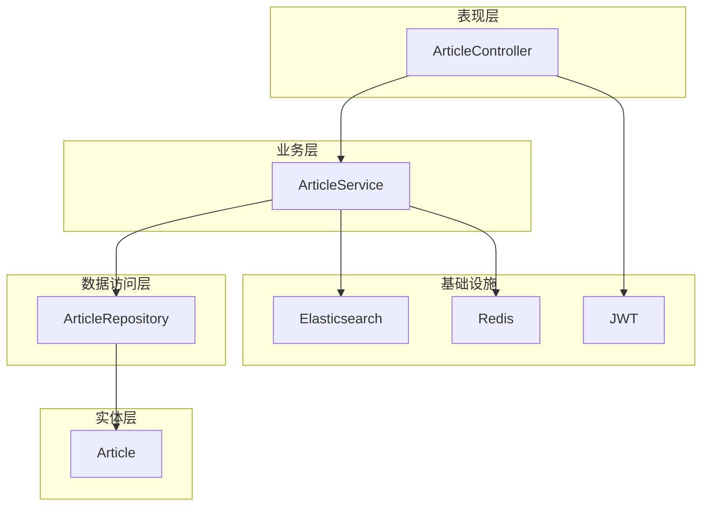

**图表来源**
- [ArticleController.java](file://src/main/java/com/zhishilu/controller/ArticleController.java#L1-L187)
- [ArticleService.java](file://src/main/java/com/zhishilu/service/ArticleService.java#L1-L1019)
- [ArticleRepository.java](file://src/main/java/com/zhishilu/repository/ArticleRepository.java#L1-L25)
- [Article.java](file://src/main/java/com/zhishilu/entity/Article.java#L1-L87)

**章节来源**
- [ArticleController.java](file://src/main/java/com/zhishilu/controller/ArticleController.java#L1-L187)
- [ArticleService.java](file://src/main/java/com/zhishilu/service/ArticleService.java#L1-L1019)

## 性能考虑

文章详情视图在设计时充分考虑了性能优化，采用了多种策略来提升用户体验。

### 前端性能优化

#### 图片懒加载和预加载
- 使用Vue的条件渲染避免不必要的DOM元素创建
- 图片URL通过工具函数统一处理，支持CDN加速
- 移动端和桌面端采用不同的图片尺寸策略

#### 内存管理
- 组件卸载时移除事件监听器
- 使用响应式引用而非复杂对象深拷贝
- 图片预览模态框采用Teleport避免DOM树过深

#### 渲染优化
- 使用CSS Grid和Flexbox实现高效的布局
- 图片轮播使用transform属性而非改变DOM结构
- 滚动事件使用节流处理

#### 组件优化
- **独立组件复用**：ArticleDetail组件可在多个场景中复用
- **事件驱动通信**：通过事件发射器减少组件间耦合
- **响应式布局**：适配不同屏幕尺寸的优化布局
- **节流控制**：鼠标滚轮导航使用节流防止频繁切换

### 后端性能优化

#### 数据库查询优化
- Elasticsearch全文搜索支持高并发查询
- 使用分页查询避免大量数据传输
- 结果集包含高亮片段减少前端处理

#### 缓存策略
- Redis缓存热门文章数据
- 图片URL缓存减少重复计算
- JWT令牌缓存提升认证效率

#### 异步处理
- 文章创建/更新异步同步搜索建议
- 异步更新搜索频率统计
- 异步增量更新类别统计

**章节来源**
- [ArticleService.java](file://src/main/java/com/zhishilu/service/ArticleService.java#L95-L98)
- [ArticleService.java](file://src/main/java/com/zhishilu/service/ArticleService.java#L327-L328)
- [ArticleService.java](file://src/main/java/com/zhishilu/service/ArticleService.java#L664-L787)

## 故障排除指南

### 常见问题及解决方案

#### 图片加载失败
**问题描述**：文章图片无法正常显示
**可能原因**：
- 图片路径配置错误
- 文件存储服务未启动
- 网络连接问题

**解决方案**：
1. 检查图片URL生成逻辑
2. 验证文件存储服务配置
3. 确认网络连接状态

#### 文章详情加载超时
**问题描述**：文章详情页面长时间处于加载状态
**可能原因**：
- Elasticsearch服务异常
- 网络延迟过高
- 数据量过大

**解决方案**：
1. 检查Elasticsearch连接状态
2. 优化查询条件
3. 实现分页加载

#### 用户权限验证失败
**问题描述**：编辑或删除文章时提示权限不足
**可能原因**：
- JWT令牌过期
- 用户身份验证失败
- 权限检查逻辑错误

**解决方案**：
1. 检查JWT令牌有效期
2. 验证用户身份信息
3. 审核权限检查逻辑

#### 组件通信问题
**问题描述**：ArticleDetail组件无法正确接收文章数据
**可能原因**：
- 父组件传递的数据格式错误
- 事件发射器参数传递问题
- 组件生命周期管理不当

**解决方案**：
1. 检查父组件传入的props格式
2. 验证事件发射器的参数传递
3. 确保组件正确挂载和卸载

#### 导航功能异常
**问题描述**：鼠标滚轮、触摸手势或键盘导航失效
**可能原因**：
- 事件监听器未正确绑定
- 节流控制逻辑错误
- 边界条件检查问题

**解决方案**：
1. 检查事件处理器绑定
2. 验证节流控制参数
3. 确认边界条件判断

### 调试技巧

#### 前端调试
- 使用浏览器开发者工具监控网络请求
- 检查Vue DevTools中的组件状态
- 监控图片加载性能
- 使用Vue DevTools调试组件通信
- 检查事件监听器是否正确绑定

#### 后端调试
- 查看Elasticsearch查询日志
- 监控数据库连接池状态
- 检查JWT令牌生成和验证过程

**章节来源**
- [request.ts](file://frontend/src/utils/request.ts#L34-L62)
- [ArticleService.java](file://src/main/java/com/zhishilu/service/ArticleService.java#L292-L309)

## 结论

文章详情视图作为知识路项目的核心功能模块，展现了现代Web应用开发的最佳实践。通过精心设计的组件架构、完善的交互体验和全面的性能优化，为用户提供了优质的阅读体验。

**更新** 新增的 ArticleDetail 组件进一步增强了系统的灵活性和可维护性，为不同场景下的文章展示提供了合适的解决方案。主文章详情视图的增强功能包括鼠标滚轮导航、触摸手势支持、键盘导航等，大大提升了用户体验。

### 设计亮点

1. **响应式设计**：完美适配各种设备屏幕尺寸
2. **丰富的交互**：支持触摸、键盘和鼠标等多种交互方式
3. **性能优化**：采用多种策略确保流畅的用户体验
4. **可扩展性**：清晰的架构设计便于功能扩展和维护
5. **组件复用**：独立的ArticleDetail组件可在多个场景中使用
6. **增强导航**：支持多种导航方式满足不同用户需求
7. **搜索集成**：内置搜索功能提升内容发现体验
8. **社交集成**：社交媒体图标增强项目展示效果

### 技术优势

- **前后端分离**：采用现代化的技术栈和架构模式
- **实时数据**：基于Elasticsearch的实时搜索和展示
- **安全可靠**：完善的权限控制和数据验证机制
- **易于维护**：模块化的代码结构和清晰的文档
- **灵活架构**：支持多种组件组合和复用场景
- **性能优化**：节流控制、内存管理和渲染优化
- **用户体验**：多样的导航方式和流畅的交互反馈

该文章详情视图为整个知识路平台奠定了坚实的技术基础，为后续的功能扩展和性能优化提供了良好的起点。新增的ArticleDetail组件和增强的导航功能特别适合个人中心等场景，提供了更加简洁和专注的阅读体验。