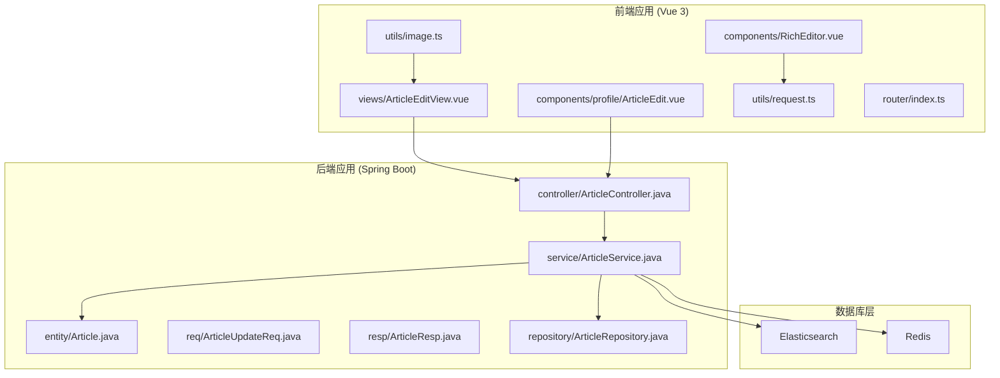
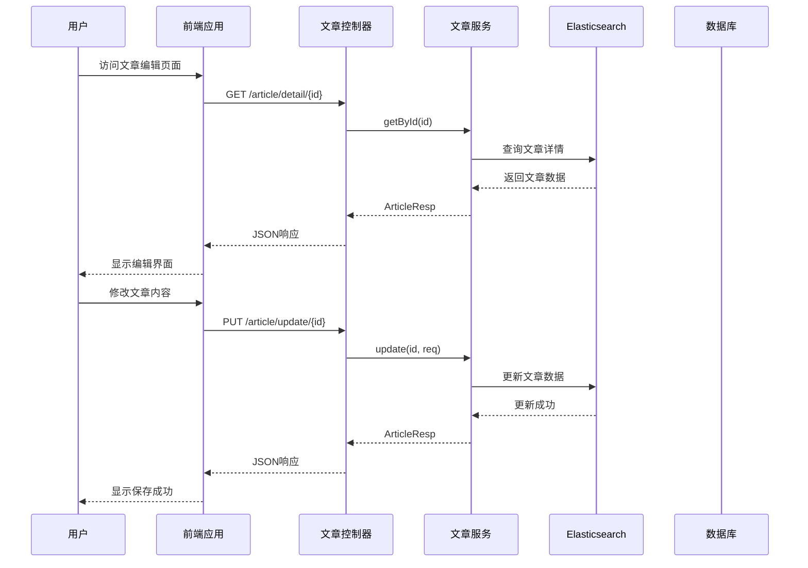
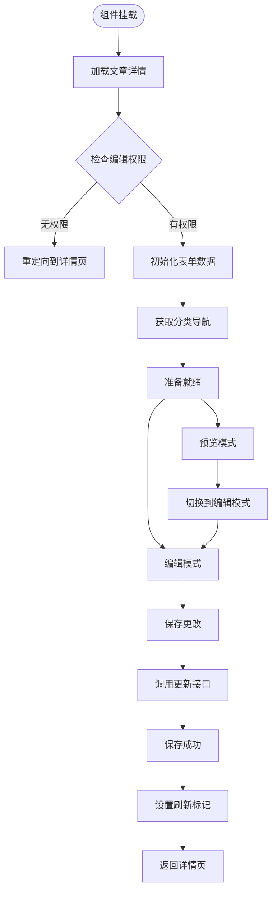
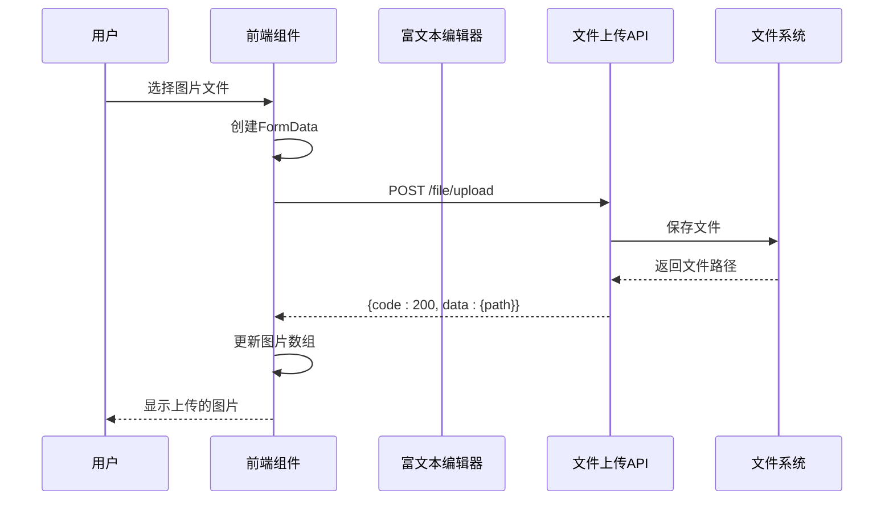
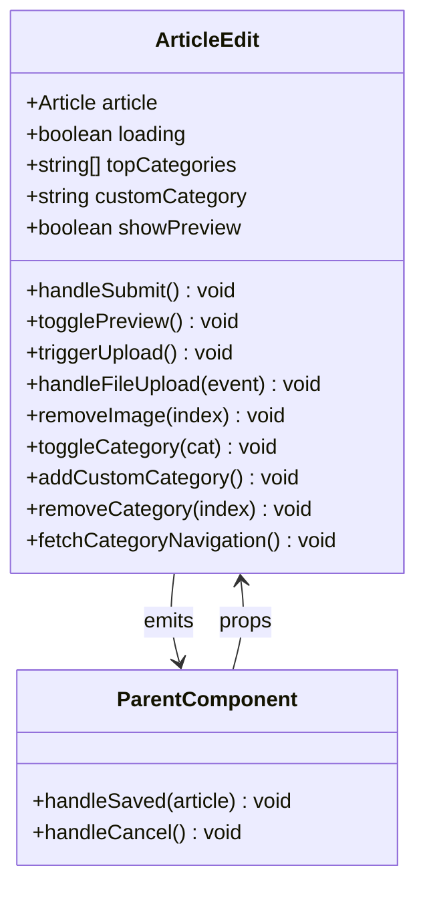
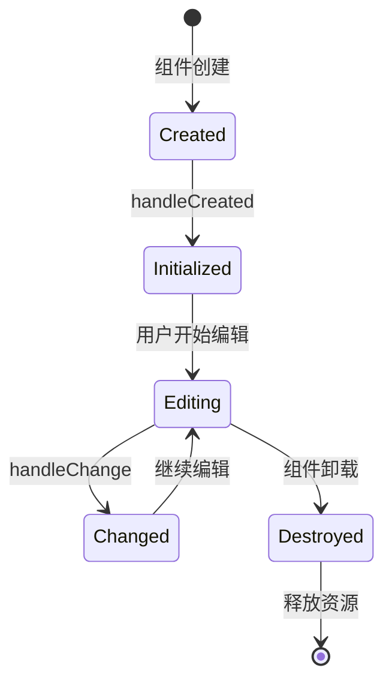
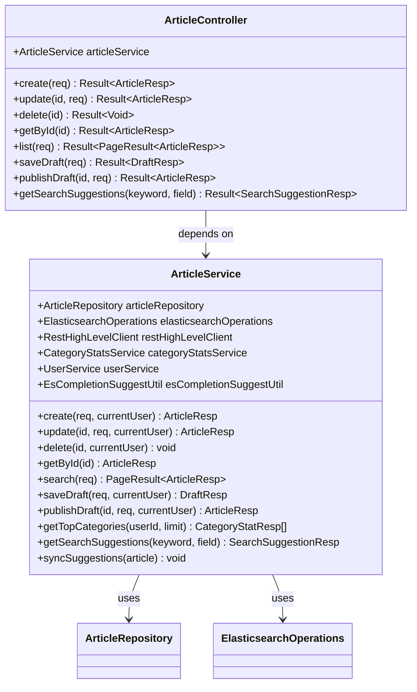
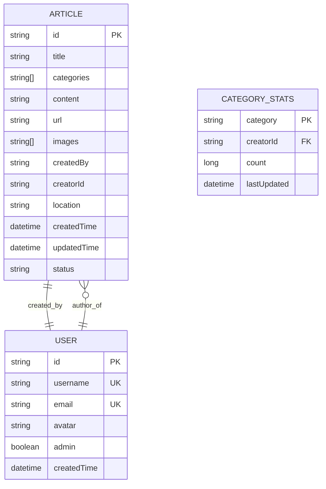
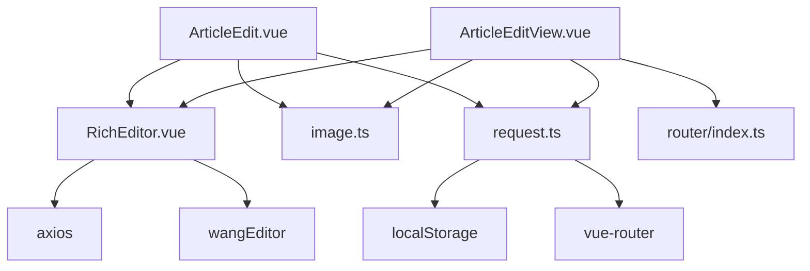
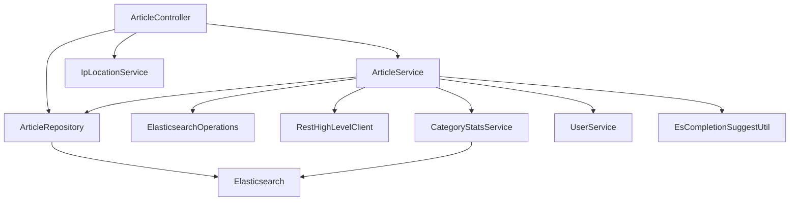

# 文章编辑视图

<cite>
**本文档引用的文件**
- [ArticleEditView.vue](file://frontend/src/views/ArticleEditView.vue)
- [ArticleEdit.vue](file://frontend/src/components/profile/ArticleEdit.vue)
- [ArticleController.java](file://src/main/java/com/zhishilu/controller/ArticleController.java)
- [ArticleService.java](file://src/main/java/com/zhishilu/service/ArticleService.java)
- [Article.java](file://src/main/java/com/zhishilu/entity/Article.java)
- [ArticleUpdateReq.java](file://src/main/java/com/zhishilu/req/ArticleUpdateReq.java)
- [ArticleResp.java](file://src/main/java/com/zhishilu/resp/ArticleResp.java)
- [request.ts](file://frontend/src/utils/request.ts)
- [image.ts](file://frontend/src/utils/image.ts)
- [RichEditor.vue](file://frontend/src/components/RichEditor.vue)
- [index.ts](file://frontend/src/router/index.ts)
- [ArticleDetail.vue](file://frontend/src/components/profile/ArticleDetail.vue)
- [application.yml](file://src/main/resources/application.yml)
</cite>

## 目录
1. [简介](#简介)
2. [项目结构](#项目结构)
3. [核心组件](#核心组件)
4. [架构概览](#架构概览)
5. [详细组件分析](#详细组件分析)
6. [依赖关系分析](#依赖关系分析)
7. [性能考虑](#性能考虑)
8. [故障排除指南](#故障排除指南)
9. [结论](#结论)

## 简介

文章编辑视图是知识路（Zhishilu）系统中的核心功能模块，为用户提供了一个完整的富文本编辑体验。该系统采用前后端分离架构，前端使用Vue 3 + TypeScript + Vite构建，后端使用Spring Boot + Java开发，支持实时预览、图片上传、分类管理、地理位置标注等功能。

## 项目结构

知识路项目采用标准的MVC架构模式，分为前端Vue应用和后端Spring Boot应用两个主要部分：

**图表来源**
- [ArticleEditView.vue](file://frontend/src/views/ArticleEditView.vue#L1-L427)
- [ArticleController.java](file://src/main/java/com/zhishilu/controller/ArticleController.java#L1-L187)
- [ArticleService.java](file://src/main/java/com/zhishilu/service/ArticleService.java#L1-L800)

**章节来源**
- [ArticleEditView.vue](file://frontend/src/views/ArticleEditView.vue#L1-L427)
- [ArticleEdit.vue](file://frontend/src/components/profile/ArticleEdit.vue#L1-L288)
- [ArticleController.java](file://src/main/java/com/zhishilu/controller/ArticleController.java#L1-L187)

## 核心组件

### 前端核心组件

1. **文章编辑视图 (ArticleEditView.vue)** - 主要的编辑界面，提供完整的编辑功能
2. **嵌入式编辑组件 (ArticleEdit.vue)** - 可复用的编辑组件，支持在其他页面中嵌入
3. **富文本编辑器 (RichEditor.vue)** - 基于wangEditor的富文本编辑器
4. **请求封装 (request.ts)** - Axios实例封装，统一处理HTTP请求
5. **图片工具 (image.ts)** - 图片URL处理工具

### 后端核心组件

1. **文章控制器 (ArticleController)** - REST API入口点
2. **文章服务 (ArticleService)** - 业务逻辑处理
3. **文章实体 (Article)** - 数据模型定义
4. **更新请求 (ArticleUpdateReq)** - 更新请求参数封装
5. **响应对象 (ArticleResp)** - API响应数据结构

**章节来源**
- [ArticleEditView.vue](file://frontend/src/views/ArticleEditView.vue#L208-L427)
- [ArticleEdit.vue](file://frontend/src/components/profile/ArticleEdit.vue#L150-L288)
- [ArticleController.java](file://src/main/java/com/zhishilu/controller/ArticleController.java#L26-L187)

## 架构概览

系统采用前后端分离架构，实现了清晰的职责分离：

**图表来源**
- [ArticleController.java](file://src/main/java/com/zhishilu/controller/ArticleController.java#L47-L55)
- [ArticleService.java](file://src/main/java/com/zhishilu/service/ArticleService.java#L236-L289)

**章节来源**
- [ArticleController.java](file://src/main/java/com/zhishilu/controller/ArticleController.java#L1-L187)
- [ArticleService.java](file://src/main/java/com/zhishilu/service/ArticleService.java#L1-L800)

## 详细组件分析

### 文章编辑视图组件 (ArticleEditView.vue)

这是系统的主要编辑界面，提供了完整的编辑功能：

#### 核心功能特性

1. **实时预览模式** - 支持编辑和预览两种模式切换
2. **富文本编辑** - 基于wangEditor的高级编辑器
3. **图片上传管理** - 支持多图片上传和删除
4. **分类管理** - 推荐分类和自定义分类
5. **地理位置标注** - 地点信息输入和显示
6. **来源链接** - 支持关联外部链接

#### 数据绑定和状态管理

**图表来源**
- [ArticleEditView.vue](file://frontend/src/views/ArticleEditView.vue#L313-L396)

#### 图片上传流程

**图表来源**
- [ArticleEditView.vue](file://frontend/src/views/ArticleEditView.vue#L277-L307)
- [RichEditor.vue](file://frontend/src/components/RichEditor.vue#L64-L88)

**章节来源**
- [ArticleEditView.vue](file://frontend/src/views/ArticleEditView.vue#L1-L427)

### 嵌入式编辑组件 (ArticleEdit.vue)

这是一个可复用的编辑组件，设计用于在其他页面中嵌入使用：

#### 组件特点

1. **属性驱动** - 通过props接收文章数据
2. **事件发射** - 通过emit通知父组件状态变化
3. **独立性** - 不依赖路由参数，适合嵌入式使用
4. **响应式设计** - 适配移动端和桌面端

#### 事件通信机制

**图表来源**
- [ArticleEdit.vue](file://frontend/src/components/profile/ArticleEdit.vue#L157-L175)

**章节来源**
- [ArticleEdit.vue](file://frontend/src/components/profile/ArticleEdit.vue#L1-L288)

### 富文本编辑器 (RichEditor.vue)

基于wangEditor的富文本编辑器，提供了丰富的编辑功能：

#### 编辑器配置

1. **工具栏配置** - 默认工具栏，支持常用格式化操作
2. **图片上传** - 自定义图片上传逻辑
3. **视频上传** - 支持视频文件上传
4. **占位符** - 用户友好的提示信息

#### 编辑器生命周期

**图表来源**
- [RichEditor.vue](file://frontend/src/components/RichEditor.vue#L124-L141)

**章节来源**
- [RichEditor.vue](file://frontend/src/components/RichEditor.vue#L1-L177)

### 后端服务架构

#### 文章服务层

**图表来源**
- [ArticleService.java](file://src/main/java/com/zhishilu/service/ArticleService.java#L61-L72)
- [ArticleController.java](file://src/main/java/com/zhishilu/controller/ArticleController.java#L32-L35)

#### 数据模型设计

**图表来源**
- [Article.java](file://src/main/java/com/zhishilu/entity/Article.java#L14-L86)

**章节来源**
- [ArticleService.java](file://src/main/java/com/zhishilu/service/ArticleService.java#L1-L800)
- [ArticleController.java](file://src/main/java/com/zhishilu/controller/ArticleController.java#L1-L187)
- [Article.java](file://src/main/java/com/zhishilu/entity/Article.java#L1-L87)

## 依赖关系分析

### 前端依赖关系

**图表来源**
- [ArticleEditView.vue](file://frontend/src/views/ArticleEditView.vue#L210-L216)
- [RichEditor.vue](file://frontend/src/components/RichEditor.vue#L20-L25)

### 后端依赖关系

**图表来源**
- [ArticleController.java](file://src/main/java/com/zhishilu/controller/ArticleController.java#L14-L35)
- [ArticleService.java](file://src/main/java/com/zhishilu/service/ArticleService.java#L66-L71)

**章节来源**
- [ArticleEditView.vue](file://frontend/src/views/ArticleEditView.vue#L208-L216)
- [ArticleController.java](file://src/main/java/com/zhishilu/controller/ArticleController.java#L1-L187)

## 性能考虑

### 前端性能优化

1. **懒加载策略** - 图片使用懒加载，提升页面加载速度
2. **虚拟滚动** - 大列表使用虚拟滚动技术
3. **缓存机制** - 分类数据缓存，减少重复请求
4. **防抖处理** - 输入框防抖，避免频繁请求

### 后端性能优化

1. **异步处理** - 补全建议同步使用异步任务
2. **批量操作** - 多图片上传使用批量处理
3. **缓存策略** - Redis缓存热点数据
4. **分页查询** - Elasticsearch查询使用分页

### 数据库优化

1. **索引优化** - Elasticsearch索引配置优化
2. **查询优化** - 复合查询条件优化
3. **连接池** - 数据库连接池配置
4. **监控告警** - 性能监控和告警机制

## 故障排除指南

### 常见问题及解决方案

#### 权限相关问题

**问题描述**: 用户尝试编辑非自己创建的文章
**解决方法**: 
1. 检查用户认证状态
2. 验证文章所有权
3. 管理员权限检查

#### 文件上传问题

**问题描述**: 图片上传失败
**解决方法**:
1. 检查文件大小限制
2. 验证文件类型
3. 确认上传路径权限

#### 数据同步问题

**问题描述**: 编辑后数据未及时更新
**解决方法**:
1. 检查Elasticsearch同步
2. 验证缓存清理
3. 确认异步任务执行

**章节来源**
- [ArticleEditView.vue](file://frontend/src/views/ArticleEditView.vue#L320-L343)
- [request.ts](file://frontend/src/utils/request.ts#L34-L62)

## 结论

文章编辑视图系统是一个功能完整、架构清晰的现代化内容管理系统。通过前后端分离的设计，系统实现了良好的用户体验和技术可维护性。

### 主要优势

1. **用户体验优秀** - 实时预览、富文本编辑、响应式设计
2. **功能完整** - 支持图片、分类、地理位置等丰富内容
3. **技术先进** - Vue 3 + Spring Boot + Elasticsearch + Redis
4. **扩展性强** - 模块化设计，易于功能扩展

### 技术亮点

1. **异步架构** - 使用CompletableFuture处理异步任务
2. **全文检索** - Elasticsearch提供强大的搜索能力
3. **缓存策略** - 多层缓存提升系统性能
4. **安全机制** - JWT认证和权限控制

该系统为知识分享和内容创作提供了强大的技术支持，具有良好的扩展性和维护性。