# 主页视图

<cite>
**本文档引用的文件**
- [HomeView.vue](file://frontend/src/views/HomeView.vue)
- [App.vue](file://frontend/src/App.vue)
- [index.ts](file://frontend/src/router/index.ts)
- [main.ts](file://frontend/src/main.ts)
- [App.vue](file://frontend/src/App.vue)
- [ArticleCard.vue](file://frontend/src/components/ArticleCard.vue)
- [request.ts](file://frontend/src/utils/request.ts)
- [image.ts](file://frontend/src/utils/image.ts)
- [ArticleController.java](file://src/main/java/com/zhishilu/controller/ArticleController.java)
- [ArticleService.java](file://src/main/java/com/zhishilu/service/ArticleService.java)
- [HotKeywordResp.java](file://src/main/java/com/zhishilu/resp/HotKeywordResp.java)
- [style.css](file://frontend/src/style.css)
</cite>

## 更新摘要
**变更内容**
- 新增热门关键词功能的前端集成，包括fetchHotKeywords函数和模板渲染
- 更新响应式网格布局功能描述，增加热门关键词与文章网格的结合显示
- 增强弹窗动画系统的分析，完善路由动画配置说明
- 完善路由动画配置说明，优化页面过渡动画系统
- **更新ArticleCard组件布局改进**：新增flex-grow占位符确保底部信息始终位于卡片底部，优化卡片内容分布和视觉层次

## 目录
1. [简介](#简介)
2. [项目结构](#项目结构)
3. [核心组件](#核心组件)
4. [架构概览](#架构概览)
5. [详细组件分析](#详细组件分析)
6. [热门关键词功能](#热门关键词功能)
7. [页面过渡动画系统](#页面过渡动画系统)
8. [增强的布局功能](#增强的布局功能)
9. [依赖关系分析](#依赖关系分析)
10. [性能考虑](#性能考虑)
11. [故障排除指南](#故障排除指南)
12. [结论](#结论)

## 简介

主页视图（Home View）是知识路项目的核心主页组件，提供了一个现代化的知识管理平台界面。该组件实现了完整的文章浏览、搜索、分类筛选、详情展示和热门关键词推荐功能，采用响应式设计支持多设备访问。经过更新后，系统集成了先进的页面过渡动画系统和增强的布局功能，为用户提供了更加流畅和直观的交互体验。

## 项目结构

前端项目采用基于功能模块的组织方式，主要目录结构如下：

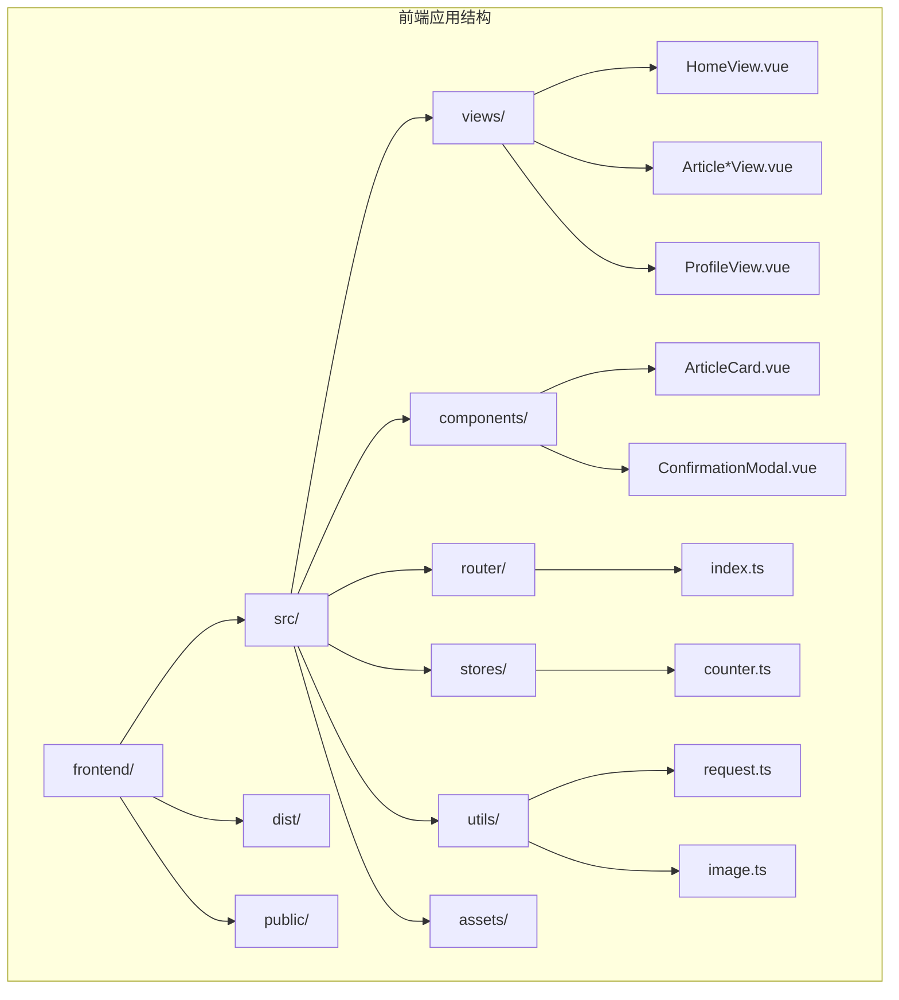
```mermaid
graph TB
subgraph "前端应用结构"
A[frontend/] --> B[src/]
A --> C[dist/]
A --> D[public/]
B --> E[views/]
B --> F[components/]
B --> G[router/]
B --> H[stores/]
B --> I[utils/]
B --> J[assets/]
E --> K[HomeView.vue]
E --> L[Article*View.vue]
E --> M[ProfileView.vue]
F --> N[ArticleCard.vue]
F --> O[ConfirmationModal.vue]
G --> P[index.ts]
H --> Q[counter.ts]
I --> R[request.ts]
I --> S[image.ts]
end
```

**图表来源**
- [HomeView.vue](file://frontend/src/views/HomeView.vue#L1-L50)
- [index.ts](file://frontend/src/router/index.ts#L1-L20)

**章节来源**
- [HomeView.vue](file://frontend/src/views/HomeView.vue#L1-L50)
- [index.ts](file://frontend/src/router/index.ts#L1-L20)

## 核心组件

主页视图作为应用的入口页面，集成了以下核心功能模块：

### 主要功能特性
- **智能搜索系统**：支持多字段搜索（标题、内容、类别、用户名、地点）
- **热门关键词推荐**：动态加载和展示热门搜索关键词
- **分类导航**：动态加载和展示文章分类
- **响应式网格布局**：自适应不同屏幕尺寸的卡片展示
- **搜索补全**：实时提供搜索建议
- **详情弹窗**：桌面端支持弹窗查看详情
- **分页加载**：支持大数据量的分页浏览
- **页面过渡动画**：流畅的页面切换动画效果
- **增强的布局系统**：优化的网格布局和响应式设计

### 技术栈
- **前端框架**：Vue 3 + TypeScript
- **UI库**：Tailwind CSS + Lucide Icons
- **状态管理**：Pinia
- **路由管理**：Vue Router
- **HTTP客户端**：Axios
- **动画系统**：CSS3 动画 + Vue Transition

**章节来源**
- [HomeView.vue](file://frontend/src/views/HomeView.vue#L494-L520)
- [main.ts](file://frontend/src/main.ts#L1-L11)

## 架构概览

系统采用前后端分离架构，主页视图作为前端单页面应用的核心组件：

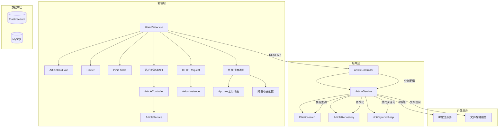
```mermaid
graph TB
subgraph "前端层"
A[HomeView.vue] --> B[ArticleCard.vue]
A --> C[Router]
A --> D[Pinia Store]
A --> E[热门关键词API]
E --> F[ArticleController]
F --> G[ArticleService]
A --> H[HTTP Request]
H --> I[Axios Instance]
A --> J[页面过渡动画]
J --> K[App.vue全局动画]
J --> L[路由动画配置]
end
subgraph "后端层"
M[ArticleController] --> N[ArticleService]
N --> O[Elasticsearch]
N --> P[ArticleRepository]
N --> Q[HotKeywordResp]
end
subgraph "数据库层"
R[(Elasticsearch)]
S[(MySQL)]
end
subgraph "外部服务"
T[IP定位服务]
U[文件存储服务]
end
A --> |REST API| M
M --> |业务逻辑| N
N --> |数据查询| O
N --> |持久化| P
N --> |热门关键词| Q
N --> |IP解析| T
N --> |文件访问| U
```

**图表来源**
- [HomeView.vue](file://frontend/src/views/HomeView.vue#L521-L523)
- [ArticleController.java](file://src/main/java/com/zhishilu/controller/ArticleController.java#L28-L35)
- [ArticleService.java](file://src/main/java/com/zhishilu/service/ArticleService.java#L62-L70)

## 详细组件分析

### 主页视图主组件

主页视图组件采用了模块化的架构设计，包含多个功能子模块：

#### 搜索系统模块

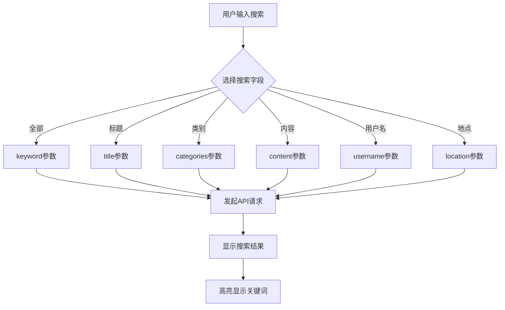
```mermaid
flowchart TD
A[用户输入搜索] --> B{选择搜索字段}
B --> |全部| C[keyword参数]
B --> |标题| D[title参数]
B --> |类别| E[categories参数]
B --> |内容| F[content参数]
B --> |用户名| G[username参数]
B --> |地点| H[location参数]
C --> I[发起API请求]
D --> I
E --> I
F --> I
G --> I
H --> I
I --> J[显示搜索结果]
J --> K[高亮显示关键词]
```

**图表来源**
- [HomeView.vue](file://frontend/src/views/HomeView.vue#L614-L642)
- [ArticleService.java](file://src/main/java/com/zhishilu/service/ArticleService.java#L334-L373)

#### 热门关键词系统模块

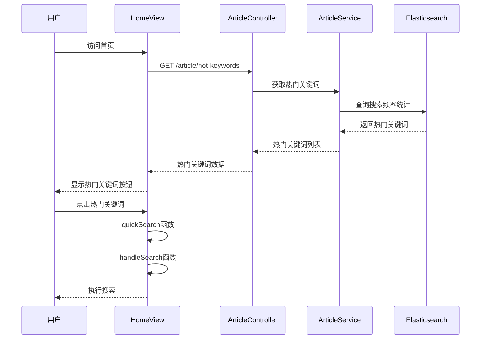
```mermaid
sequenceDiagram
participant U as 用户
participant HV as HomeView
participant AC as ArticleController
participant AS as ArticleService
participant ES as Elasticsearch
U->>HV : 访问首页
HV->>AC : GET /article/hot-keywords
AC->>AS : 获取热门关键词
AS->>ES : 查询搜索频率统计
ES-->>AS : 返回热门关键词
AS-->>AC : 热门关键词列表
AC-->>HV : 热门关键词数据
HV-->>U : 显示热门关键词按钮
U->>HV : 点击热门关键词
HV->>HV : quickSearch函数
HV->>HV : handleSearch函数
HV-->>U : 执行搜索
```

**图表来源**
- [HomeView.vue](file://frontend/src/views/HomeView.vue#L648-L661)
- [ArticleController.java](file://src/main/java/com/zhishilu/controller/ArticleController.java#L180-L185)

#### 分类导航模块

主页视图动态加载和展示文章分类，支持用户快速筛选：

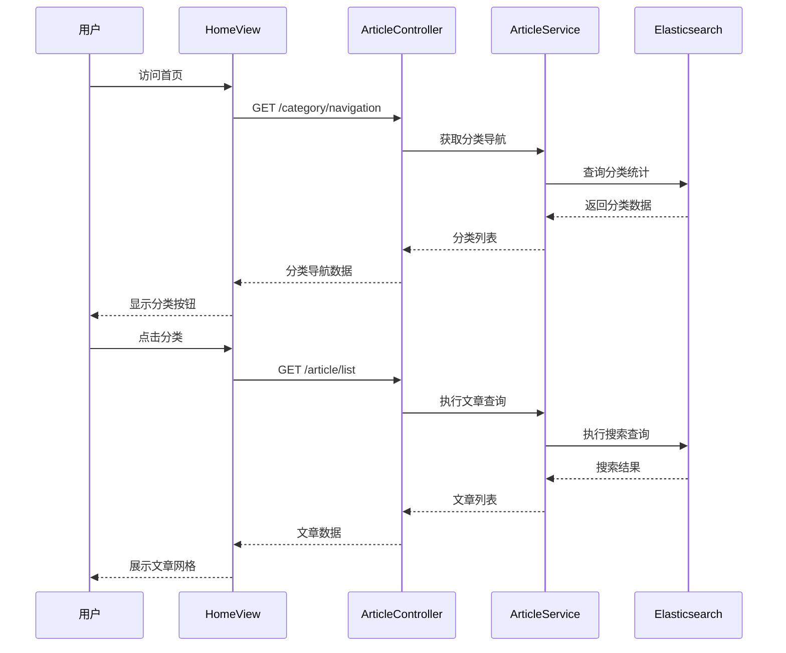
```mermaid
sequenceDiagram
participant U as 用户
participant HV as HomeView
participant AC as ArticleController
participant AS as ArticleService
participant ES as Elasticsearch
U->>HV : 访问首页
HV->>AC : GET /category/navigation
AC->>AS : 获取分类导航
AS->>ES : 查询分类统计
ES-->>AS : 返回分类数据
AS-->>AC : 分类列表
AC-->>HV : 分类导航数据
HV-->>U : 显示分类按钮
U->>HV : 点击分类
HV->>AC : GET /article/list
AC->>AS : 执行文章查询
AS->>ES : 执行搜索查询
ES-->>AS : 搜索结果
AS-->>AC : 文章列表
AC-->>HV : 文章数据
HV-->>U : 展示文章网格
```

**图表来源**
- [HomeView.vue](file://frontend/src/views/HomeView.vue#L596-L608)
- [ArticleController.java](file://src/main/java/com/zhishilu/controller/ArticleController.java#L87-L93)

#### 文章卡片组件

ArticleCard 组件负责单个文章条目的渲染和交互，经过更新后优化了布局结构：

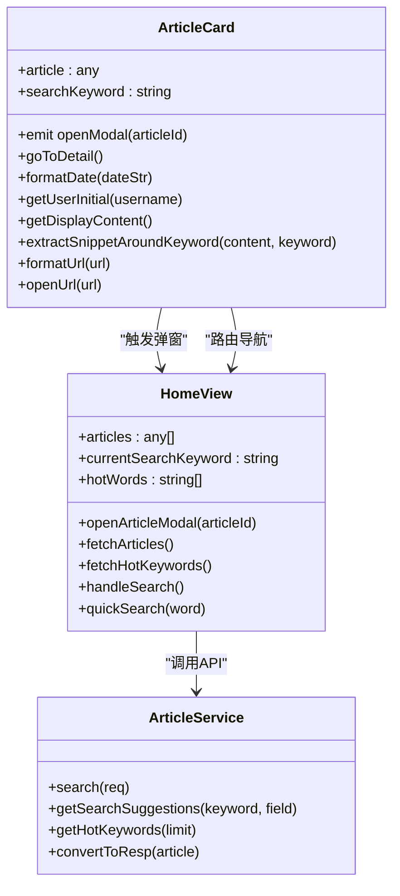
```mermaid
classDiagram
class ArticleCard {
+article : any
+searchKeyword : string
+emit openModal(articleId)
+goToDetail()
+formatDate(dateStr)
+getUserInitial(username)
+getDisplayContent()
+extractSnippetAroundKeyword(content, keyword)
+formatUrl(url)
+openUrl(url)
}
class HomeView {
+articles : any[]
+currentSearchKeyword : string
+hotWords : string[]
+openArticleModal(articleId)
+fetchArticles()
+fetchHotKeywords()
+handleSearch()
+quickSearch(word)
}
class ArticleService {
+search(req)
+getSearchSuggestions(keyword, field)
+getHotKeywords(limit)
+convertToResp(article)
}
ArticleCard --> HomeView : "触发弹窗"
HomeView --> ArticleService : "调用API"
ArticleCard --> HomeView : "路由导航"
```

**图表来源**
- [ArticleCard.vue](file://frontend/src/components/ArticleCard.vue#L86-L100)
- [HomeView.vue](file://frontend/src/views/HomeView.vue#L751-L764)

**章节来源**
- [HomeView.vue](file://frontend/src/views/HomeView.vue#L1-L200)
- [ArticleCard.vue](file://frontend/src/components/ArticleCard.vue#L1-L120)

### 数据流分析

主页视图的数据流遵循单向数据流原则：

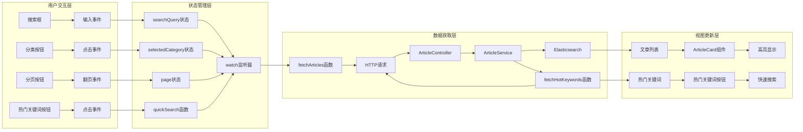
```mermaid
flowchart LR
subgraph "用户交互层"
A[搜索框] --> B[输入事件]
C[分类按钮] --> D[点击事件]
E[分页按钮] --> F[翻页事件]
G[热门关键词按钮] --> H[点击事件]
end
subgraph "状态管理层"
B --> I[searchQuery状态]
D --> J[selectedCategory状态]
F --> K[page状态]
H --> L[quickSearch函数]
I --> M[watch监听器]
J --> M
K --> M
L --> M
end
subgraph "数据获取层"
M --> N[fetchArticles函数]
N --> O[HTTP请求]
O --> P[ArticleController]
P --> Q[ArticleService]
Q --> R[Elasticsearch]
Q --> S[fetchHotKeywords函数]
S --> O
end
subgraph "视图更新层"
R --> T[文章列表]
S --> U[热门关键词]
T --> V[ArticleCard组件]
U --> W[热门关键词按钮]
V --> X[高亮显示]
W --> Y[快速搜索]
end
```

**图表来源**
- [HomeView.vue](file://frontend/src/views/HomeView.vue#L861-L865)
- [request.ts](file://frontend/src/utils/request.ts#L1-L65)

**章节来源**
- [HomeView.vue](file://frontend/src/views/HomeView.vue#L610-L661)
- [request.ts](file://frontend/src/utils/request.ts#L1-L65)

## 热门关键词功能

### 功能概述

热门关键词功能为用户提供了智能化的内容发现能力，通过分析用户的搜索行为，动态展示当前最热门的搜索关键词。该功能与文章网格布局紧密结合，为用户提供了一站式的搜索体验。

### 技术实现

#### 前端实现

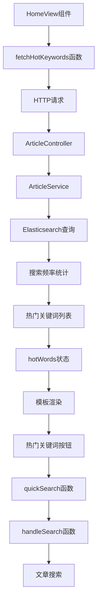
```mermaid
flowchart TD
A[HomeView组件] --> B[fetchHotKeywords函数]
B --> C[HTTP请求]
C --> D[ArticleController]
D --> E[ArticleService]
E --> F[Elasticsearch查询]
F --> G[搜索频率统计]
G --> H[热门关键词列表]
H --> I[hotWords状态]
I --> J[模板渲染]
J --> K[热门关键词按钮]
K --> L[quickSearch函数]
L --> M[handleSearch函数]
M --> N[文章搜索]
```

**图表来源**
- [HomeView.vue](file://frontend/src/views/HomeView.vue#L648-L661)
- [HomeView.vue](file://frontend/src/views/HomeView.vue#L724-L727)

#### 后端实现

后端服务通过聚合多个搜索建议索引来获取热门关键词：

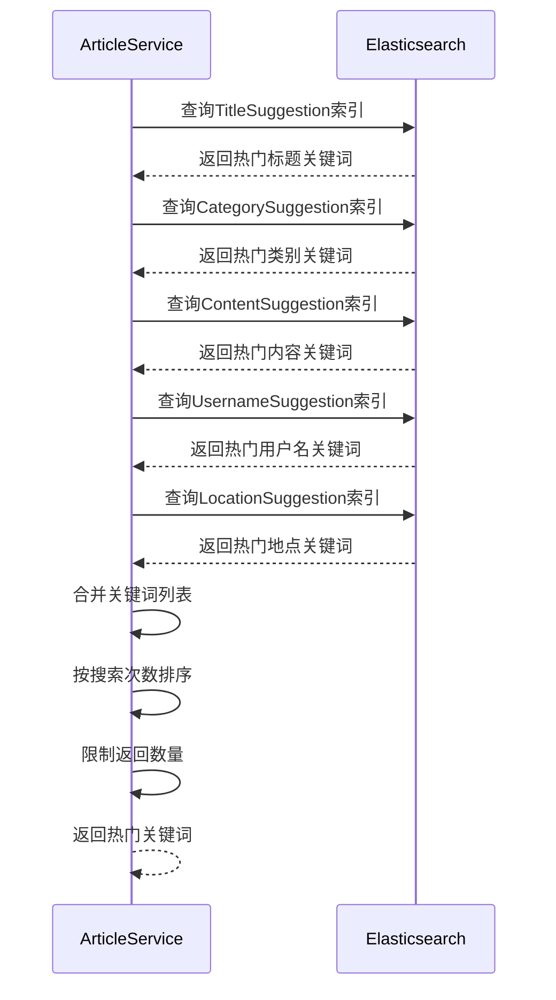
```mermaid
sequenceDiagram
participant AS as ArticleService
participant ES as Elasticsearch
AS->>ES : 查询TitleSuggestion索引
ES-->>AS : 返回热门标题关键词
AS->>ES : 查询CategorySuggestion索引
ES-->>AS : 返回热门类别关键词
AS->>ES : 查询ContentSuggestion索引
ES-->>AS : 返回热门内容关键词
AS->>ES : 查询UsernameSuggestion索引
ES-->>AS : 返回热门用户名关键词
AS->>ES : 查询LocationSuggestion索引
ES-->>AS : 返回热门地点关键词
AS->>AS : 合并关键词列表
AS->>AS : 按搜索次数排序
AS->>AS : 限制返回数量
AS-->>AS : 返回热门关键词
```

**图表来源**
- [ArticleService.java](file://src/main/java/com/zhishilu/service/ArticleService.java#L966-L982)

### 模板集成

热门关键词功能在模板中通过以下结构实现：

```html
<!-- 热门提示词 -->
<div class="flex items-center gap-2 sm:gap-3 overflow-x-auto scrollbar-hide py-1">
  <span class="text-[10px] sm:text-[11px] font-bold text-gray-400 uppercase tracking-widest whitespace-nowrap flex-shrink-0">热门:</span>
  <button
    v-for="word in hotWords"
    :key="word"
    @click="quickSearch(word)"
    class="text-[11px] sm:text-xs text-gray-500 hover:text-blue-600 transition-colors whitespace-nowrap"
  >
    {{ word }}
  </button>
</div>
```

**章节来源**
- [HomeView.vue](file://frontend/src/views/HomeView.vue#L148-L159)
- [HomeView.vue](file://frontend/src/views/HomeView.vue#L648-L661)
- [ArticleController.java](file://src/main/java/com/zhishilu/controller/ArticleController.java#L180-L185)

## 页面过渡动画系统

### 全局动画控制器

App.vue 实现了全局的页面过渡动画控制系统，提供了灵活的动画配置和性能优化：

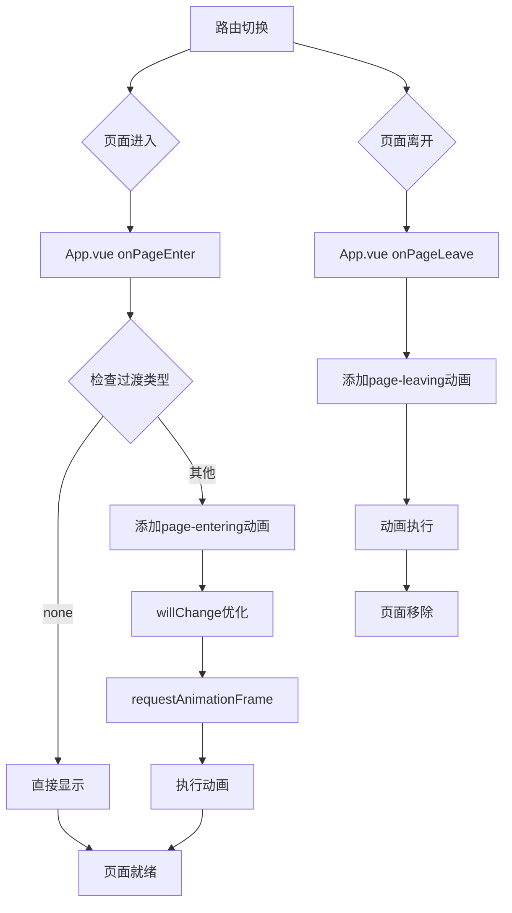
```mermaid
flowchart TD
A[路由切换] --> B{页面进入}
B --> C[App.vue onPageEnter]
C --> D{检查过渡类型}
D --> |none| E[直接显示]
D --> |其他| F[添加page-entering动画]
F --> G[willChange优化]
G --> H[requestAnimationFrame]
H --> I[执行动画]
E --> J[页面就绪]
I --> J
A --> K{页面离开}
K --> L[App.vue onPageLeave]
L --> M[添加page-leaving动画]
M --> N[动画执行]
N --> O[页面移除]
```

**图表来源**
- [App.vue](file://frontend/src/App.vue#L9-L31)
- [style.css](file://frontend/src/style.css#L146-L175)

### 路由动画配置

路由系统为不同页面配置了专门的过渡动画效果：

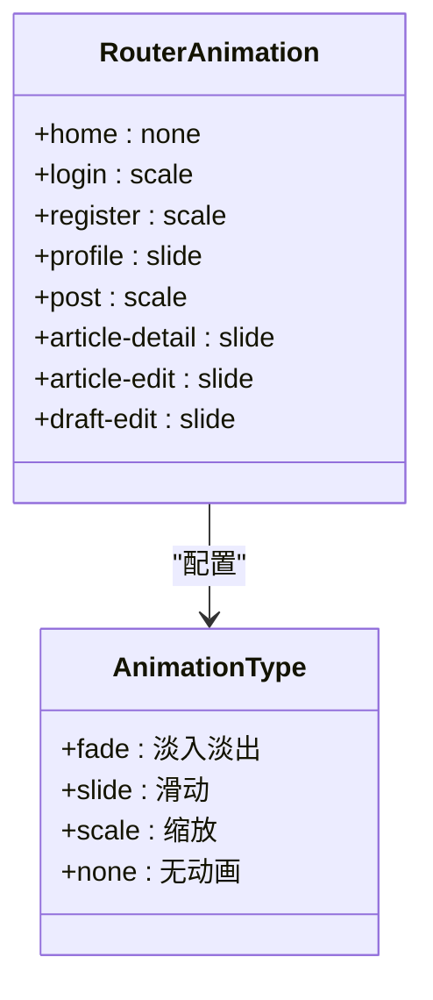
```mermaid
classDiagram
class RouterAnimation {
+home : none
+login : scale
+register : scale
+profile : slide
+post : scale
+article-detail : slide
+article-edit : slide
+draft-edit : slide
}
class AnimationType {
+fade : 淡入淡出
+slide : 滑动
+scale : 缩放
+none : 无动画
}
RouterAnimation --> AnimationType : "配置"
```

**图表来源**
- [index.ts](file://frontend/src/router/index.ts#L27-L96)
- [style.css](file://frontend/src/style.css#L42-L123)

### 动画性能优化

系统实现了多层次的动画性能优化策略：

1. **硬件加速优化**：使用 will-change 属性优化动画性能
2. **移动端适配**：针对不同设备调整动画时长和缓动函数
3. **内存管理**：及时清理动画相关的DOM节点
4. **回流优化**：使用 transform 和 opacity 属性避免重排

**章节来源**
- [App.vue](file://frontend/src/App.vue#L9-L31)
- [style.css](file://frontend/src/style.css#L177-L192)

## 增强的布局功能

### 响应式网格系统

主页视图实现了高度灵活的响应式网格布局系统，支持多种屏幕尺寸：

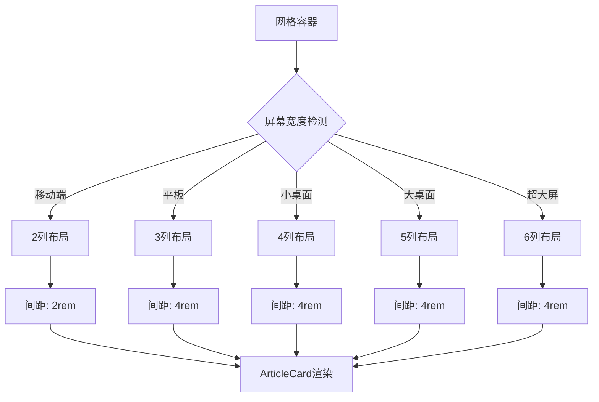
```mermaid
flowchart TD
A[网格容器] --> B{屏幕宽度检测}
B --> |移动端| C[2列布局]
B --> |平板| D[3列布局]
B --> |小桌面| E[4列布局]
B --> |大桌面| F[5列布局]
B --> |超大屏| G[6列布局]
C --> H[间距: 2rem]
D --> I[间距: 4rem]
E --> J[间距: 4rem]
F --> K[间距: 4rem]
G --> L[间距: 4rem]
H --> M[ArticleCard渲染]
I --> M
J --> M
K --> M
L --> M
```

**图表来源**
- [HomeView.vue](file://frontend/src/views/HomeView.vue#L194-L205)
- [HomeView.vue](file://frontend/src/views/HomeView.vue#L207-L209)

### ArticleCard组件布局优化

**更新** ArticleCard组件经过重要布局改进，新增了flex-grow占位符确保底部信息始终位于卡片底部：

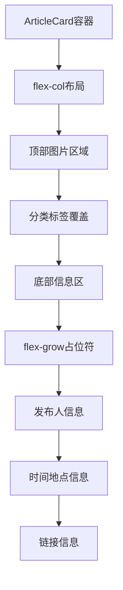
```mermaid
flowchart TD
A[ArticleCard容器] --> B[flex-col布局]
B --> C[顶部图片区域]
C --> D[分类标签覆盖]
D --> E[底部信息区]
E --> F[flex-grow占位符]
F --> G[发布人信息]
G --> H[时间地点信息]
H --> I[链接信息]
```

**图表来源**
- [ArticleCard.vue](file://frontend/src/components/ArticleCard.vue#L41-L85)

#### 占位符机制详解

ArticleCard组件通过flex-grow占位符实现了智能的内容分布：

1. **flex-grow占位符**：位于标题和摘要之后，使用`<div class="flex-grow"></div>`实现弹性占位
2. **内容分布**：占位符将底部信息推到底部，确保发布人信息始终可见
3. **响应式适配**：在不同屏幕尺寸下保持一致的视觉层次
4. **内容溢出处理**：当内容较少时，占位符填充剩余空间

#### 弹性布局优势

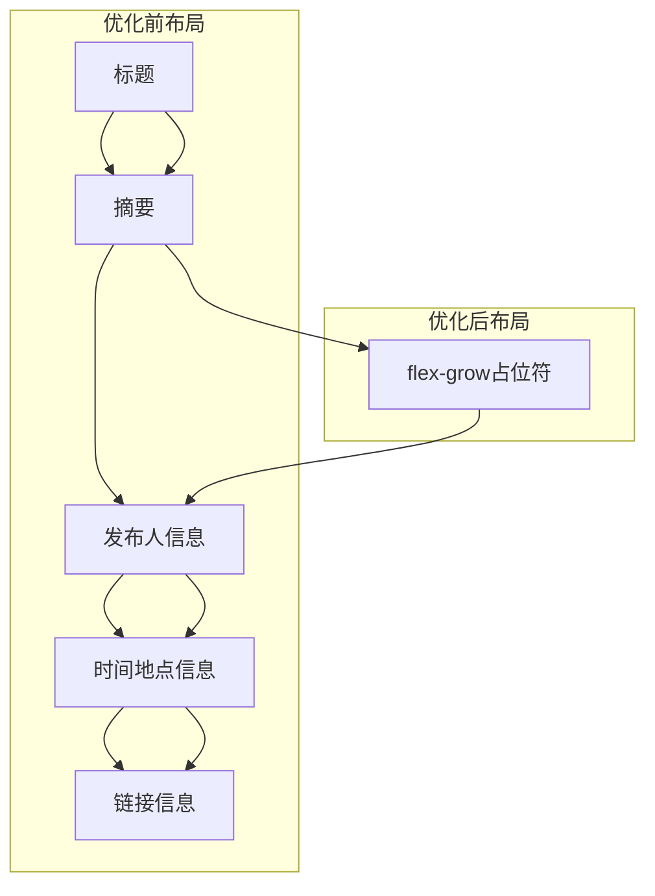
```mermaid
graph TB
subgraph "优化前布局"
A[标题] --> B[摘要]
B --> C[发布人信息]
C --> D[时间地点信息]
D --> E[链接信息]
end
subgraph "优化后布局"
A[标题] --> B[摘要]
B --> F[flex-grow占位符]
F --> C[发布人信息]
C --> D[时间地点信息]
D --> E[链接信息]
end
```

**图表来源**
- [ArticleCard.vue](file://frontend/src/components/ArticleCard.vue#L56-L57)

### 弹窗动画系统

系统实现了两种不同的弹窗动画效果，分别针对桌面端和移动端：

#### 桌面端弹窗动画

桌面端弹窗使用缩放和透明度组合动画：

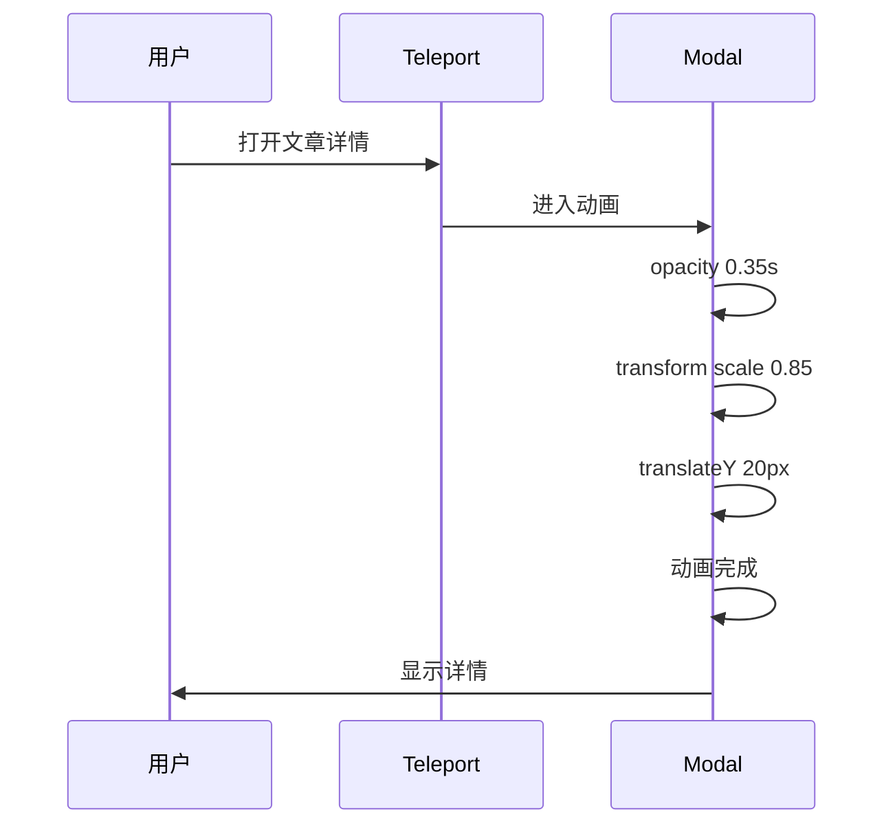
```mermaid
sequenceDiagram
participant U as 用户
participant T as Teleport
participant M as Modal
U->>T : 打开文章详情
T->>M : 进入动画
M->>M : opacity 0.35s
M->>M : transform scale 0.85
M->>M : translateY 20px
M->>M : 动画完成
M->>U : 显示详情
```

**图表来源**
- [HomeView.vue](file://frontend/src/views/HomeView.vue#L274-L276)
- [HomeView.vue](file://frontend/src/views/HomeView.vue#L1029-L1047)

#### 移动端弹窗动画

移动端弹窗使用底部滑入动画：

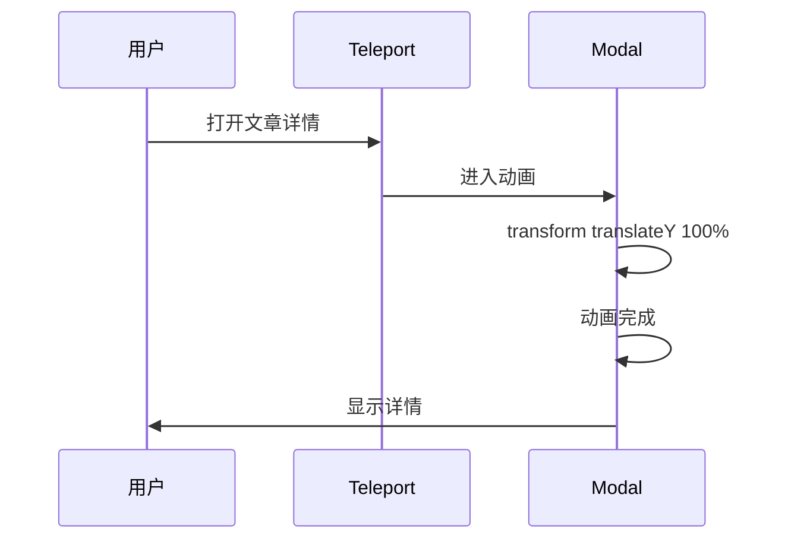
```mermaid
sequenceDiagram
participant U as 用户
participant T as Teleport
participant M as Modal
U->>T : 打开文章详情
T->>M : 进入动画
M->>M : transform translateY 100%
M->>M : 动画完成
M->>U : 显示详情
```

**图表来源**
- [HomeView.vue](file://frontend/src/views/HomeView.vue#L1049-L1066)
- [HomeView.vue](file://frontend/src/views/HomeView.vue#L464-L502)

### 图片预览动画

图片预览系统实现了流畅的淡入淡出动画效果：

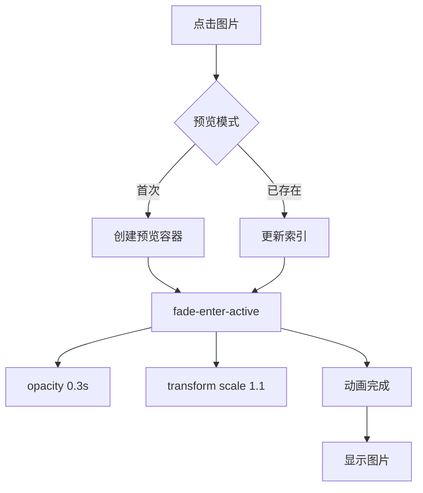
```mermaid
flowchart TD
A[点击图片] --> B{预览模式}
B --> |首次| C[创建预览容器]
B --> |已存在| D[更新索引]
C --> E[fade-enter-active]
D --> E
E --> F[opacity 0.3s]
E --> G[transform scale 1.1]
E --> H[动画完成]
H --> I[显示图片]
```

**图表来源**
- [HomeView.vue](file://frontend/src/views/HomeView.vue#L464-L502)
- [style.css](file://frontend/src/style.css#L1068-L1080)

**章节来源**
- [HomeView.vue](file://frontend/src/views/HomeView.vue#L194-L242)
- [HomeView.vue](file://frontend/src/views/HomeView.vue#L274-L502)
- [ArticleCard.vue](file://frontend/src/components/ArticleCard.vue#L41-L85)
- [style.css](file://frontend/src/style.css#L1014-L1080)

## 依赖关系分析

### 前端依赖关系

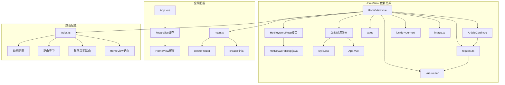
```mermaid
graph TB
subgraph "HomeView 依赖关系"
A[HomeView.vue] --> B[ArticleCard.vue]
A --> C[request.ts]
A --> D[image.ts]
A --> E[lucide-vue-next]
A --> F[vue-router]
A --> G[axios]
A --> H[页面过渡动画]
H --> I[App.vue]
H --> J[style.css]
A --> K[HotKeywordResp接口]
K --> L[HotKeywordResp.java]
end
subgraph "全局配置"
M[main.ts] --> N[createPinia]
M --> O[createRouter]
P[App.vue] --> Q[keep-alive缓存]
Q --> R[HomeView缓存]
end
subgraph "路由配置"
S[index.ts] --> T[HomeView路由]
S --> U[其他页面路由]
S --> V[路由守卫]
S --> W[动画配置]
end
A --> M
A --> S
B --> C
C --> F
```

**图表来源**
- [HomeView.vue](file://frontend/src/views/HomeView.vue#L521-L523)
- [main.ts](file://frontend/src/main.ts#L1-L11)
- [index.ts](file://frontend/src/router/index.ts#L1-L20)

### 后端依赖关系

后端服务层采用依赖注入模式，确保组件间的松耦合：

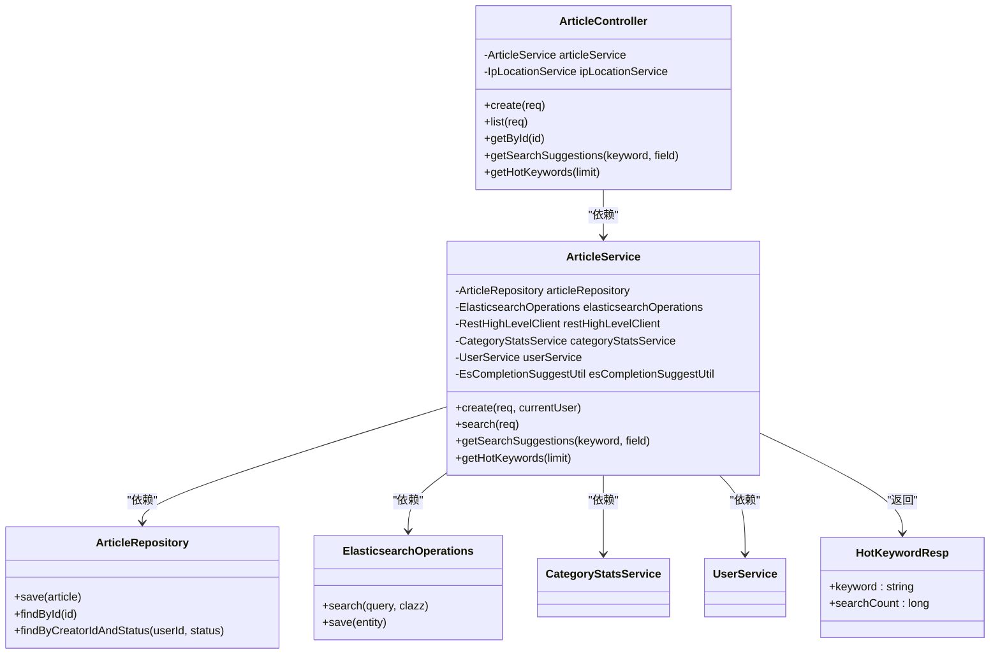
```mermaid
classDiagram
class ArticleController {
-ArticleService articleService
-IpLocationService ipLocationService
+create(req)
+list(req)
+getById(id)
+getSearchSuggestions(keyword, field)
+getHotKeywords(limit)
}
class ArticleService {
-ArticleRepository articleRepository
-ElasticsearchOperations elasticsearchOperations
-RestHighLevelClient restHighLevelClient
-CategoryStatsService categoryStatsService
-UserService userService
-EsCompletionSuggestUtil esCompletionSuggestUtil
+create(req, currentUser)
+search(req)
+getSearchSuggestions(keyword, field)
+getHotKeywords(limit)
}
class ArticleRepository {
+save(article)
+findById(id)
+findByCreatorIdAndStatus(userId, status)
}
class ElasticsearchOperations {
+search(query, clazz)
+save(entity)
}
class HotKeywordResp {
+keyword : string
+searchCount : long
}
ArticleController --> ArticleService : "依赖"
ArticleService --> ArticleRepository : "依赖"
ArticleService --> ElasticsearchOperations : "依赖"
ArticleService --> CategoryStatsService : "依赖"
ArticleService --> UserService : "依赖"
ArticleService --> HotKeywordResp : "返回"
```

**图表来源**
- [ArticleController.java](file://src/main/java/com/zhishilu/controller/ArticleController.java#L32-L35)
- [ArticleService.java](file://src/main/java/com/zhishilu/service/ArticleService.java#L62-L70)

**章节来源**
- [HomeView.vue](file://frontend/src/views/HomeView.vue#L521-L523)
- [ArticleController.java](file://src/main/java/com/zhishilu/controller/ArticleController.java#L32-L35)

## 性能考虑

### 前端性能优化

1. **虚拟滚动和懒加载**
   - 使用响应式网格布局，根据屏幕尺寸调整列数
   - 图片懒加载，提升首屏加载速度
   - 热门关键词数据缓存，避免重复请求

2. **状态缓存策略**
   - 使用 keep-alive 缓存 HomeView 组件
   - sessionStorage 标记数据刷新需求
   - 热门关键词状态持久化

3. **搜索防抖机制**
   - 输入事件防抖处理，减少不必要的API调用
   - 搜索建议延迟加载
   - 热门关键词一次性加载

4. **动画性能优化**
   - 使用 will-change 属性优化硬件加速
   - 移动端动画时长缩短至0.25秒
   - transform 和 opacity 属性避免重排

5. **布局性能优化**
   - **flex-grow占位符优化**：减少布局重计算，提升渲染性能
   - **弹性布局替代绝对定位**：提高响应式兼容性
   - **CSS Grid与Flexbox结合**：优化复杂布局场景

### 后端性能优化

1. **Elasticsearch 优化**
   - 高亮查询优化，仅返回必要字段
   - 分页查询限制，避免大数据量扫描
   - 热门关键词查询使用范围查询优化

2. **异步处理**
   - 搜索频率统计异步更新
   - 补全建议同步处理
   - 热门关键词聚合查询优化

**章节来源**
- [HomeView.vue](file://frontend/src/views/HomeView.vue#L676-L690)
- [ArticleService.java](file://src/main/java/com/zhishilu/service/ArticleService.java#L326-L327)
- [style.css](file://frontend/src/style.css#L177-L192)

## 故障排除指南

### 常见问题及解决方案

#### 搜索功能异常
1. **问题症状**：搜索无结果或报错
2. **可能原因**：
   - Elasticsearch 服务未启动
   - 搜索字段参数错误
   - 网络连接问题

3. **解决步骤**：
   ```mermaid
flowchart TD
A[用户反馈搜索异常] --> B{检查Elasticsearch}
B --> |正常| C{检查网络连接}
B --> |异常| D[重启Elasticsearch服务]
C --> |正常| E{检查API响应}
C --> |异常| F[检查网络配置]
E --> |正常| G[检查前端代码]
E --> |异常| H[查看控制台错误]
G --> I[修复代码问题]
H --> I
```

#### 热门关键词功能异常
1. **问题症状**：热门关键词不显示或显示为空
2. **可能原因**：
   - 后端热门关键词服务异常
   - Elasticsearch 热门关键词索引为空
   - 前端数据处理错误

3. **解决步骤**：
   - 检查后端 /article/hot-keywords 接口状态
   - 验证 Elasticsearch 中的 suggestion 索引数据
   - 确认前端 hotWords 状态更新逻辑
   - 检查网络请求和错误处理

#### 图片加载失败
1. **问题症状**：文章图片无法显示
2. **解决方案**：
   - 检查图片URL生成逻辑
   - 验证文件存储服务状态
   - 确认跨域配置正确

#### 分页功能异常
1. **问题症状**：分页按钮无效
2. **排查步骤**：
   - 检查 total 页面计算
   - 验证 API 返回数据格式
   - 确认分页参数传递

#### 动画系统异常
1. **问题症状**：页面切换动画不流畅
2. **可能原因**：
   - CSS 动画属性配置错误
   - 硬件加速未启用
   - 设备性能不足

3. **解决步骤**：
   - 检查 will-change 属性设置
   - 验证 transform 和 opacity 属性
   - 调整动画时长和缓动函数

#### ArticleCard布局问题
1. **问题症状**：底部信息位置异常或被遮挡
2. **可能原因**：
   - flex-grow占位符未正确应用
   - CSS样式冲突
   - 内容溢出导致布局错乱

3. **解决步骤**：
   - 检查ArticleCard组件的flex-grow占位符
   - 验证flex-col布局是否正确应用
   - 确认底部信息区域的z-index层级
   - 检查响应式断点下的布局表现

**章节来源**
- [request.ts](file://frontend/src/utils/request.ts#L34-L62)
- [image.ts](file://frontend/src/utils/image.ts#L6-L15)
- [App.vue](file://frontend/src/App.vue#L9-L31)

## 结论

主页视图作为知识路项目的核心组件，展现了现代前端开发的最佳实践。通过模块化设计、响应式布局、完善的错误处理机制以及先进的页面过渡动画系统，为用户提供了流畅且直观的知识管理体验。

### 主要优势
- **用户体验优秀**：响应式设计支持多设备访问
- **功能完整**：涵盖搜索、分类、详情展示、热门关键词推荐等核心功能
- **性能优化**：采用多种优化策略提升加载速度
- **动画流畅**：精心设计的页面过渡动画系统
- **可维护性强**：清晰的代码结构和模块划分
- **智能化推荐**：热门关键词功能提升内容发现效率
- **布局优化**：ArticleCard组件的flex-grow占位符确保内容分布合理

### 改进建议
- 可以考虑添加更多的搜索过滤选项
- 增加用户个性化推荐功能
- 优化移动端触摸交互体验
- 添加离线缓存机制
- 进一步优化动画性能
- 增强热门关键词的动态更新机制
- **考虑添加卡片悬停效果**：利用现有的hover:shadow-xl类实现更丰富的交互反馈

### 布局优化成果

**更新** ArticleCard组件的布局改进显著提升了用户体验：

1. **内容层次清晰**：通过flex-grow占位符确保底部信息始终可见
2. **视觉平衡**：优化了卡片内容的视觉分布，避免内容拥挤
3. **响应式兼容**：在不同屏幕尺寸下保持一致的布局效果
4. **性能提升**：减少布局重计算，提升渲染性能
5. **可维护性增强**：使用语义化的flex布局替代复杂的定位方案

该组件为整个知识路项目奠定了坚实的技术基础，为后续功能扩展提供了良好的架构支撑。页面过渡动画系统的集成显著提升了用户体验，而增强的布局功能则确保了在各种设备上的最佳显示效果。热门关键词功能的集成进一步增强了平台的智能化水平，为用户提供了更好的内容发现体验。ArticleCard组件的布局优化是本次更新的重要成果，为整个项目的视觉质量和用户体验提升做出了重要贡献。