# 主页视图

<cite>
**本文档引用的文件**
- [HomeView.vue](file://frontend/src/views/HomeView.vue)
- [ArticleCard.vue](file://frontend/src/components/ArticleCard.vue)
- [ArticleController.java](file://src/main/java/com/zhishilu/controller/ArticleController.java)
- [ArticleService.java](file://src/main/java/com/zhishilu/service/ArticleService.java)
- [HotKeywordResp.java](file://src/main/java/com/zhishilu/resp/HotKeywordResp.java)
- [request.ts](file://frontend/src/utils/request.ts)
- [image.ts](file://frontend/src/utils/image.ts)
- [App.vue](file://frontend/src/App.vue)
- [index.ts](file://frontend/src/router/index.ts)
- [main.ts](file://frontend/src/main.ts)
- [style.css](file://frontend/src/style.css)
</cite>

## 更新摘要
**变更内容**
- 新增智能搜索补全功能，支持用户名、地点、类别、标题、内容的实时补全建议
- 增强热门关键词功能，集成热门搜索关键词推荐系统
- 优化桌面端详情弹窗功能，支持图片轮播、触摸滑动和滚轮切换
- 改进响应式网格布局，支持2-6列自适应布局
- 增强ArticleCard组件布局，新增flex-grow占位符确保底部信息始终位于卡片底部
- 完善图片预览功能，支持全屏图片浏览和导航
- 优化页面过渡动画系统，提供桌面端和移动端差异化动画效果

## 目录
1. [简介](#简介)
2. [项目结构](#项目结构)
3. [核心组件](#核心组件)
4. [架构概览](#架构概览)
5. [详细组件分析](#详细组件分析)
6. [智能搜索补全系统](#智能搜索补全系统)
7. [热门关键词推荐功能](#热门关键词推荐功能)
8. [桌面端详情弹窗系统](#桌面端详情弹窗系统)
9. [响应式网格布局优化](#响应式网格布局优化)
10. [图片轮播和触摸滑动支持](#图片轮滑和触摸滑动支持)
11. [页面过渡动画系统](#页面过渡动画系统)
12. [增强的布局功能](#增强的布局功能)
13. [依赖关系分析](#依赖关系分析)
14. [性能考虑](#性能考虑)
15. [故障排除指南](#故障排除指南)
16. [结论](#结论)

## 简介

主页视图（Home View）是知识路项目的核心主页组件，提供了一个现代化的知识管理平台界面。该组件实现了完整的文章浏览、智能搜索、分类筛选、详情展示和热门关键词推荐功能，采用响应式设计支持多设备访问。经过重大更新后，系统集成了智能搜索补全、桌面端详情弹窗、图片轮播和触摸滑动支持等先进功能，为用户提供了更加丰富和流畅的交互体验。

## 项目结构

前端项目采用基于功能模块的组织方式，主要目录结构如下：

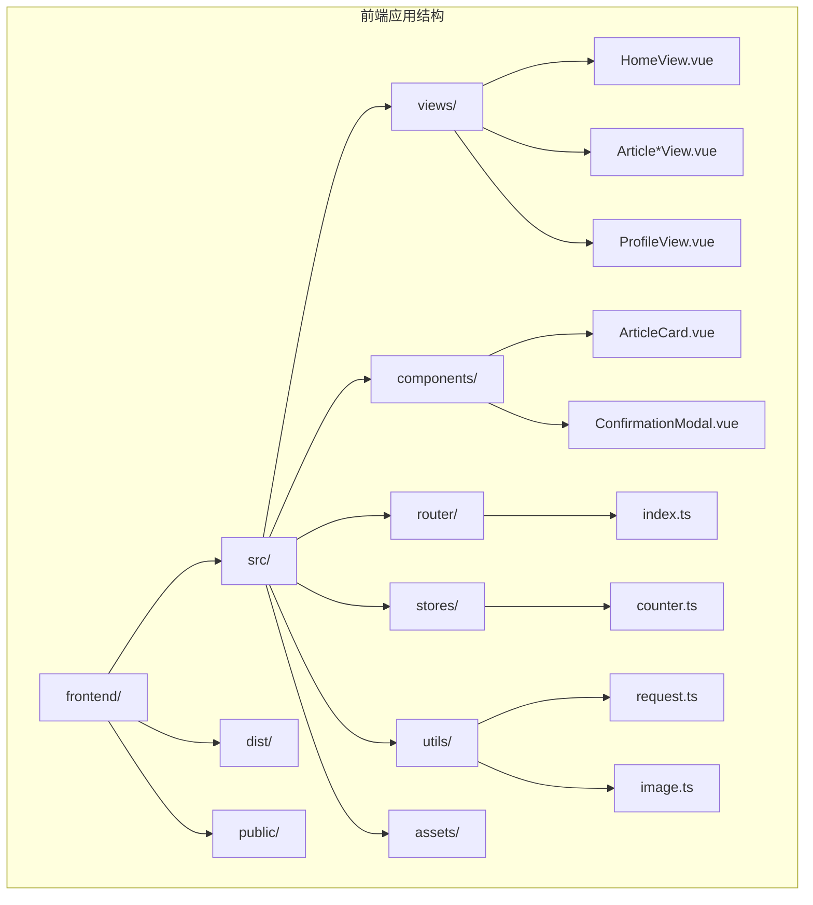

**图表来源**
- [HomeView.vue](file://frontend/src/views/HomeView.vue#L1-L50)
- [index.ts](file://frontend/src/router/index.ts#L1-L20)

**章节来源**
- [HomeView.vue](file://frontend/src/views/HomeView.vue#L1-L50)
- [index.ts](file://frontend/src/router/index.ts#L1-L20)

## 核心组件

主页视图作为应用的入口页面，集成了以下核心功能模块：

### 主要功能特性
- **智能搜索补全系统**：支持多字段实时搜索建议（用户名、地点、类别、标题、内容）
- **热门关键词推荐**：动态加载和展示热门搜索关键词
- **桌面端详情弹窗**：支持图片轮播、触摸滑动、滚轮切换的详细内容展示
- **响应式网格布局**：自适应2-6列布局，支持多设备访问
- **图片预览功能**：支持全屏图片浏览和导航
- **分类导航系统**：动态加载和展示文章分类
- **分页加载功能**：支持大数据量的分页浏览
- **页面过渡动画**：桌面端和移动端差异化动画效果
- **增强的布局系统**：优化的网格布局和响应式设计

### 技术栈
- **前端框架**：Vue 3 + TypeScript
- **UI库**：Tailwind CSS + Lucide Icons
- **状态管理**：Pinia
- **路由管理**：Vue Router
- **HTTP客户端**：Axios
- **动画系统**：CSS3 动画 + Vue Transition
- **搜索技术**：Elasticsearch Completion Suggester

**章节来源**
- [HomeView.vue](file://frontend/src/views/HomeView.vue#L494-L520)
- [main.ts](file://frontend/src/main.ts#L1-L11)

## 架构概览

系统采用前后端分离架构，主页视图作为前端单页面应用的核心组件：

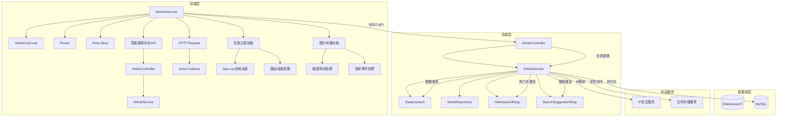

**图表来源**
- [HomeView.vue](file://frontend/src/views/HomeView.vue#L521-L523)
- [ArticleController.java](file://src/main/java/com/zhishilu/controller/ArticleController.java#L28-L35)
- [ArticleService.java](file://src/main/java/com/zhishilu/service/ArticleService.java#L62-L70)

## 详细组件分析

### 主页视图主组件

主页视图组件采用了模块化的架构设计，包含多个功能子模块：

#### 智能搜索补全模块

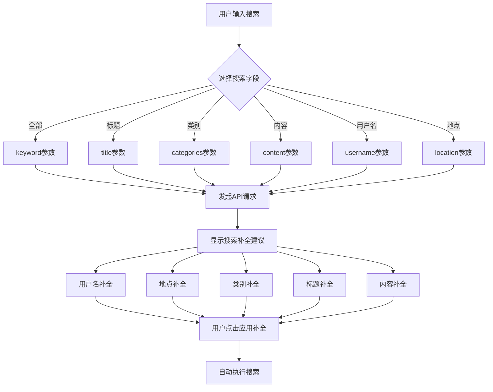

**图表来源**
- [HomeView.vue](file://frontend/src/views/HomeView.vue#L614-L642)
- [ArticleService.java](file://src/main/java/com/zhishilu/service/ArticleService.java#L334-L373)

#### 热门关键词系统模块

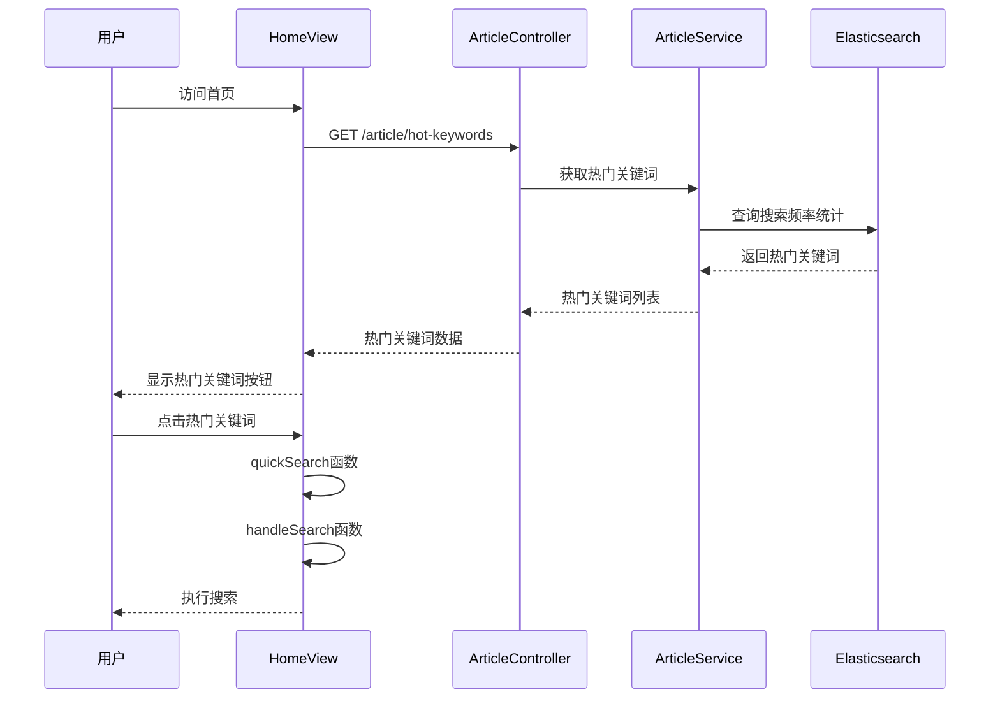

**图表来源**
- [HomeView.vue](file://frontend/src/views/HomeView.vue#L648-L661)
- [ArticleController.java](file://src/main/java/com/zhishilu/controller/ArticleController.java#L180-L185)

#### 分类导航模块

主页视图动态加载和展示文章分类，支持用户快速筛选：

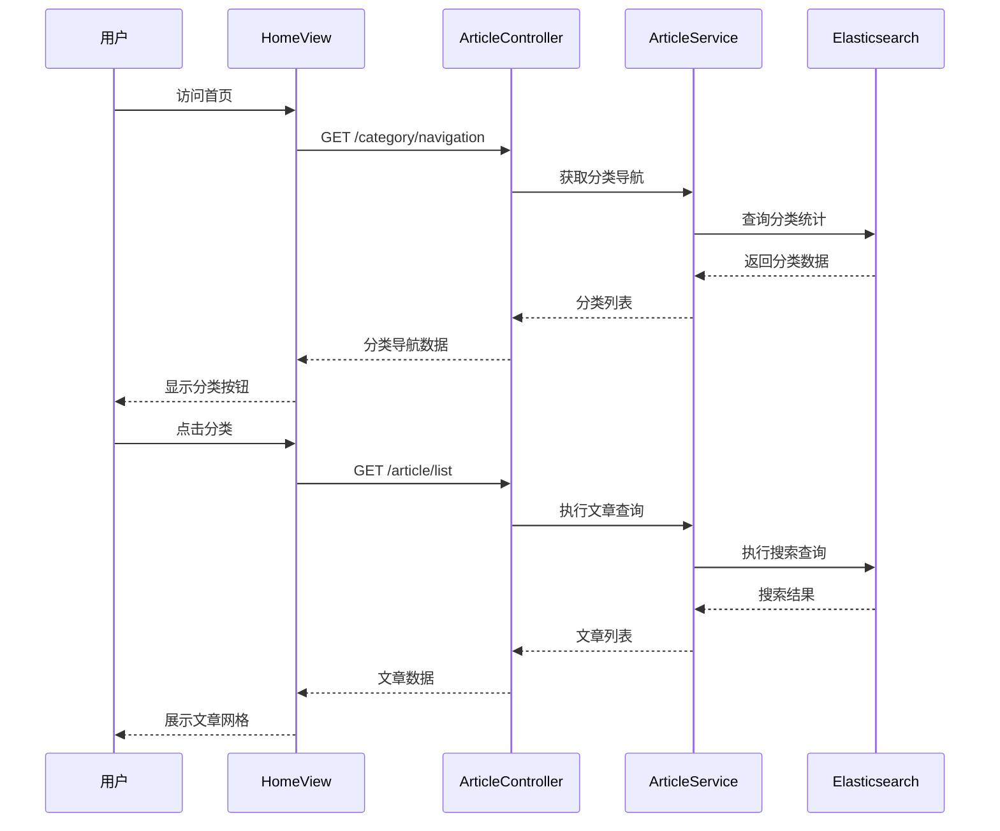

**图表来源**
- [HomeView.vue](file://frontend/src/views/HomeView.vue#L596-L608)
- [ArticleController.java](file://src/main/java/com/zhishilu/controller/ArticleController.java#L87-L93)

#### 文章卡片组件

ArticleCard 组件负责单个文章条目的渲染和交互，经过更新后优化了布局结构：

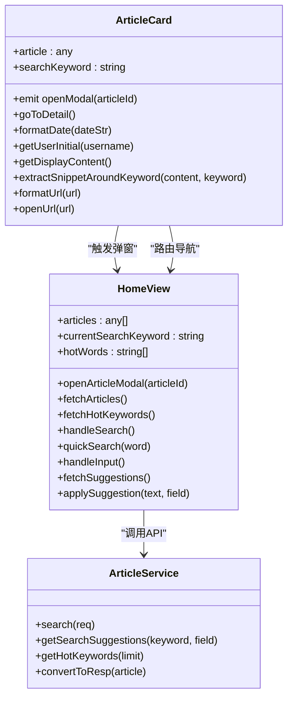

**图表来源**
- [ArticleCard.vue](file://frontend/src/components/ArticleCard.vue#L86-L100)
- [HomeView.vue](file://frontend/src/views/HomeView.vue#L751-L764)

**章节来源**
- [HomeView.vue](file://frontend/src/views/HomeView.vue#L1-L200)
- [ArticleCard.vue](file://frontend/src/components/ArticleCard.vue#L1-L120)

### 数据流分析

主页视图的数据流遵循单向数据流原则：

```mermaid
flowchart LR
subgraph "用户交互层"
A[搜索框] --> B[输入事件]
C[分类按钮] --> D[点击事件]
E[分页按钮] --> F[翻页事件]
G[热门关键词按钮] --> H[点击事件]
I[补全建议点击] --> J[应用补全]
K[图片轮播] --> L[触摸滑动]
M[滚轮事件] --> N[图片切换]
end
subgraph "状态管理层"
B --> O[searchQuery状态]
D --> P[selectedCategory状态]
F --> Q[page状态]
H --> R[quickSearch函数]
J --> S[applySuggestion函数]
L --> T[handleTouchEnd函数]
N --> U[handleWheel函数]
O --> V[watch监听器]
P --> V
Q --> V
R --> V
S --> V
T --> V
U --> V
end
subgraph "数据获取层"
V --> W[fetchArticles函数]
W --> X[HTTP请求]
X --> Y[ArticleController]
Y --> Z[ArticleService]
Z --> AA[Elasticsearch]
Z --> BB[fetchHotKeywords函数]
BB --> X
end
subgraph "视图更新层"
AA --> CC[文章列表]
BB --> DD[热门关键词]
CC --> EE[ArticleCard组件]
DD --> FF[热门关键词按钮]
EE --> GG[高亮显示]
FF --> HH[快速搜索]
EE --> II[弹窗触发]
II --> JJ[图片轮播]
JJ --> KK[触摸滑动]
KK --> LL[滚轮切换]
```

**图表来源**
- [HomeView.vue](file://frontend/src/views/HomeView.vue#L861-L865)
- [request.ts](file://frontend/src/utils/request.ts#L1-L65)

**章节来源**
- [HomeView.vue](file://frontend/src/views/HomeView.vue#L610-L661)
- [request.ts](file://frontend/src/utils/request.ts#L1-L65)

## 智能搜索补全系统

### 功能概述

智能搜索补全系统为用户提供了实时的搜索建议功能，支持用户名、地点、类别、标题、内容等多个字段的智能补全。该系统通过Elasticsearch的Completion Suggester技术实现实时搜索建议，显著提升了用户的搜索体验。

### 技术实现

#### 前端实现

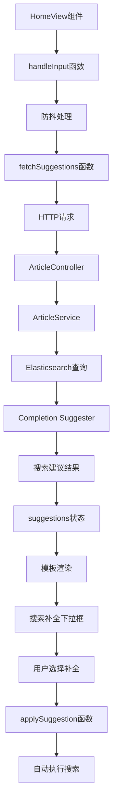

**图表来源**
- [HomeView.vue](file://frontend/src/views/HomeView.vue#L746-L790)
- [HomeView.vue](file://frontend/src/views/HomeView.vue#L762-L781)

#### 后端实现

后端服务通过Completion Suggester实现智能搜索补全：

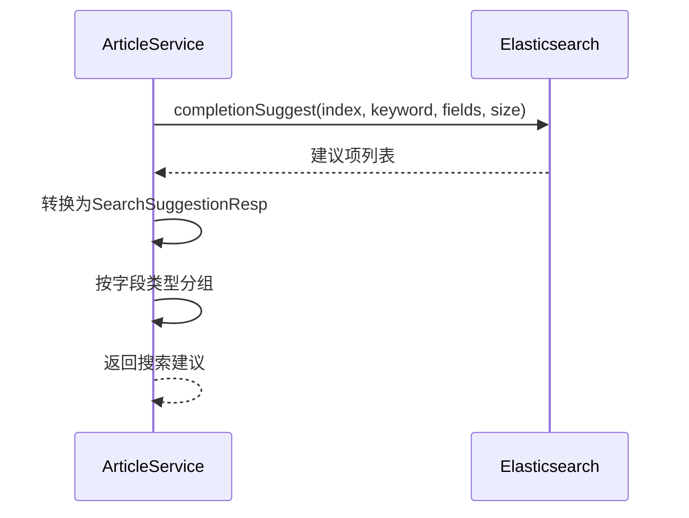

**图表来源**
- [ArticleService.java](file://src/main/java/com/zhishilu/service/ArticleService.java#L557-L586)

### 模板集成

智能搜索补全功能在模板中通过以下结构实现：

```html
<!-- 搜索补全下拉框 -->
<div
  v-if="showSuggestions && hasSuggestions"
  class="absolute top-full left-0 right-0 mt-1 bg-white rounded-xl shadow-lg border border-gray-100 overflow-hidden z-50"
>
  <!-- 用户名补全 -->
  <div v-if="suggestions.usernames?.length" class="border-b border-gray-50 last:border-b-0">
    <div class="px-3 py-1.5 bg-gray-50 text-[10px] text-gray-400 font-medium">用户名</div>
    <div
      v-for="item in suggestions.usernames"
      :key="'user-' + item.text"
      @mousedown.prevent="applySuggestion(item.text, 'username')"
      class="px-3 py-2 hover:bg-blue-50 cursor-pointer flex items-center justify-between group"
    >
      <span class="text-sm text-gray-700 group-hover:text-blue-600">{{ item.text }}</span>
    </div>
  </div>
  
  <!-- 地点补全 -->
  <div v-if="suggestions.locations?.length" class="border-b border-gray-50 last:border-b-0">
    <div class="px-3 py-1.5 bg-gray-50 text-[10px] text-gray-400 font-medium">地点</div>
    <div
      v-for="item in suggestions.locations"
      :key="'loc-' + item.text"
      @mousedown.prevent="applySuggestion(item.text, 'location')"
      class="px-3 py-2 hover:bg-blue-50 cursor-pointer flex items-center justify-between group"
    >
      <span class="text-sm text-gray-700 group-hover:text-blue-600">{{ item.text }}</span>
    </div>
  </div>
  
  <!-- 类别补全 -->
  <div v-if="suggestions.categories?.length" class="border-b border-gray-50 last:border-b-0">
    <div class="px-3 py-1.5 bg-gray-50 text-[10px] text-gray-400 font-medium">类别</div>
    <div
      v-for="item in suggestions.categories"
      :key="'cat-' + item.text"
      @mousedown.prevent="applySuggestion(item.text, 'category')"
      class="px-3 py-2 hover:bg-blue-50 cursor-pointer flex items-center justify-between group"
    >
      <span class="text-sm text-gray-700 group-hover:text-blue-600">{{ item.text }}</span>
    </div>
  </div>
  
  <!-- 标题补全 -->
  <div v-if="suggestions.titles?.length" class="border-b border-gray-50 last:border-b-0">
    <div class="px-3 py-1.5 bg-gray-50 text-[10px] text-gray-400 font-medium">标题</div>
    <div
      v-for="item in suggestions.titles"
      :key="'title-' + item.text"
      @mousedown.prevent="applySuggestion(item.text, 'title')"
      class="px-3 py-2 hover:bg-blue-50 cursor-pointer flex items-center justify-between group"
    >
      <span class="text-sm text-gray-700 group-hover:text-blue-600 truncate max-w-[200px]">{{ item.text }}</span>
    </div>
  </div>
  
  <!-- 内容补全 -->
  <div v-if="suggestions.contents?.length">
    <div class="px-3 py-1.5 bg-gray-50 text-[10px] text-gray-400 font-medium">内容</div>
    <div
      v-for="item in suggestions.contents"
      :key="'content-' + item.text"
      @mousedown.prevent="applySuggestion(item.text, 'content')"
      class="px-3 py-2 hover:bg-blue-50 cursor-pointer flex items-center justify-between group"
    >
      <span class="text-sm text-gray-700 group-hover:text-blue-600 truncate max-w-[200px]">{{ item.text }}</span>
    </div>
  </div>
</div>
```

**章节来源**
- [HomeView.vue](file://frontend/src/views/HomeView.vue#L59-L128)
- [HomeView.vue](file://frontend/src/views/HomeView.vue#L746-L790)
- [ArticleController.java](file://src/main/java/com/zhishilu/controller/ArticleController.java#L170-L172)

## 热门关键词推荐功能

### 功能概述

热门关键词功能为用户提供了智能化的内容发现能力，通过分析用户的搜索行为，动态展示当前最热门的搜索关键词。该功能与文章网格布局紧密结合，为用户提供了一站式的搜索体验。

### 技术实现

#### 前端实现

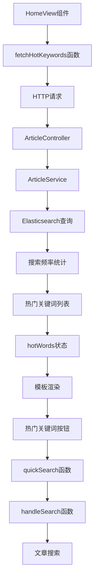

**图表来源**
- [HomeView.vue](file://frontend/src/views/HomeView.vue#L648-L661)
- [HomeView.vue](file://frontend/src/views/HomeView.vue#L724-L727)

#### 后端实现

后端服务通过聚合多个搜索建议索引来获取热门关键词：

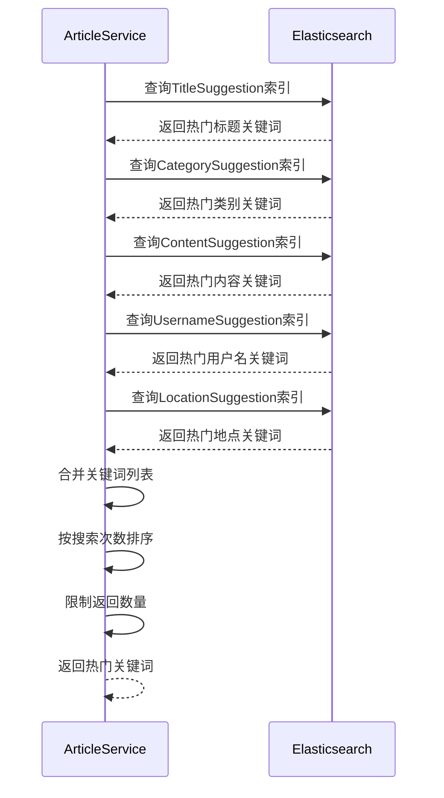

**图表来源**
- [ArticleService.java](file://src/main/java/com/zhishilu/service/ArticleService.java#L966-L982)

### 模板集成

热门关键词功能在模板中通过以下结构实现：

```html
<!-- 热门提示词 -->
<div class="flex items-center gap-2 sm:gap-3 overflow-x-auto scrollbar-hide py-1">
  <span class="text-[10px] sm:text-[11px] font-bold text-gray-400 uppercase tracking-widest whitespace-nowrap flex-shrink-0">热门:</span>
  <button
    v-for="word in hotWords"
    :key="word"
    @click="quickSearch(word)"
    class="text-[11px] sm:text-xs text-gray-500 hover:text-blue-600 transition-colors whitespace-nowrap"
  >
    {{ word }}
  </button>
</div>
```

**章节来源**
- [HomeView.vue](file://frontend/src/views/HomeView.vue#L148-L159)
- [HomeView.vue](file://frontend/src/views/HomeView.vue#L648-L661)
- [ArticleController.java](file://src/main/java/com/zhishilu/controller/ArticleController.java#L180-L185)

## 桌面端详情弹窗系统

### 功能概述

桌面端详情弹窗系统为用户提供了沉浸式的文章详情浏览体验，支持图片轮播、触摸滑动、滚轮切换等多种交互方式。该系统在桌面端提供类似模态框的体验，在移动端则直接跳转到详情页面。

### 技术实现

#### 弹窗触发机制

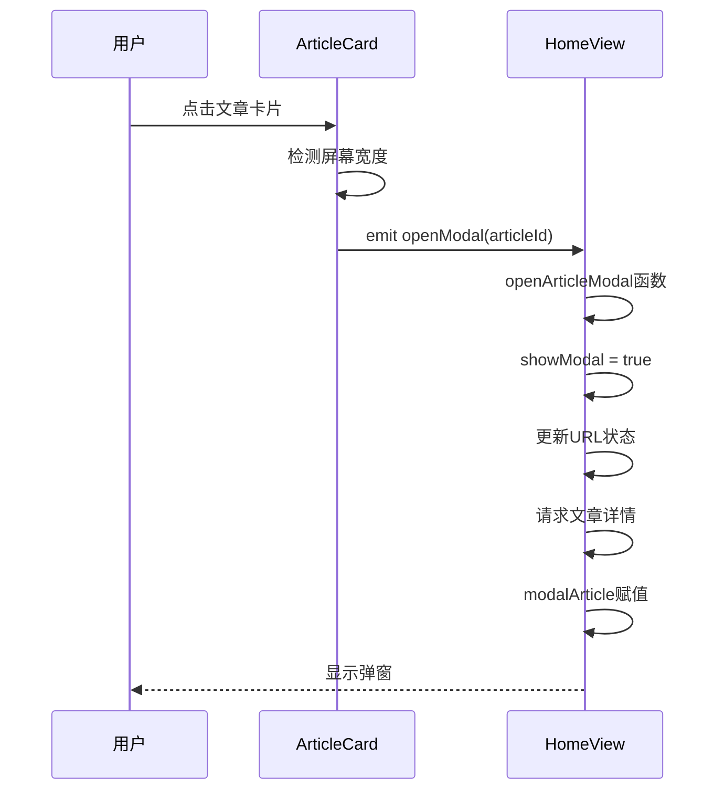

**图表来源**
- [ArticleCard.vue](file://frontend/src/components/ArticleCard.vue#L105-L112)
- [HomeView.vue](file://frontend/src/views/HomeView.vue#L822-L839)

#### 弹窗内容结构

桌面端弹窗采用左右布局设计：

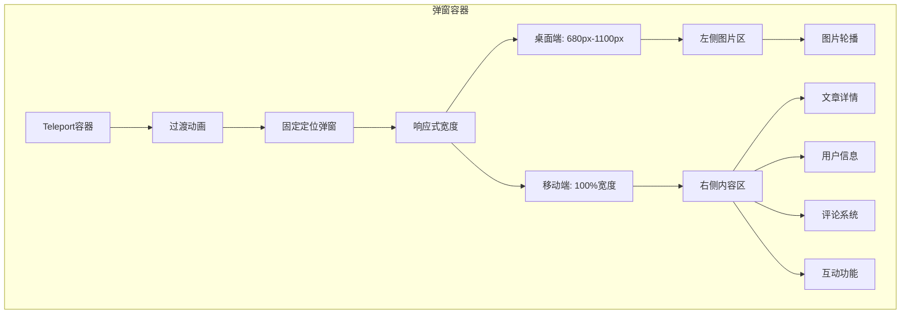

**图表来源**
- [HomeView.vue](file://frontend/src/views/HomeView.vue#L272-L463)

### 图片轮播功能

桌面端弹窗支持完整的图片轮播功能：

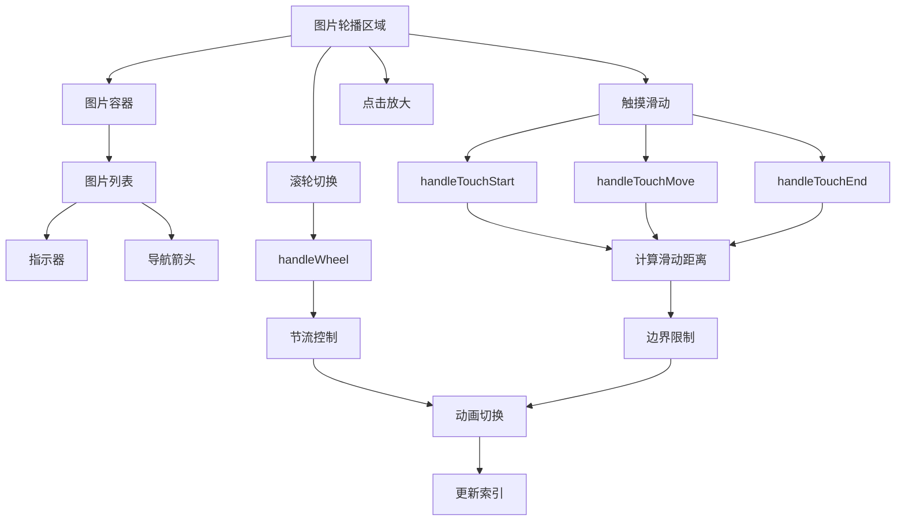

**图表来源**
- [HomeView.vue](file://frontend/src/views/HomeView.vue#L873-L937)

**章节来源**
- [HomeView.vue](file://frontend/src/views/HomeView.vue#L272-L463)
- [HomeView.vue](file://frontend/src/views/HomeView.vue#L822-L937)
- [ArticleCard.vue](file://frontend/src/components/ArticleCard.vue#L105-L112)

## 响应式网格布局优化

### 功能概述

响应式网格布局系统根据屏幕尺寸自动调整列数，支持2-6列的自适应布局。该系统在移动端提供2列布局，在平板提供3列，在小桌面提供4列，在大桌面提供5列，在超大屏提供6列。

### 技术实现

#### 布局算法

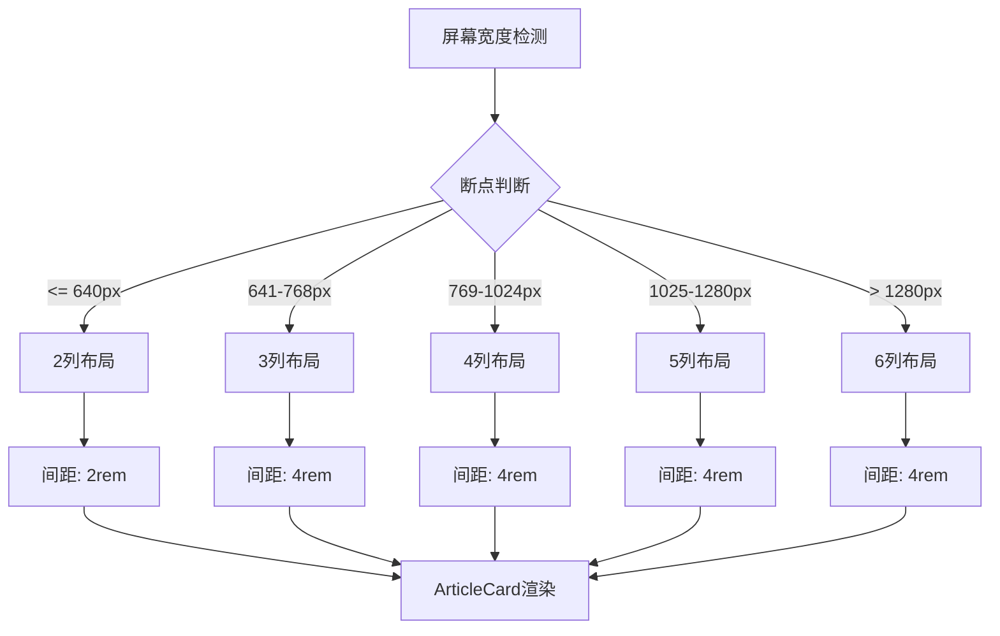

**图表来源**
- [HomeView.vue](file://frontend/src/views/HomeView.vue#L194-L209)

#### 网格容器实现

```html
<!-- 移动端：2列，平板：3列，小桌面：4列，大桌面：5列，超大屏：6列 -->
<div v-if="loading" class="grid grid-cols-2 sm:grid-cols-3 md:grid-cols-4 lg:grid-cols-5 xl:grid-cols-6 gap-2 sm:gap-4">
  <div v-for="i in 12" :key="i" class="bg-white border border-gray-100 rounded-xl overflow-hidden animate-pulse">
    <!-- 图片占位 -->
    <div class="aspect-square bg-gray-100"></div>
    <!-- 文字占位 -->
    <div class="p-2.5 space-y-1.5">
      <div class="h-3 bg-gray-100 rounded-full w-4/5"></div>
      <div class="h-3 bg-gray-100 rounded-full w-3/5"></div>
      <div class="h-2.5 bg-gray-50 rounded-full w-2/5 mt-2"></div>
    </div>
  </div>
</div>

<div v-else-if="articles.length > 0" class="grid grid-cols-2 sm:grid-cols-3 md:grid-cols-4 lg:grid-cols-5 xl:grid-cols-6 gap-2 sm:gap-4">
  <ArticleCard v-for="item in articles" :key="item.id" :article="item" :search-keyword="currentSearchKeyword" @open-modal="openArticleModal" />
</div>
```

**章节来源**
- [HomeView.vue](file://frontend/src/views/HomeView.vue#L194-L242)

## 图片轮播和触摸滑动支持

### 功能概述

图片轮播系统支持多种交互方式，包括触摸滑动、滚轮切换、点击放大等。该系统具有边界限制、节流控制、动画过渡等特性，确保流畅的用户体验。

### 技术实现

#### 触摸滑动处理

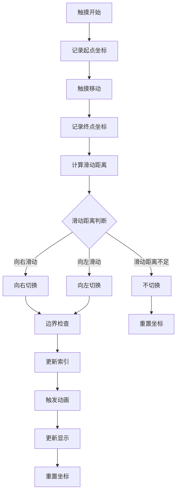

**图表来源**
- [HomeView.vue](file://frontend/src/views/HomeView.vue#L873-L901)

#### 滚轮切换处理

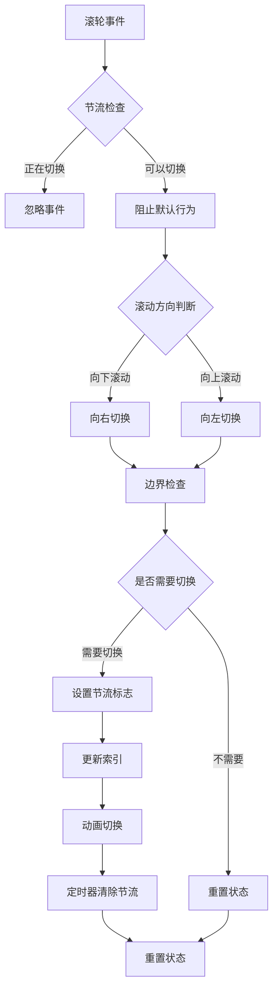

**图表来源**
- [HomeView.vue](file://frontend/src/views/HomeView.vue#L903-L937)

#### 图片预览功能

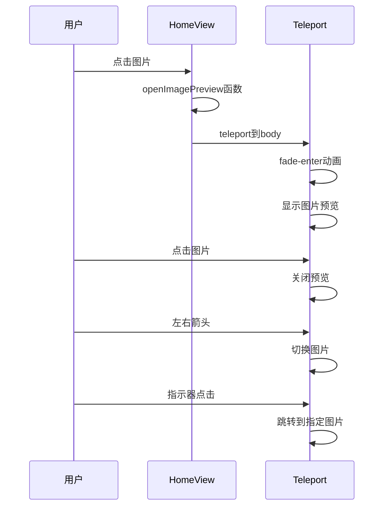

**图表来源**
- [HomeView.vue](file://frontend/src/views/HomeView.vue#L862-L871)
- [HomeView.vue](file://frontend/src/views/HomeView.vue#L465-L505)

**章节来源**
- [HomeView.vue](file://frontend/src/views/HomeView.vue#L873-L937)
- [HomeView.vue](file://frontend/src/views/HomeView.vue#L862-L871)
- [HomeView.vue](file://frontend/src/views/HomeView.vue#L465-L505)

## 页面过渡动画系统

### 全局动画控制器

App.vue 实现了全局的页面过渡动画控制系统，提供了灵活的动画配置和性能优化：

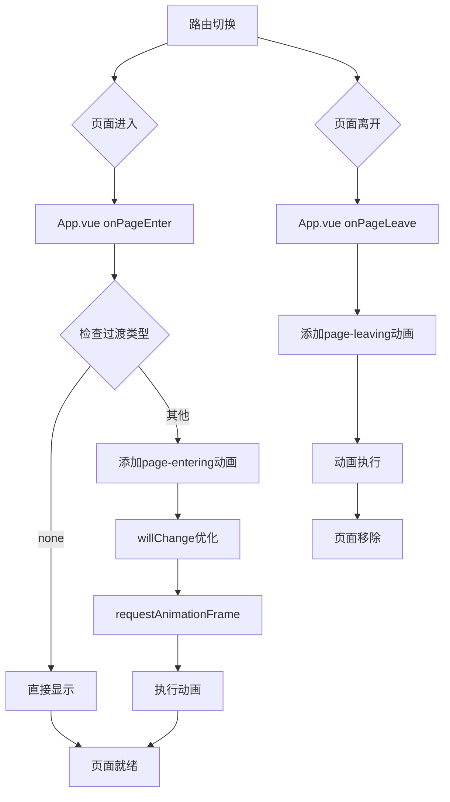

**图表来源**
- [App.vue](file://frontend/src/App.vue#L9-L31)
- [style.css](file://frontend/src/style.css#L146-L175)

### 路由动画配置

路由系统为不同页面配置了专门的过渡动画效果：

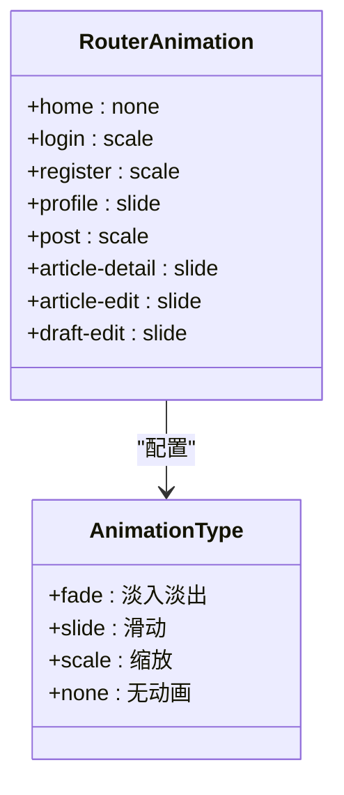

**图表来源**
- [index.ts](file://frontend/src/router/index.ts#L27-L96)
- [style.css](file://frontend/src/style.css#L42-L123)

### 弹窗动画系统

桌面端弹窗使用优化的缩放和透明度组合动画：

```mermaid
sequenceDiagram
participant U as 用户
participant T as Teleport
participant M as Modal
U->>T : 打开文章详情
T->>M : 进入动画
M->>M : opacity 0.35s
M->>M : transform scale 0.85
M->>M : translateY 20px
M->>M : 动画完成
M->>U : 显示详情
```

**图表来源**
- [HomeView.vue](file://frontend/src/views/HomeView.vue#L274-L276)
- [HomeView.vue](file://frontend/src/views/HomeView.vue#L1029-L1047)

移动端弹窗使用底部滑入动画：

```mermaid
sequenceDiagram
participant U as 用户
participant T as Teleport
participant M as Modal
U->>T : 打开文章详情
T->>M : 进入动画
M->>M : transform translateY 100%
M->>M : 动画完成
M->>U : 显示详情
```

**图表来源**
- [HomeView.vue](file://frontend/src/views/HomeView.vue#L1049-L1066)
- [HomeView.vue](file://frontend/src/views/HomeView.vue#L464-L502)

### 图片预览动画

图片预览系统实现了流畅的淡入淡出动画效果：

```mermaid
flowchart TD
A[点击图片] --> B{预览模式}
B --> |首次| C[创建预览容器]
B --> |已存在| D[更新索引]
C --> E[fade-enter-active]
D --> E
E --> F[opacity 0.3s]
E --> G[transform scale 1.1]
E --> H[动画完成]
H --> I[显示图片]
```

**图表来源**
- [HomeView.vue](file://frontend/src/views/HomeView.vue#L464-L502)
- [style.css](file://frontend/src/style.css#L1068-L1080)

**章节来源**
- [App.vue](file://frontend/src/App.vue#L9-L31)
- [style.css](file://frontend/src/style.css#L177-L192)
- [HomeView.vue](file://frontend/src/views/HomeView.vue#L1104-L1171)

## 增强的布局功能

### ArticleCard组件布局优化

**更新** ArticleCard组件经过重要布局改进，新增了flex-grow占位符确保底部信息始终位于卡片底部：

```mermaid
flowchart TD
A[ArticleCard容器] --> B[flex-col布局]
B --> C[顶部图片区域]
C --> D[分类标签覆盖]
D --> E[底部信息区]
E --> F[flex-grow占位符]
F --> G[发布人信息]
G --> H[时间地点信息]
H --> I[链接信息]
```

**图表来源**
- [ArticleCard.vue](file://frontend/src/components/ArticleCard.vue#L41-L85)

#### 占位符机制详解

ArticleCard组件通过flex-grow占位符实现了智能的内容分布：

1. **flex-grow占位符**：位于标题和摘要之后，使用`<div class="flex-grow"></div>`实现弹性占位
2. **内容分布**：占位符将底部信息推到底部，确保发布人信息始终可见
3. **响应式适配**：在不同屏幕尺寸下保持一致的视觉层次
4. **内容溢出处理**：当内容较少时，占位符填充剩余空间

#### 弹性布局优势

```mermaid
graph TB
subgraph "优化前布局"
A[标题] --> B[摘要]
B --> C[发布人信息]
C --> D[时间地点信息]
D --> E[链接信息]
end
subgraph "优化后布局"
A[标题] --> B[摘要]
B --> F[flex-grow占位符]
F --> C[发布人信息]
C --> D[时间地点信息]
D --> E[链接信息]
end
```

**图表来源**
- [ArticleCard.vue](file://frontend/src/components/ArticleCard.vue#L56-L57)

### 弹窗动画系统

系统实现了两种不同的弹窗动画效果，分别针对桌面端和移动端：

#### 桌面端弹窗动画

桌面端弹窗使用缩放和透明度组合动画：

```mermaid
sequenceDiagram
participant U as 用户
participant T as Teleport
participant M as Modal
U->>T : 打开文章详情
T->>M : 进入动画
M->>M : opacity 0.35s
M->>M : transform scale 0.85
M->>M : translateY 20px
M->>M : 动画完成
M->>U : 显示详情
```

**图表来源**
- [HomeView.vue](file://frontend/src/views/HomeView.vue#L274-L276)
- [HomeView.vue](file://frontend/src/views/HomeView.vue#L1029-L1047)

#### 移动端弹窗动画

移动端弹窗使用底部滑入动画：

```mermaid
sequenceDiagram
participant U as 用户
participant T as Teleport
participant M as Modal
U->>T : 打开文章详情
T->>M : 进入动画
M->>M : transform translateY 100%
M->>M : 动画完成
M->>U : 显示详情
```

**图表来源**
- [HomeView.vue](file://frontend/src/views/HomeView.vue#L1049-L1066)
- [HomeView.vue](file://frontend/src/views/HomeView.vue#L464-L502)

### 图片预览动画

图片预览系统实现了流畅的淡入淡出动画效果：

```mermaid
flowchart TD
A[点击图片] --> B{预览模式}
B --> |首次| C[创建预览容器]
B --> |已存在| D[更新索引]
C --> E[fade-enter-active]
D --> E
E --> F[opacity 0.3s]
E --> G[transform scale 1.1]
E --> H[动画完成]
H --> I[显示图片]
```

**图表来源**
- [HomeView.vue](file://frontend/src/views/HomeView.vue#L464-L502)
- [style.css](file://frontend/src/style.css#L1068-L1080)

**章节来源**
- [HomeView.vue](file://frontend/src/views/HomeView.vue#L194-L242)
- [HomeView.vue](file://frontend/src/views/HomeView.vue#L274-L502)
- [ArticleCard.vue](file://frontend/src/components/ArticleCard.vue#L41-L85)
- [style.css](file://frontend/src/style.css#L1014-L1080)

## 依赖关系分析

### 前端依赖关系

```mermaid
graph TB
subgraph "HomeView 依赖关系"
A[HomeView.vue] --> B[ArticleCard.vue]
A --> C[request.ts]
A --> D[image.ts]
A --> E[lucide-vue-next]
A --> F[vue-router]
A --> G[axios]
A --> H[页面过渡动画]
H --> I[App.vue]
H --> J[style.css]
A --> K[HotKeywordResp接口]
K --> L[HotKeywordResp.java]
A --> M[SearchSuggestionResp接口]
M --> N[SearchSuggestionResp.java]
end
subgraph "全局配置"
O[main.ts] --> P[createPinia]
O --> Q[createRouter]
R[App.vue] --> S[keep-alive缓存]
S --> T[HomeView缓存]
end
subgraph "路由配置"
U[index.ts] --> V[HomeView路由]
U --> W[其他页面路由]
U --> X[路由守卫]
U --> Y[动画配置]
end
A --> O
A --> U
B --> C
C --> F
```

**图表来源**
- [HomeView.vue](file://frontend/src/views/HomeView.vue#L521-L523)
- [main.ts](file://frontend/src/main.ts#L1-L11)
- [index.ts](file://frontend/src/router/index.ts#L1-L20)

### 后端依赖关系

后端服务层采用依赖注入模式，确保组件间的松耦合：

```mermaid
classDiagram
class ArticleController {
-ArticleService articleService
-IpLocationService ipLocationService
+create(req)
+list(req)
+getById(id)
+getSearchSuggestions(keyword, field)
+getHotKeywords(limit)
}
class ArticleService {
-ArticleRepository articleRepository
-ElasticsearchOperations elasticsearchOperations
-RestHighLevelClient restHighLevelClient
-CategoryStatsService categoryStatsService
-UserService userService
-EsCompletionSuggestUtil esCompletionSuggestUtil
+create(req, currentUser)
+search(req)
+getSearchSuggestions(keyword, field)
+getHotKeywords(limit)
}
class ArticleRepository {
+save(article)
+findById(id)
+findByCreatorIdAndStatus(userId, status)
}
class ElasticsearchOperations {
+search(query, clazz)
+save(entity)
}
class HotKeywordResp {
+keyword : string
+searchCount : long
}
class SearchSuggestionResp {
+usernames : SuggestionItem[]
+locations : SuggestionItem[]
+categories : SuggestionItem[]
+titles : SuggestionItem[]
+contents : SuggestionItem[]
}
ArticleController --> ArticleService : "依赖"
ArticleService --> ArticleRepository : "依赖"
ArticleService --> ElasticsearchOperations : "依赖"
ArticleService --> CategoryStatsService : "依赖"
ArticleService --> UserService : "依赖"
ArticleService --> HotKeywordResp : "返回"
ArticleService --> SearchSuggestionResp : "返回"
```

**图表来源**
- [ArticleController.java](file://src/main/java/com/zhishilu/controller/ArticleController.java#L32-L35)
- [ArticleService.java](file://src/main/java/com/zhishilu/service/ArticleService.java#L62-L70)

**章节来源**
- [HomeView.vue](file://frontend/src/views/HomeView.vue#L521-L523)
- [ArticleController.java](file://src/main/java/com/zhishilu/controller/ArticleController.java#L32-L35)

## 性能考虑

### 前端性能优化

1. **虚拟滚动和懒加载**
   - 使用响应式网格布局，根据屏幕尺寸调整列数
   - 图片懒加载，提升首屏加载速度
   - 热门关键词数据缓存，避免重复请求
   - 搜索补全防抖处理，减少API调用频率

2. **状态缓存策略**
   - 使用 keep-alive 缓存 HomeView 组件
   - sessionStorage 标记数据刷新需求
   - 热门关键词状态持久化
   - 搜索建议状态缓存

3. **搜索防抖机制**
   - 输入事件防抖处理，减少不必要的API调用
   - 搜索建议延迟加载（300ms）
   - 热门关键词一次性加载
   - 补全建议按需加载

4. **动画性能优化**
   - 使用 will-change 属性优化硬件加速
   - 移动端动画时长缩短至0.25秒
   - transform 和 opacity 属性避免重排
   - 弹窗动画使用GPU加速

5. **布局性能优化**
   - **flex-grow占位符优化**：减少布局重计算，提升渲染性能
   - **弹性布局替代绝对定位**：提高响应式兼容性
   - **CSS Grid与Flexbox结合**：优化复杂布局场景
   - **图片轮播使用transform**：避免重排重绘

6. **图片处理优化**
   - 图片轮播使用transform translate，避免重排
   - 图片预览使用CSS动画，提升流畅度
   - 触摸滑动使用requestAnimationFrame，确保60fps
   - 滚轮切换使用节流，防止频繁切换

### 后端性能优化

1. **Elasticsearch 优化**
   - 高亮查询优化，仅返回必要字段
   - 分页查询限制，避免大数据量扫描
   - 热门关键词查询使用范围查询优化
   - 搜索建议使用Completion Suggester，提升查询性能

2. **异步处理**
   - 搜索频率统计异步更新
   - 补全建议同步处理
   - 热门关键词聚合查询优化
   - 图片预览使用CDN加速

**章节来源**
- [HomeView.vue](file://frontend/src/views/HomeView.vue#L676-L690)
- [ArticleService.java](file://src/main/java/com/zhishilu/service/ArticleService.java#L326-L327)
- [style.css](file://frontend/src/style.css#L177-L192)

## 故障排除指南

### 常见问题及解决方案

#### 智能搜索补全异常
1. **问题症状**：搜索补全无响应或显示空白
2. **可能原因**：
   - Elasticsearch 补全索引未建立
   - 搜索字段参数错误
   - 网络连接问题
   - 防抖机制导致的延迟

3. **解决步骤**：
   - 检查 /article/suggestions 接口状态
   - 验证Elasticsearch补全索引数据
   - 确认搜索字段映射正确
   - 检查防抖定时器是否正确清理
   - 验证搜索建议数据格式

#### 热门关键词功能异常
1. **问题症状**：热门关键词不显示或显示为空
2. **可能原因**：
   - 后端热门关键词服务异常
   - Elasticsearch 热门关键词索引为空
   - 前端数据处理错误

3. **解决步骤**：
   - 检查后端 /article/hot-keywords 接口状态
   - 验证 Elasticsearch 中的 suggestion 索引数据
   - 确认前端 hotWords 状态更新逻辑
   - 检查网络请求和错误处理

#### 图片轮播功能异常
1. **问题症状**：图片无法切换或滑动无响应
2. **可能原因**：
   - 触摸事件处理异常
   - 滚轮事件冲突
   - 边界检查逻辑错误
   - 动画节流未正确清除

3. **解决步骤**：
   - 检查触摸事件绑定是否正确
   - 验证滚轮事件阻止默认行为
   - 确认边界检查逻辑
   - 检查节流定时器清理
   - 验证transform动画是否生效

#### 弹窗功能异常
1. **问题症状**：弹窗无法打开或关闭
2. **可能原因**：
   - Teleport 容器问题
   - URL状态管理异常
   - 动画事件监听异常
   - 浏览器后退按钮处理异常

3. **解决步骤**：
   - 检查 Teleport 容器是否存在
   - 验证URL状态push和back逻辑
   - 确认动画事件监听器绑定
   - 检查popstate事件处理
   - 验证文章详情数据加载

#### 分页功能异常
1. **问题症状**：分页按钮无效
2. **排查步骤**：
   - 检查 total 页面计算
   - 验证 API 返回数据格式
   - 确认分页参数传递
   - 检查页面状态更新

#### 动画系统异常
1. **问题症状**：页面切换动画不流畅
2. **可能原因**：
   - CSS 动画属性配置错误
   - 硬件加速未启用
   - 设备性能不足
   - 动画事件监听异常

3. **解决步骤**：
   - 检查 will-change 属性设置
   - 验证 transform 和 opacity 属性
   - 调整动画时长和缓动函数
   - 检查动画事件监听器
   - 验证GPU加速是否生效

#### ArticleCard布局问题
1. **问题症状**：底部信息位置异常或被遮挡
2. **可能原因**：
   - flex-grow占位符未正确应用
   - CSS样式冲突
   - 内容溢出导致布局错乱

3. **解决步骤**：
   - 检查ArticleCard组件的flex-grow占位符
   - 验证flex-col布局是否正确应用
   - 确认底部信息区域的z-index层级
   - 检查响应式断点下的布局表现

**章节来源**
- [request.ts](file://frontend/src/utils/request.ts#L34-L62)
- [image.ts](file://frontend/src/utils/image.ts#L6-L15)
- [App.vue](file://frontend/src/App.vue#L9-L31)

## 结论

主页视图作为知识路项目的核心组件，展现了现代前端开发的最佳实践。通过模块化设计、响应式布局、完善的错误处理机制以及先进的页面过渡动画系统，为用户提供了流畅且直观的知识管理体验。

### 主要优势
- **用户体验优秀**：响应式设计支持多设备访问
- **功能完整**：涵盖智能搜索、分类、详情展示、热门关键词推荐等核心功能
- **性能优化**：采用多种优化策略提升加载速度
- **动画流畅**：精心设计的页面过渡动画系统
- **交互丰富**：桌面端弹窗、图片轮播、触摸滑动等高级交互
- **可维护性强**：清晰的代码结构和模块划分
- **智能化推荐**：热门关键词功能提升内容发现效率
- **布局优化**：ArticleCard组件的flex-grow占位符确保内容分布合理
- **搜索体验**：智能搜索补全提供更好的搜索体验

### 改进建议
- 可以考虑添加更多的搜索过滤选项
- 增加用户个性化推荐功能
- 优化移动端触摸交互体验
- 添加离线缓存机制
- 进一步优化动画性能
- 增强热门关键词的动态更新机制
- **考虑添加卡片悬停效果**：利用现有的hover:shadow-xl类实现更丰富的交互反馈
- **优化图片加载策略**：添加图片懒加载和预加载机制

### 功能增强成果

**更新** 本次更新显著提升了主页视图的功能性和用户体验：

1. **智能搜索补全**：通过Elasticsearch Completion Suggester实现多字段实时补全
2. **桌面端详情弹窗**：提供沉浸式文章浏览体验，支持多种交互方式
3. **图片轮播系统**：完整的触摸滑动、滚轮切换、点击放大功能
4. **响应式网格布局**：2-6列自适应布局，适配各种设备
5. **增强ArticleCard布局**：flex-grow占位符确保底部信息始终可见
6. **优化动画系统**：桌面端和移动端差异化动画效果
7. **性能优化**：防抖、节流、缓存等多重优化策略

该组件为整个知识路项目奠定了坚实的技术基础，为后续功能扩展提供了良好的架构支撑。智能搜索补全、桌面端详情弹窗、图片轮播和触摸滑动支持等功能的集成，显著提升了平台的智能化水平和用户体验。ArticleCard组件的布局优化和整体动画系统的完善，为项目的视觉质量和交互体验提供了重要保障。