# Profile View 个人中心功能文档

<cite>
**本文档引用的文件**
- [ProfileView.vue](file://frontend/src/views/ProfileView.vue)
- [index.ts](file://frontend/src/router/index.ts)
- [UserController.java](file://src/main/java/com/zhishilu/controller/UserController.java)
- [UserService.java](file://src/main/java/com/zhishilu/service/UserService.java)
- [User.java](file://src/main/java/com/zhishilu/entity/User.java)
- [AdminUtil.java](file://src/main/java/com/zhishilu/util/AdminUtil.java)
- [request.ts](file://frontend/src/utils/request.ts)
- [image.ts](file://frontend/src/utils/image.ts)
- [ArticleDetail.vue](file://frontend/src/components/profile/ArticleDetail.vue)
- [ArticleEdit.vue](file://frontend/src/components/profile/ArticleEdit.vue)
- [DraftEdit.vue](file://frontend/src/components/profile/DraftEdit.vue)
- [ConfirmationModal.vue](file://frontend/src/components/ConfirmationModal.vue)
- [AdvancedModal.vue](file://frontend/src/components/AdvancedModal.vue)
- [UserRepository.java](file://src/main/java/com/zhishilu/repository/UserRepository.java)
- [application.yml](file://src/main/resources/application.yml)
- [user-mapping.json](file://src/main/resources/user-mapping.json)
</cite>

## 更新摘要
**变更内容**
- 新增管理员用户密码重置功能，支持安全的密码重置操作
- 新增专用密码重置模态框界面，提供直观的用户交互体验
- 实现完整的表单验证逻辑，包括密码长度和一致性检查
- 增强用户管理功能，为管理员提供更全面的用户管理能力
- 完善管理员权限控制和安全机制

## 目录
1. [简介](#简介)
2. [项目结构](#项目结构)
3. [核心组件](#核心组件)
4. [架构概览](#架构概览)
5. [详细组件分析](#详细组件分析)
6. [管理员用户管理功能](#管理员用户管理功能)
7. [密码重置功能](#密码重置功能)
8. [模态框界面设计](#模态框界面设计)
9. [表单验证逻辑](#表单验证逻辑)
10. [依赖关系分析](#依赖关系分析)
11. [性能考虑](#性能考虑)
12. [故障排除指南](#故障排除指南)
13. [结论](#结论)

## 简介

Profile View 是一个基于 Vue 3 + Spring Boot 的个人中心功能模块，提供了完整的用户个人信息管理、内容管理和管理员功能。该模块采用现代化的前端技术栈和微服务架构设计，支持响应式布局和丰富的交互体验。

**更新** 新增了完整的管理员用户管理功能，包括用户列表管理、授权状态控制、用户删除功能和密码重置功能，为系统提供了强大的用户管理能力。同时引入了专用的密码重置模态框界面和完整的表单验证逻辑，显著提升了用户体验和安全性。

## 项目结构

该项目采用前后端分离的架构设计，主要包含以下核心模块：

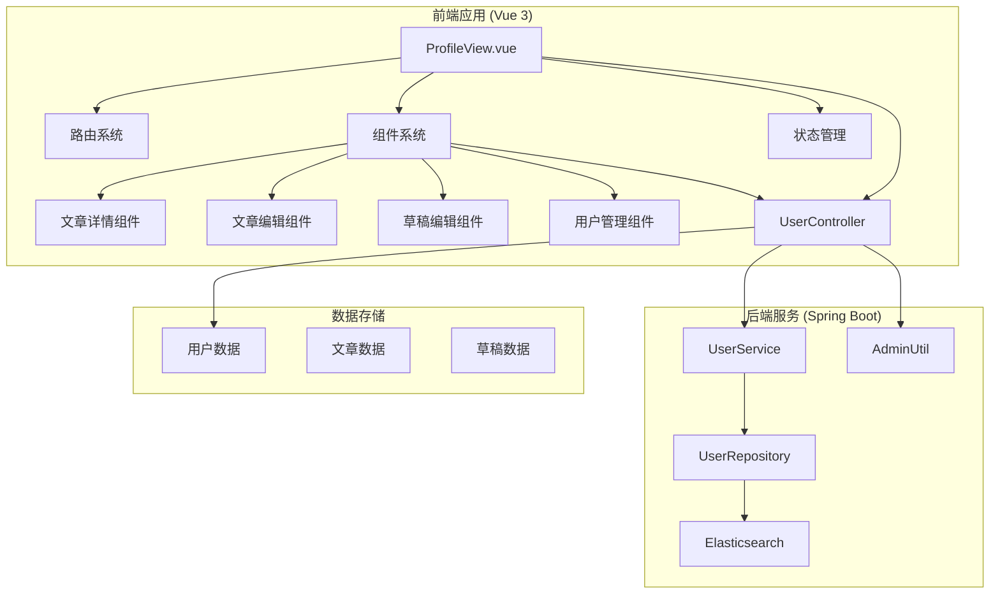

**图表来源**
- [ProfileView.vue](file://frontend/src/views/ProfileView.vue#L1-L893)
- [UserController.java](file://src/main/java/com/zhishilu/controller/UserController.java#L1-L258)

**章节来源**
- [ProfileView.vue](file://frontend/src/views/ProfileView.vue#L1-L893)
- [index.ts](file://frontend/src/router/index.ts#L1-L120)

## 核心组件

### 主要功能模块

Profile View 提供了以下核心功能模块：

1. **用户信息管理**
   - 头像上传和预览
   - 密码修改功能
   - 基本信息展示

2. **内容管理**
   - 我的发布内容展示
   - 文章详情查看
   - 文章编辑功能
   - 草稿箱管理

3. **管理员功能**
   - **用户列表管理** - 完整的用户列表展示和管理
   - **用户授权状态控制** - 支持授权和取消授权操作
   - **用户删除功能** - 安全的用户删除机制
   - **用户密码重置** - 管理员专用的密码重置功能
   - **权限过滤** - 基于角色的权限控制

4. **模态框界面**
   - **密码重置模态框** - 专用的密码重置界面
   - **确认对话框** - 标准化的操作确认界面
   - **高级模态框** - 支持多种类型的模态框组件

5. **响应式设计**
   - 移动端适配
   - 触摸手势支持
   - 渐进式增强

**更新** 管理员功能模块现在包含了完整的用户管理系统，包括密码重置功能，为系统管理员提供了强大的用户管理能力。

**章节来源**
- [ProfileView.vue](file://frontend/src/views/ProfileView.vue#L422-L893)

## 架构概览

系统采用分层架构设计，实现了清晰的职责分离：

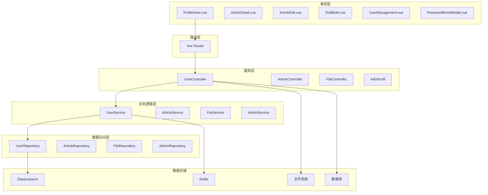

**图表来源**
- [ProfileView.vue](file://frontend/src/views/ProfileView.vue#L422-L480)
- [UserController.java](file://src/main/java/com/zhishilu/controller/UserController.java#L25-L29)

## 详细组件分析

### ProfileView 组件架构

ProfileView 作为主组件，采用了模块化的设计模式：

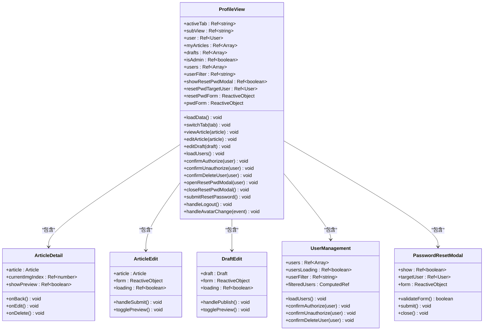

**图表来源**
- [ProfileView.vue](file://frontend/src/views/ProfileView.vue#L422-L532)
- [ArticleDetail.vue](file://frontend/src/components/profile/ArticleDetail.vue#L132-L168)
- [ArticleEdit.vue](file://frontend/src/components/profile/ArticleEdit.vue#L150-L174)
- [DraftEdit.vue](file://frontend/src/components/profile/DraftEdit.vue#L151-L175)

#### 数据流管理

ProfileView 实现了复杂的数据流管理机制：

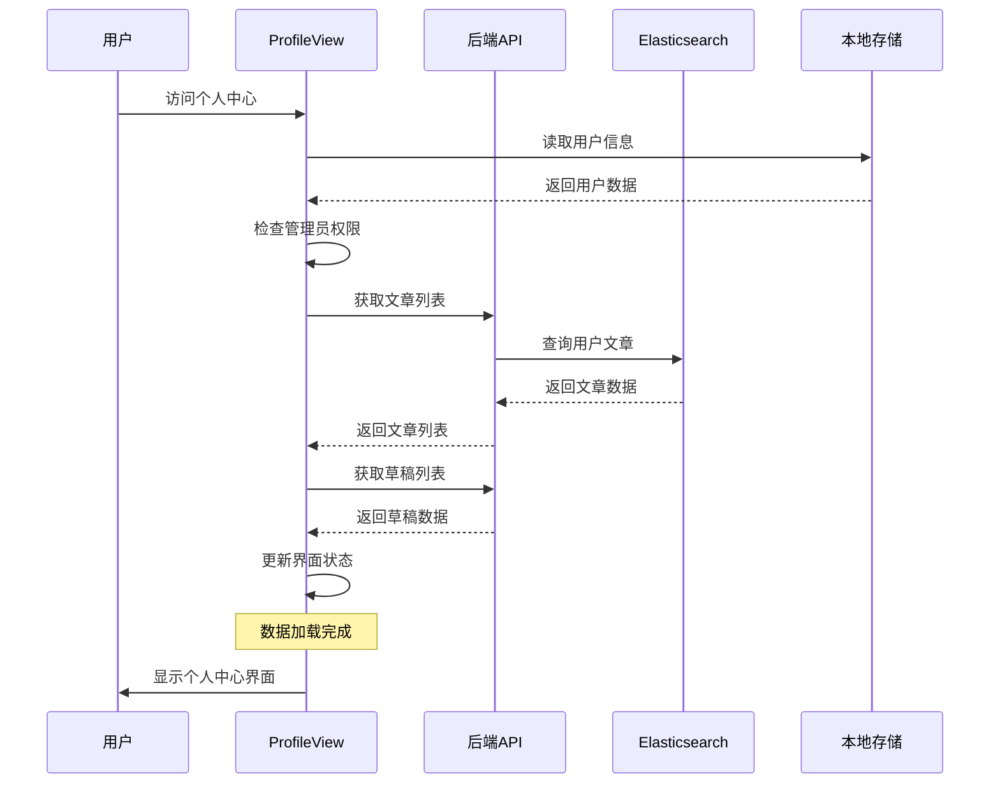

**图表来源**
- [ProfileView.vue](file://frontend/src/views/ProfileView.vue#L534-L561)
- [UserController.java](file://src/main/java/com/zhishilu/controller/UserController.java#L38-L54)

#### 头像上传流程

头像上传功能实现了完整的文件处理流程：

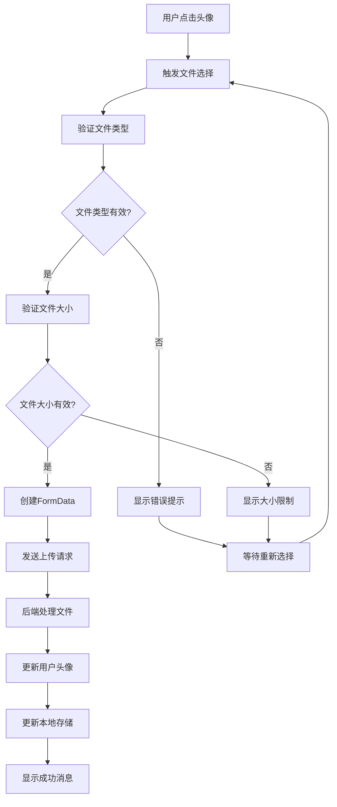

**图表来源**
- [ProfileView.vue](file://frontend/src/views/ProfileView.vue#L648-L695)
- [UserController.java](file://src/main/java/com/zhishilu/controller/UserController.java#L58-L84)

**章节来源**
- [ProfileView.vue](file://frontend/src/views/ProfileView.vue#L422-L893)

### 路由系统集成

路由系统为 Profile View 提供了完整的导航支持：

```mermaid
graph LR
A[/profile] --> B[ProfileView]
B --> C[账号设置]
B --> D[我的发布]
B --> E[草稿箱]
B --> F[用户管理]
G[/article/:id] --> H[ArticleDetailView]
I[/article/edit/:id] --> J[ArticleEditView]
K[/draft/:id/edit] --> L[DraftEditView]
M[导航栏] --> C
M --> D
M --> E
M --> F
```

**图表来源**
- [index.ts](file://frontend/src/router/index.ts#L50-L96)

**章节来源**
- [index.ts](file://frontend/src/router/index.ts#L1-L120)

### 后端服务架构

后端采用分层架构设计，确保了良好的可维护性和扩展性：

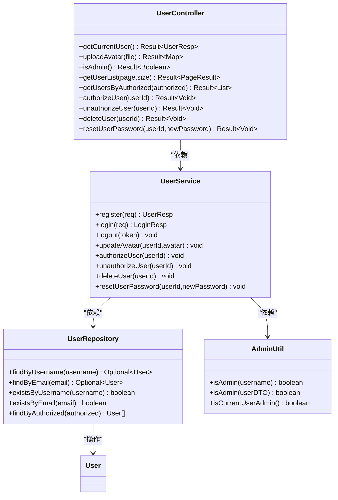

**图表来源**
- [UserController.java](file://src/main/java/com/zhishilu/controller/UserController.java#L25-L258)
- [UserService.java](file://src/main/java/com/zhishilu/service/UserService.java#L29-L246)
- [UserRepository.java](file://src/main/java/com/zhishilu/repository/UserRepository.java#L14-L40)
- [AdminUtil.java](file://src/main/java/com/zhishilu/util/AdminUtil.java#L1-L60)

**章节来源**
- [UserController.java](file://src/main/java/com/zhishilu/controller/UserController.java#L1-L258)
- [UserService.java](file://src/main/java/com/zhishilu/service/UserService.java#L1-L246)

## 管理员用户管理功能

### 用户管理界面设计

管理员用户管理功能提供了完整的用户管理界面，具有以下特点：

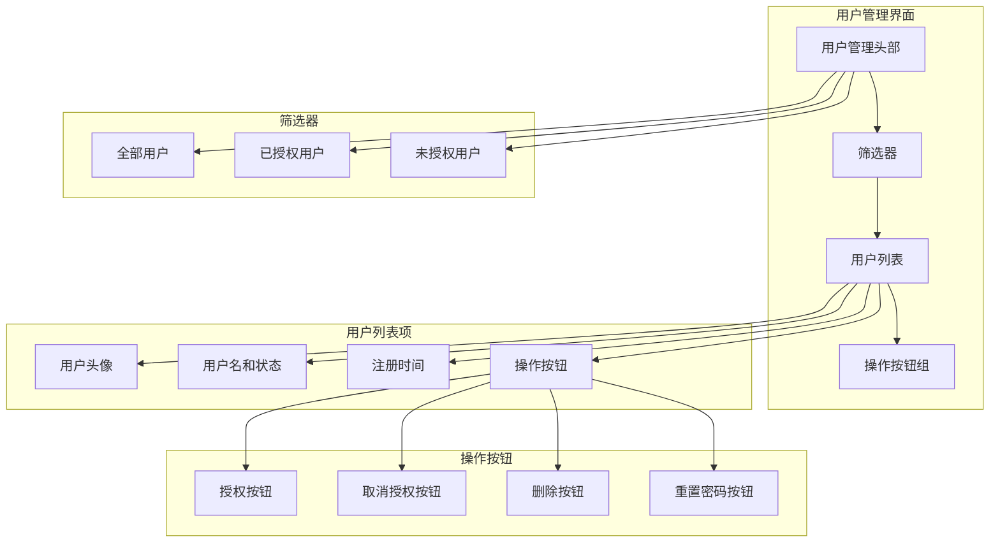

**图表来源**
- [ProfileView.vue](file://frontend/src/views/ProfileView.vue#L298-L393)

### 权限控制机制

系统实现了严格的权限控制机制：

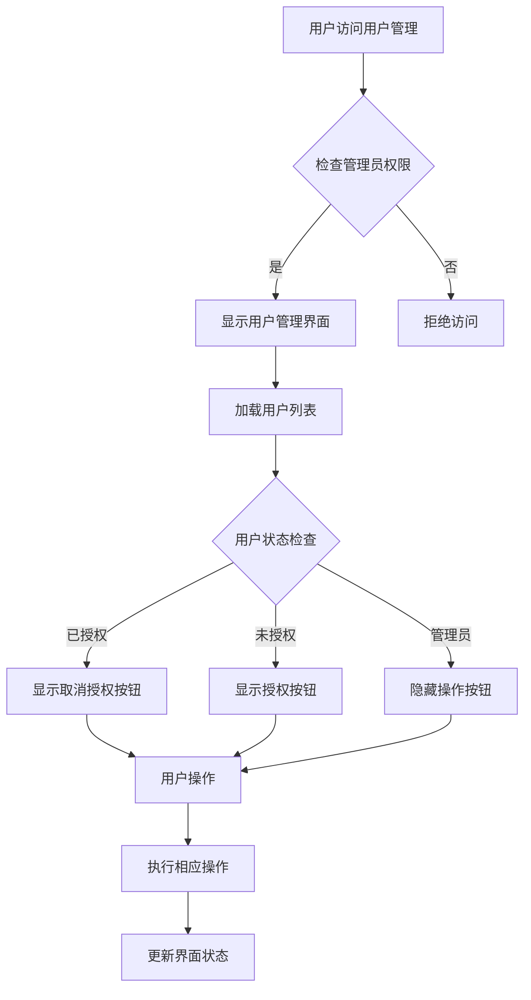

**图表来源**
- [ProfileView.vue](file://frontend/src/views/ProfileView.vue#L452-L465)
- [UserController.java](file://src/main/java/com/zhishilu/controller/UserController.java#L128-L131)

### 用户管理操作流程

管理员用户管理功能支持以下操作：

1. **用户授权流程**
   - 检查用户是否已授权
   - 显示授权确认对话框
   - 执行授权操作
   - 更新用户状态

2. **用户取消授权流程**
   - 检查用户是否已授权
   - 显示取消授权确认对话框
   - 执行取消授权操作
   - 清除用户Token并强制登出

3. **用户删除流程**
   - 检查用户是否为管理员
   - 显示删除确认对话框
   - 执行删除操作
   - 清除用户Token并强制登出

4. **用户密码重置流程**
   - 检查用户是否为管理员
   - 打开密码重置模态框
   - 验证新密码格式
   - 执行密码重置操作
   - 清除用户Token并强制登出

**章节来源**
- [ProfileView.vue](file://frontend/src/views/ProfileView.vue#L702-L881)
- [UserController.java](file://src/main/java/com/zhishilu/controller/UserController.java#L159-L257)

## 密码重置功能

### 密码重置界面设计

管理员密码重置功能提供了专门的界面设计，具有以下特点：

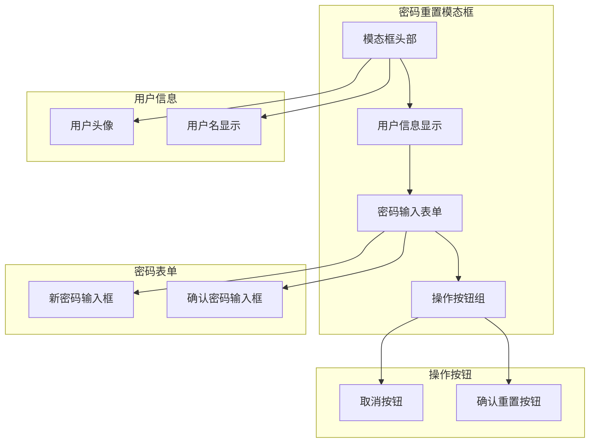

**图表来源**
- [ProfileView.vue](file://frontend/src/views/ProfileView.vue#L427-L476)

### 密码重置操作流程

管理员密码重置功能实现了完整的操作流程：

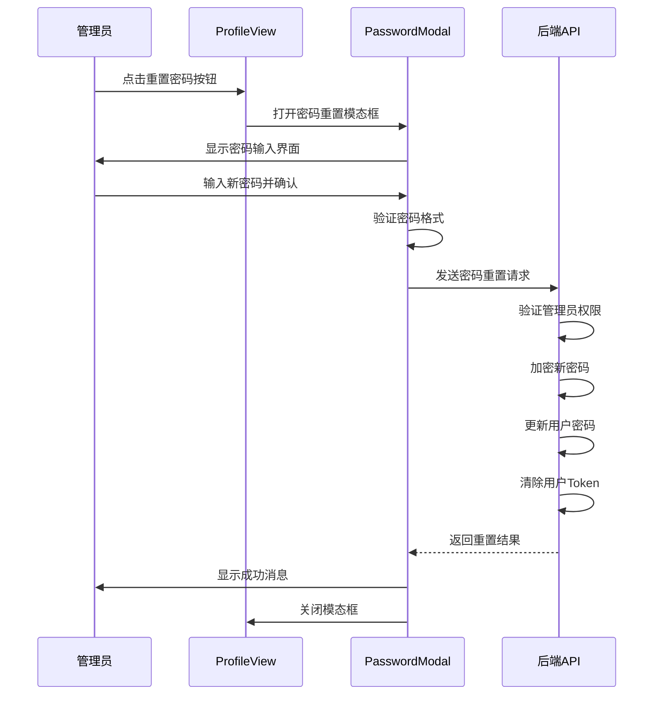

**图表来源**
- [ProfileView.vue](file://frontend/src/views/ProfileView.vue#L840-L881)
- [UserController.java](file://src/main/java/com/zhishilu/controller/UserController.java#L230-L257)

### 安全机制

系统实现了多重安全机制：

1. **权限验证**
   - 仅管理员可以重置用户密码
   - 不能重置其他管理员的密码
   - 不能重置自己的密码

2. **密码验证**
   - 最小密码长度检查（6位）
   - 密码一致性验证
   - 密码加密存储

3. **会话管理**
   - 密码重置后强制用户重新登录
   - 自动清除用户Token
   - 安全的会话清理机制

**章节来源**
- [ProfileView.vue](file://frontend/src/views/ProfileView.vue#L840-L881)
- [UserController.java](file://src/main/java/com/zhishilu/controller/UserController.java#L230-L257)

## 模态框界面设计

### 密码重置模态框组件

密码重置模态框是一个独立的组件，具有以下特点：

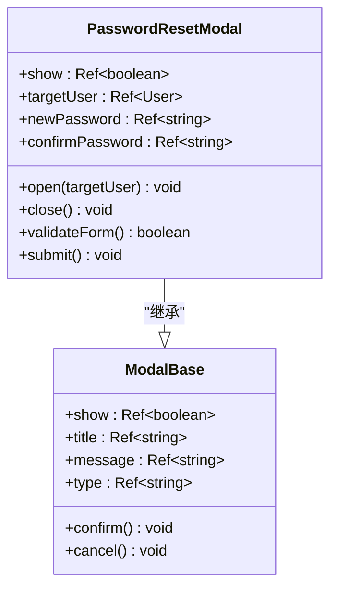

**图表来源**
- [ProfileView.vue](file://frontend/src/views/ProfileView.vue#L427-L476)

### 模态框交互设计

模态框实现了丰富的交互设计：

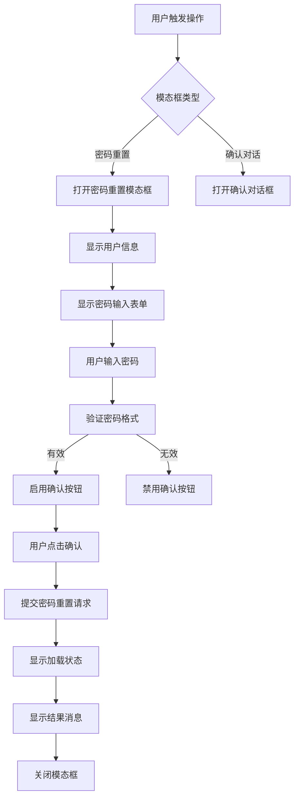

**图表来源**
- [ProfileView.vue](file://frontend/src/views/ProfileView.vue#L840-L881)

### 响应式设计

模态框支持响应式设计：

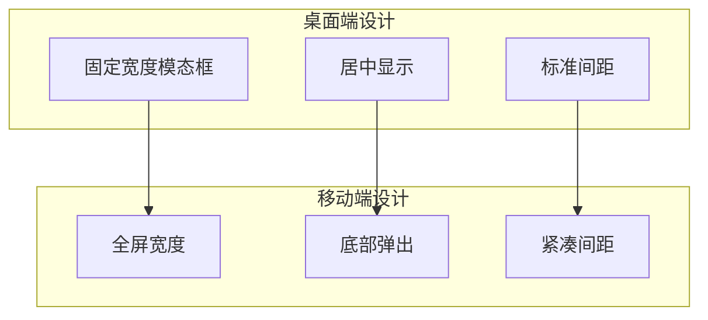

**图表来源**
- [ProfileView.vue](file://frontend/src/views/ProfileView.vue#L427-L476)

**章节来源**
- [ProfileView.vue](file://frontend/src/views/ProfileView.vue#L427-L476)

## 表单验证逻辑

### 密码验证规则

密码重置表单实现了严格的验证规则：

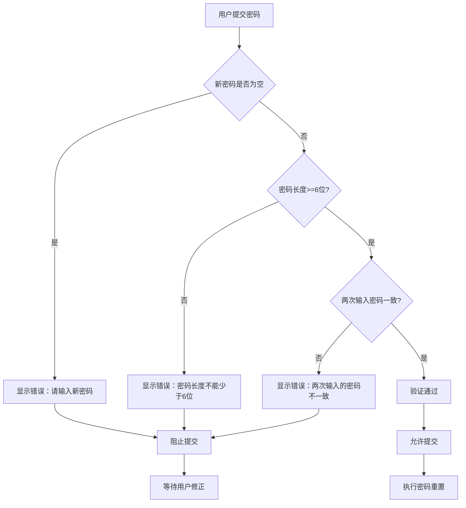

**图表来源**
- [ProfileView.vue](file://frontend/src/views/ProfileView.vue#L856-L881)

### 验证时机

表单验证在多个时机执行：

1. **实时验证**
   - 输入时即时检查密码格式
   - 实时显示验证状态
   - 动态更新按钮状态

2. **提交验证**
   - 提交前执行完整验证
   - 显示详细的错误信息
   - 阻止无效提交

3. **后端验证**
   - 服务器端再次验证
   - 处理边界情况
   - 返回统一的错误格式

### 错误处理机制

系统实现了完善的错误处理机制：

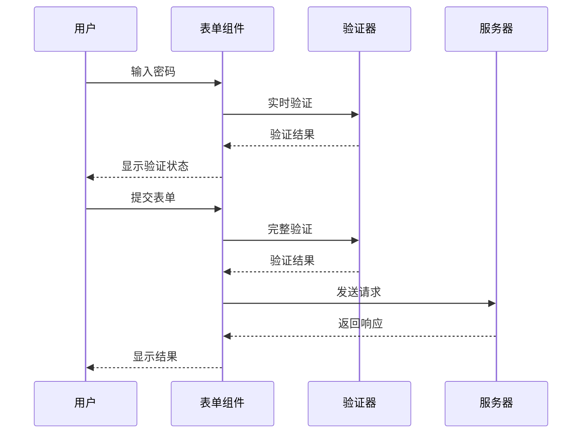

**图表来源**
- [ProfileView.vue](file://frontend/src/views/ProfileView.vue#L856-L881)

**章节来源**
- [ProfileView.vue](file://frontend/src/views/ProfileView.vue#L856-L881)

## 依赖关系分析

### 前端依赖关系

前端应用采用了现代化的技术栈，各组件之间通过清晰的接口进行通信：

```mermaid
graph TB
subgraph "核心依赖"
A[Vue 3.5.27]
B[Vue Router 5.0.1]
C[Axios 1.13.4]
D[TailwindCSS 4.1.18]
E[lucide-vue-next 0.563.0]
F[@wangeditor/editor 5.1.23]
end
subgraph "UI组件库"
G[ConfirmationModal.vue]
H[AdvancedModal.vue]
I[ArticleDetail.vue]
J[ArticleEdit.vue]
K[DraftEdit.vue]
end
subgraph "开发工具"
L[Vite 7.3.1]
M[TypeScript 5.9.3]
N[TailwindCSS PostCSS]
end
A --> B
A --> C
C --> D
E --> A
F --> A
G --> A
H --> A
I --> A
J --> A
K --> A
L --> M
N --> D
```

**图表来源**
- [package.json](file://frontend/package.json#L19-L59)

### 后端依赖关系

后端服务基于 Spring Boot 生态系统，集成了多种企业级特性：

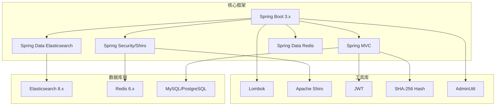

**图表来源**
- [application.yml](file://src/main/resources/application.yml#L1-L57)

**章节来源**
- [package.json](file://frontend/package.json#L1-L64)
- [application.yml](file://src/main/resources/application.yml#L1-L57)

## 性能考虑

### 前端性能优化

Profile View 在设计时充分考虑了性能优化：

1. **懒加载策略**
   - 使用 Vue 3 的动态导入实现组件懒加载
   - 按需加载大型依赖库
   - 图片资源的延迟加载

2. **状态管理优化**
   - 使用 Composition API 进行细粒度的状态管理
   - 避免不必要的响应式更新
   - 合理使用计算属性缓存

3. **渲染性能**
   - 列表渲染使用虚拟滚动
   - 图片懒加载和占位符
   - 动画性能优化

4. **管理员功能优化**
   - 用户列表按需加载
   - 筛选功能使用计算属性缓存
   - 操作确认对话框减少不必要的请求

5. **模态框性能优化**
   - Teleport 实现 DOM 优化
   - 动画性能优化
   - 内存泄漏防护

### 后端性能优化

后端服务采用了多种性能优化策略：

1. **数据库优化**
   - Elasticsearch 索引优化
   - 查询条件优化
   - 缓存策略

2. **API 性能**
   - 异步处理耗时操作
   - 请求限流和熔断
   - 响应缓存

3. **文件处理**
   - 文件上传进度监控
   - 多格式支持
   - 存储空间管理

4. **管理员功能优化**
   - 用户列表分页查询
   - 授权状态索引优化
   - Token缓存管理

5. **密码重置优化**
   - 密码加密异步处理
   - Token清理异步执行
   - 错误处理优化

## 故障排除指南

### 常见问题及解决方案

#### 登录认证问题

**问题描述**: 用户无法登录或频繁掉线

**可能原因**:
- Token 过期或无效
- 服务器时间不同步
- 网络连接不稳定

**解决方案**:
1. 检查客户端时间设置
2. 验证服务器配置
3. 查看网络连接状态

#### 文件上传失败

**问题描述**: 头像或图片上传失败

**可能原因**:
- 文件格式不支持
- 文件大小超限
- 服务器存储空间不足

**解决方案**:
1. 检查文件格式和大小限制
2. 验证服务器存储配置
3. 查看服务器日志

#### 数据加载缓慢

**问题描述**: 页面加载速度慢

**可能原因**:
- 网络延迟
- 数据库查询慢
- 前端渲染性能问题

**解决方案**:
1. 优化数据库查询
2. 实现数据缓存
3. 前端性能优化

#### 管理员权限问题

**问题描述**: 管理员无法访问用户管理功能

**可能原因**:
- 管理员配置错误
- 用户权限状态异常
- 系统权限检查失败

**解决方案**:
1. 检查管理员配置文件
2. 验证用户权限状态
3. 查看系统日志

#### 用户管理操作失败

**问题描述**: 用户授权、取消授权或删除失败

**可能原因**:
- 权限不足
- 用户状态异常
- 系统内部错误

**解决方案**:
1. 验证管理员权限
2. 检查目标用户状态
3. 查看后端错误日志

#### 密码重置功能问题

**问题描述**: 管理员无法重置用户密码

**可能原因**:
- 权限不足
- 目标用户为管理员
- 密码格式不符合要求
- 服务器内部错误

**解决方案**:
1. 验证管理员权限
2. 检查目标用户是否为管理员
3. 验证密码格式（至少6位，两次输入一致）
4. 查看后端错误日志
5. 检查服务器配置

#### 模态框显示问题

**问题描述**: 密码重置模态框无法正常显示或关闭

**可能原因**:
- DOM 操作冲突
- 动画性能问题
- 事件监听器冲突

**解决方案**:
1. 检查 Teleport 配置
2. 验证动画性能
3. 检查事件监听器
4. 查看浏览器控制台错误

**章节来源**
- [request.ts](file://frontend/src/utils/request.ts#L28-L62)
- [UserController.java](file://src/main/java/com/zhishilu/controller/UserController.java#L58-L84)

## 结论

Profile View 个人中心功能模块展现了现代 Web 应用开发的最佳实践。通过合理的架构设计、清晰的组件划分和完善的错误处理机制，该模块为用户提供了流畅的使用体验。

**更新** 新增的管理员用户管理功能、密码重置功能、专用模态框界面和完整的表单验证逻辑进一步增强了系统的完整性和实用性，为系统管理员提供了强大的用户管理能力。

### 主要优势

1. **架构清晰**: 分层设计确保了良好的可维护性
2. **用户体验**: 响应式设计和丰富的交互效果
3. **性能优化**: 多层次的性能优化策略
4. **安全性**: 完善的认证授权机制
5. **可扩展性**: 模块化设计便于功能扩展
6. **管理员友好**: 完善的用户管理功能
7. **安全的密码管理**: 专业的密码重置功能
8. **直观的界面**: 优秀的模态框设计
9. **严格的数据验证**: 完善的表单验证机制

### 技术亮点

- Vue 3 Composition API 的现代化开发体验
- Spring Boot 微服务架构的企业级设计
- Elasticsearch 的高性能搜索能力
- TailwindCSS 的快速样式开发
- 完整的 TypeScript 类型安全保障
- **管理员权限控制机制**
- **用户状态管理功能**
- **安全的用户删除机制**
- **专业的密码重置功能**
- **响应式的模态框设计**
- **严格的表单验证逻辑**

该模块为整个系统的用户管理功能奠定了坚实的基础，为后续的功能扩展提供了良好的技术支撑。新增的管理员用户管理功能、密码重置功能和模态框界面使其成为了一个功能完整、安全可靠、用户体验优秀的个人中心解决方案。