# Vue组件库

<cite>
**本文档引用的文件**
- [package.json](file://frontend/package.json)
- [main.ts](file://frontend/src/main.ts)
- [App.vue](file://frontend/src/App.vue)
- [router/index.ts](file://frontend/src/router/index.ts)
- [stores/counter.ts](file://frontend/src/stores/counter.ts)
- [views/HomeView.vue](file://frontend/src/views/HomeView.vue)
- [views/LoginView.vue](file://frontend/src/views/LoginView.vue)
- [views/RegisterView.vue](file://frontend/src/views/RegisterView.vue)
- [views/ProfileView.vue](file://frontend/src/views/ProfileView.vue)
- [views/ArticleCreateView.vue](file://frontend/src/views/ArticleCreateView.vue)
- [views/ArticleEditView.vue](file://frontend/src/views/ArticleEditView.vue)
- [views/DraftEditView.vue](file://frontend/src/views/DraftEditView.vue)
- [utils/request.ts](file://frontend/src/utils/request.ts)
- [utils/image.ts](file://frontend/src/utils/image.ts)
- [components/ArticleCard.vue](file://frontend/src/components/ArticleCard.vue)
- [components/ConfirmationModal.vue](file://frontend/src/components/ConfirmationModal.vue)
- [components/AdvancedModal.vue](file://frontend/src/components/AdvancedModal.vue)
- [components/RichEditor.vue](file://frontend/src/components/RichEditor.vue)
- [vite.config.ts](file://frontend/vite.config.ts)
- [tailwind.config.js](file://frontend/tailwind.config.js)
- [postcss.config.js](file://frontend/postcss.config.js)
</cite>

## 目录
1. [简介](#简介)
2. [项目结构](#项目结构)
3. [核心组件](#核心组件)
4. [架构概览](#架构概览)
5. [详细组件分析](#详细组件分析)
6. [依赖关系分析](#依赖关系分析)
7. [性能考虑](#性能考虑)
8. [故障排除指南](#故障排除指南)
9. [结论](#结论)

## 简介

这是一个基于Vue 3构建的个人知识管理组件库，名为"知拾录"。该项目采用现代化的前端技术栈，包括Vue 3、TypeScript、Pinia状态管理、Vue Router路由管理和TailwindCSS样式框架。系统提供了完整的知识库管理功能，包括文章浏览、搜索、编辑和个人资料管理等核心功能。

**更新** 新增了富文本编辑器、高级模态框等组件，增强了用户体验和功能完整性。**ArticleCard组件UI布局优化**：添加flex-grow元素提升视觉层次和内容排列的一致性。

## 项目结构

项目采用标准的Vue 3单页应用结构，主要分为前端代码和后端Java服务两大部分：

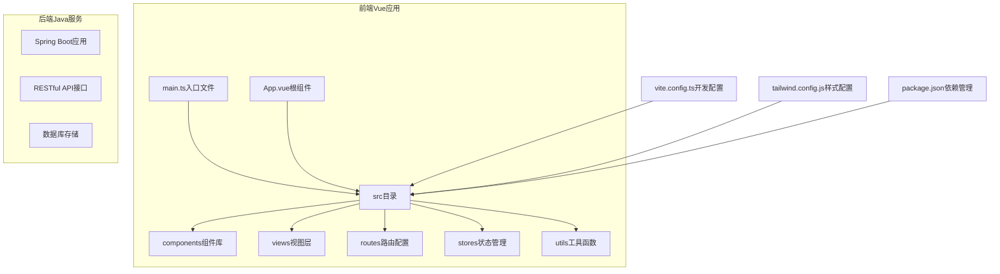

**图表来源**
- [main.ts](file://frontend/src/main.ts#L1-L11)
- [App.vue](file://frontend/src/App.vue#L1-L16)
- [router/index.ts](file://frontend/src/router/index.ts#L1-L85)

**章节来源**
- [package.json](file://frontend/package.json#L1-L64)
- [main.ts](file://frontend/src/main.ts#L1-L11)
- [vite.config.ts](file://frontend/vite.config.ts#L1-L30)

## 核心组件

### 应用入口与配置

应用通过main.ts进行初始化，配置了Pinia状态管理、Vue Router路由系统，并挂载到DOM元素中。

### 路由系统

系统实现了完整的路由配置，包含以下主要页面：
- 首页：知识库内容展示和搜索功能
- 登录页：用户身份验证
- 注册页：新用户账户创建
- 个人资料页：用户信息管理
- 文章创作页：知识内容创建
- 文章详情页：知识内容查看和编辑
- 文章编辑页：知识内容编辑
- 草稿编辑页：知识草稿管理

### 状态管理

使用Pinia进行状态管理，目前包含基础的计数器store作为示例。

**章节来源**
- [main.ts](file://frontend/src/main.ts#L1-L11)
- [router/index.ts](file://frontend/src/router/index.ts#L1-L85)
- [stores/counter.ts](file://frontend/src/stores/counter.ts#L1-L13)

## 架构概览

系统采用前后端分离架构，前端Vue应用通过HTTP请求与后端Java服务通信：

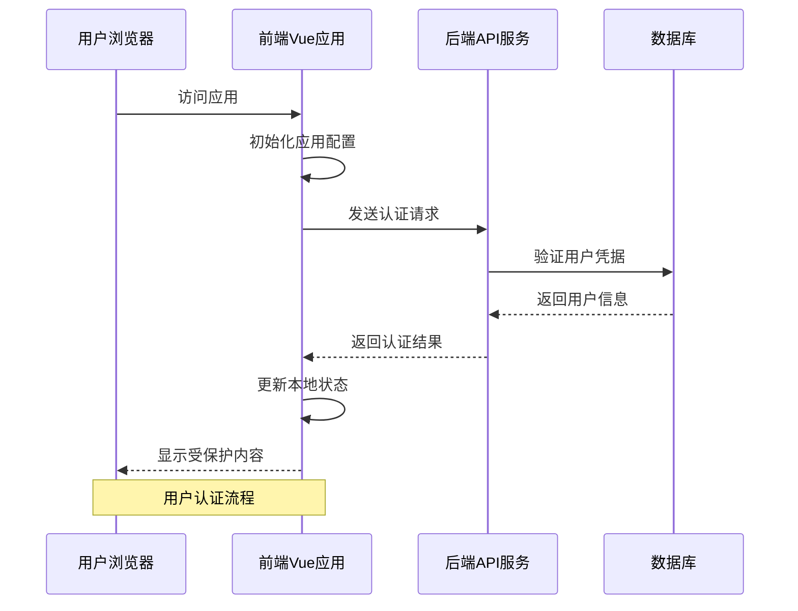

**图表来源**
- [request.ts](file://frontend/src/utils/request.ts#L1-L65)
- [LoginView.vue](file://frontend/src/views/LoginView.vue#L176-L201)

**章节来源**
- [request.ts](file://frontend/src/utils/request.ts#L1-L65)
- [vite.config.ts](file://frontend/vite.config.ts#L22-L27)

## 详细组件分析

### 富文本编辑器组件 (RichEditor)

富文本编辑器是基于wangEditor的高级编辑器组件，提供了完整的富文本编辑功能：

#### 核心功能特性

1. **完整的编辑器功能**：支持加粗、斜体、列表、链接、图片插入等
2. **媒体文件上传**：内置图片和视频上传功能，支持拖拽上传
3. **响应式设计**：适配不同屏幕尺寸的编辑体验
4. **类型安全**：完整的TypeScript类型定义
5. **事件驱动**：通过事件系统与父组件通信

#### 编辑器配置

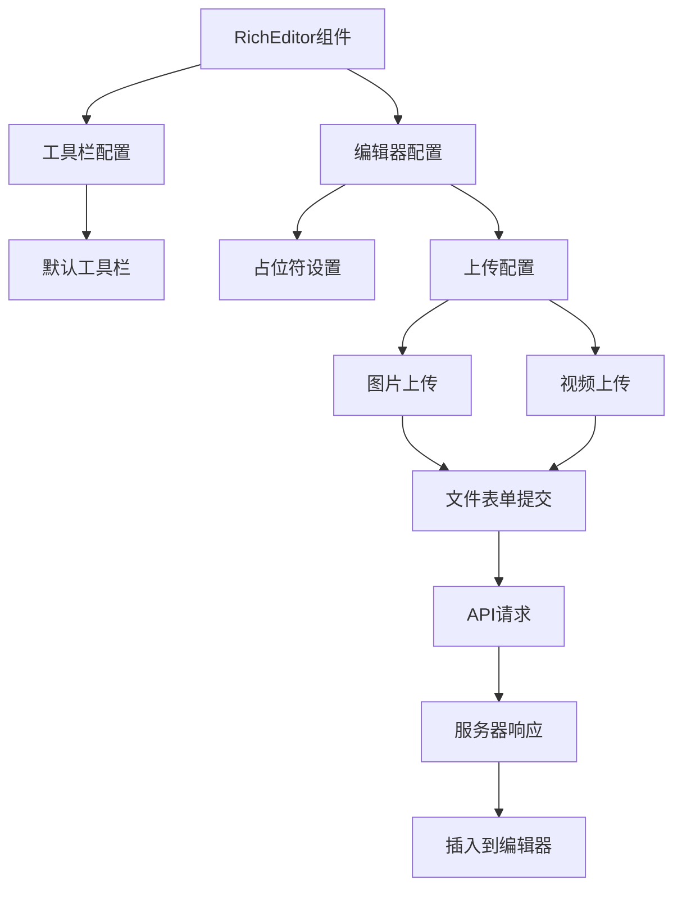

**图表来源**
- [RichEditor.vue](file://frontend/src/components/RichEditor.vue#L58-L118)

#### 上传功能实现

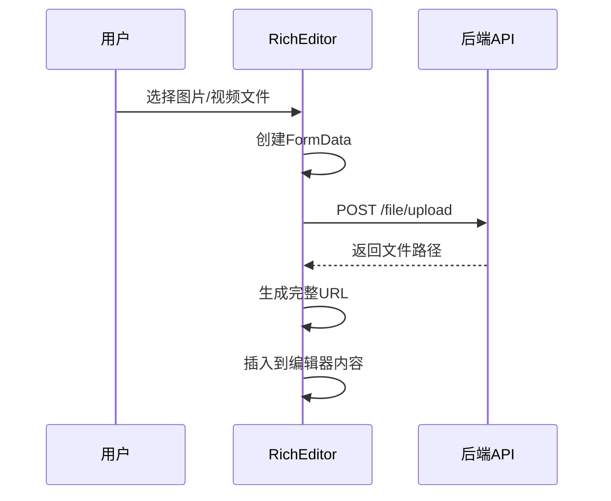

**图表来源**
- [RichEditor.vue](file://frontend/src/components/RichEditor.vue#L63-L116)

**章节来源**
- [RichEditor.vue](file://frontend/src/components/RichEditor.vue#L1-L177)

### 高级模态框组件 (AdvancedModal)

高级模态框提供了增强的模态框体验，支持多种交互方式：

#### 设计特点

1. **动态背景效果**：支持模糊背景和渐变遮罩
2. **拖拽关闭**：支持从上到下滑动关闭
3. **类型化设计**：支持主要、危险、成功、警告类型
4. **尺寸控制**：支持小、中、大、超大四种尺寸
5. **键盘支持**：支持Esc键关闭
6. **触摸优化**：专为移动设备优化的触摸交互

#### 交互流程

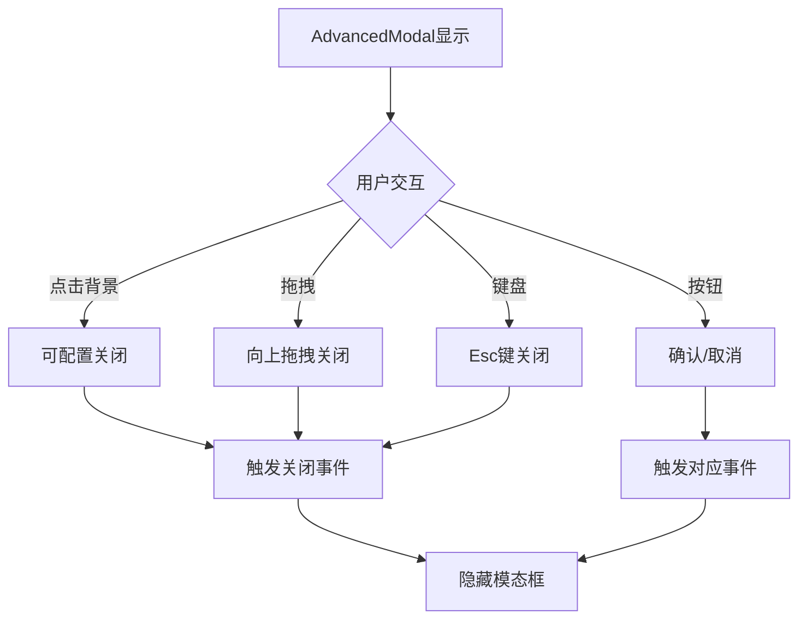

**图表来源**
- [AdvancedModal.vue](file://frontend/src/components/AdvancedModal.vue#L230-L271)

**章节来源**
- [AdvancedModal.vue](file://frontend/src/components/AdvancedModal.vue#L1-L387)

### 增强确认模态框组件 (Enhanced ConfirmationModal)

增强的确认对话框提供了更好的用户体验和交互效果：

#### 设计特点

1. **动态图标效果**：根据类型显示不同的图标和颜色
2. **拖拽反馈**：支持向下拖拽关闭，提供视觉反馈
3. **触摸优化**：按钮触摸反馈和拖拽手势优化
4. **高性能动画**：使用will-change和GPU加速优化
5. **暗色主题支持**：自动适配系统暗色模式

#### 交互特性

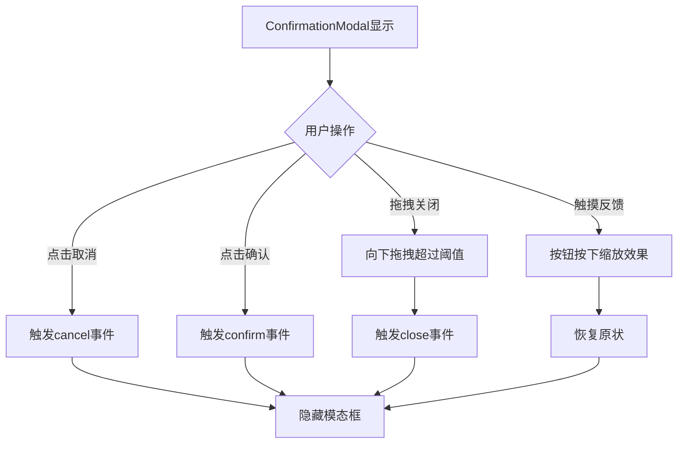

**图表来源**
- [ConfirmationModal.vue](file://frontend/src/components/ConfirmationModal.vue#L133-L197)

**章节来源**
- [ConfirmationModal.vue](file://frontend/src/components/ConfirmationModal.vue#L1-L324)

### 主页组件 (HomeView)

主页是整个应用的核心组件，实现了完整的知识库浏览和搜索功能：

#### 核心功能特性

1. **智能搜索系统**：支持多字段搜索（标题、内容、类别、用户名、地点）
2. **实时搜索建议**：集成搜索补全功能
3. **响应式网格布局**：自适应不同屏幕尺寸的卡片展示
4. **分页加载**：支持大数据量的分页浏览
5. **图片预览**：支持多图片文章的大图浏览

#### 搜索功能实现

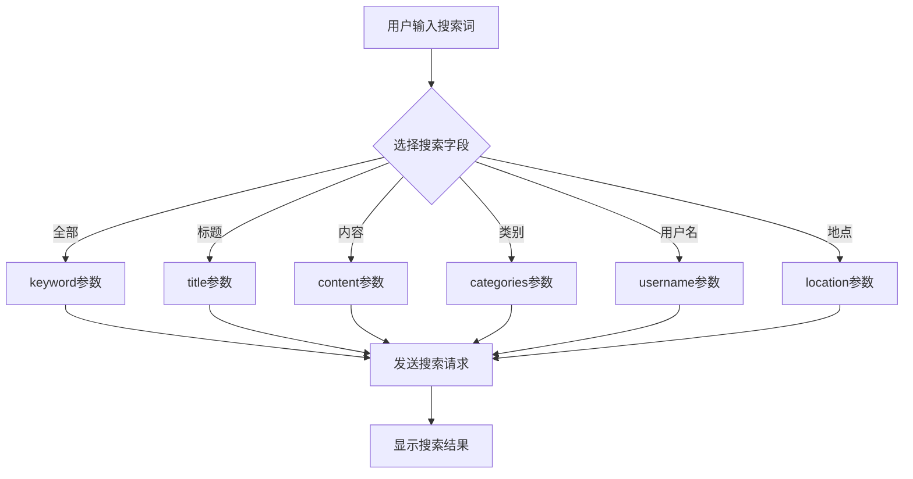

**图表来源**
- [HomeView.vue](file://frontend/src/views/HomeView.vue#L561-L611)

#### 组件交互流程

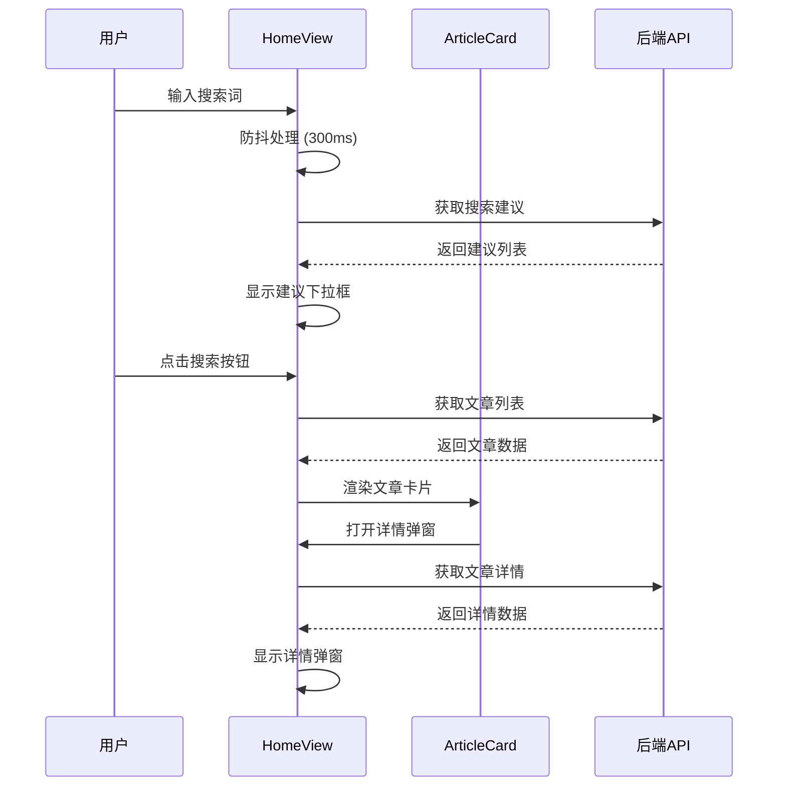

**图表来源**
- [HomeView.vue](file://frontend/src/views/HomeView.vue#L614-L721)
- [ArticleCard.vue](file://frontend/src/components/ArticleCard.vue#L102-L109)

**章节来源**
- [HomeView.vue](file://frontend/src/views/HomeView.vue#L1-L893)

### 文章卡片组件 (ArticleCard)

**更新** ArticleCard组件经过UI布局优化，添加flex-grow元素提升视觉层次和内容排列的一致性。

文章卡片是展示单个知识条目的组件，具有丰富的交互功能：

#### 主要特性

1. **双模式展示**：支持图片模式和文字模式
2. **智能内容预览**：根据是否有图片自动切换展示方式
3. **高亮显示**：支持搜索关键词的高亮显示
4. **响应式设计**：适配不同屏幕尺寸
5. **交互优化**：桌面端弹窗、移动端跳转的不同体验
6. **视觉层次优化**：通过flex-grow元素提升内容排列一致性

#### 布局优化细节

组件的底部信息区域采用了flex布局优化：

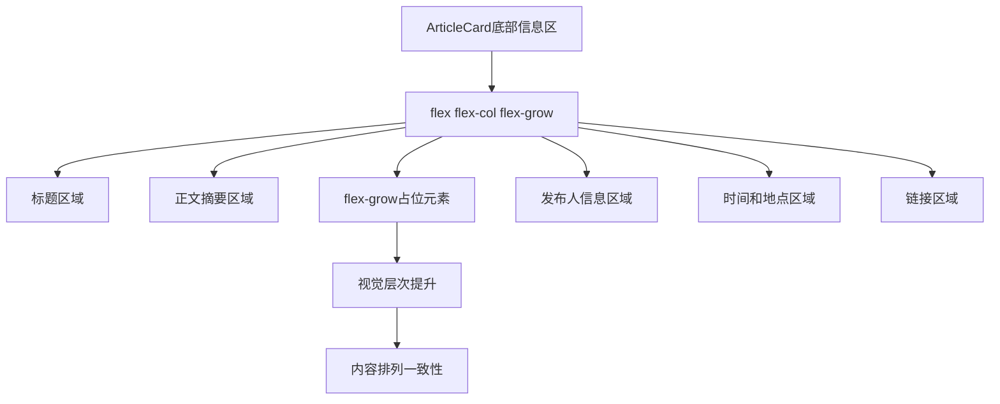

**图表来源**
- [ArticleCard.vue](file://frontend/src/components/ArticleCard.vue#L42-L57)

#### 内容展示逻辑

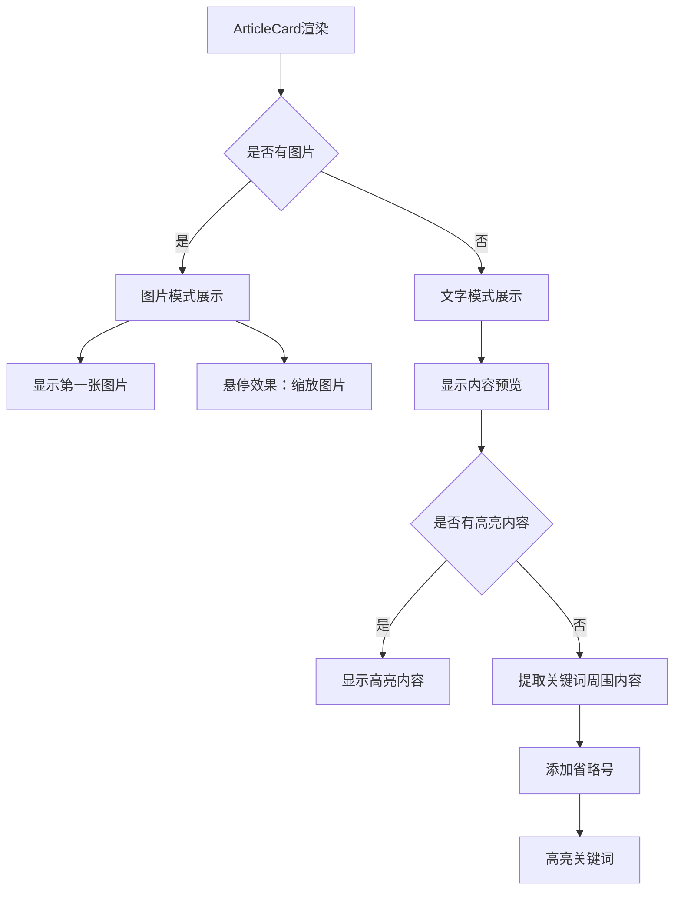

**图表来源**
- [ArticleCard.vue](file://frontend/src/components/ArticleCard.vue#L135-L204)

**章节来源**
- [ArticleCard.vue](file://frontend/src/components/ArticleCard.vue#L1-L238)

### 登录组件 (LoginView)

登录组件提供了用户身份验证功能：

#### 功能特性

1. **表单验证**：用户名和密码的必填验证
2. **密码可见性控制**：支持密码明文/密文切换
3. **记住密码选项**：可选的持久化登录
4. **路由跳转**：登录成功后的页面跳转逻辑

#### 认证流程

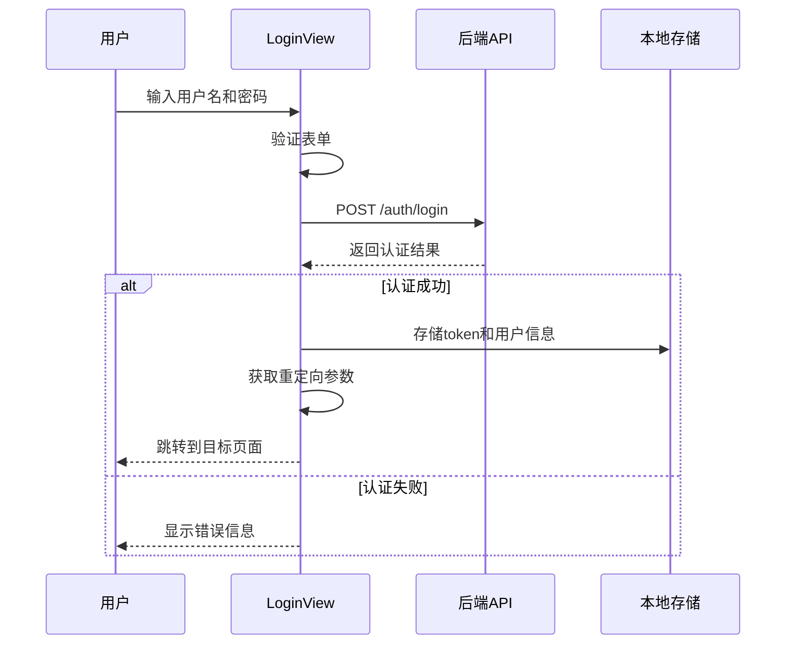

**图表来源**
- [LoginView.vue](file://frontend/src/views/LoginView.vue#L176-L201)

**章节来源**
- [LoginView.vue](file://frontend/src/views/LoginView.vue#L1-L203)

### 注册组件 (RegisterView)

注册组件负责新用户的账户创建：

#### 核心功能

1. **用户信息收集**：用户名、邮箱、手机号、密码
2. **协议同意**：用户协议和隐私政策的勾选确认
3. **表单验证**：必填字段和格式验证
4. **注册流程**：提交表单并处理响应

**章节来源**
- [RegisterView.vue](file://frontend/src/views/RegisterView.vue#L1-L197)

### 个人资料组件 (ProfileView)

个人资料组件提供了完整的用户信息管理和内容管理功能：

#### 核心功能

1. **用户信息管理**：头像上传、密码修改
2. **内容管理**：我的发布、草稿箱管理
3. **确认对话框**：使用增强的确认模态框进行危险操作
4. **子视图管理**：文章详情、编辑、草稿编辑等功能

#### 数据流管理

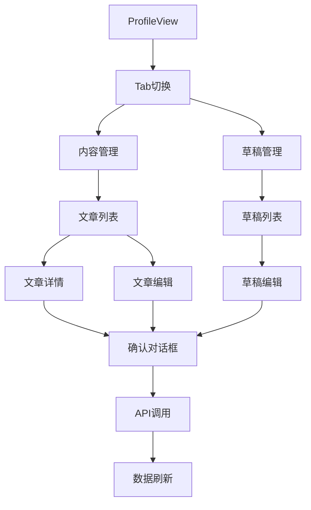

**图表来源**
- [ProfileView.vue](file://frontend/src/views/ProfileView.vue#L306-L315)

**章节来源**
- [ProfileView.vue](file://frontend/src/views/ProfileView.vue#L1-L588)

### 文章创建组件 (ArticleCreateView)

文章创建组件提供了完整的文章发布功能：

#### 核心功能

1. **富文本编辑**：使用RichEditor组件进行内容编辑
2. **多媒体支持**：图片上传、预览、删除
3. **自动保存**：10秒自动保存草稿
4. **预览模式**：实时预览发布效果
5. **分类管理**：推荐分类和自定义分类

#### 发布流程

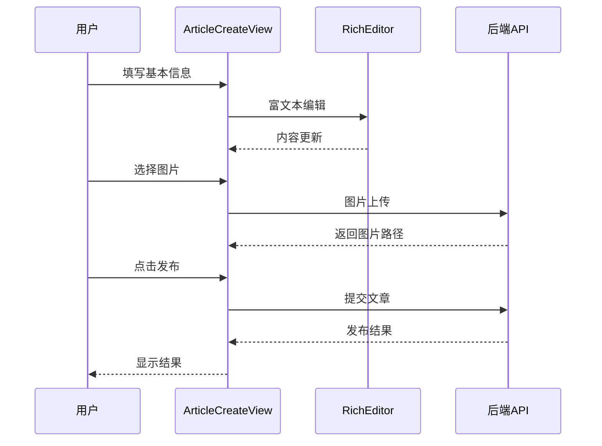

**图表来源**
- [ArticleCreateView.vue](file://frontend/src/views/ArticleCreateView.vue#L467-L503)

**章节来源**
- [ArticleCreateView.vue](file://frontend/src/views/ArticleCreateView.vue#L1-L536)

### 工具函数模块

#### HTTP请求封装 (request.ts)

提供了统一的HTTP请求处理机制：

1. **基础配置**：设置API基础URL、超时时间、请求头
2. **请求拦截器**：自动添加认证token
3. **响应拦截器**：统一处理各种HTTP状态码
4. **错误处理**：针对不同错误类型的处理策略

#### 图片URL处理 (image.ts)

专门处理图片和头像的URL生成：

1. **图片URL生成**：将相对路径转换为完整URL
2. **头像URL生成**：专门处理用户头像的URL
3. **兼容性处理**：支持完整URL、base64和相对路径

**章节来源**
- [request.ts](file://frontend/src/utils/request.ts#L1-L65)
- [image.ts](file://frontend/src/utils/image.ts#L1-L34)

## 依赖关系分析

### 技术栈依赖

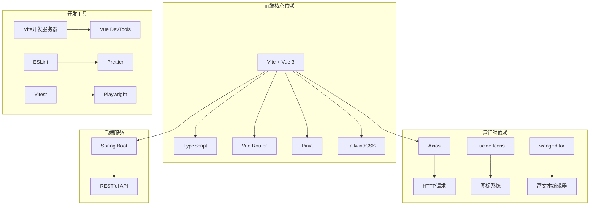

**图表来源**
- [package.json](file://frontend/package.json#L19-L27)
- [package.json](file://frontend/package.json#L28-L59)

### 组件间依赖关系

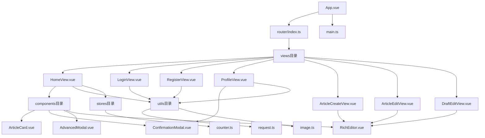

**图表来源**
- [App.vue](file://frontend/src/App.vue#L1-L16)
- [main.ts](file://frontend/src/main.ts#L1-L11)

**章节来源**
- [package.json](file://frontend/package.json#L1-L64)

## 性能考虑

### 优化策略

1. **懒加载和代码分割**：路由级别的组件懒加载
2. **虚拟滚动**：对于大量数据的场景考虑实现虚拟滚动
3. **图片优化**：使用适当的图片格式和尺寸
4. **缓存策略**：合理使用浏览器缓存和localStorage
5. **防抖优化**：搜索输入的防抖处理减少API调用
6. **富文本编辑器优化**：使用shallowRef避免深度监听
7. **模态框性能**：使用will-change和GPU加速优化动画
8. **布局优化**：ArticleCard组件的flex-grow布局提升渲染效率

### 内存管理

1. **组件生命周期**：正确处理组件的创建和销毁
2. **事件监听器**：及时清理不再使用的事件监听器
3. **定时器清理**：确保定时器在组件卸载时被清理
4. **编辑器销毁**：在组件卸载时销毁富文本编辑器实例

## 故障排除指南

### 常见问题及解决方案

#### 登录认证问题

1. **Token过期**：检查响应拦截器中的401处理逻辑
2. **跨域问题**：确认Vite代理配置正确
3. **本地存储问题**：检查localStorage的可用性和容量

#### API请求失败

1. **网络连接**：检查后端服务是否正常运行
2. **请求格式**：确认请求头和请求体格式正确
3. **CORS配置**：检查后端的跨域配置

#### 图片加载问题

1. **URL格式**：确认图片URL生成逻辑正确
2. **文件路径**：检查文件上传和存储路径
3. **权限问题**：确认文件访问权限设置

#### 富文本编辑器问题

1. **编辑器初始化失败**：检查wangEditor依赖是否正确安装
2. **上传功能异常**：确认文件上传接口和权限配置
3. **样式冲突**：检查编辑器样式与主题的兼容性

#### 模态框交互问题

1. **拖拽功能失效**：检查触摸事件处理逻辑
2. **动画卡顿**：确认CSS动画优化设置
3. **键盘事件冲突**：检查事件监听器的正确绑定

#### ArticleCard布局问题

1. **flex-grow失效**：检查容器的flex布局设置
2. **内容溢出**：确认flex-grow元素的正确使用
3. **视觉层次不一致**：验证底部信息区域的布局结构

**章节来源**
- [request.ts](file://frontend/src/utils/request.ts#L34-L62)
- [vite.config.ts](file://frontend/vite.config.ts#L22-L27)
- [RichEditor.vue](file://frontend/src/components/RichEditor.vue#L135-L141)
- [AdvancedModal.vue](file://frontend/src/components/AdvancedModal.vue#L280-L291)
- [ArticleCard.vue](file://frontend/src/components/ArticleCard.vue#L42-L57)

## 结论

这个Vue组件库项目展现了现代前端开发的最佳实践，采用了完整的开发工具链和技术栈。项目结构清晰，组件职责明确，具有良好的可维护性和扩展性。

**更新** 新增的富文本编辑器、高级模态框等组件显著提升了用户体验和功能完整性。**ArticleCard组件的UI布局优化**通过添加flex-grow元素，有效提升了视觉层次和内容排列的一致性，体现了项目在组件化开发方面的成熟度和对细节的关注。

### 主要优势

1. **技术栈先进**：采用Vue 3、TypeScript等现代技术
2. **开发体验优秀**：完善的开发工具和配置
3. **用户体验良好**：响应式设计和流畅的交互
4. **代码质量高**：严格的类型检查和代码规范
5. **组件生态完善**：丰富的UI组件和工具函数
6. **性能优化到位**：多方面的性能优化策略
7. **布局优化精细**：关注细节的UI布局改进

### 改进建议

1. **状态管理优化**：可以考虑添加更复杂的状态管理逻辑
2. **测试覆盖**：增加单元测试和集成测试
3. **性能监控**：添加性能监控和错误追踪
4. **国际化支持**：考虑添加多语言支持
5. **组件文档**：为新增组件添加详细的使用文档
6. **主题定制**：提供更灵活的主题定制能力