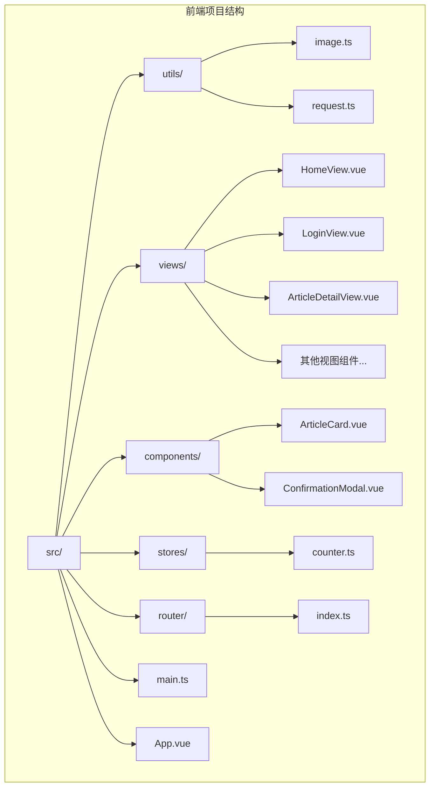
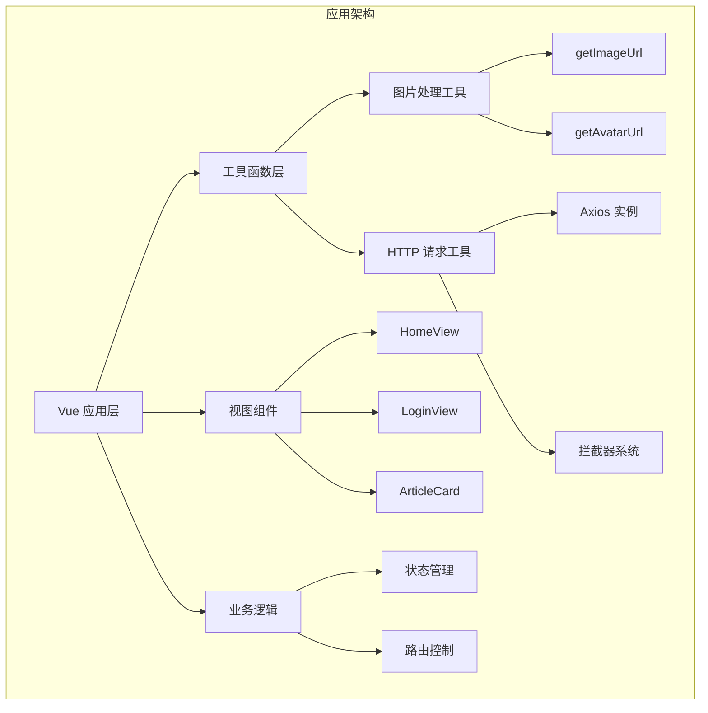
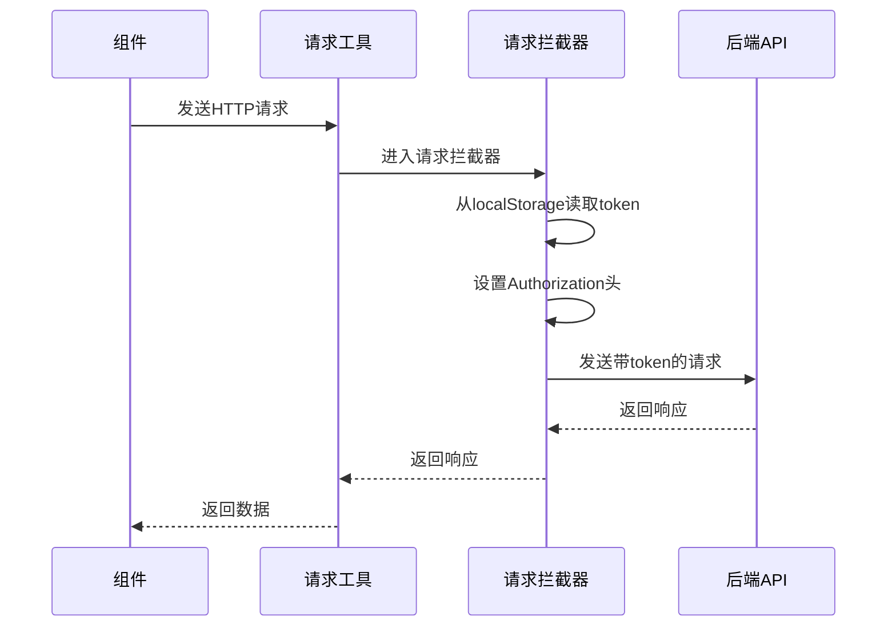
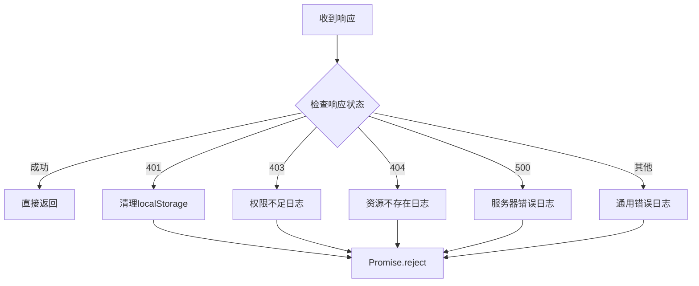
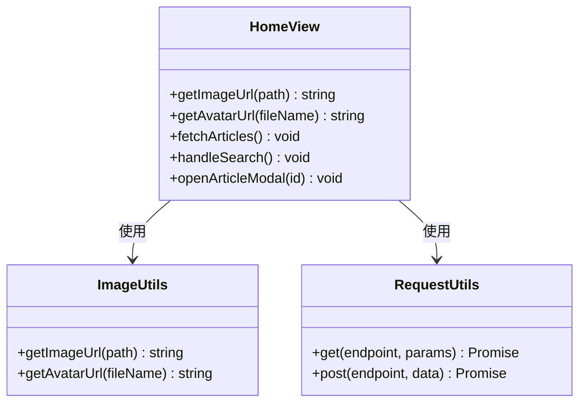
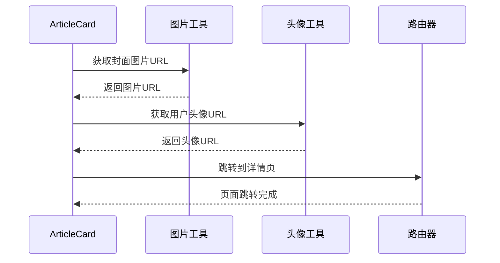
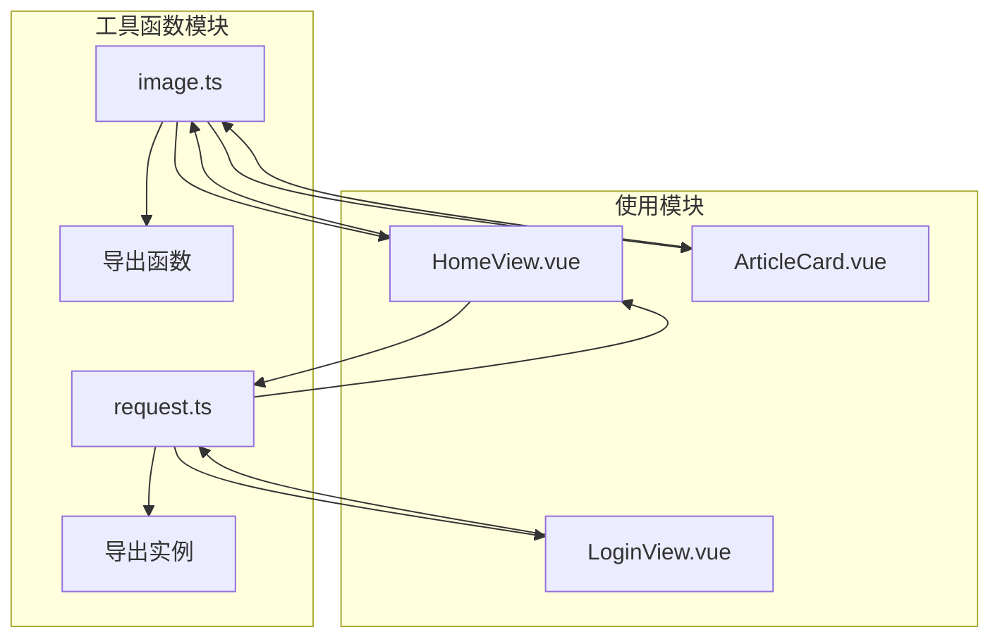

# 前端工具函数

<cite>
**本文档引用的文件**
- [frontend/src/utils/image.ts](file://frontend/src/utils/image.ts)
- [frontend/src/utils/request.ts](file://frontend/src/utils/request.ts)
- [frontend/src/main.ts](file://frontend/src/main.ts)
- [frontend/src/router/index.ts](file://frontend/src/router/index.ts)
- [frontend/src/views/HomeView.vue](file://frontend/src/views/HomeView.vue)
- [frontend/src/views/LoginView.vue](file://frontend/src/views/LoginView.vue)
- [frontend/src/components/ArticleCard.vue](file://frontend/src/components/ArticleCard.vue)
- [frontend/src/stores/counter.ts](file://frontend/src/stores/counter.ts)
- [frontend/src/App.vue](file://frontend/src/App.vue)
- [frontend/vite.config.ts](file://frontend/vite.config.ts)
- [frontend/package.json](file://frontend/package.json)
- [frontend/tailwind.config.js](file://frontend/tailwind.config.js)
- [frontend/tsconfig.app.json](file://frontend/tsconfig.app.json)
- [frontend/eslint.config.ts](file://frontend/eslint.config.ts)
</cite>

## 目录
1. [简介](#简介)
2. [项目结构](#项目结构)
3. [核心组件](#核心组件)
4. [架构概览](#架构概览)
5. [详细组件分析](#详细组件分析)
6. [依赖关系分析](#依赖关系分析)
7. [性能考虑](#性能考虑)
8. [故障排除指南](#故障排除指南)
9. [结论](#结论)

## 简介

本项目是一个基于 Vue 3 的前端应用，主要提供知识管理和内容展示功能。项目包含两个核心工具函数模块：图片处理工具和 HTTP 请求工具。这些工具函数在整个应用中发挥着重要作用，负责处理图片 URL 生成、文件访问以及统一的 API 请求管理。

## 项目结构

前端项目采用标准的 Vue 3 单页应用结构，主要目录包括：



**图表来源**
- [frontend/src/main.ts](file://frontend/src/main.ts#L1-L11)
- [frontend/src/utils/image.ts](file://frontend/src/utils/image.ts#L1-L34)
- [frontend/src/utils/request.ts](file://frontend/src/utils/request.ts#L1-L65)

**章节来源**
- [frontend/src/main.ts](file://frontend/src/main.ts#L1-L11)
- [frontend/package.json](file://frontend/package.json#L1-L61)

## 核心组件

### 图片处理工具函数

项目实现了两个专门的图片处理函数，用于统一管理图片和头像的 URL 生成：

#### 主要功能
- **getImageUrl**: 处理普通图片的 URL 生成
- **getAvatarUrl**: 处理用户头像的 URL 生成

#### 关键特性
- 支持多种 URL 类型（完整 URL、相对路径、Base64）
- 自动识别本地文件路径并转换为 API 访问地址
- 统一的图片访问策略

**章节来源**
- [frontend/src/utils/image.ts](file://frontend/src/utils/image.ts#L1-L34)

### HTTP 请求工具

项目使用 Axios 构建了统一的 HTTP 请求客户端，具备以下特性：

#### 核心功能
- **统一的 API 基础配置**
- **自动 Token 管理**
- **全局错误处理**
- **响应拦截器**

#### 请求拦截器
- 自动从 localStorage 读取并添加 Authorization 头
- 统一的请求头配置

#### 响应拦截器
- 统一的错误处理机制
- Token 失效自动清理
- 不同状态码的差异化处理

**章节来源**
- [frontend/src/utils/request.ts](file://frontend/src/utils/request.ts#L1-L65)

## 架构概览

项目采用模块化的架构设计，工具函数作为基础服务层为上层组件提供支持：



**图表来源**
- [frontend/src/utils/image.ts](file://frontend/src/utils/image.ts#L1-L34)
- [frontend/src/utils/request.ts](file://frontend/src/utils/request.ts#L1-L65)
- [frontend/src/views/HomeView.vue](file://frontend/src/views/HomeView.vue#L471-L473)

## 详细组件分析

### 图片处理工具深度分析

#### 函数实现模式

```mermaid
flowchart TD
A[输入图片路径] --> B{检查路径类型}
B --> |完整URL| C[直接返回原URL]
B --> |Base64| C
B --> |相对路径| D[拼接API路径]
D --> E[/api/file/img/{path}]
C --> F[返回结果]
E --> F
```

**图表来源**
- [frontend/src/utils/image.ts](file://frontend/src/utils/image.ts#L6-L15)

#### 头像处理流程

```mermaid
flowchart TD
A[输入头像文件名] --> B{检查文件名}
B --> |为空| C[返回空字符串]
B --> |完整URL| D[直接返回]
B --> |Base64| D
B --> |相对路径| E[拼接头像API路径]
E --> F[/api/file/avatar/{fileName}]
C --> G[返回结果]
D --> G
F --> G
```

**图表来源**
- [frontend/src/utils/image.ts](file://frontend/src/utils/image.ts#L22-L33)

**章节来源**
- [frontend/src/utils/image.ts](file://frontend/src/utils/image.ts#L1-L34)

### HTTP 请求工具深度分析

#### 请求拦截器工作流程



**图表来源**
- [frontend/src/utils/request.ts](file://frontend/src/utils/request.ts#L14-L26)

#### 错误处理机制



**图表来源**
- [frontend/src/utils/request.ts](file://frontend/src/utils/request.ts#L28-L62)

**章节来源**
- [frontend/src/utils/request.ts](file://frontend/src/utils/request.ts#L1-L65)

### 视图组件中的工具函数使用

#### HomeView 组件集成

HomeView 组件展示了工具函数的实际应用场景：



**图表来源**
- [frontend/src/views/HomeView.vue](file://frontend/src/views/HomeView.vue#L471-L473)
- [frontend/src/views/HomeView.vue](file://frontend/src/views/HomeView.vue#L284-L310)

**章节来源**
- [frontend/src/views/HomeView.vue](file://frontend/src/views/HomeView.vue#L471-L473)

#### ArticleCard 组件集成

ArticleCard 组件展示了工具函数在具体业务场景中的应用：



**图表来源**
- [frontend/src/components/ArticleCard.vue](file://frontend/src/components/ArticleCard.vue#L89-L89)
- [frontend/src/components/ArticleCard.vue](file://frontend/src/components/ArticleCard.vue#L59-L60)

**章节来源**
- [frontend/src/components/ArticleCard.vue](file://frontend/src/components/ArticleCard.vue#L89-L89)

## 依赖关系分析

### 技术栈依赖

项目使用了现代化的前端技术栈，主要依赖包括：

```mermaid
graph LR
subgraph "核心依赖"
A[vue@3.5.27] --> B[组合式API]
C[axios@1.13.4] --> D[HTTP客户端]
E[vue-router@5.0.1] --> F[路由管理]
G[pinia@3.0.4] --> H[状态管理]
end
subgraph "开发依赖"
I[vite@7.3.1] --> J[构建工具]
K[typescript@5.9.3] --> L[类型安全]
M[tailwindcss@4.1.18] --> N[样式框架]
O[vitest@4.0.18] --> P[测试框架]
end
```

**图表来源**
- [frontend/package.json](file://frontend/package.json#L19-L56)

### 模块导入关系



**图表来源**
- [frontend/src/views/HomeView.vue](file://frontend/src/views/HomeView.vue#L471-L473)
- [frontend/src/components/ArticleCard.vue](file://frontend/src/components/ArticleCard.vue#L89-L89)
- [frontend/src/views/LoginView.vue](file://frontend/src/views/LoginView.vue#L155-L155)

**章节来源**
- [frontend/package.json](file://frontend/package.json#L19-L56)

## 性能考虑

### 图片处理优化

1. **URL 缓存策略**: 工具函数直接返回计算结果，避免重复计算
2. **条件判断优化**: 使用早期返回减少不必要的字符串处理
3. **路径拼接效率**: 统一的 API 路径格式便于缓存和代理转发

### HTTP 请求优化

1. **拦截器复用**: 统一的请求头设置避免重复代码
2. **错误快速处理**: 及时的错误响应处理减少无效请求
3. **Token 自动管理**: 避免手动处理认证状态的复杂性

## 故障排除指南

### 常见问题及解决方案

#### 图片无法显示
1. **检查图片路径格式**: 确保传入正确的文件名或完整 URL
2. **验证 API 代理配置**: 检查 Vite 代理是否正确配置
3. **确认文件存在性**: 验证服务器上的文件是否存在

#### 请求失败
1. **检查 Token 状态**: 确认 localStorage 中的 token 是否有效
2. **验证网络连接**: 检查前端与后端的网络连通性
3. **查看控制台错误**: 分析具体的错误信息和状态码

#### 路由跳转问题
1. **检查路由配置**: 确认路由元信息中的认证要求
2. **验证登录状态**: 检查 localStorage 中的用户信息
3. **调试路由守卫**: 分析 beforeEach 钩子的执行逻辑

**章节来源**
- [frontend/src/utils/request.ts](file://frontend/src/utils/request.ts#L34-L61)
- [frontend/src/router/index.ts](file://frontend/src/router/index.ts#L66-L82)

## 结论

该项目的前端工具函数设计精良，具有以下特点：

1. **模块化设计**: 工具函数独立封装，便于复用和维护
2. **统一接口**: 提供简洁一致的 API 接口
3. **错误处理**: 完善的错误处理机制确保应用稳定性
4. **性能优化**: 合理的缓存和优化策略提升用户体验

这些工具函数为整个应用提供了坚实的基础，使得上层组件能够专注于业务逻辑的实现，同时保证了代码的一致性和可维护性。通过合理的架构设计和最佳实践的应用，项目展现出了良好的扩展性和稳定性。