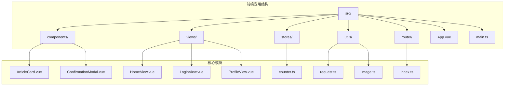
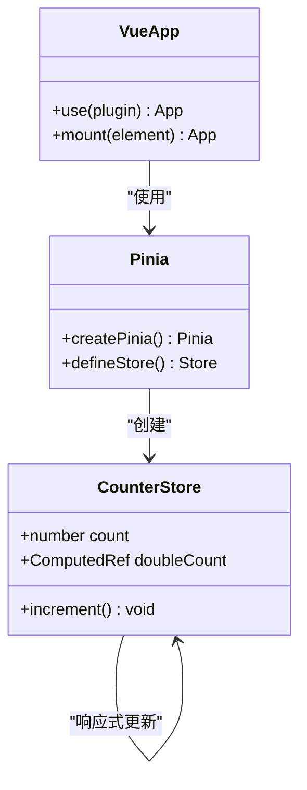
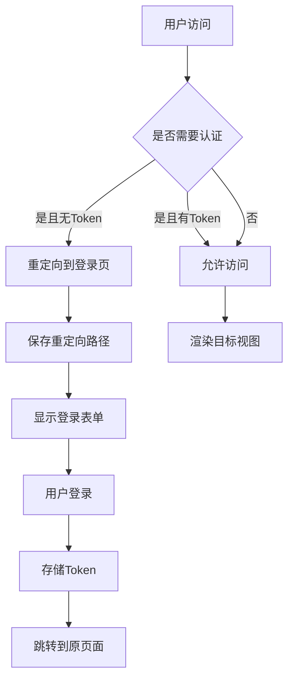
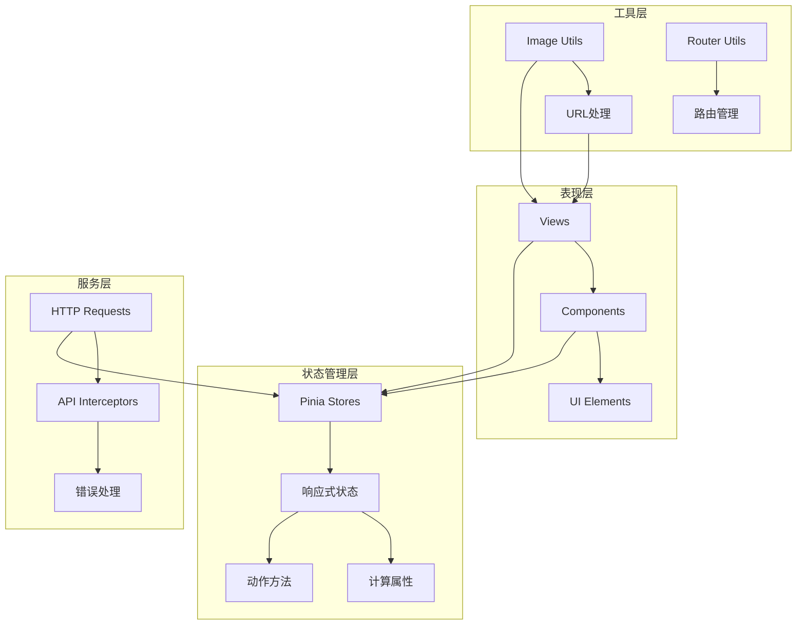
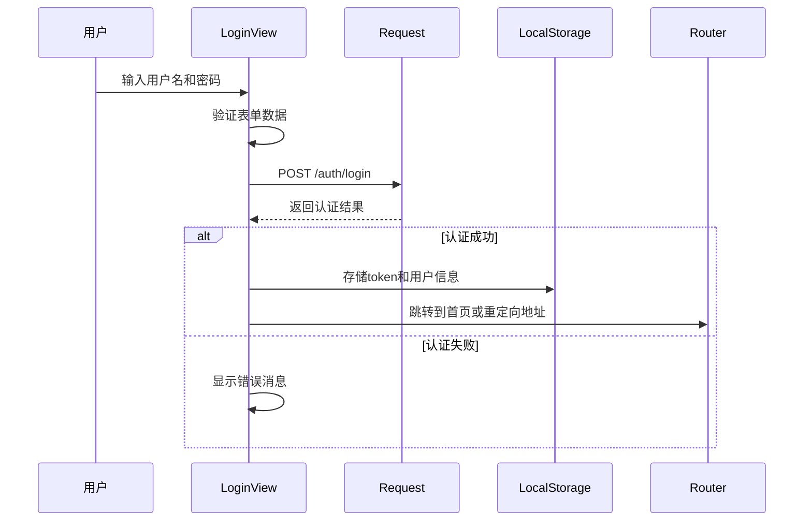
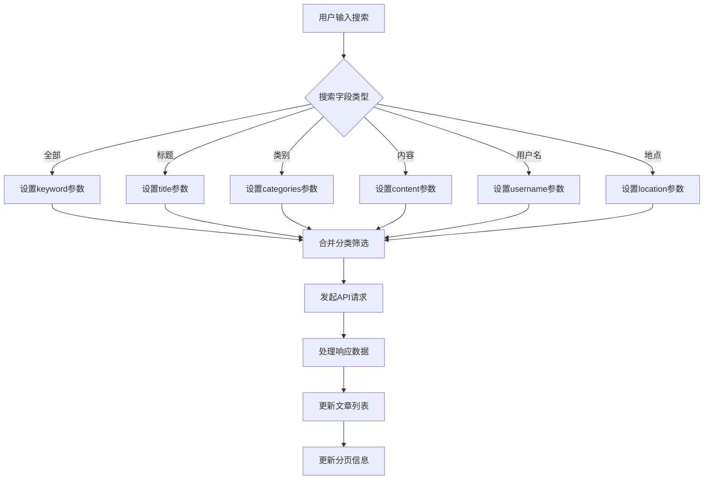
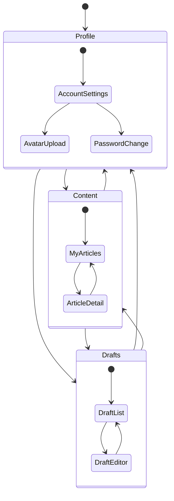
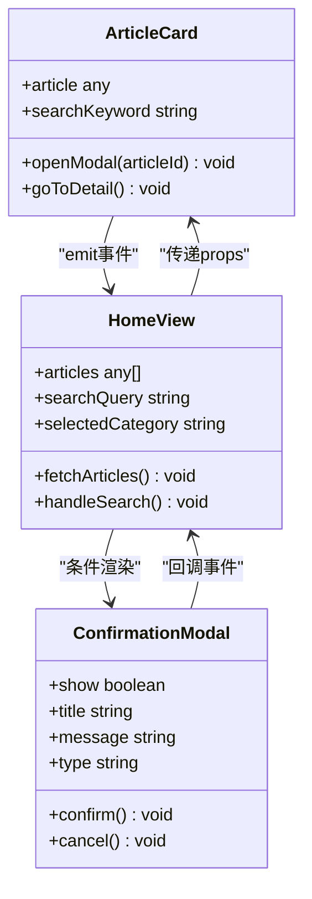

# 前端状态管理

<cite>
**本文档引用的文件**
- [main.ts](file://frontend/src/main.ts)
- [counter.ts](file://frontend/src/stores/counter.ts)
- [package.json](file://frontend/package.json)
- [vite.config.ts](file://frontend/vite.config.ts)
- [router/index.ts](file://frontend/src/router/index.ts)
- [utils/request.ts](file://frontend/src/utils/request.ts)
- [utils/image.ts](file://frontend/src/utils/image.ts)
- [App.vue](file://frontend/src/App.vue)
- [HomeView.vue](file://frontend/src/views/HomeView.vue)
- [LoginView.vue](file://frontend/src/views/LoginView.vue)
- [ProfileView.vue](file://frontend/src/views/ProfileView.vue)
- [ArticleCard.vue](file://frontend/src/components/ArticleCard.vue)
- [ConfirmationModal.vue](file://frontend/src/components/ConfirmationModal.vue)
</cite>

## 目录
1. [简介](#简介)
2. [项目结构](#项目结构)
3. [核心组件](#核心组件)
4. [架构概览](#架构概览)
5. [详细组件分析](#详细组件分析)
6. [依赖关系分析](#依赖关系分析)
7. [性能考虑](#性能考虑)
8. [故障排除指南](#故障排除指南)
9. [结论](#结论)

## 简介

这是一个基于 Vue 3 和 Pinia 的前端状态管理系统。项目采用现代化的前端技术栈，包括 Vue 3 Composition API、TypeScript、Pinia 状态管理、Vue Router 路由管理等。系统实现了完整的用户认证流程、文章浏览和管理功能，以及响应式的状态管理模式。

## 项目结构

前端项目采用模块化的组织方式，主要分为以下几个核心目录：



**图表来源**
- [main.ts](file://frontend/src/main.ts#L1-L11)
- [App.vue](file://frontend/src/App.vue#L1-L16)

**章节来源**
- [main.ts](file://frontend/src/main.ts#L1-L11)
- [package.json](file://frontend/package.json#L1-L61)

## 核心组件

### 状态管理核心

项目使用 Pinia 作为状态管理解决方案，提供了响应式的状态管理和计算属性支持。



**图表来源**
- [counter.ts](file://frontend/src/stores/counter.ts#L1-L13)
- [main.ts](file://frontend/src/main.ts#L1-L11)

### 路由管理

系统采用 Vue Router 实现客户端路由管理，支持路由守卫和动态路由参数。



**图表来源**
- [router/index.ts](file://frontend/src/router/index.ts#L66-L82)

**章节来源**
- [counter.ts](file://frontend/src/stores/counter.ts#L1-L13)
- [router/index.ts](file://frontend/src/router/index.ts#L1-L85)

## 架构概览

系统采用分层架构设计，清晰分离了表现层、状态管理层和数据访问层：



**图表来源**
- [main.ts](file://frontend/src/main.ts#L1-L11)
- [utils/request.ts](file://frontend/src/utils/request.ts#L1-L65)

## 详细组件分析

### 登录视图组件

登录组件实现了完整的用户认证流程，包括表单验证、密码显示切换和记住密码功能。



**图表来源**
- [LoginView.vue](file://frontend/src/views/LoginView.vue#L176-L201)
- [utils/request.ts](file://frontend/src/utils/request.ts#L15-L26)

### 主页视图组件

主页组件实现了复杂的状态管理，包括搜索功能、文章列表展示、分类筛选和分页功能。



**图表来源**
- [HomeView.vue](file://frontend/src/views/HomeView.vue#L561-L611)

### 个人中心组件

个人中心组件展示了复杂的状态管理模式，包括多标签页切换、内容管理和草稿管理。



**图表来源**
- [ProfileView.vue](file://frontend/src/views/ProfileView.vue#L275-L496)

**章节来源**
- [LoginView.vue](file://frontend/src/views/LoginView.vue#L1-L203)
- [HomeView.vue](file://frontend/src/views/HomeView.vue#L1-L893)
- [ProfileView.vue](file://frontend/src/views/ProfileView.vue#L1-L508)

### 组件通信机制

系统中的组件通过多种方式进行通信，包括 props 传递、事件发射和全局状态管理。



**图表来源**
- [ArticleCard.vue](file://frontend/src/components/ArticleCard.vue#L91-L109)
- [HomeView.vue](file://frontend/src/views/HomeView.vue#L702-L721)
- [ConfirmationModal.vue](file://frontend/src/components/ConfirmationModal.vue#L40-L49)

**章节来源**
- [ArticleCard.vue](file://frontend/src/components/ArticleCard.vue#L1-L235)
- [ConfirmationModal.vue](file://frontend/src/components/ConfirmationModal.vue#L1-L60)

## 依赖关系分析

项目的核心依赖关系如下：

```mermaid
graph TB
subgraph "运行时依赖"
A[vue@^3.5.27] --> B[Composition API]
C[pinia@^3.0.4] --> D[状态管理]
E[vue-router@^5.0.1] --> F[路由管理]
G[axios@^1.13.4] --> H[HTTP客户端]
end
subgraph "开发依赖"
I[vite@^7.3.1] --> J[构建工具]
K[typescript@~5.9.3] --> L[类型检查]
M[tailwindcss@^4.1.18] --> N[样式框架]
end
subgraph "应用层"
O[main.ts] --> A
O --> C
O --> E
P[App.vue] --> A
Q[views/*] --> A
R[stores/*] --> C
S[utils/*] --> G
end
```

**图表来源**
- [package.json](file://frontend/package.json#L19-L56)
- [main.ts](file://frontend/src/main.ts#L1-L11)

**章节来源**
- [package.json](file://frontend/package.json#L1-L61)
- [vite.config.ts](file://frontend/vite.config.ts#L1-L30)

## 性能考虑

### 状态管理优化

1. **响应式更新**: 使用 Vue 3 的响应式系统，确保状态变更时只更新必要的组件
2. **计算属性缓存**: 通过 computed 属性避免重复计算
3. **懒加载策略**: 路由级别的代码分割，按需加载组件

### 网络请求优化

1. **请求拦截器**: 自动添加认证头，统一错误处理
2. **防抖机制**: 搜索功能实现防抖，减少不必要的 API 调用
3. **分页加载**: 支持分页加载，避免一次性加载大量数据

### 图片资源优化

1. **URL 处理**: 统一的图片 URL 生成逻辑
2. **懒加载**: 图片组件支持懒加载
3. **格式支持**: 支持多种图片格式，包括现代格式如 WebP

## 故障排除指南

### 常见问题及解决方案

#### 认证相关问题
- **Token 失效**: 系统会在 401 错误时自动清除本地存储的 token
- **登录状态异常**: 检查 localStorage 中的 token 是否存在
- **路由重定向**: 确认路由守卫逻辑是否正确执行

#### 状态管理问题
- **状态不同步**: 检查 Pinia store 的响应式更新
- **组件状态丢失**: 确认 keep-alive 的使用和组件生命周期
- **内存泄漏**: 检查定时器和事件监听器的清理

#### API 请求问题
- **跨域问题**: 检查 Vite 代理配置
- **请求超时**: 调整 axios timeout 设置
- **错误处理**: 确认响应拦截器的错误处理逻辑

**章节来源**
- [utils/request.ts](file://frontend/src/utils/request.ts#L34-L62)
- [router/index.ts](file://frontend/src/router/index.ts#L66-L82)

## 结论

这个前端状态管理系统展现了现代 Vue 3 应用的最佳实践。通过合理使用 Pinia 状态管理、Vue Router 路由管理和 Axios HTTP 客户端，系统实现了清晰的架构分离和良好的用户体验。

### 主要优势

1. **模块化设计**: 清晰的文件组织和职责分离
2. **响应式状态**: 基于 Vue 3 Composition API 的现代化状态管理
3. **类型安全**: TypeScript 提供完整的类型安全保障
4. **开发体验**: Vite 提供快速的开发和构建体验
5. **性能优化**: 多层次的性能优化策略

### 技术亮点

- **Pinia 状态管理**: 简洁易用的状态管理方案
- **Vue Router 集成**: 完整的路由管理功能
- **HTTP 拦截器**: 统一的网络请求处理
- **组件化架构**: 可复用的组件设计
- **响应式 UI**: 流畅的用户界面交互

该系统为后续的功能扩展奠定了坚实的基础，可以轻松地添加新的状态管理模块和业务功能。