# 前端路由系统

<cite>
**本文档引用的文件**
- [frontend/src/router/index.ts](file://frontend/src/router/index.ts)
- [frontend/src/main.ts](file://frontend/src/main.ts)
- [frontend/src/App.vue](file://frontend/src/App.vue)
- [frontend/src/views/HomeView.vue](file://frontend/src/views/HomeView.vue)
- [frontend/src/views/LoginView.vue](file://frontend/src/views/LoginView.vue)
- [frontend/src/views/ProfileView.vue](file://frontend/src/views/ProfileView.vue)
- [frontend/src/views/ArticleDetailView.vue](file://frontend/src/views/ArticleDetailView.vue)
- [frontend/src/views/ArticleCreateView.vue](file://frontend/src/views/ArticleCreateView.vue)
- [frontend/src/views/ArticleEditView.vue](file://frontend/src/views/ArticleEditView.vue)
- [frontend/src/views/DraftEditView.vue](file://frontend/src/views/DraftEditView.vue)
- [frontend/src/components/profile/ArticleDetail.vue](file://frontend/src/components/profile/ArticleDetail.vue)
- [frontend/src/components/profile/ArticleEdit.vue](file://frontend/src/components/profile/ArticleEdit.vue)
- [frontend/src/components/profile/DraftEdit.vue](file://frontend/src/components/profile/DraftEdit.vue)
- [frontend/src/utils/request.ts](file://frontend/src/utils/request.ts)
- [frontend/src/utils/image.ts](file://frontend/src/utils/image.ts)
- [frontend/src/components/ArticleCard.vue](file://frontend/src/components/ArticleCard.vue)
- [frontend/package.json](file://frontend/package.json)
- [frontend/vite.config.ts](file://frontend/vite.config.ts)
- [frontend/tailwind.config.js](file://frontend/tailwind.config.js)
- [frontend/tsconfig.app.json](file://frontend/tsconfig.app.json)
</cite>

## 更新摘要
**变更内容**
- 新增hasRichTextContent函数，改进了富文本内容验证逻辑
- 在ArticleCreateView和DraftEditView中集成了更智能的草稿保存机制
- 更新了路由配置以支持草稿编辑功能
- 增强了内容验证规则，支持富文本内容的智能检测

## 目录
1. [简介](#简介)
2. [项目结构](#项目结构)
3. [核心组件](#核心组件)
4. [架构概览](#架构概览)
5. [详细组件分析](#详细组件分析)
6. [依赖关系分析](#依赖关系分析)
7. [性能考虑](#性能考虑)
8. [故障排除指南](#故障排除指南)
9. [结论](#结论)

## 简介

这是一个基于 Vue 3 和 Vue Router 的前端路由系统，采用现代前端技术栈构建的知识管理系统。该系统实现了完整的单页面应用路由功能，包括用户认证、文章浏览、编辑管理等核心业务功能。系统现已支持个人中心的完整文章管理生态，包括文章详情展示、编辑功能和草稿管理，并集成了智能的富文本内容验证机制。

## 项目结构

前端项目采用标准的 Vue 3 单页面应用结构，主要目录组织如下：

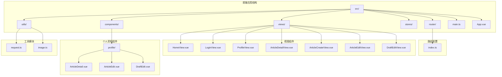

**图表来源**
- [frontend/src/router/index.ts](file://frontend/src/router/index.ts#L1-L120)
- [frontend/src/main.ts](file://frontend/src/main.ts#L1-L11)

**章节来源**
- [frontend/src/router/index.ts](file://frontend/src/router/index.ts#L1-L120)
- [frontend/src/main.ts](file://frontend/src/main.ts#L1-L11)

## 核心组件

### 路由配置系统

路由系统采用 Vue Router 5.0.1 实现，支持历史模式和元信息认证控制：

| 路由路径 | 组件名称 | 认证要求 | 功能描述 |
|---------|----------|----------|----------|
| `/` | HomeView | 否 | 首页 - 文章列表和搜索功能 |
| `/login` | LoginView | 否 | 用户登录页面 |
| `/register` | RegisterView | 否 | 用户注册页面 |
| `/profile` | ProfileView | 是 | 个人中心 - 账户设置、内容管理 |
| `/post` | ArticleCreateView | 是 | 新建文章页面 |
| `/article/:id` | ArticleDetailView | 否 | 文章详情页面 - 现已开放给所有用户访问 |
| `/article/edit/:id` | ArticleEditView | 是 | 编辑文章页面 |
| `/draft/:id/edit` | DraftEditView | 是 | 编辑草稿页面 |

**更新** 新增了草稿编辑路由，支持从个人中心直接编辑现有草稿。

### 富文本内容验证系统

系统集成了智能的富文本内容验证机制，通过hasRichTextContent函数实现：

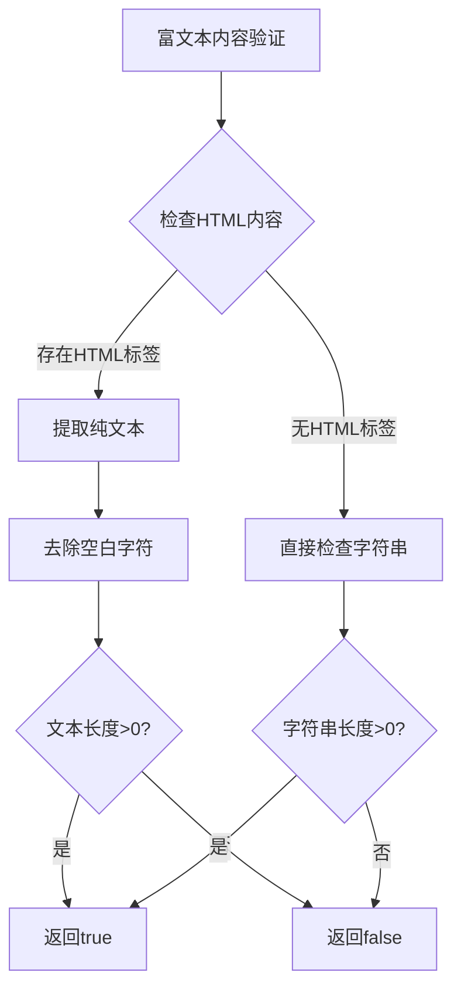

**图表来源**
- [frontend/src/views/ArticleCreateView.vue](file://frontend/src/views/ArticleCreateView.vue#L236-L243)
- [frontend/src/views/DraftEditView.vue](file://frontend/src/views/DraftEditView.vue#L241-L248)

**章节来源**
- [frontend/src/router/index.ts](file://frontend/src/router/index.ts#L20-L98)
- [frontend/src/views/ArticleCreateView.vue](file://frontend/src/views/ArticleCreateView.vue#L236-L243)
- [frontend/src/views/DraftEditView.vue](file://frontend/src/views/DraftEditView.vue#L241-L248)

## 架构概览

### 整体架构设计

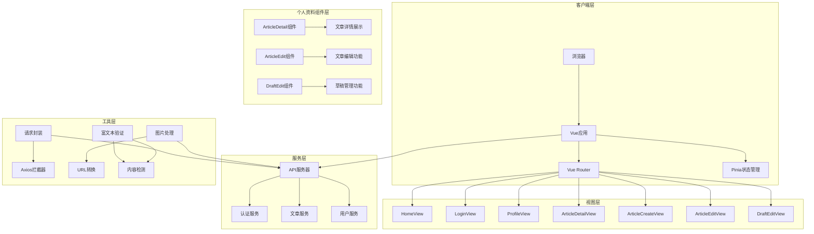

**图表来源**
- [frontend/src/router/index.ts](file://frontend/src/router/index.ts#L1-L120)
- [frontend/src/utils/request.ts](file://frontend/src/utils/request.ts#L1-L65)

### 路由守卫机制

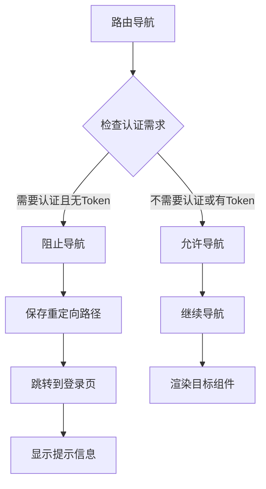

**更新** 所有路由现在都支持公开访问，无需登录即可查看文章详情。

**图表来源**
- [frontend/src/router/index.ts](file://frontend/src/router/index.ts#L100-L117)

**章节来源**
- [frontend/src/router/index.ts](file://frontend/src/router/index.ts#L100-L117)

## 详细组件分析

### 登录认证组件

LoginView 实现了完整的用户认证流程，包括表单验证、Token存储和重定向逻辑：

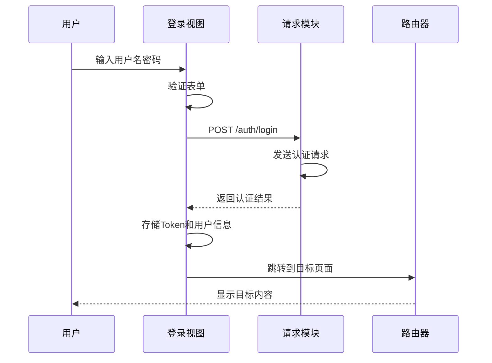

**图表来源**
- [frontend/src/views/LoginView.vue](file://frontend/src/views/LoginView.vue#L176-L201)
- [frontend/src/utils/request.ts](file://frontend/src/utils/request.ts#L15-L26)

**章节来源**
- [frontend/src/views/LoginView.vue](file://frontend/src/views/LoginView.vue#L151-L203)

### 首页内容展示

HomeView 作为核心内容展示组件，实现了复杂的文章列表管理和搜索功能：

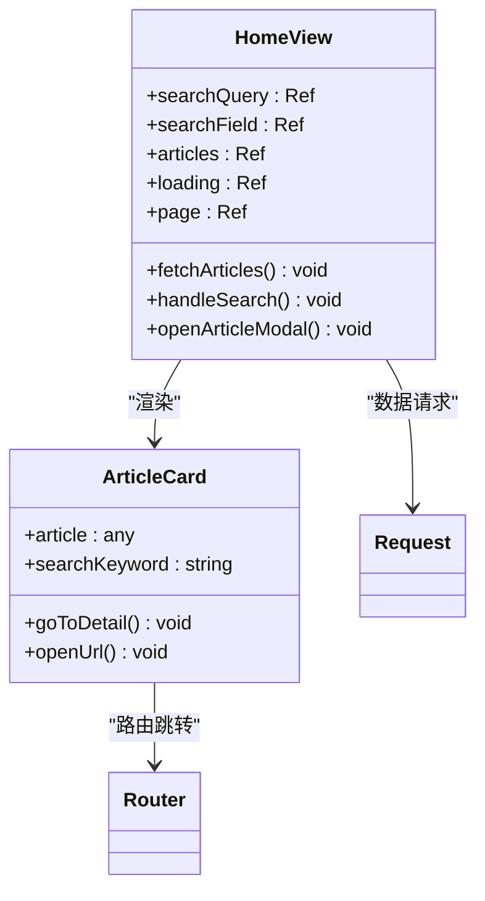

**图表来源**
- [frontend/src/views/HomeView.vue](file://frontend/src/views/HomeView.vue#L449-L800)
- [frontend/src/components/ArticleCard.vue](file://frontend/src/components/ArticleCard.vue#L86-L235)

**章节来源**
- [frontend/src/views/HomeView.vue](file://frontend/src/views/HomeView.vue#L449-L800)
- [frontend/src/components/ArticleCard.vue](file://frontend/src/components/ArticleCard.vue#L86-L235)

### 个人中心管理

ProfileView 提供了完整的用户管理功能，包括账户设置、内容管理和草稿管理。现在集成了三个核心组件：

#### 文章详情组件 (ArticleDetail)

ArticleDetail 组件实现了响应式的文章详情展示，支持图片轮播和移动端适配：

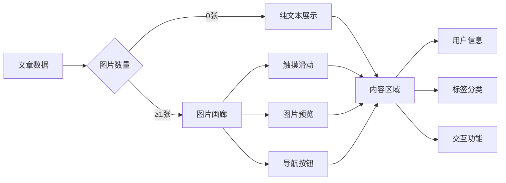

#### 文章编辑组件 (ArticleEdit)

ArticleEdit 组件提供了完整的文章编辑功能，包括富文本编辑、图片上传、分类管理等：

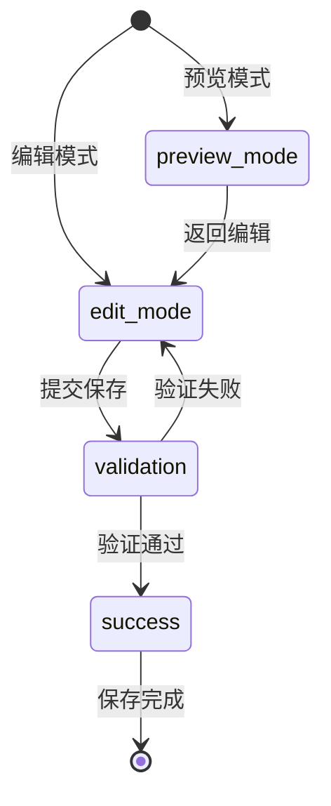

#### 草稿编辑组件 (DraftEdit)

DraftEdit 组件实现了智能草稿管理，包含自动保存和发布功能：

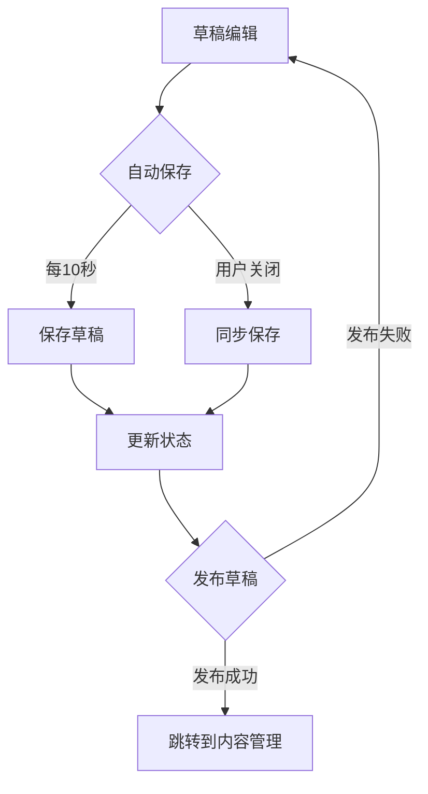

**图表来源**
- [frontend/src/components/profile/ArticleDetail.vue](file://frontend/src/components/profile/ArticleDetail.vue#L1-L197)
- [frontend/src/components/profile/ArticleEdit.vue](file://frontend/src/components/profile/ArticleEdit.vue#L1-L288)
- [frontend/src/components/profile/DraftEdit.vue](file://frontend/src/components/profile/DraftEdit.vue#L1-L360)

**章节来源**
- [frontend/src/views/ProfileView.vue](file://frontend/src/views/ProfileView.vue#L284-L301)
- [frontend/src/components/profile/ArticleDetail.vue](file://frontend/src/components/profile/ArticleDetail.vue#L1-L197)
- [frontend/src/components/profile/ArticleEdit.vue](file://frontend/src/components/profile/ArticleEdit.vue#L1-L288)
- [frontend/src/components/profile/DraftEdit.vue](file://frontend/src/components/profile/DraftEdit.vue#L1-L360)

### 文章详情展示

ArticleDetailView 实现了响应式的文章详情展示，支持图片轮播和移动端适配：

**更新** 文章详情页面现在对所有用户开放，无需登录即可访问。

**图表来源**
- [frontend/src/views/ArticleDetailView.vue](file://frontend/src/views/ArticleDetailView.vue#L1-L565)

**章节来源**
- [frontend/src/views/ArticleDetailView.vue](file://frontend/src/views/ArticleDetailView.vue#L1-L565)

### 智能草稿保存系统

**更新** 系统现在集成了智能的草稿保存功能，通过hasRichTextContent函数实现富文本内容验证：

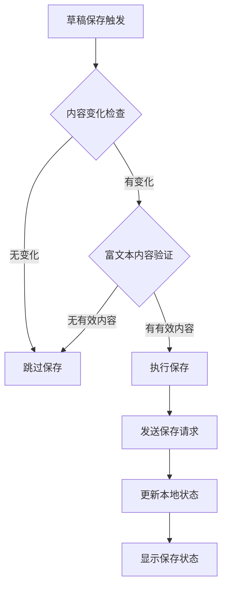

**图表来源**
- [frontend/src/views/ArticleCreateView.vue](file://frontend/src/views/ArticleCreateView.vue#L283-L314)
- [frontend/src/views/DraftEditView.vue](file://frontend/src/views/DraftEditView.vue#L288-L318)

**章节来源**
- [frontend/src/views/ArticleCreateView.vue](file://frontend/src/views/ArticleCreateView.vue#L283-L314)
- [frontend/src/views/DraftEditView.vue](file://frontend/src/views/DraftEditView.vue#L288-L318)

## 依赖关系分析

### 技术栈依赖

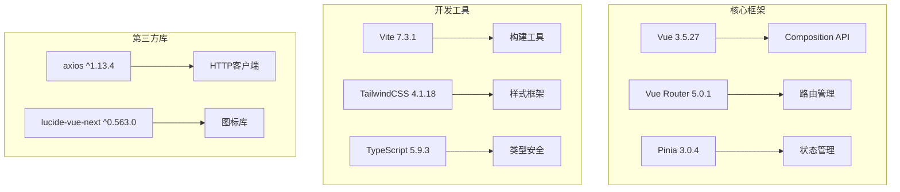

**图表来源**
- [frontend/package.json](file://frontend/package.json#L19-L55)

**章节来源**
- [frontend/package.json](file://frontend/package.json#L1-L61)

### 网络请求处理

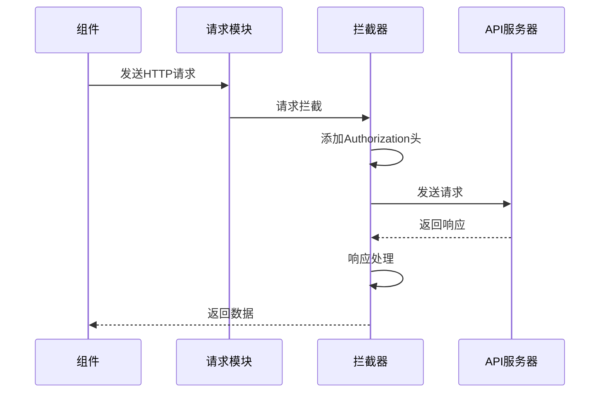

**图表来源**
- [frontend/src/utils/request.ts](file://frontend/src/utils/request.ts#L14-L62)

**章节来源**
- [frontend/src/utils/request.ts](file://frontend/src/utils/request.ts#L1-L65)

## 性能考虑

### 缓存策略

应用采用了多层次的缓存策略来优化性能：

1. **组件缓存**: 使用 keep-alive 对 HomeView 进行缓存
2. **状态缓存**: 使用 Pinia 进行全局状态管理
3. **请求缓存**: 可通过 HTTP 缓存头实现静态资源缓存

### 路由优化

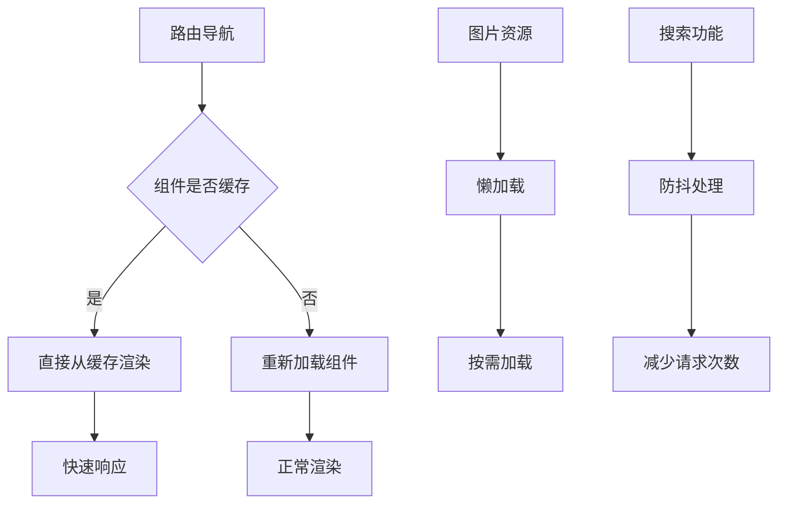

**章节来源**
- [frontend/src/App.vue](file://frontend/src/App.vue#L6-L10)

## 故障排除指南

### 常见问题诊断

| 问题类型 | 症状 | 解决方案 |
|---------|------|----------|
| 认证失败 | 401错误 | 检查Token有效性，重新登录 |
| 路由跳转异常 | 页面空白 | 检查路由配置和组件导入 |
| 图片加载失败 | 404错误 | 验证图片URL和服务器配置 |
| 搜索无结果 | 空列表 | 检查搜索参数和API连通性 |
| 草稿保存失败 | 内容丢失 | 检查网络连接和服务器状态 |

### 调试工具

1. **浏览器开发者工具**: 检查网络请求和控制台错误
2. **Vue DevTools**: 分析组件状态和路由信息
3. **日志输出**: 在关键节点添加console.log进行调试

**章节来源**
- [frontend/src/utils/request.ts](file://frontend/src/utils/request.ts#L28-L62)

## 结论

该前端路由系统采用现代化的技术栈，实现了完整的单页面应用功能。系统具有以下特点：

1. **模块化设计**: 清晰的组件分离和职责划分，个人中心集成了完整的文章管理生态系统
2. **响应式架构**: 支持移动端和桌面端的自适应布局
3. **性能优化**: 多层次的缓存策略和懒加载机制
4. **用户体验**: 流畅的路由切换和丰富的交互效果
5. **功能完整性**: 支持文章浏览、编辑、草稿管理等完整工作流
6. **智能验证**: 通过hasRichTextContent函数实现了富文本内容的智能验证

**更新** 最新更新使文章详情页面对所有用户开放，提升了系统的可访问性和用户体验。通过合理的架构设计和最佳实践的应用，该系统为用户提供了优秀的使用体验，同时为后续的功能扩展奠定了良好的基础。个人中心的ArticleDetail、ArticleEdit、DraftEdit组件形成了完整的文章管理闭环，为用户提供了从创作到发布的全流程支持。

**新增功能** 智能草稿保存功能通过hasRichTextContent函数实现了富文本内容的准确验证，确保只有包含有效内容的草稿才会被自动保存，大大提升了用户体验和数据完整性。