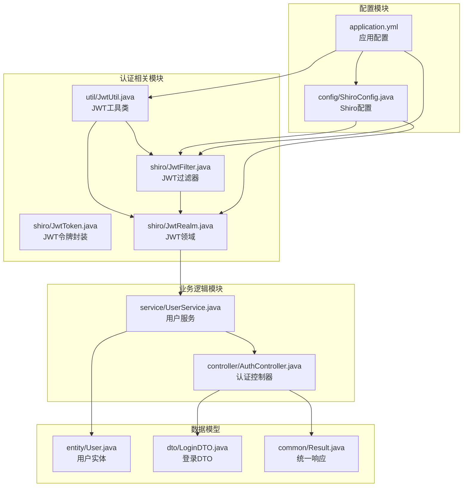
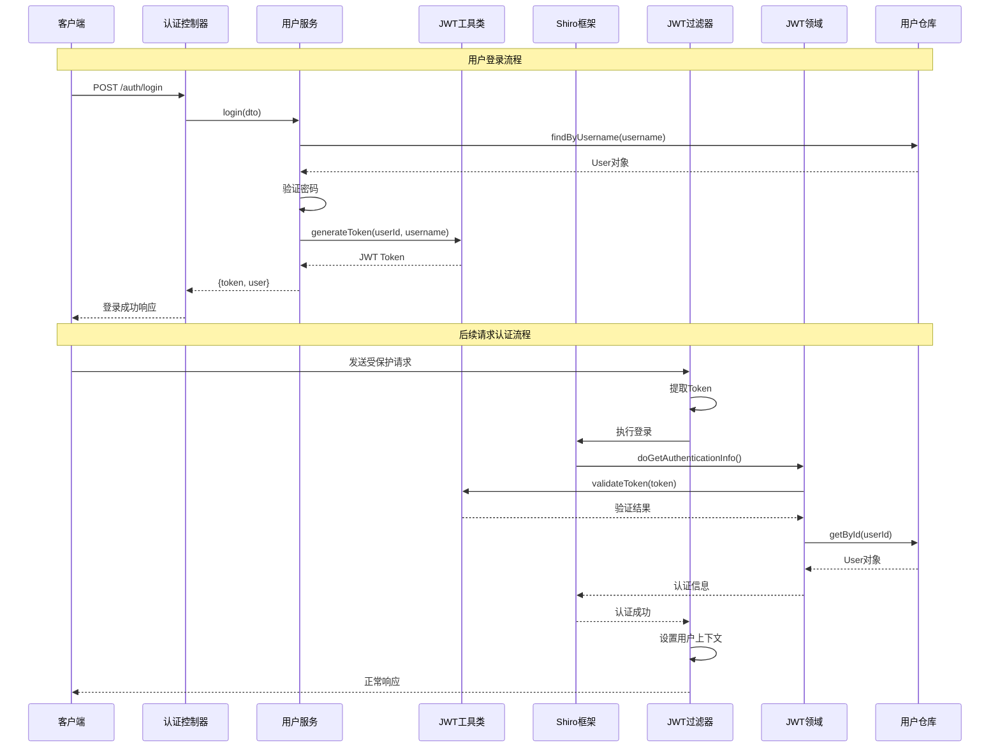
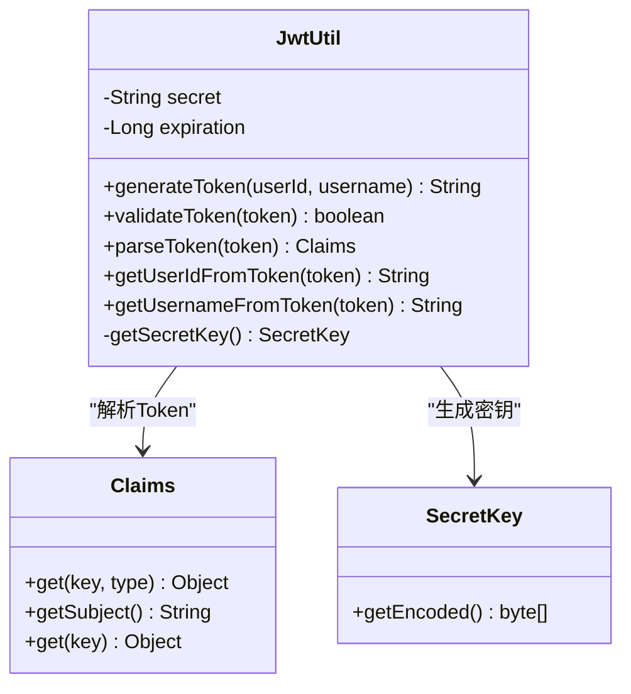
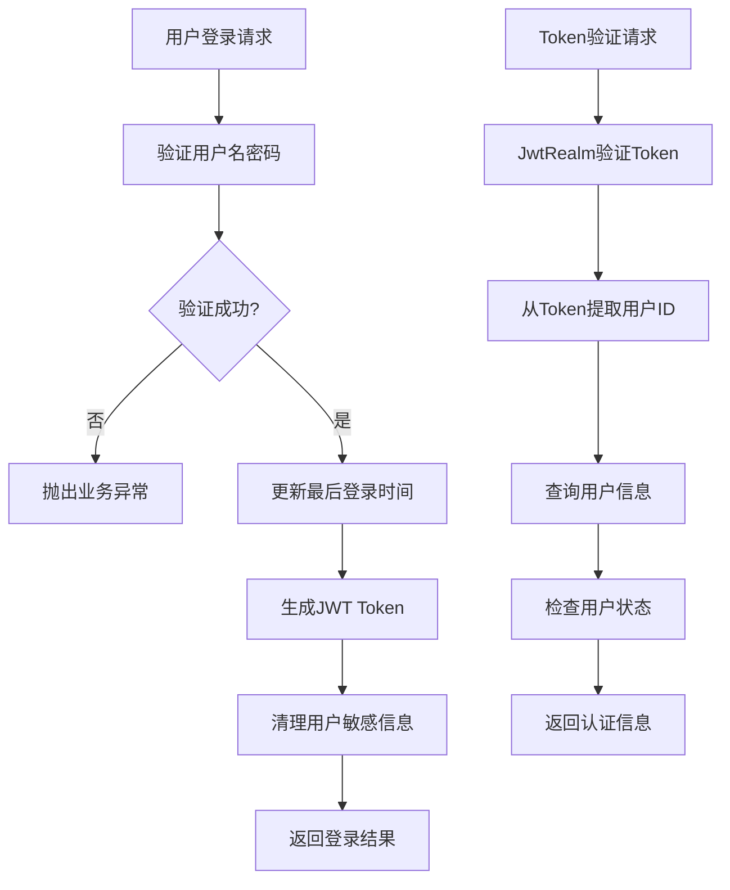
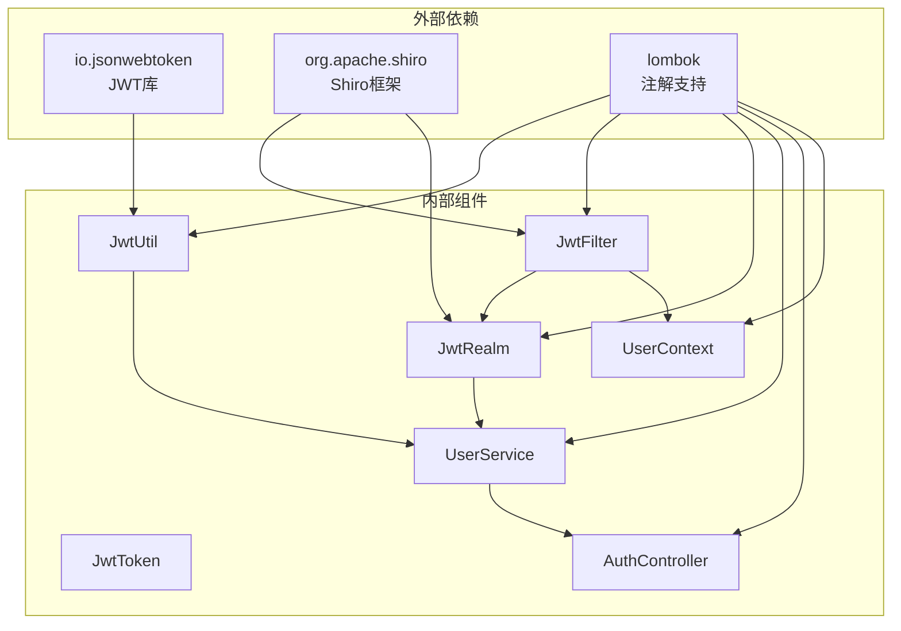

# JWT认证机制

<cite>
**本文档引用的文件**
- [JwtUtil.java](file://src/main/java/com/zhishilu/util/JwtUtil.java)
- [JwtToken.java](file://src/main/java/com/zhishilu/shiro/JwtToken.java)
- [JwtFilter.java](file://src/main/java/com/zhishilu/shiro/JwtFilter.java)
- [JwtRealm.java](file://src/main/java/com/zhishilu/shiro/JwtRealm.java)
- [UserService.java](file://src/main/java/com/zhishilu/service/UserService.java)
- [AuthController.java](file://src/main/java/com/zhishilu/controller/AuthController.java)
- [ShiroConfig.java](file://src/main/java/com/zhishilu/config/ShiroConfig.java)
- [application.yml](file://src/main/resources/application.yml)
- [LoginDTO.java](file://src/main/java/com/zhishilu/dto/LoginDTO.java)
- [User.java](file://src/main/java/com/zhishilu/entity/User.java)
- [Result.java](file://src/main/java/com/zhishilu/common/Result.java)
- [UserContext.java](file://src/main/java/com/zhishilu/util/UserContext.java)
- [pom.xml](file://pom.xml)
</cite>

## 目录
1. [简介](#简介)
2. [项目结构](#项目结构)
3. [核心组件](#核心组件)
4. [架构概览](#架构概览)
5. [详细组件分析](#详细组件分析)
6. [依赖关系分析](#依赖关系分析)
7. [性能考虑](#性能考虑)
8. [故障排除指南](#故障排除指南)
9. [结论](#结论)
10. [附录](#附录)

## 简介

知拾录系统采用JWT（JSON Web Token）作为主要的身份认证机制，结合Apache Shiro框架实现无状态的RESTful API认证。该系统通过JWT实现用户身份验证和授权，支持Token的生成、验证、解析等功能，为整个应用提供安全可靠的身份认证服务。

JWT认证机制的核心优势在于其无状态特性，服务器不需要存储会话信息，所有用户信息都包含在Token中，便于分布式部署和扩展。

## 项目结构

知拾录系统的JWT认证相关代码主要分布在以下模块中：



**图表来源**
- [JwtUtil.java](file://src/main/java/com/zhishilu/util/JwtUtil.java#L1-L99)
- [JwtFilter.java](file://src/main/java/com/zhishilu/shiro/JwtFilter.java#L1-L109)
- [JwtRealm.java](file://src/main/java/com/zhishilu/shiro/JwtRealm.java#L1-L71)
- [UserService.java](file://src/main/java/com/zhishilu/service/UserService.java#L1-L128)

**章节来源**
- [JwtUtil.java](file://src/main/java/com/zhishilu/util/JwtUtil.java#L1-L99)
- [JwtFilter.java](file://src/main/java/com/zhishilu/shiro/JwtFilter.java#L1-L109)
- [JwtRealm.java](file://src/main/java/com/zhishilu/shiro/JwtRealm.java#L1-L71)
- [UserService.java](file://src/main/java/com/zhishilu/service/UserService.java#L1-L128)

## 核心组件

### JWT工具类（JwtUtil）

JwtUtil是JWT认证机制的核心工具类，负责Token的生成、验证、解析等核心功能：

**主要功能特性：**
- Token生成：包含用户ID和用户名的负载信息
- Token验证：检查Token的有效性和过期状态
- Token解析：提取Token中的用户信息
- 密钥管理：基于配置的密钥进行签名验证

**核心方法：**
- `generateToken(userId, username)`：生成JWT Token
- `validateToken(token)`：验证Token有效性
- `parseToken(token)`：解析Token负载信息
- `getUserIdFromToken(token)`：从Token获取用户ID
- `getUsernameFromToken(token)`：从Token获取用户名

**章节来源**
- [JwtUtil.java](file://src/main/java/com/zhishilu/util/JwtUtil.java#L28-L98)

### JWT令牌封装（JwtToken）

JwtToken实现了Apache Shiro的AuthenticationToken接口，用于封装JWT Token：

**设计特点：**
- 实现了Shiro的AuthenticationToken接口
- 提供统一的令牌访问方式
- 支持获取主标识和凭证信息

**章节来源**
- [JwtToken.java](file://src/main/java/com/zhishilu/shiro/JwtToken.java#L8-L25)

### JWT过滤器（JwtFilter）

JwtFilter继承自AuthenticatingFilter，负责拦截HTTP请求并进行JWT认证：

**核心功能：**
- 请求拦截：拦截所有受保护的API请求
- Token提取：从请求头或参数中提取JWT Token
- 认证流程：调用Shiro进行身份验证
- 错误处理：处理认证失败的情况

**章节来源**
- [JwtFilter.java](file://src/main/java/com/zhishilu/shiro/JwtFilter.java#L39-L108)

### JWT领域（JwtRealm）

JwtRealm继承自AuthorizingRealm，实现JWT认证的核心逻辑：

**认证流程：**
1. 验证Token的有效性
2. 从Token中提取用户ID
3. 查询用户信息
4. 检查用户状态
5. 返回认证信息

**章节来源**
- [JwtRealm.java](file://src/main/java/com/zhishilu/shiro/JwtRealm.java#L44-L69)

## 架构概览

知拾录系统的JWT认证架构采用分层设计，各组件职责明确：



**图表来源**
- [AuthController.java](file://src/main/java/com/zhishilu/controller/AuthController.java#L36-L40)
- [UserService.java](file://src/main/java/com/zhishilu/service/UserService.java#L61-L87)
- [JwtUtil.java](file://src/main/java/com/zhishilu/util/JwtUtil.java#L31-L43)
- [JwtFilter.java](file://src/main/java/com/zhishilu/shiro/JwtFilter.java#L58-L67)
- [JwtRealm.java](file://src/main/java/com/zhishilu/shiro/JwtRealm.java#L44-L69)

## 详细组件分析

### JWT工具类深度分析

JwtUtil类实现了完整的JWT生命周期管理：



**图表来源**
- [JwtUtil.java](file://src/main/java/com/zhishilu/util/JwtUtil.java#L20-L98)

**Token生成流程：**
1. 创建负载信息（包含用户ID和用户名）
2. 设置主题（用户名）
3. 设置签发时间
4. 设置过期时间
5. 使用HMAC-SHA256算法签名
6. 编码为Base64字符串

**Token验证流程：**
1. 使用相同密钥验证签名
2. 检查Token是否过期
3. 提取负载信息
4. 返回验证结果

**章节来源**
- [JwtUtil.java](file://src/main/java/com/zhishilu/util/JwtUtil.java#L31-L98)

### 用户服务集成分析

UserService在用户认证流程中扮演关键角色：



**图表来源**
- [UserService.java](file://src/main/java/com/zhishilu/service/UserService.java#L61-L87)
- [JwtRealm.java](file://src/main/java/com/zhishilu/shiro/JwtRealm.java#L44-L69)

**章节来源**
- [UserService.java](file://src/main/java/com/zhishilu/service/UserService.java#L61-L87)
- [JwtRealm.java](file://src/main/java/com/zhishilu/shiro/JwtRealm.java#L44-L69)

### Shiro配置分析

ShiroConfig负责整个认证体系的配置：

```mermaid
graph TB
A[ShiroConfig] --> B[DefaultWebSecurityManager]
A --> C[ShiroFilterFactoryBean]
A --> D[JwtFilter]
A --> E[JwtRealm]
B --> F[关闭Session存储]
C --> G[过滤规则配置]
C --> H[匿名访问配置]
C --> I[JWT认证配置]
G --> J[/auth/** - 匿名访问]
G --> K[/** - JWT认证]
```

**图表来源**
- [ShiroConfig.java](file://src/main/java/com/zhishilu/config/ShiroConfig.java#L26-L70)

**章节来源**
- [ShiroConfig.java](file://src/main/java/com/zhishilu/config/ShiroConfig.java#L26-L70)

## 依赖关系分析

系统JWT认证机制的依赖关系如下：



**图表来源**
- [pom.xml](file://pom.xml#L53-L70)
- [JwtUtil.java](file://src/main/java/com/zhishilu/util/JwtUtil.java#L3-L7)
- [JwtFilter.java](file://src/main/java/com/zhishilu/shiro/JwtFilter.java#L13-L19)

**章节来源**
- [pom.xml](file://pom.xml#L53-L70)

## 性能考虑

### Token缓存策略

当前实现采用无状态设计，每次请求都需要验证Token，这在高并发场景下可能成为性能瓶颈。建议考虑以下优化方案：

1. **本地缓存**：缓存最近使用的Token，减少重复验证
2. **Redis缓存**：使用分布式缓存存储Token黑名单
3. **异步验证**：对于非关键路径的验证可以异步执行

### 密钥管理

- 密钥长度至少256位，确保安全性
- 密钥应定期轮换，防止长期使用导致的安全风险
- 密钥应存储在安全的地方，避免硬编码在代码中

### 过期时间设置

- 24小时的过期时间适合大多数应用场景
- 可以考虑实现短期Token和长期Refresh Token的组合模式
- 对于敏感操作，可以使用更短的过期时间

## 故障排除指南

### 常见问题及解决方案

**Token过期问题：**
- 现象：用户收到401未授权错误
- 原因：Token超过24小时有效期
- 解决：重新登录获取新Token

**Token无效问题：**
- 现象：Token被篡改或格式不正确
- 原因：密钥不匹配或Token被修改
- 解决：检查密钥配置和Token格式

**用户不存在问题：**
- 现象：认证过程中抛出用户不存在异常
- 原因：Token中的用户ID对应用户已被删除
- 解决：重新注册或联系管理员

**章节来源**
- [JwtUtil.java](file://src/main/java/com/zhishilu/util/JwtUtil.java#L55-L61)
- [JwtRealm.java](file://src/main/java/com/zhishilu/shiro/JwtRealm.java#L59-L61)

### 调试技巧

1. **启用详细日志**：在application.yml中调整日志级别
2. **检查Token格式**：确保Token符合JWT标准格式
3. **验证密钥配置**：确认jwt.secret配置正确
4. **测试认证流程**：使用Postman等工具测试完整流程

## 结论

知拾录系统的JWT认证机制设计合理，实现了完整的身份验证功能。通过结合Apache Shiro框架，系统提供了可靠的无状态认证能力。当前实现具有以下优点：

- **安全性**：使用HMAC-SHA256算法进行签名验证
- **可扩展性**：支持分布式部署和水平扩展
- **易维护性**：代码结构清晰，职责分离明确

建议在未来版本中考虑实现Token刷新机制、多因子认证等高级功能，进一步提升系统的安全性和用户体验。

## 附录

### JWT配置参数说明

| 参数名称 | 默认值 | 说明 | 数据类型 |
|---------|--------|------|----------|
| jwt.secret | zhishilu-secret-key-must-be-at-least-256-bits-long-for-hs256 | JWT签名密钥 | 字符串 |
| jwt.expiration | 86400000 | Token过期时间（毫秒），默认24小时 | 数字 |
| jwt.header | Authorization | HTTP头部名称 | 字符串 |
| jwt.prefix | Bearer | Token前缀 | 字符串 |

### Token结构说明

**Header部分：**
- typ: JWT
- alg: HS256

**Payload部分：**
- userId: 用户唯一标识
- username: 用户名
- exp: 过期时间戳
- iat: 签发时间戳
- sub: 主题（用户名）

### 使用示例

**登录获取Token：**
1. 用户向`POST /auth/login`发送登录请求
2. 服务器验证用户名密码
3. 生成JWT Token
4. 返回Token和用户信息

**携带Token访问API：**
1. 在HTTP请求头中添加`Authorization: Bearer {token}`
2. 服务器通过JwtFilter拦截请求
3. JwtRealm验证Token有效性
4. 用户信息存入UserContext

**章节来源**
- [application.yml](file://src/main/resources/application.yml#L26-L31)
- [JwtUtil.java](file://src/main/java/com/zhishilu/util/JwtUtil.java#L31-L43)
- [JwtFilter.java](file://src/main/java/com/zhishilu/shiro/JwtFilter.java#L90-L97)