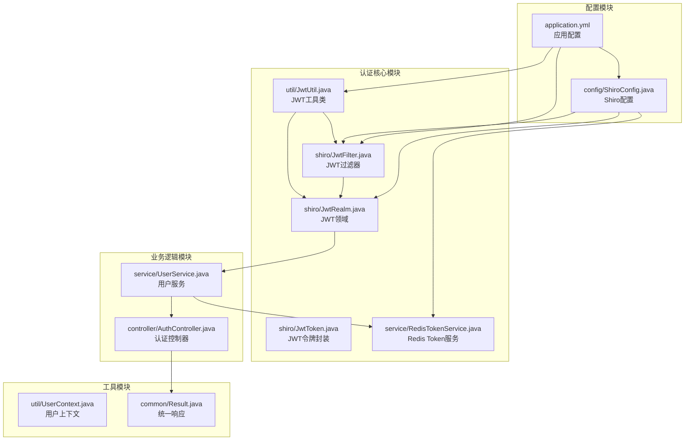
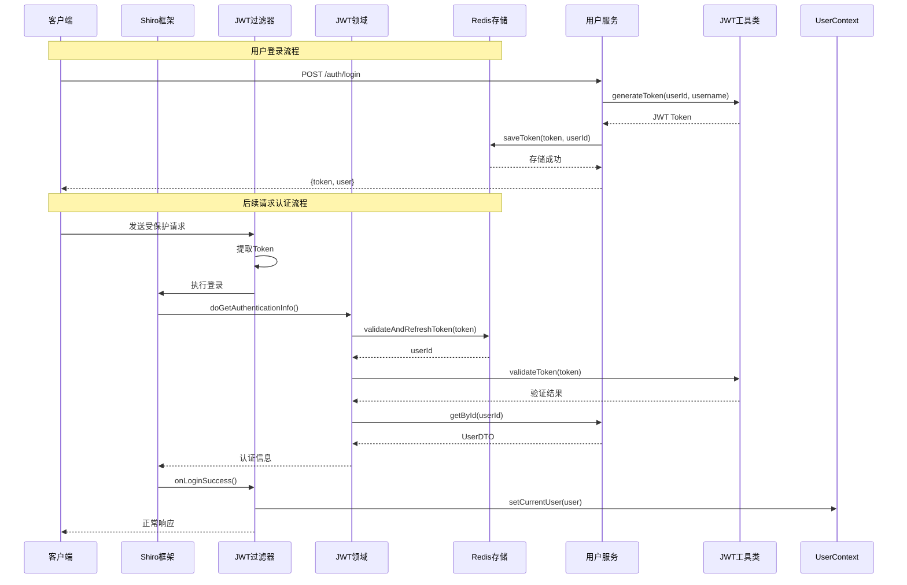
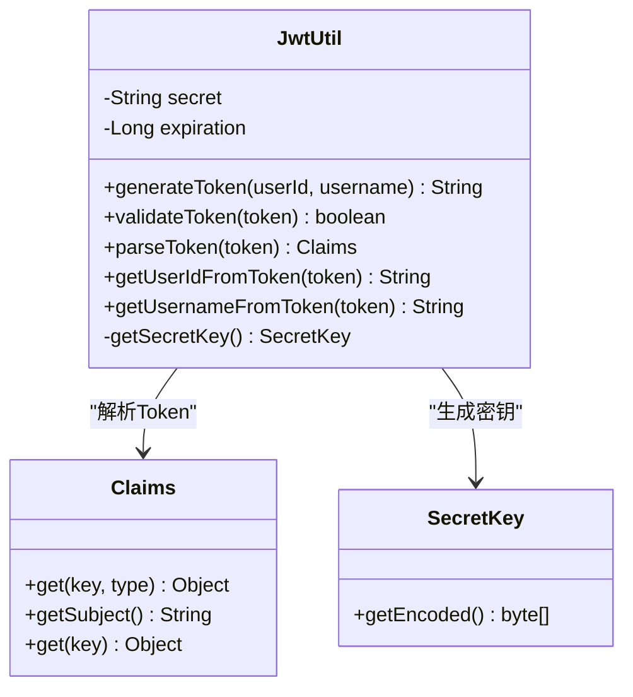
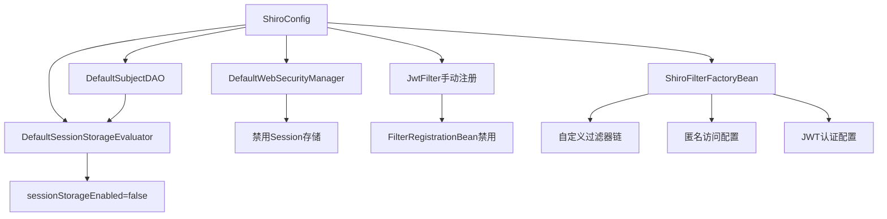
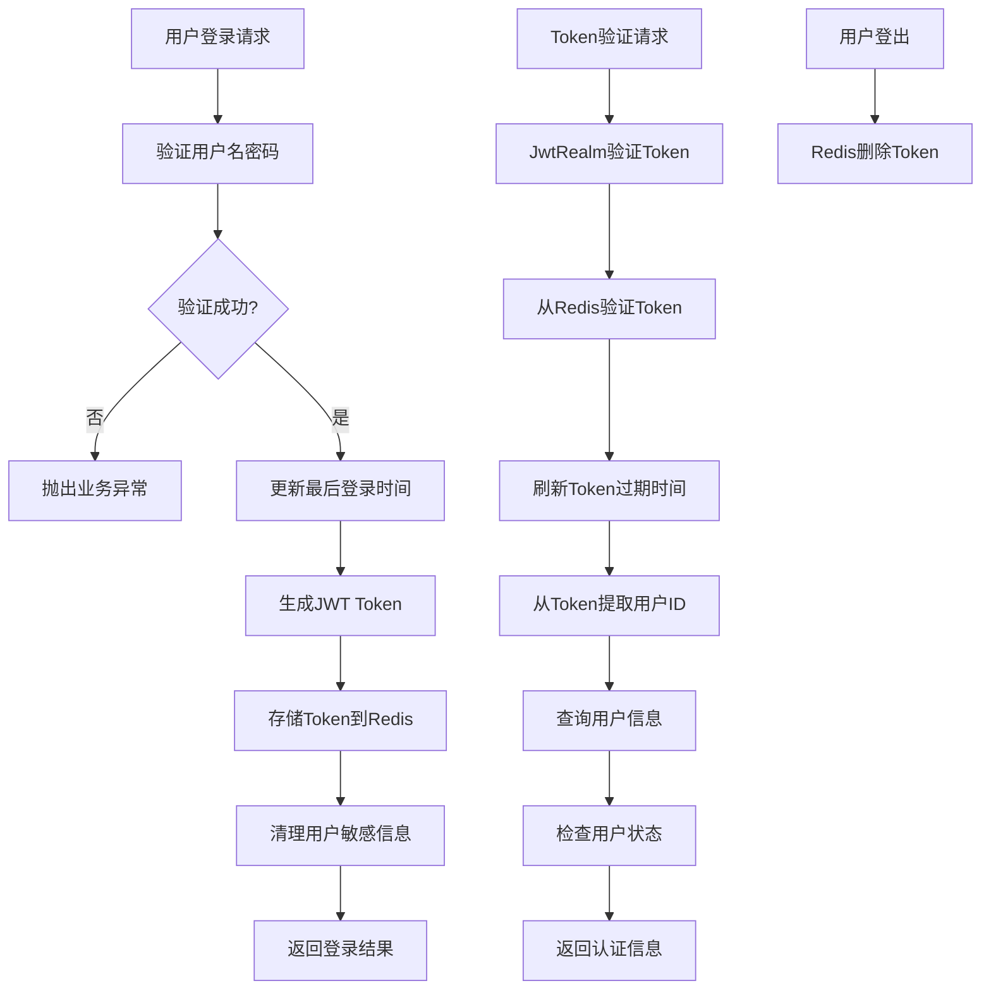
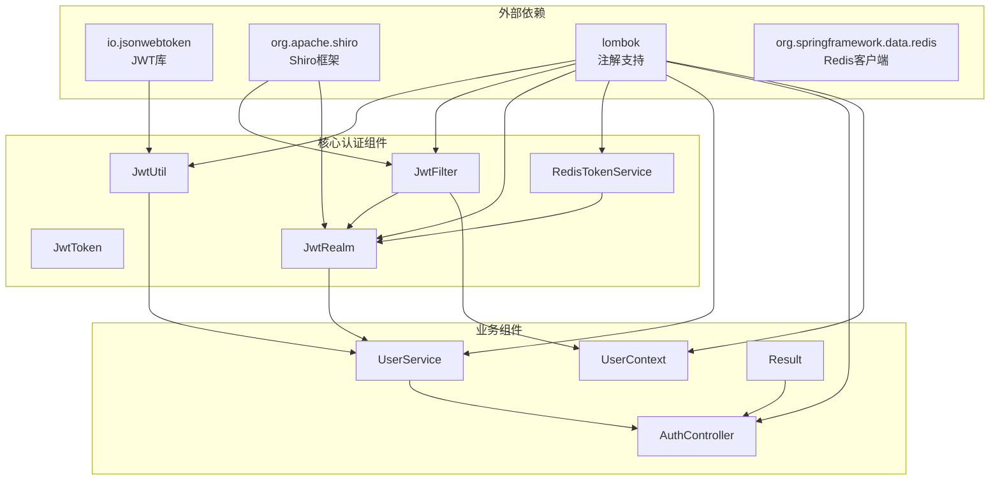

# JWT认证机制

<cite>
**本文档引用的文件**
- [JwtUtil.java](file://src/main/java/com/zhishilu/util/JwtUtil.java)
- [JwtToken.java](file://src/main/java/com/zhishilu/shiro/JwtToken.java)
- [JwtFilter.java](file://src/main/java/com/zhishilu/shiro/JwtFilter.java)
- [JwtRealm.java](file://src/main/java/com/zhishilu/shiro/JwtRealm.java)
- [UserService.java](file://src/main/java/com/zhishilu/service/UserService.java)
- [AuthController.java](file://src/main/java/com/zhishilu/controller/AuthController.java)
- [ShiroConfig.java](file://src/main/java/com/zhishilu/config/ShiroConfig.java)
- [application.yml](file://src/main/resources/application.yml)
- [RedisTokenService.java](file://src/main/java/com/zhishilu/service/RedisTokenService.java)
- [UserContext.java](file://src/main/java/com/zhishilu/util/UserContext.java)
- [pom.xml](file://pom.xml)
</cite>

## 更新摘要
**变更内容**
- 新增禁用Session管理的完整配置说明
- 详细说明自定义JWT过滤器的实现机制和手动注册流程
- 补充Redis Token管理的完整生命周期
- 更新认证流程图以反映新的架构变化

## 目录
1. [简介](#简介)
2. [项目结构](#项目结构)
3. [核心组件](#核心组件)
4. [架构概览](#架构概览)
5. [详细组件分析](#详细组件分析)
6. [依赖关系分析](#依赖关系分析)
7. [性能考虑](#性能考虑)
8. [故障排除指南](#故障排除指南)
9. [结论](#结论)
10. [附录](#附录)

## 简介

知拾录系统采用JWT（JSON Web Token）作为主要的身份认证机制，结合Apache Shiro框架实现完全无状态的RESTful API认证。该系统通过JWT实现用户身份验证和授权，支持Token的生成、验证、解析等功能，并集成了Redis进行Token生命周期管理，为整个应用提供安全可靠的身份认证服务。

JWT认证机制的核心优势在于其无状态特性，服务器不需要存储会话信息，所有用户信息都包含在Token中，便于分布式部署和扩展。通过禁用Shiro自带的Session管理，系统实现了真正的无状态认证架构。

## 项目结构

知拾录系统的JWT认证相关代码主要分布在以下模块中：

```mermaid
graph TB
subgraph "认证核心模块"
A[util/JwtUtil.java<br/>JWT工具类]
B[shiro/JwtToken.java<br/>JWT令牌封装]
C[shiro/JwtFilter.java<br/>JWT过滤器]
D[shiro/JwtRealm.java<br/>JWT领域]
E[service/RedisTokenService.java<br/>Redis Token服务]
end
subgraph "业务逻辑模块"
F[service/UserService.java<br/>用户服务]
G[controller/AuthController.java<br/>认证控制器]
end
subgraph "配置模块"
H[config/ShiroConfig.java<br/>Shiro配置]
I[application.yml<br/>应用配置]
end
subgraph "工具模块"
J[util/UserContext.java<br/>用户上下文]
K[common/Result.java<br/>统一响应]
end
A --> C
A --> D
C --> D
D --> F
F --> G
H --> C
H --> D
H --> E
I --> A
I --> C
I --> H
F --> E
G --> K
```

**图表来源**
- [JwtUtil.java](file://src/main/java/com/zhishilu/util/JwtUtil.java#L1-L99)
- [JwtFilter.java](file://src/main/java/com/zhishilu/shiro/JwtFilter.java#L1-L107)
- [JwtRealm.java](file://src/main/java/com/zhishilu/shiro/JwtRealm.java#L1-L78)
- [ShiroConfig.java](file://src/main/java/com/zhishilu/config/ShiroConfig.java#L1-L106)
- [RedisTokenService.java](file://src/main/java/com/zhishilu/service/RedisTokenService.java#L1-L60)

**章节来源**
- [JwtUtil.java](file://src/main/java/com/zhishilu/util/JwtUtil.java#L1-L99)
- [JwtFilter.java](file://src/main/java/com/zhishilu/shiro/JwtFilter.java#L1-L107)
- [JwtRealm.java](file://src/main/java/com/zhishilu/shiro/JwtRealm.java#L1-L78)
- [ShiroConfig.java](file://src/main/java/com/zhishilu/config/ShiroConfig.java#L1-L106)
- [RedisTokenService.java](file://src/main/java/com/zhishilu/service/RedisTokenService.java#L1-L60)

## 核心组件

### JWT工具类（JwtUtil）

JwtUtil是JWT认证机制的核心工具类，负责Token的生成、验证、解析等核心功能：

**主要功能特性：**
- Token生成：包含用户ID和用户名的负载信息
- Token验证：检查Token的有效性和过期状态
- Token解析：提取Token中的用户信息
- 密钥管理：基于配置的密钥进行签名验证

**核心方法：**
- `generateToken(userId, username)`：生成JWT Token
- `validateToken(token)`：验证Token有效性
- `parseToken(token)`：解析Token负载信息
- `getUserIdFromToken(token)`：从Token获取用户ID
- `getUsernameFromToken(token)`：从Token获取用户名

**章节来源**
- [JwtUtil.java](file://src/main/java/com/zhishilu/util/JwtUtil.java#L28-L98)

### JWT令牌封装（JwtToken）

JwtToken实现了Apache Shiro的AuthenticationToken接口，用于封装JWT Token：

**设计特点：**
- 实现了Shiro的AuthenticationToken接口
- 提供统一的令牌访问方式
- 支持获取主标识和凭证信息

**章节来源**
- [JwtToken.java](file://src/main/java/com/zhishilu/shiro/JwtToken.java#L8-L25)

### JWT过滤器（JwtFilter）

**更新** JwtFilter继承自AuthenticatingFilter，负责拦截HTTP请求并进行JWT认证，实现了完整的无状态认证流程：

**核心功能：**
- 请求拦截：拦截所有受保护的API请求
- Token提取：从请求头或参数中提取JWT Token
- 认证流程：调用Shiro进行身份验证
- 错误处理：处理认证失败的情况
- 用户上下文：认证成功后设置用户信息

**手动注册机制：**
- 通过`@Bean`方法手动注入JwtFilter
- 使用`FilterRegistrationBean`禁用自动注册
- 确保Shiro的`anon`过滤器正常工作

**章节来源**
- [JwtFilter.java](file://src/main/java/com/zhishilu/shiro/JwtFilter.java#L37-L106)

### JWT领域（JwtRealm）

JwtRealm继承自AuthorizingRealm，实现JWT认证的核心逻辑：

**认证流程：**
1. 验证Token的有效性
2. 从Redis验证Token并刷新过期时间
3. 从Token中提取用户ID
4. 查询用户信息
5. 检查用户状态
6. 返回认证信息

**Redis集成：**
- 使用Redis存储Token与用户ID的映射
- 实现Token过期时间刷新机制
- 支持Token注销功能

**章节来源**
- [JwtRealm.java](file://src/main/java/com/zhishilu/shiro/JwtRealm.java#L44-L76)

### Redis Token服务（RedisTokenService）

**新增** RedisTokenService专门负责Token的Redis存储管理：

**核心功能：**
- Token存储：将Token与用户ID关联存储
- Token验证：检查Token的有效性并刷新过期时间
- Token注销：支持用户主动登出
- Token检查：验证Token是否存在

**章节来源**
- [RedisTokenService.java](file://src/main/java/com/zhishilu/service/RedisTokenService.java#L23-L57)

## 架构概览

**更新** 知拾录系统的JWT认证架构采用完全无状态设计，通过禁用Session管理实现真正的RESTful认证：

```mermaid
sequenceDiagram
participant Client as 客户端
participant Shiro as Shiro框架
participant JwtFilter as JWT过滤器
participant JwtRealm as JWT领域
participant Redis as Redis存储
participant UserService as 用户服务
participant JwtUtil as JWT工具类
Note over Client,Redis : 用户登录流程
Client->>UserService : POST /auth/login
UserService->>JwtUtil : generateToken(userId, username)
JwtUtil-->>UserService : JWT Token
UserService->>Redis : saveToken(token, userId)
Redis-->>UserService : 存储成功
UserService-->>Client : {token, user}
Note over Client,Redis : 后续请求认证流程
Client->>JwtFilter : 发送受保护请求
JwtFilter->>JwtFilter : 提取Token
JwtFilter->>Shiro : 执行登录
Shiro->>JwtRealm : doGetAuthenticationInfo()
JwtRealm->>Redis : validateAndRefreshToken(token)
Redis-->>JwtRealm : userId
JwtRealm->>JwtUtil : validateToken(token)
JwtUtil-->>JwtRealm : 验证结果
JwtRealm->>UserService : getById(userId)
UserService-->>JwtRealm : UserDTO
JwtRealm-->>Shiro : 认证信息
Shiro->>JwtFilter : onLoginSuccess()
JwtFilter->>UserContext : setCurrentUser(user)
JwtFilter-->>Client : 正常响应
```

**图表来源**
- [AuthController.java](file://src/main/java/com/zhishilu/controller/AuthController.java#L35-L39)
- [UserService.java](file://src/main/java/com/zhishilu/service/UserService.java#L83-L95)
- [JwtFilter.java](file://src/main/java/com/zhishilu/shiro/JwtFilter.java#L68-L73)
- [JwtRealm.java](file://src/main/java/com/zhishilu/shiro/JwtRealm.java#L55-L76)
- [RedisTokenService.java](file://src/main/java/com/zhishilu/service/RedisTokenService.java#L34-L42)

## 详细组件分析

### JWT工具类深度分析

JwtUtil类实现了完整的JWT生命周期管理：

```mermaid
classDiagram
class JwtUtil {
-String secret
-Long expiration
+generateToken(userId, username) String
+validateToken(token) boolean
+parseToken(token) Claims
+getUserIdFromToken(token) String
+getUsernameFromToken(token) String
-getSecretKey() SecretKey
}
class Claims {
+get(key, type) Object
+getSubject() String
+get(key) Object
}
class SecretKey {
+getEncoded() byte[]
}
JwtUtil --> Claims : "解析Token"
JwtUtil --> SecretKey : "生成密钥"
```

**图表来源**
- [JwtUtil.java](file://src/main/java/com/zhishilu/util/JwtUtil.java#L20-L98)

**Token生成流程：**
1. 创建负载信息（包含用户ID和用户名）
2. 设置主题（用户名）
3. 设置签发时间
4. 设置过期时间
5. 使用HMAC-SHA256算法签名
6. 编码为Base64字符串

**Token验证流程：**
1. 使用相同密钥验证签名
2. 检查Token是否过期
3. 提取负载信息
4. 返回验证结果

**章节来源**
- [JwtUtil.java](file://src/main/java/com/zhishilu/util/JwtUtil.java#L31-L98)

### Shiro配置深度分析

**更新** ShiroConfig实现了完整的无状态认证配置：

```mermaid
graph TB
A[ShiroConfig] --> B[DefaultWebSecurityManager]
A --> C[DefaultSubjectDAO]
A --> D[DefaultSessionStorageEvaluator]
A --> E[JwtFilter手动注册]
A --> F[ShiroFilterFactoryBean]
B --> G[禁用Session存储]
C --> D
D --> H[sessionStorageEnabled=false]
E --> I[FilterRegistrationBean禁用]
F --> J[自定义过滤器链]
F --> K[匿名访问配置]
F --> L[JWT认证配置]
```

**图表来源**
- [ShiroConfig.java](file://src/main/java/com/zhishilu/config/ShiroConfig.java#L27-L104)

**核心配置说明：**
- **禁用Session管理**：通过`DefaultSessionStorageEvaluator`设置`sessionStorageEnabled=false`
- **手动注册JwtFilter**：使用`FilterRegistrationBean`禁用自动注册，确保`anon`过滤器正常工作
- **自定义过滤器链**：配置JWT认证规则和匿名访问规则
- **过滤器映射**：将自定义`jwt`过滤器映射到相应的URL模式

**章节来源**
- [ShiroConfig.java](file://src/main/java/com/zhishilu/config/ShiroConfig.java#L27-L104)

### 用户服务集成分析

UserService在用户认证流程中扮演关键角色：

```mermaid
flowchart TD
A[用户登录请求] --> B[验证用户名密码]
B --> C{验证成功?}
C --> |否| D[抛出业务异常]
C --> |是| E[更新最后登录时间]
E --> F[生成JWT Token]
F --> G[存储Token到Redis]
G --> H[清理用户敏感信息]
H --> I[返回登录结果]
J[Token验证请求] --> K[JwtRealm验证Token]
K --> L[从Redis验证Token]
L --> M[刷新Token过期时间]
M --> N[从Token提取用户ID]
N --> O[查询用户信息]
O --> P[检查用户状态]
P --> Q[返回认证信息]
R[用户登出] --> S[Redis删除Token]
```

**图表来源**
- [UserService.java](file://src/main/java/com/zhishilu/service/UserService.java#L65-L95)
- [JwtRealm.java](file://src/main/java/com/zhishilu/shiro/JwtRealm.java#L55-L76)
- [RedisTokenService.java](file://src/main/java/com/zhishilu/service/RedisTokenService.java#L34-L50)

**章节来源**
- [UserService.java](file://src/main/java/com/zhishilu/service/UserService.java#L65-L95)
- [JwtRealm.java](file://src/main/java/com/zhishilu/shiro/JwtRealm.java#L55-L76)
- [RedisTokenService.java](file://src/main/java/com/zhishilu/service/RedisTokenService.java#L34-L50)

## 依赖关系分析

**更新** 系统JWT认证机制的依赖关系更加复杂，包含了Redis存储和完整的无状态架构：

```mermaid
graph TD
subgraph "外部依赖"
A[io.jsonwebtoken<br/>JWT库]
B[org.apache.shiro<br/>Shiro框架]
C[lombok<br/>注解支持]
D[org.springframework.data.redis<br/>Redis客户端]
end
subgraph "核心认证组件"
E[JwtUtil]
F[JwtToken]
G[JwtFilter]
H[JwtRealm]
I[RedisTokenService]
end
subgraph "业务组件"
J[UserService]
K[AuthController]
L[UserContext]
M[Result]
end
A --> E
B --> G
B --> H
C --> E
C --> G
C --> H
C --> I
C --> J
C --> K
C --> L
E --> J
G --> H
H --> J
I --> H
J --> K
G --> L
M --> K
```

**图表来源**
- [pom.xml](file://pom.xml#L53-L70)
- [JwtUtil.java](file://src/main/java/com/zhishilu/util/JwtUtil.java#L3-L7)
- [JwtFilter.java](file://src/main/java/com/zhishilu/shiro/JwtFilter.java#L17-L19)
- [RedisTokenService.java](file://src/main/java/com/zhishilu/service/RedisTokenService.java#L5-L6)

**章节来源**
- [pom.xml](file://pom.xml#L53-L70)

## 性能考虑

### 无状态架构的优势

**更新** 通过禁用Session管理，系统实现了真正的无状态架构：

1. **内存优化**：服务器不再需要存储会话信息，降低内存占用
2. **水平扩展**：无状态设计便于集群部署和负载均衡
3. **简化架构**：移除了Session相关的复杂逻辑

### Redis缓存策略

**更新** Redis在认证流程中发挥重要作用：

1. **Token存储**：使用Redis存储Token与用户ID的映射关系
2. **过期时间管理**：实现Token过期时间的动态刷新
3. **分布式共享**：支持多实例环境下的Token状态共享

### Token生命周期管理

**更新** 完整的Token生命周期包括：

1. **生成阶段**：用户登录成功后生成JWT Token
2. **存储阶段**：将Token存储到Redis，设置7天过期时间
3. **验证阶段**：每次请求时验证Token有效性并刷新过期时间
4. **注销阶段**：用户登出时删除Redis中的Token记录

### 密钥管理

- 密钥长度至少256位，确保安全性
- 密钥应定期轮换，防止长期使用导致的安全风险
- 密钥应存储在安全的地方，避免硬编码在代码中

### 过期时间设置

- 7天的过期时间适合大多数应用场景
- 可以考虑实现短期Token和长期Refresh Token的组合模式
- 对于敏感操作，可以使用更短的过期时间

## 故障排除指南

### 常见问题及解决方案

**更新** 基于新的无状态架构，常见问题有所变化：

**Session冲突问题：**
- 现象：`anon`过滤器无法正常工作
- 原因：Shiro自动注册了JwtFilter为全局过滤器
- 解决：通过`FilterRegistrationBean`禁用自动注册

**Token过期问题：**
- 现象：用户收到401未授权错误
- 原因：Token超过7天有效期或Redis中Token被删除
- 解决：重新登录获取新Token

**Redis连接问题：**
- 现象：Token验证失败或存储失败
- 原因：Redis服务器连接异常
- 解决：检查Redis配置和网络连接

**用户不存在问题：**
- 现象：认证过程中抛出用户不存在异常
- 原因：Token中的用户ID对应用户已被删除
- 解决：重新注册或联系管理员

**章节来源**
- [ShiroConfig.java](file://src/main/java/com/zhishilu/config/ShiroConfig.java#L54-L59)
- [JwtRealm.java](file://src/main/java/com/zhishilu/shiro/JwtRealm.java#L65-L72)

### 调试技巧

1. **启用详细日志**：在application.yml中调整日志级别
2. **检查Token格式**：确保Token符合JWT标准格式
3. **验证Redis连接**：确认Redis服务器正常运行
4. **测试认证流程**：使用Postman等工具测试完整流程
5. **监控Token状态**：通过Redis命令检查Token存储情况

## 结论

**更新** 知拾录系统的JWT认证机制经过重大升级，现已实现完整的无状态安全框架：

### 主要改进

1. **完全无状态设计**：通过禁用Session管理，实现真正的RESTful认证
2. **手动注册机制**：确保过滤器链的正确配置和`anon`过滤器的正常工作
3. **Redis集成**：实现Token的持久化存储和生命周期管理
4. **完整认证流程**：从登录到注销的完整Token生命周期管理

### 技术优势

- **安全性**：使用HMAC-SHA256算法进行签名验证，配合Redis存储增强安全性
- **可扩展性**：完全无状态设计支持水平扩展和微服务架构
- **可靠性**：Redis存储提供高可用的Token状态管理
- **易维护性**：清晰的组件分离和完整的错误处理机制

### 未来发展方向

建议在未来版本中考虑实现：
- Token刷新机制，支持短期访问Token和长期Refresh Token
- 多因子认证，提升账户安全性
- Token撤销机制，支持紧急情况下快速吊销Token
- 更细粒度的权限控制，支持基于角色的访问控制

## 附录

### JWT配置参数说明

**更新** 基于新的配置，参数说明如下：

| 参数名称 | 默认值 | 说明 | 数据类型 |
|---------|--------|------|----------|
| jwt.secret | zhishilu-secret-key-must-be-at-least-256-bits-long-for-hs256 | JWT签名密钥 | 字符串 |
| jwt.expiration | 604800000 | Token过期时间（毫秒），默认7天 | 数字 |
| jwt.header | Authorization | HTTP头部名称 | 字符串 |
| jwt.prefix | "Bearer " | Token前缀 | 字符串 |

### Token结构说明

**更新** Token结构保持不变，但增加了Redis存储的额外信息：

**Header部分：**
- typ: JWT
- alg: HS256

**Payload部分：**
- userId: 用户唯一标识
- username: 用户名
- exp: 过期时间戳
- iat: 签发时间戳
- sub: 主题（用户名）

**Redis存储结构：**
- Key: JWT Token
- Value: 用户ID
- 过期时间: 7天

### 使用示例

**更新** 基于新的认证流程，使用示例如下：

**登录获取Token：**
1. 用户向`POST /auth/login`发送登录请求
2. 服务器验证用户名密码
3. 生成JWT Token
4. 将Token存储到Redis，设置7天过期时间
5. 返回Token和用户信息

**携带Token访问API：**
1. 在HTTP请求头中添加`Authorization: Bearer {token}`
2. 服务器通过JwtFilter拦截请求
3. JwtRealm验证Token有效性并刷新Redis过期时间
4. 用户信息存入UserContext
5. 访问受保护资源

**用户登出：**
1. 用户调用登出接口
2. 服务器删除Redis中的Token记录
3. Token立即失效

**章节来源**
- [application.yml](file://src/main/resources/application.yml#L38-L43)
- [JwtUtil.java](file://src/main/java/com/zhishilu/util/JwtUtil.java#L31-L43)
- [JwtFilter.java](file://src/main/java/com/zhishilu/shiro/JwtFilter.java#L88-L95)
- [RedisTokenService.java](file://src/main/java/com/zhishilu/service/RedisTokenService.java#L26-L42)