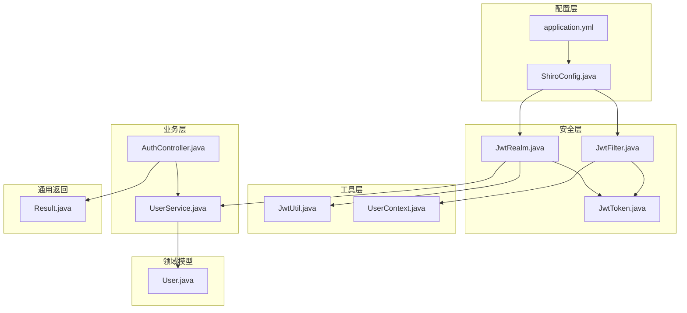
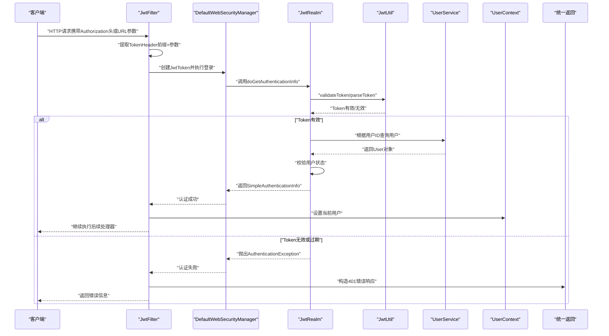
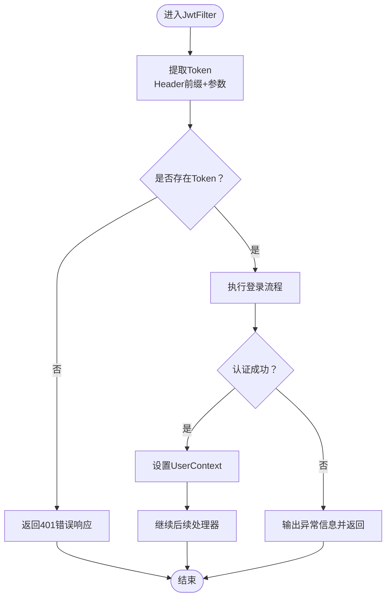
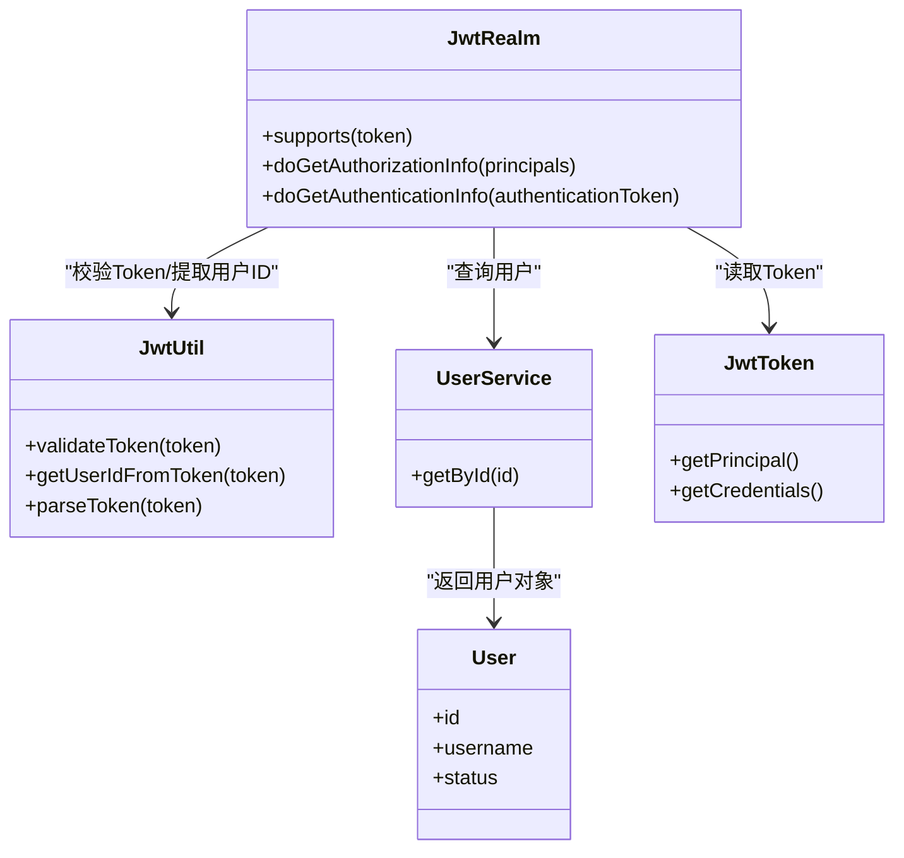
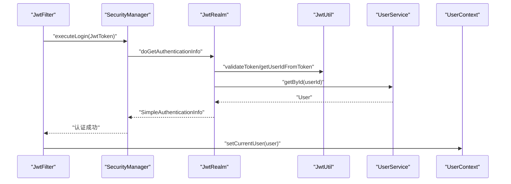
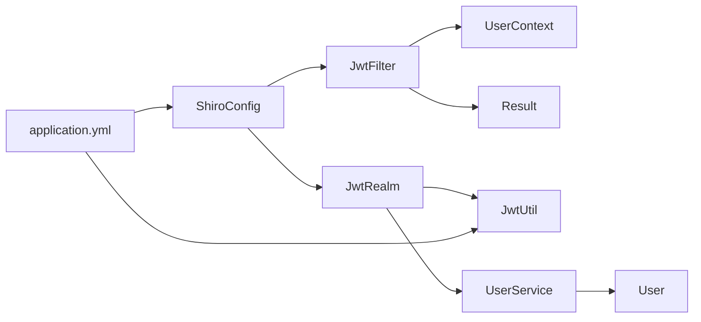

# JwtFilter与JwtRealm

<cite>
**本文引用的文件**
- [JwtFilter.java](file://src/main/java/com/zhishilu/shiro/JwtFilter.java)
- [JwtRealm.java](file://src/main/java/com/zhishilu/shiro/JwtRealm.java)
- [JwtToken.java](file://src/main/java/com/zhishilu/shiro/JwtToken.java)
- [JwtUtil.java](file://src/main/java/com/zhishilu/util/JwtUtil.java)
- [ShiroConfig.java](file://src/main/java/com/zhishilu/config/ShiroConfig.java)
- [User.java](file://src/main/java/com/zhishilu/entity/User.java)
- [UserService.java](file://src/main/java/com/zhishilu/service/UserService.java)
- [application.yml](file://src/main/resources/application.yml)
- [AuthController.java](file://src/main/java/com/zhishilu/controller/AuthController.java)
- [Result.java](file://src/main/java/com/zhishilu/common/Result.java)
- [UserContext.java](file://src/main/java/com/zhishilu/util/UserContext.java)
</cite>

## 目录
1. [简介](#简介)
2. [项目结构](#项目结构)
3. [核心组件](#核心组件)
4. [架构总览](#架构总览)
5. [详细组件分析](#详细组件分析)
6. [依赖关系分析](#依赖关系分析)
7. [性能考虑](#性能考虑)
8. [故障排查指南](#故障排查指南)
9. [结论](#结论)

## 简介
本文件围绕JwtFilter与JwtRealm两个核心组件展开，系统性阐述其工作机制、数据流、异常处理以及与Shiro框架的集成方式。重点覆盖：
- JwtFilter过滤器的Token提取策略、认证流程、登录成功与失败处理
- JwtRealm认证逻辑的实现细节，包括认证信息获取、凭证匹配、授权信息加载
- 两者的协作关系与数据流转过程
- 完整的认证流程图与代码示例路径
- 过滤器配置参数说明（Header名称、Token前缀）、Realm数据源配置、认证异常处理
- 常见认证问题的诊断与解决方案（Token无效、用户不存在、权限不足）

## 项目结构
本项目采用分层架构，认证相关的关键文件分布如下：
- shiro包：过滤器与Realm实现
- util包：JWT工具类与用户上下文
- config包：Shiro配置与过滤链规则
- controller包：认证接口（登录/注册）
- service包：业务逻辑（用户服务）
- entity包：领域模型（用户）
- resources：应用配置（JWT参数、日志级别等）

图表来源
- [ShiroConfig.java](file://src/main/java/com/zhishilu/config/ShiroConfig.java#L26-L69)
- [JwtFilter.java](file://src/main/java/com/zhishilu/shiro/JwtFilter.java#L29-L109)
- [JwtRealm.java](file://src/main/java/com/zhishilu/shiro/JwtRealm.java#L21-L71)
- [JwtToken.java](file://src/main/java/com/zhishilu/shiro/JwtToken.java#L8-L26)
- [JwtUtil.java](file://src/main/java/com/zhishilu/util/JwtUtil.java#L20-L99)
- [UserService.java](file://src/main/java/com/zhishilu/service/UserService.java#L25-L128)
- [User.java](file://src/main/java/com/zhishilu/entity/User.java#L15-L68)
- [application.yml](file://src/main/resources/application.yml#L20-L32)
- [AuthController.java](file://src/main/java/com/zhishilu/controller/AuthController.java#L17-L50)
- [Result.java](file://src/main/java/com/zhishilu/common/Result.java#L8-L71)
- [UserContext.java](file://src/main/java/com/zhishilu/util/UserContext.java#L8-L33)

章节来源
- [ShiroConfig.java](file://src/main/java/com/zhishilu/config/ShiroConfig.java#L20-L72)
- [application.yml](file://src/main/resources/application.yml#L20-L32)

## 核心组件
- JwtFilter：基于Shiro的认证过滤器，负责从HTTP请求中提取Token、创建AuthenticationToken、触发认证流程，并在成功/失败时进行上下文设置与错误响应。
- JwtRealm：基于Shiro的Realm，实现认证与授权逻辑，使用JwtUtil校验Token有效性，通过UserService查询用户并检查状态。
- JwtToken：Shiro认证令牌，封装原始Token字符串作为主体与凭证。
- JwtUtil：JWT工具类，提供签发、解析、验证、提取用户信息等功能。
- ShiroConfig：Shiro配置，定义安全管理器、自定义过滤器、过滤链规则与未授权跳转地址。
- UserContext：线程本地用户上下文，便于在后续业务逻辑中获取当前用户。

章节来源
- [JwtFilter.java](file://src/main/java/com/zhishilu/shiro/JwtFilter.java#L27-L109)
- [JwtRealm.java](file://src/main/java/com/zhishilu/shiro/JwtRealm.java#L18-L71)
- [JwtToken.java](file://src/main/java/com/zhishilu/shiro/JwtToken.java#L8-L26)
- [JwtUtil.java](file://src/main/java/com/zhishilu/util/JwtUtil.java#L20-L99)
- [ShiroConfig.java](file://src/main/java/com/zhishilu/config/ShiroConfig.java#L21-L72)
- [UserContext.java](file://src/main/java/com/zhishilu/util/UserContext.java#L8-L33)

## 架构总览
下图展示了从请求进入系统到完成认证的端到端流程，涵盖过滤器、Realm、工具类与业务层的交互。

图表来源
- [JwtFilter.java](file://src/main/java/com/zhishilu/shiro/JwtFilter.java#L39-L85)
- [JwtRealm.java](file://src/main/java/com/zhishilu/shiro/JwtRealm.java#L43-L69)
- [JwtUtil.java](file://src/main/java/com/zhishilu/util/JwtUtil.java#L48-L74)
- [UserService.java](file://src/main/java/com/zhishilu/service/UserService.java#L92-L95)
- [UserContext.java](file://src/main/java/com/zhishilu/util/UserContext.java#L15-L24)
- [Result.java](file://src/main/java/com/zhishilu/common/Result.java#L43-L62)

## 详细组件分析

### JwtFilter过滤器工作机制
- Token提取策略
  - 优先从请求头中读取指定Header（默认“Authorization”），并去除前缀（默认“Bearer ”）得到Token。
  - 若Header中无Token，则尝试从URL参数“token”中获取。
- 认证流程
  - createToken：将提取到的Token封装为JwtToken。
  - isAccessAllowed：对CORS预检请求（OPTIONS）直接放行。
  - onAccessDenied：若无Token则返回401；否则触发executeLogin执行认证。
  - onLoginSuccess：认证成功后，将User对象写入UserContext，便于后续业务使用。
  - onLoginFailure：捕获认证异常，输出错误信息并返回false阻止继续处理。
- 错误响应
  - 使用统一返回体Result封装错误，状态码为401，消息来自异常信息。

图表来源
- [JwtFilter.java](file://src/main/java/com/zhishilu/shiro/JwtFilter.java#L39-L85)

章节来源
- [JwtFilter.java](file://src/main/java/com/zhishilu/shiro/JwtFilter.java#L29-L109)
- [Result.java](file://src/main/java/com/zhishilu/common/Result.java#L43-L62)

### JwtRealm认证逻辑实现
- 支持判断
  - supports方法确保仅处理JwtToken类型的认证请求。
- 授权信息加载
  - 当前版本不进行细粒度权限控制，返回空的授权信息对象。
- 认证信息获取与凭证匹配
  - 从AuthenticationToken中取出Token字符串。
  - 使用JwtUtil.validateToken校验Token有效性；无效则抛出AuthenticationException。
  - 使用JwtUtil.getUserIdFromToken获取用户ID。
  - 调用UserService.getById查询用户；查询异常或用户不存在抛出AuthenticationException。
  - 检查用户状态（status=1），非正常状态抛出AuthenticationException。
  - 返回SimpleAuthenticationInfo(user, token, realmName)，其中principal=user，credentials=token。

图表来源
- [JwtRealm.java](file://src/main/java/com/zhishilu/shiro/JwtRealm.java#L21-L71)
- [JwtUtil.java](file://src/main/java/com/zhishilu/util/JwtUtil.java#L48-L82)
- [UserService.java](file://src/main/java/com/zhishilu/service/UserService.java#L92-L95)
- [User.java](file://src/main/java/com/zhishilu/entity/User.java#L17-L54)
- [JwtToken.java](file://src/main/java/com/zhishilu/shiro/JwtToken.java#L8-L26)

章节来源
- [JwtRealm.java](file://src/main/java/com/zhishilu/shiro/JwtRealm.java#L21-L71)
- [JwtUtil.java](file://src/main/java/com/zhishilu/util/JwtUtil.java#L48-L82)
- [UserService.java](file://src/main/java/com/zhishilu/service/UserService.java#L92-L95)
- [User.java](file://src/main/java/com/zhishilu/entity/User.java#L17-L54)

### 两组件协作关系与数据流转
- 过滤器到Realm
  - JwtFilter在onAccessDenied中创建JwtToken并触发executeLogin，由Shiro安全管理器委派给JwtRealm。
- Realm到工具与服务
  - JwtRealm依赖JwtUtil进行Token校验与用户ID提取；依赖UserService查询用户并校验状态。
- 成功后的上下文注入
  - JwtFilter在onLoginSuccess中将User写入UserContext，供后续业务逻辑使用。

图表来源
- [JwtFilter.java](file://src/main/java/com/zhishilu/shiro/JwtFilter.java#L69-L75)
- [JwtRealm.java](file://src/main/java/com/zhishilu/shiro/JwtRealm.java#L43-L69)
- [JwtUtil.java](file://src/main/java/com/zhishilu/util/JwtUtil.java#L67-L82)
- [UserService.java](file://src/main/java/com/zhishilu/service/UserService.java#L92-L95)
- [UserContext.java](file://src/main/java/com/zhishilu/util/UserContext.java#L15-L24)

## 依赖关系分析
- 配置层
  - ShiroConfig定义了安全管理器、自定义过滤器映射与过滤链规则；同时关闭Shiro自带Session以启用无状态认证。
  - application.yml提供JWT密钥、过期时间、Header名称与前缀等关键参数。
- 安全层
  - JwtFilter依赖UserContext进行用户上下文设置；依赖Result进行统一错误响应。
  - JwtRealm依赖JwtUtil与UserService完成认证与授权。
- 工具层
  - JwtUtil提供Token生成、解析、验证与用户信息提取能力。
- 业务层
  - UserService负责用户注册、登录、查询用户等业务逻辑，并在登录时生成JWT。

图表来源
- [ShiroConfig.java](file://src/main/java/com/zhishilu/config/ShiroConfig.java#L26-L69)
- [JwtFilter.java](file://src/main/java/com/zhishilu/shiro/JwtFilter.java#L70-L85)
- [JwtRealm.java](file://src/main/java/com/zhishilu/shiro/JwtRealm.java#L23-L24)
- [JwtUtil.java](file://src/main/java/com/zhishilu/util/JwtUtil.java#L22-L26)
- [UserService.java](file://src/main/java/com/zhishilu/service/UserService.java#L27-L28)
- [User.java](file://src/main/java/com/zhishilu/entity/User.java#L17-L54)
- [application.yml](file://src/main/resources/application.yml#L26-L31)

章节来源
- [ShiroConfig.java](file://src/main/java/com/zhishilu/config/ShiroConfig.java#L21-L72)
- [application.yml](file://src/main/resources/application.yml#L26-L31)

## 性能考虑
- 无状态设计
  - 关闭Shiro Session，避免服务器端会话存储，降低内存占用与扩展复杂度。
- Token校验
  - JwtUtil.validateToken仅进行签名与过期校验，避免额外数据库查询；用户信息校验在Realm中按需查询。
- 缓存建议
  - 可在UserService层引入缓存（如Redis）以减少频繁查询用户信息带来的数据库压力。
- Header与参数兼容
  - 同时支持Header与URL参数，提升客户端适配灵活性，但建议统一使用Header以减少参数污染风险。

## 故障排查指南
- Token无效或已过期
  - 现象：JwtRealm抛出AuthenticationException，JwtFilter返回401。
  - 排查要点：确认JWT密钥一致、过期时间合理、客户端未篡改Token。
  - 参考路径：[JwtRealm.doGetAuthenticationInfo](file://src/main/java/com/zhishilu/shiro/JwtRealm.java#L48-L50)、[JwtUtil.validateToken](file://src/main/java/com/zhishilu/util/JwtUtil.java#L67-L74)
- 用户不存在
  - 现象：UserService.getById抛出业务异常，JwtRealm捕获并转换为认证异常。
  - 排查要点：确认Token中的用户ID与数据库一致；检查用户删除或ID变更。
  - 参考路径：[UserService.getById](file://src/main/java/com/zhishilu/service/UserService.java#L92-L95)、[JwtRealm.doGetAuthenticationInfo](file://src/main/java/com/zhishilu/shiro/JwtRealm.java#L58-L61)
- 账号被禁用
  - 现象：用户状态非1，JwtRealm抛出认证异常。
  - 排查要点：检查User.status字段值；确认业务逻辑正确更新状态。
  - 参考路径：[User.java](file://src/main/java/com/zhishilu/entity/User.java#L52-L54)、[JwtRealm.doGetAuthenticationInfo](file://src/main/java/com/zhishilu/shiro/JwtRealm.java#L64-L66)
- 未登录访问受保护资源
  - 现象：JwtFilter检测不到Token，返回401。
  - 排查要点：确认客户端正确携带Authorization头或URL参数；检查Shiro过滤链规则。
  - 参考路径：[JwtFilter.getToken](file://src/main/java/com/zhishilu/shiro/JwtFilter.java#L90-L97)、[ShiroConfig.shiroFilterFactoryBean](file://src/main/java/com/zhishilu/config/ShiroConfig.java#L56-L64)
- CORS预检请求被拦截
  - 现象：OPTIONS请求被拒绝。
  - 排查要点：确认isAccessAllowed对OPTIONS放行。
  - 参考路径：[JwtFilter.isAccessAllowed](file://src/main/java/com/zhishilu/shiro/JwtFilter.java#L49-L54)

章节来源
- [JwtRealm.java](file://src/main/java/com/zhishilu/shiro/JwtRealm.java#L48-L66)
- [JwtUtil.java](file://src/main/java/com/zhishilu/util/JwtUtil.java#L67-L74)
- [UserService.java](file://src/main/java/com/zhishilu/service/UserService.java#L92-L95)
- [User.java](file://src/main/java/com/zhishilu/entity/User.java#L52-L54)
- [JwtFilter.java](file://src/main/java/com/zhishilu/shiro/JwtFilter.java#L49-L97)
- [ShiroConfig.java](file://src/main/java/com/zhishilu/config/ShiroConfig.java#L56-L64)

## 结论
JwtFilter与JwtRealm共同实现了基于JWT的无状态认证体系：JwtFilter负责请求接入与认证触发，JwtRealm负责Token校验与用户状态检查。二者通过Shiro配置与过滤链规则紧密协作，结合JwtUtil与UserService形成清晰的数据流。该方案具备良好的可扩展性与可维护性，适合高并发场景下的认证需求。建议在生产环境中配合缓存、限流与监控策略进一步优化性能与稳定性。