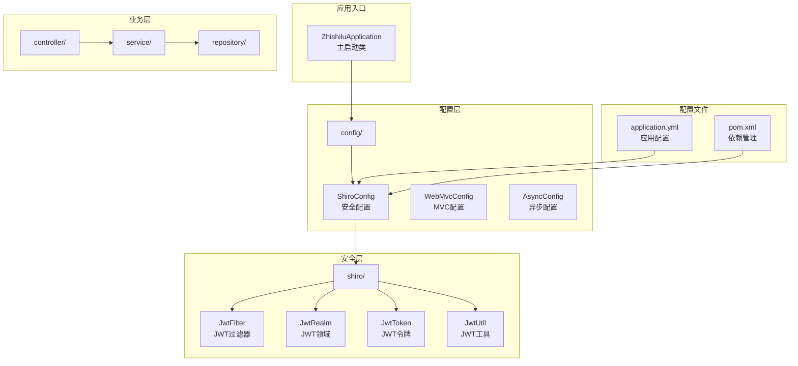
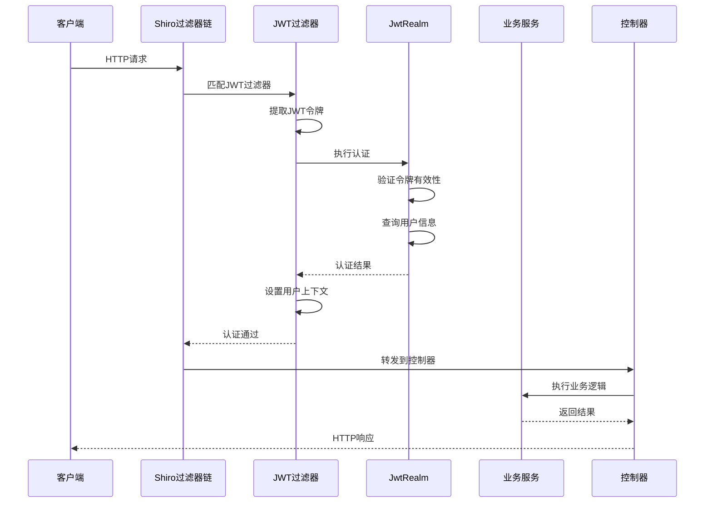
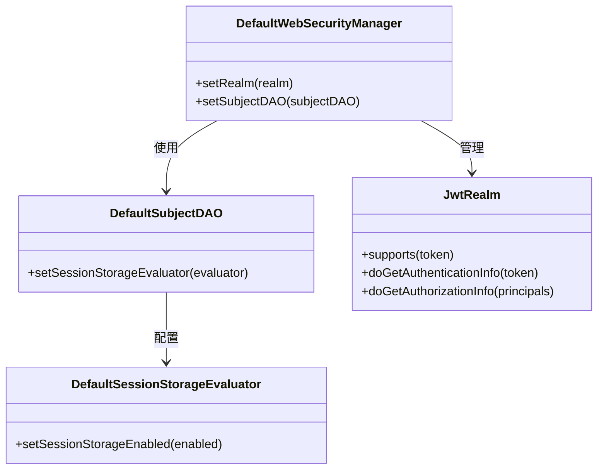
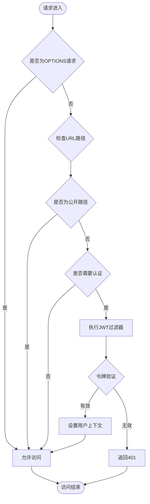
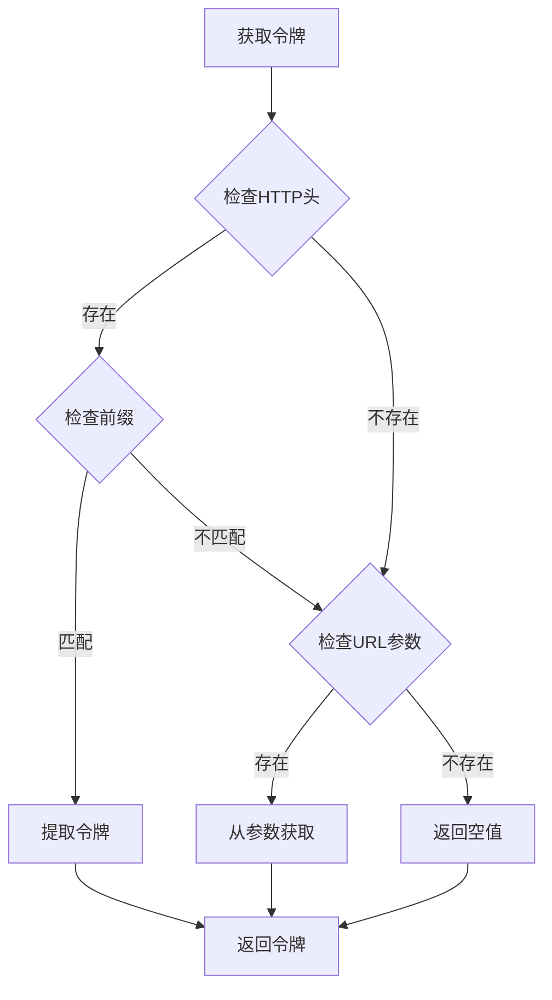
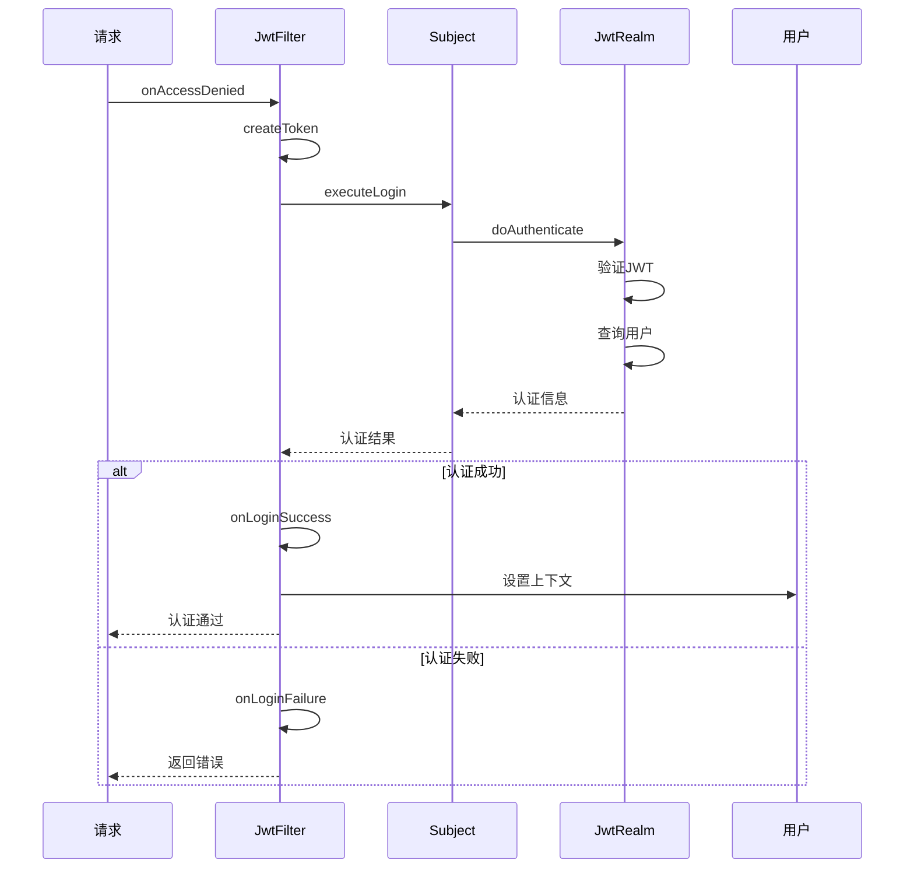
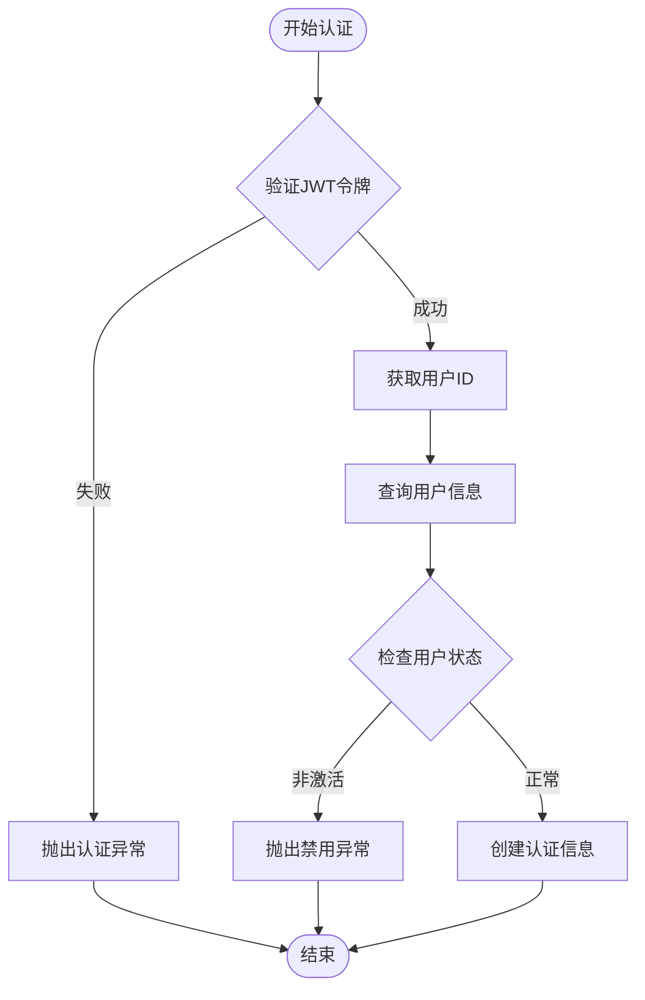
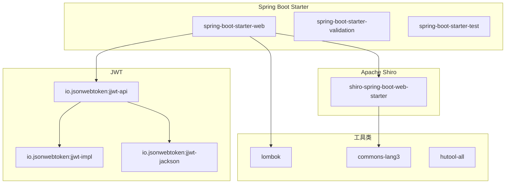
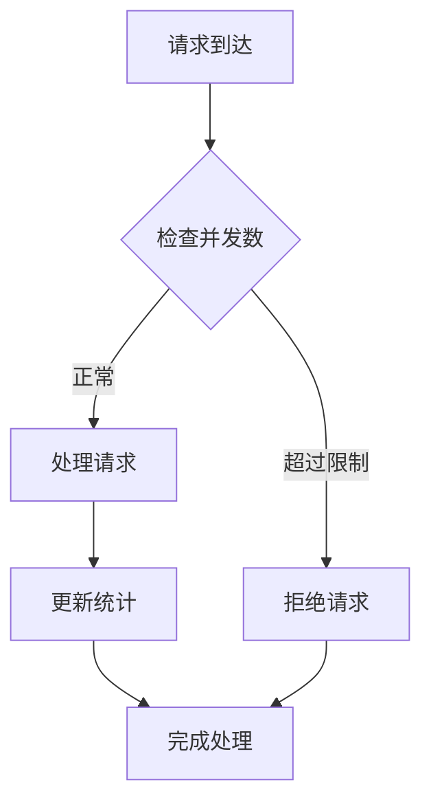
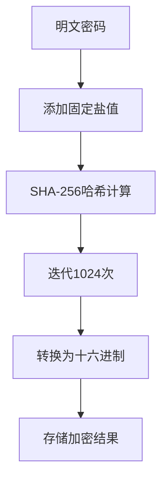

# Shiro安全配置

<cite>
**本文档引用的文件**
- [ShiroConfig.java](file://src/main/java/com/zhishilu/config/ShiroConfig.java)
- [JwtFilter.java](file://src/main/java/com/zhishilu/shiro/JwtFilter.java)
- [JwtRealm.java](file://src/main/java/com/zhishilu/shiro/JwtRealm.java)
- [JwtToken.java](file://src/main/java/com/zhishilu/shiro/JwtToken.java)
- [JwtUtil.java](file://src/main/java/com/zhishilu/util/JwtUtil.java)
- [UserService.java](file://src/main/java/com/zhishilu/service/UserService.java)
- [AuthController.java](file://src/main/java/com/zhishilu/controller/AuthController.java)
- [application.yml](file://src/main/resources/application.yml)
- [pom.xml](file://pom.xml)
- [Result.java](file://src/main/java/com/zhishilu/common/Result.java)
- [ZhishiluApplication.java](file://src/main/java/com/zhishilu/ZhishiluApplication.java)
</cite>

## 目录
1. [引言](#引言)
2. [项目结构](#项目结构)
3. [核心组件](#核心组件)
4. [架构概览](#架构概览)
5. [详细组件分析](#详细组件分析)
6. [依赖关系分析](#依赖关系分析)
7. [性能考虑](#性能考虑)
8. [故障排除指南](#故障排除指南)
9. [结论](#结论)
10. [附录](#附录)

## 引言

本项目基于Spring Boot 3.2.1和Apache Shiro 1.13.0构建，采用JWT（JSON Web Token）进行无状态认证。系统实现了完整的用户认证和授权机制，支持RESTful API的安全访问控制。

该项目的核心目标是提供一个安全、可扩展的知识管理系统，通过Shiro框架实现统一的安全控制，结合JWT实现无状态认证，避免传统Session带来的扩展性问题。

## 项目结构

项目采用标准的Spring Boot目录结构，安全相关的配置集中在以下关键位置：



**图表来源**
- [ZhishiluApplication.java](file://src/main/java/com/zhishilu/ZhishiluApplication.java#L1-L16)
- [ShiroConfig.java](file://src/main/java/com/zhishilu/config/ShiroConfig.java#L1-L72)
- [application.yml](file://src/main/resources/application.yml#L1-L47)

**章节来源**
- [pom.xml](file://pom.xml#L1-L129)
- [application.yml](file://src/main/resources/application.yml#L1-L47)

## 核心组件

### ShiroConfig配置类

ShiroConfig是整个安全框架的核心配置类，负责：

1. **安全管理器配置**：创建DefaultWebSecurityManager实例，设置JwtRealm作为认证提供者
2. **会话管理配置**：禁用Shiro自带的Session，实现完全的无状态认证
3. **过滤器链配置**：定义URL级别的访问控制规则
4. **自定义过滤器注册**：将JwtFilter注册为自定义过滤器

### JwtFilter过滤器

JwtFilter继承自AuthenticatingFilter，实现了JWT令牌的提取、验证和用户上下文设置：

- **令牌提取**：支持HTTP头Authorization和URL参数两种方式
- **认证流程**：验证JWT令牌有效性，执行Shiro认证
- **异常处理**：统一处理认证失败的情况
- **用户上下文**：认证成功后将用户信息存入ThreadLocal

### JwtRealm领域

JwtRealm继承自AuthorizingRealm，负责JWT令牌的认证逻辑：

- **令牌支持检测**：识别JwtToken类型的认证请求
- **用户信息获取**：从JWT中解析用户ID，查询用户完整信息
- **状态验证**：检查用户账户状态是否正常
- **认证信息返回**：构建SimpleAuthenticationInfo供Shiro使用

**章节来源**
- [ShiroConfig.java](file://src/main/java/com/zhishilu/config/ShiroConfig.java#L17-L72)
- [JwtFilter.java](file://src/main/java/com/zhishilu/shiro/JwtFilter.java#L24-L109)
- [JwtRealm.java](file://src/main/java/com/zhishilu/shiro/JwtRealm.java#L15-L71)

## 架构概览

系统采用分层架构设计，安全控制贯穿整个应用：



**图表来源**
- [ShiroConfig.java](file://src/main/java/com/zhishilu/config/ShiroConfig.java#L44-L70)
- [JwtFilter.java](file://src/main/java/com/zhishilu/shiro/JwtFilter.java#L39-L85)
- [JwtRealm.java](file://src/main/java/com/zhishilu/shiro/JwtRealm.java#L43-L69)

## 详细组件分析

### ShiroConfig配置详解

#### 安全管理器配置



**图表来源**
- [ShiroConfig.java](file://src/main/java/com/zhishilu/config/ShiroConfig.java#L26-L39)
- [JwtRealm.java](file://src/main/java/com/zhishilu/shiro/JwtRealm.java#L21-L29)

配置要点：
- **禁用Session**：通过DefaultSessionStorageEvaluator禁用Shiro自带Session
- **Realm注入**：将JwtRealm注入到安全管理器中
- **SubjectDAO配置**：自定义SubjectDAO以支持无状态认证

#### 过滤器链配置

过滤器链采用LinkedHashMap保证有序性，定义了清晰的访问控制规则：



**图表来源**
- [ShiroConfig.java](file://src/main/java/com/zhishilu/config/ShiroConfig.java#L55-L67)
- [JwtFilter.java](file://src/main/java/com/zhishilu/shiro/JwtFilter.java#L48-L55)

**章节来源**
- [ShiroConfig.java](file://src/main/java/com/zhishilu/config/ShiroConfig.java#L23-L70)

### JwtFilter组件深入分析

#### 令牌提取机制

JwtFilter实现了灵活的令牌提取策略：



**图表来源**
- [JwtFilter.java](file://src/main/java/com/zhishilu/shiro/JwtFilter.java#L87-L97)

#### 认证流程处理

认证流程遵循Shiro的标准回调机制：



**图表来源**
- [JwtFilter.java](file://src/main/java/com/zhishilu/shiro/JwtFilter.java#L57-L85)
- [JwtRealm.java](file://src/main/java/com/zhishilu/shiro/JwtRealm.java#L43-L69)

**章节来源**
- [JwtFilter.java](file://src/main/java/com/zhishilu/shiro/JwtFilter.java#L24-L109)

### JwtRealm认证逻辑

#### 用户状态验证

JwtRealm实现了严格的用户状态检查：



**图表来源**
- [JwtRealm.java](file://src/main/java/com/zhishilu/shiro/JwtRealm.java#L43-L69)

**章节来源**
- [JwtRealm.java](file://src/main/java/com/zhishilu/shiro/JwtRealm.java#L15-L71)

### JwtUtil工具类

#### JWT配置参数

JwtUtil提供了完整的JWT操作能力：

| 参数 | 默认值 | 说明 |
|------|--------|------|
| jwt.secret | zhishilu-secret-key-must-be-at-least-256-bits-long-for-hs256 | JWT签名密钥 |
| jwt.expiration | 86400000 | 令牌过期时间（毫秒） |
| jwt.header | Authorization | HTTP头部名称 |
| jwt.prefix | Bearer | 令牌前缀 |

**章节来源**
- [JwtUtil.java](file://src/main/java/com/zhishilu/util/JwtUtil.java#L15-L99)
- [application.yml](file://src/main/resources/application.yml#L26-L32)

## 依赖关系分析

### Maven依赖配置

项目使用Maven管理依赖，核心安全相关依赖如下：



**图表来源**
- [pom.xml](file://pom.xml#L27-L110)

### Spring Boot集成点

系统通过以下方式与Spring Boot深度集成：

1. **自动配置**：Shiro Spring Boot Starter提供自动配置支持
2. **Bean管理**：所有安全组件通过Spring容器管理
3. **配置绑定**：application.yml中的配置自动绑定到组件属性
4. **异常处理**：统一的异常处理机制

**章节来源**
- [pom.xml](file://pom.xml#L1-L129)
- [application.yml](file://src/main/resources/application.yml#L1-L47)

## 性能考虑

### 无状态认证的优势

1. **水平扩展**：无需共享Session存储，支持多实例部署
2. **内存优化**：避免Session内存占用
3. **负载均衡**：支持无状态的负载均衡策略

### 缓存策略建议

虽然当前实现禁用了Session，但可以考虑以下缓存策略：

1. **用户信息缓存**：缓存用户基本信息减少数据库查询
2. **权限信息缓存**：缓存用户权限信息提高授权效率
3. **令牌黑名单缓存**：缓存已失效令牌防止重放攻击

### 并发控制



### 密码加密最佳实践

项目使用SHA-256哈希算法配合固定盐值进行密码加密：



**章节来源**
- [UserService.java](file://src/main/java/com/zhishilu/service/UserService.java#L108-L110)

## 故障排除指南

### 常见配置问题

#### 1. CORS跨域问题

**问题描述**：前端请求出现跨域错误
**解决方案**：JwtFilter已内置OPTIONS请求放行逻辑

#### 2. 令牌格式错误

**问题描述**：认证失败，提示Token无效
**排查步骤**：
1. 检查Authorization头格式是否正确
2. 验证JWT签名密钥配置
3. 确认令牌未过期

#### 3. 用户状态异常

**问题描述**：用户被禁用但仍能登录
**排查步骤**：
1. 检查用户表status字段
2. 验证JwtRealm中的状态检查逻辑

### 性能优化建议

#### 1. 缓存优化

```yaml
# application.yml中的缓存配置示例
cache:
  type: redis
  host: localhost
  port: 6379
  timeout: 2000
```

#### 2. 连接池配置

```yaml
# 数据库连接池配置
spring:
  datasource:
    hikari:
      maximum-pool-size: 20
      minimum-idle: 5
      connection-timeout: 30000
```

#### 3. 日志级别调整

```yaml
# 生产环境日志配置
logging:
  level:
    com.zhishilu: WARN
    org.apache.shiro: WARN
    org.springframework.web: WARN
```

**章节来源**
- [JwtFilter.java](file://src/main/java/com/zhishilu/shiro/JwtFilter.java#L48-L55)
- [JwtRealm.java](file://src/main/java/com/zhishilu/shiro/JwtRealm.java#L63-L66)

## 结论

本项目成功实现了基于Apache Shiro和JWT的无状态安全认证系统。通过精心设计的配置架构，系统具备了以下特点：

1. **安全性**：采用JWT无状态认证，避免Session安全风险
2. **可扩展性**：支持水平扩展和微服务部署
3. **易维护性**：模块化设计，职责分离清晰
4. **性能**：无Session开销，适合高并发场景

建议在生产环境中进一步完善：
- 添加Redis缓存支持
- 实现更细粒度的权限控制
- 增加审计日志功能
- 配置HTTPS和安全头

## 附录

### 配置参数参考

#### 应用配置参数

| 参数名 | 默认值 | 说明 |
|--------|--------|------|
| server.port | 8080 | 服务器端口 |
| server.servlet.context-path | /api | 应用上下文路径 |
| shiro.loginUrl | /auth/login | 登录页面URL |
| shiro.successUrl | / | 登录成功跳转URL |
| shiro.unauthorizedUrl | /auth/unauthorized | 未授权跳转URL |

#### JWT配置参数

| 参数名 | 默认值 | 说明 |
|--------|--------|------|
| jwt.secret | zhishilu-secret-key-must-be-at-least-256-bits-long-for-hs256 | JWT签名密钥 |
| jwt.expiration | 86400000 | 令牌过期时间（毫秒） |
| jwt.header | Authorization | HTTP头部名称 |
| jwt.prefix | Bearer | 令牌前缀 |

### API接口参考

#### 认证接口

| 方法 | 路径 | 功能 | 需要认证 |
|------|------|------|----------|
| POST | /api/auth/register | 用户注册 | 否 |
| POST | /api/auth/login | 用户登录 | 否 |
| GET | /api/auth/unauthorized | 未授权提示 | 否 |

#### 内容管理接口

| 方法 | 路径 | 功能 | 需要认证 |
|------|------|------|----------|
| POST | /api/article | 创建文章 | 是 |
| PUT | /api/article/{id} | 更新文章 | 是 |
| DELETE | /api/article/{id} | 删除文章 | 是 |
| GET | /api/article/{id} | 获取文章详情 | 是 |
| GET | /api/article/list | 分页查询文章 | 是 |
| GET | /api/article/categories/top | 获取常用类别 | 是 |

**章节来源**
- [application.yml](file://src/main/resources/application.yml#L1-L47)
- [AuthController.java](file://src/main/java/com/zhishilu/controller/AuthController.java#L14-L50)