# Shiro安全配置

<cite>
**本文档引用的文件**
- [ShiroConfig.java](file://src/main/java/com/zhishilu/config/ShiroConfig.java)
- [JwtFilter.java](file://src/main/java/com/zhishilu/shiro/JwtFilter.java)
- [JwtRealm.java](file://src/main/java/com/zhishilu/shiro/JwtRealm.java)
- [JwtToken.java](file://src/main/java/com/zhishilu/shiro/JwtToken.java)
- [JwtUtil.java](file://src/main/java/com/zhishilu/util/JwtUtil.java)
- [UserService.java](file://src/main/java/com/zhishilu/service/UserService.java)
- [AuthController.java](file://src/main/java/com/zhishilu/controller/AuthController.java)
- [application.yml](file://src/main/resources/application.yml)
- [pom.xml](file://pom.xml)
- [Result.java](file://src/main/java/com/zhishilu/common/Result.java)
- [ZhishiluApplication.java](file://src/main/java/com/zhishilu/ZhishiluApplication.java)
- [RedisTokenService.java](file://src/main/java/com/zhishilu/service/RedisTokenService.java)
- [UserContext.java](file://src/main/java/com/zhishilu/util/UserContext.java)
</cite>

## 更新摘要
**变更内容**
- 完全重构Shiro安全配置，实现无状态认证架构
- 禁用Shiro内置Session管理，改为Redis令牌管理
- 手动配置JWT过滤器，确保@Value注解生效
- 明确区分公开和受保护端点的URL映射规则
- 新增RedisTokenService令牌验证和刷新机制
- 优化过滤器链配置，支持精确的URL匹配

## 目录
1. [引言](#引言)
2. [项目结构](#项目结构)
3. [核心组件](#核心组件)
4. [架构概览](#架构概览)
5. [详细组件分析](#详细组件分析)
6. [依赖关系分析](#依赖关系分析)
7. [性能考虑](#性能考虑)
8. [故障排除指南](#故障排除指南)
9. [结论](#结论)
10. [附录](#附录)

## 引言

本项目基于Spring Boot 2.7.18和Apache Shiro 2.0.4构建，采用JWT（JSON Web Token）进行无状态认证。系统实现了完整的用户认证和授权机制，支持RESTful API的安全访问控制。

该项目的核心目标是提供一个安全、可扩展的知识管理系统，通过重构的Shiro框架实现统一的安全控制，结合JWT实现无状态认证，避免传统Session带来的扩展性问题。新的架构通过Redis实现令牌管理，提供更好的性能和可扩展性。

## 项目结构

项目采用标准的Spring Boot目录结构，安全相关的配置集中在以下关键位置：

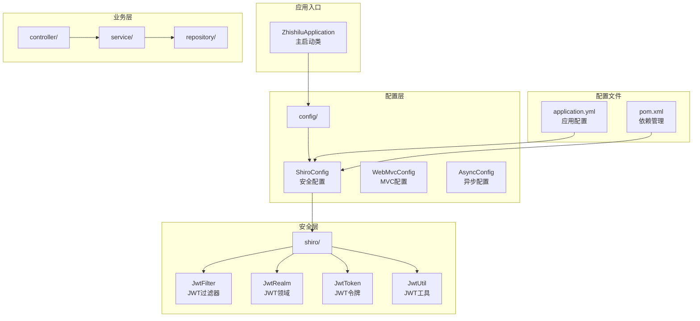
```mermaid
graph TB
subgraph "应用入口"
App[ZhishiluApplication<br/>主启动类]
end
subgraph "配置层"
Config[config/]
ShiroCfg[ShiroConfig<br/>安全配置]
WebMvc[WebMvcConfig<br/>MVC配置]
AsyncCfg[AsyncConfig<br/>异步配置]
end
subgraph "安全层"
Shiro[shiro/]
JwtFilter[JwtFilter<br/>JWT过滤器]
JwtRealm[JwtRealm<br/>JWT领域]
JwtToken[JwtToken<br/>JWT令牌]
JwtUtil[JwtUtil<br/>JWT工具]
end
subgraph "业务层"
Controller[controller/]
Service[service/]
Repository[repository/]
end
subgraph "配置文件"
Yml[application.yml<br/>应用配置]
POM[pom.xml<br/>依赖管理]
end
App --> Config
Config --> ShiroCfg
ShiroCfg --> Shiro
Shiro --> JwtFilter
Shiro --> JwtRealm
Shiro --> JwtToken
Shiro --> JwtUtil
Controller --> Service
Service --> Repository
Yml --> ShiroCfg
POM --> ShiroCfg
```

**图表来源**
- [ZhishiluApplication.java](file://src/main/java/com/zhishilu/ZhishiluApplication.java#L1-L16)
- [ShiroConfig.java](file://src/main/java/com/zhishilu/config/ShiroConfig.java#L1-L106)
- [application.yml](file://src/main/resources/application.yml#L1-L53)

**章节来源**
- [pom.xml](file://pom.xml#L1-L157)
- [application.yml](file://src/main/resources/application.yml#L1-L53)

## 核心组件

### ShiroConfig配置类

**更新** ShiroConfig经过完全重构，现在专注于无状态认证配置：

ShiroConfig是整个安全框架的核心配置类，负责：

1. **安全管理器配置**：创建DefaultWebSecurityManager实例，设置JwtRealm作为认证提供者
2. **会话管理配置**：禁用Shiro自带的Session，实现完全的无状态认证
3. **手动过滤器注册**：通过@Bean方法手动注册JwtFilter，确保@Value注解生效
4. **过滤器链配置**：定义明确的URL级别的访问控制规则，区分公开和受保护端点

### JwtFilter过滤器

**更新** JwtFilter现在采用手动配置模式：

JwtFilter继承自AuthenticatingFilter，实现了JWT令牌的提取、验证和用户上下文设置：

- **令牌提取**：支持HTTP头Authorization和URL参数两种方式
- **认证流程**：验证JWT令牌有效性，执行Shiro认证
- **异常处理**：统一处理认证失败的情况
- **用户上下文**：认证成功后将用户信息存入ThreadLocal
- **OPTIONS请求处理**：自动放行CORS预检请求

### JwtRealm领域

**更新** JwtRealm现在集成了Redis令牌验证：

JwtRealm继承自AuthorizingRealm，负责JWT令牌的认证逻辑：

- **令牌支持检测**：识别JwtToken类型的认证请求
- **Redis令牌验证**：从Redis验证令牌有效性并刷新过期时间
- **用户信息获取**：从JWT中解析用户ID，查询用户完整信息
- **状态验证**：检查用户账户状态是否正常
- **认证信息返回**：构建SimpleAuthenticationInfo供Shiro使用

**章节来源**
- [ShiroConfig.java](file://src/main/java/com/zhishilu/config/ShiroConfig.java#L23-L106)
- [JwtFilter.java](file://src/main/java/com/zhishilu/shiro/JwtFilter.java#L26-L107)
- [JwtRealm.java](file://src/main/java/com/zhishilu/shiro/JwtRealm.java#L20-L78)

## 架构概览

**更新** 新架构采用无状态认证模式：

系统采用分层架构设计，安全控制贯穿整个应用，现在实现完全的无状态认证：

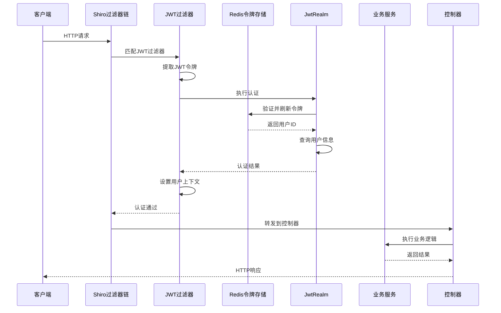
```mermaid
sequenceDiagram
participant Client as 客户端
participant Filter as Shiro过滤器链
participant JwtFilter as JWT过滤器
participant Redis as Redis令牌存储
participant Realm as JwtRealm
participant Service as 业务服务
participant Controller as 控制器
Client->>Filter : HTTP请求
Filter->>JwtFilter : 匹配JWT过滤器
JwtFilter->>JwtFilter : 提取JWT令牌
JwtFilter->>Realm : 执行认证
Realm->>Redis : 验证并刷新令牌
Redis-->>Realm : 返回用户ID
Realm->>Realm : 查询用户信息
Realm-->>JwtFilter : 认证结果
JwtFilter->>JwtFilter : 设置用户上下文
JwtFilter-->>Filter : 认证通过
Filter->>Controller : 转发到控制器
Controller->>Service : 执行业务逻辑
Service-->>Controller : 返回结果
Controller-->>Client : HTTP响应
```

**图表来源**
- [ShiroConfig.java](file://src/main/java/com/zhishilu/config/ShiroConfig.java#L65-L104)
- [JwtFilter.java](file://src/main/java/com/zhishilu/shiro/JwtFilter.java#L37-L83)
- [JwtRealm.java](file://src/main/java/com/zhishilu/shiro/JwtRealm.java#L46-L76)

## 详细组件分析

### ShiroConfig配置详解

**更新** 完全重构的配置架构：

#### 安全管理器配置

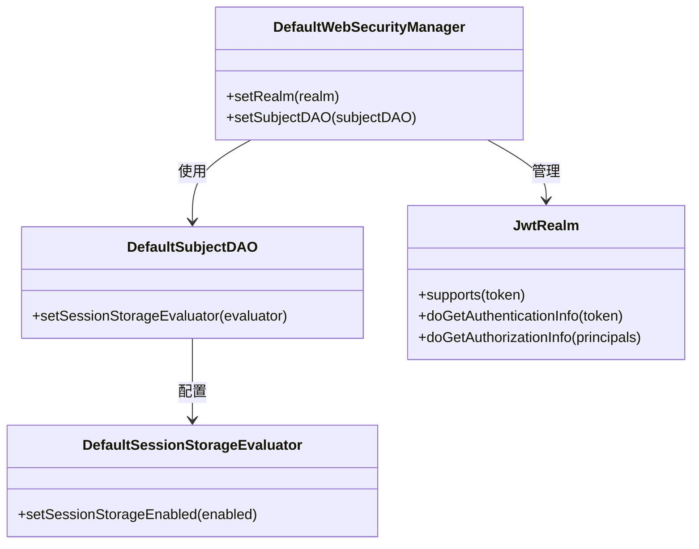
```mermaid
classDiagram
class DefaultWebSecurityManager {
+setRealm(realm)
+setSubjectDAO(subjectDAO)
}
class DefaultSubjectDAO {
+setSessionStorageEvaluator(evaluator)
}
class DefaultSessionStorageEvaluator {
+setSessionStorageEnabled(enabled)
}
class JwtRealm {
+supports(token)
+doGetAuthenticationInfo(token)
+doGetAuthorizationInfo(principals)
}
DefaultWebSecurityManager --> DefaultSubjectDAO : 使用
DefaultSubjectDAO --> DefaultSessionStorageEvaluator : 配置
DefaultWebSecurityManager --> JwtRealm : 管理
```

**图表来源**
- [ShiroConfig.java](file://src/main/java/com/zhishilu/config/ShiroConfig.java#L27-L40)
- [JwtRealm.java](file://src/main/java/com/zhishilu/shiro/JwtRealm.java#L29-L32)

配置要点：
- **禁用Session**：通过DefaultSessionStorageEvaluator禁用Shiro自带Session
- **Realm注入**：将JwtRealm注入到安全管理器中
- **SubjectDAO配置**：自定义SubjectDAO以支持无状态认证

#### 手动过滤器注册

**新增** 手动配置JWT过滤器的关键改进：

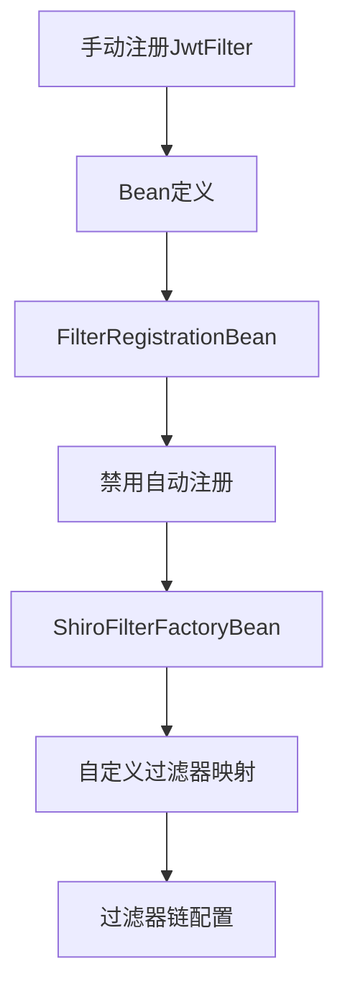
```mermaid
flowchart TD
Manual[手动注册JwtFilter] --> BeanDef[Bean定义]
BeanDef --> Registration[FilterRegistrationBean]
Registration --> Disable[禁用自动注册]
Disable --> Factory[ShiroFilterFactoryBean]
Factory --> CustomFilter[自定义过滤器映射]
CustomFilter --> FilterChain[过滤器链配置]
```

**图表来源**
- [ShiroConfig.java](file://src/main/java/com/zhishilu/config/ShiroConfig.java#L45-L59)

#### 过滤器链配置

**更新** 明确区分公开和受保护端点：

过滤器链采用LinkedHashMap保证有序性，现在定义了清晰的访问控制规则：

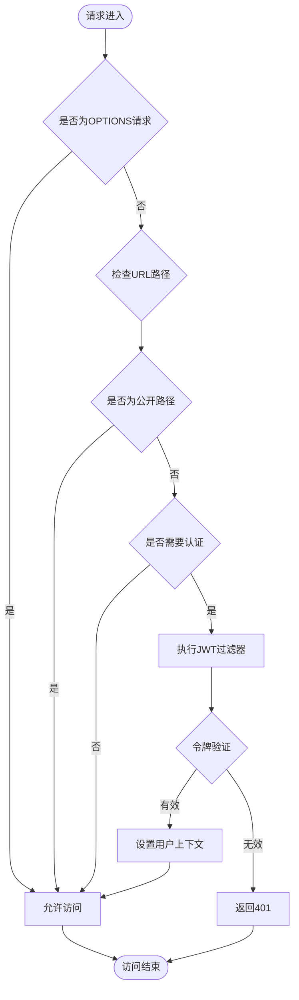
```mermaid
flowchart TD
Start([请求进入]) --> CheckOptions{是否为OPTIONS请求}
CheckOptions --> |是| Allow[允许访问]
CheckOptions --> |否| CheckPath{检查URL路径}
CheckPath --> PublicPaths{是否为公开路径}
PublicPaths --> |是| Allow
PublicPaths --> |否| CheckAuth{是否需要认证}
CheckAuth --> |是| JwtFilter[执行JWT过滤器]
CheckAuth --> |否| Allow
JwtFilter --> ValidateToken{令牌验证}
ValidateToken --> |无效| Unauthorized[返回401]
ValidateToken --> |有效| SetContext[设置用户上下文]
SetContext --> Allow
Allow --> End([访问结束])
Unauthorized --> End
```

**图表来源**
- [ShiroConfig.java](file://src/main/java/com/zhishilu/config/ShiroConfig.java#L75-L100)
- [JwtFilter.java](file://src/main/java/com/zhishilu/shiro/JwtFilter.java#L46-L65)

**章节来源**
- [ShiroConfig.java](file://src/main/java/com/zhishilu/config/ShiroConfig.java#L23-L106)

### JwtFilter组件深入分析

#### 令牌提取机制

**更新** 改进了令牌提取策略：

JwtFilter实现了灵活的令牌提取策略：

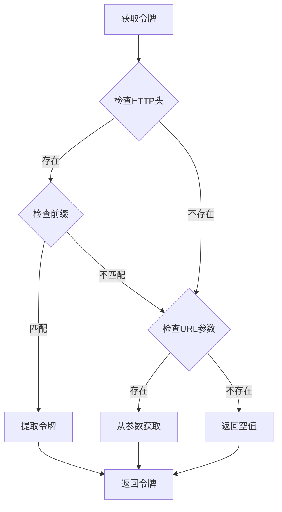
```mermaid
flowchart TD
GetToken[获取令牌] --> CheckHeader{检查HTTP头}
CheckHeader --> |存在| CheckPrefix{检查前缀}
CheckPrefix --> |匹配| ExtractToken[提取令牌]
CheckPrefix --> |不匹配| CheckParam{检查URL参数}
CheckHeader --> |不存在| CheckParam
CheckParam --> |存在| ParamToken[从参数获取]
CheckParam --> |不存在| BlankToken[返回空值]
ExtractToken --> ReturnToken[返回令牌]
ParamToken --> ReturnToken
BlankToken --> ReturnToken
```

**图表来源**
- [JwtFilter.java](file://src/main/java/com/zhishilu/shiro/JwtFilter.java#L88-L95)

#### 认证流程处理

**更新** 优化了认证回调机制：

认证流程遵循Shiro的标准回调机制，现在包含更完善的错误处理：

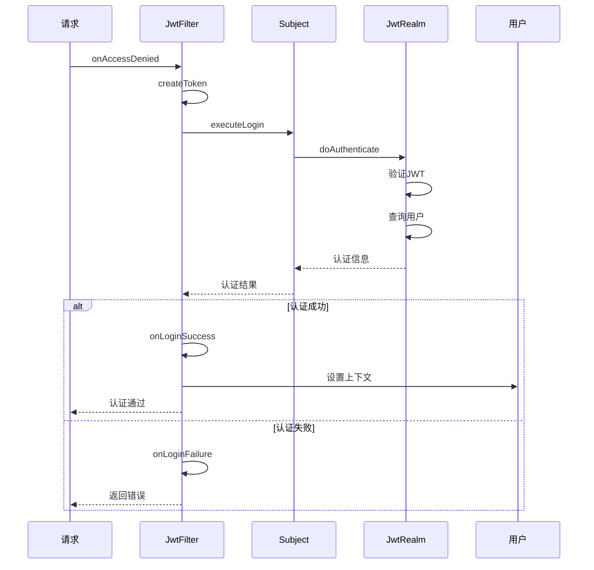
```mermaid
sequenceDiagram
participant Request as 请求
participant Filter as JwtFilter
participant Subject as Subject
participant Realm as JwtRealm
participant User as 用户
Request->>Filter : onAccessDenied
Filter->>Filter : createToken
Filter->>Subject : executeLogin
Subject->>Realm : doAuthenticate
Realm->>Realm : 验证JWT
Realm->>Realm : 查询用户
Realm-->>Subject : 认证信息
Subject-->>Filter : 认证结果
alt 认证成功
Filter->>Filter : onLoginSuccess
Filter->>User : 设置上下文
Filter-->>Request : 认证通过
else 认证失败
Filter->>Filter : onLoginFailure
Filter-->>Request : 返回错误
end
```

**图表来源**
- [JwtFilter.java](file://src/main/java/com/zhishilu/shiro/JwtFilter.java#L55-L83)
- [JwtRealm.java](file://src/main/java/com/zhishilu/shiro/JwtRealm.java#L46-L76)

**章节来源**
- [JwtFilter.java](file://src/main/java/com/zhishilu/shiro/JwtFilter.java#L26-L107)

### JwtRealm认证逻辑

**更新** 集成了Redis令牌验证：

#### Redis令牌验证流程

JwtRealm现在集成了Redis令牌验证机制：

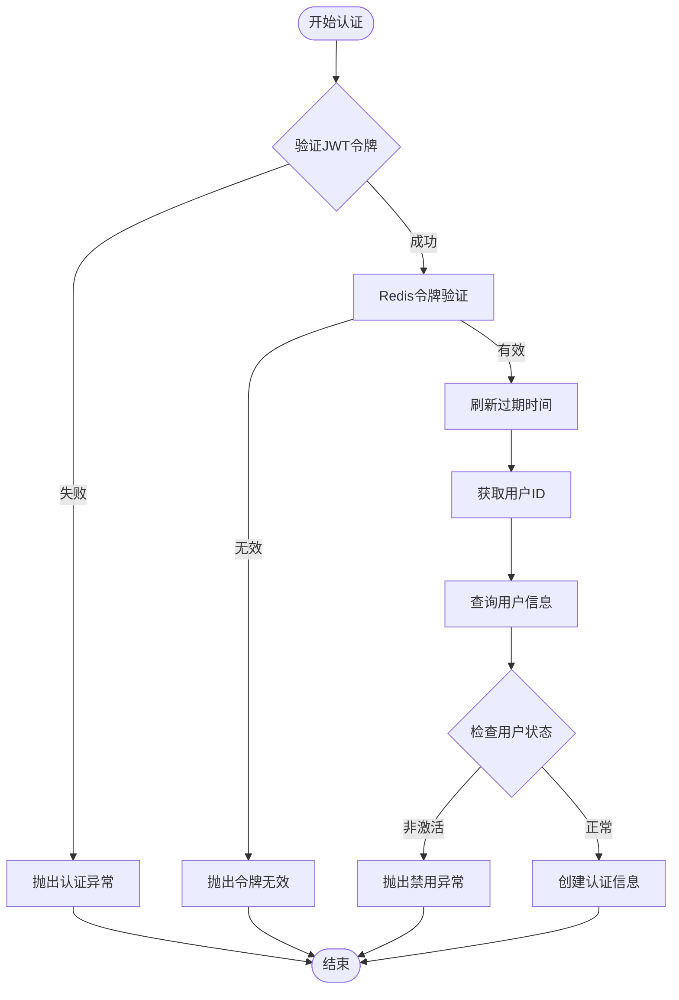
```mermaid
flowchart TD
Start([开始认证]) --> ValidateToken{验证JWT令牌}
ValidateToken --> |失败| ThrowAuth[抛出认证异常]
ValidateToken --> |成功| ValidateRedis[Redis令牌验证]
ValidateRedis --> |无效| ThrowInvalid[抛出令牌无效]
ValidateRedis --> |有效| RefreshExpire[刷新过期时间]
RefreshExpire --> GetUserId[获取用户ID]
GetUserId --> QueryUser[查询用户信息]
QueryUser --> CheckStatus{检查用户状态}
CheckStatus --> |非激活| ThrowDisabled[抛出禁用异常]
CheckStatus --> |正常| CreateAuthInfo[创建认证信息]
ThrowAuth --> End([结束])
ThrowInvalid --> End
ThrowDisabled --> End
CreateAuthInfo --> End
```

**图表来源**
- [JwtRealm.java](file://src/main/java/com/zhishilu/shiro/JwtRealm.java#L46-L76)

**章节来源**
- [JwtRealm.java](file://src/main/java/com/zhishilu/shiro/JwtRealm.java#L20-L78)

### JwtUtil工具类

#### JWT配置参数

JwtUtil提供了完整的JWT操作能力：

| 参数 | 默认值 | 说明 |
|------|--------|------|
| jwt.secret | zhishilu-secret-key-must-be-at-least-256-bits-long-for-hs256 | JWT签名密钥 |
| jwt.expiration | 604800000 | 令牌过期时间（毫秒，7天） |
| jwt.header | Authorization | HTTP头部名称 |
| jwt.prefix | Bearer | 令牌前缀 |

**章节来源**
- [JwtUtil.java](file://src/main/java/com/zhishilu/util/JwtUtil.java#L20-L99)
- [application.yml](file://src/main/resources/application.yml#L37-L43)

## 依赖关系分析

### Maven依赖配置

**更新** 升级了Shiro版本：

项目使用Maven管理依赖，核心安全相关依赖如下：

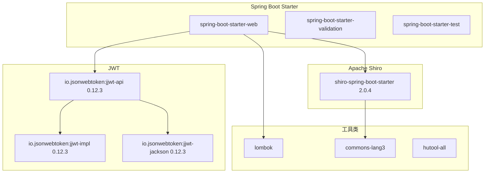
```mermaid
graph TB
subgraph "Spring Boot Starter"
SBWeb[spring-boot-starter-web]
SBValidation[spring-boot-starter-validation]
SBTest[spring-boot-starter-test]
end
subgraph "Apache Shiro"
ShiroWeb[shiro-spring-boot-starter 2.0.4]
end
subgraph "JWT"
JJWTA[io.jsonwebtoken:jjwt-api 0.12.3]
JJWTI[io.jsonwebtoken:jjwt-impl 0.12.3]
JJWTJ[io.jsonwebtoken:jjwt-jackson 0.12.3]
end
subgraph "工具类"
Lombok[lombok]
CommonsLang[commons-lang3]
Hutool[hutool-all]
end
SBWeb --> ShiroWeb
SBWeb --> JJWTA
SBWeb --> Lombok
ShiroWeb --> CommonsLang
JJWTA --> JJWTI
JJWTA --> JJWTJ
```

**图表来源**
- [pom.xml](file://pom.xml#L68-L92)

### Spring Boot集成点

**更新** 优化了集成配置：

系统通过以下方式与Spring Boot深度集成：

1. **自动配置**：Shiro Spring Boot Starter提供自动配置支持
2. **Bean管理**：所有安全组件通过Spring容器管理
3. **配置绑定**：application.yml中的配置自动绑定到组件属性
4. **异常处理**：统一的异常处理机制
5. **手动过滤器注册**：确保@Value注解正确注入

**章节来源**
- [pom.xml](file://pom.xml#L1-L157)
- [application.yml](file://src/main/resources/application.yml#L1-L53)

## 性能考虑

### 无状态认证的优势

**更新** 新架构的性能优势：

1. **水平扩展**：无需共享Session存储，支持多实例部署
2. **内存优化**：避免Session内存占用
3. **负载均衡**：支持无状态的负载均衡策略
4. **Redis缓存**：利用Redis的高性能特性

### Redis令牌管理

**新增** Redis令牌管理策略：

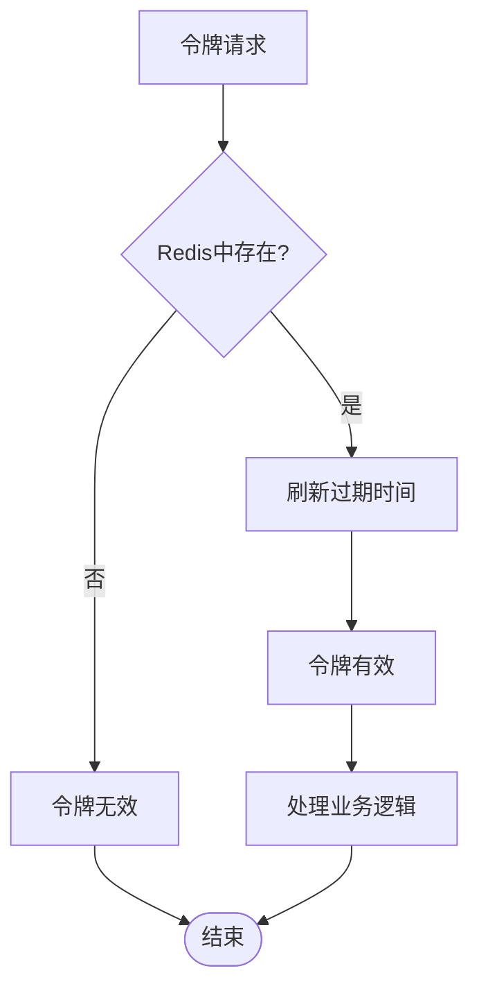
```mermaid
flowchart TD
TokenRequest[令牌请求] --> RedisCheck{Redis中存在?}
RedisCheck --> |否| Invalid[令牌无效]
RedisCheck --> |是| RefreshExpire[刷新过期时间]
RefreshExpire --> Valid[令牌有效]
Valid --> Process[处理业务逻辑]
Invalid --> End([结束])
Process --> End
```

### 缓存策略建议

虽然当前实现禁用了Session，但可以考虑以下缓存策略：

1. **用户信息缓存**：缓存用户基本信息减少数据库查询
2. **权限信息缓存**：缓存用户权限信息提高授权效率
3. **令牌黑名单缓存**：缓存已失效令牌防止重放攻击

### 并发控制

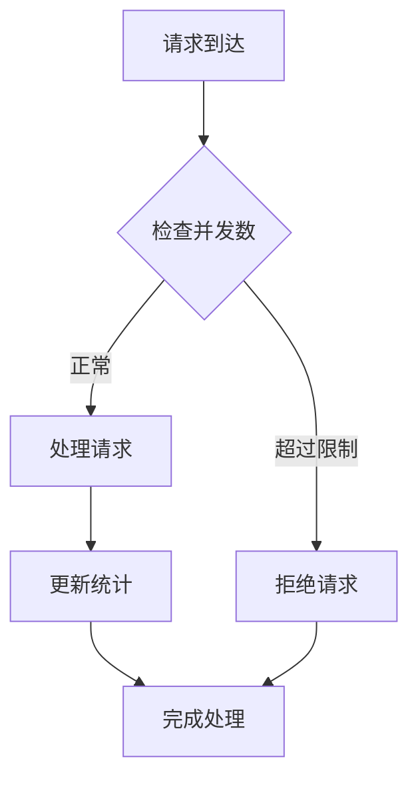
```mermaid
flowchart TD
Request[请求到达] --> CheckConcurrent{检查并发数}
CheckConcurrent --> |超过限制| Reject[拒绝请求]
CheckConcurrent --> |正常| Process[处理请求]
Process --> UpdateStats[更新统计]
UpdateStats --> Complete[完成处理]
Reject --> Complete
```

### 密码加密最佳实践

项目使用SHA-256哈希算法配合固定盐值进行密码加密：

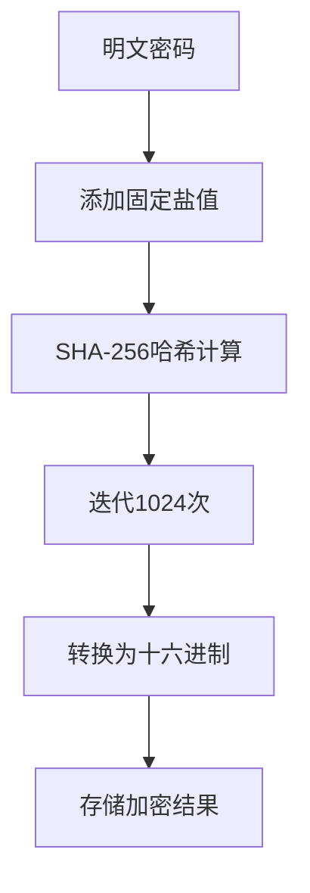
```mermaid
flowchart TD
Input[明文密码] --> AddSalt[添加固定盐值]
AddSalt --> Hash[SHA-256哈希计算]
Hash --> Iterations[迭代1024次]
Iterations --> Hex[转换为十六进制]
Hex --> Store[存储加密结果]
```

**章节来源**
- [UserService.java](file://src/main/java/com/zhishilu/service/UserService.java#L137-L139)

## 故障排除指南

### 常见配置问题

**更新** 新架构的常见问题：

#### 1. CORS跨域问题

**问题描述**：前端请求出现跨域错误
**解决方案**：JwtFilter已内置OPTIONS请求放行逻辑

#### 2. 令牌格式错误

**问题描述**：认证失败，提示Token无效
**排查步骤**：
1. 检查Authorization头格式是否正确
2. 验证JWT签名密钥配置
3. 确认令牌未过期
4. 检查Redis中令牌是否存在

#### 3. 用户状态异常

**问题描述**：用户被禁用但仍能登录
**排查步骤**：
1. 检查用户表status字段
2. 验证JwtRealm中的状态检查逻辑
3. 检查Redis中令牌是否被正确刷新

#### 4. 过滤器链配置问题

**问题描述**：某些接口无法正确访问
**排查步骤**：
1. 检查ShiroConfig中的过滤器链配置
2. 验证URL路径是否正确匹配
3. 确认公开接口和受保护接口的分类

### 性能优化建议

#### 1. Redis连接池优化

```yaml
# application.yml中的Redis配置示例
spring:
  redis:
    lettuce:
      pool:
        max-active: 20
        max-idle: 10
        min-idle: 5
        max-wait: 2000ms
```

#### 2. 缓存优化

```yaml
# application.yml中的缓存配置示例
cache:
  type: redis
  host: localhost
  port: 6379
  timeout: 2000
```

#### 3. 连接池配置

```yaml
# 数据库连接池配置
spring:
  datasource:
    hikari:
      maximum-pool-size: 20
      minimum-idle: 5
      connection-timeout: 30000
```

#### 4. 日志级别调整

```yaml
# 生产环境日志配置
logging:
  level:
    com.zhishilu: WARN
    org.apache.shiro: WARN
    org.springframework.web: WARN
```

**章节来源**
- [JwtFilter.java](file://src/main/java/com/zhishilu/shiro/JwtFilter.java#L46-L65)
- [JwtRealm.java](file://src/main/java/com/zhishilu/shiro/JwtRealm.java#L69-L72)

## 结论

**更新** 本项目成功实现了基于Apache Shiro 2.0.4和JWT的完全无状态安全认证系统。通过精心设计的重构配置架构，系统具备了以下特点：

1. **安全性**：采用JWT无状态认证，避免Session安全风险
2. **可扩展性**：支持水平扩展和微服务部署
3. **易维护性**：模块化设计，职责分离清晰
4. **性能**：无Session开销，结合Redis提供高性能令牌管理
5. **精确控制**：明确区分公开和受保护端点的访问控制

新架构相比原有版本有显著改进：
- 完全禁用Session，实现真正的无状态认证
- 手动配置JWT过滤器，确保配置正确生效
- 集成Redis令牌验证，提供更好的性能和可靠性
- 明确的URL映射规则，便于维护和扩展

建议在生产环境中进一步完善：
- 添加Redis集群支持
- 实现更细粒度的权限控制
- 增加审计日志功能
- 配置HTTPS和安全头
- 实现令牌撤销机制

## 附录

### 配置参数参考

**更新** 新架构的配置参数：

#### 应用配置参数

| 参数名 | 默认值 | 说明 |
|--------|--------|------|
| server.port | 8080 | 服务器端口 |
| server.servlet.context-path | /api | 应用上下文路径 |
| shiro.loginUrl | /auth/login | 登录页面URL |
| shiro.successUrl | / | 登录成功跳转URL |
| shiro.unauthorizedUrl | /auth/unauthorized | 未授权跳转URL |

#### JWT配置参数

| 参数名 | 默认值 | 说明 |
|--------|--------|------|
| jwt.secret | zhishilu-secret-key-must-be-at-least-256-bits-long-for-hs256 | JWT签名密钥 |
| jwt.expiration | 604800000 | 令牌过期时间（毫秒，7天） |
| jwt.header | Authorization | HTTP头部名称 |
| jwt.prefix | Bearer | 令牌前缀 |

#### Redis配置参数

| 参数名 | 默认值 | 说明 |
|--------|--------|------|
| spring.redis.host | localhost | Redis服务器地址 |
| spring.redis.port | 6379 | Redis服务器端口 |
| spring.redis.database | 0 | Redis数据库索引 |
| spring.redis.password | 空 | Redis连接密码 |

### API接口参考

**更新** 明确区分公开和受保护接口：

#### 公开接口（无需认证）

| 方法 | 路径 | 功能 |
|------|------|------|
| POST | /api/auth/register | 用户注册 |
| POST | /api/auth/login | 用户登录 |
| GET | /api/auth/unauthorized | 未授权提示 |
| GET | /api/article/list | 首页文章列表 |
| GET | /api/article/detail/{id} | 文章详情 |
| GET | /api/category/navigation | 首页导航栏 |
| GET | /api/article/search | 文章搜索 |
| GET | /api/article/suggestions | 搜索补全 |
| GET | /api/file/img/** | 图片访问 |
| GET | /api/file/avatar/** | 头像访问 |
| GET | /api/file/download/** | 文件下载 |
| GET | /api/swagger-ui/** | Swagger界面 |
| GET | /api/v3/api-docs/** | API文档 |

#### 受保护接口（需要认证）

| 方法 | 路径 | 功能 |
|------|------|------|
| POST | /api/article/create | 创建文章 |
| PUT | /api/article/update/{id} | 更新文章 |
| DELETE | /api/article/delete/{id} | 删除文章 |
| GET | /api/profile/** | 个人中心 |
| GET | /api/user/** | 用户相关操作 |
| PUT | /api/user/** | 用户信息修改 |

**章节来源**
- [application.yml](file://src/main/resources/application.yml#L1-L53)
- [AuthController.java](file://src/main/java/com/zhishilu/controller/AuthController.java#L16-L49)
- [ShiroConfig.java](file://src/main/java/com/zhishilu/config/ShiroConfig.java#L75-L100)