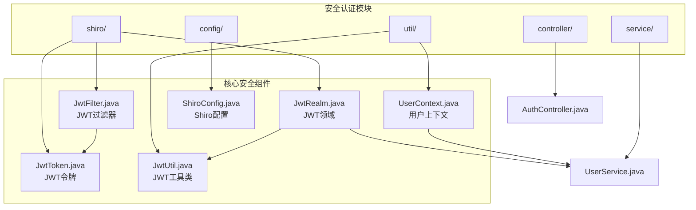
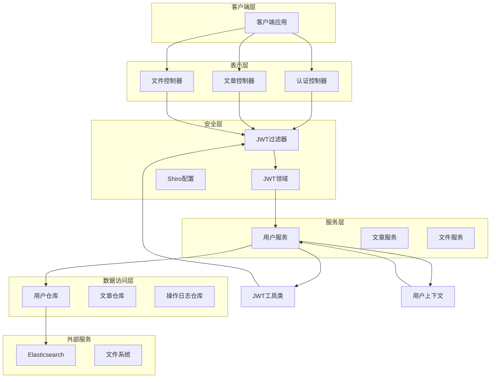
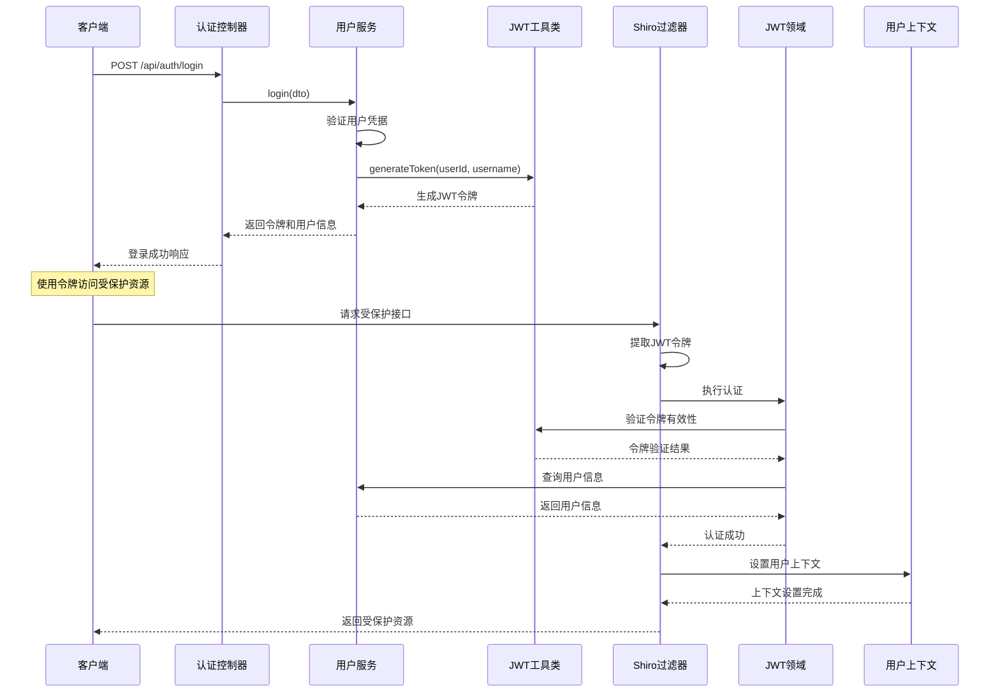
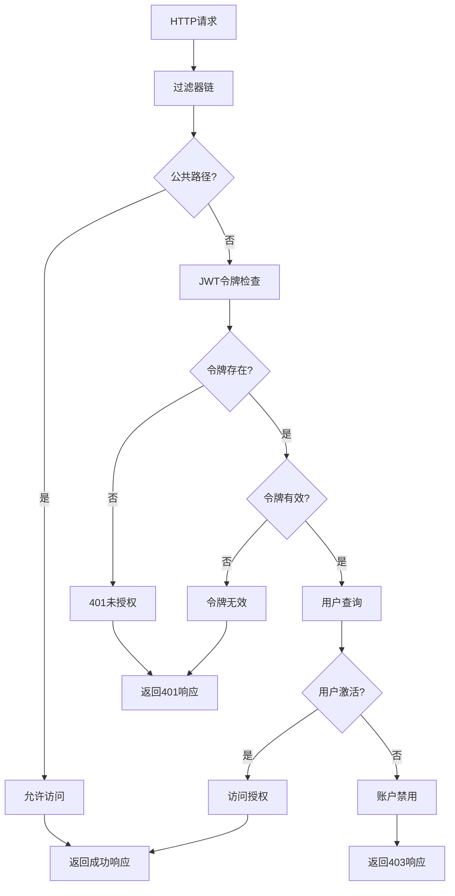
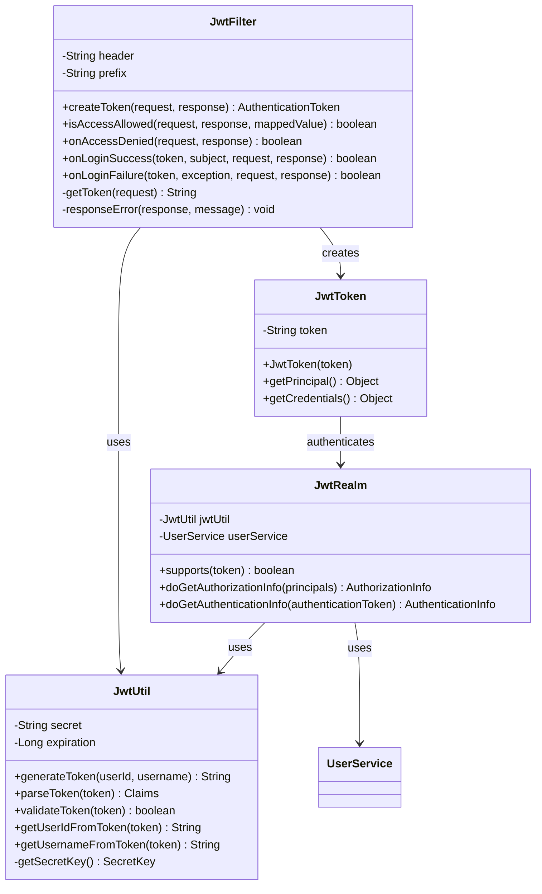
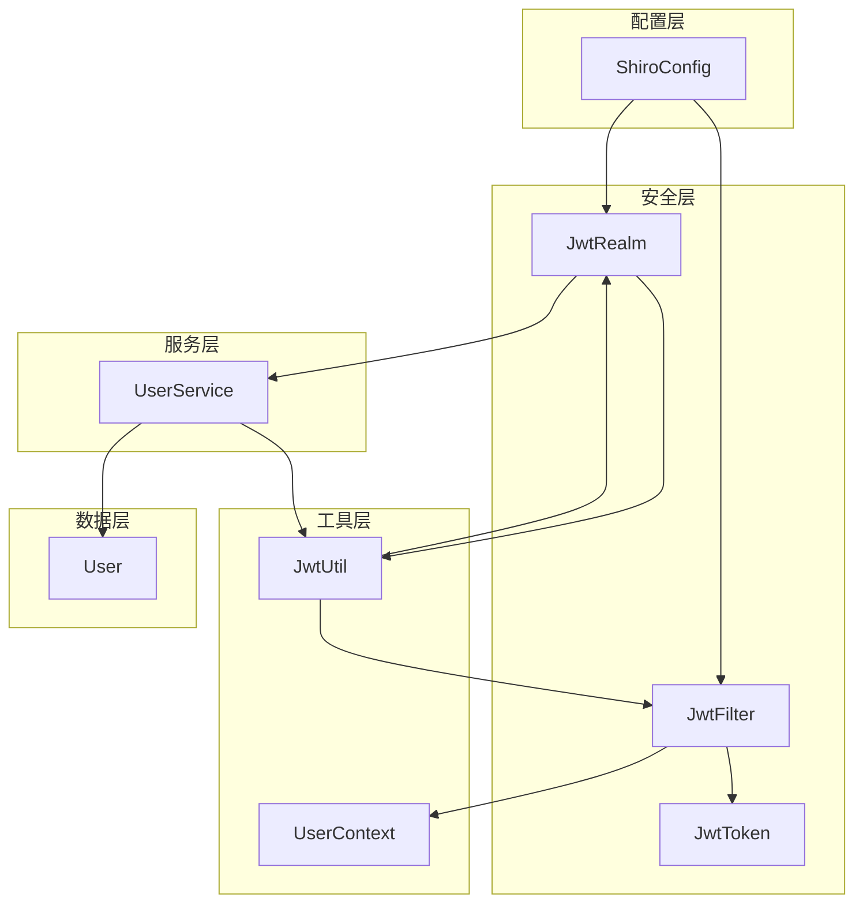

# 安全认证系统

<cite>
**本文档引用的文件**
- [JwtFilter.java](file://src/main/java/com/zhishilu/shiro/JwtFilter.java)
- [JwtRealm.java](file://src/main/java/com/zhishilu/shiro/JwtRealm.java)
- [JwtToken.java](file://src/main/java/com/zhishilu/shiro/JwtToken.java)
- [JwtUtil.java](file://src/main/java/com/zhishilu/util/JwtUtil.java)
- [UserContext.java](file://src/main/java/com/zhishilu/util/UserContext.java)
- [ShiroConfig.java](file://src/main/java/com/zhishilu/config/ShiroConfig.java)
- [AuthController.java](file://src/main/java/com/zhishilu/controller/AuthController.java)
- [UserService.java](file://src/main/java/com/zhishilu/service/UserService.java)
- [application.yml](file://src/main/resources/application.yml)
- [User.java](file://src/main/java/com/zhishilu/entity/User.java)
- [Result.java](file://src/main/java/com/zhishilu/common/Result.java)
- [LoginDTO.java](file://src/main/java/com/zhishilu/dto/LoginDTO.java)
</cite>

## 目录
1. [引言](#引言)
2. [项目结构](#项目结构)
3. [核心组件](#核心组件)
4. [架构概览](#架构概览)
5. [详细组件分析](#详细组件分析)
6. [依赖关系分析](#依赖关系分析)
7. [性能考虑](#性能考虑)
8. [故障排除指南](#故障排除指南)
9. [结论](#结论)

## 引言

知拾录安全认证系统采用JWT无状态认证机制与Apache Shiro安全框架相结合的方式，构建了一个高效、可扩展的认证鉴权解决方案。该系统通过无状态的JWT令牌实现用户身份验证，结合Shiro的过滤器链实现统一的权限控制，为个人知识管理系统提供了完整且安全的访问控制机制。

系统的核心优势包括：
- **无状态设计**：JWT令牌包含所有必要的用户信息，服务器无需维护会话状态
- **分布式友好**：令牌可以在多个服务实例间共享使用
- **性能优化**：避免了服务器端会话存储的开销
- **灵活配置**：支持多种认证方式和权限控制策略

## 项目结构

安全认证系统主要分布在以下目录结构中：



**图表来源**
- [JwtFilter.java](file://src/main/java/com/zhishilu/shiro/JwtFilter.java#L1-L109)
- [JwtRealm.java](file://src/main/java/com/zhishilu/shiro/JwtRealm.java#L1-L71)
- [JwtUtil.java](file://src/main/java/com/zhishilu/util/JwtUtil.java#L1-L99)
- [UserContext.java](file://src/main/java/com/zhishilu/util/UserContext.java#L1-L33)
- [ShiroConfig.java](file://src/main/java/com/zhishilu/config/ShiroConfig.java#L1-L72)

**章节来源**
- [ShiroConfig.java](file://src/main/java/com/zhishilu/config/ShiroConfig.java#L1-L72)
- [application.yml](file://src/main/resources/application.yml#L20-L32)

## 核心组件

### JWT过滤器 (JwtFilter)

JwtFilter是整个认证系统的核心过滤器，继承自Apache Shiro的AuthenticatingFilter类，负责拦截HTTP请求并进行JWT令牌验证。

**主要功能特性：**
- **令牌提取**：从HTTP头或URL参数中提取JWT令牌
- **认证执行**：将令牌传递给Shiro进行认证处理
- **用户上下文设置**：认证成功后将用户信息存入ThreadLocal上下文
- **错误处理**：统一处理认证失败的情况

**配置参数：**
- `jwt.header`: HTTP头部名称，默认为"Authorization"
- `jwt.prefix`: 令牌前缀，默认为"Bearer "
- `jwt.expiration`: 令牌过期时间，默认24小时

### JWT领域 (JwtRealm)

JwtRealm实现了Apache Shiro的AuthorizingRealm接口，专门处理JWT认证逻辑。

**认证流程：**
1. 验证JWT令牌的有效性
2. 从令牌中提取用户ID
3. 查询用户信息
4. 检查用户状态
5. 返回认证信息

**授权机制：**
目前系统采用简化的授权模型，所有认证通过的用户都具有相同的授权级别。

### JWT工具类 (JwtUtil)

JwtUtil提供了JWT令牌的生成、解析和验证功能。

**核心功能：**
- **令牌生成**：基于用户ID和用户名生成JWT令牌
- **令牌验证**：检查令牌的有效性和完整性
- **令牌解析**：从令牌中提取用户信息
- **密钥管理**：使用HMAC-SHA256算法进行签名验证

**安全特性：**
- 使用256位密钥长度确保安全性
- 支持自定义过期时间
- 包含完整的异常处理机制

### 用户上下文 (UserContext)

UserContext是一个线程安全的用户上下文管理工具，使用ThreadLocal存储当前登录用户信息。

**设计优势：**
- **线程隔离**：每个线程维护独立的用户上下文
- **自动清理**：请求结束后自动清理上下文信息
- **简单易用**：提供静态方法便于全局访问

**使用场景：**
- 在业务逻辑中获取当前登录用户
- 记录操作日志时识别操作人
- 实现基于用户的权限控制

**章节来源**
- [JwtFilter.java](file://src/main/java/com/zhishilu/shiro/JwtFilter.java#L24-L109)
- [JwtRealm.java](file://src/main/java/com/zhishilu/shiro/JwtRealm.java#L15-L71)
- [JwtUtil.java](file://src/main/java/com/zhishilu/util/JwtUtil.java#L15-L99)
- [UserContext.java](file://src/main/java/com/zhishilu/util/UserContext.java#L5-L33)

## 架构概览

系统采用分层架构设计，将认证、授权和业务逻辑清晰分离：



**图表来源**
- [ShiroConfig.java](file://src/main/java/com/zhishilu/config/ShiroConfig.java#L44-L70)
- [JwtFilter.java](file://src/main/java/com/zhishilu/shiro/JwtFilter.java#L29-L85)
- [JwtRealm.java](file://src/main/java/com/zhishilu/shiro/JwtRealm.java#L21-L69)

## 详细组件分析

### 认证流程序列图



**图表来源**
- [AuthController.java](file://src/main/java/com/zhishilu/controller/AuthController.java#L33-L40)
- [UserService.java](file://src/main/java/com/zhishilu/service/UserService.java#L61-L87)
- [JwtUtil.java](file://src/main/java/com/zhishilu/util/JwtUtil.java#L31-L43)
- [JwtFilter.java](file://src/main/java/com/zhishilu/shiro/JwtFilter.java#L57-L75)
- [JwtRealm.java](file://src/main/java/com/zhishilu/shiro/JwtRealm.java#L43-L69)

### 权限控制机制

系统采用基于角色的权限控制（RBAC）模型，通过Shiro的过滤器链实现统一的权限管理：



**图表来源**
- [ShiroConfig.java](file://src/main/java/com/zhishilu/config/ShiroConfig.java#L55-L64)
- [JwtFilter.java](file://src/main/java/com/zhishilu/shiro/JwtFilter.java#L48-L85)
- [JwtRealm.java](file://src/main/java/com/zhishilu/shiro/JwtRealm.java#L43-L69)

### Token生成和验证过程



**图表来源**
- [JwtToken.java](file://src/main/java/com/zhishilu/shiro/JwtToken.java#L8-L25)
- [JwtUtil.java](file://src/main/java/com/zhishilu/util/JwtUtil.java#L20-L97)
- [JwtFilter.java](file://src/main/java/com/zhishilu/shiro/JwtFilter.java#L29-L107)
- [JwtRealm.java](file://src/main/java/com/zhishilu/shiro/JwtRealm.java#L21-L69)

**章节来源**
- [JwtToken.java](file://src/main/java/com/zhishilu/shiro/JwtToken.java#L1-L26)
- [JwtUtil.java](file://src/main/java/com/zhishilu/util/JwtUtil.java#L1-L99)
- [JwtFilter.java](file://src/main/java/com/zhishilu/shiro/JwtFilter.java#L1-L109)
- [JwtRealm.java](file://src/main/java/com/zhishilu/shiro/JwtRealm.java#L1-L71)

## 依赖关系分析

系统中的组件依赖关系如下：



**图表来源**
- [ShiroConfig.java](file://src/main/java/com/zhishilu/config/ShiroConfig.java#L27-L39)
- [JwtFilter.java](file://src/main/java/com/zhishilu/shiro/JwtFilter.java#L72-L74)
- [JwtRealm.java](file://src/main/java/com/zhishilu/shiro/JwtRealm.java#L23-L24)

**章节来源**
- [ShiroConfig.java](file://src/main/java/com/zhishilu/config/ShiroConfig.java#L1-L72)
- [UserService.java](file://src/main/java/com/zhishilu/service/UserService.java#L1-L128)

## 性能考虑

### JWT令牌性能优化

1. **无状态设计**：JWT令牌包含所有必要信息，避免了服务器端会话存储的开销
2. **内存效率**：令牌大小固定，不随用户数据增长而增加
3. **网络传输**：令牌作为单一字符串传输，减少HTTP头部开销

### Shiro过滤器优化

1. **短路评估**：对于OPTIONS预检请求直接放行，减少不必要的认证开销
2. **缓存策略**：可以考虑对频繁访问的用户信息进行缓存
3. **异步处理**：对于耗时的用户查询操作可以考虑异步化

### Token过期处理

系统采用主动过期检测机制：
- **过期时间配置**：默认24小时，可通过配置文件调整
- **异常处理**：过期的令牌会抛出相应的异常，便于统一处理
- **用户体验**：客户端需要重新登录获取新的令牌

## 故障排除指南

### 常见认证问题

1. **令牌格式错误**
   - 检查令牌是否包含正确的前缀
   - 验证令牌格式是否符合JWT标准
   
2. **令牌过期**
   - 检查服务器时间同步
   - 验证令牌过期时间配置
   - 实现令牌刷新机制

3. **用户状态异常**
   - 检查用户状态字段值
   - 验证用户是否存在
   - 确认用户未被禁用

### 调试技巧

1. **启用详细日志**
   ```yaml
   logging:
     level:
       com.zhishilu: DEBUG
       org.apache.shiro: DEBUG
   ```

2. **令牌验证测试**
   - 使用在线JWT解码工具验证令牌结构
   - 检查签名验证是否通过
   - 验证声明信息的正确性

3. **Shiro过滤器调试**
   - 启用Shiro的调试模式
   - 检查过滤器链的执行顺序
   - 验证权限规则配置

### 安全最佳实践

1. **密钥管理**
   - 使用强随机密钥
   - 定期轮换密钥
   - 安全存储密钥信息

2. **令牌传输**
   - 使用HTTPS协议
   - 避免在URL中传递令牌
   - 实施适当的CORS策略

3. **权限控制**
   - 最小权限原则
   - 定期审查权限分配
   - 实施审计日志

**章节来源**
- [application.yml](file://src/main/resources/application.yml#L40-L47)
- [JwtUtil.java](file://src/main/java/com/zhishilu/util/JwtUtil.java#L55-L61)
- [JwtRealm.java](file://src/main/java/com/zhishilu/shiro/JwtRealm.java#L63-L66)

## 结论

知拾录安全认证系统通过JWT无状态认证与Apache Shiro的有机结合，构建了一个高效、安全、可扩展的认证鉴权解决方案。系统的主要特点包括：

**技术优势：**
- 无状态设计确保了良好的可扩展性
- 基于Shiro的过滤器链提供了统一的权限控制
- ThreadLocal用户上下文简化了用户信息的获取
- 完整的异常处理机制提升了系统的稳定性

**架构特点：**
- 分层清晰，职责明确
- 组件解耦，易于维护
- 配置灵活，适应性强
- 性能优化，用户体验良好

**安全特性：**
- 强大的令牌验证机制
- 完善的用户状态检查
- 统一的错误处理策略
- 可扩展的权限控制模型

该系统为个人知识管理系统提供了坚实的安全基础，能够有效防止未授权访问，保护用户数据安全，同时保持良好的性能表现。通过合理的配置和最佳实践的应用，可以进一步提升系统的安全性和可靠性。