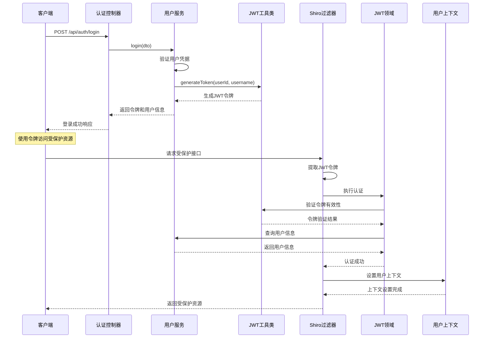
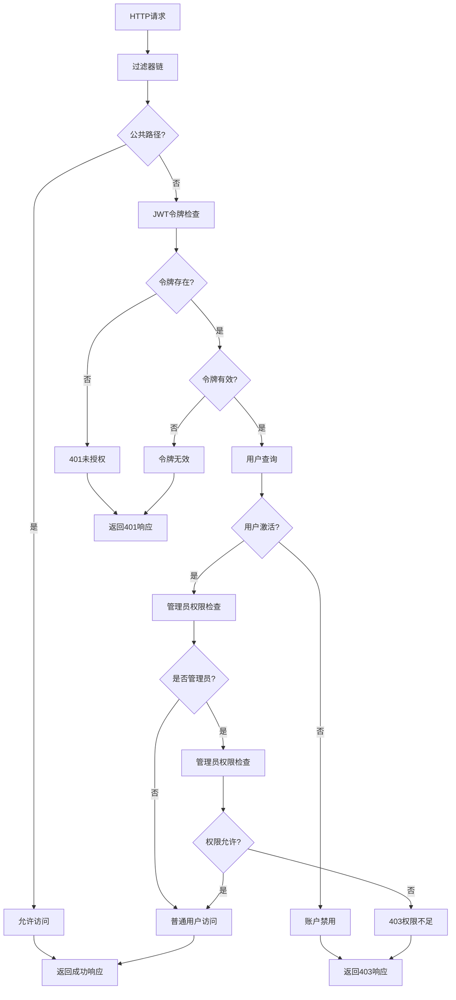
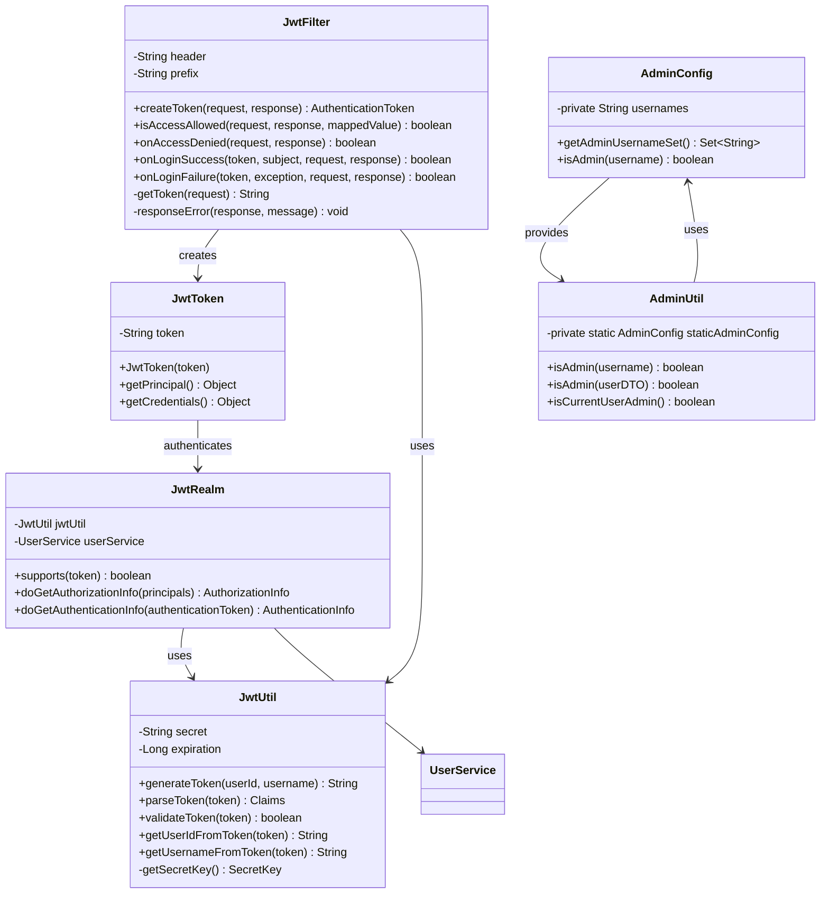
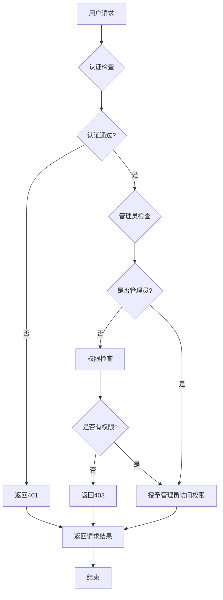

# 安全认证系统

<cite>
**本文档引用的文件**
- [JwtFilter.java](file://src/main/java/com/zhishilu/shiro/JwtFilter.java)
- [JwtRealm.java](file://src/main/java/com/zhishilu/shiro/JwtRealm.java)
- [JwtToken.java](file://src/main/java/com/zhishilu/shiro/JwtToken.java)
- [JwtUtil.java](file://src/main/java/com/zhishilu/util/JwtUtil.java)
- [UserContext.java](file://src/main/java/com/zhishilu/util/UserContext.java)
- [AdminConfig.java](file://src/main/java/com/zhishilu/config/AdminConfig.java)
- [AdminUtil.java](file://src/main/java/com/zhishilu/util/AdminUtil.java)
- [ShiroConfig.java](file://src/main/java/com/zhishilu/config/ShiroConfig.java)
- [AuthController.java](file://src/main/java/com/zhishilu/controller/AuthController.java)
- [UserController.java](file://src/main/java/com/zhishilu/controller/UserController.java)
- [UserService.java](file://src/main/java/com/zhishilu/service/UserService.java)
- [application.yml](file://src/main/resources/application.yml)
- [User.java](file://src/main/java/com/zhishilu/entity/User.java)
- [UserDTO.java](file://src/main/java/com/zhishilu/dto/UserDTO.java)
- [Result.java](file://src/main/java/com/zhishilu/common/Result.java)
- [LoginDTO.java](file://src/main/java/com/zhishilu/dto/LoginDTO.java)
</cite>

## 更新摘要
**变更内容**
- 新增管理员权限控制机制，包括AdminConfig配置类和AdminUtil工具类
- 增强JWT认证系统中的权限检查功能，实现基于角色的权限控制
- 在UserController中实现管理员专用的用户管理接口
- 在User实体类中新增authorized字段用于用户授权状态管理
- 在UserDTO和UserResp中新增admin字段用于标识管理员身份

## 目录
1. [引言](#引言)
2. [项目结构](#项目结构)
3. [核心组件](#核心组件)
4. [架构概览](#架构概览)
5. [详细组件分析](#详细组件分析)
6. [管理员权限控制机制](#管理员权限控制机制)
7. [依赖关系分析](#依赖关系分析)
8. [性能考虑](#性能考虑)
9. [故障排除指南](#故障排除指南)
10. [结论](#结论)

## 引言

知拾录安全认证系统采用JWT无状态认证机制与Apache Shiro安全框架相结合的方式，构建了一个高效、可扩展的认证鉴权解决方案。该系统通过无状态的JWT令牌实现用户身份验证，结合Shiro的过滤器链实现统一的权限控制，并新增了完善的管理员权限控制机制，为个人知识管理系统提供了完整且安全的访问控制机制。

系统的核心优势包括：
- **无状态设计**：JWT令牌包含所有必要的用户信息，服务器无需维护会话状态
- **分布式友好**：令牌可以在多个服务实例间共享使用
- **性能优化**：避免了服务器端会话存储的开销
- **灵活配置**：支持多种认证方式和权限控制策略
- **管理员权限控制**：提供基于角色的权限管理机制

## 项目结构

安全认证系统主要分布在以下目录结构中：

```mermaid
graph TB
subgraph "安全认证模块"
SHIRO[shiro/]
UTIL[util/]
CONFIG[config/]
CONTROLLER[controller/]
SERVICE[service/]
end
subgraph "核心安全组件"
JWT_FILTER[JwtFilter.java<br/>JWT过滤器]
JWT_REALM[JwtRealm.java<br/>JWT领域]
JWT_TOKEN[JwtToken.java<br/>JWT令牌]
JWT_UTIL[JwtUtil.java<br/>JWT工具类]
USER_CONTEXT[UserContext.java<br/>用户上下文]
ADMIN_CONFIG[AdminConfig.java<br/>管理员配置]
ADMIN_UTIL[AdminUtil.java<br/>管理员工具类]
SHIRO_CONFIG[ShiroConfig.java<br/>Shiro配置]
END
subgraph "业务控制器"
AUTH_CONTROLLER[AuthController.java<br/>认证控制器]
USER_CONTROLLER[UserController.java<br/>用户控制器]
END
subgraph "数据模型"
USER_ENTITY[User.java<br/>用户实体]
USER_DTO[UserDTO.java<br/>用户DTO]
END
JWT_FILTER --> JWT_TOKEN
JWT_REALM --> JWT_UTIL
JWT_REALM --> USER_SERVICE
USER_CONTEXT --> USER_SERVICE
ADMIN_CONFIG --> ADMIN_UTIL
USER_CONTROLLER --> ADMIN_CONFIG
USER_CONTROLLER --> ADMIN_UTIL
```

**图表来源**
- [JwtFilter.java](file://src/main/java/com/zhishilu/shiro/JwtFilter.java#L1-L109)
- [JwtRealm.java](file://src/main/java/com/zhishilu/shiro/JwtRealm.java#L1-L71)
- [JwtUtil.java](file://src/main/java/com/zhishilu/util/JwtUtil.java#L1-L99)
- [UserContext.java](file://src/main/java/com/zhishilu/util/UserContext.java#L1-L33)
- [AdminConfig.java](file://src/main/java/com/zhishilu/config/AdminConfig.java#L1-L48)
- [AdminUtil.java](file://src/main/java/com/zhishilu/util/AdminUtil.java#L1-L60)
- [ShiroConfig.java](file://src/main/java/com/zhishilu/config/ShiroConfig.java#L1-L72)
- [UserController.java](file://src/main/java/com/zhishilu/controller/UserController.java#L1-L258)
- [User.java](file://src/main/java/com/zhishilu/entity/User.java#L1-L76)
- [UserDTO.java](file://src/main/java/com/zhishilu/dto/UserDTO.java#L1-L63)

**章节来源**
- [ShiroConfig.java](file://src/main/java/com/zhishilu/config/ShiroConfig.java#L1-L72)
- [application.yml](file://src/main/resources/application.yml#L50-L53)

## 核心组件

### JWT过滤器 (JwtFilter)

JwtFilter是整个认证系统的核心过滤器，继承自Apache Shiro的AuthenticatingFilter类，负责拦截HTTP请求并进行JWT令牌验证。

**主要功能特性：**
- **令牌提取**：从HTTP头或URL参数中提取JWT令牌
- **认证执行**：将令牌传递给Shiro进行认证处理
- **用户上下文设置**：认证成功后将用户信息存入ThreadLocal上下文
- **错误处理**：统一处理认证失败的情况

**配置参数：**
- `jwt.header`: HTTP头部名称，默认为"Authorization"
- `jwt.prefix`: 令牌前缀，默认为"Bearer "
- `jwt.expiration`: 令牌过期时间，默认24小时

### JWT领域 (JwtRealm)

JwtRealm实现了Apache Shiro的AuthorizingRealm接口，专门处理JWT认证逻辑。

**认证流程：**
1. 验证JWT令牌的有效性
2. 从令牌中提取用户ID
3. 查询用户信息
4. 检查用户状态
5. 返回认证信息

**授权机制：**
目前系统采用简化的授权模型，所有认证通过的用户都具有相同的授权级别。

### JWT工具类 (JwtUtil)

JwtUtil提供了JWT令牌的生成、解析和验证功能。

**核心功能：**
- **令牌生成**：基于用户ID和用户名生成JWT令牌
- **令牌验证**：检查令牌的有效性和完整性
- **令牌解析**：从令牌中提取用户信息
- **密钥管理**：使用HMAC-SHA256算法进行签名验证

**安全特性：**
- 使用256位密钥长度确保安全性
- 支持自定义过期时间
- 包含完整的异常处理机制

### 用户上下文 (UserContext)

UserContext是一个线程安全的用户上下文管理工具，使用ThreadLocal存储当前登录用户信息。

**设计优势：**
- **线程隔离**：每个线程维护独立的用户上下文
- **自动清理**：请求结束后自动清理上下文信息
- **简单易用**：提供静态方法便于全局访问

**使用场景：**
- 在业务逻辑中获取当前登录用户
- 记录操作日志时识别操作人
- 实现基于用户的权限控制

### 管理员配置 (AdminConfig)

AdminConfig是一个Spring Boot配置类，负责从application.yml配置文件中读取管理员用户名列表。

**核心功能：**
- **配置属性绑定**：通过@ConfigurationProperties(prefix = "admin")绑定配置
- **用户名列表管理**：支持逗号分隔的多用户名配置
- **管理员身份验证**：提供isAdmin()方法判断用户是否为管理员
- **集合转换**：将配置的用户名字符串转换为Set集合

**配置示例：**
```yaml
admin:
  usernames: lixiang,zhangsan,lisi
```

### 管理员工具 (AdminUtil)

AdminUtil是一个静态工具类，提供便捷的管理员身份判断方法。

**核心功能：**
- **静态方法调用**：提供isAdmin()静态方法供任意位置调用
- **用户对象判断**：支持通过UserDTO对象判断管理员身份
- **当前用户判断**：提供isCurrentUserAdmin()判断当前登录用户是否为管理员
- **静态初始化**：通过@PostConstruct确保静态变量正确初始化

**使用场景：**
- 在控制器中进行权限检查
- 在服务层进行业务逻辑控制
- 在前端交互中判断显示权限

**章节来源**
- [JwtFilter.java](file://src/main/java/com/zhishilu/shiro/JwtFilter.java#L24-L109)
- [JwtRealm.java](file://src/main/java/com/zhishilu/shiro/JwtRealm.java#L15-L71)
- [JwtUtil.java](file://src/main/java/com/zhishilu/util/JwtUtil.java#L15-L99)
- [UserContext.java](file://src/main/java/com/zhishilu/util/UserContext.java#L5-L33)
- [AdminConfig.java](file://src/main/java/com/zhishilu/config/AdminConfig.java#L15-L47)
- [AdminUtil.java](file://src/main/java/com/zhishilu/util/AdminUtil.java#L14-L59)

## 架构概览

系统采用分层架构设计，将认证、授权和业务逻辑清晰分离：

```mermaid
graph TB
subgraph "客户端层"
CLIENT[客户端应用]
END
subgraph "表示层"
AUTH_CONTROLLER[认证控制器]
USER_CONTROLLER[用户控制器]
ARTICLE_CONTROLLER[文章控制器]
FILE_CONTROLLER[文件控制器]
END
subgraph "安全层"
JWT_FILTER[JWT过滤器]
JWT_REALM[JWT领域]
SHIRO_CONFIG[Shiro配置]
ADMIN_CONFIG[管理员配置]
ADMIN_UTIL[管理员工具]
END
subgraph "服务层"
USER_SERVICE[用户服务]
ARTICLE_SERVICE[文章服务]
FILE_SERVICE[文件服务]
END
subgraph "数据访问层"
USER_REPOSITORY[用户仓库]
ARTICLE_REPOSITORY[文章仓库]
OPERATION_LOG_REPOSITORY[操作日志仓库]
END
subgraph "外部服务"
ELASTICSEARCH[Elasticsearch]
FILE_SYSTEM[文件系统]
END
CLIENT --> AUTH_CONTROLLER
CLIENT --> USER_CONTROLLER
CLIENT --> ARTICLE_CONTROLLER
CLIENT --> FILE_CONTROLLER
AUTH_CONTROLLER --> JWT_FILTER
USER_CONTROLLER --> JWT_FILTER
ARTICLE_CONTROLLER --> JWT_FILTER
FILE_CONTROLLER --> JWT_FILTER
JWT_FILTER --> JWT_REALM
JWT_FILTER --> ADMIN_UTIL
JWT_REALM --> USER_SERVICE
USER_SERVICE --> USER_REPOSITORY
USER_REPOSITORY --> ELASTICSEARCH
USER_SERVICE --> JWT_UTIL[JWT工具类]
USER_SERVICE --> ADMIN_CONFIG[管理员配置]
JWT_UTIL --> JWT_FILTER
USER_SERVICE --> USER_CONTEXT[用户上下文]
USER_CONTEXT --> USER_SERVICE
ADMIN_UTIL --> ADMIN_CONFIG
```

**图表来源**
- [ShiroConfig.java](file://src/main/java/com/zhishilu/config/ShiroConfig.java#L44-L70)
- [JwtFilter.java](file://src/main/java/com/zhishilu/shiro/JwtFilter.java#L29-L85)
- [JwtRealm.java](file://src/main/java/com/zhishilu/shiro/JwtRealm.java#L21-L69)
- [AdminConfig.java](file://src/main/java/com/zhishilu/config/AdminConfig.java#L17-L47)
- [AdminUtil.java](file://src/main/java/com/zhishilu/util/AdminUtil.java#L18-L59)

## 详细组件分析

### 认证流程序列图


```mermaid
sequenceDiagram
participant Client as 客户端
participant AuthController as 认证控制器
participant UserService as 用户服务
participant JwtUtil as JWT工具类
participant ShiroFilter as Shiro过滤器
participant JwtRealm as JWT领域
participant UserContext as 用户上下文
Client->>AuthController : POST /api/auth/login
AuthController->>UserService : login(dto)
UserService->>UserService : 验证用户凭据
UserService->>JwtUtil : generateToken(userId, username)
JwtUtil-->>UserService : 生成JWT令牌
UserService-->>AuthController : 返回令牌和用户信息
AuthController-->>Client : 登录成功响应
Note over Client : 使用令牌访问受保护资源
Client->>ShiroFilter : 请求受保护接口
ShiroFilter->>ShiroFilter : 提取JWT令牌
ShiroFilter->>JwtRealm : 执行认证
JwtRealm->>JwtUtil : 验证令牌有效性
JwtUtil-->>JwtRealm : 令牌验证结果
JwtRealm->>UserService : 查询用户信息
UserService-->>JwtRealm : 返回用户信息
JwtRealm-->>ShiroFilter : 认证成功
ShiroFilter->>UserContext : 设置用户上下文
UserContext-->>ShiroFilter : 上下文设置完成
ShiroFilter-->>Client : 返回受保护资源
```

**图表来源**
- [AuthController.java](file://src/main/java/com/zhishilu/controller/AuthController.java#L33-L40)
- [UserService.java](file://src/main/java/com/zhishilu/service/UserService.java#L61-L87)
- [JwtUtil.java](file://src/main/java/com/zhishilu/util/JwtUtil.java#L31-L43)
- [JwtFilter.java](file://src/main/java/com/zhishilu/shiro/JwtFilter.java#L57-L75)
- [JwtRealm.java](file://src/main/java/com/zhishilu/shiro/JwtRealm.java#L43-L69)

### 权限控制机制

系统采用基于角色的权限控制（RBAC）模型，通过Shiro的过滤器链实现统一的权限管理：


```mermaid
flowchart TD
REQUEST[HTTP请求] --> FILTER_CHAIN[过滤器链]
FILTER_CHAIN --> PUBLIC_PATH{公共路径?}
PUBLIC_PATH --> |是| ALLOW_ACCESS[允许访问]
PUBLIC_PATH --> |否| JWT_CHECK[JWT令牌检查]
JWT_CHECK --> TOKEN_PRESENT{令牌存在?}
TOKEN_PRESENT --> |否| UNAUTHORIZED[401未授权]
TOKEN_PRESENT --> |是| TOKEN_VALID{令牌有效?}
TOKEN_VALID --> |否| INVALID_TOKEN[令牌无效]
TOKEN_VALID --> |是| USER_LOOKUP[用户查询]
USER_LOOKUP --> USER_ACTIVE{用户激活?}
USER_ACTIVE --> |否| ACCOUNT_DISABLED[账户禁用]
USER_ACTIVE --> |是| ADMIN_CHECK[管理员权限检查]
ADMIN_CHECK --> IS_ADMIN{是否管理员?}
IS_ADMIN --> |否| ACCESS_GRANTED[普通用户访问]
IS_ADMIN --> |是| ADMIN_PERMISSIONS[管理员权限检查]
ADMIN_PERMISSIONS --> PERMISSION_ALLOWED{权限允许?}
PERMISSION_ALLOWED --> |否| ACCESS_DENIED[403权限不足]
PERMISSION_ALLOWED --> |是| ACCESS_GRANTED
UNAUTHORIZED --> RESPONSE_401[返回401响应]
INVALID_TOKEN --> RESPONSE_401
ACCOUNT_DISABLED --> RESPONSE_403[返回403响应]
ACCESS_DENIED --> RESPONSE_403
ALLOW_ACCESS --> RESPONSE_SUCCESS[返回成功响应]
ACCESS_GRANTED --> RESPONSE_SUCCESS
```

**图表来源**
- [ShiroConfig.java](file://src/main/java/com/zhishilu/config/ShiroConfig.java#L55-L64)
- [JwtFilter.java](file://src/main/java/com/zhishilu/shiro/JwtFilter.java#L48-L85)
- [JwtRealm.java](file://src/main/java/com/zhishilu/shiro/JwtRealm.java#L43-L69)
- [AdminConfig.java](file://src/main/java/com/zhishilu/config/AdminConfig.java#L41-L46)
- [AdminUtil.java](file://src/main/java/com/zhishilu/util/AdminUtil.java#L32-L58)

### Token生成和验证过程


```mermaid
classDiagram
class JwtToken {
-String token
+JwtToken(token)
+getPrincipal() Object
+getCredentials() Object
}
class JwtUtil {
-String secret
-Long expiration
+generateToken(userId, username) String
+parseToken(token) Claims
+validateToken(token) boolean
+getUserIdFromToken(token) String
+getUsernameFromToken(token) String
-getSecretKey() SecretKey
}
class JwtFilter {
-String header
-String prefix
+createToken(request, response) AuthenticationToken
+isAccessAllowed(request, response, mappedValue) boolean
+onAccessDenied(request, response) boolean
+onLoginSuccess(token, subject, request, response) boolean
+onLoginFailure(token, exception, request, response) boolean
-getToken(request) String
-responseError(response, message) void
}
class JwtRealm {
-JwtUtil jwtUtil
-UserService userService
+supports(token) boolean
+doGetAuthorizationInfo(principals) AuthorizationInfo
+doGetAuthenticationInfo(authenticationToken) AuthenticationInfo
}
class AdminConfig {
-private String usernames
+getAdminUsernameSet() Set~String~
+isAdmin(username) boolean
}
class AdminUtil {
-private static AdminConfig staticAdminConfig
+isAdmin(username) boolean
+isAdmin(userDTO) boolean
+isCurrentUserAdmin() boolean
}
JwtFilter --> JwtToken : creates
JwtFilter --> JwtUtil : uses
JwtRealm --> JwtUtil : uses
JwtRealm --> UserService : uses
JwtToken --> JwtRealm : authenticates
AdminConfig --> AdminUtil : provides
AdminUtil --> AdminConfig : uses
```

**图表来源**
- [JwtToken.java](file://src/main/java/com/zhishilu/shiro/JwtToken.java#L8-L25)
- [JwtUtil.java](file://src/main/java/com/zhishilu/util/JwtUtil.java#L20-L97)
- [JwtFilter.java](file://src/main/java/com/zhishilu/shiro/JwtFilter.java#L29-L107)
- [JwtRealm.java](file://src/main/java/com/zhishilu/shiro/JwtRealm.java#L21-L69)
- [AdminConfig.java](file://src/main/java/com/zhishilu/config/AdminConfig.java#L18-L47)
- [AdminUtil.java](file://src/main/java/com/zhishilu/util/AdminUtil.java#L18-L59)

**章节来源**
- [JwtToken.java](file://src/main/java/com/zhishilu/shiro/JwtToken.java#L1-L26)
- [JwtUtil.java](file://src/main/java/com/zhishilu/util/JwtUtil.java#L1-L99)
- [JwtFilter.java](file://src/main/java/com/zhishilu/shiro/JwtFilter.java#L1-L109)
- [JwtRealm.java](file://src/main/java/com/zhishilu/shiro/JwtRealm.java#L1-L71)
- [AdminConfig.java](file://src/main/java/com/zhishilu/config/AdminConfig.java#L1-L48)
- [AdminUtil.java](file://src/main/java/com/zhishilu/util/AdminUtil.java#L1-L60)

## 管理员权限控制机制

### 管理员配置管理

系统通过AdminConfig类实现管理员配置的集中管理：

**配置文件支持：**
- 支持逗号分隔的多管理员用户名配置
- 自动去除用户名前后空格
- 提供Set集合形式的快速查找

**配置示例：**
```yaml
admin:
  usernames: lixiang,zhangsan,lisi
```

**核心方法：**
- `getAdminUsernameSet()`: 返回管理员用户名Set集合
- `isAdmin(username)`: 判断指定用户名是否为管理员

### 管理员权限检查流程

管理员权限检查在多个层面实现：


```mermaid
flowchart TD
USER_REQUEST[用户请求] --> CHECK_AUTHENTICATION{认证检查}
CHECK_AUTHENTICATION --> AUTHENTICATED{认证通过?}
AUTHENTICATED --> |否| RETURN_UNAUTHORIZED[返回401]
AUTHENTICATED --> |是| CHECK_ADMIN{管理员检查}
CHECK_ADMIN --> IS_ADMIN{是否管理员?}
IS_ADMIN --> |否| CHECK_PERMISSION[权限检查]
IS_ADMIN --> |是| GRANT_ACCESS[授予管理员访问权限]
CHECK_PERMISSION --> HAS_PERMISSION{是否有权限?}
HAS_PERMISSION --> |否| RETURN_FORBIDDEN[返回403]
HAS_PERMISSION --> |是| GRANT_ACCESS
RETURN_UNAUTHORIZED --> RESPONSE
RETURN_FORBIDDEN --> RESPONSE
GRANT_ACCESS --> RESPONSE[返回请求结果]
RESPONSE --> END[结束]
```

**图表来源**
- [AdminConfig.java](file://src/main/java/com/zhishilu/config/AdminConfig.java#L29-L46)
- [AdminUtil.java](file://src/main/java/com/zhishilu/util/AdminUtil.java#L32-L58)
- [UserController.java](file://src/main/java/com/zhishilu/controller/UserController.java#L128-L131)

### 管理员专用接口

UserController实现了完整的管理员权限控制：

**用户管理接口：**
- `/user/list`: 获取用户列表（仅管理员）
- `/user/list/by-authorized`: 按授权状态获取用户列表（仅管理员）
- `/user/{userId}/authorize`: 授权用户（仅管理员）
- `/user/{userId}/unauthorize`: 取消用户授权（仅管理员）
- `/user/{userId}/reset-password`: 重置用户密码（仅管理员）
- `/user/{userId}`: 删除用户（仅管理员）

**权限控制规则：**
- 非管理员用户访问管理员接口将返回403错误
- 管理员不能删除自己或删除其他管理员
- 管理员不能重置自己的密码
- 管理员取消授权时不能取消自己的授权

**章节来源**
- [AdminConfig.java](file://src/main/java/com/zhishilu/config/AdminConfig.java#L1-L48)
- [AdminUtil.java](file://src/main/java/com/zhishilu/util/AdminUtil.java#L1-L60)
- [UserController.java](file://src/main/java/com/zhishilu/controller/UserController.java#L115-L221)

## 依赖关系分析

系统中的组件依赖关系如下：

```mermaid
graph TB
subgraph "配置层"
SHIRO_CONFIG[ShiroConfig]
ADMIN_CONFIG[AdminConfig]
END
subgraph "安全层"
JWT_FILTER[JwtFilter]
JWT_REALM[JwtRealm]
JWT_TOKEN[JwtToken]
END
subgraph "工具层"
JWT_UTIL[JwtUtil]
USER_CONTEXT[UserContext]
ADMIN_UTIL[AdminUtil]
END
subgraph "服务层"
USER_SERVICE[UserService]
END
subgraph "控制器层"
AUTH_CONTROLLER[AuthController]
USER_CONTROLLER[UserController]
END
subgraph "数据层"
USER_ENTITY[User]
USER_DTO[UserDTO]
END
SHIRO_CONFIG --> JWT_FILTER
SHIRO_CONFIG --> JWT_REALM
JWT_FILTER --> JWT_TOKEN
JWT_FILTER --> USER_CONTEXT
JWT_FILTER --> ADMIN_UTIL
JWT_REALM --> JWT_UTIL
JWT_REALM --> USER_SERVICE
USER_SERVICE --> JWT_UTIL
USER_SERVICE --> USER_ENTITY
USER_SERVICE --> ADMIN_CONFIG
USER_CONTROLLER --> ADMIN_CONFIG
USER_CONTROLLER --> ADMIN_UTIL
JWT_UTIL --> JWT_FILTER
JWT_UTIL --> JWT_REALM
ADMIN_UTIL --> ADMIN_CONFIG
```

**图表来源**
- [ShiroConfig.java](file://src/main/java/com/zhishilu/config/ShiroConfig.java#L27-L39)
- [JwtFilter.java](file://src/main/java/com/zhishilu/shiro/JwtFilter.java#L72-L74)
- [JwtRealm.java](file://src/main/java/com/zhishilu/shiro/JwtRealm.java#L23-L24)
- [AdminConfig.java](file://src/main/java/com/zhishilu/config/AdminConfig.java#L17-L18)
- [AdminUtil.java](file://src/main/java/com/zhishilu/util/AdminUtil.java#L18-L25)
- [UserController.java](file://src/main/java/com/zhishilu/controller/UserController.java#L33-L34)

**章节来源**
- [ShiroConfig.java](file://src/main/java/com/zhishilu/config/ShiroConfig.java#L1-L72)
- [UserService.java](file://src/main/java/com/zhishilu/service/UserService.java#L1-L128)
- [User.java](file://src/main/java/com/zhishilu/entity/User.java#L1-L76)
- [UserDTO.java](file://src/main/java/com/zhishilu/dto/UserDTO.java#L1-L63)

## 性能考虑

### JWT令牌性能优化

1. **无状态设计**：JWT令牌包含所有必要信息，避免了服务器端会话存储的开销
2. **内存效率**：令牌大小固定，不随用户数据增长而增加
3. **网络传输**：令牌作为单一字符串传输，减少HTTP头部开销

### Shiro过滤器优化

1. **短路评估**：对于OPTIONS预检请求直接放行，减少不必要的认证开销
2. **缓存策略**：可以考虑对频繁访问的用户信息进行缓存
3. **异步处理**：对于耗时的用户查询操作可以考虑异步化

### 管理员权限检查优化

1. **静态方法调用**：AdminUtil提供静态方法，避免Spring容器注入开销
2. **配置缓存**：AdminConfig将管理员用户名列表缓存为Set集合，提高查找效率
3. **早期退出**：在权限检查失败时立即返回，避免后续处理

### Token过期处理

系统采用主动过期检测机制：
- **过期时间配置**：默认24小时，可通过配置文件调整
- **异常处理**：过期的令牌会抛出相应的异常，便于统一处理
- **用户体验**：客户端需要重新登录获取新的令牌

## 故障排除指南

### 常见认证问题

1. **令牌格式错误**
   - 检查令牌是否包含正确的前缀
   - 验证令牌格式是否符合JWT标准
   
2. **令牌过期**
   - 检查服务器时间同步
   - 验证令牌过期时间配置
   - 实现令牌刷新机制

3. **用户状态异常**
   - 检查用户状态字段值
   - 验证用户是否存在
   - 确认用户未被禁用

### 管理员权限相关问题

1. **管理员配置不生效**
   - 检查application.yml中的admin配置
   - 验证用户名格式和大小写
   - 确认配置文件加载成功

2. **权限检查失败**
   - 检查用户是否已登录
   - 验证用户是否为管理员身份
   - 确认权限检查逻辑正确执行

3. **管理员专用接口访问失败**
   - 检查请求是否携带有效的JWT令牌
   - 验证管理员身份验证是否通过
   - 确认权限检查规则是否正确

### 调试技巧

1. **启用详细日志**
   ```yaml
   logging:
     level:
       com.zhishilu: DEBUG
       org.apache.shiro: DEBUG
   ```

2. **令牌验证测试**
   - 使用在线JWT解码工具验证令牌结构
   - 检查签名验证是否通过
   - 验证声明信息的正确性

3. **Shiro过滤器调试**
   - 启用Shiro的调试模式
   - 检查过滤器链的执行顺序
   - 验证权限规则配置

4. **管理员权限调试**
   - 检查AdminConfig配置加载
   - 验证AdminUtil静态方法调用
   - 确认权限检查逻辑

### 安全最佳实践

1. **密钥管理**
   - 使用强随机密钥
   - 定期轮换密钥
   - 安全存储密钥信息

2. **令牌传输**
   - 使用HTTPS协议
   - 避免在URL中传递令牌
   - 实施适当的CORS策略

3. **权限控制**
   - 最小权限原则
   - 定期审查权限分配
   - 实施审计日志

4. **管理员安全**
   - 限制管理员数量
   - 实施多重身份验证
   - 定期审查管理员权限

**章节来源**
- [application.yml](file://src/main/resources/application.yml#L40-L47)
- [application.yml](file://src/main/resources/application.yml#L50-L53)
- [JwtUtil.java](file://src/main/java/com/zhishilu/util/JwtUtil.java#L55-L61)
- [JwtRealm.java](file://src/main/java/com/zhishilu/shiro/JwtRealm.java#L63-L66)
- [AdminConfig.java](file://src/main/java/com/zhishilu/config/AdminConfig.java#L29-L46)
- [AdminUtil.java](file://src/main/java/com/zhishilu/util/AdminUtil.java#L32-L58)

## 结论

知拾录安全认证系统通过JWT无状态认证与Apache Shiro的有机结合，构建了一个高效、安全、可扩展的认证鉴权解决方案。系统的主要特点包括：

**技术优势：**
- 无状态设计确保了良好的可扩展性
- 基于Shiro的过滤器链提供了统一的权限控制
- ThreadLocal用户上下文简化了用户信息的获取
- 完整的异常处理机制提升了系统的稳定性
- 新增的管理员权限控制机制提供了完善的角色管理

**架构特点：**
- 分层清晰，职责明确
- 组件解耦，易于维护
- 配置灵活，适应性强
- 性能优化，用户体验良好
- 权限控制细化，安全级别提升

**安全特性：**
- 强大的令牌验证机制
- 完善的用户状态检查
- 统一的错误处理策略
- 可扩展的权限控制模型
- 完善的管理员权限管理体系

**管理员权限控制特色：**
- 集中式管理员配置管理
- 静态工具类提供便捷的权限检查
- 控制器层面的细粒度权限控制
- 用户授权状态管理
- 完善的管理员操作审计

该系统为个人知识管理系统提供了坚实的安全基础，能够有效防止未授权访问，保护用户数据安全，同时保持良好的性能表现。通过合理的配置和最佳实践的应用，可以进一步提升系统的安全性和可靠性。新增的管理员权限控制机制使得系统能够更好地支持多用户协作和内容管理需求，为系统的长期发展奠定了坚实的基础。