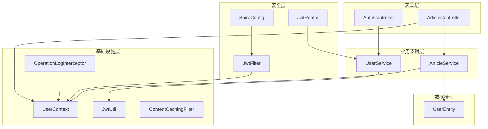
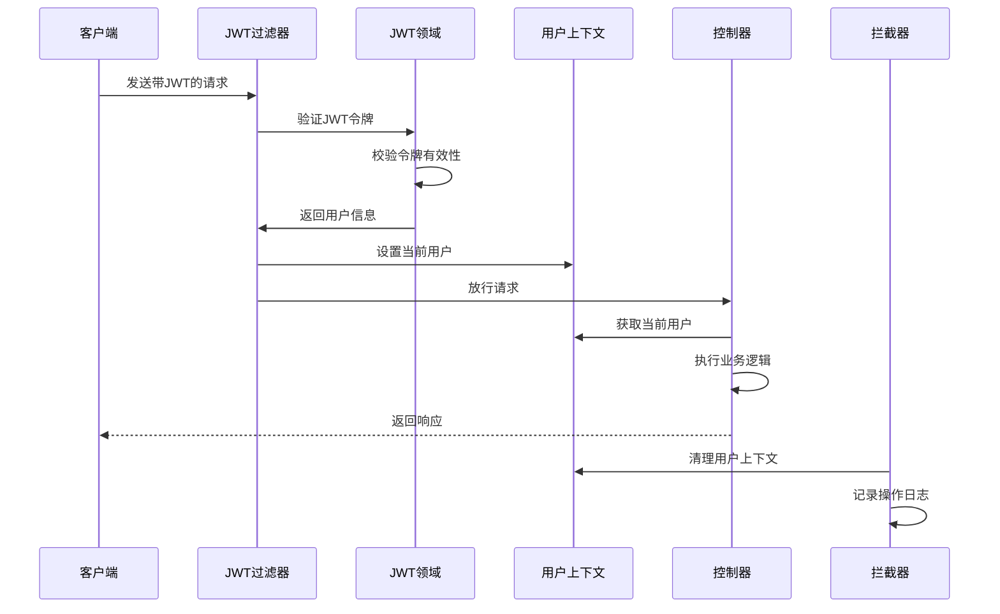
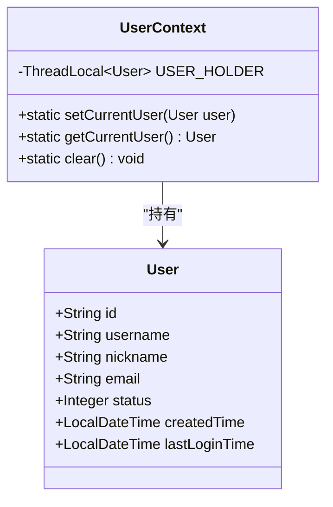
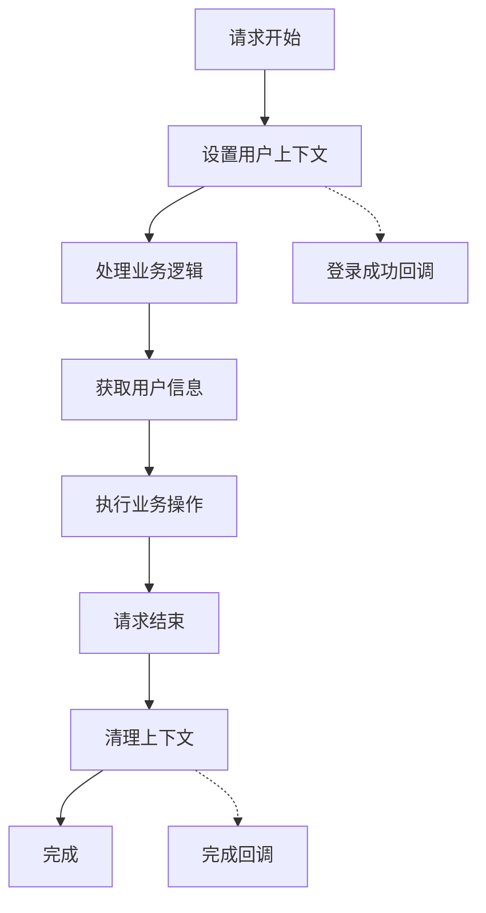
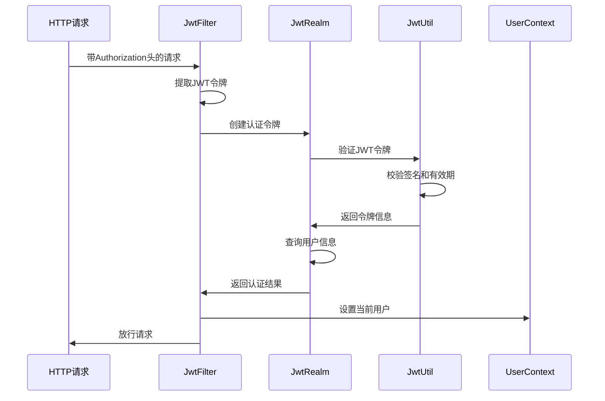
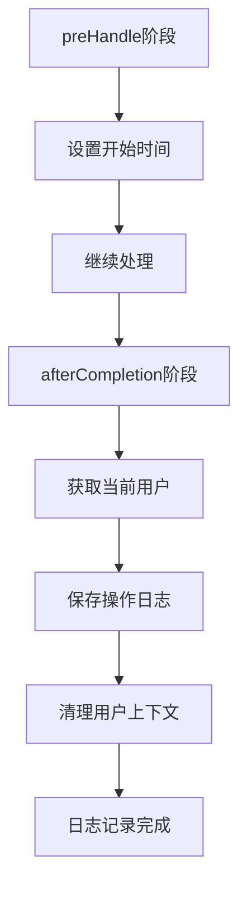
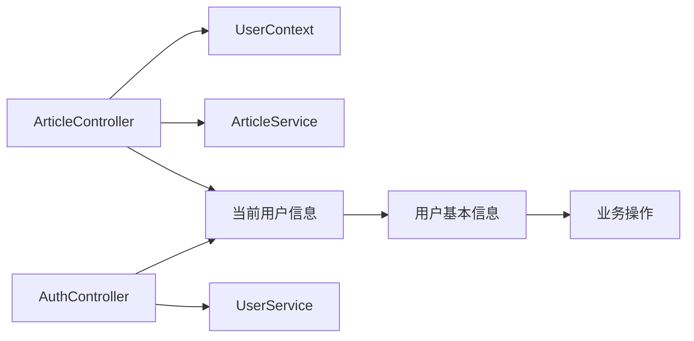
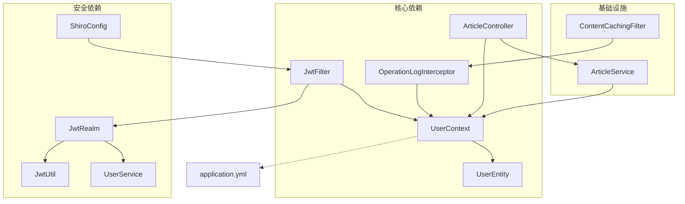

# 用户上下文管理系统

<cite>
**本文档引用的文件**
- [UserContext.java](file://src/main/java/com/zhishilu/util/UserContext.java)
- [JwtFilter.java](file://src/main/java/com/zhishilu/shiro/JwtFilter.java)
- [OperationLogInterceptor.java](file://src/main/java/com/zhishilu/interceptor/OperationLogInterceptor.java)
- [ArticleController.java](file://src/main/java/com/zhishilu/controller/ArticleController.java)
- [UserService.java](file://src/main/java/com/zhishilu/service/UserService.java)
- [JwtUtil.java](file://src/main/java/com/zhishilu/util/JwtUtil.java)
- [JwtRealm.java](file://src/main/java/com/zhishilu/shiro/JwtRealm.java)
- [ShiroConfig.java](file://src/main/java/com/zhishilu/config/ShiroConfig.java)
- [ContentCachingFilter.java](file://src/main/java/com/zhishilu/filter/ContentCachingFilter.java)
- [User.java](file://src/main/java/com/zhishilu/entity/User.java)
- [application.yml](file://src/main/resources/application.yml)
</cite>

## 目录
1. [简介](#简介)
2. [项目结构](#项目结构)
3. [核心组件](#核心组件)
4. [架构概览](#架构概览)
5. [详细组件分析](#详细组件分析)
6. [依赖关系分析](#依赖关系分析)
7. [性能考虑](#性能考虑)
8. [故障排除指南](#故障排除指南)
9. [结论](#结论)

## 简介

用户上下文管理系统是本项目中实现多线程安全的用户信息管理机制的核心组件。该系统基于ThreadLocal技术，在每个线程的执行周期内维护当前登录用户的上下文信息，确保在复杂的业务流程中能够安全、高效地访问用户信息。

系统采用JWT（JSON Web Token）认证机制，结合Spring Boot的拦截器和过滤器，实现了完整的用户认证、授权和上下文管理流程。通过精心设计的生命周期管理，系统能够在请求开始时注入用户信息，在请求结束时自动清理资源，有效防止内存泄漏。

## 项目结构

该项目采用标准的Spring Boot分层架构，用户上下文管理相关的组件分布如下：

**图表来源**
- [UserContext.java](file://src/main/java/com/zhishilu/util/UserContext.java#L1-L33)
- [JwtFilter.java](file://src/main/java/com/zhishilu/shiro/JwtFilter.java#L1-L109)
- [OperationLogInterceptor.java](file://src/main/java/com/zhishilu/interceptor/OperationLogInterceptor.java#L1-L128)

**章节来源**
- [UserContext.java](file://src/main/java/com/zhishilu/util/UserContext.java#L1-L33)
- [ShiroConfig.java](file://src/main/java/com/zhishilu/config/ShiroConfig.java#L1-L72)

## 核心组件

### UserContext类设计

UserContext是整个用户上下文管理系统的核心，采用了单例模式和ThreadLocal技术来实现线程安全的用户信息存储。

#### 设计理念

1. **线程隔离性**：每个Java线程拥有独立的ThreadLocal实例，确保多线程环境下用户信息不会相互干扰
2. **生命周期管理**：与请求生命周期绑定，在请求开始时设置，在请求结束时清理
3. **简单易用**：提供静态方法接口，降低使用复杂度
4. **内存安全**：及时清理不再使用的上下文信息，防止内存泄漏

#### 核心方法

- `setCurrentUser(User user)`：设置当前线程的用户信息
- `getCurrentUser()`：获取当前线程的用户信息
- `clear()`：清理当前线程的用户信息

**章节来源**
- [UserContext.java](file://src/main/java/com/zhishilu/util/UserContext.java#L8-L32)

### 认证流程集成

系统通过多种方式集成用户上下文管理：

1. **JWT过滤器集成**：在认证成功后自动设置用户上下文
2. **拦截器集成**：在请求完成后自动清理用户上下文
3. **控制器集成**：在业务处理过程中直接访问用户信息

**章节来源**
- [JwtFilter.java](file://src/main/java/com/zhishilu/shiro/JwtFilter.java#L70-L75)
- [OperationLogInterceptor.java](file://src/main/java/com/zhishilu/interceptor/OperationLogInterceptor.java#L60-L64)

## 架构概览

用户上下文管理系统在整个应用架构中的位置和交互关系如下：

**图表来源**
- [JwtFilter.java](file://src/main/java/com/zhishilu/shiro/JwtFilter.java#L69-L75)
- [OperationLogInterceptor.java](file://src/main/java/com/zhishilu/interceptor/OperationLogInterceptor.java#L38-L64)

## 详细组件分析

### UserContext类深度解析

#### 类结构设计

**图表来源**
- [UserContext.java](file://src/main/java/com/zhishilu/util/UserContext.java#L8-L32)
- [User.java](file://src/main/java/com/zhishilu/entity/User.java#L15-L67)

#### ThreadLocal实现原理

UserContext使用ThreadLocal作为底层存储机制，其核心优势包括：

1. **线程隔离**：每个线程都有独立的存储空间
2. **零竞争**：避免了多线程同步开销
3. **自动清理**：线程结束时自动释放内存

#### 生命周期管理

**图表来源**
- [JwtFilter.java](file://src/main/java/com/zhishilu/shiro/JwtFilter.java#L70-L75)
- [OperationLogInterceptor.java](file://src/main/java/com/zhishilu/interceptor/OperationLogInterceptor.java#L38-L64)

**章节来源**
- [UserContext.java](file://src/main/java/com/zhishilu/util/UserContext.java#L10-L31)

### JWT认证集成

#### JwtFilter认证流程

JwtFilter负责处理JWT令牌的验证和用户上下文的设置：

**图表来源**
- [JwtFilter.java](file://src/main/java/com/zhishilu/shiro/JwtFilter.java#L39-L75)
- [JwtRealm.java](file://src/main/java/com/zhishilu/shiro/JwtRealm.java#L44-L69)

#### 认证失败处理

系统提供了完善的认证失败处理机制：

1. **令牌缺失**：返回401未授权状态
2. **令牌无效**：返回具体的错误信息
3. **用户不存在**：抛出认证异常
4. **账户禁用**：拒绝访问

**章节来源**
- [JwtFilter.java](file://src/main/java/com/zhishilu/shiro/JwtFilter.java#L77-L85)
- [JwtRealm.java](file://src/main/java/com/zhishilu/shiro/JwtRealm.java#L47-L66)

### 操作日志拦截器

#### 上下文清理机制

OperationLogInterceptor实现了完整的上下文生命周期管理：

**图表来源**
- [OperationLogInterceptor.java](file://src/main/java/com/zhishilu/interceptor/OperationLogInterceptor.java#L38-L64)

#### 异步日志记录

系统采用异步方式记录操作日志，避免阻塞主线程：

1. **非阻塞处理**：日志记录不影响主要业务逻辑
2. **异常隔离**：日志记录异常不影响主业务流程
3. **资源回收**：及时清理临时资源

**章节来源**
- [OperationLogInterceptor.java](file://src/main/java/com/zhishilu/interceptor/OperationLogInterceptor.java#L55-L64)

### 控制器集成使用

#### 在控制器中获取用户信息

多个控制器都集成了用户上下文管理：

**图表来源**
- [ArticleController.java](file://src/main/java/com/zhishilu/controller/ArticleController.java#L32-L85)

#### 权限控制实现

通过UserContext获取的用户信息，系统实现了精细的权限控制：

1. **创建操作**：记录创建者信息
2. **更新操作**：验证操作者权限
3. **删除操作**：检查所有权

**章节来源**
- [ArticleController.java](file://src/main/java/com/zhishilu/controller/ArticleController.java#L32-L85)
- [ArticleService.java](file://src/main/java/com/zhishilu/service/ArticleService.java#L64-L103)

## 依赖关系分析

### 组件依赖图

**图表来源**
- [UserContext.java](file://src/main/java/com/zhishilu/util/UserContext.java#L3-L4)
- [JwtFilter.java](file://src/main/java/com/zhishilu/shiro/JwtFilter.java#L5-L6)
- [OperationLogInterceptor.java](file://src/main/java/com/zhishilu/interceptor/OperationLogInterceptor.java#L4-L6)

### 配置依赖

系统配置对用户上下文管理的影响：

1. **JWT配置**：影响令牌验证和用户信息提取
2. **Shiro配置**：决定认证流程和过滤器链
3. **日志配置**：影响操作日志的记录行为

**章节来源**
- [application.yml](file://src/main/resources/application.yml#L26-L31)
- [ShiroConfig.java](file://src/main/java/com/zhishilu/config/ShiroConfig.java#L44-L69)

## 性能考虑

### ThreadLocal性能特性

1. **零竞争优势**：避免了锁竞争，提高并发性能
2. **内存分配**：每次线程创建时分配内存，但随线程销毁而释放
3. **GC友好**：线程结束时自动清理，无内存泄漏风险

### 最佳实践建议

1. **及时清理**：在请求结束时必须调用clear()方法
2. **异常处理**：确保在异常情况下也能清理上下文
3. **内存监控**：定期监控ThreadLocal的内存使用情况
4. **超时设置**：合理设置JWT令牌的有效期

### 性能优化策略

1. **懒加载**：只在需要时才设置用户上下文
2. **批量处理**：在批处理任务中谨慎使用ThreadLocal
3. **连接池**：配合数据库连接池使用，避免连接泄漏

## 故障排除指南

### 常见问题及解决方案

#### 内存泄漏问题

**症状**：应用长时间运行后内存持续增长

**原因分析**：
- 未在请求结束时调用UserContext.clear()
- 异步任务中持有ThreadLocal引用
- 线程池复用导致上下文残留

**解决方案**：
1. 确保所有请求都经过OperationLogInterceptor
2. 在自定义线程中手动清理上下文
3. 使用try-finally确保清理操作执行

#### 并发访问问题

**症状**：多线程环境下用户信息错乱

**原因分析**：
- 错误地在静态方法中使用ThreadLocal
- 线程池配置不当
- 异步操作中上下文丢失

**解决方案**：
1. 确保UserContext始终使用静态方法
2. 配置合适的线程池大小
3. 在异步任务中显式传递用户信息

#### 认证失败问题

**症状**：用户无法登录或频繁登出

**排查步骤**：
1. 检查JWT密钥配置
2. 验证令牌有效期设置
3. 确认用户状态正常
4. 查看Shiro过滤器配置

**章节来源**
- [OperationLogInterceptor.java](file://src/main/java/com/zhishilu/interceptor/OperationLogInterceptor.java#L60-L64)
- [JwtFilter.java](file://src/main/java/com/zhishilu/shiro/JwtFilter.java#L77-L85)

### 调试技巧

1. **日志监控**：启用详细的调试日志
2. **内存分析**：使用JVM工具监控ThreadLocal使用
3. **性能测试**：模拟高并发场景测试系统稳定性
4. **单元测试**：编写针对上下文管理的测试用例

## 结论

用户上下文管理系统通过精心设计的ThreadLocal架构，为Spring Boot应用提供了高效、安全的多线程用户信息管理方案。系统的主要优势包括：

1. **线程安全**：完全避免了多线程环境下的数据竞争
2. **性能优异**：零锁竞争的访问模式
3. **易于使用**：简单的静态方法接口
4. **生命周期完整**：从请求开始到结束的完整管理

通过与JWT认证、拦截器和过滤器的深度集成，系统实现了从认证到业务处理再到资源清理的完整闭环。这种设计不仅保证了系统的可靠性，也为后续的功能扩展奠定了良好的基础。

建议在生产环境中重点关注内存管理和异常处理，确保系统在高并发场景下的稳定运行。同时，定期进行性能监控和优化，保持系统的最佳运行状态。