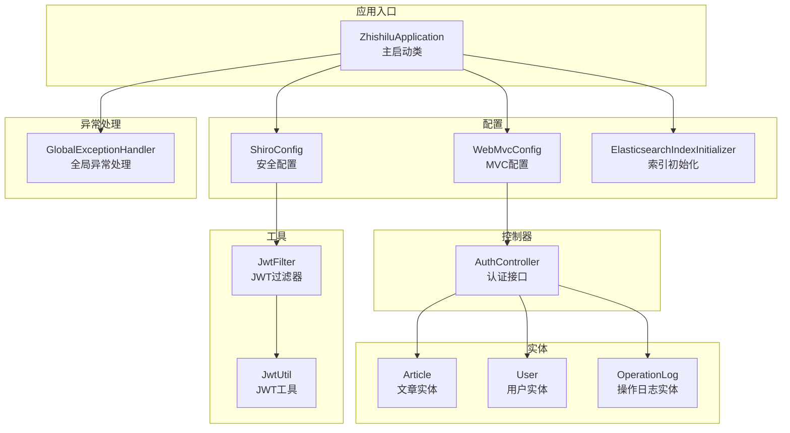
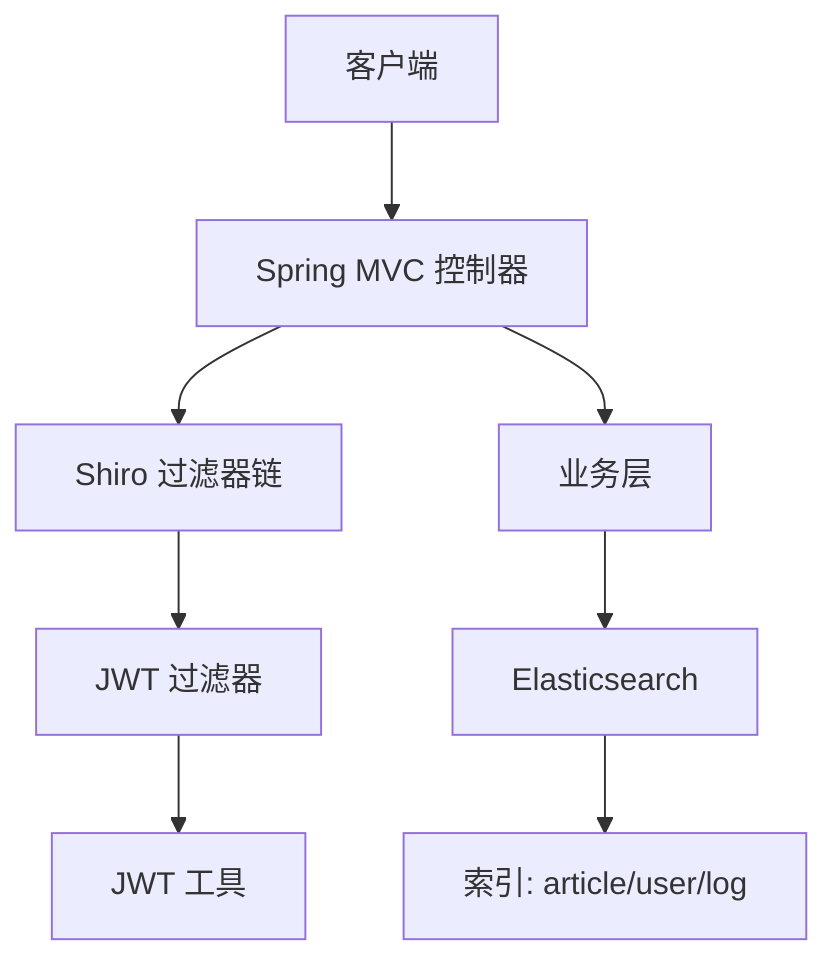
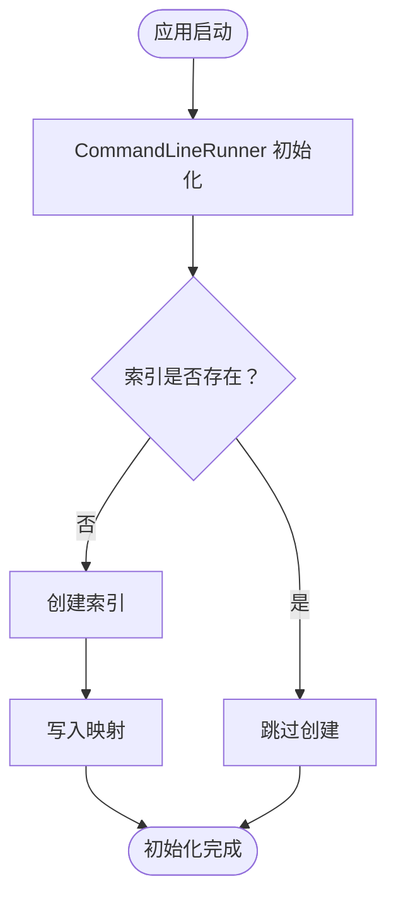
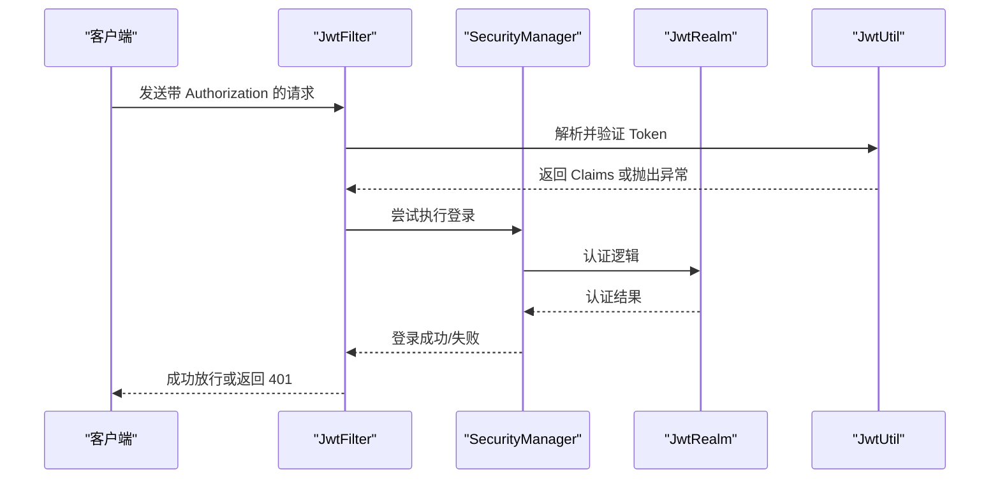
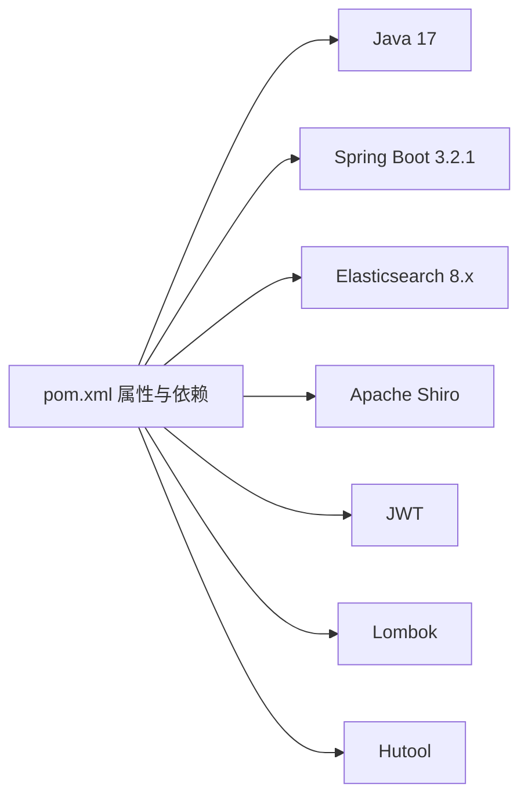

# 快速开始

<cite>
**本文引用的文件**
- [pom.xml](file://pom.xml)
- [application.yml](file://src/main/resources/application.yml)
- [README.md](file://README.md)
- [ZhishiluApplication.java](file://src/main/java/com/zhishilu/ZhishiluApplication.java)
- [ElasticsearchIndexInitializer.java](file://src/main/java/com/zhishilu/config/ElasticsearchIndexInitializer.java)
- [ShiroConfig.java](file://src/main/java/com/zhishilu/config/ShiroConfig.java)
- [WebMvcConfig.java](file://src/main/java/com/zhishilu/config/WebMvcConfig.java)
- [Article.java](file://src/main/java/com/zhishilu/entity/Article.java)
- [User.java](file://src/main/java/com/zhishilu/entity/User.java)
- [OperationLog.java](file://src/main/java/com/zhishilu/entity/OperationLog.java)
- [AuthController.java](file://src/main/java/com/zhishilu/controller/AuthController.java)
- [JwtFilter.java](file://src/main/java/com/zhishilu/shiro/JwtFilter.java)
- [JwtUtil.java](file://src/main/java/com/zhishilu/util/JwtUtil.java)
- [GlobalExceptionHandler.java](file://src/main/java/com/zhishilu/exception/GlobalExceptionHandler.java)
</cite>

## 目录
1. [简介](#简介)
2. [项目结构](#项目结构)
3. [核心组件](#核心组件)
4. [架构总览](#架构总览)
5. [详细组件分析](#详细组件分析)
6. [依赖关系分析](#依赖关系分析)
7. [性能考虑](#性能考虑)
8. [故障排查指南](#故障排查指南)
9. [结论](#结论)
10. [附录](#附录)

## 简介
知拾录是一个基于 Spring Boot 的个人知识收藏管理系统，采用 Java 17 + Spring Boot 3.2.1 + Elasticsearch 8.x 技术栈，提供用户认证、内容管理、全文检索、文件上传与操作日志等功能。本指南面向首次接触项目的开发者，提供从环境准备到项目启动、配置验证的完整流程，并给出常见问题排查建议。

## 项目结构
项目采用标准的 Spring Boot Maven 结构，核心模块包括：
- 启动类：负责应用启动
- 配置类：包含 Shiro、Web MVC、异步、Elasticsearch 初始化等
- 控制器：对外提供认证、文章、文件等接口
- 实体类：Article、User、OperationLog，映射到 Elasticsearch 索引
- 工具类：JWT 工具、用户上下文
- 异常处理：全局异常统一处理

图表来源
- [ZhishiluApplication.java](file://src/main/java/com/zhishilu/ZhishiluApplication.java#L10-L15)
- [ShiroConfig.java](file://src/main/java/com/zhishilu/config/ShiroConfig.java#L20-L71)
- [WebMvcConfig.java](file://src/main/java/com/zhishilu/config/WebMvcConfig.java#L14-L51)
- [ElasticsearchIndexInitializer.java](file://src/main/java/com/zhishilu/config/ElasticsearchIndexInitializer.java#L16-L39)
- [AuthController.java](file://src/main/java/com/zhishilu/controller/AuthController.java#L17-L49)
- [Article.java](file://src/main/java/com/zhishilu/entity/Article.java#L13-L15)
- [User.java](file://src/main/java/com/zhishilu/entity/User.java#L13-L14)
- [OperationLog.java](file://src/main/java/com/zhishilu/entity/OperationLog.java#L13-L14)
- [JwtUtil.java](file://src/main/java/com/zhishilu/util/JwtUtil.java#L18-L20)
- [JwtFilter.java](file://src/main/java/com/zhishilu/shiro/JwtFilter.java#L27-L29)
- [GlobalExceptionHandler.java](file://src/main/java/com/zhishilu/exception/GlobalExceptionHandler.java#L20-L86)

章节来源
- [pom.xml](file://pom.xml#L1-L129)
- [application.yml](file://src/main/resources/application.yml#L1-L47)
- [README.md](file://README.md#L1-L133)

## 核心组件
- 应用启动类：负责加载 Spring Boot 应用上下文并启动服务
- 配置类：
  - ShiroConfig：配置安全管理器、过滤链与无 Session 模式
  - WebMvcConfig：跨域、拦截器、静态资源映射
  - ElasticsearchIndexInitializer：启动时自动创建并映射索引
- 控制器：提供认证、文章、文件等接口
- 实体类：Article、User、OperationLog，映射到 Elasticsearch 索引
- 工具类：JwtUtil、JwtFilter 提供 JWT 生成、解析与过滤逻辑
- 异常处理：统一处理业务、认证、授权、参数校验等异常

章节来源
- [ZhishiluApplication.java](file://src/main/java/com/zhishilu/ZhishiluApplication.java#L10-L15)
- [ShiroConfig.java](file://src/main/java/com/zhishilu/config/ShiroConfig.java#L20-L71)
- [WebMvcConfig.java](file://src/main/java/com/zhishilu/config/WebMvcConfig.java#L14-L51)
- [ElasticsearchIndexInitializer.java](file://src/main/java/com/zhishilu/config/ElasticsearchIndexInitializer.java#L16-L39)
- [AuthController.java](file://src/main/java/com/zhishilu/controller/AuthController.java#L17-L49)
- [Article.java](file://src/main/java/com/zhishilu/entity/Article.java#L13-L15)
- [User.java](file://src/main/java/com/zhishilu/entity/User.java#L13-L14)
- [OperationLog.java](file://src/main/java/com/zhishilu/entity/OperationLog.java#L13-L14)
- [JwtUtil.java](file://src/main/java/com/zhishilu/util/JwtUtil.java#L18-L20)
- [JwtFilter.java](file://src/main/java/com/zhishilu/shiro/JwtFilter.java#L27-L29)
- [GlobalExceptionHandler.java](file://src/main/java/com/zhishilu/exception/GlobalExceptionHandler.java#L20-L86)

## 架构总览
系统采用前后端分离模式，后端通过 Spring MVC 暴露 REST 接口，使用 Shiro + JWT 实现无状态认证，Elasticsearch 存储文章、用户与操作日志数据。启动时自动初始化索引并建立映射，确保服务可用性。

图表来源
- [ShiroConfig.java](file://src/main/java/com/zhishilu/config/ShiroConfig.java#L44-L70)
- [JwtFilter.java](file://src/main/java/com/zhishilu/shiro/JwtFilter.java#L29-L85)
- [JwtUtil.java](file://src/main/java/com/zhishilu/util/JwtUtil.java#L20-L43)
- [ElasticsearchIndexInitializer.java](file://src/main/java/com/zhishilu/config/ElasticsearchIndexInitializer.java#L23-L38)
- [Article.java](file://src/main/java/com/zhishilu/entity/Article.java#L13-L15)
- [User.java](file://src/main/java/com/zhishilu/entity/User.java#L13-L14)
- [OperationLog.java](file://src/main/java/com/zhishilu/entity/OperationLog.java#L13-L14)

## 详细组件分析

### Elasticsearch 配置与索引初始化
- 默认连接：localhost:9200，用户名 elastic，密码 changeme
- 启动时自动创建以下索引并写入映射：
  - zhishilu_article（文章）
  - zhishilu_user（用户）
  - zhishilu_log（操作日志）
- 索引分片与副本：每个索引设置为 1 片分片，0 个副本

图表来源
- [ElasticsearchIndexInitializer.java](file://src/main/java/com/zhishilu/config/ElasticsearchIndexInitializer.java#L23-L38)
- [Article.java](file://src/main/java/com/zhishilu/entity/Article.java#L13-L15)
- [User.java](file://src/main/java/com/zhishilu/entity/User.java#L13-L14)
- [OperationLog.java](file://src/main/java/com/zhishilu/entity/OperationLog.java#L13-L14)

章节来源
- [application.yml](file://src/main/resources/application.yml#L13-L18)
- [ElasticsearchIndexInitializer.java](file://src/main/java/com/zhishilu/config/ElasticsearchIndexInitializer.java#L16-L39)
- [Article.java](file://src/main/java/com/zhishilu/entity/Article.java#L13-L15)
- [User.java](file://src/main/java/com/zhishilu/entity/User.java#L13-L14)
- [OperationLog.java](file://src/main/java/com/zhishilu/entity/OperationLog.java#L13-L14)

### 认证与权限控制（Shiro + JWT）
- 安全管理器：关闭 Shiro 自带 Session，使用无状态认证
- 过滤链：
  - 公开接口：/auth/**、/file/download/**、/swagger-ui/**、/v3/api-docs/**、/error
  - 其余接口需通过 JWT 认证
- JWT 过滤器：
  - 从请求头 Authorization 中提取 Bearer Token
  - 登录成功后将用户信息写入上下文
  - 登录失败或未登录返回 401

图表来源
- [ShiroConfig.java](file://src/main/java/com/zhishilu/config/ShiroConfig.java#L26-L70)
- [JwtFilter.java](file://src/main/java/com/zhishilu/shiro/JwtFilter.java#L39-L85)
- [JwtUtil.java](file://src/main/java/com/zhishilu/util/JwtUtil.java#L47-L74)
- [AuthController.java](file://src/main/java/com/zhishilu/controller/AuthController.java#L27-L40)

章节来源
- [ShiroConfig.java](file://src/main/java/com/zhishilu/config/ShiroConfig.java#L20-L71)
- [JwtFilter.java](file://src/main/java/com/zhishilu/shiro/JwtFilter.java#L27-L109)
- [JwtUtil.java](file://src/main/java/com/zhishilu/util/JwtUtil.java#L18-L99)
- [AuthController.java](file://src/main/java/com/zhishilu/controller/AuthController.java#L17-L49)

### Web MVC 配置
- CORS：允许任意来源、方法与头部，支持凭据与缓存
- 拦截器：对所有接口记录操作日志，排除错误与文档接口
- 静态资源：映射 /uploads/** 到本地目录 ./uploads/

章节来源
- [WebMvcConfig.java](file://src/main/java/com/zhishilu/config/WebMvcConfig.java#L14-L51)

### 全局异常处理
- 业务异常：返回自定义错误码与消息
- 认证异常：返回 401
- 授权异常：返回 403
- 参数校验异常：收集字段错误并返回
- 其他异常：返回 500 并记录日志

章节来源
- [GlobalExceptionHandler.java](file://src/main/java/com/zhishilu/exception/GlobalExceptionHandler.java#L20-L86)

## 依赖关系分析
- Java 17：项目属性指定
- Spring Boot 3.2.1：父 POM 提供
- Elasticsearch 8.x：starter-data-elasticsearch
- Shiro + JWT：认证鉴权
- Lombok：简化实体类与配置类
- Hutool：工具类库
- Maven 插件：spring-boot-maven-plugin

图表来源
- [pom.xml](file://pom.xml#L21-L110)

章节来源
- [pom.xml](file://pom.xml#L1-L129)

## 性能考虑
- 索引分片与副本：默认 1 片分片、0 副本，适合开发环境；生产环境可根据数据规模调整
- 日志级别：开发阶段开启 DEBUG，生产环境建议调整为 INFO
- 文件上传大小限制：单文件最大 50MB，请求总大小 100MB
- Elasticsearch 连接超时：连接超时 5s，Socket 超时 30s，可根据网络状况调整

章节来源
- [application.yml](file://src/main/resources/application.yml#L1-L47)
- [ElasticsearchIndexInitializer.java](file://src/main/java/com/zhishilu/config/ElasticsearchIndexInitializer.java#L13-L14)

## 故障排查指南
- Elasticsearch 无法连接
  - 检查 application.yml 中 uris、username、password 是否正确
  - 确认 Elasticsearch 服务已启动且可访问
  - 参考：[application.yml](file://src/main/resources/application.yml#L13-L18)
- 索引未创建或映射缺失
  - 重启应用触发 CommandLineRunner 初始化
  - 查看日志中“Elasticsearch索引初始化完成”
  - 参考：[ElasticsearchIndexInitializer.java](file://src/main/java/com/zhishilu/config/ElasticsearchIndexInitializer.java#L23-L29)
- 认证失败返回 401
  - 确认请求头 Authorization 使用 Bearer Token
  - 检查 JWT 配置（secret、expiration）是否一致
  - 参考：[JwtFilter.java](file://src/main/java/com/zhishilu/shiro/JwtFilter.java#L90-L97)，[JwtUtil.java](file://src/main/java/com/zhishilu/util/JwtUtil.java#L22-L26)
- 跨域问题
  - CORS 已配置为允许任意来源与方法，检查前端请求是否符合
  - 参考：[WebMvcConfig.java](file://src/main/java/com/zhishilu/config/WebMvcConfig.java#L23-L31)
- 文件上传失败
  - 检查上传路径与类型配置，确认 ./uploads 目录存在且可写
  - 参考：[application.yml](file://src/main/resources/application.yml#L34-L37)，[WebMvcConfig.java](file://src/main/java/com/zhishilu/config/WebMvcConfig.java#L46-L50)

章节来源
- [application.yml](file://src/main/resources/application.yml#L13-L37)
- [ElasticsearchIndexInitializer.java](file://src/main/java/com/zhishilu/config/ElasticsearchIndexInitializer.java#L23-L29)
- [JwtFilter.java](file://src/main/java/com/zhishilu/shiro/JwtFilter.java#L90-L97)
- [JwtUtil.java](file://src/main/java/com/zhishilu/util/JwtUtil.java#L22-L26)
- [WebMvcConfig.java](file://src/main/java/com/zhishilu/config/WebMvcConfig.java#L23-L50)

## 结论
通过本指南，您可以在本地快速搭建知拾录开发环境并成功启动项目。建议在开发阶段保持 Elasticsearch 本地运行，按需调整索引分片与日志级别，并确保 JWT 配置与请求头格式正确。遇到问题时，优先检查 Elasticsearch 连接、索引初始化与认证头设置。

## 附录

### 环境要求与安装步骤
- 环境要求
  - JDK 17+
  - Maven 3.6+
  - Elasticsearch 8.x
- 安装与配置
  - 克隆项目后，根据需要修改 application.yml 中的 Elasticsearch 连接信息
  - 使用 Maven 启动应用
  - 访问接口前缀：http://localhost:8080/api

章节来源
- [README.md](file://README.md#L74-L98)
- [application.yml](file://src/main/resources/application.yml#L1-L47)
- [pom.xml](file://pom.xml#L21-L25)

### 配置示例与验证步骤
- Elasticsearch 配置示例
  - 修改 application.yml 中 spring.elasticsearch 节点
  - 示例参考：[application.yml](file://src/main/resources/application.yml#L13-L18)
- 项目启动命令
  - 使用 Maven 启动：mvn spring-boot:run
  - 参考：[README.md](file://README.md#L91-L94)
- 接口访问
  - 认证接口：POST /api/auth/register、POST /api/auth/login
  - 参考：[README.md](file://README.md#L51-L72)
- 验证步骤
  - 启动后查看日志中“Elasticsearch索引初始化完成”
  - 使用 Swagger 或 Postman 调用认证接口获取 Token
  - 在后续接口请求头中添加 Authorization: Bearer <token>

章节来源
- [application.yml](file://src/main/resources/application.yml#L13-L18)
- [README.md](file://README.md#L51-L98)
- [ElasticsearchIndexInitializer.java](file://src/main/java/com/zhishilu/config/ElasticsearchIndexInitializer.java#L23-L29)
- [AuthController.java](file://src/main/java/com/zhishilu/controller/AuthController.java#L27-L40)
- [JwtFilter.java](file://src/main/java/com/zhishilu/shiro/JwtFilter.java#L90-L97)