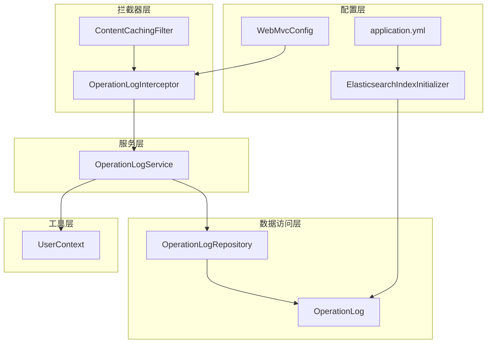
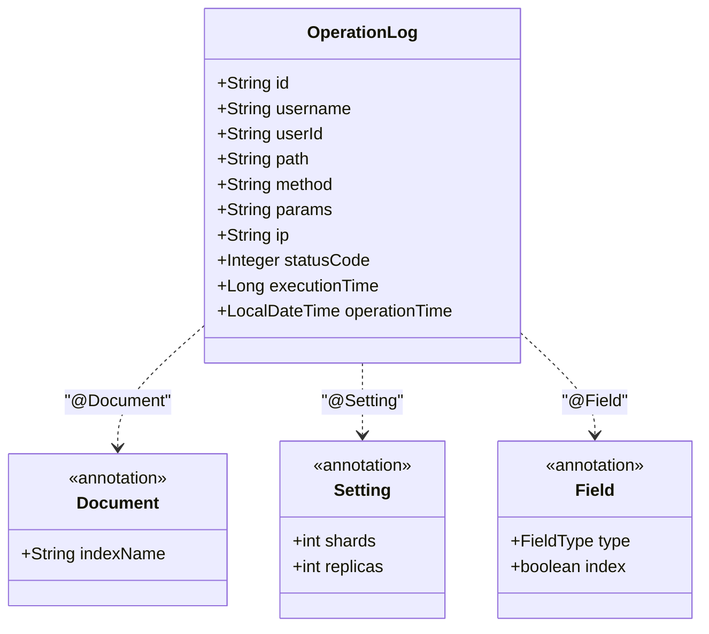
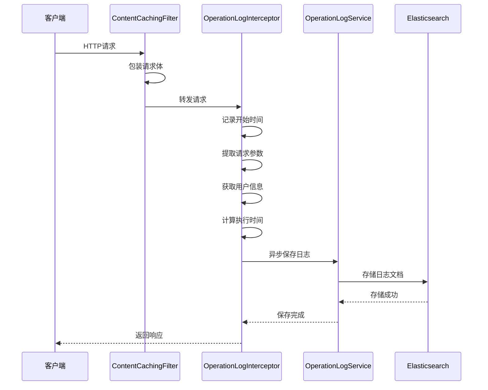
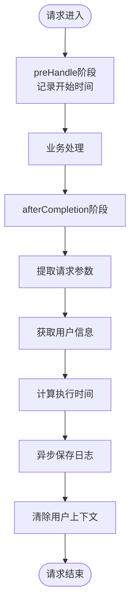
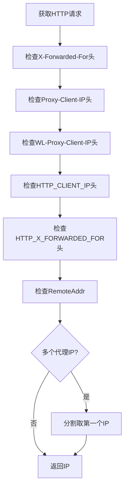
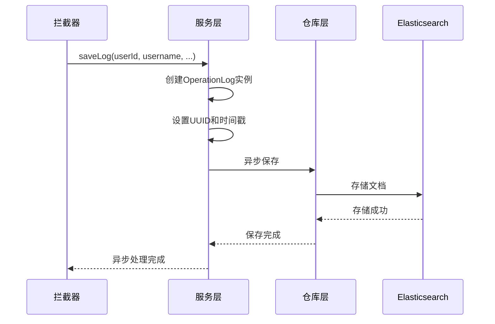
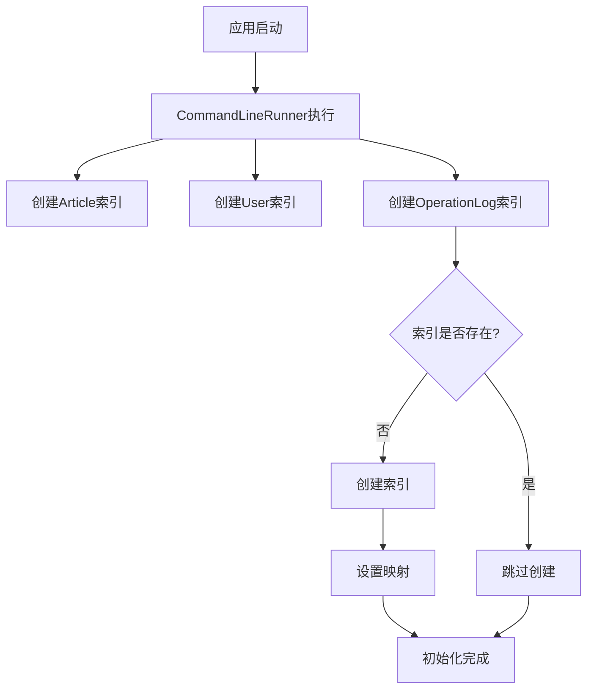
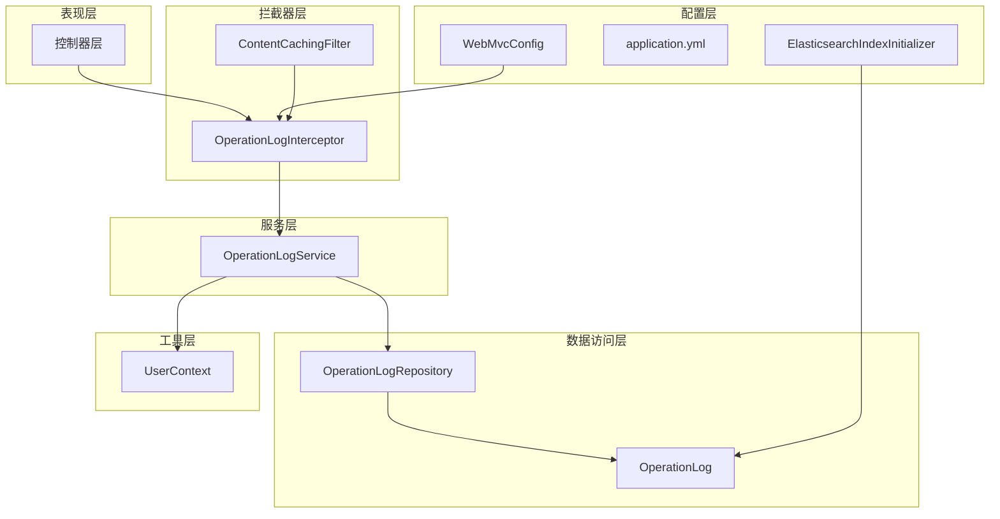
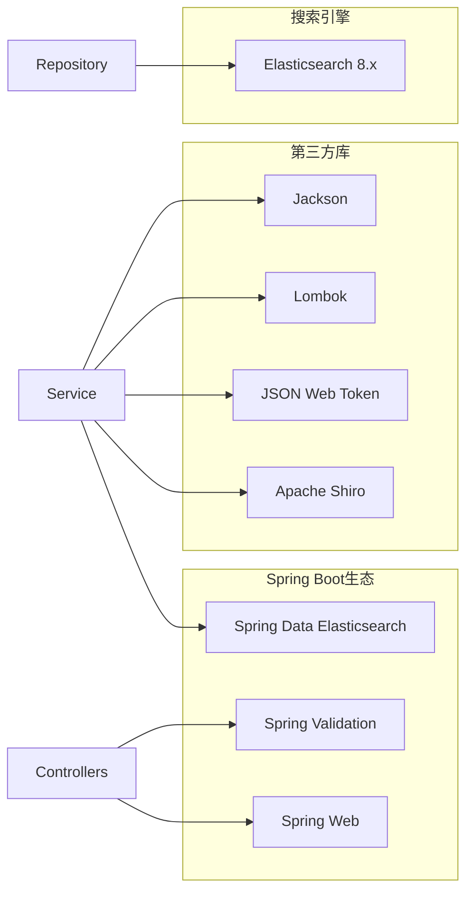

# 操作日志系统

<cite>
**本文档引用的文件**
- [OperationLog.java](file://src/main/java/com/zhishilu/entity/OperationLog.java)
- [OperationLogInterceptor.java](file://src/main/java/com/zhishilu/interceptor/OperationLogInterceptor.java)
- [OperationLogService.java](file://src/main/java/com/zhishilu/service/OperationLogService.java)
- [OperationLogRepository.java](file://src/main/java/com/zhishilu/repository/OperationLogRepository.java)
- [ElasticsearchIndexInitializer.java](file://src/main/java/com/zhishilu/config/ElasticsearchIndexInitializer.java)
- [WebMvcConfig.java](file://src/main/java/com/zhishilu/config/WebMvcConfig.java)
- [UserContext.java](file://src/main/java/com/zhishilu/util/UserContext.java)
- [ContentCachingFilter.java](file://src/main/java/com/zhishilu/filter/ContentCachingFilter.java)
- [application.yml](file://src/main/resources/application.yml)
- [README.md](file://README.md)
- [pom.xml](file://pom.xml)
</cite>

## 目录
1. [简介](#简介)
2. [项目结构](#项目结构)
3. [核心组件](#核心组件)
4. [架构概览](#架构概览)
5. [详细组件分析](#详细组件分析)
6. [依赖关系分析](#依赖关系分析)
7. [性能考量](#性能考量)
8. [故障排除指南](#故障排除指南)
9. [结论](#结论)
10. [附录](#附录)

## 简介

本项目是一个基于Spring Boot的个人知识管理系统，其中的操作日志系统实现了完整的请求拦截、参数提取、用户信息获取和日志记录功能。系统采用Elasticsearch作为日志存储引擎，通过Spring Data Elasticsearch进行数据持久化，并提供了异步日志记录机制以确保不影响主业务流程的性能。

该操作日志系统具有以下特点：
- 自动拦截所有HTTP请求，无需在业务代码中重复添加日志逻辑
- 支持请求参数和响应状态的完整记录
- 提供异步日志存储，避免阻塞主线程
- 集成用户上下文，自动记录操作用户信息
- 支持IP地址识别和执行时间统计

## 项目结构

项目采用标准的Spring Boot目录结构，操作日志相关的组件分布在以下模块中：



**图表来源**
- [WebMvcConfig.java](file://src/main/java/com/zhishilu/config/WebMvcConfig.java#L16-L41)
- [OperationLogInterceptor.java](file://src/main/java/com/zhishilu/interceptor/OperationLogInterceptor.java#L25-L64)
- [OperationLogService.java](file://src/main/java/com/zhishilu/service/OperationLogService.java#L19-L47)
- [OperationLogRepository.java](file://src/main/java/com/zhishilu/repository/OperationLogRepository.java#L10-L12)
- [ElasticsearchIndexInitializer.java](file://src/main/java/com/zhishilu/config/ElasticsearchIndexInitializer.java#L19-L38)

**章节来源**
- [README.md](file://README.md#L99-L133)
- [pom.xml](file://pom.xml#L27-L110)

## 核心组件

### 操作日志实体模型

操作日志实体类定义了完整的日志字段结构，采用Elasticsearch注解进行映射配置：



**图表来源**
- [OperationLog.java](file://src/main/java/com/zhishilu/entity/OperationLog.java#L13-L72)

### 字段定义与数据类型

| 字段名 | 类型 | 映射类型 | 索引策略 | 描述 |
|--------|------|----------|----------|------|
| id | String | Text | 默认 | 日志唯一标识符 |
| username | String | Keyword | 可搜索 | 操作用户名 |
| userId | String | Keyword | 可搜索 | 用户ID |
| path | String | Keyword | 可搜索 | 请求路径 |
| method | String | Keyword | 可搜索 | HTTP方法 |
| params | String | Text | 不建立倒排索引 | 请求参数JSON |
| ip | String | Keyword | 可搜索 | 客户端IP地址 |
| statusCode | Integer | Integer | 数值索引 | HTTP响应状态码 |
| executionTime | Long | Long | 数值索引 | 执行时间(毫秒) |
| operationTime | LocalDateTime | Date | 日期索引 | 操作时间 |

**章节来源**
- [OperationLog.java](file://src/main/java/com/zhishilu/entity/OperationLog.java#L15-L72)

## 架构概览

操作日志系统采用拦截器模式，在请求生命周期的关键节点进行日志记录：



**图表来源**
- [ContentCachingFilter.java](file://src/main/java/com/zhishilu/filter/ContentCachingFilter.java#L22-L32)
- [OperationLogInterceptor.java](file://src/main/java/com/zhishilu/interceptor/OperationLogInterceptor.java#L32-L64)
- [OperationLogService.java](file://src/main/java/com/zhishilu/service/OperationLogService.java#L26-L47)

## 详细组件分析

### 操作日志拦截器实现

拦截器负责在请求处理的各个阶段提取必要的日志信息：

#### 请求拦截流程



**图表来源**
- [OperationLogInterceptor.java](file://src/main/java/com/zhishilu/interceptor/OperationLogInterceptor.java#L32-L64)

#### 参数提取机制

拦截器实现了多层次的参数提取策略：

1. **URL参数提取**：遍历所有请求参数名称，收集查询字符串参数
2. **请求体缓存**：通过ContentCachingRequestWrapper获取POST/PUT请求体
3. **参数限制**：对过长的请求体进行截断处理，防止日志过大
4. **JSON序列化**：使用ObjectMapper将参数转换为JSON格式

#### IP地址识别算法



**图表来源**
- [OperationLogInterceptor.java](file://src/main/java/com/zhishilu/interceptor/OperationLogInterceptor.java#L104-L126)

**章节来源**
- [OperationLogInterceptor.java](file://src/main/java/com/zhishilu/interceptor/OperationLogInterceptor.java#L25-L127)

### 日志服务层实现

服务层提供异步日志记录功能，确保不影响主业务流程：

#### 异步日志保存流程



**图表来源**
- [OperationLogService.java](file://src/main/java/com/zhishilu/service/OperationLogService.java#L26-L47)

#### 用户上下文管理

服务层通过UserContext获取当前登录用户信息，支持匿名用户的处理：

- **已登录用户**：记录用户ID和用户名
- **匿名用户**：用户名标记为"anonymous"
- **线程安全**：使用ThreadLocal确保多线程环境下的数据隔离

**章节来源**
- [OperationLogService.java](file://src/main/java/com/zhishilu/service/OperationLogService.java#L19-L47)
- [UserContext.java](file://src/main/java/com/zhishilu/util/UserContext.java#L8-L32)

### Elasticsearch集成配置

#### 索引初始化机制

系统在应用启动时自动创建必要的Elasticsearch索引：



**图表来源**
- [ElasticsearchIndexInitializer.java](file://src/main/java/com/zhishilu/config/ElasticsearchIndexInitializer.java#L23-L38)

#### 配置参数详解

| 配置项 | 默认值 | 描述 |
|--------|--------|------|
| spring.elasticsearch.uris | http://localhost:9200 | Elasticsearch连接地址 |
| spring.elasticsearch.username | elastic | 认证用户名 |
| spring.elasticsearch.password | changeme | 认证密码 |
| spring.elasticsearch.connection-timeout | 5s | 连接超时时间 |
| spring.elasticsearch.socket-timeout | 30s | Socket超时时间 |

**章节来源**
- [ElasticsearchIndexInitializer.java](file://src/main/java/com/zhishilu/config/ElasticsearchIndexInitializer.java#L19-L38)
- [application.yml](file://src/main/resources/application.yml#L13-L18)

## 依赖关系分析

系统各组件之间的依赖关系体现了清晰的分层架构：



**图表来源**
- [WebMvcConfig.java](file://src/main/java/com/zhishilu/config/WebMvcConfig.java#L16-L41)
- [OperationLogInterceptor.java](file://src/main/java/com/zhishilu/interceptor/OperationLogInterceptor.java#L25-L28)
- [OperationLogService.java](file://src/main/java/com/zhishilu/service/OperationLogService.java#L21-L21)

### 外部依赖关系

系统依赖的关键外部组件：



**图表来源**
- [pom.xml](file://pom.xml#L27-L110)

**章节来源**
- [pom.xml](file://pom.xml#L21-L25)

## 性能考量

### 异步处理机制

系统采用异步方式处理日志保存，避免阻塞主线程：

- **@Async注解**：使用Spring的异步执行机制
- **线程池配置**：默认使用Spring TaskExecutor
- **异常处理**：捕获并记录异步执行中的异常

### 内存优化策略

1. **请求体缓存**：通过ContentCachingRequestWrapper避免重复读取请求体
2. **参数长度限制**：对请求体进行截断处理，默认限制2000字符
3. **索引优化**：params字段不建立倒排索引，减少存储空间

### 查询性能优化建议

基于当前的字段设计，建议的查询优化策略：

1. **常用查询字段**：username、userId、path、method、ip
2. **时间范围查询**：利用operationTime字段进行范围查询
3. **数值范围查询**：executionTime、statusCode字段支持范围查询
4. **组合查询**：支持多字段组合查询以提高准确性

## 故障排除指南

### 常见问题及解决方案

#### Elasticsearch连接问题

**症状**：应用启动时报ES连接错误
**原因**：Elasticsearch服务未启动或配置错误
**解决方案**：
1. 检查application.yml中的ES配置
2. 确认Elasticsearch服务正常运行
3. 验证网络连通性和认证信息

#### 日志记录失败

**症状**：日志保存出现异常但不影响业务
**原因**：ES存储异常或网络问题
**解决方案**：
1. 检查ES集群状态
2. 查看应用日志中的错误信息
3. 验证索引映射配置

#### 拦截器不生效

**症状**：请求没有被拦截器处理
**原因**：拦截器配置或过滤器顺序问题
**解决方案**：
1. 检查WebMvcConfig中的拦截器配置
2. 确认ContentCachingFilter的过滤顺序
3. 验证排除路径配置

**章节来源**
- [OperationLogInterceptor.java](file://src/main/java/com/zhishilu/interceptor/OperationLogInterceptor.java#L58-L63)
- [ElasticsearchIndexInitializer.java](file://src/main/java/com/zhishilu/config/ElasticsearchIndexInitializer.java#L23-L38)

## 结论

本操作日志系统通过精心设计的架构实现了高效、可靠的日志记录功能。系统的主要优势包括：

1. **自动化程度高**：无需在业务代码中添加日志逻辑
2. **性能影响小**：异步处理机制确保不影响主业务流程
3. **扩展性强**：基于Spring Boot的模块化设计便于功能扩展
4. **可靠性高**：完善的异常处理和错误恢复机制

系统在Elasticsearch的使用上采用了合理的字段设计和索引策略，既保证了查询效率，又控制了存储成本。通过用户上下文管理和IP地址识别，系统能够提供准确的操作审计信息。

## 附录

### 使用示例

#### 启用操作日志

系统默认启用所有请求的日志记录，可通过WebMvcConfig进行配置：

```java
// 在WebMvcConfig中配置拦截器
registry.addInterceptor(operationLogInterceptor)
        .addPathPatterns("/**")
        .excludePathPatterns("/error", "/swagger-ui/**", "/v3/api-docs/**");
```

#### 自定义日志字段

如需扩展日志字段，可修改OperationLog实体类：

```java
@Field(type = FieldType.Keyword)
private String customField;
```

#### 配置ES参数

在application.yml中调整Elasticsearch配置：

```yaml
spring:
  elasticsearch:
    uris: http://localhost:9200
    username: elastic
    password: changeme
    connection-timeout: 5s
    socket-timeout: 30s
```

### 监控集成建议

1. **日志聚合**：使用ELK Stack进行日志集中管理
2. **性能监控**：监控ES写入延迟和吞吐量
3. **告警机制**：设置ES连接异常和存储空间告警
4. **查询优化**：定期分析慢查询并优化索引策略