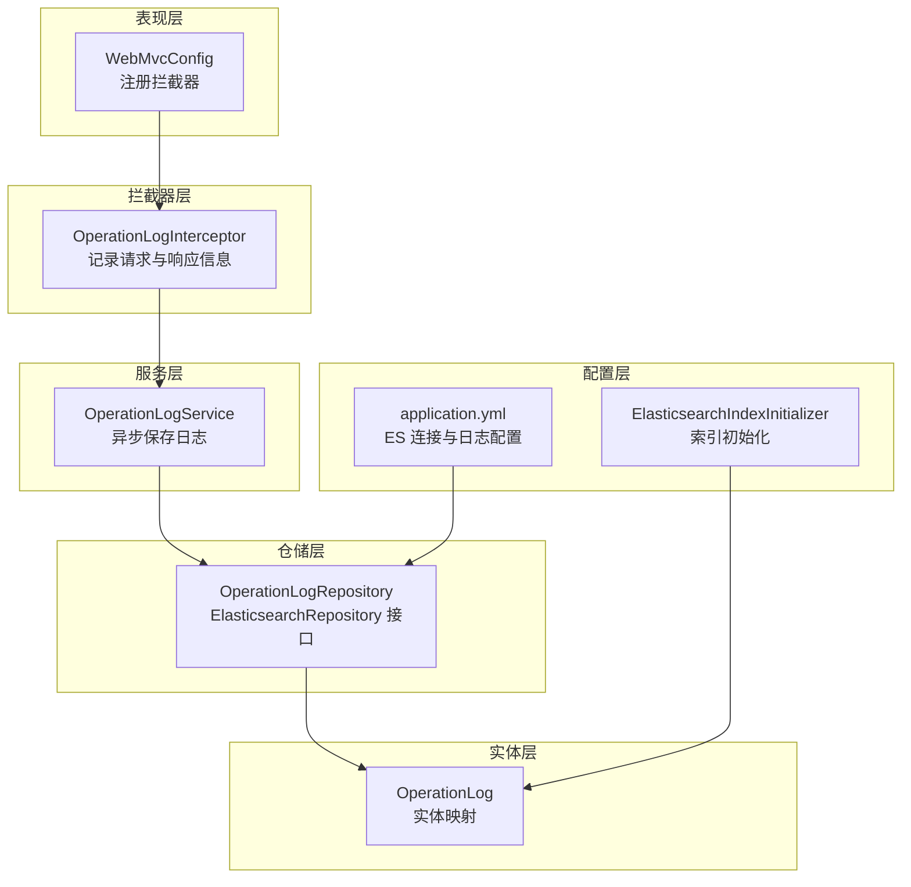
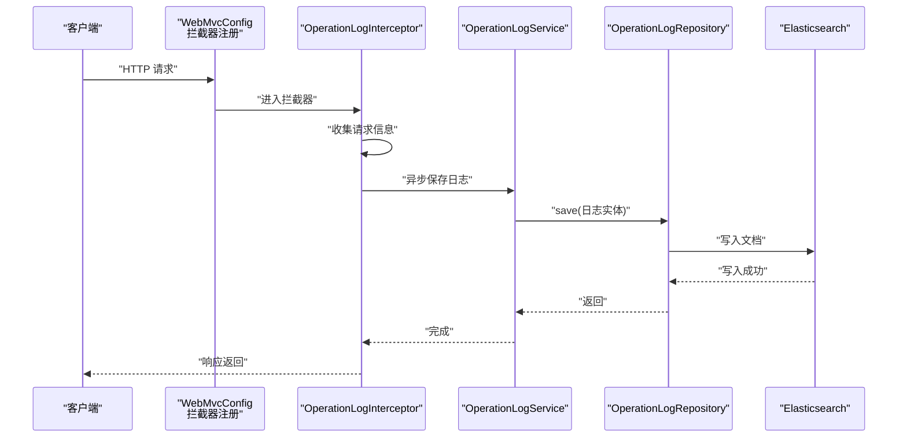
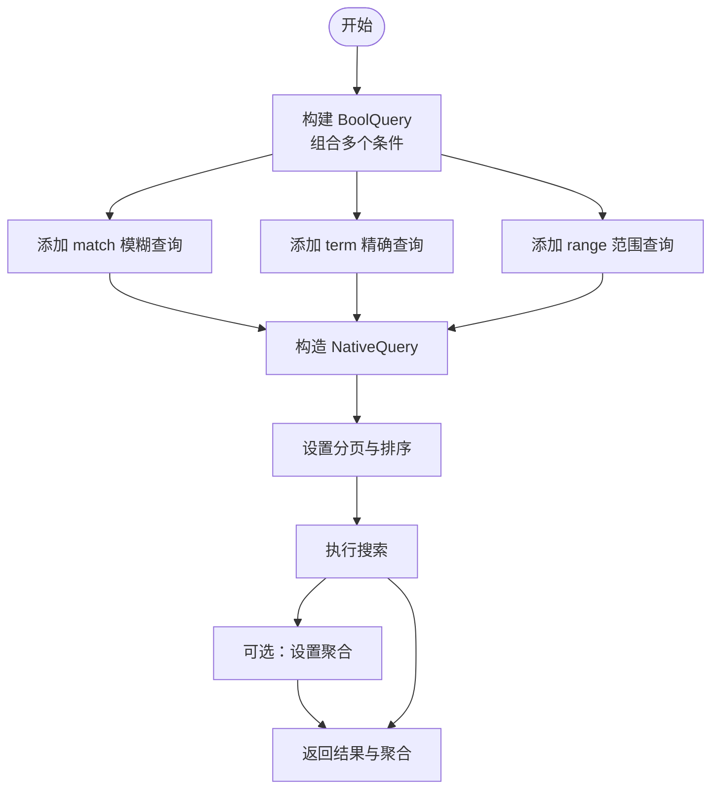
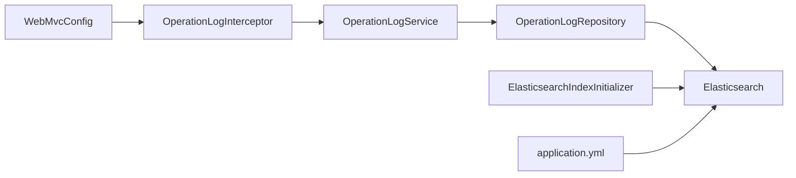

# 日志仓储层

<cite>
**本文引用的文件**   
- [OperationLog.java](file://src/main/java/com/zhishilu/entity/OperationLog.java)
- [OperationLogRepository.java](file://src/main/java/com/zhishilu/repository/OperationLogRepository.java)
- [OperationLogService.java](file://src/main/java/com/zhishilu/service/OperationLogService.java)
- [OperationLogInterceptor.java](file://src/main/java/com/zhishilu/interceptor/OperationLogInterceptor.java)
- [WebMvcConfig.java](file://src/main/java/com/zhishilu/config/WebMvcConfig.java)
- [ElasticsearchIndexInitializer.java](file://src/main/java/com/zhishilu/config/ElasticsearchIndexInitializer.java)
- [application.yml](file://src/main/resources/application.yml)
- [ArticleRepository.java](file://src/main/java/com/zhishilu/repository/ArticleRepository.java)
- [ArticleService.java](file://src/main/java/com/zhishilu/service/ArticleService.java)
- [ArticleQueryDTO.java](file://src/main/java/com/zhishilu/dto/ArticleQueryDTO.java)
- [PageResult.java](file://src/main/java/com/zhishilu/common/PageResult.java)
- [Result.java](file://src/main/java/com/zhishilu/common/Result.java)
- [pom.xml](file://pom.xml)
</cite>

## 目录
1. [简介](#简介)
2. [项目结构](#项目结构)
3. [核心组件](#核心组件)
4. [架构总览](#架构总览)
5. [详细组件分析](#详细组件分析)
6. [依赖关系分析](#依赖关系分析)
7. [性能考虑](#性能考虑)
8. [故障排查指南](#故障排查指南)
9. [结论](#结论)
10. [附录](#附录)

## 简介
本技术文档聚焦于“日志仓储层”的设计与实现，围绕 OperationLog 实体、OperationLogRepository 接口以及与之协同的拦截器、服务层、Web 配置和索引初始化器展开。重点阐述：
- 如何基于 Spring Data Elasticsearch 的接口继承与命名规范实现查询方法自动实现（精确匹配、范围查询、模糊查询）。
- 如何在现有仓储层基础上扩展复杂查询（多条件组合、聚合、分页）。
- 查询性能优化策略（索引优化、查询优化、缓存策略）。
- 仓储层与服务层协作模式（数据访问模式、异常处理、异步写入）。

## 项目结构
该项目采用分层架构，日志仓储层位于 repository 层，与 service 层、interceptor 层、config 层协同工作，通过 WebMvcConfig 注册拦截器，ElasticsearchIndexInitializer 在应用启动时创建索引，application.yml 提供连接信息与日志级别。

图表来源
- [WebMvcConfig.java](file://src/main/java/com/zhishilu/config/WebMvcConfig.java#L16-L41)
- [OperationLogInterceptor.java](file://src/main/java/com/zhishilu/interceptor/OperationLogInterceptor.java#L25-L64)
- [OperationLogService.java](file://src/main/java/com/zhishilu/service/OperationLogService.java#L19-L47)
- [OperationLogRepository.java](file://src/main/java/com/zhishilu/repository/OperationLogRepository.java#L11-L12)
- [ElasticsearchIndexInitializer.java](file://src/main/java/com/zhishilu/config/ElasticsearchIndexInitializer.java#L19-L38)
- [application.yml](file://src/main/resources/application.yml#L13-L18)
- [OperationLog.java](file://src/main/java/com/zhishilu/entity/OperationLog.java#L13-L14)

章节来源
- [WebMvcConfig.java](file://src/main/java/com/zhishilu/config/WebMvcConfig.java#L16-L41)
- [application.yml](file://src/main/resources/application.yml#L1-L47)

## 核心组件
- OperationLog 实体：定义日志字段及 ES 映射（keyword/text/date/long/int），并标注文档索引名称与分片副本设置。
- OperationLogRepository 接口：继承 ElasticsearchRepository，提供基础 CRUD 与查询能力；当前未声明自定义查询方法，查询逻辑由服务层使用 ElasticsearchOperations 实现。
- OperationLogService：封装异步保存日志的业务流程，包含异常捕获与日志输出。
- OperationLogInterceptor：在请求完成后收集用户、路径、方法、参数、IP、状态码、执行时间，并调用服务层异步保存。
- ElasticsearchIndexInitializer：应用启动时为 OperationLog 等实体创建索引与映射。
- WebMvcConfig：注册拦截器，排除 Swagger 等路径。

章节来源
- [OperationLog.java](file://src/main/java/com/zhishilu/entity/OperationLog.java#L13-L72)
- [OperationLogRepository.java](file://src/main/java/com/zhishilu/repository/OperationLogRepository.java#L11-L12)
- [OperationLogService.java](file://src/main/java/com/zhishilu/service/OperationLogService.java#L19-L47)
- [OperationLogInterceptor.java](file://src/main/java/com/zhishilu/interceptor/OperationLogInterceptor.java#L25-L64)
- [ElasticsearchIndexInitializer.java](file://src/main/java/com/zhishilu/config/ElasticsearchIndexInitializer.java#L19-L38)
- [WebMvcConfig.java](file://src/main/java/com/zhishilu/config/WebMvcConfig.java#L16-L41)

## 架构总览
下图展示一次请求从拦截器到仓储层的完整链路，以及与 ES 的交互方式。

图表来源
- [WebMvcConfig.java](file://src/main/java/com/zhishilu/config/WebMvcConfig.java#L36-L41)
- [OperationLogInterceptor.java](file://src/main/java/com/zhishilu/interceptor/OperationLogInterceptor.java#L38-L64)
- [OperationLogService.java](file://src/main/java/com/zhishilu/service/OperationLogService.java#L26-L47)
- [OperationLogRepository.java](file://src/main/java/com/zhishilu/repository/OperationLogRepository.java#L11-L12)

## 详细组件分析

### OperationLog 实体与映射
- 索引名称固定为 zhishilu_log，分片与副本在注解中设定。
- 关键字段映射：
  - keyword：username、userId、path、method、ip。
  - integer：statusCode。
  - long：executionTime。
  - date：operationTime。
  - text（不建倒排索引）：params，用于存储请求体，避免对大文本进行全文检索。
- 字段类型选择直接影响查询性能与存储成本。

章节来源
- [OperationLog.java](file://src/main/java/com/zhishilu/entity/OperationLog.java#L13-L72)

### OperationLogRepository 接口
- 当前接口仅继承 ElasticsearchRepository，未声明自定义查询方法。
- 可通过扩展接口添加按字段精确查询、范围查询、模糊查询等方法，遵循 Spring Data 方法命名规范即可自动生成查询实现。

章节来源
- [OperationLogRepository.java](file://src/main/java/com/zhishilu/repository/OperationLogRepository.java#L11-L12)

### OperationLogService 异步保存
- 使用 @Async 异步保存日志，避免阻塞主线程。
- 异常被捕获并记录，保证请求链路稳定性。
- 生成 UUID 作为文档 ID，确保唯一性。

章节来源
- [OperationLogService.java](file://src/main/java/com/zhishilu/service/OperationLogService.java#L19-L47)

### OperationLogInterceptor 收集与传输
- 在请求完成后计算执行时间，收集用户信息、路径、方法、参数、IP、状态码。
- 对请求体进行截断处理，防止日志过大。
- 异步调用服务层保存日志，最后清理用户上下文。

章节来源
- [OperationLogInterceptor.java](file://src/main/java/com/zhishilu/interceptor/OperationLogInterceptor.java#L38-L64)

### ElasticsearchIndexInitializer 索引初始化
- 应用启动时为 OperationLog 等实体创建索引并写入映射。
- 若索引已存在则跳过创建，避免重复初始化。

章节来源
- [ElasticsearchIndexInitializer.java](file://src/main/java/com/zhishilu/config/ElasticsearchIndexInitializer.java#L24-L38)

### 复杂查询实现范式（基于 ArticleService 的参考）
虽然日志仓储层当前未实现复杂查询，但可参考 ArticleService 的实现模式扩展：
- 多条件组合查询：使用 BoolQuery.Builder 组合 must/should/filter 等子句。
- 模糊查询：match 与 wildcard 等查询类型。
- 范围查询：range 查询日期、数值字段。
- 聚合查询：terms、date_histogram 等聚合统计。
- 分页查询：结合 PageRequest 与排序。

图表来源
- [ArticleService.java](file://src/main/java/com/zhishilu/service/ArticleService.java#L116-L168)
- [ArticleService.java](file://src/main/java/com/zhishilu/service/ArticleService.java#L173-L198)

章节来源
- [ArticleService.java](file://src/main/java/com/zhishilu/service/ArticleService.java#L116-L168)
- [ArticleService.java](file://src/main/java/com/zhishilu/service/ArticleService.java#L173-L198)
- [ArticleQueryDTO.java](file://src/main/java/com/zhishilu/dto/ArticleQueryDTO.java#L9-L44)

### 查询方法自动实现（Spring Data Elasticsearch）
- 精确查询：findByXxx(String) 将生成 term 查询。
- 范围查询：findByXxxGreaterThan/After/Before 等生成 gt/gte/lt/lte 查询。
- 模糊查询：match/matchPhrase 等需通过自定义方法或原生查询实现。
- 多字段组合：findByXxxAndYyy(...) 生成 must 组合查询。
- 分页与排序：返回 Pageable/Sort 参数，结合 PageRequest 实现分页。

章节来源
- [ArticleRepository.java](file://src/main/java/com/zhishilu/repository/ArticleRepository.java#L18-L28)
- [ArticleService.java](file://src/main/java/com/zhishilu/service/ArticleService.java#L116-L168)

## 依赖关系分析
- 拦截器依赖服务层，服务层依赖仓储层，仓储层依赖 ES。
- WebMvcConfig 注册拦截器，ElasticsearchIndexInitializer 在启动时创建索引。
- application.yml 提供 ES 连接参数与日志级别。

图表来源
- [WebMvcConfig.java](file://src/main/java/com/zhishilu/config/WebMvcConfig.java#L36-L41)
- [OperationLogInterceptor.java](file://src/main/java/com/zhishilu/interceptor/OperationLogInterceptor.java#L25-L27)
- [OperationLogService.java](file://src/main/java/com/zhishilu/service/OperationLogService.java#L21-L21)
- [OperationLogRepository.java](file://src/main/java/com/zhishilu/repository/OperationLogRepository.java#L11-L12)
- [ElasticsearchIndexInitializer.java](file://src/main/java/com/zhishilu/config/ElasticsearchIndexInitializer.java#L21-L21)
- [application.yml](file://src/main/resources/application.yml#L13-L18)

章节来源
- [WebMvcConfig.java](file://src/main/java/com/zhishilu/config/WebMvcConfig.java#L16-L41)
- [ElasticsearchIndexInitializer.java](file://src/main/java/com/zhishilu/config/ElasticsearchIndexInitializer.java#L19-L38)
- [application.yml](file://src/main/resources/application.yml#L13-L18)

## 性能考虑
- 索引优化
  - 合理设置分片与副本数量，避免过多分片导致查询开销增大。
  - 对高频过滤字段使用 keyword 类型，避免 text 字段的分词开销。
  - 对大文本字段（如 params）禁用倒排索引，减少存储与写入压力。
- 查询优化
  - 精确匹配优先使用 term，避免 match 导致的分词与评分开销。
  - 范围查询限定时间窗口，避免全表扫描。
  - 控制返回字段与高亮，减少网络与序列化开销。
- 缓存策略
  - 对热点查询结果进行短期缓存（如 Redis），降低 ES 压力。
  - 对高频聚合结果进行预聚合与落库，定时刷新。
- 异步写入
  - 使用 @Async 异步保存日志，避免阻塞请求线程。
  - 对批量写入场景可引入队列（如消息中间件）削峰填谷。

## 故障排查指南
- ES 连接失败
  - 检查 application.yml 中的 uris、用户名与密码是否正确。
  - 查看日志级别配置，确认 ES 客户端日志开启。
- 索引不存在
  - 确认 ElasticsearchIndexInitializer 是否正常执行。
  - 手动检查 zhishilu_log 索引是否存在。
- 日志未入库
  - 检查拦截器是否被注册与生效（排除 Swagger 等路径）。
  - 查看服务层异常捕获日志，定位保存失败原因。
- 查询性能差
  - 使用慢查询日志与聚合分析，识别热点字段与查询模式。
  - 调整映射类型与查询策略，必要时增加索引字段或拆分索引。

章节来源
- [application.yml](file://src/main/resources/application.yml#L13-L18)
- [ElasticsearchIndexInitializer.java](file://src/main/java/com/zhishilu/config/ElasticsearchIndexInitializer.java#L24-L38)
- [OperationLogInterceptor.java](file://src/main/java/com/zhishilu/interceptor/OperationLogInterceptor.java#L38-L64)
- [OperationLogService.java](file://src/main/java/com/zhishilu/service/OperationLogService.java#L29-L46)

## 结论
日志仓储层以最小实现满足异步写入需求，结合拦截器与配置层完成端到端的日志采集与持久化。当前仓储层未实现复杂查询，但可通过扩展接口或原生查询实现多条件组合、范围与模糊查询、聚合与分页等高级能力。建议在生产环境中完善索引策略、查询优化与缓存机制，确保系统在高并发下的稳定性与性能。

## 附录
- 通用返回与分页模型
  - Result：统一返回结构，包含 code、message、data、timestamp。
  - PageResult：分页结果封装，包含 content、page、size、total、totalPages。

章节来源
- [Result.java](file://src/main/java/com/zhishilu/common/Result.java#L9-L70)
- [PageResult.java](file://src/main/java/com/zhishilu/common/PageResult.java#L15-L50)