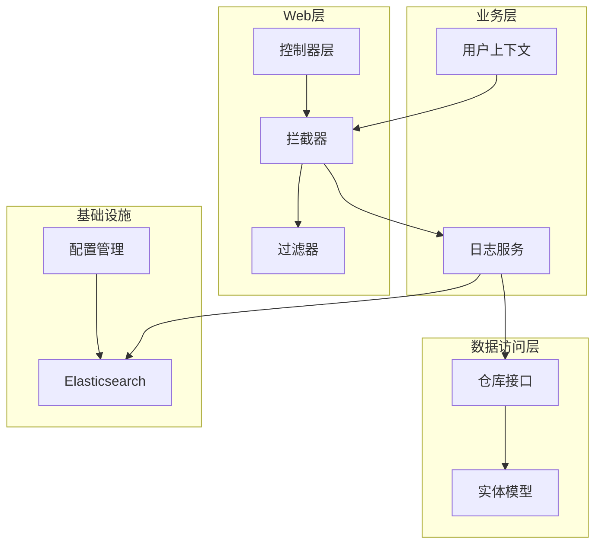
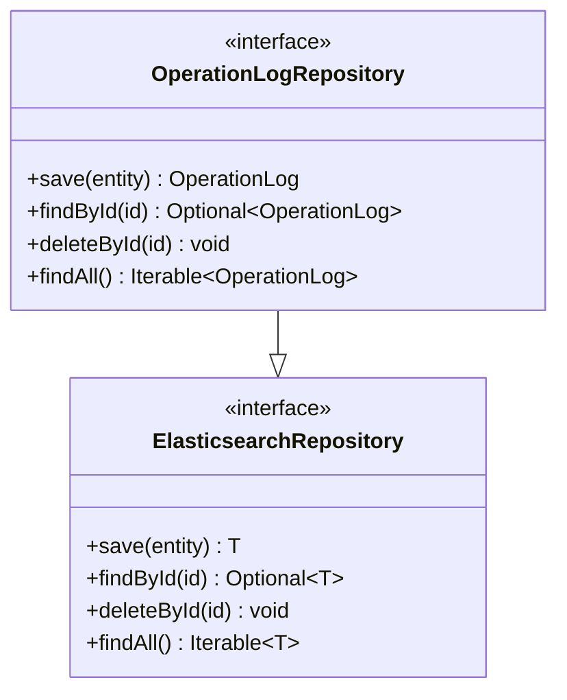
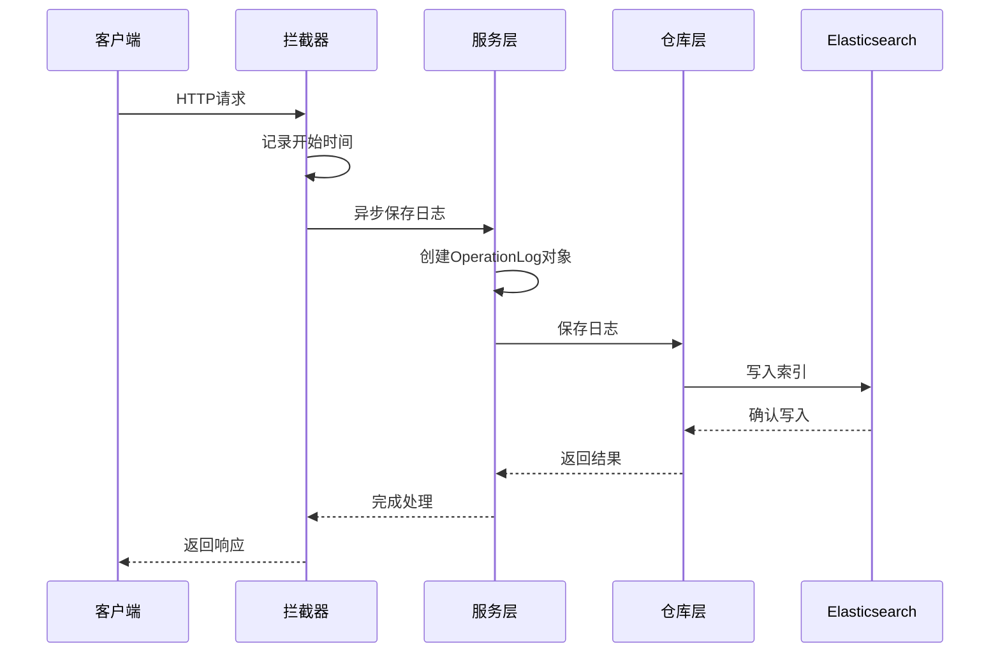
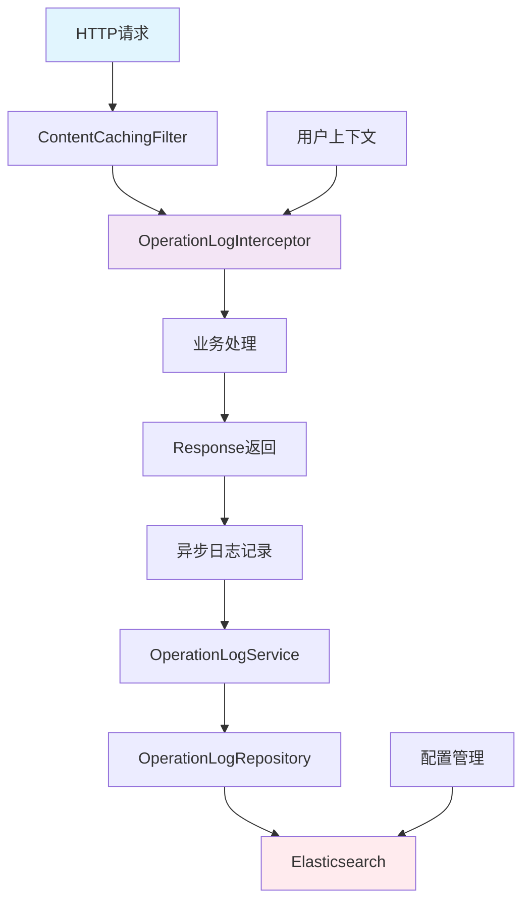
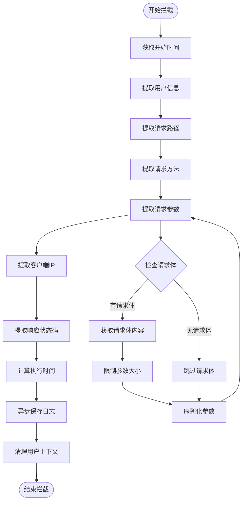
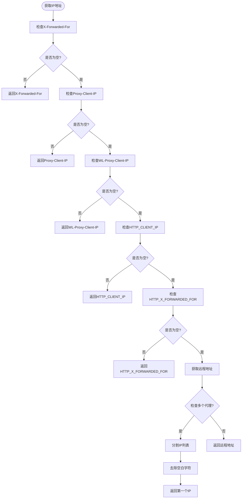
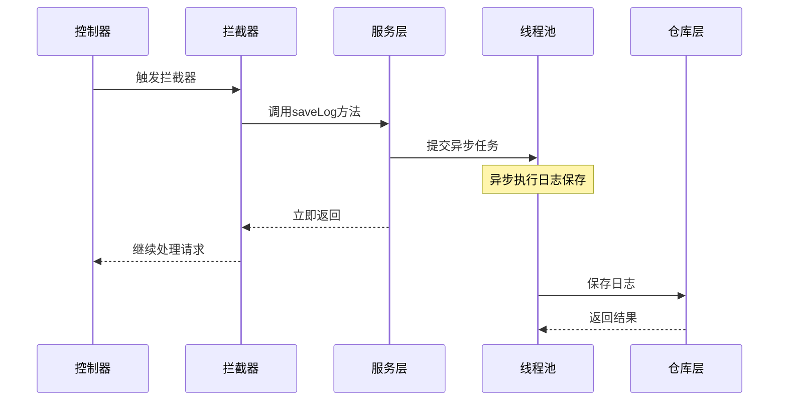
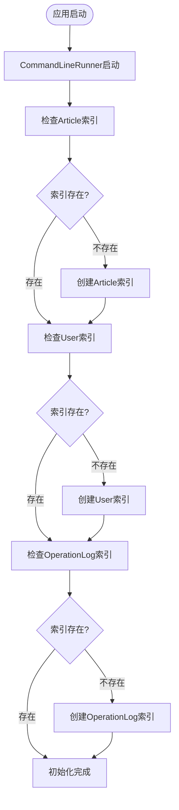
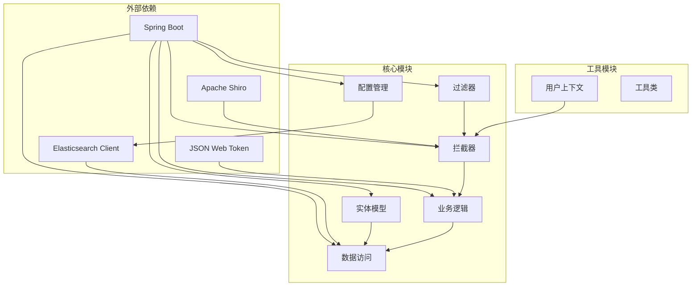

# 日志实体模型

<cite>
**本文档引用的文件**
- [OperationLog.java](file://src/main/java/com/zhishilu/entity/OperationLog.java)
- [OperationLogRepository.java](file://src/main/java/com/zhishilu/repository/OperationLogRepository.java)
- [OperationLogService.java](file://src/main/java/com/zhishilu/service/OperationLogService.java)
- [OperationLogInterceptor.java](file://src/main/java/com/zhishilu/interceptor/OperationLogInterceptor.java)
- [ElasticsearchIndexInitializer.java](file://src/main/java/com/zhishilu/config/ElasticsearchIndexInitializer.java)
- [ContentCachingFilter.java](file://src/main/java/com/zhishilu/filter/ContentCachingFilter.java)
- [UserContext.java](file://src/main/java/com/zhishilu/util/UserContext.java)
- [application.yml](file://src/main/resources/application.yml)
- [pom.xml](file://pom.xml)
</cite>

## 目录
1. [简介](#简介)
2. [项目结构](#项目结构)
3. [核心组件](#核心组件)
4. [架构概览](#架构概览)
5. [详细组件分析](#详细组件分析)
6. [依赖关系分析](#依赖关系分析)
7. [性能考虑](#性能考虑)
8. [故障排除指南](#故障排除指南)
9. [结论](#结论)

## 简介

本文档详细介绍了操作日志实体模型的设计与实现。该系统通过Spring Data Elasticsearch框架实现了高性能的操作日志记录功能，支持异步日志写入、精确查询和全文检索。系统采用拦截器模式自动捕获HTTP请求的完整信息，并将其持久化到Elasticsearch中，为后续的日志分析、审计和监控提供数据基础。

## 项目结构

操作日志功能涉及多个核心模块，形成了完整的日志记录生态系统：

**图表来源**
- [OperationLogInterceptor.java](file://src/main/java/com/zhishilu/interceptor/OperationLogInterceptor.java#L25-L64)
- [OperationLogService.java](file://src/main/java/com/zhishilu/service/OperationLogService.java#L19-L48)
- [OperationLogRepository.java](file://src/main/java/com/zhishilu/repository/OperationLogRepository.java#L11)

**章节来源**
- [OperationLog.java](file://src/main/java/com/zhishilu/entity/OperationLog.java#L1-L74)
- [pom.xml](file://pom.xml#L40-L44)

## 核心组件

### OperationLog实体类

OperationLog是整个日志系统的核心数据模型，采用了精心设计的字段类型和映射策略：

#### 基础字段设计

| 字段名称 | 数据类型 | Elasticsearch类型 | 设计考量 |
|---------|----------|-------------------|----------|
| id | String | 自动分配 | 唯一标识符，由系统生成 |
| username | String | Keyword | 精确匹配，支持用户查询 |
| userId | String | Keyword | 精确匹配，支持用户关联 |
| path | String | Keyword | 精确匹配，支持路径查询 |
| method | String | Keyword | 精确匹配，支持方法过滤 |
| params | String | Text(index=false) | 全文检索但不索引，避免存储冗余 |
| ip | String | Keyword | 精确匹配，支持IP过滤 |
| statusCode | Integer | Integer | 数值比较，支持状态码统计 |
| executionTime | Long | Long | 数值范围查询，性能监控 |
| operationTime | LocalDateTime | Date | 时间序列分析，支持时序查询 |

#### Elasticsearch注解配置

实体类使用了以下关键注解：

- **@Document(indexName = "zhishilu_log")**: 定义索引名称为"zhishilu_log"
- **@Setting(shards = 1, replicas = 0)**: 配置单分片无副本，适用于开发环境
- **@Field(type = FieldType.Keyword)**: 关键字类型，支持精确匹配和聚合
- **@Field(type = FieldType.Text, index = false)**: 文本类型但不索引，避免存储冗余参数
- **@Field(type = FieldType.Date, format = DateFormat.date_hour_minute_second_millis)**: 日期类型，支持毫秒精度

**章节来源**
- [OperationLog.java](file://src/main/java/com/zhishilu/entity/OperationLog.java#L13-L72)

### OperationLogRepository接口

Repository接口继承自ElasticsearchRepository，提供了标准的CRUD操作能力：

**图表来源**
- [OperationLogRepository.java](file://src/main/java/com/zhishilu/repository/OperationLogRepository.java#L11)

**章节来源**
- [OperationLogRepository.java](file://src/main/java/com/zhishilu/repository/OperationLogRepository.java#L1-L13)

### OperationLogService服务层

服务层实现了异步日志记录功能，确保不影响主业务流程：

**图表来源**
- [OperationLogInterceptor.java](file://src/main/java/com/zhishilu/interceptor/OperationLogInterceptor.java#L56)
- [OperationLogService.java](file://src/main/java/com/zhishilu/service/OperationLogService.java#L26-L47)

**章节来源**
- [OperationLogService.java](file://src/main/java/com/zhishilu/service/OperationLogService.java#L19-L48)

## 架构概览

系统采用拦截器模式实现非侵入式日志记录，形成了清晰的职责分离：

**图表来源**
- [ContentCachingFilter.java](file://src/main/java/com/zhishilu/filter/ContentCachingFilter.java#L22-L32)
- [OperationLogInterceptor.java](file://src/main/java/com/zhishilu/interceptor/OperationLogInterceptor.java#L32-L64)
- [ElasticsearchIndexInitializer.java](file://src/main/java/com/zhishilu/config/ElasticsearchIndexInitializer.java#L24-L38)

**章节来源**
- [OperationLogInterceptor.java](file://src/main/java/com/zhishilu/interceptor/OperationLogInterceptor.java#L25-L128)
- [ElasticsearchIndexInitializer.java](file://src/main/java/com/zhishilu/config/ElasticsearchIndexInitializer.java#L19-L40)

## 详细组件分析

### 拦截器组件

OperationLogInterceptor负责捕获HTTP请求的完整信息：

#### 请求参数提取逻辑

**图表来源**
- [OperationLogInterceptor.java](file://src/main/java/com/zhishilu/interceptor/OperationLogInterceptor.java#L69-L99)

#### IP地址解析算法

系统实现了多级IP解析机制，确保能够正确获取真实的客户端IP：

**图表来源**
- [OperationLogInterceptor.java](file://src/main/java/com/zhishilu/interceptor/OperationLogInterceptor.java#L104-L126)

**章节来源**
- [OperationLogInterceptor.java](file://src/main/java/com/zhishilu/interceptor/OperationLogInterceptor.java#L25-L128)

### 服务层组件

OperationLogService实现了异步日志记录功能，确保不影响主业务流程：

#### 异步处理机制

服务层使用@Async注解实现异步日志记录：

**图表来源**
- [OperationLogService.java](file://src/main/java/com/zhishilu/service/OperationLogService.java#L26-L47)

**章节来源**
- [OperationLogService.java](file://src/main/java/com/zhishilu/service/OperationLogService.java#L19-L48)

### 配置管理组件

ElasticsearchIndexInitializer负责自动创建和初始化索引：

#### 索引初始化流程

**图表来源**
- [ElasticsearchIndexInitializer.java](file://src/main/java/com/zhishilu/config/ElasticsearchIndexInitializer.java#L24-L38)

**章节来源**
- [ElasticsearchIndexInitializer.java](file://src/main/java/com/zhishilu/config/ElasticsearchIndexInitializer.java#L19-L40)

## 依赖关系分析

系统各组件之间的依赖关系清晰明确，遵循了分层架构原则：

**图表来源**
- [pom.xml](file://pom.xml#L27-L110)

**章节来源**
- [pom.xml](file://pom.xml#L21-L25)

## 性能考虑

### 字段类型优化策略

系统在字段类型选择上充分考虑了性能和查询需求：

#### 精确匹配字段（Keyword类型）

- **username**: 支持用户精确查询和聚合统计
- **userId**: 用户ID关联查询，支持精确匹配
- **path**: 请求路径查询，支持精确匹配
- **method**: HTTP方法过滤，支持精确匹配
- **ip**: IP地址过滤，支持精确匹配

#### 数值类型优化

- **statusCode**: 整数类型，支持范围查询和统计分析
- **executionTime**: 长整型，支持毫秒级性能监控

#### 时间序列优化

- **operationTime**: 日期类型，支持时序分析和时间范围查询

#### 文本类型特殊处理

- **params**: 文本类型但不索引，避免存储冗余参数，仅用于审计目的

### 异步处理优势

系统采用异步日志记录机制，具有以下优势：

1. **非阻塞**: 日志记录不影响主业务请求的响应时间
2. **高并发**: 线程池管理异步任务，支持高并发场景
3. **可靠性**: 异常处理机制确保日志记录的稳定性

### 内存和存储优化

- **请求体限制**: 对POST请求体进行长度限制，防止内存溢出
- **参数序列化**: 使用JSON格式存储请求参数，便于后续分析
- **索引配置**: 开发环境使用单分片无副本，减少资源消耗

## 故障排除指南

### 常见问题及解决方案

#### Elasticsearch连接问题

**问题描述**: 应用启动时无法连接到Elasticsearch

**解决方案**:
1. 检查application.yml中的Elasticsearch配置
2. 确认Elasticsearch服务正在运行
3. 验证网络连接和防火墙设置

#### 日志记录失败

**问题描述**: 日志无法正常保存到Elasticsearch

**排查步骤**:
1. 检查ElasticsearchIndexInitializer的初始化日志
2. 验证OperationLogRepository的连接状态
3. 查看服务层的异常日志

#### 性能问题

**问题描述**: 日志记录影响系统性能

**优化建议**:
1. 调整线程池配置
2. 优化索引设置
3. 实施日志轮转策略

**章节来源**
- [application.yml](file://src/main/resources/application.yml#L13-L18)
- [OperationLogService.java](file://src/main/java/com/zhishilu/service/OperationLogService.java#L44-L46)

## 结论

操作日志实体模型展现了现代Java应用中日志系统的最佳实践。通过精心设计的实体模型、异步处理机制和完善的配置管理，系统实现了高效、可靠且可扩展的日志记录功能。

### 主要优势

1. **设计合理**: 字段类型选择符合查询需求，避免了不必要的存储开销
2. **性能优秀**: 异步处理机制确保不影响主业务流程
3. **易于维护**: 清晰的分层架构和职责分离便于后续维护
4. **可扩展性强**: 支持多种查询场景和数据分析需求

### 技术亮点

- **精确匹配与全文检索的平衡**: 关键字字段支持精确查询，文本字段支持全文检索
- **时间序列分析**: 日期字段支持时序分析和趋势监控
- **异步日志记录**: 非阻塞的日志写入机制
- **自动索引管理**: 启动时自动创建和初始化索引

该系统为后续的日志分析、审计和监控奠定了坚实的基础，是一个值得参考的生产级日志系统实现。