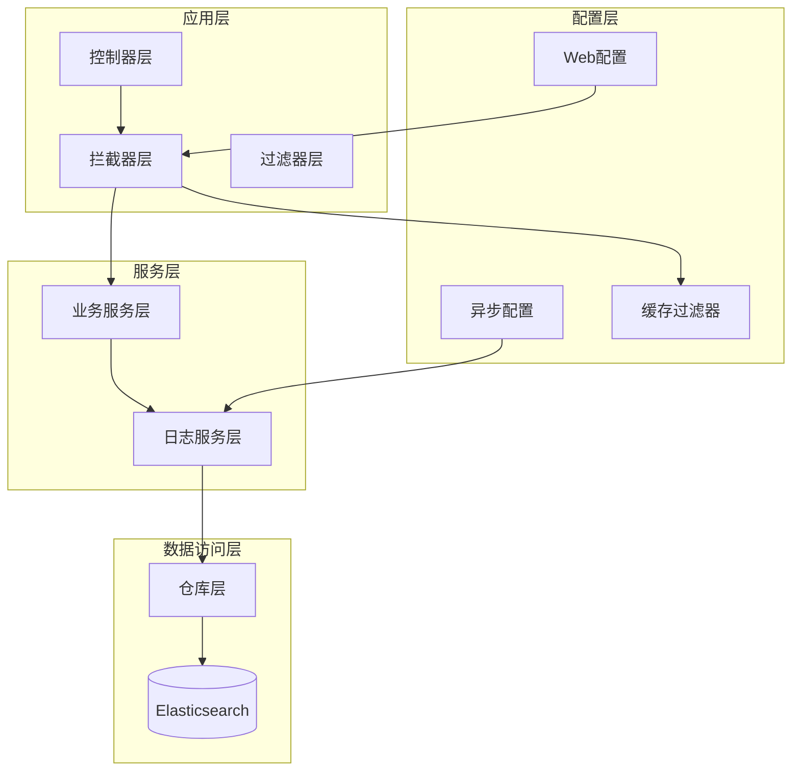
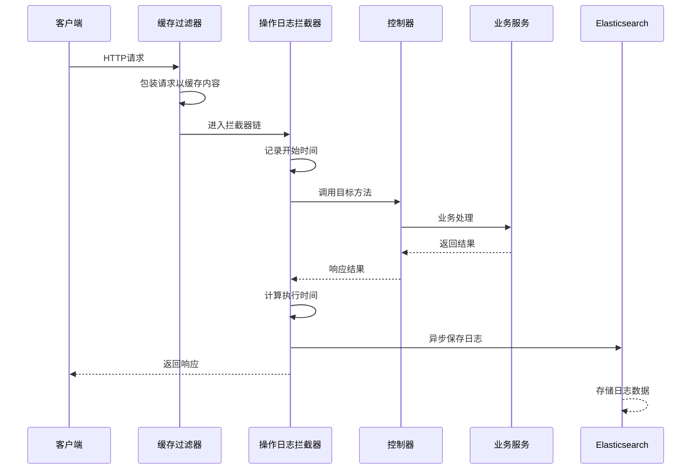
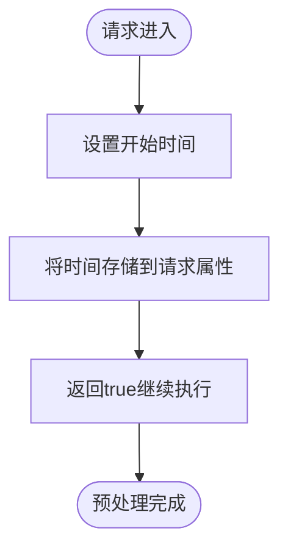
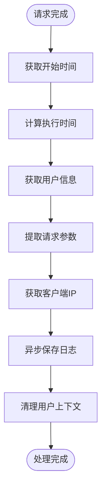
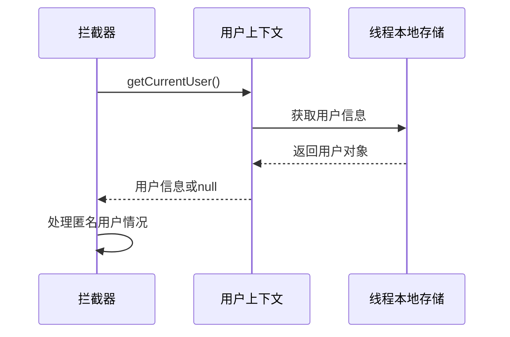
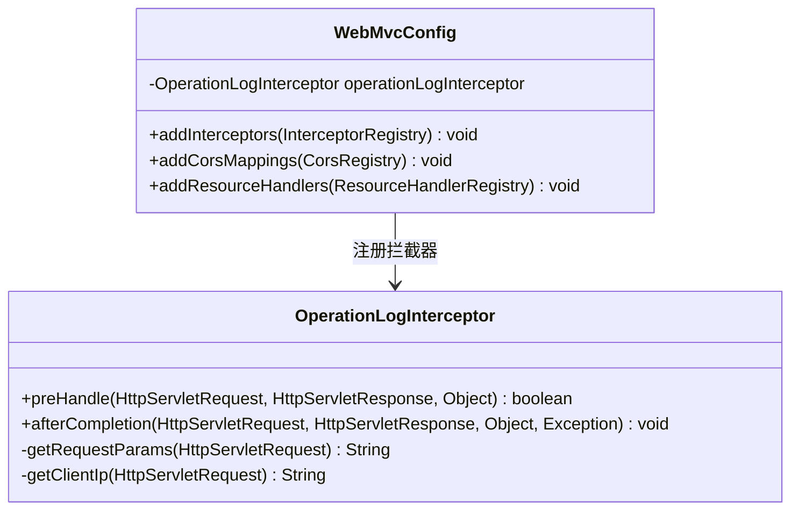
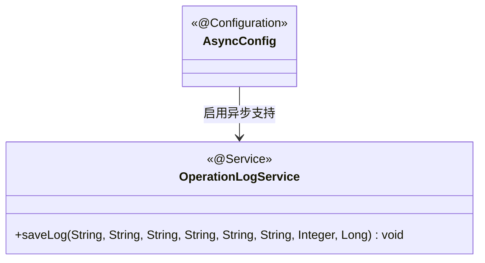
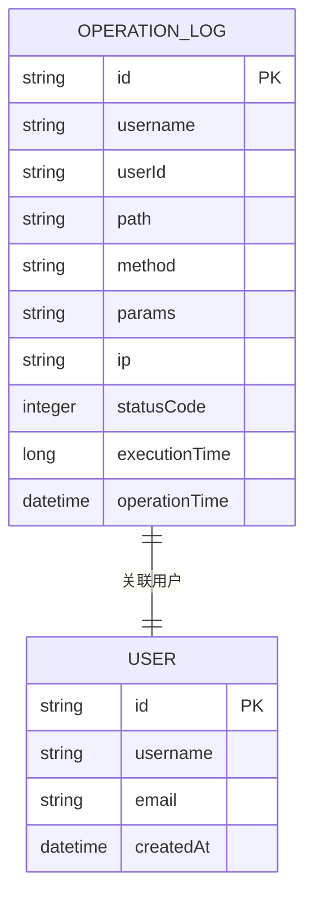
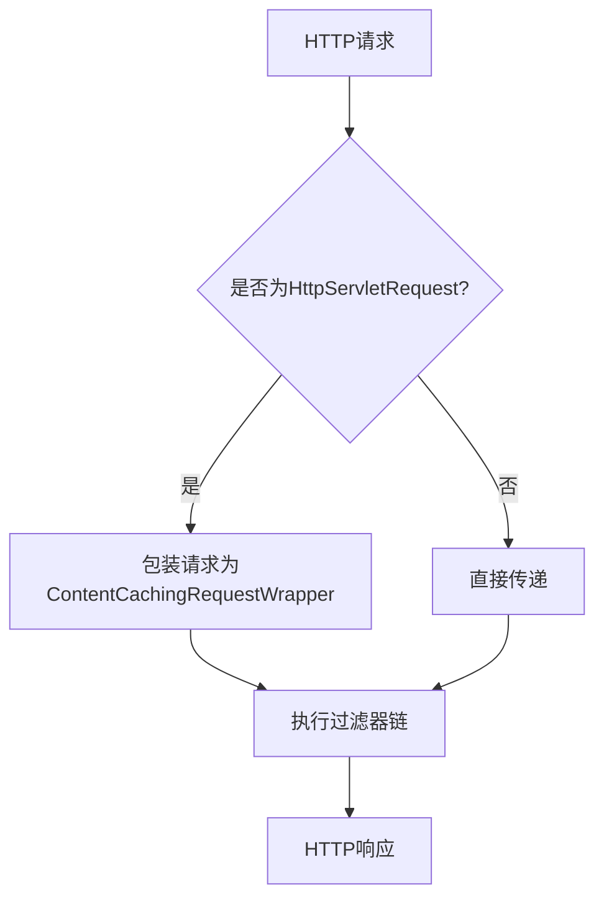
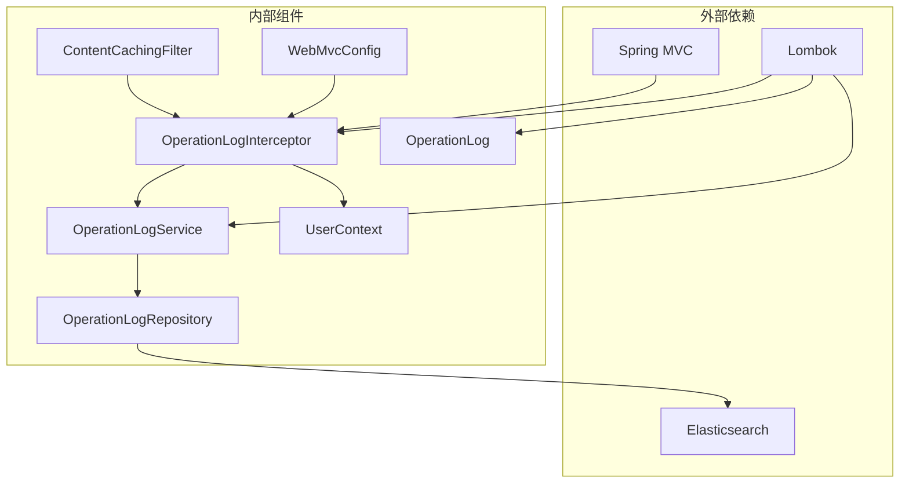

# 日志拦截器

<cite>
**本文档引用的文件**
- [OperationLogInterceptor.java](file://src/main/java/com/zhishilu/interceptor/OperationLogInterceptor.java)
- [WebMvcConfig.java](file://src/main/java/com/zhishilu/config/WebMvcConfig.java)
- [OperationLogService.java](file://src/main/java/com/zhishilu/service/OperationLogService.java)
- [OperationLog.java](file://src/main/java/com/zhishilu/entity/OperationLog.java)
- [UserContext.java](file://src/main/java/com/zhishilu/util/UserContext.java)
- [ContentCachingFilter.java](file://src/main/java/com/zhishilu/filter/ContentCachingFilter.java)
- [OperationLogRepository.java](file://src/main/java/com/zhishilu/repository/OperationLogRepository.java)
- [AsyncConfig.java](file://src/main/java/com/zhishilu/config/AsyncConfig.java)
- [application.yml](file://src/main/resources/application.yml)
- [README.md](file://README.md)
</cite>

## 目录
1. [简介](#简介)
2. [项目结构](#项目结构)
3. [核心组件](#核心组件)
4. [架构概览](#架构概览)
5. [详细组件分析](#详细组件分析)
6. [依赖关系分析](#依赖关系分析)
7. [性能考虑](#性能考虑)
8. [故障排除指南](#故障排除指南)
9. [结论](#结论)

## 简介

日志拦截器是知拾录个人知识收藏管理系统中的关键组件，负责自动记录所有HTTP请求的操作日志。该系统基于Spring Boot 3.2.1构建，采用Spring MVC框架，通过拦截器模式实现了无侵入式的日志记录功能。

日志拦截器的核心功能包括：
- 自动拦截所有HTTP请求
- 提取请求参数和用户信息
- 计算请求执行时间
- 异步保存到Elasticsearch
- 支持复杂的拦截规则配置

## 项目结构

该项目采用标准的Spring Boot项目结构，日志拦截器位于`src/main/java/com/zhishilu/interceptor/`目录下，与Spring MVC配置、服务层、实体类等模块协同工作。



**图表来源**
- [OperationLogInterceptor.java](file://src/main/java/com/zhishilu/interceptor/OperationLogInterceptor.java#L1-L128)
- [WebMvcConfig.java](file://src/main/java/com/zhishilu/config/WebMvcConfig.java#L1-L52)
- [ContentCachingFilter.java](file://src/main/java/com/zhishilu/filter/ContentCachingFilter.java#L1-L34)

**章节来源**
- [README.md](file://README.md#L1-L133)

## 核心组件

日志拦截器系统由以下核心组件构成：

### OperationLogInterceptor（拦截器）
- 实现HandlerInterceptor接口
- 负责请求拦截和日志记录
- 提供preHandle和afterCompletion方法
- 管理请求执行时间计算

### OperationLogService（日志服务）
- 提供异步日志保存功能
- 使用@Async注解实现异步处理
- 负责日志实体的创建和持久化

### OperationLog（日志实体）
- 定义日志数据结构
- 使用Elasticsearch注解进行映射
- 包含用户信息、请求参数、执行时间等字段

### UserContext（用户上下文）
- 提供线程安全的用户信息存储
- 使用ThreadLocal实现上下文传递
- 支持用户信息的设置、获取和清理

**章节来源**
- [OperationLogInterceptor.java](file://src/main/java/com/zhishilu/interceptor/OperationLogInterceptor.java#L1-L128)
- [OperationLogService.java](file://src/main/java/com/zhishilu/service/OperationLogService.java#L1-L49)
- [OperationLog.java](file://src/main/java/com/zhishilu/entity/OperationLog.java#L1-L74)
- [UserContext.java](file://src/main/java/com/zhishilu/util/UserContext.java#L1-L33)

## 架构概览

日志拦截器采用拦截器模式与Spring MVC深度集成，形成了完整的请求处理链路。



**图表来源**
- [OperationLogInterceptor.java](file://src/main/java/com/zhishilu/interceptor/OperationLogInterceptor.java#L32-L64)
- [ContentCachingFilter.java](file://src/main/java/com/zhishilu/filter/ContentCachingFilter.java#L21-L32)
- [OperationLogService.java](file://src/main/java/com/zhishilu/service/OperationLogService.java#L26-L47)

## 详细组件分析

### OperationLogInterceptor实现详解

#### 预处理阶段（preHandle方法）

拦截器在请求进入时执行预处理逻辑：



**图表来源**
- [OperationLogInterceptor.java](file://src/main/java/com/zhishilu/interceptor/OperationLogInterceptor.java#L32-L36)

#### 后处理阶段（afterCompletion方法）

拦截器在请求完成后执行日志记录逻辑：



**图表来源**
- [OperationLogInterceptor.java](file://src/main/java/com/zhishilu/interceptor/OperationLogInterceptor.java#L38-L64)

#### 参数提取机制

拦截器支持多种参数提取方式：

1. **URL参数提取**：遍历所有请求参数名称和值
2. **请求体提取**：通过ContentCachingRequestWrapper获取原始请求体
3. **参数限制**：对超长参数进行截断处理（最多2000字符）

#### 用户信息获取流程



**图表来源**
- [OperationLogInterceptor.java](file://src/main/java/com/zhishilu/interceptor/OperationLogInterceptor.java#L45-L47)
- [UserContext.java](file://src/main/java/com/zhishilu/util/UserContext.java#L22-L24)

#### 请求执行时间计算

拦截器使用高精度时间测量：
- 开始时间：System.currentTimeMillis()在preHandle中记录
- 结束时间：System.currentTimeMillis()在afterCompletion中记录
- 执行时间：结束时间 - 开始时间（毫秒）

#### IP地址解析机制

支持多级代理环境的IP地址获取：
1. 优先检查X-Forwarded-For头部
2. 依次检查Proxy-Client-IP、WL-Proxy-Client-IP等
3. 最终回退到RemoteAddr
4. 处理多个代理IP的情况，取第一个IP

**章节来源**
- [OperationLogInterceptor.java](file://src/main/java/com/zhishilu/interceptor/OperationLogInterceptor.java#L19-L128)

### Spring MVC集成实现

#### 拦截器注册配置

WebMvcConfig类负责拦截器的全局配置：



**图表来源**
- [WebMvcConfig.java](file://src/main/java/com/zhishilu/config/WebMvcConfig.java#L16-L41)
- [OperationLogInterceptor.java](file://src/main/java/com/zhishilu/interceptor/OperationLogInterceptor.java#L25-L64)

#### 拦截规则设置

拦截器配置包含以下规则：
- **路径匹配**：/** 匹配所有请求路径
- **排除规则**：排除错误页面和Swagger文档路径
- **执行顺序**：通过@Order注解控制过滤器优先级

#### 异步配置



**图表来源**
- [AsyncConfig.java](file://src/main/java/com/zhishilu/config/AsyncConfig.java#L1-L13)
- [OperationLogService.java](file://src/main/java/com/zhishilu/service/OperationLogService.java#L26-L27)

**章节来源**
- [WebMvcConfig.java](file://src/main/java/com/zhishilu/config/WebMvcConfig.java#L36-L41)
- [AsyncConfig.java](file://src/main/java/com/zhishilu/config/AsyncConfig.java#L1-L13)

### 数据模型设计

#### OperationLog实体结构



**图表来源**
- [OperationLog.java](file://src/main/java/com/zhishilu/entity/OperationLog.java#L15-L73)

#### Elasticsearch映射配置

日志实体使用Elasticsearch注解进行映射：
- **索引名称**：zhishilu_log
- **分片数量**：1
- **副本数量**：0
- **字段类型**：根据数据特点选择合适的Elasticsearch字段类型

**章节来源**
- [OperationLog.java](file://src/main/java/com/zhishilu/entity/OperationLog.java#L13-L73)

### 缓存过滤器实现

ContentCachingFilter确保请求体内容可被多次读取：



**图表来源**
- [ContentCachingFilter.java](file://src/main/java/com/zhishilu/filter/ContentCachingFilter.java#L21-L32)

**章节来源**
- [ContentCachingFilter.java](file://src/main/java/com/zhishilu/filter/ContentCachingFilter.java#L1-L34)

## 依赖关系分析

日志拦截器系统各组件之间的依赖关系如下：



**图表来源**
- [OperationLogInterceptor.java](file://src/main/java/com/zhishilu/interceptor/OperationLogInterceptor.java#L1-L128)
- [OperationLogService.java](file://src/main/java/com/zhishilu/service/OperationLogService.java#L1-L49)
- [OperationLogRepository.java](file://src/main/java/com/zhishilu/repository/OperationLogRepository.java#L1-L13)

### 关键依赖特性

1. **循环依赖避免**：通过接口抽象避免直接循环依赖
2. **异步处理**：日志保存采用异步方式，不影响主请求处理
3. **线程安全**：UserContext使用ThreadLocal确保线程隔离
4. **资源管理**：正确清理用户上下文，防止内存泄漏

**章节来源**
- [OperationLogInterceptor.java](file://src/main/java/com/zhishilu/interceptor/OperationLogInterceptor.java#L61-L63)
- [UserContext.java](file://src/main/java/com/zhishilu/util/UserContext.java#L29-L31)

## 性能考虑

### 异步日志记录

日志拦截器采用异步方式保存日志，避免阻塞主线程：

```mermaid
gantt
title 异步日志处理流程
dateFormat X
axisFormat %s
section 请求处理
预处理阶段 :0, 10ms
控制器处理 :10ms, 50ms
后处理阶段 :60ms, 20ms
section 日志保存
异步保存 :80ms, 100ms
Elasticsearch :100ms, 80ms
```

### 内存优化策略

1. **参数长度限制**：请求体超过2000字符时进行截断
2. **线程本地存储**：使用ThreadLocal避免全局共享状态
3. **及时清理**：在finally块中清理用户上下文

### 并发处理

- **线程隔离**：每个请求使用独立的线程上下文
- **无锁设计**：避免在热路径上使用同步机制
- **资源池**：利用Spring的线程池处理异步任务

## 故障排除指南

### 常见问题及解决方案

#### 日志记录失败

**问题现象**：系统日志显示"记录操作日志失败"

**可能原因**：
1. Elasticsearch连接异常
2. 数据库连接池耗尽
3. 网络超时

**解决步骤**：
1. 检查Elasticsearch服务状态
2. 查看应用日志中的具体异常信息
3. 验证网络连接和认证信息

#### 用户信息获取失败

**问题现象**：日志中显示用户名为"anonymous"

**可能原因**：
1. 用户未登录
2. UserContext未正确设置
3. 线程上下文丢失

**解决步骤**：
1. 确认用户认证流程正常
2. 检查UserContext的设置和清理逻辑
3. 验证拦截器执行顺序

#### 参数提取异常

**问题现象**：日志中参数为空或异常

**可能原因**：
1. 请求体编码问题
2. 缓存过滤器未正确包装请求
3. 参数格式不支持

**解决步骤**：
1. 检查ContentCachingFilter配置
2. 验证请求编码设置
3. 查看具体的异常堆栈信息

### 监控和调试

#### 日志级别配置

在application.yml中可以调整日志级别：
- `com.zhishilu`: DEBUG级别获取详细信息
- `org.springframework.data.elasticsearch`: 调试Elasticsearch交互

#### 性能监控

建议监控以下指标：
- 日志保存延迟
- Elasticsearch写入性能
- 内存使用情况
- 线程池状态

**章节来源**
- [OperationLogInterceptor.java](file://src/main/java/com/zhishilu/interceptor/OperationLogInterceptor.java#L58-L63)
- [OperationLogService.java](file://src/main/java/com/zhishilu/service/OperationLogService.java#L44-L46)

## 结论

日志拦截器系统通过精心设计的架构实现了高效、可靠的请求日志记录功能。其主要优势包括：

1. **无侵入性**：通过Spring MVC拦截器模式实现，无需修改现有业务代码
2. **高性能**：异步日志保存和优化的数据提取机制
3. **完整性**：全面的请求信息收集和异常处理
4. **可扩展性**：清晰的组件分离和接口设计

该系统为知拾录平台提供了完整的操作审计能力，支持用户行为追踪、系统性能监控和安全审计等重要功能。通过合理的配置和监控，可以确保日志系统的稳定运行和高效性能。