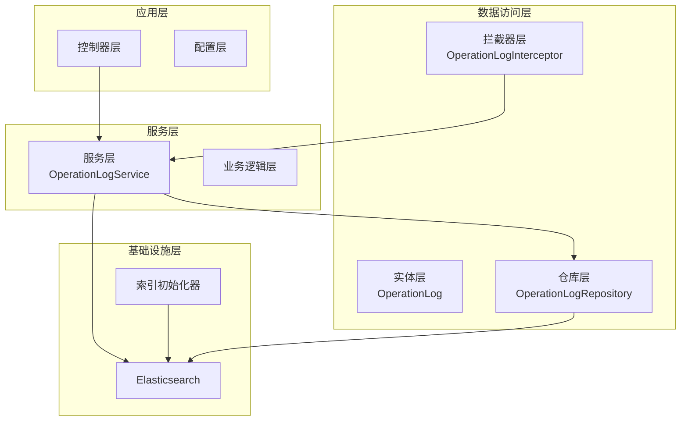
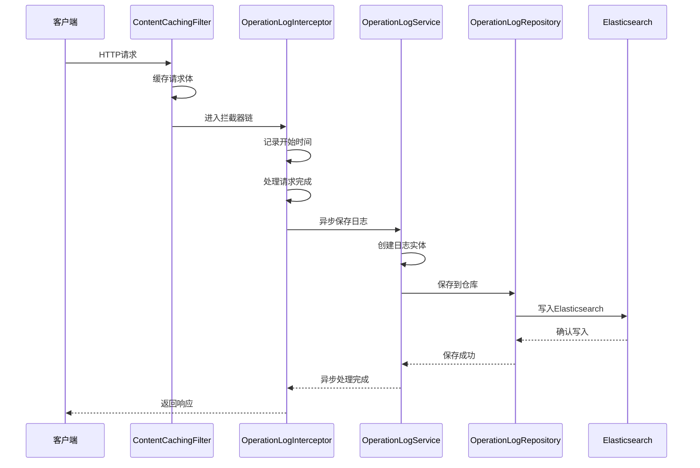
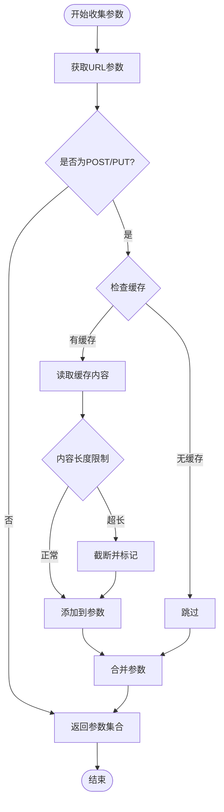
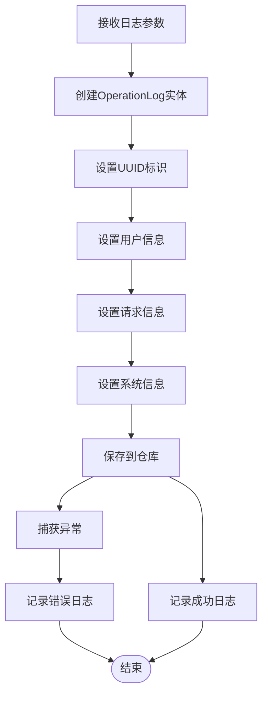
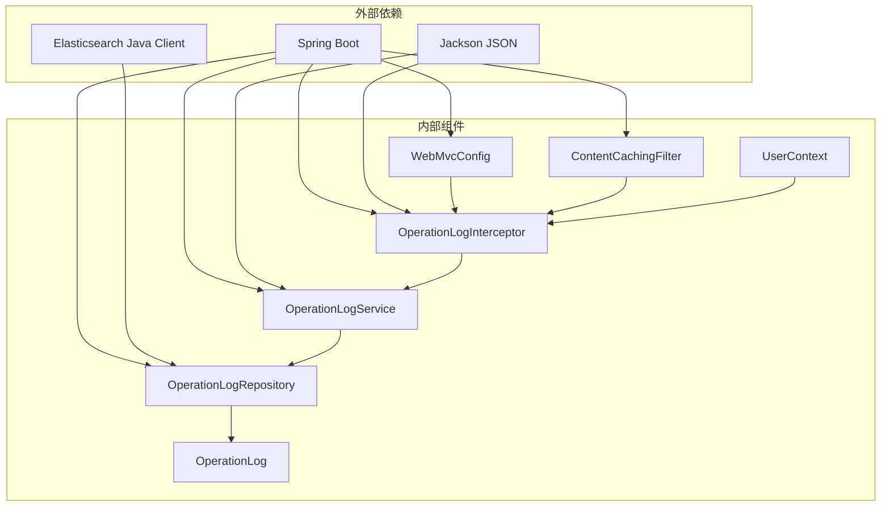

# 日志服务层

<cite>
**本文档引用的文件**
- [OperationLogService.java](file://src/main/java/com/zhishilu/service/OperationLogService.java)
- [OperationLog.java](file://src/main/java/com/zhishilu/entity/OperationLog.java)
- [OperationLogRepository.java](file://src/main/java/com/zhishilu/repository/OperationLogRepository.java)
- [OperationLogInterceptor.java](file://src/main/java/com/zhishilu/interceptor/OperationLogInterceptor.java)
- [ElasticsearchIndexInitializer.java](file://src/main/java/com/zhishilu/config/ElasticsearchIndexInitializer.java)
- [WebMvcConfig.java](file://src/main/java/com/zhishilu/config/WebMvcConfig.java)
- [UserContext.java](file://src/main/java/com/zhishilu/util/UserContext.java)
- [ContentCachingFilter.java](file://src/main/java/com/zhishilu/filter/ContentCachingFilter.java)
- [application.yml](file://src/main/resources/application.yml)
</cite>

## 目录
1. [简介](#简介)
2. [项目结构](#项目结构)
3. [核心组件](#核心组件)
4. [架构概览](#架构概览)
5. [详细组件分析](#详细组件分析)
6. [依赖关系分析](#依赖关系分析)
7. [性能考虑](#性能考虑)
8. [故障排除指南](#故障排除指南)
9. [结论](#结论)

## 简介

本文件详细阐述了日志服务层的完整实现，重点分析了`OperationLogService`的服务逻辑、日志保存机制、与Elasticsearch的交互方式以及异步处理策略。该系统采用Spring Boot + Spring Data Elasticsearch + Spring MVC拦截器的架构模式，实现了无侵入式的操作日志记录功能。

## 项目结构

该项目采用标准的Maven分层架构，日志服务层位于`com.zhishilu.service`包中，与实体层、仓库层、拦截器层协同工作。

**图表来源**
- [OperationLogService.java](file://src/main/java/com/zhishilu/service/OperationLogService.java#L1-L49)
- [OperationLogRepository.java](file://src/main/java/com/zhishilu/repository/OperationLogRepository.java#L1-L13)
- [OperationLogInterceptor.java](file://src/main/java/com/zhishilu/interceptor/OperationLogInterceptor.java#L1-L128)

**章节来源**
- [OperationLogService.java](file://src/main/java/com/zhishilu/service/OperationLogService.java#L1-L49)
- [WebMvcConfig.java](file://src/main/java/com/zhishilu/config/WebMvcConfig.java#L1-L52)

## 核心组件

### OperationLogService - 操作日志服务

`OperationLogService`是日志服务层的核心组件，负责异步保存操作日志。该服务采用Lombok注解简化代码，并使用Spring的异步执行机制确保日志记录不影响主业务流程。

**主要特性：**
- 异步日志保存：使用`@Async`注解实现非阻塞的日志记录
- 数据完整性：通过完整的字段映射确保日志信息的准确性
- 错误处理：内置异常捕获机制保证系统稳定性
- 性能优化：异步处理避免阻塞主线程

**章节来源**
- [OperationLogService.java](file://src/main/java/com/zhishilu/service/OperationLogService.java#L13-L49)

### OperationLog - 操作日志实体

`OperationLog`实体类定义了日志数据结构，使用Spring Data Elasticsearch注解进行映射配置。

**核心字段设计：**
- `id`: 主键，UUID格式确保唯一性
- `username`: 用户名，使用Keyword类型便于精确匹配
- `userId`: 用户ID，Keyword类型支持高效查询
- `path`: 请求路径，Keyword类型便于分类统计
- `method`: HTTP方法，Keyword类型便于筛选
- `params`: 请求参数，Text类型但不索引以节省空间
- `ip`: 客户端IP，Keyword类型支持地理位置分析
- `statusCode`: 响应状态码，Integer类型便于统计分析
- `executionTime`: 执行时间，Long类型支持性能分析
- `operationTime`: 操作时间，Date类型支持时间序列分析

**章节来源**
- [OperationLog.java](file://src/main/java/com/zhishilu/entity/OperationLog.java#L1-L74)

### OperationLogRepository - 操作日志仓库

`OperationLogRepository`继承自Spring Data Elasticsearch的`ElasticsearchRepository`接口，提供了基础的CRUD操作能力。

**设计特点：**
- 继承通用接口：自动获得基本的增删改查功能
- 泛型支持：指定实体类型和ID类型
- Spring管理：由Spring容器统一管理生命周期

**章节来源**
- [OperationLogRepository.java](file://src/main/java/com/zhishilu/repository/OperationLogRepository.java#L1-L13)

## 架构概览

系统采用拦截器驱动的日志记录架构，实现了对所有HTTP请求的无侵入式监控。

**图表来源**
- [OperationLogInterceptor.java](file://src/main/java/com/zhishilu/interceptor/OperationLogInterceptor.java#L32-L64)
- [OperationLogService.java](file://src/main/java/com/zhishilu/service/OperationLogService.java#L26-L47)
- [ContentCachingFilter.java](file://src/main/java/com/zhishilu/filter/ContentCachingFilter.java#L21-L32)

## 详细组件分析

### 拦截器组件分析

#### OperationLogInterceptor - 操作日志拦截器

拦截器是整个日志系统的核心触发器，负责在请求生命周期的关键节点收集日志信息。

**核心工作流程：**

1. **预处理阶段** (`preHandle`)
   - 记录请求开始时间到请求属性中
   - 支持后续计算执行时间

2. **后处理阶段** (`afterCompletion`)
   - 计算请求执行时间
   - 获取当前用户信息
   - 收集请求参数和IP地址
   - 异步调用日志服务保存

**请求参数收集机制：**

**图表来源**
- [OperationLogInterceptor.java](file://src/main/java/com/zhishilu/interceptor/OperationLogInterceptor.java#L69-L99)

**IP地址获取策略：**

系统实现了多级代理IP检测机制，确保在不同网络环境下的准确性：

1. 检查`X-Forwarded-For`头部
2. 检查`Proxy-Client-IP`头部  
3. 检查`WL-Proxy-Client-IP`头部
4. 检查`HTTP_CLIENT_IP`头部
5. 检查`HTTP_X_FORWARDED_FOR`头部
6. 最终使用`remoteAddr`

**章节来源**
- [OperationLogInterceptor.java](file://src/main/java/com/zhishilu/interceptor/OperationLogInterceptor.java#L19-L128)

### 服务层组件分析

#### OperationLogService - 异步日志保存

服务层实现了完整的日志保存逻辑，采用异步处理确保不影响主业务性能。

**数据组装流程：**

**图表来源**
- [OperationLogService.java](file://src/main/java/com/zhishilu/service/OperationLogService.java#L27-L47)

**异步处理机制：**

服务使用Spring的`@Async`注解实现异步执行，通过独立的线程池处理日志保存，避免阻塞主线程。

**异常处理策略：**
- 使用try-catch捕获所有异常
- 记录详细的错误信息
- 不影响主业务流程的正常执行

**章节来源**
- [OperationLogService.java](file://src/main/java/com/zhishilu/service/OperationLogService.java#L23-L47)

### 配置组件分析

#### ElasticsearchIndexInitializer - 索引初始化器

系统启动时自动初始化必要的Elasticsearch索引，确保日志存储的可用性。

**初始化流程：**
1. 检查索引是否存在
2. 不存在则创建新索引
3. 应用映射配置
4. 记录初始化完成信息

**配置特点：**
- 使用`CommandLineRunner`确保启动时执行
- 支持多个实体类的索引初始化
- 自动应用实体类的注解配置

**章节来源**
- [ElasticsearchIndexInitializer.java](file://src/main/java/com/zhishilu/config/ElasticsearchIndexInitializer.java#L13-L40)

#### WebMvcConfig - Web配置

配置类负责注册拦截器和设置跨域策略。

**拦截器配置：**
- 全局拦截所有请求路径
- 排除特定路径（错误页面、Swagger文档）
- 与ContentCachingFilter配合使用

**章节来源**
- [WebMvcConfig.java](file://src/main/java/com/zhishilu/config/WebMvcConfig.java#L33-L41)

### 工具类组件分析

#### UserContext - 用户上下文工具

提供线程安全的用户信息存储和访问机制。

**设计原理：**
- 使用ThreadLocal确保线程隔离
- 提供静态方法便于全局访问
- 支持用户信息的设置、获取和清理

**应用场景：**
- 在拦截器中获取当前登录用户
- 在日志记录中包含用户信息
- 支持异步处理中的用户上下文传递

**章节来源**
- [UserContext.java](file://src/main/java/com/zhishilu/util/UserContext.java#L8-L33)

#### ContentCachingFilter - 请求内容缓存过滤器

为拦截器提供请求体内容的缓存访问能力。

**核心功能：**
- 包装原始请求为缓存包装器
- 支持多次读取请求体内容
- 仅对HTTP请求生效

**使用场景：**
- 日志拦截器获取POST请求体
- 防止请求体被消费导致无法读取

**章节来源**
- [ContentCachingFilter.java](file://src/main/java/com/zhishilu/filter/ContentCachingFilter.java#L12-L34)

## 依赖关系分析

系统采用松耦合的设计，各组件间通过接口和注解实现依赖注入。

**图表来源**
- [OperationLogInterceptor.java](file://src/main/java/com/zhishilu/interceptor/OperationLogInterceptor.java#L1-L128)
- [OperationLogService.java](file://src/main/java/com/zhishilu/service/OperationLogService.java#L1-L49)
- [WebMvcConfig.java](file://src/main/java/com/zhishilu/config/WebMvcConfig.java#L1-L52)

**依赖特点：**
- 明确的层次分离：拦截器 -> 服务 -> 仓库 -> 实体
- 注入式设计：通过构造函数注入依赖
- 松耦合：接口抽象降低组件间依赖

## 性能考虑

### 异步处理策略

系统采用异步日志记录策略，通过以下机制优化性能：

1. **线程池隔离**：日志处理使用独立的线程池，避免阻塞业务线程
2. **非阻塞设计**：日志保存不影响请求响应时间
3. **批量处理**：可扩展为批量写入以提高吞吐量

### 存储优化

1. **字段类型选择**：
   - Keyword类型用于精确匹配字段（username、userId、path、method、ip）
   - Text类型用于全文搜索字段（params），但设置为不索引以节省空间
   - Date类型用于时间序列分析（operationTime）

2. **索引配置**：
   - 单分片单副本配置适用于开发环境
   - 可根据生产环境需求调整分片和副本数量

### 内存管理

1. **请求体缓存限制**：对请求体内容进行长度限制，防止内存溢出
2. **线程本地存储**：UserContext使用ThreadLocal避免内存泄漏
3. **资源清理**：在finally块中确保用户上下文的清理

## 故障排除指南

### 常见问题及解决方案

**1. 日志未记录问题**
- 检查拦截器是否正确注册
- 验证WebMvcConfig配置
- 确认请求路径未被排除

**2. Elasticsearch连接失败**
- 检查application.yml中的ES配置
- 验证Elasticsearch服务状态
- 确认网络连接和认证信息

**3. 日志数据不完整**
- 检查ContentCachingFilter是否生效
- 验证UserContext的用户信息设置
- 确认异步任务的执行情况

**4. 性能问题**
- 监控线程池使用情况
- 检查Elasticsearch写入性能
- 分析日志数据量增长趋势

### 调试建议

1. **启用详细日志**：在application.yml中调整日志级别
2. **监控异步任务**：观察日志保存的执行情况
3. **Elasticsearch监控**：关注索引写入性能指标

**章节来源**
- [application.yml](file://src/main/resources/application.yml#L40-L47)

## 结论

该日志服务层实现了完整的操作日志记录功能，具有以下优势：

1. **无侵入性**：通过拦截器实现，不影响业务代码
2. **高性能**：异步处理确保不影响业务性能
3. **可扩展性**：清晰的分层架构便于功能扩展
4. **可靠性**：完善的异常处理和监控机制

系统目前实现了基础的日志记录功能，未来可以在此基础上扩展更多高级功能，如日志查询、统计分析、告警通知等。