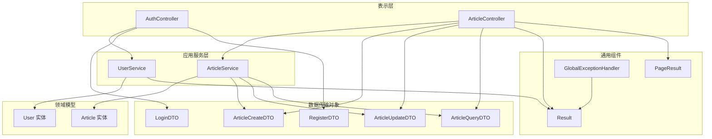
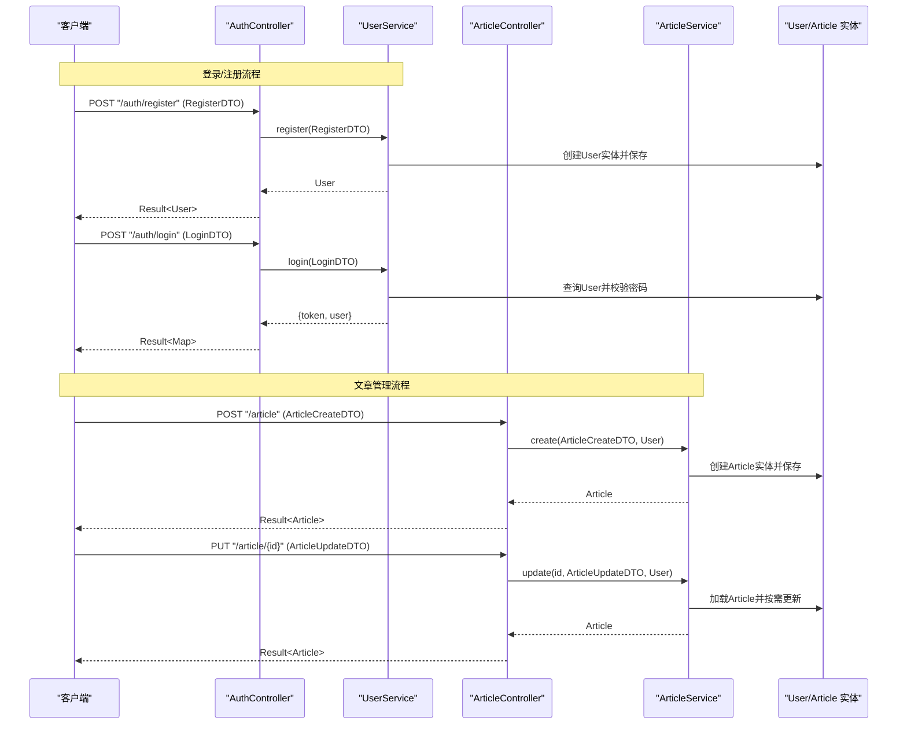
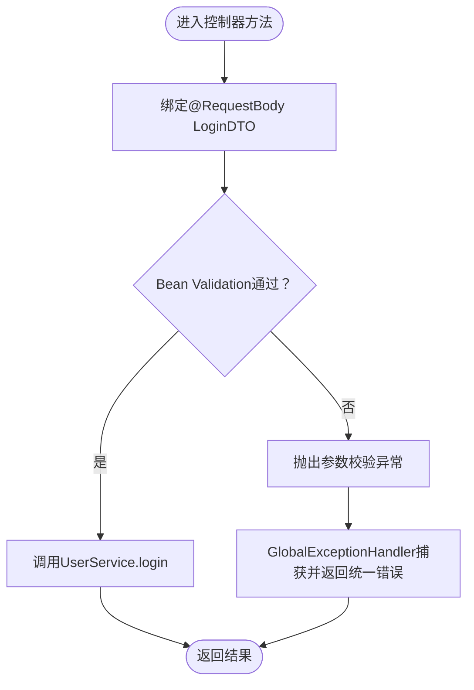
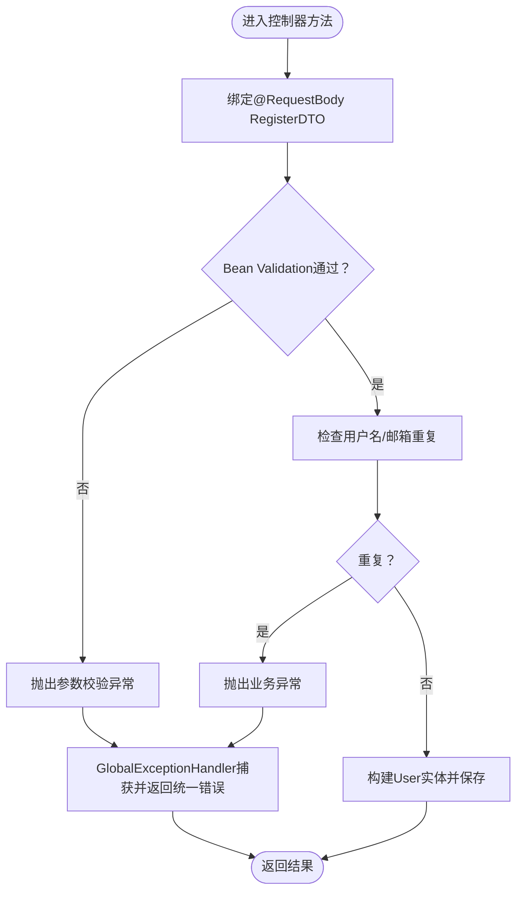
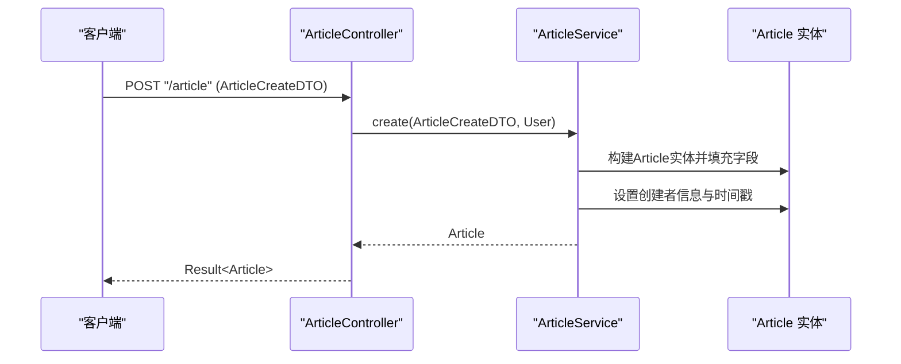
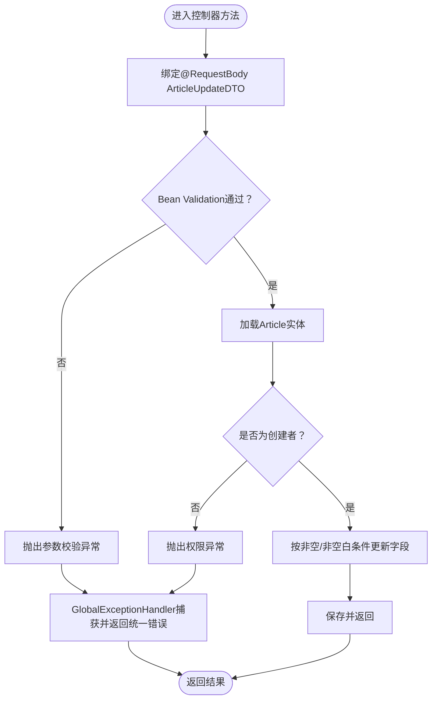
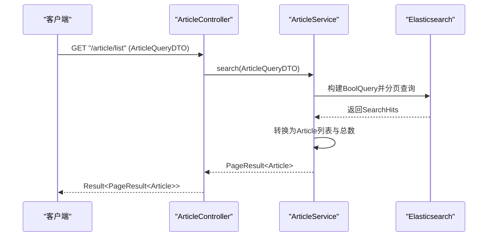
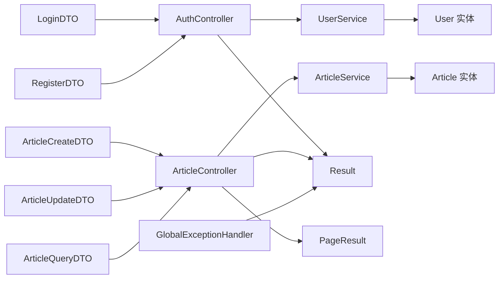

# 数据传输对象

<cite>
**本文引用的文件**
- [LoginDTO.java](file://src/main/java/com/zhishilu/dto/LoginDTO.java)
- [RegisterDTO.java](file://src/main/java/com/zhishilu/dto/RegisterDTO.java)
- [ArticleCreateDTO.java](file://src/main/java/com/zhishilu/dto/ArticleCreateDTO.java)
- [ArticleUpdateDTO.java](file://src/main/java/com/zhishilu/dto/ArticleUpdateDTO.java)
- [ArticleQueryDTO.java](file://src/main/java/com/zhishilu/dto/ArticleQueryDTO.java)
- [AuthController.java](file://src/main/java/com/zhishilu/controller/AuthController.java)
- [ArticleController.java](file://src/main/java/com/zhishilu/controller/ArticleController.java)
- [UserService.java](file://src/main/java/com/zhishilu/service/UserService.java)
- [ArticleService.java](file://src/main/java/com/zhishilu/service/ArticleService.java)
- [User.java](file://src/main/java/com/zhishilu/entity/User.java)
- [Article.java](file://src/main/java/com/zhishilu/entity/Article.java)
- [Result.java](file://src/main/java/com/zhishilu/common/Result.java)
- [PageResult.java](file://src/main/java/com/zhishilu/common/PageResult.java)
- [GlobalExceptionHandler.java](file://src/main/java/com/zhishilu/exception/GlobalExceptionHandler.java)
- [BusinessException.java](file://src/main/java/com/zhishilu/exception/BusinessException.java)
- [application.yml](file://src/main/resources/application.yml)
</cite>

## 目录
1. [简介](#简介)
2. [项目结构](#项目结构)
3. [核心组件](#核心组件)
4. [架构总览](#架构总览)
5. [详细组件分析](#详细组件分析)
6. [依赖分析](#依赖分析)
7. [性能考量](#性能考量)
8. [故障排查指南](#故障排查指南)
9. [结论](#结论)
10. [附录](#附录)

## 简介
本文件系统性梳理并说明本项目的“数据传输对象（DTO）”设计与使用，覆盖以下DTO类及其职责边界：
- LoginDTO：登录参数
- RegisterDTO：注册参数
- ArticleCreateDTO：文章创建参数
- ArticleUpdateDTO：文章更新参数
- ArticleQueryDTO：文章查询参数

文档将从字段定义、数据类型、验证规则、业务含义入手，解释参数验证的实现方式（注解、全局异常处理），阐述DTO与实体类的区别与转换关系（映射策略与性能考量），并给出在控制器与服务层之间的使用示例与最佳实践。

## 项目结构
本项目采用分层架构，DTO位于dto包，控制器位于controller包，服务层位于service包，实体类位于entity包，统一响应封装位于common包，全局异常处理位于exception包。

图表来源
- [AuthController.java](file://src/main/java/com/zhishilu/controller/AuthController.java#L1-L50)
- [ArticleController.java](file://src/main/java/com/zhishilu/controller/ArticleController.java#L1-L88)
- [UserService.java](file://src/main/java/com/zhishilu/service/UserService.java#L1-L128)
- [ArticleService.java](file://src/main/java/com/zhishilu/service/ArticleService.java#L1-L200)
- [User.java](file://src/main/java/com/zhishilu/entity/User.java#L1-L68)
- [Article.java](file://src/main/java/com/zhishilu/entity/Article.java#L1-L81)
- [Result.java](file://src/main/java/com/zhishilu/common/Result.java#L1-L71)
- [PageResult.java](file://src/main/java/com/zhishilu/common/PageResult.java#L1-L52)
- [GlobalExceptionHandler.java](file://src/main/java/com/zhishilu/exception/GlobalExceptionHandler.java#L1-L87)

章节来源
- [AuthController.java](file://src/main/java/com/zhishilu/controller/AuthController.java#L1-L50)
- [ArticleController.java](file://src/main/java/com/zhishilu/controller/ArticleController.java#L1-L88)

## 核心组件
本节对每个DTO进行字段定义、数据类型、验证规则与业务含义的说明，并指出其在控制器与服务层中的使用位置。

- LoginDTO
  - 字段与规则
    - username：非空校验
    - password：非空校验
  - 使用场景
    - 控制器接收登录请求，调用服务层登录逻辑
  - 关键调用链
    - 控制器方法接收@Valid LoginDTO，服务层执行登录与鉴权
  - 章节来源
    - [LoginDTO.java](file://src/main/java/com/zhishilu/dto/LoginDTO.java#L1-L18)
    - [AuthController.java](file://src/main/java/com/zhishilu/controller/AuthController.java#L36-L40)
    - [UserService.java](file://src/main/java/com/zhishilu/service/UserService.java#L61-L87)

- RegisterDTO
  - 字段与规则
    - username：非空且长度3-20字符
    - password：非空且长度6-32字符
    - nickname：可选，最大20字符
    - email：可选，邮箱格式校验
  - 使用场景
    - 控制器接收注册请求，服务层完成用户创建与保存
  - 章节来源
    - [RegisterDTO.java](file://src/main/java/com/zhishilu/dto/RegisterDTO.java#L1-L28)
    - [AuthController.java](file://src/main/java/com/zhishilu/controller/AuthController.java#L27-L31)
    - [UserService.java](file://src/main/java/com/zhishilu/service/UserService.java#L35-L56)

- ArticleCreateDTO
  - 字段与规则
    - title：非空且最大64字符
    - category：非空且最大32字符
    - content：可选
    - url：可选，最大64字符
    - images：可选，字符串列表
    - location：可选
  - 使用场景
    - 控制器接收创建请求，服务层构建Article实体并持久化
  - 章节来源
    - [ArticleCreateDTO.java](file://src/main/java/com/zhishilu/dto/ArticleCreateDTO.java#L1-L32)
    - [ArticleController.java](file://src/main/java/com/zhishilu/controller/ArticleController.java#L32-L37)
    - [ArticleService.java](file://src/main/java/com/zhishilu/service/ArticleService.java#L45-L59)

- ArticleUpdateDTO
  - 字段与规则
    - title：可选，最大64字符
    - content：可选
    - url：可选，最大64字符
    - images：可选，字符串列表
  - 使用场景
    - 控制器接收更新请求，服务层按需更新Article实体
  - 章节来源
    - [ArticleUpdateDTO.java](file://src/main/java/com/zhishilu/dto/ArticleUpdateDTO.java#L1-L24)
    - [ArticleController.java](file://src/main/java/com/zhishilu/controller/ArticleController.java#L42-L47)
    - [ArticleService.java](file://src/main/java/com/zhishilu/service/ArticleService.java#L64-L88)

- ArticleQueryDTO
  - 字段与规则
    - title：可选（模糊匹配）
    - category：可选（精确匹配）
    - content：可选（模糊匹配）
    - username：可选（精确匹配）
    - location：可选（精确匹配）
    - page：默认0
    - size：默认10
  - 使用场景
    - 控制器接收查询请求，服务层构造Elasticsearch查询并返回分页结果
  - 章节来源
    - [ArticleQueryDTO.java](file://src/main/java/com/zhishilu/dto/ArticleQueryDTO.java#L1-L46)
    - [ArticleController.java](file://src/main/java/com/zhishilu/controller/ArticleController.java#L71-L75)
    - [ArticleService.java](file://src/main/java/com/zhishilu/service/ArticleService.java#L116-L168)

## 架构总览
下图展示DTO在请求流转中的角色与与控制器、服务层、实体类的关系。

图表来源
- [AuthController.java](file://src/main/java/com/zhishilu/controller/AuthController.java#L27-L40)
- [UserService.java](file://src/main/java/com/zhishilu/service/UserService.java#L35-L87)
- [ArticleController.java](file://src/main/java/com/zhishilu/controller/ArticleController.java#L32-L47)
- [ArticleService.java](file://src/main/java/com/zhishilu/service/ArticleService.java#L45-L88)
- [User.java](file://src/main/java/com/zhishilu/entity/User.java#L1-L68)
- [Article.java](file://src/main/java/com/zhishilu/entity/Article.java#L1-L81)

## 详细组件分析

### LoginDTO 登录参数
- 设计原则
  - 聚焦于认证所需最小字段集，避免携带多余信息
  - 使用非空校验确保必填项完整
- 字段与规则
  - username：非空
  - password：非空
- 业务含义
  - 作为认证凭据载体，配合服务层密码校验与状态检查
- 验证与错误处理
  - 控制器通过@Valid触发Bean Validation；全局异常处理器捕获校验失败并返回统一错误结构
- 使用示例（路径）
  - 控制器接收：[AuthController.java](file://src/main/java/com/zhishilu/controller/AuthController.java#L36-L40)
  - 服务层登录：[UserService.java](file://src/main/java/com/zhishilu/service/UserService.java#L61-L87)
  - 异常处理：[GlobalExceptionHandler.java](file://src/main/java/com/zhishilu/exception/GlobalExceptionHandler.java#L56-L63)

图表来源
- [AuthController.java](file://src/main/java/com/zhishilu/controller/AuthController.java#L36-L40)
- [GlobalExceptionHandler.java](file://src/main/java/com/zhishilu/exception/GlobalExceptionHandler.java#L56-L63)

章节来源
- [LoginDTO.java](file://src/main/java/com/zhishilu/dto/LoginDTO.java#L1-L18)
- [AuthController.java](file://src/main/java/com/zhishilu/controller/AuthController.java#L36-L40)
- [UserService.java](file://src/main/java/com/zhishilu/service/UserService.java#L61-L87)
- [GlobalExceptionHandler.java](file://src/main/java/com/zhishilu/exception/GlobalExceptionHandler.java#L56-L63)

### RegisterDTO 注册参数
- 设计原则
  - 限制用户名与密码长度范围，兼顾安全与可用性
  - 可选昵称与邮箱，便于扩展与兼容
- 字段与规则
  - username：非空，长度3-20
  - password：非空，长度6-32
  - nickname：可选，最大20字符
  - email：可选，邮箱格式
- 业务含义
  - 作为注册凭据载体，服务层负责重复性检查与实体创建
- 使用示例（路径）
  - 控制器接收：[AuthController.java](file://src/main/java/com/zhishilu/controller/AuthController.java#L27-L31)
  - 服务层注册：[UserService.java](file://src/main/java/com/zhishilu/service/UserService.java#L35-L56)

图表来源
- [AuthController.java](file://src/main/java/com/zhishilu/controller/AuthController.java#L27-L31)
- [UserService.java](file://src/main/java/com/zhishilu/service/UserService.java#L35-L56)
- [GlobalExceptionHandler.java](file://src/main/java/com/zhishilu/exception/GlobalExceptionHandler.java#L56-L75)

章节来源
- [RegisterDTO.java](file://src/main/java/com/zhishilu/dto/RegisterDTO.java#L1-L28)
- [AuthController.java](file://src/main/java/com/zhishilu/controller/AuthController.java#L27-L31)
- [UserService.java](file://src/main/java/com/zhishilu/service/UserService.java#L35-L56)
- [GlobalExceptionHandler.java](file://src/main/java/com/zhishilu/exception/GlobalExceptionHandler.java#L56-L75)

### ArticleCreateDTO 文章创建参数
- 设计原则
  - 仅承载创建所需字段，避免冗余
  - 对关键字段设置长度上限，防止过大输入
- 字段与规则
  - title：非空，最大64字符
  - category：非空，最大32字符
  - content/url/images/location：可选
- 业务含义
  - 作为文章创建的输入载体，服务层将其映射到Article实体
- 使用示例（路径）
  - 控制器接收：[ArticleController.java](file://src/main/java/com/zhishilu/controller/ArticleController.java#L32-L37)
  - 服务层创建：[ArticleService.java](file://src/main/java/com/zhishilu/service/ArticleService.java#L45-L59)

图表来源
- [ArticleController.java](file://src/main/java/com/zhishilu/controller/ArticleController.java#L32-L37)
- [ArticleService.java](file://src/main/java/com/zhishilu/service/ArticleService.java#L45-L59)
- [Article.java](file://src/main/java/com/zhishilu/entity/Article.java#L1-L81)

章节来源
- [ArticleCreateDTO.java](file://src/main/java/com/zhishilu/dto/ArticleCreateDTO.java#L1-L32)
- [ArticleController.java](file://src/main/java/com/zhishilu/controller/ArticleController.java#L32-L37)
- [ArticleService.java](file://src/main/java/com/zhishilu/service/ArticleService.java#L45-L59)

### ArticleUpdateDTO 文章更新参数
- 设计原则
  - 支持部分字段更新，避免强制全量提交
  - 对关键字段设置长度上限
- 字段与规则
  - title/content/url/images：可选
- 业务含义
  - 作为文章更新的输入载体，服务层按非空/非空白条件更新实体
- 使用示例（路径）
  - 控制器接收：[ArticleController.java](file://src/main/java/com/zhishilu/controller/ArticleController.java#L42-L47)
  - 服务层更新：[ArticleService.java](file://src/main/java/com/zhishilu/service/ArticleService.java#L64-L88)

图表来源
- [ArticleController.java](file://src/main/java/com/zhishilu/controller/ArticleController.java#L42-L47)
- [ArticleService.java](file://src/main/java/com/zhishilu/service/ArticleService.java#L64-L88)
- [GlobalExceptionHandler.java](file://src/main/java/com/zhishilu/exception/GlobalExceptionHandler.java#L56-L75)

章节来源
- [ArticleUpdateDTO.java](file://src/main/java/com/zhishilu/dto/ArticleUpdateDTO.java#L1-L24)
- [ArticleController.java](file://src/main/java/com/zhishilu/controller/ArticleController.java#L42-L47)
- [ArticleService.java](file://src/main/java/com/zhishilu/service/ArticleService.java#L64-L88)
- [GlobalExceptionHandler.java](file://src/main/java/com/zhishilu/exception/GlobalExceptionHandler.java#L56-L75)

### ArticleQueryDTO 文章查询参数
- 设计原则
  - 提供多维度查询能力（标题/内容模糊、类别/用户名/地点精确）
  - 内置分页参数，默认值合理
- 字段与规则
  - title/content/username/location：可选
  - category/page/size：可选，默认值明确
- 业务含义
  - 作为查询输入载体，服务层构建Elasticsearch查询并返回分页结果
- 使用示例（路径）
  - 控制器接收：[ArticleController.java](file://src/main/java/com/zhishilu/controller/ArticleController.java#L71-L75)
  - 服务层搜索：[ArticleService.java](file://src/main/java/com/zhishilu/service/ArticleService.java#L116-L168)

图表来源
- [ArticleController.java](file://src/main/java/com/zhishilu/controller/ArticleController.java#L71-L75)
- [ArticleService.java](file://src/main/java/com/zhishilu/service/ArticleService.java#L116-L168)
- [PageResult.java](file://src/main/java/com/zhishilu/common/PageResult.java#L42-L50)

章节来源
- [ArticleQueryDTO.java](file://src/main/java/com/zhishilu/dto/ArticleQueryDTO.java#L1-L46)
- [ArticleController.java](file://src/main/java/com/zhishilu/controller/ArticleController.java#L71-L75)
- [ArticleService.java](file://src/main/java/com/zhishilu/service/ArticleService.java#L116-L168)
- [PageResult.java](file://src/main/java/com/zhishilu/common/PageResult.java#L42-L50)

## 依赖分析
- DTO与控制器
  - 控制器通过@Valid对DTO进行参数校验，随后调用对应服务层方法
- DTO与服务层
  - 服务层直接消费DTO，进行业务处理与实体映射
- DTO与实体类
  - 服务层将DTO映射到实体类进行持久化或查询
- 统一响应与异常处理
  - 全局异常处理器捕获校验异常与业务异常，统一返回Result结构

图表来源
- [AuthController.java](file://src/main/java/com/zhishilu/controller/AuthController.java#L27-L40)
- [ArticleController.java](file://src/main/java/com/zhishilu/controller/ArticleController.java#L32-L75)
- [UserService.java](file://src/main/java/com/zhishilu/service/UserService.java#L35-L87)
- [ArticleService.java](file://src/main/java/com/zhishilu/service/ArticleService.java#L45-L168)
- [User.java](file://src/main/java/com/zhishilu/entity/User.java#L1-L68)
- [Article.java](file://src/main/java/com/zhishilu/entity/Article.java#L1-L81)
- [Result.java](file://src/main/java/com/zhishilu/common/Result.java#L1-L71)
- [PageResult.java](file://src/main/java/com/zhishilu/common/PageResult.java#L1-L52)
- [GlobalExceptionHandler.java](file://src/main/java/com/zhishilu/exception/GlobalExceptionHandler.java#L1-L87)

章节来源
- [AuthController.java](file://src/main/java/com/zhishilu/controller/AuthController.java#L27-L40)
- [ArticleController.java](file://src/main/java/com/zhishilu/controller/ArticleController.java#L32-L75)
- [UserService.java](file://src/main/java/com/zhishilu/service/UserService.java#L35-L87)
- [ArticleService.java](file://src/main/java/com/zhishilu/service/ArticleService.java#L45-L168)
- [GlobalExceptionHandler.java](file://src/main/java/com/zhishilu/exception/GlobalExceptionHandler.java#L56-L75)

## 性能考量
- DTO字段长度限制
  - 通过注解限制字段长度，减少无效IO与数据库/索引压力
- 分页查询
  - 默认page=0、size=10，避免一次性返回大量数据
- Elasticsearch查询
  - 使用BoolQuery组合精确/模糊查询，结合分页与排序，降低查询成本
- 实体映射
  - 服务层显式映射DTO到实体，避免ORM自动映射带来的额外开销
- 缓存与清理
  - 登录成功后生成JWT，避免频繁鉴权计算；返回用户信息时进行敏感字段清理

章节来源
- [ArticleQueryDTO.java](file://src/main/java/com/zhishilu/dto/ArticleQueryDTO.java#L39-L44)
- [ArticleService.java](file://src/main/java/com/zhishilu/service/ArticleService.java#L116-L168)
- [UserService.java](file://src/main/java/com/zhishilu/service/UserService.java#L115-L126)

## 故障排查指南
- 参数校验失败
  - 现象：返回400错误，消息为字段校验失败信息拼接
  - 定位：GlobalExceptionHandler.handleValidationException与handleBindException
  - 建议：检查DTO注解配置与前端传参格式
- 业务异常
  - 现象：返回500错误，携带业务码与消息
  - 定位：BusinessException抛出点与GlobalExceptionHandler.handleBusinessException
  - 建议：根据异常码定位具体业务分支（如用户名重复、权限不足）
- 认证/授权异常
  - 现象：返回401或403错误
  - 定位：GlobalExceptionHandler.handleAuthenticationException与handleUnauthorizedException
  - 建议：确认JWT生成与拦截器配置

章节来源
- [GlobalExceptionHandler.java](file://src/main/java/com/zhishilu/exception/GlobalExceptionHandler.java#L27-L85)
- [BusinessException.java](file://src/main/java/com/zhishilu/exception/BusinessException.java#L1-L23)
- [Result.java](file://src/main/java/com/zhishilu/common/Result.java#L57-L69)

## 结论
本项目的DTO设计遵循“最小必要字段+明确验证规则”的原则，通过Bean Validation与全局异常处理形成一致的参数校验与错误反馈机制。DTO与实体类分离，使服务层能够清晰地进行数据映射与业务处理，既保证了接口稳定性，也兼顾了性能与可维护性。建议在后续迭代中持续完善注解覆盖与日志埋点，进一步提升可观测性与用户体验。

## 附录
- 统一响应结构
  - Result：包含code、message、data、timestamp
  - PageResult：包含content、page、size、total、totalPages
- 配置参考
  - 应用端口、上下文路径、Elasticsearch连接、JWT密钥与过期时间、文件上传限制等

章节来源
- [Result.java](file://src/main/java/com/zhishilu/common/Result.java#L1-L71)
- [PageResult.java](file://src/main/java/com/zhishilu/common/PageResult.java#L1-L52)
- [application.yml](file://src/main/resources/application.yml#L1-L47)