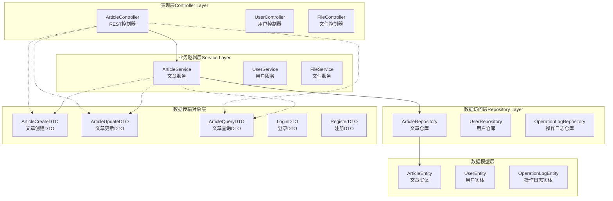
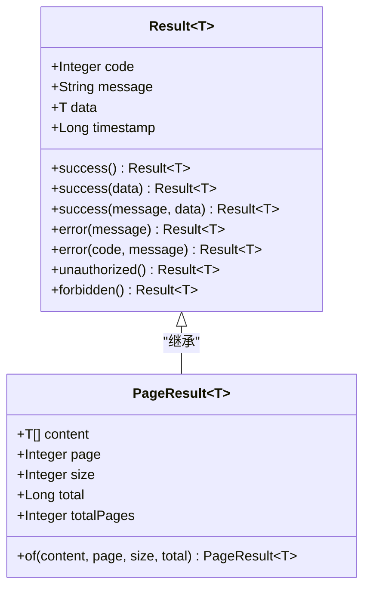
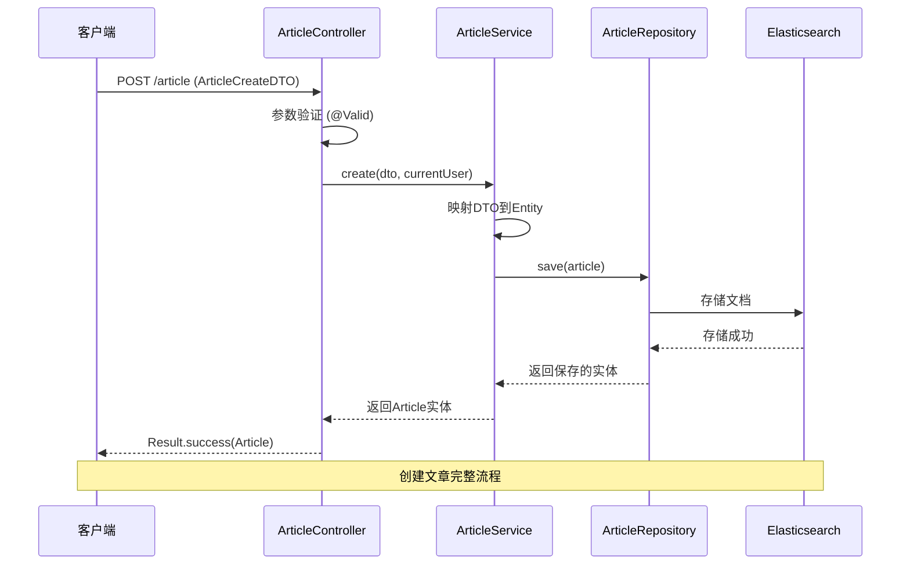
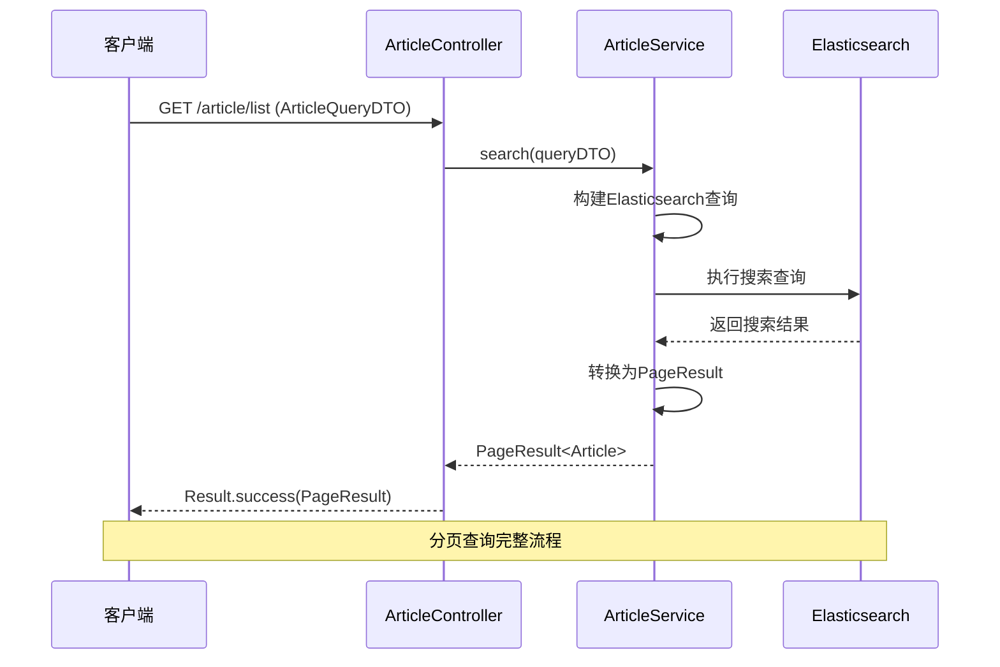
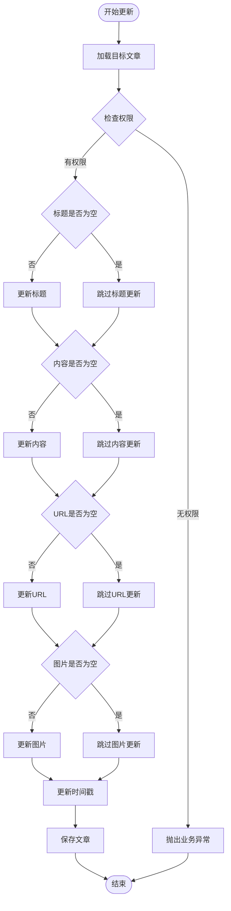
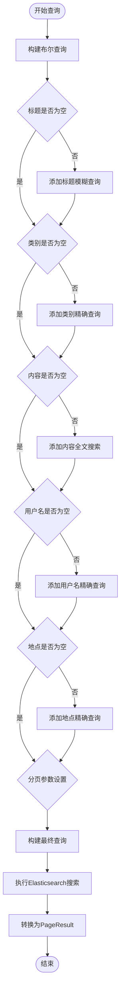
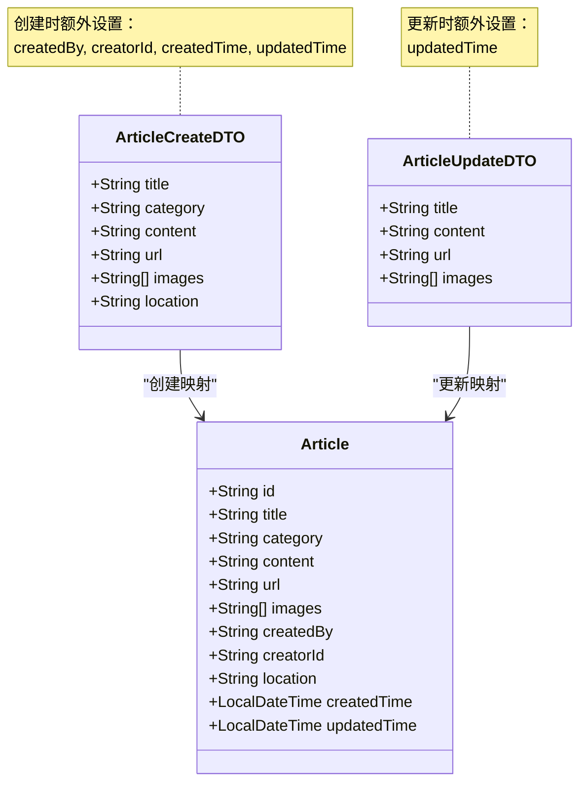
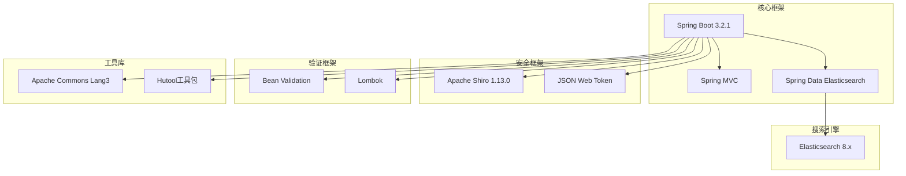
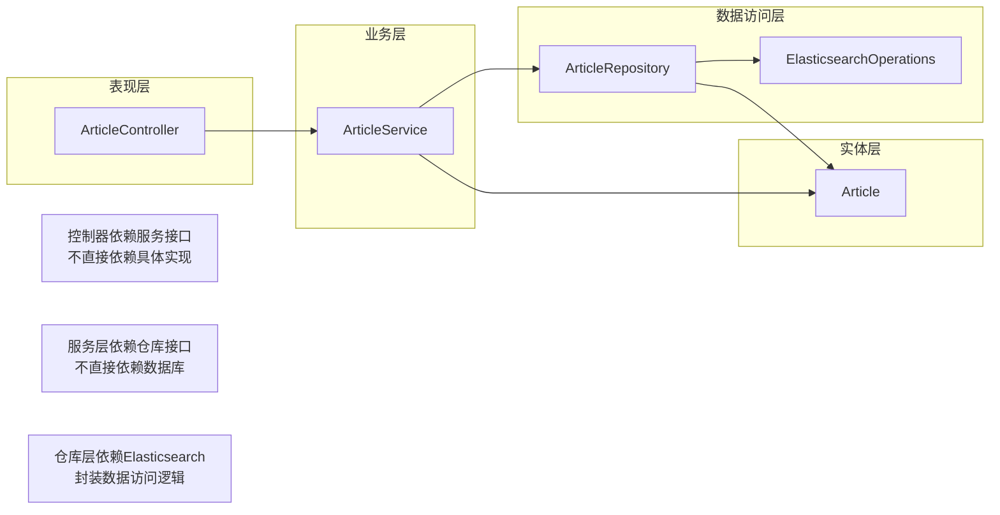

# 文章相关DTO

<cite>
**本文档引用的文件**
- [ArticleCreateDTO.java](file://src/main/java/com/zhishilu/dto/ArticleCreateDTO.java)
- [ArticleUpdateDTO.java](file://src/main/java/com/zhishilu/dto/ArticleUpdateDTO.java)
- [ArticleQueryDTO.java](file://src/main/java/com/zhishilu/dto/ArticleQueryDTO.java)
- [Article.java](file://src/main/java/com/zhishilu/entity/Article.java)
- [ArticleController.java](file://src/main/java/com/zhishilu/controller/ArticleController.java)
- [ArticleService.java](file://src/main/java/com/zhishilu/service/ArticleService.java)
- [ArticleRepository.java](file://src/main/java/com/zhishilu/repository/ArticleRepository.java)
- [Result.java](file://src/main/java/com/zhishilu/common/Result.java)
- [PageResult.java](file://src/main/java/com/zhishilu/common/PageResult.java)
- [README.md](file://README.md)
- [pom.xml](file://pom.xml)
</cite>

## 目录
1. [简介](#简介)
2. [项目结构](#项目结构)
3. [核心组件](#核心组件)
4. [架构概览](#架构概览)
5. [详细组件分析](#详细组件分析)
6. [依赖关系分析](#依赖关系分析)
7. [性能考虑](#性能考虑)
8. [故障排除指南](#故障排除指南)
9. [结论](#结论)
10. [附录](#附录)

## 简介

本文档详细介绍了知拾录系统中的文章相关DTO（数据传输对象）设计与实现。该系统是一个个人知识收藏管理系统，支持文章的创建、更新、查询等核心功能。文章相关DTO包括ArticleCreateDTO（文章创建DTO）、ArticleUpdateDTO（文章更新DTO）和ArticleQueryDTO（文章查询DTO），它们分别服务于不同的业务场景，具有明确的设计原则和验证规则。

知拾录系统采用Spring Boot 3.2.1 + Elasticsearch 8.x的技术栈，通过DTO模式实现了清晰的分层架构，确保了数据传输的安全性和一致性。系统支持JWT认证、基于Shiro的权限控制，并提供了完整的RESTful API接口。

## 项目结构

知拾录项目的整体架构采用经典的三层架构模式，主要分为以下层次：



**图表来源**
- [ArticleController.java](file://src/main/java/com/zhishilu/controller/ArticleController.java#L19-L88)
- [ArticleService.java](file://src/main/java/com/zhishilu/service/ArticleService.java#L31-L200)
- [ArticleRepository.java](file://src/main/java/com/zhishilu/repository/ArticleRepository.java#L9-L30)

**章节来源**
- [README.md](file://README.md#L1-L133)
- [pom.xml](file://pom.xml#L1-L129)

## 核心组件

### DTO设计原则

文章相关DTO的设计遵循以下核心原则：

1. **单一职责原则**：每个DTO专注于特定的操作场景
2. **最小暴露原则**：仅暴露必要的字段，避免信息泄露
3. **验证分离原则**：输入验证与业务逻辑分离
4. **向后兼容原则**：新增字段时保持向后兼容性

### 统一响应机制

系统采用统一的响应包装机制，确保所有API响应格式的一致性：



**图表来源**
- [Result.java](file://src/main/java/com/zhishilu/common/Result.java#L5-L71)
- [PageResult.java](file://src/main/java/com/zhishilu/common/PageResult.java#L9-L52)

**章节来源**
- [Result.java](file://src/main/java/com/zhishilu/common/Result.java#L1-L71)
- [PageResult.java](file://src/main/java/com/zhishilu/common/PageResult.java#L1-L52)

## 架构概览

### 整体架构流程



**图表来源**
- [ArticleController.java](file://src/main/java/com/zhishilu/controller/ArticleController.java#L29-L37)
- [ArticleService.java](file://src/main/java/com/zhishilu/service/ArticleService.java#L45-L59)
- [ArticleRepository.java](file://src/main/java/com/zhishilu/repository/ArticleRepository.java#L13-L29)

### 查询流程



**图表来源**
- [ArticleController.java](file://src/main/java/com/zhishilu/controller/ArticleController.java#L68-L75)
- [ArticleService.java](file://src/main/java/com/zhishilu/service/ArticleService.java#L116-L168)

## 详细组件分析

### ArticleCreateDTO - 文章创建DTO

ArticleCreateDTO是专门用于文章创建操作的数据传输对象，具有严格的字段验证规则。

#### 字段定义与验证规则

| 字段 | 类型 | 必填 | 长度限制 | 验证规则 | 业务含义 |
|------|------|------|----------|----------|----------|
| title | String | 是 | 最大64字符 | @NotBlank, @Size(max=64) | 文章标题，必须非空且不超过64字符 |
| category | String | 是 | 最大32字符 | @NotBlank, @Size(max=32) | 文章类别，必须非空且不超过32字符 |
| content | String | 否 | 无限制 | 无验证注解 | 文章正文内容，可为空 |
| url | String | 否 | 最大64字符 | @Size(max=64) | 文章来源网址，最多64字符 |
| images | List<String> | 否 | 无限制 | 无验证注解 | 图片URL列表，可为空 |
| location | String | 否 | 无限制 | 无验证注解 | 创建地点，可为空 |

#### 设计特点

1. **严格验证**：标题和类别字段强制要求非空
2. **长度控制**：关键字段设置合理的长度限制
3. **灵活性**：内容、URL、图片、地点等字段允许为空
4. **安全性**：避免敏感信息的过度暴露

#### 使用场景

- 新用户首次创建文章
- 导入外部内容时创建新文章
- 批量创建文章时的基础模板

**章节来源**
- [ArticleCreateDTO.java](file://src/main/java/com/zhishilu/dto/ArticleCreateDTO.java#L9-L32)

### ArticleUpdateDTO - 文章更新DTO

ArticleUpdateDTO专用于文章更新操作，采用宽松的字段设计，支持部分字段更新。

#### 字段定义与验证规则

| 字段 | 类型 | 必填 | 长度限制 | 验证规则 | 业务含义 |
|------|------|------|----------|----------|----------|
| title | String | 否 | 最大64字符 | @Size(max=64) | 文章标题，可为空（表示不更新） |
| content | String | 否 | 无限制 | 无验证注解 | 文章正文内容，可为空 |
| url | String | 否 | 最大64字符 | @Size(max=64) | 文章来源网址，可为空 |
| images | List<String> | 否 | 无限制 | 无验证注解 | 图片URL列表，可为空 |

#### 设计特点

1. **部分更新**：所有字段都允许为空，实现部分字段更新
2. **条件更新**：服务层根据字段是否为空决定是否更新
3. **长度验证**：仅对可能影响索引的字段进行长度验证
4. **权限控制**：更新操作包含严格的权限检查

#### 更新逻辑实现



**图表来源**
- [ArticleService.java](file://src/main/java/com/zhishilu/service/ArticleService.java#L64-L88)

**章节来源**
- [ArticleUpdateDTO.java](file://src/main/java/com/zhishilu/dto/ArticleUpdateDTO.java#L8-L24)
- [ArticleService.java](file://src/main/java/com/zhishilu/service/ArticleService.java#L64-L88)

### ArticleQueryDTO - 文章查询DTO

ArticleQueryDTO用于文章查询操作，支持多种查询条件和分页功能。

#### 字段定义与查询规则

| 字段 | 类型 | 默认值 | 查询方式 | 业务含义 |
|------|------|--------|----------|----------|
| title | String | null | 模糊匹配 | 标题模糊查询 |
| category | String | null | 精确匹配 | 类别精确查询 |
| content | String | null | 全文搜索 | 正文全文搜索 |
| username | String | null | 精确匹配 | 创建者用户名查询 |
| location | String | null | 精确匹配 | 地点精确查询 |
| page | Integer | 0 | 分页参数 | 当前页码（从0开始） |
| size | Integer | 10 | 分页参数 | 每页记录数 |

#### 查询逻辑实现



**图表来源**
- [ArticleService.java](file://src/main/java/com/zhishilu/service/ArticleService.java#L116-L168)

**章节来源**
- [ArticleQueryDTO.java](file://src/main/java/com/zhishilu/dto/ArticleQueryDTO.java#L5-L46)
- [ArticleService.java](file://src/main/java/com/zhishilu/service/ArticleService.java#L116-L168)

### DTO与实体类映射关系

#### Article实体类字段定义

| 字段 | 类型 | 索引类型 | 长度限制 | 业务含义 |
|------|------|----------|----------|----------|
| id | String | Keyword | 主键 | 文章唯一标识符 |
| title | String | Text | 最大64字符 | 文章标题，支持中文分词 |
| category | String | Keyword | 最大32字符 | 文章类别，精确匹配 |
| content | String | Text | 无限制 | 文章正文内容 |
| url | String | Keyword | 最大64字符 | 文章来源网址 |
| images | List<String> | Keyword | 无限制 | 图片URL列表 |
| createdBy | String | Keyword | 用户名 | 创建者用户名 |
| creatorId | String | Keyword | 用户ID | 创建者ID |
| location | String | Keyword | 地点 | 创建地点 |
| createdTime | LocalDateTime | Date | 时间戳 | 创建时间 |
| updatedTime | LocalDateTime | Date | 时间戳 | 更新时间 |

#### 映射策略



**图表来源**
- [ArticleCreateDTO.java](file://src/main/java/com/zhishilu/dto/ArticleCreateDTO.java#L13-L31)
- [ArticleUpdateDTO.java](file://src/main/java/com/zhishilu/dto/ArticleUpdateDTO.java#L12-L23)
- [Article.java](file://src/main/java/com/zhishilu/entity/Article.java#L16-L80)

**章节来源**
- [Article.java](file://src/main/java/com/zhishilu/entity/Article.java#L10-L81)
- [ArticleService.java](file://src/main/java/com/zhishilu/service/ArticleService.java#L45-L88)

## 依赖关系分析

### 技术栈依赖

系统采用现代化的Java技术栈，各组件之间的依赖关系如下：



**图表来源**
- [pom.xml](file://pom.xml#L27-L110)

### 组件耦合度分析

系统采用松耦合设计，各层之间通过接口和抽象类进行交互：



**图表来源**
- [ArticleController.java](file://src/main/java/com/zhishilu/controller/ArticleController.java#L22-L28)
- [ArticleService.java](file://src/main/java/com/zhishilu/service/ArticleService.java#L34-L41)
- [ArticleRepository.java](file://src/main/java/com/zhishilu/repository/ArticleRepository.java#L12-L13)

**章节来源**
- [pom.xml](file://pom.xml#L27-L110)

## 性能考虑

### Elasticsearch优化策略

1. **索引设计优化**：
   - 标题和内容使用Text类型，支持中文分词
   - 关键字字段使用Keyword类型，支持精确匹配
   - 设置合适的分片和副本数量

2. **查询性能优化**：
   - 使用布尔查询组合多个条件
   - 实现分页查询，避免全量数据返回
   - 利用Elasticsearch的聚合功能进行统计查询

3. **缓存策略**：
   - 对热门查询结果进行缓存
   - 缓存用户最常用类别统计

### DTO验证性能

1. **参数验证**：
   - 使用Bean Validation进行参数验证
   - 在Controller层进行输入验证，减少无效请求
   - 避免重复验证逻辑

2. **数据传输优化**：
   - DTO只包含必要字段，减少网络传输
   - 使用List而不是复杂对象，降低序列化开销

## 故障排除指南

### 常见问题及解决方案

#### 参数验证错误

**问题**：创建文章时出现参数验证错误
**原因**：标题或类别字段为空
**解决方案**：
- 确保标题和类别字段非空
- 检查字段长度是否超过限制
- 验证DTO绑定是否正确

#### 权限验证失败

**问题**：更新或删除文章时提示权限不足
**原因**：当前用户不是文章创建者
**解决方案**：
- 确认用户已登录
- 检查文章的创建者信息
- 验证用户身份认证状态

#### Elasticsearch连接问题

**问题**：查询文章时出现连接错误
**原因**：Elasticsearch服务不可用
**解决方案**：
- 检查Elasticsearch服务状态
- 验证连接配置
- 查看应用日志获取详细错误信息

#### 分页查询异常

**问题**：分页查询返回空结果
**原因**：查询条件过于严格或分页参数错误
**解决方案**：
- 检查查询条件的有效性
- 验证分页参数（page和size）
- 确认数据是否已正确索引

**章节来源**
- [ArticleService.java](file://src/main/java/com/zhishilu/service/ArticleService.java#L68-L103)
- [ArticleController.java](file://src/main/java/com/zhishilu/controller/ArticleController.java#L32-L47)

## 结论

知拾录系统的文章相关DTO设计体现了现代Java Web开发的最佳实践。通过精心设计的DTO模式，系统实现了：

1. **清晰的职责分离**：每种操作都有专门的DTO，职责明确
2. **强健的验证机制**：严格的参数验证确保数据质量
3. **灵活的映射策略**：支持部分字段更新和条件查询
4. **优秀的性能表现**：结合Elasticsearch实现高效的全文检索
5. **完善的错误处理**：统一的异常处理和响应格式

这些DTO不仅满足了当前的功能需求，还为未来的功能扩展奠定了良好的基础。通过遵循本文档提供的使用指南和最佳实践，开发者可以高效地使用这些DTO来实现各种文章管理功能。

## 附录

### API使用示例

#### 创建文章示例

```json
POST /api/article
{
    "title": "Spring Boot学习笔记",
    "category": "技术",
    "content": "这是一篇关于Spring Boot的学习笔记...",
    "url": "https://example.com/spring-boot",
    "images": ["image1.jpg", "image2.jpg"],
    "location": "北京"
}
```

#### 更新文章示例

```json
PUT /api/article/{id}
{
    "title": "Spring Boot 3.2.1新特性",
    "content": "更新后的学习笔记内容..."
}
```

#### 查询文章示例

```json
GET /api/article/list?page=0&size=10&category=技术&title=Spring
```

### 验证规则总结

| 验证类型 | 字段 | 规则 | 错误消息 |
|----------|------|------|----------|
| 必填验证 | title | @NotBlank | 标题不能为空 |
| 长度验证 | title | @Size(max=64) | 标题长度不能超过64个字符 |
| 必填验证 | category | @NotBlank | 类别不能为空 |
| 长度验证 | category | @Size(max=32) | 类别长度不能超过32个字符 |
| 长度验证 | url | @Size(max=64) | 网址长度不能超过64个字符 |

### 最佳实践建议

1. **DTO设计原则**：
   - 为每个业务场景创建专用的DTO
   - 遵循最小暴露原则，避免过度设计
   - 保持DTO与实体类的独立性

2. **验证策略**：
   - 在Controller层进行输入验证
   - 使用分组验证区分不同场景
   - 提供清晰的错误信息

3. **性能优化**：
   - 合理使用Elasticsearch查询
   - 优化索引设计和查询语句
   - 实施适当的缓存策略

4. **安全性考虑**：
   - 实施严格的权限控制
   - 防止SQL注入和XSS攻击
   - 加强数据传输安全