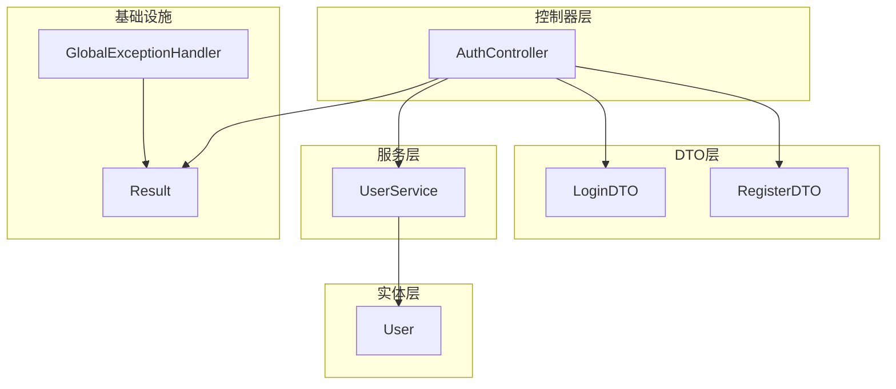
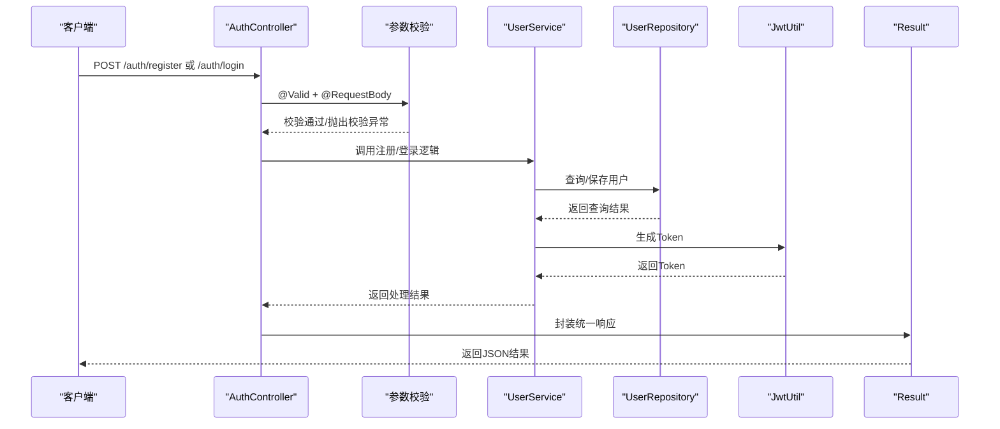
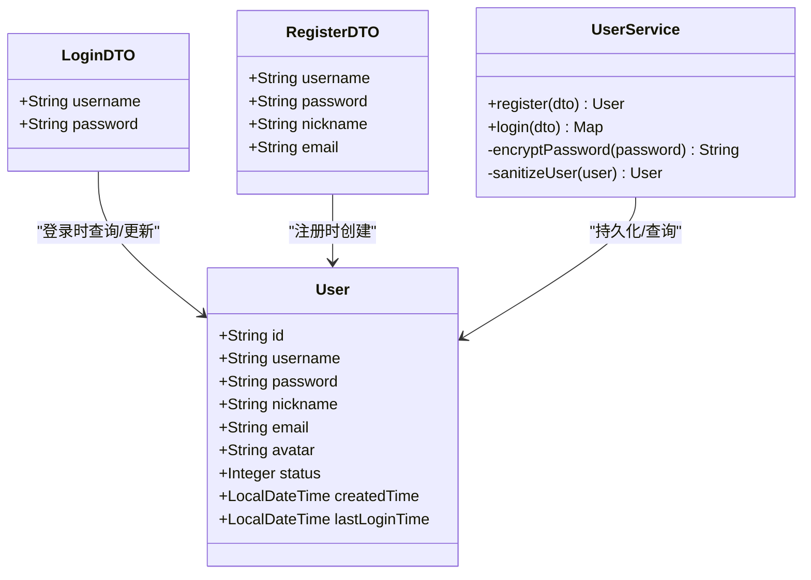
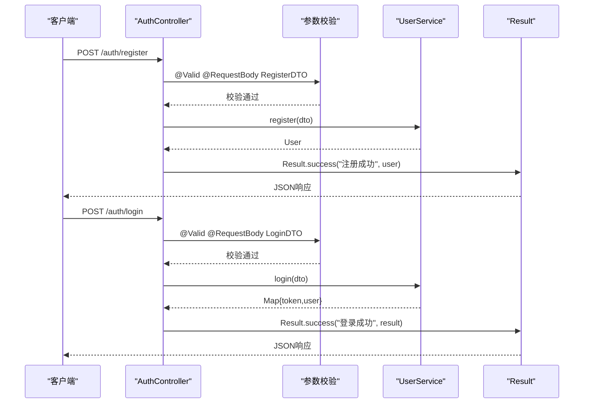
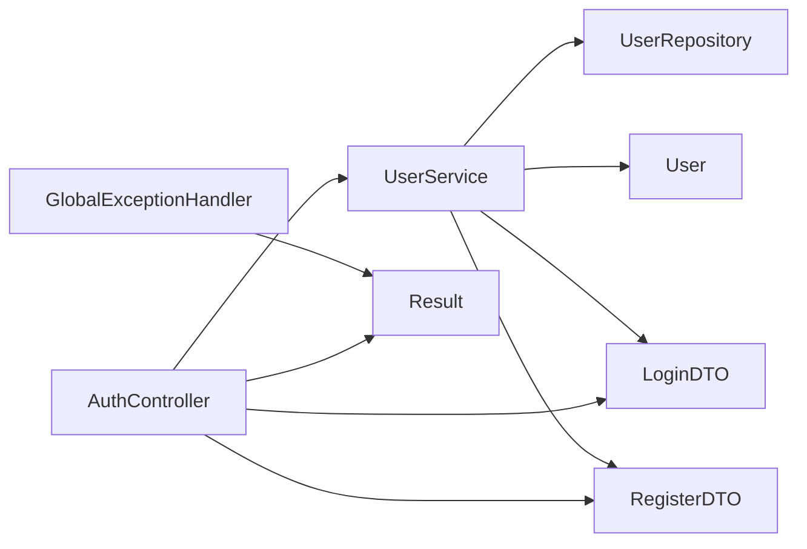

# 认证相关DTO

<cite>
**本文引用的文件**
- [LoginDTO.java](file://src/main/java/com/zhishilu/dto/LoginDTO.java)
- [RegisterDTO.java](file://src/main/java/com/zhishilu/dto/RegisterDTO.java)
- [AuthController.java](file://src/main/java/com/zhishilu/controller/AuthController.java)
- [UserService.java](file://src/main/java/com/zhishilu/service/UserService.java)
- [User.java](file://src/main/java/com/zhishilu/entity/User.java)
- [Result.java](file://src/main/java/com/zhishilu/common/Result.java)
- [GlobalExceptionHandler.java](file://src/main/java/com/zhishilu/exception/GlobalExceptionHandler.java)
</cite>

## 目录
1. [简介](#简介)
2. [项目结构](#项目结构)
3. [核心组件](#核心组件)
4. [架构总览](#架构总览)
5. [组件详细分析](#组件详细分析)
6. [依赖关系分析](#依赖关系分析)
7. [性能考虑](#性能考虑)
8. [故障排查指南](#故障排查指南)
9. [结论](#结论)
10. [附录](#附录)

## 简介
本文件聚焦于认证相关的DTO设计与实现，深入解析LoginDTO与RegisterDTO的设计理念、字段定义、验证规则、业务含义以及与实体类User的映射关系。同时说明这些DTO在控制器层的接收方式、参数绑定机制、与服务层的交互流程，并给出最佳实践与常见问题排查建议，帮助开发者在实际开发中高效、安全地使用认证参数。

## 项目结构
认证相关代码位于以下包与文件：
- DTO层：LoginDTO、RegisterDTO
- 控制器层：AuthController
- 服务层：UserService
- 实体层：User
- 结果封装：Result
- 全局异常处理：GlobalExceptionHandler

图表来源
- [AuthController.java](file://src/main/java/com/zhishilu/controller/AuthController.java#L1-L50)
- [UserService.java](file://src/main/java/com/zhishilu/service/UserService.java#L1-L128)
- [User.java](file://src/main/java/com/zhishilu/entity/User.java#L1-L68)
- [Result.java](file://src/main/java/com/zhishilu/common/Result.java#L1-L71)
- [GlobalExceptionHandler.java](file://src/main/java/com/zhishilu/exception/GlobalExceptionHandler.java#L1-L87)

章节来源
- [AuthController.java](file://src/main/java/com/zhishilu/controller/AuthController.java#L1-L50)
- [UserService.java](file://src/main/java/com/zhishilu/service/UserService.java#L1-L128)
- [User.java](file://src/main/java/com/zhishilu/entity/User.java#L1-L68)
- [Result.java](file://src/main/java/com/zhishilu/common/Result.java#L1-L71)
- [GlobalExceptionHandler.java](file://src/main/java/com/zhishilu/exception/GlobalExceptionHandler.java#L1-L87)

## 核心组件
- LoginDTO：用于登录接口的参数封装，包含用户名与密码两个必填字段。
- RegisterDTO：用于注册接口的参数封装，包含用户名、密码、昵称、邮箱等字段，并带有长度与格式校验。
- AuthController：对外暴露认证接口，负责接收DTO、触发参数校验、调用服务层并返回统一结果。
- UserService：实现注册与登录的核心逻辑，完成DTO到实体的映射、密码加密、状态检查与Token生成。
- User：认证流程中使用的实体类，包含用户基本信息与状态字段。
- Result：统一响应封装，规范所有接口的返回结构。
- GlobalExceptionHandler：集中处理参数校验异常、业务异常、认证/授权异常等，确保错误信息一致化输出。

章节来源
- [LoginDTO.java](file://src/main/java/com/zhishilu/dto/LoginDTO.java#L1-L18)
- [RegisterDTO.java](file://src/main/java/com/zhishilu/dto/RegisterDTO.java#L1-L28)
- [AuthController.java](file://src/main/java/com/zhishilu/controller/AuthController.java#L1-L50)
- [UserService.java](file://src/main/java/com/zhishilu/service/UserService.java#L1-L128)
- [User.java](file://src/main/java/com/zhishilu/entity/User.java#L1-L68)
- [Result.java](file://src/main/java/com/zhishilu/common/Result.java#L1-L71)
- [GlobalExceptionHandler.java](file://src/main/java/com/zhishilu/exception/GlobalExceptionHandler.java#L1-L87)

## 架构总览
认证流程从控制器接收请求开始，经过参数校验、服务层处理、数据库访问与Token生成，最终通过统一结果封装返回给客户端。异常处理贯穿整个流程，保证错误信息的一致性与可读性。

图表来源
- [AuthController.java](file://src/main/java/com/zhishilu/controller/AuthController.java#L27-L40)
- [UserService.java](file://src/main/java/com/zhishilu/service/UserService.java#L35-L87)
- [Result.java](file://src/main/java/com/zhishilu/common/Result.java#L20-L41)
- [GlobalExceptionHandler.java](file://src/main/java/com/zhishilu/exception/GlobalExceptionHandler.java#L56-L63)

## 组件详细分析

### LoginDTO 设计与实现
- 字段定义与验证规则
  - username：非空校验，用于登录凭证之一。
  - password：非空校验，用于登录凭证之一。
- 数据类型与业务含义
  - 字符串类型，承载用户标识与凭据。
- 注解与错误消息
  - 使用非空校验注解，错误消息采用中文提示，便于前端直接展示。
- 在控制器中的接收方式
  - 通过POST请求体接收，配合@Valid启用参数校验；校验失败由全局异常处理器捕获并返回统一错误结构。

章节来源
- [LoginDTO.java](file://src/main/java/com/zhishilu/dto/LoginDTO.java#L10-L17)
- [AuthController.java](file://src/main/java/com/zhishilu/controller/AuthController.java#L36-L40)
- [GlobalExceptionHandler.java](file://src/main/java/com/zhishilu/exception/GlobalExceptionHandler.java#L56-L63)

### RegisterDTO 设计与实现
- 字段定义与验证规则
  - username：非空且长度限制在3-20字符之间。
  - password：非空且长度限制在6-32字符之间。
  - nickname：可选，最大长度20字符。
  - email：可选，需满足邮箱格式。
- 数据类型与业务含义
  - 字符串类型，承载注册所需的基础信息。
- 注解与错误消息
  - 长度与格式校验注解，错误消息采用中文提示，提升用户体验。
- 在控制器中的接收方式
  - 通过POST请求体接收，配合@Valid启用参数校验；校验失败由全局异常处理器捕获并返回统一错误结构。

章节来源
- [RegisterDTO.java](file://src/main/java/com/zhishilu/dto/RegisterDTO.java#L12-L27)
- [AuthController.java](file://src/main/java/com/zhishilu/controller/AuthController.java#L27-L31)
- [GlobalExceptionHandler.java](file://src/main/java/com/zhishilu/exception/GlobalExceptionHandler.java#L56-L63)

### DTO与实体类User的映射关系与转换策略
- 映射策略
  - 注册时：将DTO中的用户名、密码、昵称、邮箱等映射到User实体；密码进行加密后再写入；默认状态为正常；创建时间与最后登录时间初始化。
  - 登录时：根据用户名查询User实体，验证密码（加密后比对），检查状态，更新最后登录时间；生成Token并返回包含Token与清理后的用户信息。
- 数据转换与清理
  - 清理敏感信息：在返回前对用户信息进行脱敏处理，避免敏感字段泄露。
- 复杂度与性能
  - 映射过程为O(1)，主要开销在密码加密与数据库IO；可通过缓存与索引优化查询性能。

图表来源
- [LoginDTO.java](file://src/main/java/com/zhishilu/dto/LoginDTO.java#L10-L17)
- [RegisterDTO.java](file://src/main/java/com/zhishilu/dto/RegisterDTO.java#L12-L27)
- [User.java](file://src/main/java/com/zhishilu/entity/User.java#L15-L67)
- [UserService.java](file://src/main/java/com/zhishilu/service/UserService.java#L35-L87)

章节来源
- [UserService.java](file://src/main/java/com/zhishilu/service/UserService.java#L35-L87)
- [User.java](file://src/main/java/com/zhishilu/entity/User.java#L15-L67)

### 控制器层接收与参数绑定机制
- 接口定义
  - 注册接口：POST /auth/register，接收RegisterDTO并返回统一结果。
  - 登录接口：POST /auth/login，接收LoginDTO并返回统一结果。
- 参数绑定
  - 使用@RequestBody将HTTP请求体绑定到DTO对象。
  - 使用@Valid启用Bean Validation校验，自动触发字段级校验规则。
- 响应封装
  - 使用Result统一包装响应，包含状态码、消息与数据体。

图表来源
- [AuthController.java](file://src/main/java/com/zhishilu/controller/AuthController.java#L27-L40)
- [Result.java](file://src/main/java/com/zhishilu/common/Result.java#L20-L41)

章节来源
- [AuthController.java](file://src/main/java/com/zhishilu/controller/AuthController.java#L27-L40)
- [Result.java](file://src/main/java/com/zhishilu/common/Result.java#L20-L41)

### 认证流程中的参数验证最佳实践
- 使用@NotBlank/@Size/@Email等注解明确约束，错误消息使用中文，便于前端直接展示。
- 在控制器方法上使用@Valid，确保参数校验在进入业务逻辑之前完成。
- 全局异常处理捕获MethodArgumentNotValidException与BindException，统一返回400错误与错误消息拼接。
- 对于登录场景，密码采用加密存储与比对，避免明文传输与存储。
- 对返回数据进行脱敏，仅返回必要字段，降低信息泄露风险。

章节来源
- [RegisterDTO.java](file://src/main/java/com/zhishilu/dto/RegisterDTO.java#L14-L26)
- [LoginDTO.java](file://src/main/java/com/zhishilu/dto/LoginDTO.java#L12-L16)
- [GlobalExceptionHandler.java](file://src/main/java/com/zhishilu/exception/GlobalExceptionHandler.java#L56-L75)
- [UserService.java](file://src/main/java/com/zhishilu/service/UserService.java#L108-L110)

## 依赖关系分析
- 控制器依赖服务层：AuthController通过注入UserService完成注册与登录逻辑。
- 服务层依赖实体与仓库：UserService在注册时创建User实体并持久化，在登录时查询User并更新状态。
- 异常处理依赖统一结果：GlobalExceptionHandler将各类异常转换为Result格式，保证响应一致性。
- DTO与实体映射：RegisterDTO与LoginDTO分别驱动User实体的创建与查询/更新。

图表来源
- [AuthController.java](file://src/main/java/com/zhishilu/controller/AuthController.java#L22-L23)
- [UserService.java](file://src/main/java/com/zhishilu/service/UserService.java#L27-L28)
- [User.java](file://src/main/java/com/zhishilu/entity/User.java#L15-L67)
- [GlobalExceptionHandler.java](file://src/main/java/com/zhishilu/exception/GlobalExceptionHandler.java#L56-L63)

章节来源
- [AuthController.java](file://src/main/java/com/zhishilu/controller/AuthController.java#L22-L23)
- [UserService.java](file://src/main/java/com/zhishilu/service/UserService.java#L27-L28)
- [GlobalExceptionHandler.java](file://src/main/java/com/zhishilu/exception/GlobalExceptionHandler.java#L56-L63)

## 性能考虑
- 密码加密成本：注册与登录均涉及密码加密，建议在服务层使用合理的迭代次数与盐值策略，平衡安全性与性能。
- 数据库查询：用户名与邮箱的唯一性检查应建立索引，避免全表扫描。
- Token生成：Token生成为轻量操作，但需注意并发下的唯一性与过期策略。
- 响应脱敏：对返回数据进行脱敏处理，减少序列化开销与信息泄露风险。

## 故障排查指南
- 参数校验失败
  - 现象：返回400错误，消息为字段级校验错误的拼接。
  - 排查：确认DTO字段注解配置是否正确，请求体格式是否符合要求。
- 业务异常
  - 现象：返回500错误，消息为业务异常描述。
  - 排查：检查用户名/邮箱重复、账号状态异常、密码错误等情况。
- 认证/授权异常
  - 现象：返回401/403错误，消息为未授权或无权限。
  - 排查：确认Token生成与传递、Shiro配置与拦截链路。

章节来源
- [GlobalExceptionHandler.java](file://src/main/java/com/zhishilu/exception/GlobalExceptionHandler.java#L27-L51)
- [UserService.java](file://src/main/java/com/zhishilu/service/UserService.java#L62-L73)

## 结论
LoginDTO与RegisterDTO通过明确的字段定义、严格的参数校验与清晰的业务含义，为认证流程提供了可靠的数据入口。结合AuthController的参数绑定与统一结果封装、UserService的实体映射与Token生成，以及GlobalExceptionHandler的异常处理机制，形成了一个高内聚、低耦合、易维护的认证体系。遵循本文的最佳实践，可在保证安全性的同时提升开发效率与用户体验。

## 附录
- 使用示例（路径参考）
  - 注册：POST /auth/register，请求体包含用户名、密码、昵称、邮箱等字段，参见[AuthController.java](file://src/main/java/com/zhishilu/controller/AuthController.java#L27-L31)与[RegisterDTO.java](file://src/main/java/com/zhishilu/dto/RegisterDTO.java#L12-L27)。
  - 登录：POST /auth/login，请求体包含用户名与密码，参见[AuthController.java](file://src/main/java/com/zhishilu/controller/AuthController.java#L36-L40)与[LoginDTO.java](file://src/main/java/com/zhishilu/dto/LoginDTO.java#L10-L17)。
- 错误处理：参数校验异常统一返回400，业务异常返回500，认证/授权异常返回401/403，参见[GlobalExceptionHandler.java](file://src/main/java/com/zhishilu/exception/GlobalExceptionHandler.java#L56-L75)。