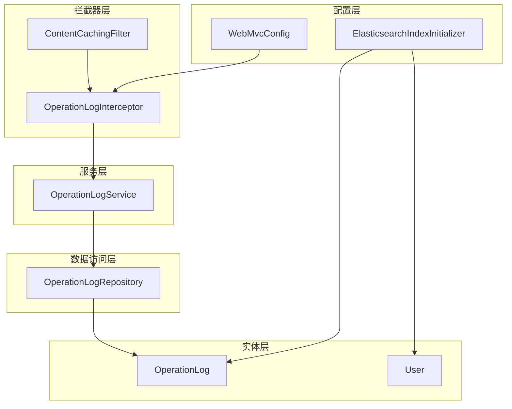
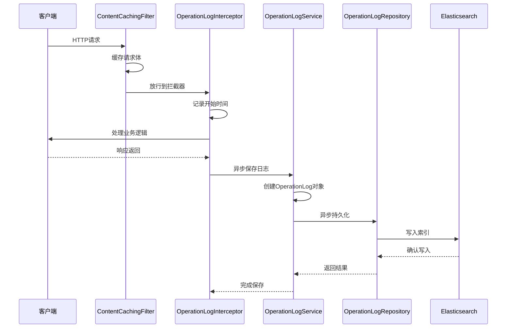
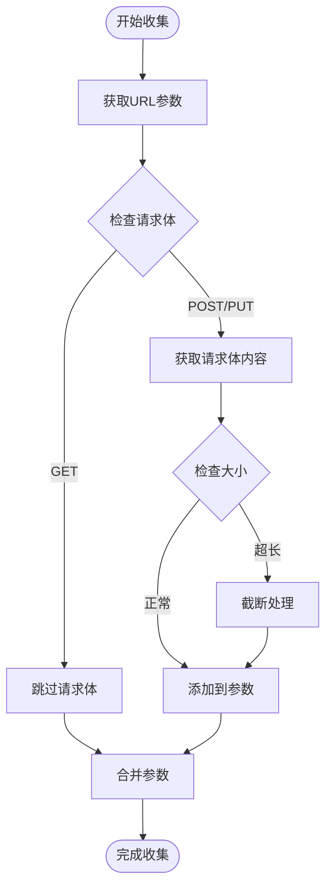
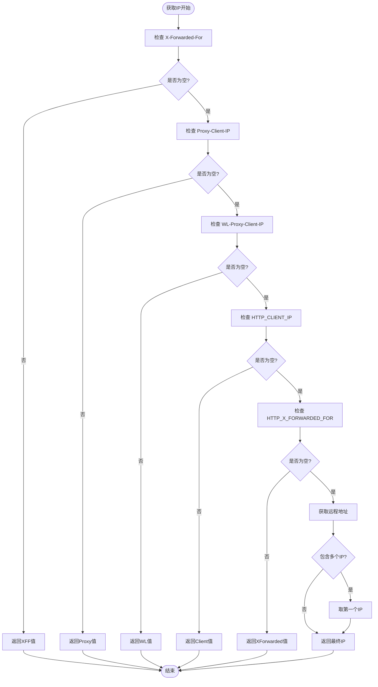
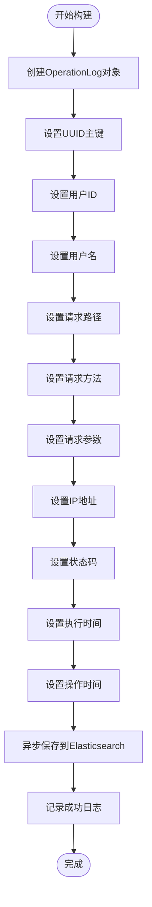
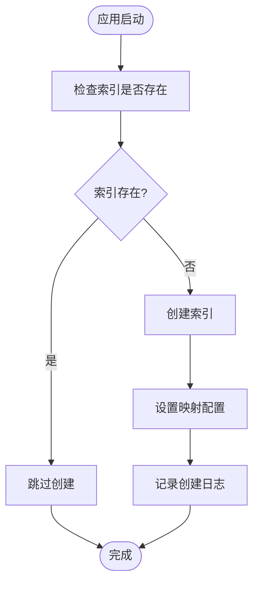
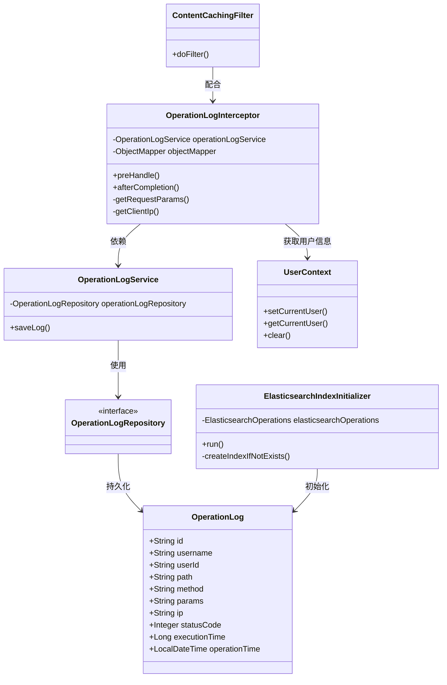
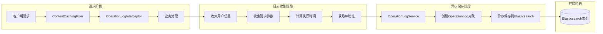

# 操作日志实体模型

<cite>
**本文档引用的文件**
- [OperationLog.java](file://src/main/java/com/zhishilu/entity/OperationLog.java)
- [OperationLogInterceptor.java](file://src/main/java/com/zhishilu/interceptor/OperationLogInterceptor.java)
- [OperationLogService.java](file://src/main/java/com/zhishilu/service/OperationLogService.java)
- [OperationLogRepository.java](file://src/main/java/com/zhishilu/repository/OperationLogRepository.java)
- [ElasticsearchIndexInitializer.java](file://src/main/java/com/zhishilu/config/ElasticsearchIndexInitializer.java)
- [WebMvcConfig.java](file://src/main/java/com/zhishilu/config/WebMvcConfig.java)
- [ContentCachingFilter.java](file://src/main/java/com/zhishilu/filter/ContentCachingFilter.java)
- [UserContext.java](file://src/main/java/com/zhishilu/util/UserContext.java)
- [User.java](file://src/main/java/com/zhishilu/entity/User.java)
- [application.yml](file://src/main/resources/application.yml)
</cite>

## 目录
1. [简介](#简介)
2. [项目结构](#项目结构)
3. [核心组件](#核心组件)
4. [架构概览](#架构概览)
5. [详细组件分析](#详细组件分析)
6. [依赖关系分析](#依赖关系分析)
7. [性能考量](#性能考量)
8. [故障排除指南](#故障排除指南)
9. [结论](#结论)
10. [附录](#附录)

## 简介
OperationLog操作日志实体是系统监控和审计追踪的核心组件，负责记录用户的所有关键操作行为。该实体采用Elasticsearch作为存储引擎，通过Spring Data Elasticsearch进行持久化管理，实现了高性能的日志查询和统计分析能力。

## 项目结构
系统采用分层架构设计，OperationLog相关组件分布在以下层次：
- 实体层：OperationLog实体类定义数据结构
- 服务层：OperationLogService处理业务逻辑
- 数据访问层：OperationLogRepository提供数据持久化接口
- 配置层：WebMvcConfig和ElasticsearchIndexInitializer配置系统行为
- 过滤器层：ContentCachingFilter和OperationLogInterceptor处理请求拦截

**图表来源**
- [WebMvcConfig.java](file://src/main/java/com/zhishilu/config/WebMvcConfig.java#L14-L52)
- [ElasticsearchIndexInitializer.java](file://src/main/java/com/zhishilu/config/ElasticsearchIndexInitializer.java#L16-L40)
- [ContentCachingFilter.java](file://src/main/java/com/zhishilu/filter/ContentCachingFilter.java#L16-L34)
- [OperationLogInterceptor.java](file://src/main/java/com/zhishilu/interceptor/OperationLogInterceptor.java#L22-L128)
- [OperationLogService.java](file://src/main/java/com/zhishilu/service/OperationLogService.java#L16-L49)
- [OperationLogRepository.java](file://src/main/java/com/zhishilu/repository/OperationLogRepository.java#L10-L13)
- [OperationLog.java](file://src/main/java/com/zhishilu/entity/OperationLog.java#L12-L74)

**章节来源**
- [WebMvcConfig.java](file://src/main/java/com/zhishilu/config/WebMvcConfig.java#L14-L52)
- [ElasticsearchIndexInitializer.java](file://src/main/java/com/zhishilu/config/ElasticsearchIndexInitializer.java#L16-L40)

## 核心组件

### OperationLog实体类设计
OperationLog实体类采用注解驱动的Elasticsearch映射配置，每个字段都经过精心设计以支持高效的查询和统计分析。

#### 主键设计
- **字段名称**: id
- **数据类型**: String
- **映射配置**: 使用Spring Data Elasticsearch的@Id注解
- **生成策略**: UUID随机生成，确保全局唯一性
- **性能特点**: 字符串主键在分布式环境中具有更好的扩展性

#### 用户标识字段
- **用户ID (userId)**: Keyword类型，支持精确匹配和聚合统计
- **用户名 (username)**: Keyword类型，便于用户维度的分析查询

#### 请求信息字段
- **请求路径 (path)**: Keyword类型，支持路径前缀匹配和精确查询
- **请求方法 (method)**: Keyword类型，便于按HTTP方法分类统计
- **请求参数 (params)**: Text类型但不建立倒排索引，避免存储过大数据影响性能

#### 网络信息字段
- **IP地址 (ip)**: Keyword类型，支持地理位置分析和安全审计
- **响应状态码 (statusCode)**: Integer类型，便于错误率统计和异常分析

#### 性能指标字段
- **执行时间 (executionTime)**: Long类型，单位毫秒，支持排序和统计分析
- **操作时间 (operationTime)**: Date类型，ISO格式存储，支持时间范围查询

**章节来源**
- [OperationLog.java](file://src/main/java/com/zhishilu/entity/OperationLog.java#L12-L74)

## 架构概览
系统采用异步拦截器模式实现操作日志的无侵入式收集，通过多层组件协作实现完整的日志生命周期管理。

**图表来源**
- [ContentCachingFilter.java](file://src/main/java/com/zhishilu/filter/ContentCachingFilter.java#L16-L34)
- [OperationLogInterceptor.java](file://src/main/java/com/zhishilu/interceptor/OperationLogInterceptor.java#L32-L64)
- [OperationLogService.java](file://src/main/java/com/zhishilu/service/OperationLogService.java#L26-L47)
- [OperationLogRepository.java](file://src/main/java/com/zhishilu/repository/OperationLogRepository.java#L10-L13)

## 详细组件分析

### 操作日志拦截器 (OperationLogInterceptor)
拦截器负责在请求完成后收集必要的日志信息，并触发异步保存流程。

#### 核心功能模块
1. **请求参数收集**: 支持GET参数和POST请求体的完整收集
2. **IP地址解析**: 处理代理服务器场景下的真实IP获取
3. **执行时间计算**: 精确测量请求处理耗时
4. **异步日志保存**: 避免阻塞主线程响应

#### 参数收集机制

**图表来源**
- [OperationLogInterceptor.java](file://src/main/java/com/zhishilu/interceptor/OperationLogInterceptor.java#L69-L99)

#### IP地址解析算法
拦截器实现了多级IP解析机制，优先使用标准代理头，最终回退到直接IP：

**图表来源**
- [OperationLogInterceptor.java](file://src/main/java/com/zhishilu/interceptor/OperationLogInterceptor.java#L104-L126)

**章节来源**
- [OperationLogInterceptor.java](file://src/main/java/com/zhishilu/interceptor/OperationLogInterceptor.java#L19-L128)

### 操作日志服务 (OperationLogService)
服务层负责日志对象的创建和异步持久化，确保不影响业务请求的响应时间。

#### 异步保存机制
- **@Async注解**: 使用Spring异步任务执行器
- **线程池配置**: 默认使用SimpleAsyncTaskExecutor
- **异常处理**: 完善的try-catch机制防止日志异常影响主业务

#### 日志对象构建流程

**图表来源**
- [OperationLogService.java](file://src/main/java/com/zhishilu/service/OperationLogService.java#L26-L47)

**章节来源**
- [OperationLogService.java](file://src/main/java/com/zhishilu/service/OperationLogService.java#L13-L49)

### 数据访问层 (OperationLogRepository)
基于Spring Data Elasticsearch的Repository接口，提供简洁的数据访问能力。

#### 接口特性
- **泛型支持**: 继承ElasticsearchRepository<OperationLog, String>
- **自动实现**: Spring Data自动生成CRUD操作实现
- **查询方法**: 支持自定义查询方法的声明式定义

**章节来源**
- [OperationLogRepository.java](file://src/main/java/com/zhishilu/repository/OperationLogRepository.java#L7-L13)

### Elasticsearch索引初始化
系统启动时自动创建必要的索引和映射配置。

#### 初始化流程

**图表来源**
- [ElasticsearchIndexInitializer.java](file://src/main/java/com/zhishilu/config/ElasticsearchIndexInitializer.java#L23-L38)

**章节来源**
- [ElasticsearchIndexInitializer.java](file://src/main/java/com/zhishilu/config/ElasticsearchIndexInitializer.java#L13-L40)

## 依赖关系分析

### 类关系图

**图表来源**
- [OperationLog.java](file://src/main/java/com/zhishilu/entity/OperationLog.java#L12-L74)
- [OperationLogInterceptor.java](file://src/main/java/com/zhishilu/interceptor/OperationLogInterceptor.java#L22-L128)
- [OperationLogService.java](file://src/main/java/com/zhishilu/service/OperationLogService.java#L16-L49)
- [OperationLogRepository.java](file://src/main/java/com/zhishilu/repository/OperationLogRepository.java#L10-L13)
- [ElasticsearchIndexInitializer.java](file://src/main/java/com/zhishilu/config/ElasticsearchIndexInitializer.java#L16-L40)
- [ContentCachingFilter.java](file://src/main/java/com/zhishilu/filter/ContentCachingFilter.java#L16-L34)
- [UserContext.java](file://src/main/java/com/zhishilu/util/UserContext.java#L8-L33)

### 数据流分析
系统通过以下数据流实现完整的日志收集和存储：

**图表来源**
- [ContentCachingFilter.java](file://src/main/java/com/zhishilu/filter/ContentCachingFilter.java#L21-L32)
- [OperationLogInterceptor.java](file://src/main/java/com/zhishilu/interceptor/OperationLogInterceptor.java#L32-L64)
- [OperationLogService.java](file://src/main/java/com/zhishilu/service/OperationLogService.java#L26-L47)

**章节来源**
- [WebMvcConfig.java](file://src/main/java/com/zhishilu/config/WebMvcConfig.java#L33-L41)

## 性能考量

### 存储优化策略
1. **字段映射优化**
   - Keyword类型字段用于精确匹配和聚合统计
   - Text类型字段设置index=false避免不必要的全文索引
   - Date类型使用ISO格式存储，支持高效的时间范围查询

2. **内存使用控制**
   - 请求参数截断机制，限制最大长度避免内存溢出
   - 异步保存机制避免阻塞主线程

3. **索引配置**
   - 单分片单副本配置，适合开发环境
   - 可根据生产环境需求调整分片数量

### 查询性能优化
1. **字段选择性**
   - 用户相关字段使用Keyword类型，支持高效的用户维度查询
   - 时间字段使用Date类型，支持精确的时间范围查询

2. **聚合统计**
   - 支持按用户、方法、状态码等维度的聚合分析
   - 执行时间字段支持统计分析和性能监控

3. **查询优化建议**
   - 使用精确匹配而非通配符匹配
   - 合理使用过滤条件减少查询范围
   - 对高频查询字段建立适当的索引

**章节来源**
- [OperationLog.java](file://src/main/java/com/zhishilu/entity/OperationLog.java#L23-L72)
- [OperationLogInterceptor.java](file://src/main/java/com/zhishilu/interceptor/OperationLogInterceptor.java#L86-L91)

## 故障排除指南

### 常见问题及解决方案

#### 日志收集失败
**问题现象**: 操作日志无法正常记录
**可能原因**:
1. Elasticsearch连接异常
2. 拦截器配置错误
3. 异步任务执行器未正确配置

**解决步骤**:
1. 检查Elasticsearch连接配置
2. 验证拦截器注册情况
3. 查看异步任务执行状态

#### IP地址获取异常
**问题现象**: 日志中显示的IP地址不正确
**可能原因**:
1. 代理服务器配置问题
2. 请求头被中间件修改

**解决步骤**:
1. 检查代理服务器配置
2. 验证请求头传递
3. 调整IP解析优先级

#### 性能问题
**问题现象**: 系统响应变慢
**可能原因**:
1. 日志量过大
2. Elasticsearch性能瓶颈
3. 异步任务堆积

**解决步骤**:
1. 优化日志级别
2. 调整Elasticsearch配置
3. 监控异步任务队列

**章节来源**
- [application.yml](file://src/main/resources/application.yml#L13-L18)
- [OperationLogInterceptor.java](file://src/main/java/com/zhishilu/interceptor/OperationLogInterceptor.java#L58-L63)

## 结论
OperationLog操作日志实体通过精心设计的架构实现了高效、可靠的日志收集和存储。其主要优势包括：

1. **无侵入式设计**: 通过拦截器模式实现日志收集，不影响业务代码
2. **高性能存储**: 基于Elasticsearch的分布式存储，支持大规模日志数据
3. **灵活查询**: 支持多种维度的查询和统计分析
4. **异步处理**: 避免日志收集影响业务性能
5. **可扩展性**: 模块化设计便于功能扩展和维护

该系统为系统的监控、审计和故障排查提供了强有力的技术支撑，是现代企业级应用不可或缺的重要组件。

## 附录

### 使用示例
以下是一些常见的日志查询使用场景：

#### 基础查询示例
- 按用户查询: `username:admin AND operationTime:[now-7d/d TO now/d]`
- 按方法查询: `method:POST AND statusCode:[500 TO 599]`
- 按时间范围查询: `operationTime:[2024-01-01T00:00:00 TO 2024-01-02T00:00:00]`

#### 统计分析示例
- 错误率统计: `terms(field="statusCode")`
- 用户活跃度: `terms(field="username")`
- 性能分析: `stats(field="executionTime")`

### 最佳实践
1. **合理设置日志级别**: 生产环境建议使用INFO级别
2. **定期清理历史日志**: 建立日志保留策略
3. **监控系统健康**: 定期检查Elasticsearch集群状态
4. **备份重要日志**: 关键业务日志需要额外备份