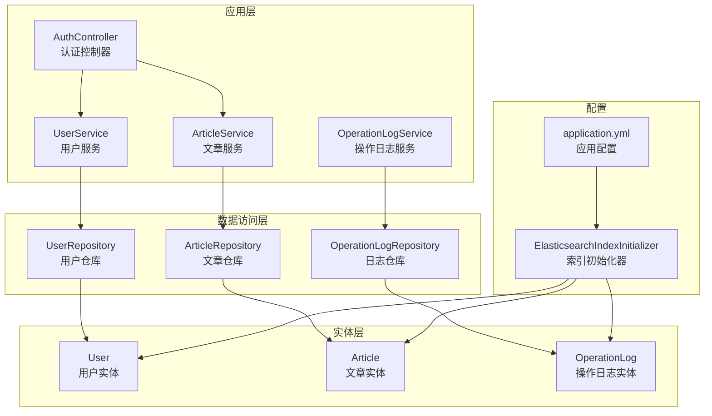
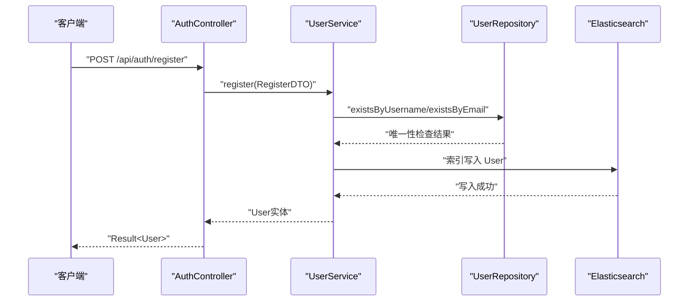
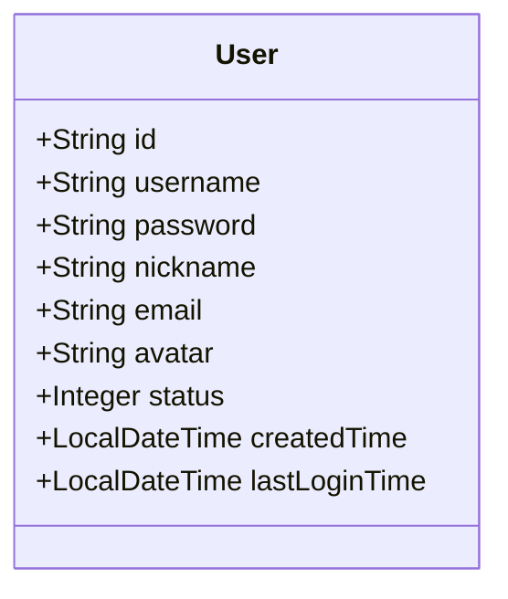
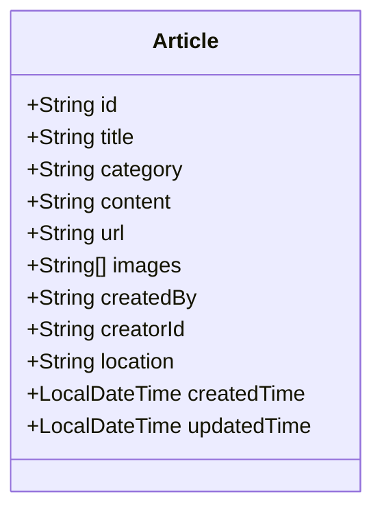
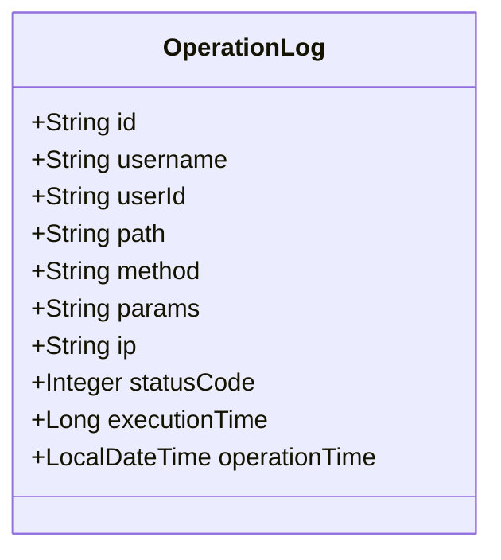
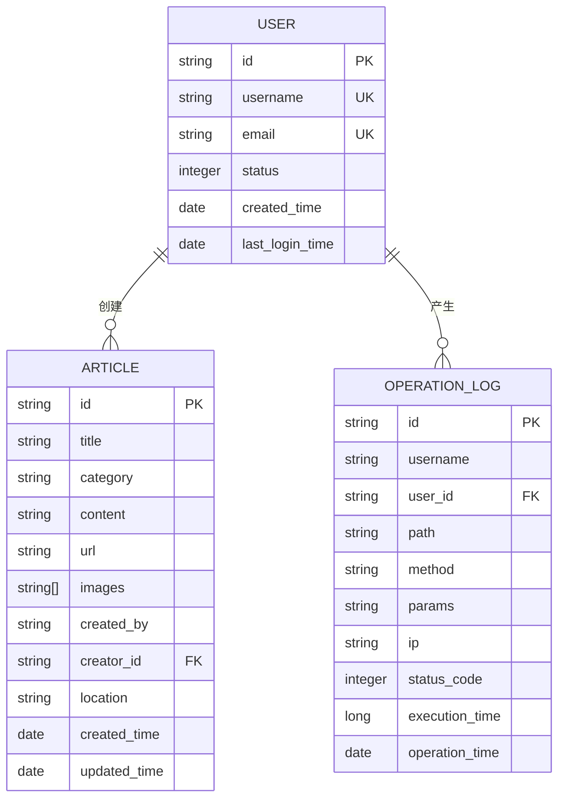
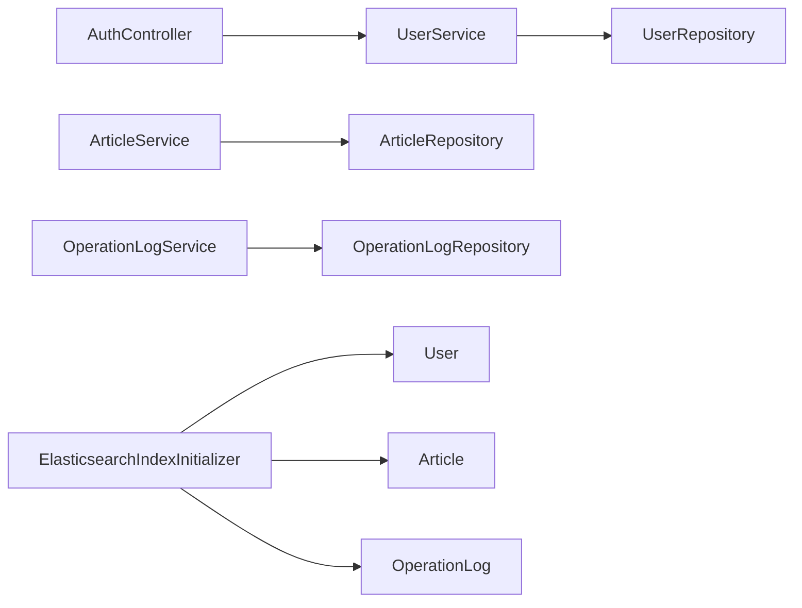

# 数据模型

<cite>
**本文引用的文件**
- [src\main\java\com\zhishilu\entity\User.java](file://src\main\java\com\zhishilu\entity\User.java)
- [src\main\java\com\zhishilu\entity\Article.java](file://src\main\java\com\zhishilu\entity\Article.java)
- [src\main\java\com\zhishilu\entity\OperationLog.java](file://src\main\java\com\zhishilu\entity\OperationLog.java)
- [src\main\java\com\zhishilu\repository\UserRepository.java](file://src\main\java\com\zhishilu\repository\UserRepository.java)
- [src\main\java\com\zhishilu\repository\ArticleRepository.java](file://src\main\java\com\zhishilu\repository\ArticleRepository.java)
- [src\main\java\com\zhishilu\repository\OperationLogRepository.java](file://src\main\java\com\zhishilu\repository\OperationLogRepository.java)
- [src\main\java\com\zhishilu\service\UserService.java](file://src\main\java\com\zhishilu\service\UserService.java)
- [src\main\java\com\zhishilu\service\ArticleService.java](file://src\main\java\com\zhishilu\service\ArticleService.java)
- [src\main\java\com\zhishilu\service\OperationLogService.java](file://src\main\java\com\zhishilu\service\OperationLogService.java)
- [src\main\java\com\zhishilu\config\ElasticsearchIndexInitializer.java](file://src\main\java\com\zhishilu\config\ElasticsearchIndexInitializer.java)
- [src\main\resources\application.yml](file://src\main\resources\application.yml)
- [src\main\java\com\zhishilu\dto\RegisterDTO.java](file://src\main\java\com\zhishilu\dto\RegisterDTO.java)
- [src\main\java\com\zhishilu\dto\LoginDTO.java](file://src\main\java\com\zhishilu\dto\LoginDTO.java)
- [src\main\java\com\zhishilu\dto\ArticleCreateDTO.java](file://src\main\java\com\zhishilu\dto\ArticleCreateDTO.java)
- [src\main\java\com\zhishilu\dto\ArticleQueryDTO.java](file://src\main\java\com\zhishilu\dto\ArticleQueryDTO.java)
- [src\main\java\com\zhishilu\controller\AuthController.java](file://src\main\java\com\zhishilu\controller\AuthController.java)
</cite>

## 目录
1. [简介](#简介)
2. [项目结构](#项目结构)
3. [核心组件](#核心组件)
4. [架构总览](#架构总览)
5. [详细组件分析](#详细组件分析)
6. [依赖分析](#依赖分析)
7. [性能考量](#性能考量)
8. [故障排查指南](#故障排查指南)
9. [结论](#结论)
10. [附录](#附录)

## 简介
本文件为“知拾录”项目的数据模型与实现文档，聚焦于以下实体类的设计与实现：User（用户）、Article（文章/内容）、OperationLog（操作日志）。文档涵盖字段定义、数据类型、约束条件、业务规则、实体关系映射、索引设计与关联查询、Elasticsearch索引映射与全文检索配置、数据生命周期与缓存策略、性能优化建议，以及面向数据库设计与数据访问层开发的技术指导。

## 项目结构
项目采用Spring Boot + Spring Data Elasticsearch的架构，实体类通过注解声明Elasticsearch索引映射；仓库接口基于Spring Data ElasticsearchRepository提供CRUD与派生查询；服务层封装业务逻辑与数据校验；控制器负责HTTP请求处理；应用配置文件提供ES连接与系统参数。

**图表来源**
- [src\main\java\com\zhishilu\controller\AuthController.java](file://src\main\java\com\zhishilu\controller\AuthController.java#L1-L50)
- [src\main\java\com\zhishilu\service\UserService.java](file://src\main\java\com\zhishilu\service\UserService.java#L1-L128)
- [src\main\java\com\zhishilu\service\ArticleService.java](file://src\main\java\com\zhishilu\service\ArticleService.java#L1-L200)
- [src\main\java\com\zhishilu\service\OperationLogService.java](file://src\main\java\com\zhishilu\service\OperationLogService.java#L1-L49)
- [src\main\java\com\zhishilu\repository\UserRepository.java](file://src\main\java\com\zhishilu\repository\UserRepository.java#L1-L35)
- [src\main\java\com\zhishilu\repository\ArticleRepository.java](file://src\main\java\com\zhishilu\repository\ArticleRepository.java#L1-L30)
- [src\main\java\com\zhishilu\repository\OperationLogRepository.java](file://src\main\java\com\zhishilu\repository\OperationLogRepository.java#L1-L13)
- [src\main\java\com\zhishilu\entity\User.java](file://src\main\java\com\zhishilu\entity\User.java#L1-L68)
- [src\main\java\com\zhishilu\entity\Article.java](file://src\main\java\com\zhishilu\entity\Article.java#L1-L81)
- [src\main\java\com\zhishilu\entity\OperationLog.java](file://src\main\java\com\zhishilu\entity\OperationLog.java#L1-L74)
- [src\main\resources\application.yml](file://src\main\resources\application.yml#L1-L47)
- [src\main\java\com\zhishilu\config\ElasticsearchIndexInitializer.java](file://src\main\java\com\zhishilu\config\ElasticsearchIndexInitializer.java#L1-L40)

**章节来源**
- [src\main\java\com\zhishilu\controller\AuthController.java](file://src\main\java\com\zhishilu\controller\AuthController.java#L1-L50)
- [src\main\resources\application.yml](file://src\main\resources\application.yml#L1-L47)

## 核心组件
本节对三大实体类进行字段级说明，包括数据类型、字段含义、约束与业务规则，并给出Elasticsearch索引映射要点。

- User（用户）
  - 主键：id（字符串UUID）
  - 关键字段与类型
    - username：keyword（唯一性由业务保证）
    - password：keyword（不参与倒排索引，避免被搜索）
    - nickname：keyword
    - email：keyword
    - avatar：keyword
    - status：integer（1-正常，0-禁用）
    - createdTime：date（格式：毫秒时间戳）
    - lastLoginTime：date（格式：毫秒时间戳）
  - 约束与规则
    - 注册时用户名与邮箱唯一性检查（仓库提供existsByUsername/existsByEmail）
    - 登录时校验状态与密码（SHA-256+盐，迭代1024次）
    - 登录成功后更新lastLoginTime
  - 索引映射
    - 索引名称：zhishilu_user
    - 分片：1，副本：0
    - 字段类型按需选择keyword/text/date，部分字段禁用倒排索引以保护隐私

- Article（文章/内容）
  - 主键：id（字符串UUID）
  - 关键字段与类型
    - title：text（IK分词器：ik_max_word用于索引，ik_smart用于查询）
    - category：keyword
    - content：text（IK分词器）
    - url：keyword
    - images：keyword[]（图片路径列表）
    - createdBy：keyword（创建者用户名）
    - creatorId：keyword（创建者ID）
    - location：keyword（创建地点）
    - createdTime：date（格式：毫秒时间戳）
    - updatedTime：date（格式：毫秒时间戳）
  - 约束与规则
    - 创建/更新/删除均受“仅作者可操作”权限控制
    - 查询支持多条件布尔组合（标题、类别、内容、用户名、地点）
    - 支持按创建时间降序分页
  - 索引映射
    - 索引名称：zhishilu_article
    - 分片：1，副本：0
    - 标题与正文使用IK中文分词器，便于中文全文检索

- OperationLog（操作日志）
  - 主键：id（字符串UUID）
  - 关键字段与类型
    - username：keyword
    - userId：keyword
    - path：keyword
    - method：keyword
    - params：text（禁用倒排索引，避免敏感信息被索引）
    - ip：keyword
    - statusCode：integer
    - executionTime：long（毫秒）
    - operationTime：date（格式：毫秒时间戳）
  - 约束与规则
    - 异步保存，异常不影响主线程
    - 用于审计与性能追踪
  - 索引映射
    - 索引名称：zhishilu_log
    - 分片：1，副本：0

**章节来源**
- [src\main\java\com\zhishilu\entity\User.java](file://src\main\java\com\zhishilu\entity\User.java#L1-L68)
- [src\main\java\com\zhishilu\entity\Article.java](file://src\main\java\com\zhishilu\entity\Article.java#L1-L81)
- [src\main\java\com\zhishilu\entity\OperationLog.java](file://src\main\java\com\zhishilu\entity\OperationLog.java#L1-L74)
- [src\main\java\com\zhishilu\repository\UserRepository.java](file://src\main\java\com\zhishilu\repository\UserRepository.java#L1-L35)
- [src\main\java\com\zhishilu\repository\ArticleRepository.java](file://src\main\java\com\zhishilu\repository\ArticleRepository.java#L1-L30)
- [src\main\java\com\zhishilu\repository\OperationLogRepository.java](file://src\main\java\com\zhishilu\repository\OperationLogRepository.java#L1-L13)

## 架构总览
下图展示数据模型在系统中的位置与交互：控制器接收请求，调用服务层，服务层通过仓库接口持久化到Elasticsearch，索引由初始化器统一创建与映射。

**图表来源**
- [src\main\java\com\zhishilu\controller\AuthController.java](file://src\main\java\com\zhishilu\controller\AuthController.java#L1-L50)
- [src\main\java\com\zhishilu\service\UserService.java](file://src\main\java\com\zhishilu\service\UserService.java#L1-L128)
- [src\main\java\com\zhishilu\repository\UserRepository.java](file://src\main\java\com\zhishilu\repository\UserRepository.java#L1-L35)
- [src\main\java\com\zhishilu\config\ElasticsearchIndexInitializer.java](file://src\main\java\com\zhishilu\config\ElasticsearchIndexInitializer.java#L1-L40)

## 详细组件分析

### 用户实体 User
- 设计要点
  - 使用keyword字段承载可精确匹配的标识信息（用户名、邮箱、状态等）
  - password字段禁用倒排索引，避免泄露
  - 时间字段统一使用毫秒时间戳date格式
- 业务规则
  - 注册：唯一性校验、默认状态为1、生成UUID、记录创建时间
  - 登录：校验状态与密码、更新最后登录时间、签发JWT
- 数据验证
  - DTO层对用户名、密码、昵称、邮箱进行长度与格式校验

**图表来源**
- [src\main\java\com\zhishilu\entity\User.java](file://src\main\java\com\zhishilu\entity\User.java#L1-L68)

**章节来源**
- [src\main\java\com\zhishilu\entity\User.java](file://src\main\java\com\zhishilu\entity\User.java#L1-L68)
- [src\main\java\com\zhishilu\service\UserService.java](file://src\main\java\com\zhishilu\service\UserService.java#L1-L128)
- [src\main\java\com\zhishilu\dto\RegisterDTO.java](file://src\main\java\com\zhishilu\dto\RegisterDTO.java#L1-L28)
- [src\main\java\com\zhishilu\dto\LoginDTO.java](file://src\main\java\com\zhishilu\dto\LoginDTO.java#L1-L18)

### 文章实体 Article
- 设计要点
  - 标题与正文使用IK中文分词器，支持中文全文检索
  - category、url、images、createdBy、creatorId、location使用keyword便于精确过滤
  - 时间字段记录创建与更新时间
- 业务规则
  - 仅作者可更新/删除
  - 支持多条件布尔查询（标题、类别、内容、用户名、地点），默认按创建时间倒序
  - 提供按作者ID与类别的组合查询
- 聚合统计
  - 提供按作者ID的类别Top-N聚合（默认前10）

**图表来源**
- [src\main\java\com\zhishilu\entity\Article.java](file://src\main\java\com\zhishilu\entity\Article.java#L1-L81)

**章节来源**
- [src\main\java\com\zhishilu\entity\Article.java](file://src\main\java\com\zhishilu\entity\Article.java#L1-L81)
- [src\main\java\com\zhishilu\service\ArticleService.java](file://src\main\java\com\zhishilu\service\ArticleService.java#L1-L200)
- [src\main\java\com\zhishilu\repository\ArticleRepository.java](file://src\main\java\com\zhishilu\repository\ArticleRepository.java#L1-L30)
- [src\main\java\com\zhishilu\dto\ArticleCreateDTO.java](file://src\main\java\com\zhishilu\dto\ArticleCreateDTO.java#L1-L32)
- [src\main\java\com\zhishilu\dto\ArticleQueryDTO.java](file://src\main\java\com\zhishilu\dto\ArticleQueryDTO.java#L1-L46)

### 操作日志实体 OperationLog
- 设计要点
  - 记录请求路径、方法、参数、IP、状态码、执行时间与操作时间
  - params字段禁用倒排索引，避免敏感信息被索引
  - 异步保存，降低对主流程影响
- 业务规则
  - 由拦截器收集上下文并异步写入

**图表来源**
- [src\main\java\com\zhishilu\entity\OperationLog.java](file://src\main\java\com\zhishilu\entity\OperationLog.java#L1-L74)

**章节来源**
- [src\main\java\com\zhishilu\entity\OperationLog.java](file://src\main\java\com\zhishilu\entity\OperationLog.java#L1-L74)
- [src\main\java\com\zhishilu\service\OperationLogService.java](file://src\main\java\com\zhishilu\service\OperationLogService.java#L1-L49)
- [src\main\java\com\zhishilu\repository\OperationLogRepository.java](file://src\main\java\com\zhishilu\repository\OperationLogRepository.java#L1-L13)

### 数据验证与默认值
- DTO层验证
  - RegisterDTO：用户名3-20字符、密码6-32字符、昵称≤20字符、邮箱格式
  - LoginDTO：用户名与密码非空
  - ArticleCreateDTO：标题与类别非空且有长度上限，URL与内容长度限制
- 默认值
  - 注册时默认状态为1，昵称为空则回退为用户名，创建与更新时间自动填充

**章节来源**
- [src\main\java\com\zhishilu\dto\RegisterDTO.java](file://src\main\java\com\zhishilu\dto\RegisterDTO.java#L1-L28)
- [src\main\java\com\zhishilu\dto\LoginDTO.java](file://src\main\java\com\zhishilu\dto\LoginDTO.java#L1-L18)
- [src\main\java\com\zhishilu\dto\ArticleCreateDTO.java](file://src\main\java\com\zhishilu\dto\ArticleCreateDTO.java#L1-L32)
- [src\main\java\com\zhishilu\service\UserService.java](file://src\main\java\com\zhishilu\service\UserService.java#L1-L128)
- [src\main\java\com\zhishilu\service\ArticleService.java](file://src\main\java\com\zhishilu\service\ArticleService.java#L1-L200)

### Elasticsearch索引映射与全文检索
- 索引初始化
  - 应用启动时通过CommandLineRunner创建索引（如不存在）并写入映射
- 索引配置
  - 用户索引：zhishilu_user，分片=1，副本=0
  - 文章索引：zhishilu_article，分片=1，副本=0
  - 日志索引：zhishilu_log，分片=1，副本=0
- 全文检索
  - 标题与正文使用IK分词器（ik_max_word索引，ik_smart查询），提升中文检索效果
  - 精确匹配使用keyword字段（类别、用户名、URL、IP等）

**章节来源**
- [src\main\java\com\zhishilu\config\ElasticsearchIndexInitializer.java](file://src\main\java\com\zhishilu\config\ElasticsearchIndexInitializer.java#L1-L40)
- [src\main\resources\application.yml](file://src\main\resources\application.yml#L1-L47)
- [src\main\java\com\zhishilu\entity\Article.java](file://src\main\java\com\zhishilu\entity\Article.java#L1-L81)
- [src\main\java\com\zhishilu\entity\User.java](file://src\main\java\com\zhishilu\entity\User.java#L1-L68)
- [src\main\java\com\zhishilu\entity\OperationLog.java](file://src\main\java\com\zhishilu\entity\OperationLog.java#L1-L74)

### 关系映射与关联查询
- 实体间关系
  - Article与User：一对多（一个用户可创建多篇文章），通过creatorId与createdBy建立逻辑关联
  - Article与OperationLog：无直接实体关系，可通过查询条件（如creatorId、username）进行关联分析
- 仓库派生查询
  - UserRepository：按用户名/邮箱查询与唯一性检查
  - ArticleRepository：按作者ID、类别、组合条件查询
  - OperationLogRepository：基础CRUD（日志异步写入）

**图表来源**
- [src\main\java\com\zhishilu\entity\User.java](file://src\main\java\com\zhishilu\entity\User.java#L1-L68)
- [src\main\java\com\zhishilu\entity\Article.java](file://src\main\java\com\zhishilu\entity\Article.java#L1-L81)
- [src\main\java\com\zhishilu\entity\OperationLog.java](file://src\main\java\com\zhishilu\entity\OperationLog.java#L1-L74)
- [src\main\java\com\zhishilu\repository\UserRepository.java](file://src\main\java\com\zhishilu\repository\UserRepository.java#L1-L35)
- [src\main\java\com\zhishilu\repository\ArticleRepository.java](file://src\main\java\com\zhishilu\repository\ArticleRepository.java#L1-L30)
- [src\main\java\com\zhishilu\repository\OperationLogRepository.java](file://src\main\java\com\zhishilu\repository\OperationLogRepository.java#L1-L13)

## 依赖分析
- 控制器依赖服务层，服务层依赖仓库接口与工具类
- 仓库接口继承ElasticsearchRepository，自动获得CRUD与派生查询能力
- 初始化器在应用启动时确保索引存在并具备映射

**图表来源**
- [src\main\java\com\zhishilu\controller\AuthController.java](file://src\main\java\com\zhishilu\controller\AuthController.java#L1-L50)
- [src\main\java\com\zhishilu\service\UserService.java](file://src\main\java\com\zhishilu\service\UserService.java#L1-L128)
- [src\main\java\com\zhishilu\service\ArticleService.java](file://src\main\java\com\zhishilu\service\ArticleService.java#L1-L200)
- [src\main\java\com\zhishilu\service\OperationLogService.java](file://src\main\java\com\zhishilu\service\OperationLogService.java#L1-L49)
- [src\main\java\com\zhishilu\repository\UserRepository.java](file://src\main\java\com\zhishilu\repository\UserRepository.java#L1-L35)
- [src\main\java\com\zhishilu\repository\ArticleRepository.java](file://src\main\java\com\zhishilu\repository\ArticleRepository.java#L1-L30)
- [src\main\java\com\zhishilu\repository\OperationLogRepository.java](file://src\main\java\com\zhishilu\repository\OperationLogRepository.java#L1-L13)
- [src\main\java\com\zhishilu\config\ElasticsearchIndexInitializer.java](file://src\main\java\com\zhishilu\config\ElasticsearchIndexInitializer.java#L1-L40)

**章节来源**
- [src\main\java\com\zhishilu\controller\AuthController.java](file://src\main\java\com\zhishilu\controller\AuthController.java#L1-L50)
- [src\main\java\com\zhishilu\service\UserService.java](file://src\main\java\com\zhishilu\service\UserService.java#L1-L128)
- [src\main\java\com\zhishilu\service\ArticleService.java](file://src\main\java\com\zhishilu\service\ArticleService.java#L1-L200)
- [src\main\java\com\zhishilu\service\OperationLogService.java](file://src\main\java\com\zhishilu\service\OperationLogService.java#L1-L49)
- [src\main\java\com\zhishilu\repository\UserRepository.java](file://src\main\java\com\zhishilu\repository\UserRepository.java#L1-L35)
- [src\main\java\com\zhishilu\repository\ArticleRepository.java](file://src\main\java\com\zhishilu\repository\ArticleRepository.java#L1-L30)
- [src\main\java\com\zhishilu\repository\OperationLogRepository.java](file://src\main\java\com\zhishilu\repository\OperationLogRepository.java#L1-L13)
- [src\main\java\com\zhishilu\config\ElasticsearchIndexInitializer.java](file://src\main\java\com\zhishilu\config\ElasticsearchIndexInitializer.java#L1-L40)

## 性能考量
- 索引分片与副本
  - 当前分片=1、副本=0，适合开发/小规模场景；生产环境建议根据数据量与并发调整分片与副本数量
- 字段类型选择
  - keyword用于精确匹配与聚合统计；text用于全文检索；禁用倒排索引的字段（如password、params）避免存储冗余与安全风险
- 查询优化
  - 使用布尔查询组合多条件，优先使用keyword字段进行精确过滤，减少高基数字段的模糊匹配
  - 分页查询按创建时间倒序，避免随机排序带来的开销
- 异步日志
  - 操作日志异步写入，避免阻塞请求链路
- 缓存策略
  - 当前未见Redis等缓存实现；可在高频读取的用户信息与热门文章聚合结果上引入本地缓存或分布式缓存，注意缓存失效策略与一致性

[本节为通用性能建议，无需特定文件引用]

## 故障排查指南
- 索引不存在或映射缺失
  - 确认应用启动日志中索引初始化完成信息；检查Elasticsearch连接配置与凭据
- 登录失败
  - 核对用户名是否存在、密码是否匹配（SHA-256+盐，迭代1024次）、用户状态是否为1
- 权限不足
  - 更新/删除文章需校验creatorId与当前用户ID一致
- 查询无结果
  - 标题与内容使用IK分词器，注意查询关键词与索引分词方式；类别、用户名、地点使用精确匹配
- 日志未落盘
  - 检查异步线程池配置与OperationLogService异常捕获逻辑

**章节来源**
- [src\main\java\com\zhishilu\config\ElasticsearchIndexInitializer.java](file://src\main\java\com\zhishilu\config\ElasticsearchIndexInitializer.java#L1-L40)
- [src\main\resources\application.yml](file://src\main\resources\application.yml#L1-L47)
- [src\main\java\com\zhishilu\service\UserService.java](file://src\main\java\com\zhishilu\service\UserService.java#L1-L128)
- [src\main\java\com\zhishilu\service\ArticleService.java](file://src\main\java\com\zhishilu\service\ArticleService.java#L1-L200)
- [src\main\java\com\zhishilu\service\OperationLogService.java](file://src\main\java\com\zhishilu\service\OperationLogService.java#L1-L49)

## 结论
本数据模型围绕User、Article、OperationLog三类实体构建，采用Elasticsearch作为主要存储与检索引擎，结合Spring Data Elasticsearch实现高效的数据访问。通过合理的字段类型选择、索引映射与查询策略，满足中文全文检索、精确过滤与审计需求。建议在生产环境中优化分片与副本、引入缓存与异步处理，并持续完善监控与日志体系。

[本节为总结性内容，无需特定文件引用]

## 附录
- 字段长度与约束摘要
  - 用户名：3-20字符
  - 密码：6-32字符
  - 昵称：≤20字符
  - 邮箱：符合邮箱格式
  - 标题：≤64字符
  - 类别：≤32字符
  - URL：≤64字符
  - 图片路径：列表形式
- 默认值与时间戳
  - 注册默认状态：1
  - 昵称为空时回退为用户名
  - 创建/更新时间自动填充
- 安全注意事项
  - 密码采用SHA-256+盐，迭代1024次
  - 敏感字段（password、params）禁用倒排索引
  - JWT令牌配置包含密钥与过期时间

**章节来源**
- [src\main\java\com\zhishilu\dto\RegisterDTO.java](file://src\main\java\com\zhishilu\dto\RegisterDTO.java#L1-L28)
- [src\main\java\com\zhishilu\dto\ArticleCreateDTO.java](file://src\main\java\com\zhishilu\dto\ArticleCreateDTO.java#L1-L32)
- [src\main\java\com\zhishilu\service\UserService.java](file://src\main\java\com\zhishilu\service\UserService.java#L1-L128)
- [src\main\resources\application.yml](file://src\main\resources\application.yml#L1-L47)