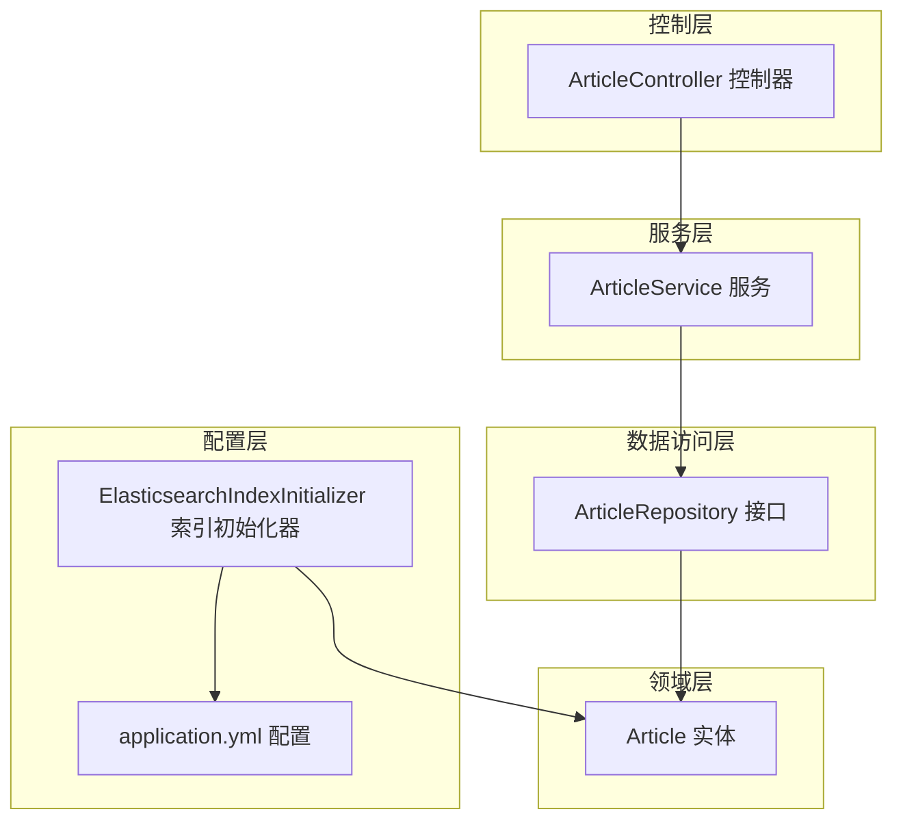
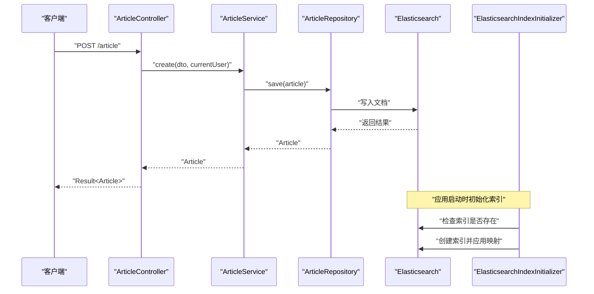
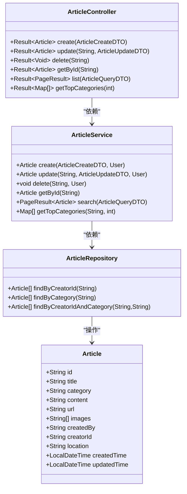

# 文章实体模型

<cite>
**本文引用的文件**
- [Article.java](file://src/main/java/com/zhishilu/entity/Article.java)
- [ArticleRepository.java](file://src/main/java/com/zhishilu/repository/ArticleRepository.java)
- [ArticleService.java](file://src/main/java/com/zhishilu/service/ArticleService.java)
- [ArticleController.java](file://src/main/java/com/zhishilu/controller/ArticleController.java)
- [ArticleCreateDTO.java](file://src/main/java/com/zhishilu/dto/ArticleCreateDTO.java)
- [ArticleUpdateDTO.java](file://src/main/java/com/zhishilu/dto/ArticleUpdateDTO.java)
- [ArticleQueryDTO.java](file://src/main/java/com/zhishilu/dto/ArticleQueryDTO.java)
- [ElasticsearchIndexInitializer.java](file://src/main/java/com/zhishilu/config/ElasticsearchIndexInitializer.java)
- [application.yml](file://src/main/resources/application.yml)
</cite>

## 目录
1. [简介](#简介)
2. [项目结构](#项目结构)
3. [核心组件](#核心组件)
4. [架构总览](#架构总览)
5. [详细组件分析](#详细组件分析)
6. [依赖关系分析](#依赖关系分析)
7. [性能考虑](#性能考虑)
8. [故障排除指南](#故障排除指南)
9. [结论](#结论)
10. [附录](#附录)

## 简介
本文件为Article文章实体的全面数据模型文档，覆盖实体类设计、Elasticsearch字段映射配置、全文检索字段设计、字段间业务关系与验证规则、在文章管理与搜索推荐中的应用，以及字段使用示例与性能优化建议。目标是帮助开发者与产品人员快速理解Article实体的结构与用法，并在实际开发中正确使用与扩展。

## 项目结构
Article实体位于领域层，配合DTO、Repository、Service与Controller构成完整的文章管理与搜索流程。Elasticsearch索引初始化器负责在应用启动时自动创建并映射索引。

图表来源
- [Article.java](file://src/main/java/com/zhishilu/entity/Article.java#L1-L81)
- [ArticleRepository.java](file://src/main/java/com/zhishilu/repository/ArticleRepository.java#L1-L30)
- [ArticleService.java](file://src/main/java/com/zhishilu/service/ArticleService.java#L1-L200)
- [ArticleController.java](file://src/main/java/com/zhishilu/controller/ArticleController.java#L1-L88)
- [ElasticsearchIndexInitializer.java](file://src/main/java/com/zhishilu/config/ElasticsearchIndexInitializer.java#L1-L40)
- [application.yml](file://src/main/resources/application.yml#L1-L47)

章节来源
- [Article.java](file://src/main/java/com/zhishilu/entity/Article.java#L1-L81)
- [ArticleRepository.java](file://src/main/java/com/zhishilu/repository/ArticleRepository.java#L1-L30)
- [ArticleService.java](file://src/main/java/com/zhishilu/service/ArticleService.java#L1-L200)
- [ArticleController.java](file://src/main/java/com/zhishilu/controller/ArticleController.java#L1-L88)
- [ElasticsearchIndexInitializer.java](file://src/main/java/com/zhishilu/config/ElasticsearchIndexInitializer.java#L1-L40)
- [application.yml](file://src/main/resources/application.yml#L1-L47)

## 核心组件
- Article实体：定义文章在Elasticsearch中的文档结构与字段映射，包含主键、标题、内容、URL、图片、作者信息、分类、创建/更新时间等。
- ArticleRepository：基于Spring Data Elasticsearch的仓储接口，提供按创建者ID、类别、组合条件查询的能力。
- ArticleService：业务服务层，负责文章的创建、更新、删除、查询、分页搜索与聚合统计（如用户常用类别）。
- ArticleController：REST控制器，暴露文章的增删改查、分页列表与推荐接口。
- DTO：ArticleCreateDTO、ArticleUpdateDTO、ArticleQueryDTO分别承载创建、更新、查询请求参数及校验规则。
- ElasticsearchIndexInitializer：应用启动时自动创建索引并应用映射。
- application.yml：Elasticsearch连接配置与日志级别设置。

章节来源
- [Article.java](file://src/main/java/com/zhishilu/entity/Article.java#L1-L81)
- [ArticleRepository.java](file://src/main/java/com/zhishilu/repository/ArticleRepository.java#L1-L30)
- [ArticleService.java](file://src/main/java/com/zhishilu/service/ArticleService.java#L1-L200)
- [ArticleController.java](file://src/main/java/com/zhishilu/controller/ArticleController.java#L1-L88)
- [ArticleCreateDTO.java](file://src/main/java/com/zhishilu/dto/ArticleCreateDTO.java#L1-L32)
- [ArticleUpdateDTO.java](file://src/main/java/com/zhishilu/dto/ArticleUpdateDTO.java#L1-L24)
- [ArticleQueryDTO.java](file://src/main/java/com/zhishilu/dto/ArticleQueryDTO.java#L1-L46)
- [ElasticsearchIndexInitializer.java](file://src/main/java/com/zhishilu/config/ElasticsearchIndexInitializer.java#L1-L40)
- [application.yml](file://src/main/resources/application.yml#L1-L47)

## 架构总览
下图展示Article实体在系统中的位置与交互关系，以及Elasticsearch索引初始化流程。

图表来源
- [ArticleController.java](file://src/main/java/com/zhishilu/controller/ArticleController.java#L32-L37)
- [ArticleService.java](file://src/main/java/com/zhishilu/service/ArticleService.java#L45-L59)
- [ArticleRepository.java](file://src/main/java/com/zhishilu/repository/ArticleRepository.java#L13-L13)
- [ElasticsearchIndexInitializer.java](file://src/main/java/com/zhishilu/config/ElasticsearchIndexInitializer.java#L23-L38)

## 详细组件分析

### Article实体类设计
- 索引元数据
  - 索引名称：通过注解指定为“zhishilu_article”
  - 分片与副本：单分片、无副本，适合开发或小规模场景
- 主键
  - 使用@Id注解标识，类型为字符串
- 字段与Elasticsearch映射
  - 标题(title)：文本类型，使用中文分词器进行索引与搜索
  - 类别(category)：关键字类型，用于精确匹配与聚合
  - 正文内容(content)：文本类型，支持全文检索
  - URL(url)：关键字类型，便于精确匹配来源链接
  - 图片(images)：关键字数组，存储图片路径列表
  - 创建者用户名(createdBy)：关键字类型，便于按作者过滤
  - 创建者ID(creatorId)：关键字类型，便于权限控制与聚合
  - 创建地点(location)：关键字类型，便于按地点过滤
  - 创建时间(createdTime)：日期类型，格式为毫秒级时间戳
  - 更新时间(updatedTime)：日期类型，格式为毫秒级时间戳

字段映射选择依据
- 文本类型(FieldType.Text)：用于需要分词与全文检索的字段，如标题与内容，支持模糊匹配与高亮
- 关键字类型(FieldType.Keyword)：用于需要精确匹配、聚合统计与排序的字段，如类别、URL、作者、地点
- 日期类型(FieldType.Date)：用于时间字段，统一格式便于排序与范围查询

章节来源
- [Article.java](file://src/main/java/com/zhishilu/entity/Article.java#L14-L16)
- [Article.java](file://src/main/java/com/zhishilu/entity/Article.java#L18-L79)

### 字段映射与全文检索设计
- 标题与内容字段采用文本类型，并配置中文分词器，满足中文语义检索需求
- 类别、URL、作者、地点等字段采用关键字类型，确保精确匹配与高效聚合
- 时间字段采用日期类型，统一毫秒级格式，便于排序与范围筛选
- 全文检索能力由服务层的搜索方法体现，支持标题、内容、类别、作者、地点的组合查询

章节来源
- [Article.java](file://src/main/java/com/zhishilu/entity/Article.java#L24-L37)
- [Article.java](file://src/main/java/com/zhishilu/entity/Article.java#L72-L79)
- [ArticleService.java](file://src/main/java/com/zhishilu/service/ArticleService.java#L116-L168)

### 字段间业务关系与验证规则
- 业务关系
  - 创建者ID与用户名：用于权限控制，仅创建者可修改/删除文章
  - 分类(category)：用于内容分类与聚合统计
  - 创建时间与更新时间：用于排序与审计
- 数据验证规则
  - 标题长度限制与非空校验（创建与更新）
  - 类别长度限制与非空校验（创建）
  - URL长度限制
  - 分页查询参数默认值与范围约束

章节来源
- [ArticleService.java](file://src/main/java/com/zhishilu/service/ArticleService.java#L68-L71)
- [ArticleService.java](file://src/main/java/com/zhishilu/service/ArticleService.java#L97-L100)
- [ArticleCreateDTO.java](file://src/main/java/com/zhishilu/dto/ArticleCreateDTO.java#L15-L21)
- [ArticleUpdateDTO.java](file://src/main/java/com/zhishilu/dto/ArticleUpdateDTO.java#L14-L15)
- [ArticleQueryDTO.java](file://src/main/java/com/zhishilu/dto/ArticleQueryDTO.java#L39-L44)

### 在文章管理与搜索推荐中的应用
- 文章管理
  - 创建：填充标题、类别、内容、URL、图片、地点等字段，记录创建者与时间
  - 更新：仅允许创建者修改，支持部分字段更新
  - 删除：仅允许创建者删除
- 搜索与分页
  - 支持标题、内容、类别、作者、地点的组合查询
  - 默认按创建时间倒序排序
  - 支持分页参数page与size
- 推荐
  - 基于用户ID聚合统计常用类别，用于个性化推荐

章节来源
- [ArticleService.java](file://src/main/java/com/zhishilu/service/ArticleService.java#L45-L59)
- [ArticleService.java](file://src/main/java/com/zhishilu/service/ArticleService.java#L64-L88)
- [ArticleService.java](file://src/main/java/com/zhishilu/service/ArticleService.java#L116-L168)
- [ArticleService.java](file://src/main/java/com/zhishilu/service/ArticleService.java#L173-L198)
- [ArticleController.java](file://src/main/java/com/zhishilu/controller/ArticleController.java#L32-L37)
- [ArticleController.java](file://src/main/java/com/zhishilu/controller/ArticleController.java#L42-L47)
- [ArticleController.java](file://src/main/java/com/zhishilu/controller/ArticleController.java#L71-L75)
- [ArticleController.java](file://src/main/java/com/zhishilu/controller/ArticleController.java#L80-L86)

### 字段使用示例
- 创建文章
  - 请求体包含标题、类别、内容、URL、图片、地点等字段
  - 后端自动填充创建者用户名、创建者ID、创建时间、更新时间
- 更新文章
  - 仅允许传入需要更新的字段，后端仅更新非空字段
- 查询文章
  - 支持标题、内容、类别、作者、地点的模糊/精确查询
  - 支持分页与按时间排序
- 获取用户常用类别
  - 基于用户ID聚合统计常用类别，返回类别与数量

章节来源
- [ArticleCreateDTO.java](file://src/main/java/com/zhishilu/dto/ArticleCreateDTO.java#L14-L31)
- [ArticleUpdateDTO.java](file://src/main/java/com/zhishilu/dto/ArticleUpdateDTO.java#L12-L23)
- [ArticleQueryDTO.java](file://src/main/java/com/zhishilu/dto/ArticleQueryDTO.java#L9-L45)
- [ArticleService.java](file://src/main/java/com/zhishilu/service/ArticleService.java#L45-L59)
- [ArticleService.java](file://src/main/java/com/zhishilu/service/ArticleService.java#L64-L88)
- [ArticleService.java](file://src/main/java/com/zhishilu/service/ArticleService.java#L116-L168)
- [ArticleService.java](file://src/main/java/com/zhishilu/service/ArticleService.java#L173-L198)

## 依赖关系分析
- 控制器依赖服务层，服务层依赖仓储接口与ElasticsearchOperations
- 仓储接口继承Spring Data Elasticsearch提供的接口，自动实现基础CRUD与简单查询
- 实体类通过注解声明Elasticsearch映射，索引初始化器在启动时创建索引并应用映射

图表来源
- [Article.java](file://src/main/java/com/zhishilu/entity/Article.java#L1-L81)
- [ArticleRepository.java](file://src/main/java/com/zhishilu/repository/ArticleRepository.java#L1-L30)
- [ArticleService.java](file://src/main/java/com/zhishilu/service/ArticleService.java#L1-L200)
- [ArticleController.java](file://src/main/java/com/zhishilu/controller/ArticleController.java#L1-L88)

章节来源
- [Article.java](file://src/main/java/com/zhishilu/entity/Article.java#L1-L81)
- [ArticleRepository.java](file://src/main/java/com/zhishilu/repository/ArticleRepository.java#L1-L30)
- [ArticleService.java](file://src/main/java/com/zhishilu/service/ArticleService.java#L1-L200)
- [ArticleController.java](file://src/main/java/com/zhishilu/controller/ArticleController.java#L1-L88)

## 性能考虑
- 索引配置
  - 当前为单分片、无副本，适合开发环境；生产环境建议根据数据量与并发调整分片与副本数
- 查询优化
  - 对高频过滤字段（类别、作者、地点）使用关键字类型，提升过滤效率
  - 对全文检索字段（标题、内容）使用中文分词器，平衡召回与性能
  - 合理设置分页大小，避免过深分页导致性能下降
- 聚合优化
  - 聚合统计常用类别时，限制聚合桶数量，避免内存压力
- 连接与超时
  - Elasticsearch连接超时与Socket超时已配置，可根据网络与集群状况调整

章节来源
- [Article.java](file://src/main/java/com/zhishilu/entity/Article.java#L15-L15)
- [ArticleService.java](file://src/main/java/com/zhishilu/service/ArticleService.java#L173-L198)
- [application.yml](file://src/main/resources/application.yml#L13-L18)

## 故障排除指南
- 索引未创建
  - 确认应用启动日志中是否输出索引创建信息
  - 检查Elasticsearch连接配置与认证信息
- 查询结果异常
  - 检查查询参数是否为空，确认字段映射类型与查询方式匹配
  - 确认分页参数page与size是否合理
- 权限错误
  - 确认当前用户ID与文章创建者ID一致，否则会抛出权限异常
- 性能问题
  - 检查分片与副本配置，必要时进行水平扩展
  - 优化查询条件，减少不必要的全文检索

章节来源
- [ElasticsearchIndexInitializer.java](file://src/main/java/com/zhishilu/config/ElasticsearchIndexInitializer.java#L23-L38)
- [application.yml](file://src/main/resources/application.yml#L13-L18)
- [ArticleService.java](file://src/main/java/com/zhishilu/service/ArticleService.java#L68-L71)
- [ArticleService.java](file://src/main/java/com/zhishilu/service/ArticleService.java#L97-L100)

## 结论
Article实体通过明确的字段映射与严格的业务规则，实现了高效的文章管理与全文检索能力。结合DTO的参数校验、服务层的权限控制与聚合统计，以及控制器的REST接口，形成了完整的文章管理与推荐体系。在生产环境中，建议根据数据规模与访问模式调整索引配置与查询策略，以获得更优的性能表现。

## 附录
- Elasticsearch连接配置
  - 地址：localhost:9200
  - 用户名：elastic
  - 密码：changeme
  - 连接超时：5秒
  - Socket超时：30秒
- 日志级别
  - Spring Data Elasticsearch：DEBUG
  - 应用包：DEBUG

章节来源
- [application.yml](file://src/main/resources/application.yml#L13-L18)
- [application.yml](file://src/main/resources/application.yml#L40-L47)