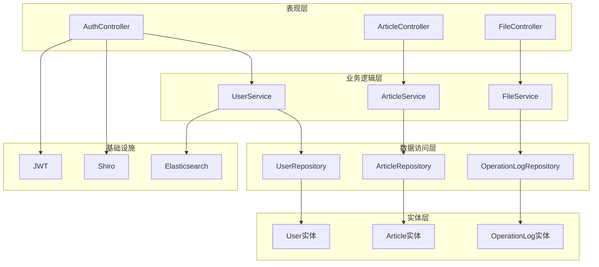
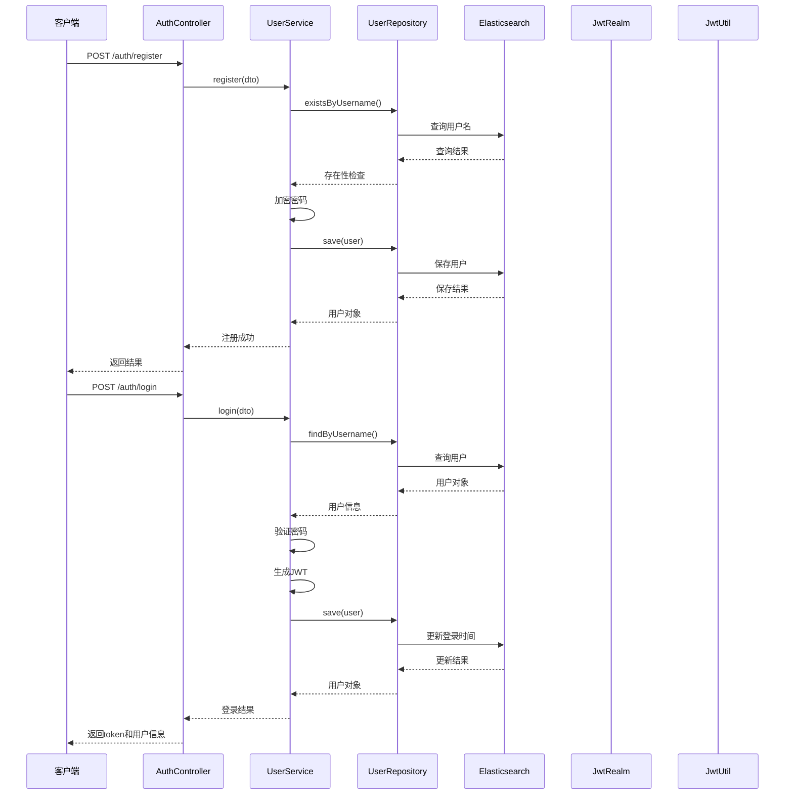
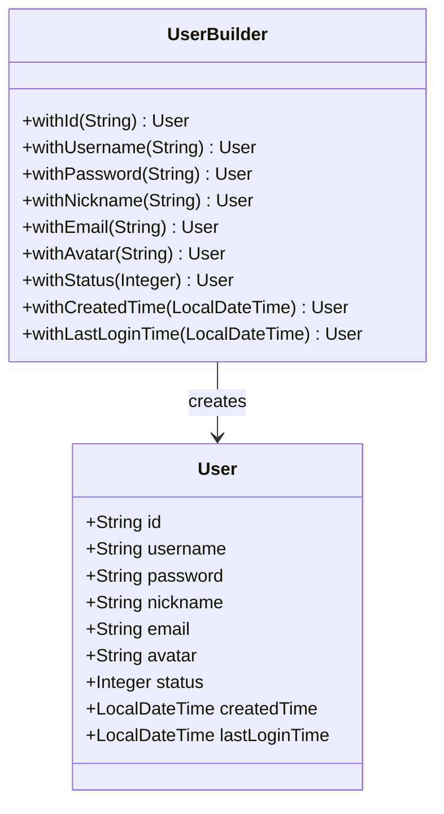
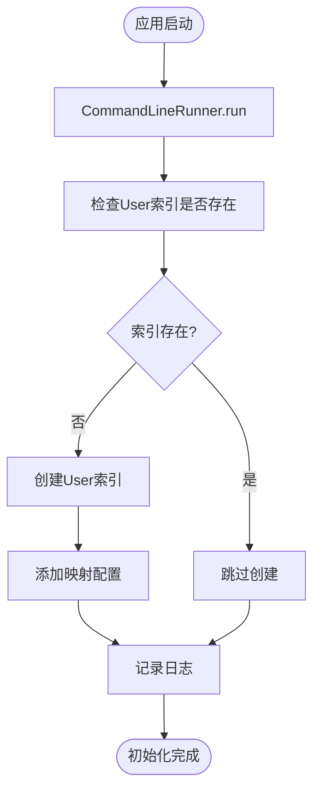
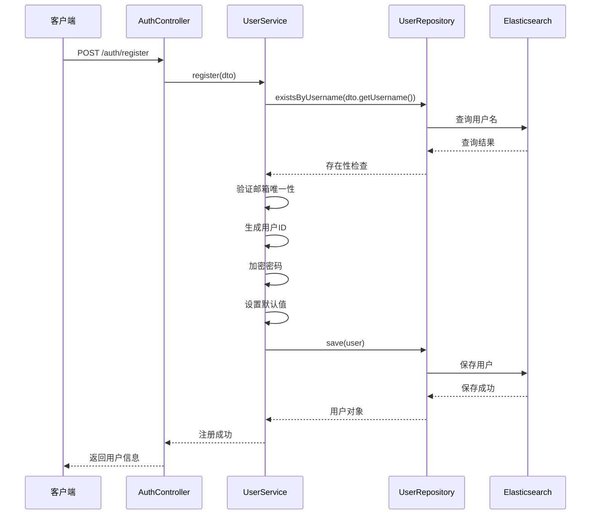
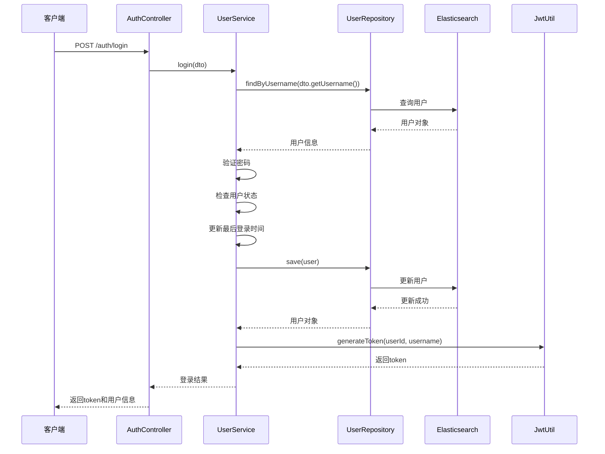
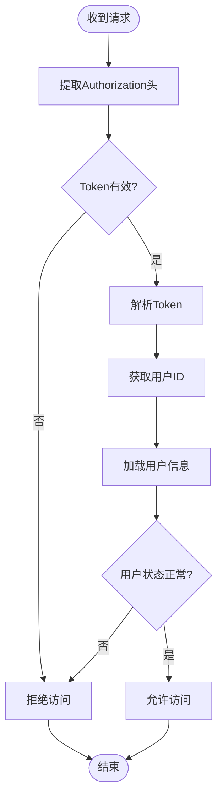
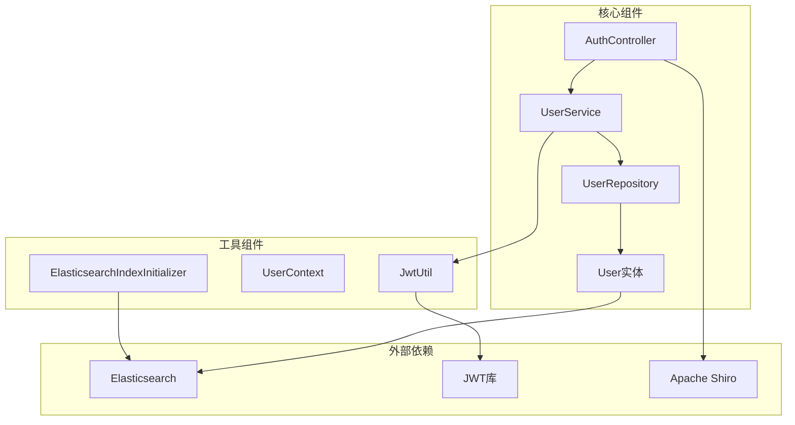
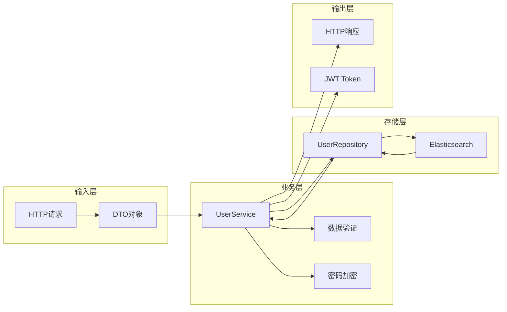

# 用户实体模型

<cite>
**本文档引用的文件**
- [User.java](file://src/main/java/com/zhishilu/entity/User.java)
- [UserRepository.java](file://src/main/java/com/zhishilu/repository/UserRepository.java)
- [UserService.java](file://src/main/java/com/zhishilu/service/UserService.java)
- [AuthController.java](file://src/main/java/com/zhishilu/controller/AuthController.java)
- [JwtRealm.java](file://src/main/java/com/zhishilu/shiro/JwtRealm.java)
- [JwtUtil.java](file://src/main/java/com/zhishilu/util/JwtUtil.java)
- [RegisterDTO.java](file://src/main/java/com/zhishilu/dto/RegisterDTO.java)
- [LoginDTO.java](file://src/main/java/com/zhishilu/dto/LoginDTO.java)
- [ElasticsearchIndexInitializer.java](file://src/main/java/com/zhishilu/config/ElasticsearchIndexInitializer.java)
- [application.yml](file://src/main/resources/application.yml)
- [README.md](file://README.md)
</cite>

## 目录
1. [简介](#简介)
2. [项目结构](#项目结构)
3. [核心组件](#核心组件)
4. [架构概览](#架构概览)
5. [详细组件分析](#详细组件分析)
6. [依赖关系分析](#依赖关系分析)
7. [性能考虑](#性能考虑)
8. [故障排除指南](#故障排除指南)
9. [结论](#结论)

## 简介

本文档详细阐述了User用户实体类的设计架构和数据模型。User实体是知拾录个人知识管理系统的核心组件，负责用户身份认证、权限管理和数据持久化。该系统采用Spring Boot + Elasticsearch + Apache Shiro + JWT的技术栈，实现了完整的用户认证和授权机制。

## 项目结构

系统采用标准的分层架构设计，主要包含以下层次：



**图表来源**
- [AuthController.java](file://src/main/java/com/zhishilu/controller/AuthController.java#L17-L20)
- [UserService.java](file://src/main/java/com/zhishilu/service/UserService.java#L22-L25)
- [UserRepository.java](file://src/main/java/com/zhishilu/repository/UserRepository.java#L12-L13)

**章节来源**
- [README.md](file://README.md#L1-L133)

## 核心组件

### User实体类概述

User实体类是系统的核心数据模型，采用Spring Data Elasticsearch注解进行映射配置。该实体类定义了完整的用户信息结构，支持用户认证、权限管理和数据持久化功能。

### 实体类设计特点

1. **注解驱动的映射配置**
   - 使用`@Document`注解指定Elasticsearch索引名称
   - 使用`@Setting`注解配置分片和副本数量
   - 使用`@Field`注解定义字段映射和数据类型

2. **统一的实体设计模式**
   - 采用Lombok的@Data注解自动生成getter、setter、toString等方法
   - 提供完整的实体生命周期管理

3. **类型安全的字段定义**
   - 所有字段都具有明确的数据类型定义
   - 时间字段使用Java 8的时间API确保类型安全

**章节来源**
- [User.java](file://src/main/java/com/zhishilu/entity/User.java#L12-L15)

## 架构概览

系统采用分层架构，User实体在整个认证授权体系中发挥关键作用：



**图表来源**
- [AuthController.java](file://src/main/java/com/zhishilu/controller/AuthController.java#L27-L40)
- [UserService.java](file://src/main/java/com/zhishilu/service/UserService.java#L35-L87)
- [UserRepository.java](file://src/main/java/com/zhishilu/repository/UserRepository.java#L13-L34)

**章节来源**
- [AuthController.java](file://src/main/java/com/zhishilu/controller/AuthController.java#L1-L50)
- [UserService.java](file://src/main/java/com/zhishilu/service/UserService.java#L1-L128)

## 详细组件分析

### User实体类详细设计

#### 基础字段定义



**图表来源**
- [User.java](file://src/main/java/com/zhishilu/entity/User.java#L17-L66)

#### 字段映射配置详解

每个字段都经过精心设计的Elasticsearch映射配置：

| 字段名 | Elasticsearch类型 | 映射配置 | 使用场景 | 约束条件 |
|--------|-------------------|----------|----------|----------|
| id | String | @Id | 主键标识 | 必填，唯一 |
| username | Keyword | @Field(type = FieldType.Keyword) | 用户名 | 必填，3-20字符，唯一 |
| password | Keyword | @Field(type = FieldType.Keyword, index = false) | 密码 | 必填，6-32字符，加密存储 |
| nickname | Keyword | @Field(type = FieldType.Keyword) | 昵称 | 可选，20字符以内 |
| email | Keyword | @Field(type = FieldType.Keyword) | 邮箱 | 可选，邮箱格式 |
| avatar | Keyword | @Field(type = FieldType.Keyword) | 头像路径 | 可选，文件路径 |
| status | Integer | @Field(type = FieldType.Integer) | 状态 | 必填，1-正常，0-禁用 |
| createdTime | Date | @Field(type = FieldType.Date, format = DateFormat.date_hour_minute_second_millis) | 创建时间 | 必填，默认当前时间 |
| lastLoginTime | Date | @Field(type = FieldType.Date, format = DateFormat.date_hour_minute_second_millis) | 最后登录时间 | 可选，更新时自动设置 |

**章节来源**
- [User.java](file://src/main/java/com/zhishilu/entity/User.java#L17-L66)

### Elasticsearch索引配置

#### 索引设置

```mermaid
graph LR
subgraph "索引配置"
IDX[zhishilu_user]
SHD[分片: 1]
RPL[副本: 0]
end
subgraph "映射配置"
M1[username: keyword]
M2[password: keyword(index=false)]
M3[nickname: keyword]
M4[email: keyword]
M5[avatar: keyword]
M6[status: integer]
M7[createdTime: date(format=date_hour_minute_second_millis)]
M8[lastLoginTime: date(format=date_hour_minute_second_millis)]
end
IDX --> SHD
IDX --> RPL
IDX --> M1
IDX --> M2
IDX --> M3
IDX --> M4
IDX --> M5
IDX --> M6
IDX --> M7
IDX --> M8
```

**图表来源**
- [User.java](file://src/main/java/com/zhishilu/entity/User.java#L13-L14)

#### 索引初始化流程



**图表来源**
- [ElasticsearchIndexInitializer.java](file://src/main/java/com/zhishilu/config/ElasticsearchIndexInitializer.java#L23-L38)

**章节来源**
- [ElasticsearchIndexInitializer.java](file://src/main/java/com/zhishilu/config/ElasticsearchIndexInitializer.java#L1-L40)

### 数据验证规则

#### DTO验证配置

```mermaid
graph TB
subgraph "注册验证"
RD[RegisterDTO]
UN[用户名验证<br/>NotBlank + Size(3-20)]
PW[密码验证<br/>NotBlank + Size(6-32)]
NN[昵称验证<br/>Size(max=20)]
EM[邮箱验证<br/>Email格式]
end
subgraph "登录验证"
LD[LoginDTO]
LUN[用户名验证<br/>NotBlank]
LPW[密码验证<br/>NotBlank]
end
RD --> UN
RD --> PW
RD --> NN
RD --> EM
LD --> LUN
LD --> LPW
```

**图表来源**
- [RegisterDTO.java](file://src/main/java/com/zhishilu/dto/RegisterDTO.java#L14-L26)
- [LoginDTO.java](file://src/main/java/com/zhishilu/dto/LoginDTO.java#L12-L16)

**章节来源**
- [RegisterDTO.java](file://src/main/java/com/zhishilu/dto/RegisterDTO.java#L1-L28)
- [LoginDTO.java](file://src/main/java/com/zhishilu/dto/LoginDTO.java#L1-L18)

### 认证授权流程

#### 用户注册流程



**图表来源**
- [AuthController.java](file://src/main/java/com/zhishilu/controller/AuthController.java#L27-L31)
- [UserService.java](file://src/main/java/com/zhishilu/service/UserService.java#L35-L56)

#### 用户登录流程



**图表来源**
- [AuthController.java](file://src/main/java/com/zhishilu/controller/AuthController.java#L36-L40)
- [UserService.java](file://src/main/java/com/zhishilu/service/UserService.java#L61-L87)

**章节来源**
- [UserService.java](file://src/main/java/com/zhishilu/service/UserService.java#L35-L128)

### 权限管理集成

#### JWT认证流程



**图表来源**
- [JwtRealm.java](file://src/main/java/com/zhishilu/shiro/JwtRealm.java#L44-L69)

**章节来源**
- [JwtRealm.java](file://src/main/java/com/zhishilu/shiro/JwtRealm.java#L1-L71)

## 依赖关系分析

### 组件依赖图



**图表来源**
- [UserService.java](file://src/main/java/com/zhishilu/service/UserService.java#L27-L28)
- [JwtUtil.java](file://src/main/java/com/zhishilu/util/JwtUtil.java#L22-L26)

### 数据流分析

#### 用户数据流转



**图表来源**
- [UserService.java](file://src/main/java/com/zhishilu/service/UserService.java#L35-L87)
- [UserRepository.java](file://src/main/java/com/zhishilu/repository/UserRepository.java#L13-L34)

**章节来源**
- [UserRepository.java](file://src/main/java/com/zhishilu/repository/UserRepository.java#L1-L35)

## 性能考虑

### 索引优化策略

1. **字段选择性优化**
   - 用户名和邮箱使用keyword类型，支持精确匹配
   - 密码字段不建立倒排索引，减少存储空间
   - 状态字段使用integer类型，提高查询效率

2. **时间字段优化**
   - 使用date类型存储时间戳，支持范围查询
   - 采用毫秒精度格式，保证时间精度

3. **内存使用优化**
   - 单分片配置适用于开发环境
   - 生产环境建议根据数据量调整分片数量

### 缓存策略

1. **Token缓存**
   - JWT Token在内存中验证，避免数据库查询
   - Token过期时间配置为24小时

2. **用户信息缓存**
   - 用户上下文使用ThreadLocal存储
   - 避免重复的数据库查询

**章节来源**
- [application.yml](file://src/main/resources/application.yml#L26-L31)

## 故障排除指南

### 常见问题及解决方案

#### Elasticsearch连接问题

**问题描述**: 应用启动时报Elasticsearch连接失败

**解决方案**:
1. 检查application.yml中的ES配置
2. 确认Elasticsearch服务正在运行
3. 验证网络连接和防火墙设置

#### 用户名重复问题

**问题描述**: 注册时出现用户名已存在的异常

**解决方案**:
1. 检查用户名唯一性验证逻辑
2. 确认数据库中不存在重复用户名
3. 调整用户名生成策略

#### 密码验证失败

**问题描述**: 登录时密码验证总是失败

**解决方案**:
1. 检查密码加密算法一致性
2. 验证盐值配置
3. 确认密码哈希计算过程

#### JWT Token问题

**问题描述**: Token验证失败或过期

**解决方案**:
1. 检查JWT密钥配置
2. 验证Token过期时间设置
3. 确认客户端请求头格式

**章节来源**
- [UserService.java](file://src/main/java/com/zhishilu/service/UserService.java#L37-L44)
- [JwtUtil.java](file://src/main/java/com/zhishilu/util/JwtUtil.java#L67-L74)

## 结论

User用户实体模型设计合理，充分考虑了系统的认证授权需求和性能要求。通过Elasticsearch的全文检索能力和JWT的无状态认证机制，系统实现了高效的用户管理功能。

### 设计优势

1. **类型安全**: 所有字段都有明确的数据类型定义
2. **验证完整**: DTO层和业务层双重验证机制
3. **性能优化**: 合理的字段映射和索引配置
4. **扩展性强**: 清晰的分层架构便于功能扩展

### 改进建议

1. **生产环境配置**: 建议增加副本数和分片数量
2. **监控告警**: 添加用户操作的监控和告警机制
3. **审计日志**: 记录重要的用户操作日志
4. **安全加固**: 考虑增加密码复杂度要求和登录限制

该User实体模型为整个知拾录系统的用户管理提供了坚实的基础，支持系统的认证授权、权限控制和数据持久化需求。