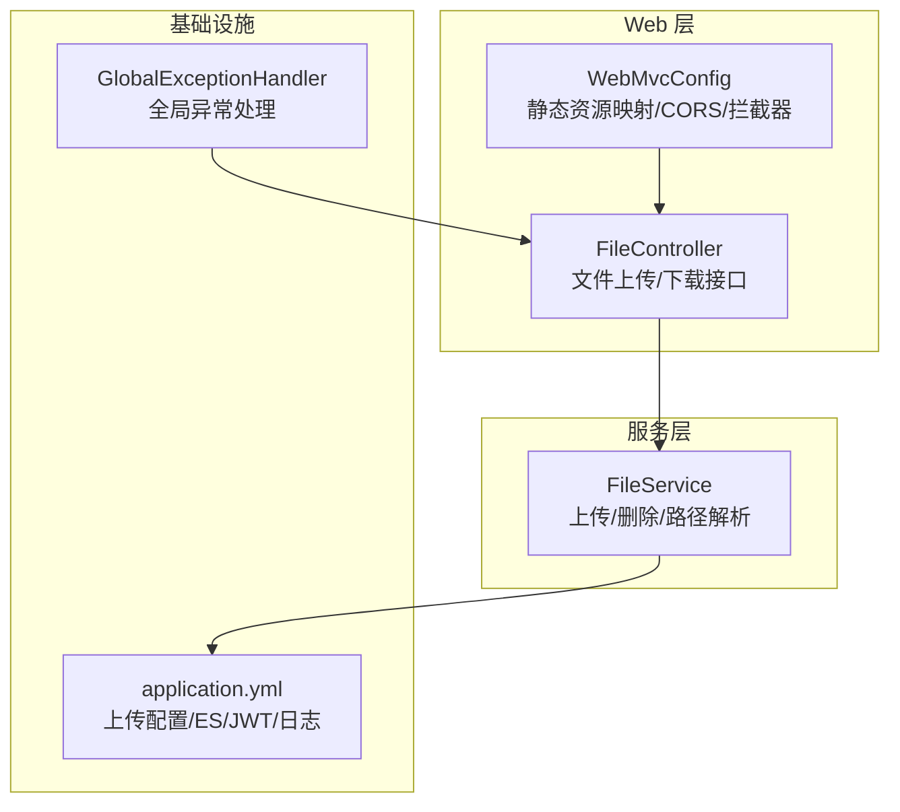
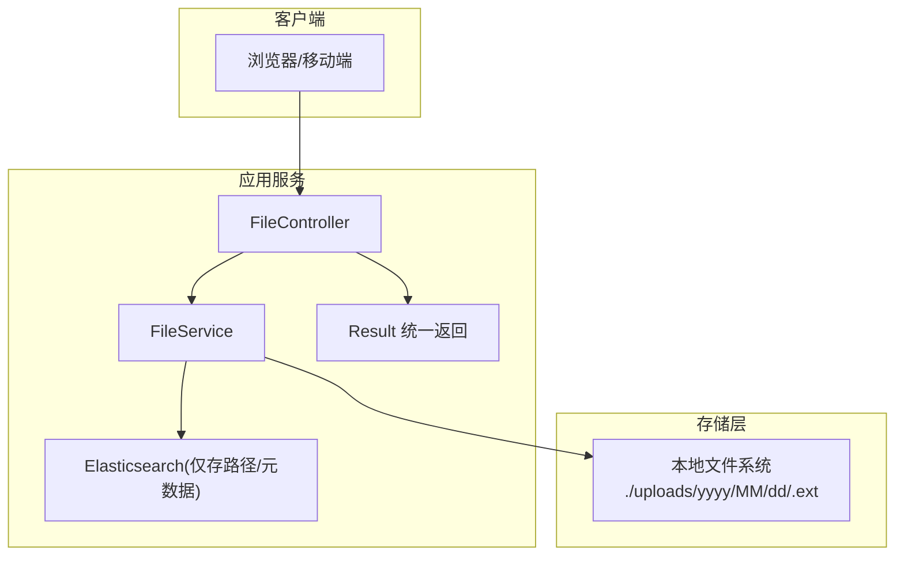
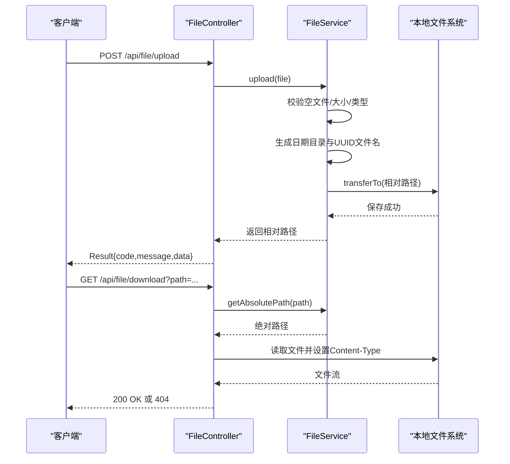
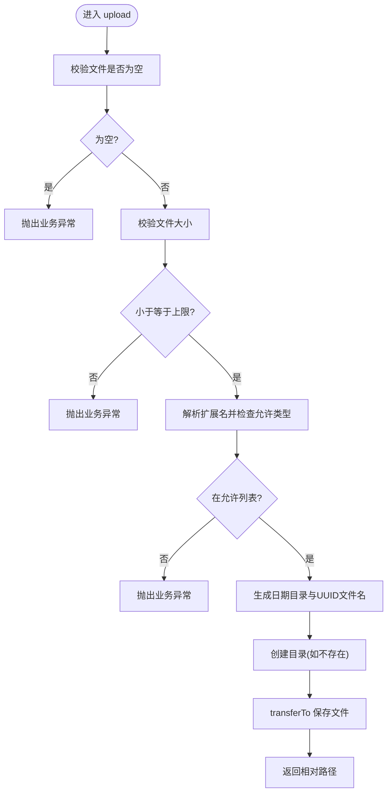
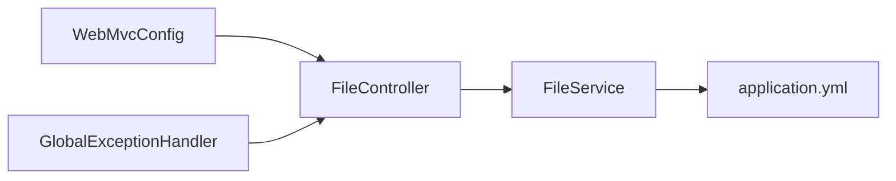

# 文件上传系统

<cite>
**本文引用的文件**
- [FileController.java](file://src/main/java/com/zhishilu/controller/FileController.java)
- [FileService.java](file://src/main/java/com/zhishilu/service/FileService.java)
- [Result.java](file://src/main/java/com/zhishilu/common/Result.java)
- [application.yml](file://src/main/resources/application.yml)
- [WebMvcConfig.java](file://src/main/java/com/zhishilu/config/WebMvcConfig.java)
- [BusinessException.java](file://src/main/java/com/zhishilu/exception/BusinessException.java)
- [GlobalExceptionHandler.java](file://src/main/java/com/zhishilu/exception/GlobalExceptionHandler.java)
- [README.md](file://README.md)
- [Article.java](file://src/main/java/com/zhishilu/entity/Article.java)
- [OperationLogInterceptor.java](file://src/main/java/com/zhishilu/interceptor/OperationLogInterceptor.java)
</cite>

## 目录
1. [简介](#简介)
2. [项目结构](#项目结构)
3. [核心组件](#核心组件)
4. [架构总览](#架构总览)
5. [详细组件分析](#详细组件分析)
6. [依赖关系分析](#依赖关系分析)
7. [性能考量](#性能考量)
8. [故障排查指南](#故障排查指南)
9. [结论](#结论)
10. [附录](#附录)

## 简介
本文件上传系统基于 Spring Boot 构建，提供单文件与批量文件上传能力，并通过本地文件系统进行物理存储，同时结合 Elasticsearch 实现元数据与检索能力。系统采用统一返回结构与全局异常处理，确保接口一致性与可维护性；通过静态资源映射与下载接口，实现文件访问与分发。

## 项目结构
- 控制层：负责接收 HTTP 请求并调用服务层，返回统一结构的响应。
- 服务层：封装上传、删除、路径解析等核心逻辑，包含文件类型、大小、命名与路径管理。
- 配置层：跨域、静态资源映射、拦截器注册等 Web 层配置。
- 异常处理：集中处理业务异常、认证与授权异常、参数校验异常等。
- 配置文件：应用端口、上传参数、ES 连接、JWT、日志级别等。

图表来源
- [FileController.java](file://src/main/java/com/zhishilu/controller/FileController.java#L23-L71)
- [FileService.java](file://src/main/java/com/zhishilu/service/FileService.java#L25-L108)
- [WebMvcConfig.java](file://src/main/java/com/zhishilu/config/WebMvcConfig.java#L14-L52)
- [application.yml](file://src/main/resources/application.yml#L1-L47)
- [GlobalExceptionHandler.java](file://src/main/java/com/zhishilu/exception/GlobalExceptionHandler.java#L20-L87)

章节来源
- [FileController.java](file://src/main/java/com/zhishilu/controller/FileController.java#L1-L71)
- [FileService.java](file://src/main/java/com/zhishilu/service/FileService.java#L1-L108)
- [WebMvcConfig.java](file://src/main/java/com/zhishilu/config/WebMvcConfig.java#L1-L52)
- [application.yml](file://src/main/resources/application.yml#L1-L47)
- [README.md](file://README.md#L1-L133)

## 核心组件
- 文件上传控制器：提供单文件上传、批量上传与下载接口，统一返回结构。
- 文件服务：实现文件校验、命名、存储路径组织、删除与绝对路径解析。
- 统一返回结构：所有接口返回统一的 Result 结构，便于前端处理。
- 全局异常处理：捕获业务异常、认证/授权异常与参数校验异常，返回标准化错误信息。
- Web 配置：静态资源映射到本地上传目录，支持跨域与拦截器注册。

章节来源
- [FileController.java](file://src/main/java/com/zhishilu/controller/FileController.java#L23-L71)
- [FileService.java](file://src/main/java/com/zhishilu/service/FileService.java#L25-L108)
- [Result.java](file://src/main/java/com/zhishilu/common/Result.java#L8-L71)
- [GlobalExceptionHandler.java](file://src/main/java/com/zhishilu/exception/GlobalExceptionHandler.java#L20-L87)
- [WebMvcConfig.java](file://src/main/java/com/zhishilu/config/WebMvcConfig.java#L14-L52)

## 架构总览
系统采用“本地文件存储 + Elasticsearch 元数据存储”的分离设计：
- 本地存储：文件以日期分目录方式保存，使用 UUID 生成唯一文件名，避免冲突与覆盖。
- Elasticsearch 存储：仅存储文件路径（相对路径）及业务实体元数据，不直接存储文件内容，降低 ES 负载并提升扩展性。

图表来源
- [FileController.java](file://src/main/java/com/zhishilu/controller/FileController.java#L23-L71)
- [FileService.java](file://src/main/java/com/zhishilu/service/FileService.java#L25-L108)
- [application.yml](file://src/main/resources/application.yml#L33-L37)

## 详细组件分析

### 文件上传控制器（FileController）
- 单文件上传：接收 multipart/form-data，调用服务层上传，返回相对路径。
- 批量上传：接收 files 数组，循环调用上传，返回路径列表。
- 下载接口：根据相对路径拼装绝对路径，读取文件并设置内容类型，不存在时返回 404。

图表来源
- [FileController.java](file://src/main/java/com/zhishilu/controller/FileController.java#L33-L69)
- [FileService.java](file://src/main/java/com/zhishilu/service/FileService.java#L54-L88)

章节来源
- [FileController.java](file://src/main/java/com/zhishilu/controller/FileController.java#L23-L71)

### 文件服务（FileService）
- 初始化：从配置加载上传根目录、允许类型、最大大小；确保目录存在。
- 上传流程：
  - 校验文件非空与大小上限。
  - 解析扩展名并匹配允许类型列表。
  - 使用 UUID 生成唯一文件名，按“年/月/日”组织子目录。
  - 创建目录并保存文件，返回相对路径。
- 删除：根据相对路径删除本地文件。
- 路径解析：将相对路径拼接到上传根目录，返回绝对路径。

图表来源
- [FileService.java](file://src/main/java/com/zhishilu/service/FileService.java#L54-L88)

章节来源
- [FileService.java](file://src/main/java/com/zhishilu/service/FileService.java#L25-L108)

### 统一返回结构（Result）
- 提供 success/error/unauthorized/forbidden 等静态工厂方法，统一响应结构与时间戳。
- 控制器与异常处理器均使用该结构，保证前后端一致的交互体验。

章节来源
- [Result.java](file://src/main/java/com/zhishilu/common/Result.java#L8-L71)

### 全局异常处理（GlobalExceptionHandler）
- 捕获业务异常：返回自定义 code 与 message。
- 认证/授权异常：返回 401/403 标准化响应。
- 参数校验异常：收集字段错误并返回 400。
- 其他异常：返回 500 与通用提示。

章节来源
- [GlobalExceptionHandler.java](file://src/main/java/com/zhishilu/exception/GlobalExceptionHandler.java#L20-L87)
- [BusinessException.java](file://src/main/java/com/zhishilu/exception/BusinessException.java#L8-L23)

### Web 配置（WebMvcConfig）
- CORS：开放所有来源与方法，允许凭证与头部。
- 拦截器：注册操作日志拦截器，排除部分路径。
- 静态资源映射：将 /uploads/** 映射到本地 ./uploads 目录，便于直接访问已上传文件。

章节来源
- [WebMvcConfig.java](file://src/main/java/com/zhishilu/config/WebMvcConfig.java#L14-L52)

### 配置文件（application.yml）
- 服务器与上下文路径：端口、context-path。
- 文件上传：multipart 的文件与请求大小限制。
- Elasticsearch：连接地址、凭据、超时与日志级别。
- JWT：密钥、过期时间、头与前缀。
- 上传配置：上传根目录、允许类型、最大大小。
- 日志：控制台输出格式与级别。

章节来源
- [application.yml](file://src/main/resources/application.yml#L1-L47)

### 与业务实体的关系（Article）
- Article 实体包含图片路径列表字段，用于存储文件相对路径，实现“本地存储 + ES 元数据”的分离模式。

章节来源
- [Article.java](file://src/main/java/com/zhishilu/entity/Article.java#L46-L49)

### 操作日志拦截器（OperationLogInterceptor）
- 在请求完成后异步记录用户、路径、方法、参数、IP、状态码与耗时，便于审计与排障。

章节来源
- [OperationLogInterceptor.java](file://src/main/java/com/zhishilu/interceptor/OperationLogInterceptor.java#L25-L128)

## 依赖关系分析
- FileController 依赖 FileService 完成上传与下载逻辑。
- FileService 依赖配置文件中的上传根目录、允许类型与大小限制。
- WebMvcConfig 将 /uploads/** 映射到本地目录，使下载接口与静态访问共用同一路径。
- 全局异常处理器统一处理业务异常与校验异常，保证接口一致性。

图表来源
- [FileController.java](file://src/main/java/com/zhishilu/controller/FileController.java#L23-L71)
- [FileService.java](file://src/main/java/com/zhishilu/service/FileService.java#L25-L108)
- [WebMvcConfig.java](file://src/main/java/com/zhishilu/config/WebMvcConfig.java#L47-L50)
- [GlobalExceptionHandler.java](file://src/main/java/com/zhishilu/exception/GlobalExceptionHandler.java#L20-L87)

章节来源
- [FileController.java](file://src/main/java/com/zhishilu/controller/FileController.java#L23-L71)
- [FileService.java](file://src/main/java/com/zhishilu/service/FileService.java#L25-L108)
- [WebMvcConfig.java](file://src/main/java/com/zhishilu/config/WebMvcConfig.java#L14-L52)
- [GlobalExceptionHandler.java](file://src/main/java/com/zhishilu/exception/GlobalExceptionHandler.java#L20-L87)

## 性能考量
- 本地存储与 ES 分离：上传文件直接写入磁盘，ES 仅存路径与元数据，降低 ES 写入压力与网络开销。
- 日期分目录：按天组织目录，减少单目录文件数量，提升文件系统性能与可维护性。
- UUID 命名：避免同名冲突，支持并发上传场景。
- 静态资源映射：通过 WebMvcConfig 将 /uploads/** 直接映射到本地目录，减少应用层 IO 开销。
- 异步日志：操作日志拦截器在 afterCompletion 阶段异步保存，避免阻塞主请求链路。

章节来源
- [FileService.java](file://src/main/java/com/zhishilu/service/FileService.java#L71-L84)
- [WebMvcConfig.java](file://src/main/java/com/zhishilu/config/WebMvcConfig.java#L47-L50)
- [OperationLogInterceptor.java](file://src/main/java/com/zhishilu/interceptor/OperationLogInterceptor.java#L55-L63)

## 故障排查指南
- 上传失败（业务异常）：检查文件是否为空、大小是否超过限制、扩展名是否在允许列表内。
- 下载 404：确认 path 是否正确、文件是否存在于对应日期目录下。
- 跨域问题：确认 CORS 配置是否允许相应来源与方法。
- 参数校验异常：查看字段校验错误信息，修正请求参数。
- 认证/授权异常：确认 JWT 头部与权限是否正确。

章节来源
- [FileService.java](file://src/main/java/com/zhishilu/service/FileService.java#L54-L88)
- [FileController.java](file://src/main/java/com/zhishilu/controller/FileController.java#L54-L69)
- [WebMvcConfig.java](file://src/main/java/com/zhishilu/config/WebMvcConfig.java#L23-L31)
- [GlobalExceptionHandler.java](file://src/main/java/com/zhishilu/exception/GlobalExceptionHandler.java#L56-L75)

## 结论
本文件上传系统通过“本地存储 + ES 元数据”的架构实现了高扩展性与高性能的文件管理能力。统一的返回结构与异常处理提升了系统的稳定性与可维护性；静态资源映射与拦截器配置进一步增强了可用性与可观测性。建议在生产环境中结合 CDN 与对象存储进行进一步扩展，并增加病毒扫描与合规检查等安全措施。

## 附录

### API 接口规范
- 上传单个文件
  - 方法：POST
  - 路径：/api/file/upload
  - 参数：multipart/form-data，字段名为 file
  - 成功响应：data 为相对路径字符串
- 批量上传文件
  - 方法：POST
  - 路径：/api/file/upload/batch
  - 参数：multipart/form-data，字段名为 files（数组）
  - 成功响应：data 为路径字符串数组
- 下载文件
  - 方法：GET
  - 路径：/api/file/download
  - 查询参数：path（相对路径）
  - 成功响应：文件流，Content-Type 根据文件类型推断
  - 失败响应：404 Not Found（文件不存在）

章节来源
- [README.md](file://README.md#L67-L72)
- [FileController.java](file://src/main/java/com/zhishilu/controller/FileController.java#L33-L69)

### 配置项说明
- 上传根目录：upload.path
- 允许的文件类型：upload.allowed-types（逗号分隔）
- 最大文件大小（字节）：upload.max-size
- Multipart 限制：spring.servlet.multipart.max-file-size、spring.servlet.multipart.max-request-size
- Elasticsearch 连接：spring.elasticsearch.uris、username、password、timeout
- JWT 配置：jwt.secret、expiration、header、prefix
- 日志级别：logging.level.*

章节来源
- [application.yml](file://src/main/resources/application.yml#L33-L47)

### 安全与合规建议
- 文件类型白名单：当前仅支持常见图片类型，建议在生产环境扩展或引入更严格的 MIME 类型检测。
- 大小限制：默认 10MB，建议根据业务场景调整并配合前端预检。
- 路径安全：下载接口使用相对路径拼接绝对路径，避免路径穿越；建议在生产环境限制可访问路径范围。
- 静态资源访问：通过 /uploads/** 映射到本地目录，注意仅暴露必要路径，避免泄露内部结构。
- 合规与审计：结合操作日志拦截器记录访问行为，定期审计异常与失败请求。

章节来源
- [FileService.java](file://src/main/java/com/zhishilu/service/FileService.java#L29-L37)
- [WebMvcConfig.java](file://src/main/java/com/zhishilu/config/WebMvcConfig.java#L47-L50)
- [OperationLogInterceptor.java](file://src/main/java/com/zhishilu/interceptor/OperationLogInterceptor.java#L38-L64)