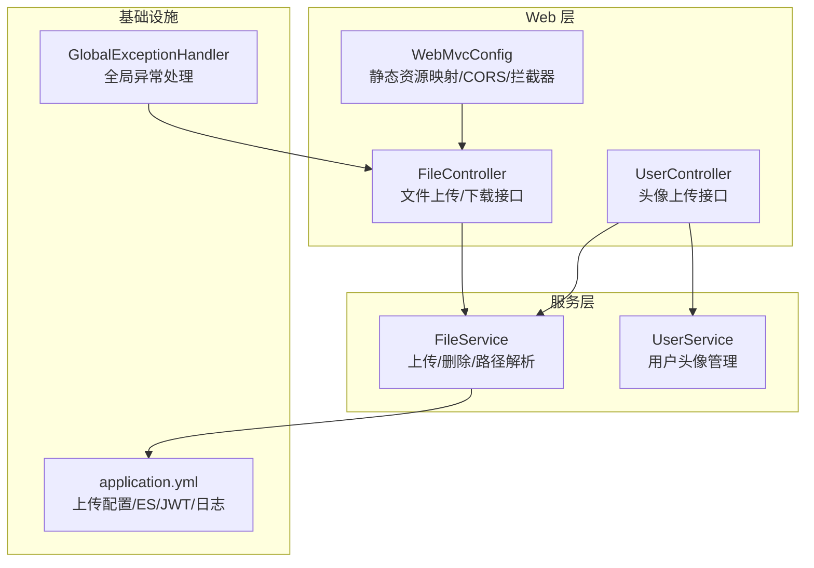
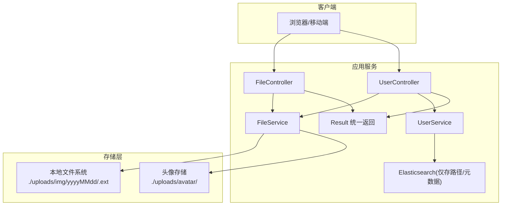
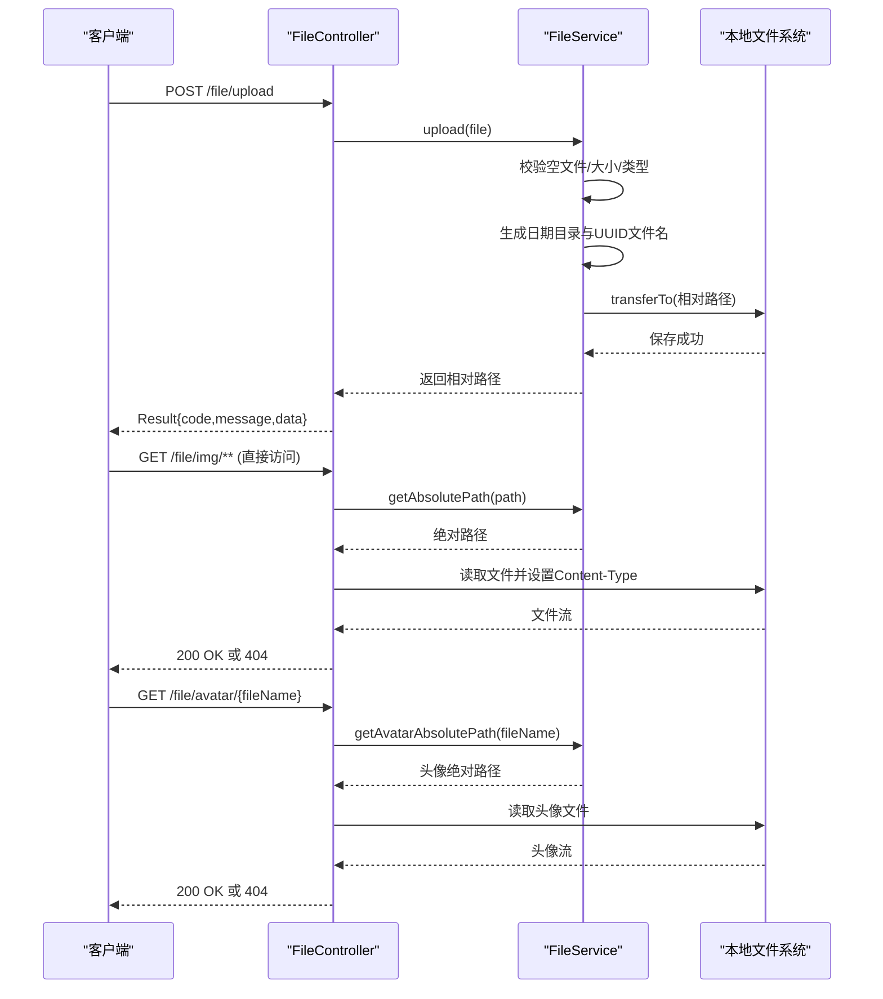
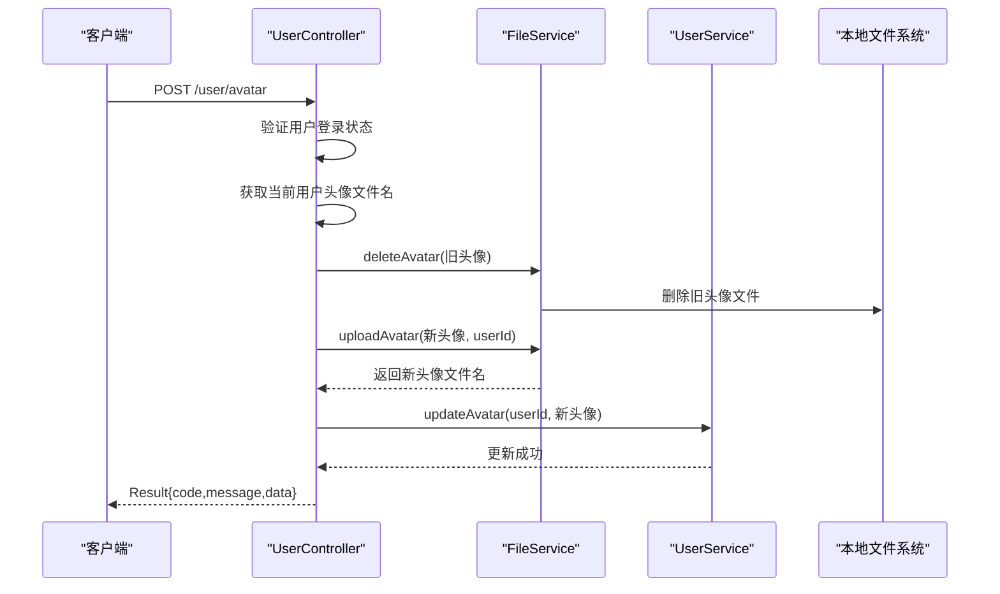
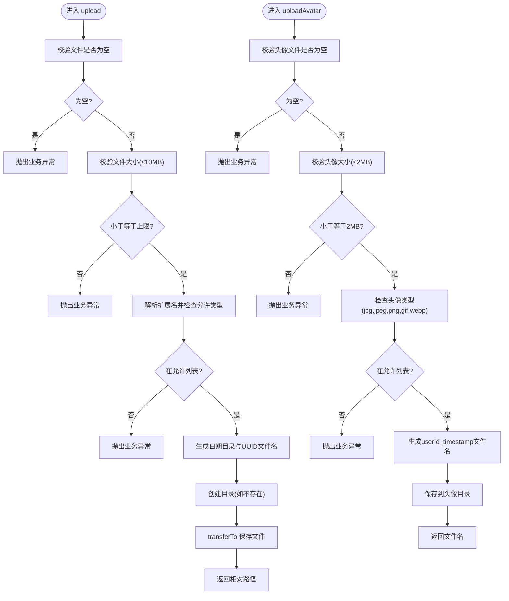
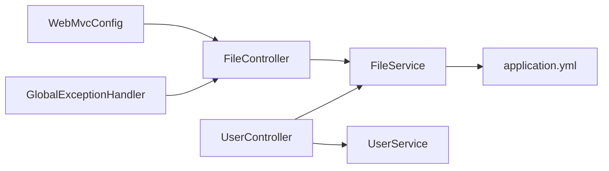

# 文件上传系统

<cite>
**本文引用的文件**
- [FileController.java](file://src/main/java/com/zhishilu/controller/FileController.java)
- [FileService.java](file://src/main/java/com/zhishilu/service/FileService.java)
- [UserController.java](file://src/main/java/com/zhishilu/controller/UserController.java)
- [FileUploadResp.java](file://src/main/java/com/zhishilu/resp/FileUploadResp.java)
- [Result.java](file://src/main/java/com/zhishilu/common/Result.java)
- [application.yml](file://src/main/resources/application.yml)
- [WebMvcConfig.java](file://src/main/java/com/zhishilu/config/WebMvcConfig.java)
- [BusinessException.java](file://src/main/java/com/zhishilu/exception/BusinessException.java)
- [GlobalExceptionHandler.java](file://src/main/java/com/zhishilu/exception/GlobalExceptionHandler.java)
- [UserService.java](file://src/main/java/com/zhishilu/service/UserService.java)
- [User.java](file://src/main/java/com/zhishilu/entity/User.java)
- [UserResp.java](file://src/main/java/com/zhishilu/resp/UserResp.java)
- [README.md](file://README.md)
- [Article.java](file://src/main/java/com/zhishilu/entity/Article.java)
- [OperationLogInterceptor.java](file://src/main/java/com/zhishilu/interceptor/OperationLogInterceptor.java)
</cite>

## 目录
1. [简介](#简介)
2. [项目结构](#项目结构)
3. [核心组件](#核心组件)
4. [架构总览](#架构总览)
5. [详细组件分析](#详细组件分析)
6. [依赖关系分析](#依赖关系分析)
7. [性能考量](#性能考量)
8. [故障排查指南](#故障排查指南)
9. [结论](#结论)
10. [附录](#附录)

## 简介
本文件上传系统基于 Spring Boot 构建，提供单文件与批量文件上传能力，以及专门的头像上传功能。系统通过本地文件系统进行物理存储，同时结合 Elasticsearch 实现元数据与检索能力。系统采用统一返回结构与全局异常处理，确保接口一致性与可维护性；通过静态资源映射与多种下载接口，实现文件访问与分发。

## 项目结构
- 控制层：负责接收 HTTP 请求并调用服务层，返回统一结构的响应。
- 服务层：封装上传、删除、路径解析等核心逻辑，包含文件类型、大小、命名与路径管理。
- 配置层：跨域、静态资源映射、拦截器注册等 Web 层配置。
- 异常处理：集中处理业务异常、认证与授权异常、参数校验异常等。
- 配置文件：应用端口、上传参数、ES 连接、JWT、日志级别等。

```mermaid
graph TB
subgraph "Web 层"
FC["FileController<br/>文件上传/下载接口"]
UC["UserController<br/>头像上传接口"]
WMC["WebMvcConfig<br/>静态资源映射/CORS/拦截器"]
end
subgraph "服务层"
FS["FileService<br/>上传/删除/路径解析"]
US["UserService<br/>用户头像管理"]
end
subgraph "基础设施"
CFG["application.yml<br/>上传配置/ES/JWT/日志"]
EX["GlobalExceptionHandler<br/>全局异常处理"]
end
FC --> FS
UC --> FS
UC --> US
WMC --> FC
FS --> CFG
EX --> FC
```

**图表来源**
- [FileController.java](file://src/main/java/com/zhishilu/controller/FileController.java#L30-L133)
- [UserController.java](file://src/main/java/com/zhishilu/controller/UserController.java#L24-L79)
- [FileService.java](file://src/main/java/com/zhishilu/service/FileService.java#L28-L185)
- [UserService.java](file://src/main/java/com/zhishilu/service/UserService.java#L27-L158)
- [WebMvcConfig.java](file://src/main/java/com/zhishilu/config/WebMvcConfig.java#L19-L61)
- [application.yml](file://src/main/resources/application.yml#L44-L53)
- [GlobalExceptionHandler.java](file://src/main/java/com/zhishilu/exception/GlobalExceptionHandler.java#L20-L87)

**章节来源**
- [FileController.java](file://src/main/java/com/zhishilu/controller/FileController.java#L1-L134)
- [UserController.java](file://src/main/java/com/zhishilu/controller/UserController.java#L1-L80)
- [FileService.java](file://src/main/java/com/zhishilu/service/FileService.java#L1-L186)
- [UserService.java](file://src/main/java/com/zhishilu/service/UserService.java#L1-L159)
- [WebMvcConfig.java](file://src/main/java/com/zhishilu/config/WebMvcConfig.java#L1-L62)
- [application.yml](file://src/main/resources/application.yml#L1-L53)
- [README.md](file://README.md#L1-L133)

## 核心组件
- 文件上传控制器：提供单文件上传、批量上传与下载接口，统一返回结构。
- 头像上传控制器：提供专门的头像上传接口，支持头像替换与自动清理。
- 文件服务：实现文件校验、命名、存储路径组织、删除与绝对路径解析。
- 用户服务：管理用户头像信息的更新与持久化。
- 统一返回结构：所有接口返回统一的 Result 结构，便于前端处理。
- 全局异常处理：捕获业务异常、认证/授权异常与参数校验异常，返回标准化错误信息。
- Web 配置：静态资源映射到本地上传目录，支持跨域与拦截器注册。

**章节来源**
- [FileController.java](file://src/main/java/com/zhishilu/controller/FileController.java#L30-L133)
- [UserController.java](file://src/main/java/com/zhishilu/controller/UserController.java#L54-L78)
- [FileService.java](file://src/main/java/com/zhishilu/service/FileService.java#L28-L185)
- [UserService.java](file://src/main/java/com/zhishilu/service/UserService.java#L126-L132)
- [Result.java](file://src/main/java/com/zhishilu/common/Result.java#L8-L71)
- [GlobalExceptionHandler.java](file://src/main/java/com/zhishilu/exception/GlobalExceptionHandler.java#L20-L87)
- [WebMvcConfig.java](file://src/main/java/com/zhishilu/config/WebMvcConfig.java#L19-L61)

## 架构总览
系统采用"本地文件存储 + Elasticsearch 元数据存储"的分离设计：
- 本地存储：文件以日期分目录方式保存，使用 UUID 生成唯一文件名，避免冲突与覆盖。
- Elasticsearch 存储：仅存储文件路径（相对路径）及业务实体元数据，不直接存储文件内容，降低 ES 负载并提升扩展性。
- 头像专用存储：头像文件单独存储在独立目录中，使用用户ID+时间戳命名，支持快速访问。

```mermaid
graph TB
subgraph "客户端"
U["浏览器/移动端"]
end
subgraph "应用服务"
FC["FileController"]
UC["UserController"]
S["FileService"]
US["UserService"]
R["Result 统一返回"]
E["Elasticsearch(仅存路径/元数据)"]
end
subgraph "存储层"
LFS["本地文件系统<br/>./uploads/img/yyyyMMdd/<UUID>.ext"]
AVATAR["头像存储<br/>./uploads/avatar/<userId_timestamp.ext>"]
end
U --> FC
U --> UC
FC --> S
UC --> S
UC --> US
S --> LFS
S --> AVATAR
US --> E
FC --> R
UC --> R
```

**图表来源**
- [FileController.java](file://src/main/java/com/zhishilu/controller/FileController.java#L37-L133)
- [UserController.java](file://src/main/java/com/zhishilu/controller/UserController.java#L54-L78)
- [FileService.java](file://src/main/java/com/zhishilu/service/FileService.java#L78-L185)
- [application.yml](file://src/main/resources/application.yml#L45-L48)

## 详细组件分析

### 文件上传控制器（FileController）
- 单文件上传：接收 multipart/form-data，调用服务层上传，返回相对路径。
- 批量上传：接收 files 数组，循环调用上传，返回路径列表。
- 图片访问：通过 `/file/img/**` 路径直接访问图片，无需额外处理。
- 头像访问：通过 `/file/avatar/{fileName}` 访问头像文件。
- 下载接口：根据相对路径拼装绝对路径，读取文件并设置内容类型，不存在时返回 404。

```mermaid
sequenceDiagram
participant Client as "客户端"
participant Ctrl as "FileController"
participant Svc as "FileService"
participant FS as "本地文件系统"
Client->>Ctrl : POST /file/upload
Ctrl->>Svc : upload(file)
Svc->>Svc : 校验空文件/大小/类型
Svc->>Svc : 生成日期目录与UUID文件名
Svc->>FS : transferTo(相对路径)
FS-->>Svc : 保存成功
Svc-->>Ctrl : 返回相对路径
Ctrl-->>Client : Result{code,message,data}
Client->>Ctrl : GET /file/img/** (直接访问)
Ctrl->>Svc : getAbsolutePath(path)
Svc-->>Ctrl : 绝对路径
Ctrl->>FS : 读取文件并设置Content-Type
FS-->>Ctrl : 文件流
Ctrl-->>Client : 200 OK 或 404
Client->>Ctrl : GET /file/avatar/{fileName}
Ctrl->>Svc : getAvatarAbsolutePath(fileName)
Svc-->>Ctrl : 头像绝对路径
Ctrl->>FS : 读取头像文件
FS-->>Ctrl : 头像流
Ctrl-->>Client : 200 OK 或 404
```

**图表来源**
- [FileController.java](file://src/main/java/com/zhishilu/controller/FileController.java#L37-L133)
- [FileService.java](file://src/main/java/com/zhishilu/service/FileService.java#L78-L185)

**章节来源**
- [FileController.java](file://src/main/java/com/zhishilu/controller/FileController.java#L30-L133)

### 头像上传控制器（UserController）
- 头像上传：接收用户头像文件，支持替换现有头像。
- 自动清理：上传新头像前自动删除旧头像文件。
- 用户信息更新：上传成功后更新用户实体中的头像字段。
- 权限控制：需要登录用户才能上传头像。

```mermaid
sequenceDiagram
participant Client as "客户端"
participant UserCtrl as "UserController"
participant FileSvc as "FileService"
participant UserSvc as "UserService"
participant FS as "本地文件系统"
Client->>UserCtrl : POST /user/avatar
UserCtrl->>UserCtrl : 验证用户登录状态
UserCtrl->>UserCtrl : 获取当前用户头像文件名
UserCtrl->>FileSvc : deleteAvatar(旧头像)
FileSvc->>FS : 删除旧头像文件
UserCtrl->>FileSvc : uploadAvatar(新头像, userId)
FileSvc-->>UserCtrl : 返回新头像文件名
UserCtrl->>UserSvc : updateAvatar(userId, 新头像)
UserSvc-->>UserCtrl : 更新成功
UserCtrl-->>Client : Result{code,message,data}
```

**图表来源**
- [UserController.java](file://src/main/java/com/zhishilu/controller/UserController.java#L54-L78)
- [FileService.java](file://src/main/java/com/zhishilu/service/FileService.java#L136-L185)
- [UserService.java](file://src/main/java/com/zhishilu/service/UserService.java#L126-L132)

**章节来源**
- [UserController.java](file://src/main/java/com/zhishilu/controller/UserController.java#L24-L79)

### 文件服务（FileService）
- 初始化：从配置加载上传根目录、允许类型、最大大小；确保目录存在。
- 基础上传流程：
  - 校验文件非空与大小上限（10MB）。
  - 解析扩展名并匹配允许类型列表（jpg,jpeg,png,gif,webp,bmp）。
  - 使用 UUID 生成唯一文件名，按"yyyyMMdd"组织日期子目录。
  - 创建目录并保存文件，返回相对路径。
- 头像上传流程：
  - 校验文件非空与大小上限（2MB）。
  - 解析扩展名并匹配允许类型列表（jpg,jpeg,png,gif,webp）。
  - 使用 userId_时间戳生成唯一文件名。
  - 保存到头像目录，返回文件名。
- 删除功能：支持删除普通文件和头像文件。
- 路径解析：将相对路径拼接到上传根目录，返回绝对路径。

```mermaid
flowchart TD
Start(["进入 upload"]) --> CheckEmpty["校验文件是否为空"]
CheckEmpty --> Empty{"为空?"}
Empty --> |是| ThrowEmpty["抛出业务异常"]
Empty --> |否| CheckSize["校验文件大小(≤10MB)"]
CheckSize --> SizeOK{"小于等于上限?"}
SizeOK --> |否| ThrowSize["抛出业务异常"]
SizeOK --> |是| CheckType["解析扩展名并检查允许类型"]
CheckType --> TypeOK{"在允许列表?"}
TypeOK --> |否| ThrowType["抛出业务异常"]
TypeOK --> |是| GenName["生成日期目录与UUID文件名"]
GenName --> MkDir["创建目录(如不存在)"]
MkDir --> Save["transferTo 保存文件"]
Save --> Return["返回相对路径"]
AvatarStart(["进入 uploadAvatar"]) --> CheckAvatarEmpty["校验头像文件是否为空"]
CheckAvatarEmpty --> AvatarEmpty{"为空?"}
AvatarEmpty --> |是| AvatarThrowEmpty["抛出业务异常"]
AvatarEmpty --> |否| CheckAvatarSize["校验头像大小(≤2MB)"]
CheckAvatarSize --> AvatarSizeOK{"小于等于2MB?"}
AvatarSizeOK --> |否| AvatarThrowSize["抛出业务异常"]
AvatarSizeOK --> |是| CheckAvatarType["检查头像类型(jpg,jpeg,png,gif,webp)"]
CheckAvatarType --> AvatarTypeOK{"在允许列表?"}
AvatarTypeOK --> |否| AvatarThrowType["抛出业务异常"]
AvatarTypeOK --> |是| GenAvatarName["生成userId_timestamp文件名"]
GenAvatarName --> SaveAvatar["保存到头像目录"]
SaveAvatar --> ReturnAvatar["返回文件名"]
```

**图表来源**
- [FileService.java](file://src/main/java/com/zhishilu/service/FileService.java#L78-L185)

**章节来源**
- [FileService.java](file://src/main/java/com/zhishilu/service/FileService.java#L28-L185)

### 用户服务（UserService）
- 头像更新：更新用户实体中的头像字段并持久化到数据库。
- 用户查询：提供用户信息查询与验证功能。

**章节来源**
- [UserService.java](file://src/main/java/com/zhishilu/service/UserService.java#L126-L132)

### 统一返回结构（Result）
- 提供 success/error/unauthorized/forbidden 等静态工厂方法，统一响应结构与时间戳。
- 控制器与异常处理器均使用该结构，保证前后端一致的交互体验。

**章节来源**
- [Result.java](file://src/main/java/com/zhishilu/common/Result.java#L8-L71)

### 全局异常处理（GlobalExceptionHandler）
- 捕获业务异常：返回自定义 code 与 message。
- 认证/授权异常：返回 401/403 标准化响应。
- 参数校验异常：收集字段错误并返回 400。
- 其他异常：返回 500 与通用提示。

**章节来源**
- [GlobalExceptionHandler.java](file://src/main/java/com/zhishilu/exception/GlobalExceptionHandler.java#L20-L87)
- [BusinessException.java](file://src/main/java/com/zhishilu/exception/BusinessException.java#L8-L23)

### Web 配置（WebMvcConfig）
- CORS：开放所有来源与方法，允许凭证与头部。
- 拦截器：注册操作日志拦截器，排除部分路径。
- 静态资源映射：将 /file/img/** 映射到本地 ./uploads 目录，便于直接访问已上传文件。

**章节来源**
- [WebMvcConfig.java](file://src/main/java/com/zhishilu/config/WebMvcConfig.java#L19-L61)

### 配置文件（application.yml）
- 服务器与上下文路径：端口、context-path。
- 文件上传：multipart 的文件与请求大小限制。
- Elasticsearch：连接地址、凭据、超时与日志级别。
- JWT：密钥、过期时间、头与前缀。
- 上传配置：上传根目录、允许类型、最大大小。
- 日志：控制台输出格式与级别。

**章节来源**
- [application.yml](file://src/main/resources/application.yml#L1-L53)

### 与业务实体的关系
- Article 实体包含图片路径列表字段，用于存储文件相对路径，实现"本地存储 + ES 元数据"的分离模式。
- User 实体包含头像字段，用于存储头像文件名，实现用户头像管理。

**章节来源**
- [Article.java](file://src/main/java/com/zhishilu/entity/Article.java#L46-L49)
- [User.java](file://src/main/java/com/zhishilu/entity/User.java#L46-L49)

### 操作日志拦截器（OperationLogInterceptor）
- 在请求完成后异步记录用户、路径、方法、参数、IP、状态码与耗时，便于审计与排障。

**章节来源**
- [OperationLogInterceptor.java](file://src/main/java/com/zhishilu/interceptor/OperationLogInterceptor.java#L25-L128)

## 依赖关系分析
- FileController 依赖 FileService 完成上传与下载逻辑。
- UserController 依赖 FileService 和 UserService 完成头像上传与用户信息更新。
- FileService 依赖配置文件中的上传根目录、允许类型与大小限制。
- WebMvcConfig 将 /file/img/** 映射到本地目录，使图片访问接口与静态访问共用同一路径。
- 全局异常处理器统一处理业务异常与校验异常，保证接口一致性。

```mermaid
graph LR
FC["FileController"] --> FS["FileService"]
UC["UserController"] --> FS
UC --> US["UserService"]
FS --> CFG["application.yml"]
WMC["WebMvcConfig"] --> FC
EX["GlobalExceptionHandler"] --> FC
```

**图表来源**
- [FileController.java](file://src/main/java/com/zhishilu/controller/FileController.java#L30-L133)
- [UserController.java](file://src/main/java/com/zhishilu/controller/UserController.java#L24-L79)
- [FileService.java](file://src/main/java/com/zhishilu/service/FileService.java#L28-L185)
- [UserService.java](file://src/main/java/com/zhishilu/service/UserService.java#L27-L158)
- [WebMvcConfig.java](file://src/main/java/com/zhishilu/config/WebMvcConfig.java#L53-L60)
- [GlobalExceptionHandler.java](file://src/main/java/com/zhishilu/exception/GlobalExceptionHandler.java#L20-L87)

**章节来源**
- [FileController.java](file://src/main/java/com/zhishilu/controller/FileController.java#L30-L133)
- [UserController.java](file://src/main/java/com/zhishilu/controller/UserController.java#L24-L79)
- [FileService.java](file://src/main/java/com/zhishilu/service/FileService.java#L28-L185)
- [WebMvcConfig.java](file://src/main/java/com/zhishilu/config/WebMvcConfig.java#L19-L61)
- [GlobalExceptionHandler.java](file://src/main/java/com/zhishilu/exception/GlobalExceptionHandler.java#L20-L87)

## 性能考量
- 本地存储与 ES 分离：上传文件直接写入磁盘，ES 仅存路径与元数据，降低 ES 写入压力与网络开销。
- 日期分目录：按天组织目录，减少单目录文件数量，提升文件系统性能与可维护性。
- UUID 命名：避免同名冲突，支持并发上传场景。
- 头像专用存储：头像文件单独存储，避免与普通文件混合，提升访问效率。
- 静态资源映射：通过 WebMvcConfig 将 /file/img/** 直接映射到本地目录，减少应用层 IO 开销。
- 异步日志：操作日志拦截器在 afterCompletion 阶段异步保存，避免阻塞主请求链路。

**章节来源**
- [FileService.java](file://src/main/java/com/zhishilu/service/FileService.java#L95-L113)
- [WebMvcConfig.java](file://src/main/java/com/zhishilu/config/WebMvcConfig.java#L53-L60)
- [OperationLogInterceptor.java](file://src/main/java/com/zhishilu/interceptor/OperationLogInterceptor.java#L55-L63)

## 故障排查指南
- 上传失败（业务异常）：检查文件是否为空、大小是否超过限制、扩展名是否在允许列表内。
- 头像上传失败：检查文件大小是否超过2MB、扩展名是否为jpg,jpeg,png,gif,webp之一。
- 图片访问404：确认路径是否正确、文件是否存在于对应日期目录下。
- 头像访问404：确认头像文件名是否正确、文件是否存在于头像目录下。
- 跨域问题：确认 CORS 配置是否允许相应来源与方法。
- 参数校验异常：查看字段校验错误信息，修正请求参数。
- 认证/授权异常：确认 JWT 头部与权限是否正确。

**章节来源**
- [FileService.java](file://src/main/java/com/zhishilu/service/FileService.java#L78-L185)
- [FileController.java](file://src/main/java/com/zhishilu/controller/FileController.java#L62-L133)
- [UserController.java](file://src/main/java/com/zhishilu/controller/UserController.java#L54-L78)
- [WebMvcConfig.java](file://src/main/java/com/zhishilu/config/WebMvcConfig.java#L29-L37)
- [GlobalExceptionHandler.java](file://src/main/java/com/zhishilu/exception/GlobalExceptionHandler.java#L56-L75)

## 结论
本文件上传系统通过"本地存储 + ES 元数据"的架构实现了高扩展性与高性能的文件管理能力。系统不仅支持基础的文件上传功能，还提供了专门的头像上传管理功能，实现了完整的用户头像生命周期管理。统一的返回结构与异常处理提升了系统的稳定性与可维护性；静态资源映射与拦截器配置进一步增强了可用性与可观测性。建议在生产环境中结合 CDN 与对象存储进行进一步扩展，并增加病毒扫描与合规检查等安全措施。

## 附录

### API 接口规范
- 上传单个文件
  - 方法：POST
  - 路径：/file/upload
  - 参数：multipart/form-data，字段名为 file
  - 成功响应：data 为 FileUploadResp 对象，包含 path 字段
- 批量上传文件
  - 方法：POST
  - 路径：/file/upload/batch
  - 参数：multipart/form-data，字段名为 files（数组）
  - 成功响应：data 为 FileUploadResp 对象，包含 paths 字段（字符串数组）
- 图片访问
  - 方法：GET
  - 路径：/file/img/**（直接访问）
  - 参数：无
  - 成功响应：文件流，Content-Type 根据文件类型推断
  - 失败响应：404 Not Found（文件不存在）
- 头像上传
  - 方法：POST
  - 路径：/user/avatar
  - 参数：multipart/form-data，字段名为 file
  - 成功响应：data 为 Map，包含 avatar 字段（文件名）
- 头像访问
  - 方法：GET
  - 路径：/file/avatar/{fileName}
  - 路径参数：fileName（头像文件名）
  - 成功响应：头像文件流
  - 失败响应：404 Not Found（文件不存在）
- 下载文件（兼容接口）
  - 方法：GET
  - 路径：/file/download/**
  - 查询参数：path（相对路径）
  - 成功响应：文件流，Content-Type 根据文件类型推断
  - 失败响应：404 Not Found（文件不存在）

**章节来源**
- [FileController.java](file://src/main/java/com/zhishilu/controller/FileController.java#L37-L108)
- [UserController.java](file://src/main/java/com/zhishilu/controller/UserController.java#L54-L78)
- [FileUploadResp.java](file://src/main/java/com/zhishilu/resp/FileUploadResp.java#L10-L22)

### 配置项说明
- 上传根目录：upload.path（默认 ./uploads/img）
- 允许的文件类型：upload.allowed-types（默认 jpg,jpeg,png,gif,webp,bmp）
- 最大文件大小（字节）：upload.max-size（默认 10485760，即10MB）
- 头像最大文件大小：2MB（硬编码限制）
- 允许的头像类型：jpg,jpeg,png,gif,webp（硬编码限制）
- Multipart 限制：spring.servlet.multipart.max-file-size（默认 50MB）、spring.servlet.multipart.max-request-size（默认 100MB）
- Elasticsearch 连接：spring.elasticsearch.uris、username、password、timeout
- JWT 配置：jwt.secret、expiration、header、prefix
- 日志级别：logging.config

**章节来源**
- [application.yml](file://src/main/resources/application.yml#L44-L53)
- [FileService.java](file://src/main/java/com/zhishilu/service/FileService.java#L30-L40)

### 安全与合规建议
- 文件类型白名单：当前支持常见图片类型，建议在生产环境扩展或引入更严格的 MIME 类型检测。
- 大小限制：默认 10MB（普通文件），2MB（头像文件），建议根据业务场景调整并配合前端预检。
- 路径安全：下载接口使用相对路径拼接绝对路径，避免路径穿越；建议在生产环境限制可访问路径范围。
- 头像管理：头像上传时自动删除旧头像，防止磁盘空间无限增长。
- 静态资源访问：通过 /file/img/** 映射到本地目录，注意仅暴露必要路径，避免泄露内部结构。
- 合规与审计：结合操作日志拦截器记录访问行为，定期审计异常与失败请求。

**章节来源**
- [FileService.java](file://src/main/java/com/zhishilu/service/FileService.java#L136-L185)
- [UserController.java](file://src/main/java/com/zhishilu/controller/UserController.java#L61-L64)
- [WebMvcConfig.java](file://src/main/java/com/zhishilu/config/WebMvcConfig.java#L53-L60)
- [OperationLogInterceptor.java](file://src/main/java/com/zhishilu/interceptor/OperationLogInterceptor.java#L38-L64)