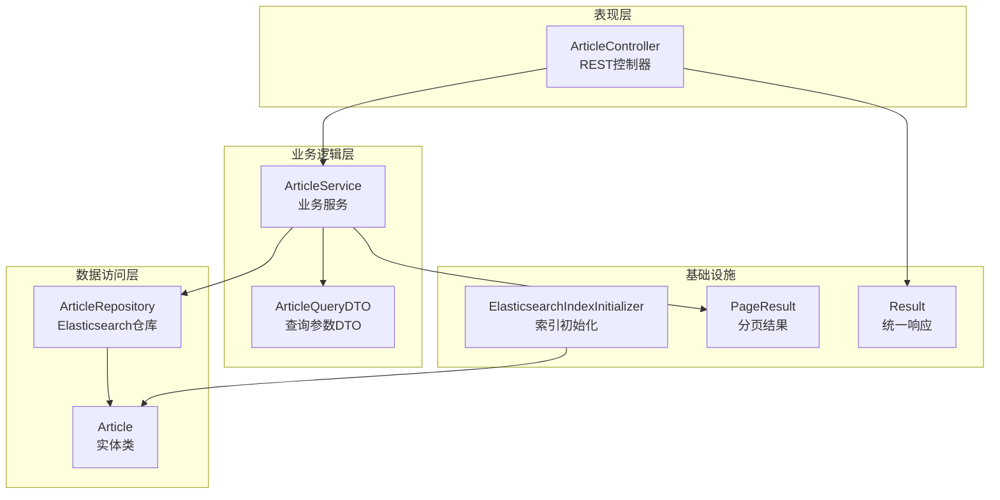
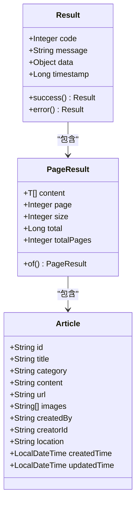
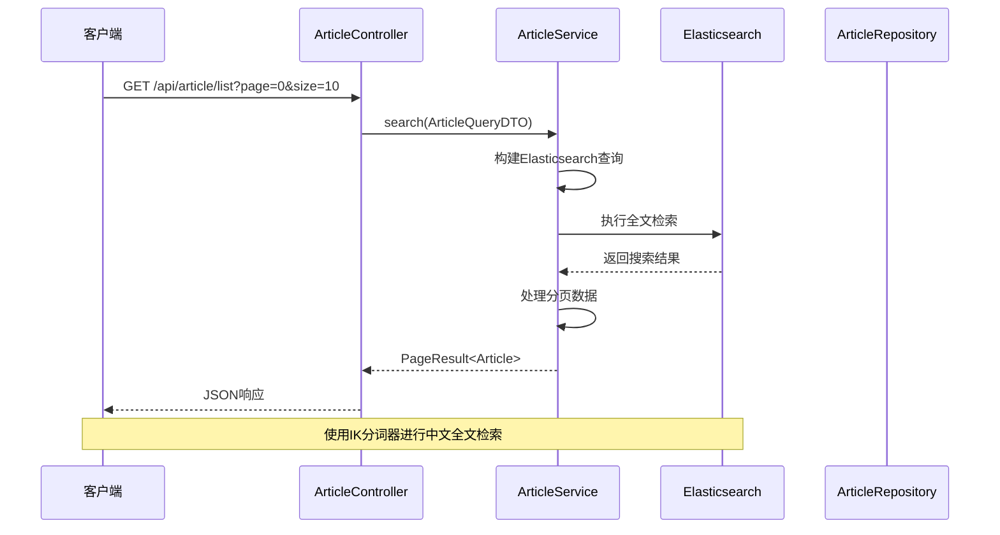
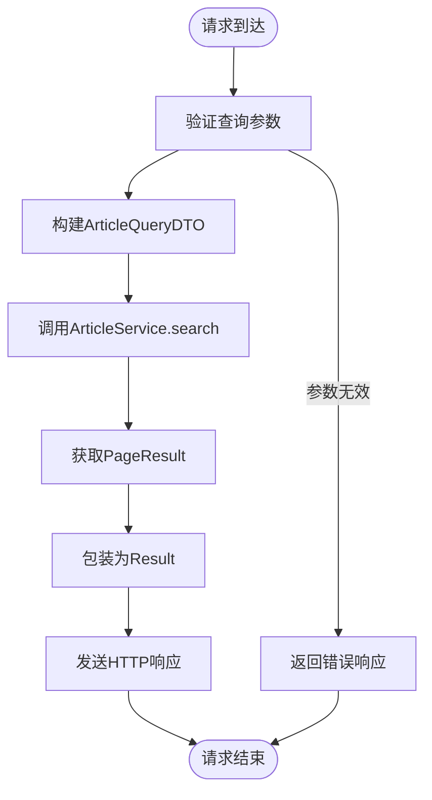
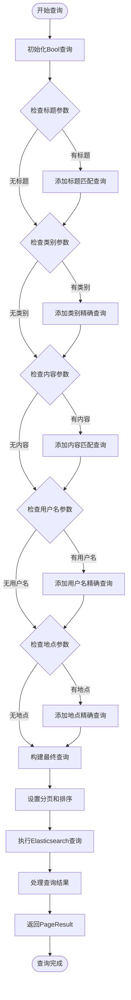
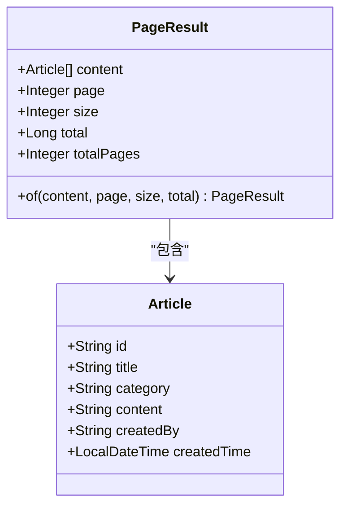
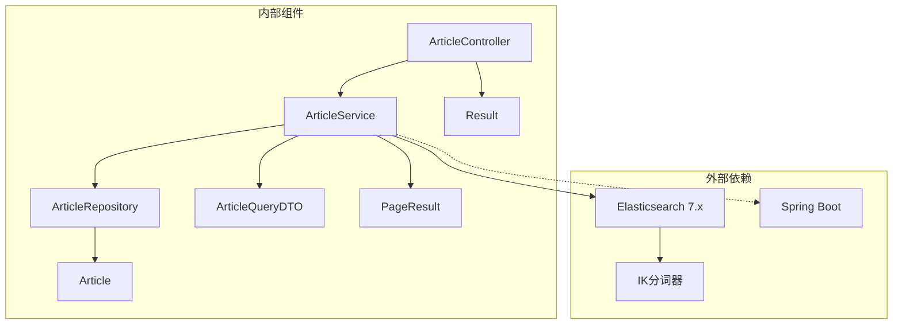

# 分页查询文章接口

<cite>
**本文档引用的文件**
- [ArticleController.java](file://src/main/java/com/zhishilu/controller/ArticleController.java)
- [ArticleService.java](file://src/main/java/com/zhishilu/service/ArticleService.java)
- [ArticleQueryDTO.java](file://src/main/java/com/zhishilu/dto/ArticleQueryDTO.java)
- [PageResult.java](file://src/main/java/com/zhishilu/common/PageResult.java)
- [Article.java](file://src/main/java/com/zhishilu/entity/Article.java)
- [ArticleRepository.java](file://src/main/java/com/zhishilu/repository/ArticleRepository.java)
- [ElasticsearchIndexInitializer.java](file://src/main/java/com/zhishilu/config/ElasticsearchIndexInitializer.java)
- [application.yml](file://src/main/resources/application.yml)
- [Result.java](file://src/main/java/com/zhishilu/common/Result.java)
</cite>

## 目录
1. [简介](#简介)
2. [项目结构](#项目结构)
3. [核心组件](#核心组件)
4. [架构概览](#架构概览)
5. [详细组件分析](#详细组件分析)
6. [依赖关系分析](#依赖关系分析)
7. [性能考虑](#性能考虑)
8. [故障排除指南](#故障排除指南)
9. [结论](#结论)

## 简介

本文档详细说明了基于Spring Boot和Elasticsearch构建的分页查询文章接口的完整规范。该系统提供了RESTful API接口，支持对文章进行全文检索、分类筛选和时间排序等功能。接口采用统一的响应格式，返回标准的分页数据结构。

## 项目结构

该项目采用典型的三层架构设计，主要包含以下模块：



**图表来源**
- [ArticleController.java](file://src/main/java/com/zhishilu/controller/ArticleController.java#L22-L25)
- [ArticleService.java](file://src/main/java/com/zhishilu/service/ArticleService.java#L34-L37)
- [ArticleRepository.java](file://src/main/java/com/zhishilu/repository/ArticleRepository.java#L12-L13)

**章节来源**
- [ArticleController.java](file://src/main/java/com/zhishilu/controller/ArticleController.java#L1-L88)
- [ArticleService.java](file://src/main/java/com/zhishilu/service/ArticleService.java#L1-L200)

## 核心组件

### 接口规范

**请求方法**: GET
**URL路径**: `/api/article/list`
**认证要求**: 需要JWT令牌（Authorization: Bearer token）

### 查询参数

| 参数名 | 类型 | 必填 | 默认值 | 描述 |
|--------|------|------|--------|------|
| title | String | 否 | null | 文章标题（模糊匹配） |
| category | String | 否 | null | 文章类别（精确匹配） |
| content | String | 否 | null | 文章内容（模糊匹配） |
| username | String | 否 | null | 创建者用户名（精确匹配） |
| location | String | 否 | null | 创建地点（精确匹配） |
| page | Integer | 否 | 0 | 页码（从0开始） |
| size | Integer | 否 | 10 | 每页大小 |

### 响应格式

接口返回统一的JSON格式，包含分页信息和数据内容：



**图表来源**
- [Result.java](file://src/main/java/com/zhishilu/common/Result.java#L8-L15)
- [PageResult.java](file://src/main/java/com/zhishilu/common/PageResult.java#L12-L15)
- [Article.java](file://src/main/java/com/zhishilu/entity/Article.java#L16-L80)

**章节来源**
- [ArticleQueryDTO.java](file://src/main/java/com/zhishilu/dto/ArticleQueryDTO.java#L8-L46)
- [PageResult.java](file://src/main/java/com/zhishilu/common/PageResult.java#L12-L52)
- [Result.java](file://src/main/java/com/zhishilu/common/Result.java#L8-L71)

## 架构概览

系统采用微服务架构模式，通过RESTful API提供文章管理功能：



**图表来源**
- [ArticleController.java](file://src/main/java/com/zhishilu/controller/ArticleController.java#L68-L75)
- [ArticleService.java](file://src/main/java/com/zhishilu/service/ArticleService.java#L113-L168)

## 详细组件分析

### ArticleController - 控制器层

控制器负责处理HTTP请求和响应，提供RESTful接口：



**图表来源**
- [ArticleController.java](file://src/main/java/com/zhishilu/controller/ArticleController.java#L68-L75)

**章节来源**
- [ArticleController.java](file://src/main/java/com/zhishilu/controller/ArticleController.java#L19-L88)

### ArticleService - 业务逻辑层

业务服务层实现了复杂的查询逻辑和Elasticsearch集成：

#### 查询构建流程



**图表来源**
- [ArticleService.java](file://src/main/java/com/zhishilu/service/ArticleService.java#L116-L168)

#### Elasticsearch查询优化策略

系统采用了多种优化策略来提升查询性能：

1. **字段类型优化**: 
   - 使用`FieldType.Text`配合IK分词器进行中文全文检索
   - 关键字字段使用`FieldType.Keyword`确保精确匹配
   - 时间字段使用`FieldType.Date`格式化存储

2. **查询类型选择**:
   - 标题和内容使用`match`查询进行模糊匹配
   - 类别、用户名、地点使用`term`查询进行精确匹配

3. **分页优化**:
   - 默认按创建时间降序排列
   - 支持大页码的高效分页查询

**章节来源**
- [ArticleService.java](file://src/main/java/com/zhishilu/service/ArticleService.java#L113-L168)
- [Article.java](file://src/main/java/com/zhishilu/entity/Article.java#L24-L79)

### ArticleQueryDTO - 查询参数模型

查询参数DTO定义了所有可选的过滤条件：

| 字段 | 类型 | 分析器 | 用途 |
|------|------|--------|------|
| title | String | ik_max_word/ik_smart | 文章标题全文检索 |
| category | String | Keyword | 文章类别精确匹配 |
| content | String | ik_max_word/ik_smart | 文章内容全文检索 |
| username | String | Keyword | 创建者用户名精确匹配 |
| location | String | Keyword | 创建地点精确匹配 |
| page | Integer | - | 页码（从0开始） |
| size | Integer | - | 每页记录数 |

**章节来源**
- [ArticleQueryDTO.java](file://src/main/java/com/zhishilu/dto/ArticleQueryDTO.java#L8-L46)

### PageResult - 分页数据结构

分页结果封装了查询的元数据和数据内容：



**图表来源**
- [PageResult.java](file://src/main/java/com/zhishilu/common/PageResult.java#L12-L52)

**章节来源**
- [PageResult.java](file://src/main/java/com/zhishilu/common/PageResult.java#L9-L52)

## 依赖关系分析

系统各组件之间的依赖关系如下：



**图表来源**
- [ArticleController.java](file://src/main/java/com/zhishilu/controller/ArticleController.java#L1-L18)
- [ArticleService.java](file://src/main/java/com/zhishilu/service/ArticleService.java#L1-L30)

**章节来源**
- [ArticleController.java](file://src/main/java/com/zhishilu/controller/ArticleController.java#L1-L18)
- [ArticleService.java](file://src/main/java/com/zhishilu/service/ArticleService.java#L1-L30)

## 性能考虑

### Elasticsearch配置优化

1. **索引配置**:
   - 单分片单副本配置，适合开发环境
   - 可根据生产环境需求调整分片数量

2. **分词器配置**:
   - 使用IK分词器优化中文检索效果
   - 标题和内容字段使用不同的分词精度

3. **查询性能优化**:
   - 使用布尔查询组合多个条件
   - 精确匹配使用term查询而非match查询
   - 合理设置分页大小避免深度分页

### 缓存策略

系统目前未实现专门的缓存层，建议在生产环境中考虑：

1. **查询结果缓存**: 对热门查询结果进行缓存
2. **热点数据缓存**: 对常用分类和标签进行缓存
3. **索引预热**: 在应用启动时预热常用查询

### 监控和日志

系统启用了详细的日志配置，包括：

- Elasticsearch操作日志
- 应用运行时日志
- 请求响应时间监控

**章节来源**
- [application.yml](file://src/main/resources/application.yml#L40-L47)
- [Article.java](file://src/main/java/com/zhishilu/entity/Article.java#L14-L16)

## 故障排除指南

### 常见问题及解决方案

1. **Elasticsearch连接失败**
   - 检查application.yml中的ES连接配置
   - 确认Elasticsearch服务正在运行
   - 验证网络连接和防火墙设置

2. **查询结果为空**
   - 检查索引是否已正确创建
   - 验证查询参数的拼写和格式
   - 确认数据已正确索引

3. **分页数据异常**
   - 检查page和size参数的有效性
   - 确认数据库中的数据量
   - 验证排序字段的可用性

4. **中文检索效果不佳**
   - 确认IK分词器已正确安装
   - 检查分词器配置
   - 调整查询分析器设置

### 错误响应格式

系统使用统一的错误响应格式：

```json
{
    "code": 500,
    "message": "错误描述",
    "data": null,
    "timestamp": 1640995200000
}
```

**章节来源**
- [Result.java](file://src/main/java/com/zhishilu/common/Result.java#L43-L70)

## 结论

该分页查询文章接口提供了完整的全文检索功能，具有以下特点：

1. **功能完整**: 支持多条件组合查询、分页显示、时间排序
2. **性能优化**: 采用合适的字段类型和查询策略
3. **易于扩展**: 清晰的架构设计便于功能扩展
4. **统一规范**: 标准化的响应格式和错误处理

建议在生产环境中进一步完善：
- 添加查询缓存机制
- 实现更精细的权限控制
- 增强监控和日志功能
- 优化Elasticsearch集群配置