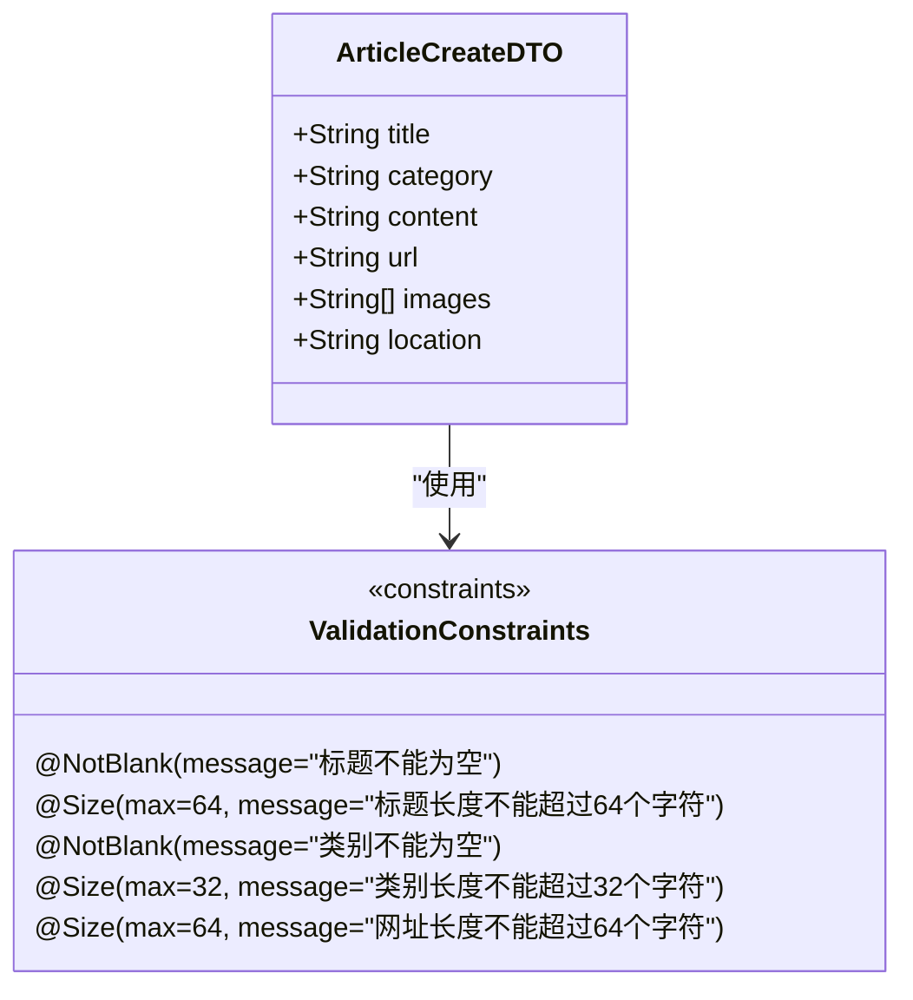
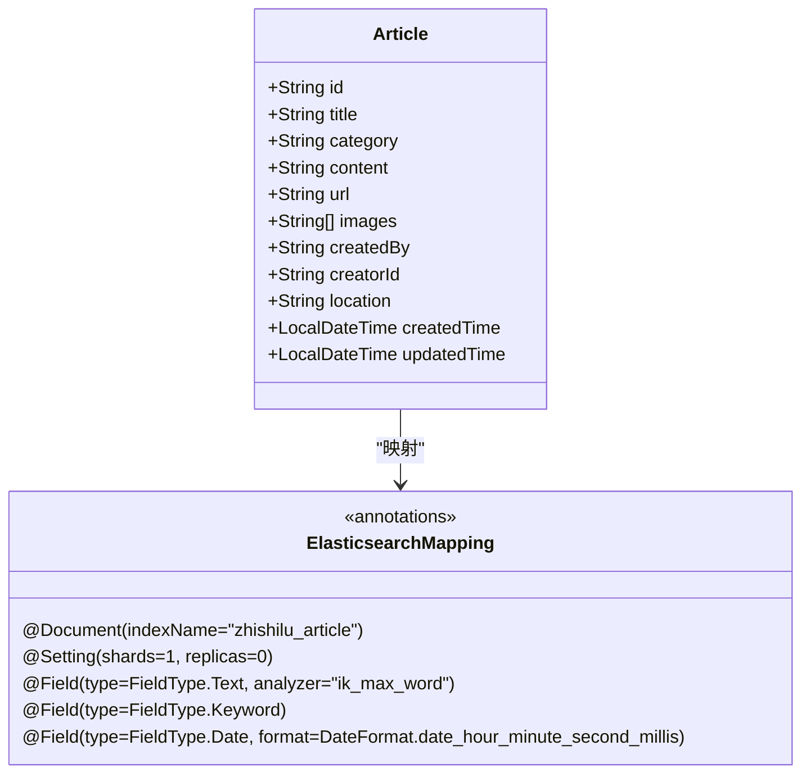
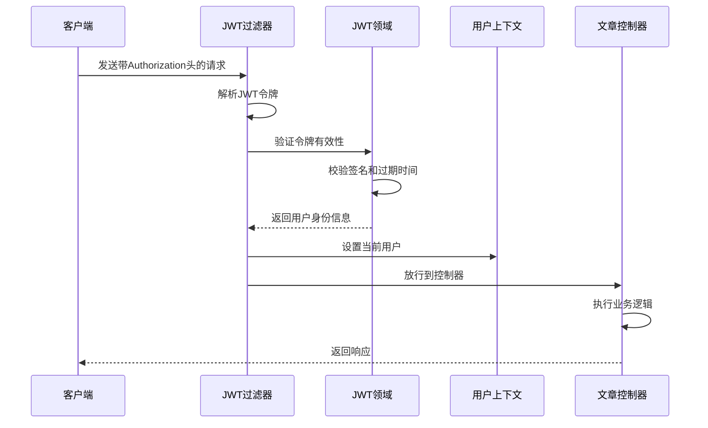
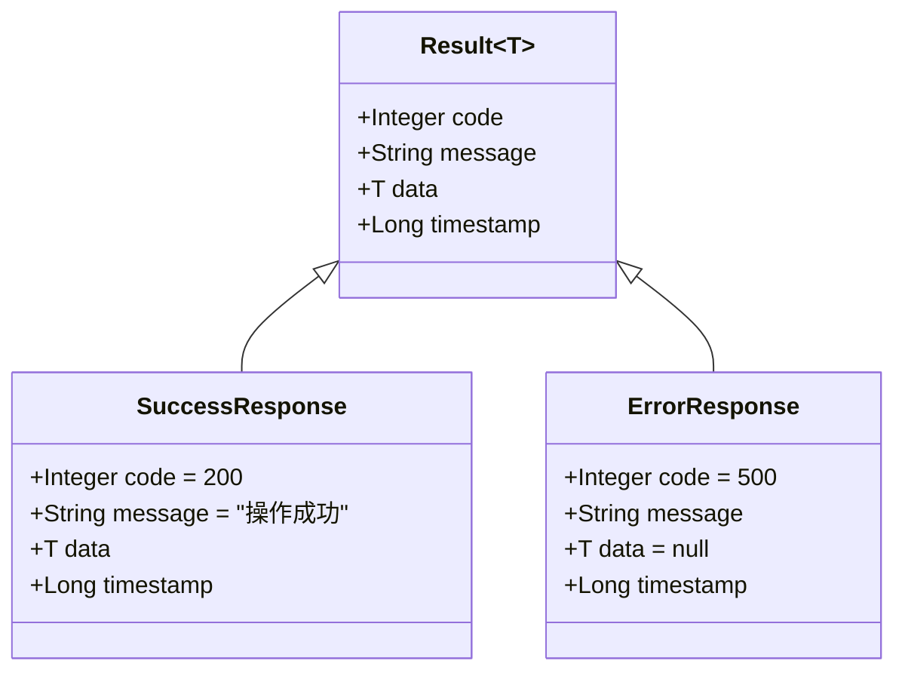
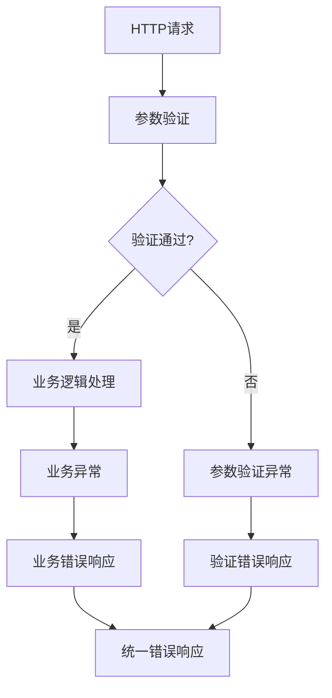
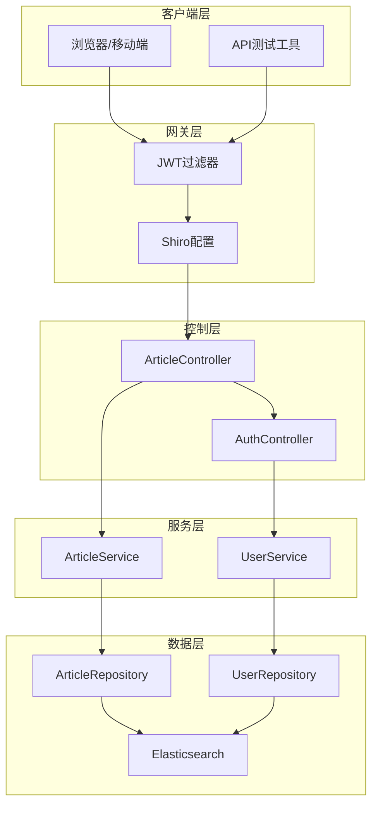
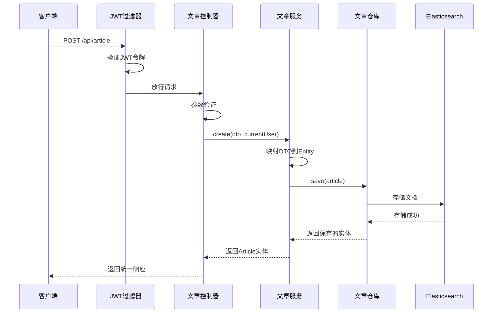

# 创建文章接口

<cite>
**本文档引用的文件**
- [ArticleController.java](file://src/main/java/com/zhishilu/controller/ArticleController.java)
- [ArticleCreateDTO.java](file://src/main/java/com/zhishilu/dto/ArticleCreateDTO.java)
- [Article.java](file://src/main/java/com/zhishilu/entity/Article.java)
- [ArticleService.java](file://src/main/java/com/zhishilu/service/ArticleService.java)
- [JwtFilter.java](file://src/main/java/com/zhishilu/shiro/JwtFilter.java)
- [ShiroConfig.java](file://src/main/java/com/zhishilu/config/ShiroConfig.java)
- [UserContext.java](file://src/main/java/com/zhishilu/util/UserContext.java)
- [Result.java](file://src/main/java/com/zhishilu/common/Result.java)
- [BusinessException.java](file://src/main/java/com/zhishilu/exception/BusinessException.java)
- [application.yml](file://src/main/resources/application.yml)
- [README.md](file://README.md)
</cite>

## 目录
1. [简介](#简介)
2. [接口规范](#接口规范)
3. [数据模型](#数据模型)
4. [权限与认证](#权限与认证)
5. [请求示例](#请求示例)
6. [响应格式](#响应格式)
7. [异常处理](#异常处理)
8. [架构图](#架构图)
9. [最佳实践](#最佳实践)

## 简介

创建文章接口是知拾录个人知识管理系统中的核心功能之一，用于创建新的文章内容。该接口基于Spring Boot框架构建，采用RESTful API设计规范，结合JWT认证和Shiro权限控制机制，确保系统的安全性和可靠性。

## 接口规范

### 基本信息

- **请求方法**: POST
- **URL路径**: `/api/article`
- **请求头设置**: `Content-Type: application/json`
- **认证要求**: 需要有效的JWT访问令牌
- **权限要求**: 已登录用户

### 请求参数

| 参数名 | 类型 | 必填 | 描述 | 长度限制 |
|--------|------|------|------|----------|
| title | String | 是 | 文章标题 | 最大64字符 |
| category | String | 是 | 文章类别 | 最大32字符 |
| content | String | 否 | 文章正文内容 | 无限制 |
| url | String | 否 | 来源网址 | 最大64字符 |
| images | Array[String] | 否 | 图片路径列表 | 无限制 |
| location | String | 否 | 创建地点 | 无限制 |

### URL路径映射

根据控制器配置，接口路径映射关系如下：
- 控制器类注解: `@RequestMapping("/article")`
- 方法注解: `@PostMapping`
- 最终URL: `/api/article` (结合application.yml中的context-path配置)

**章节来源**
- [ArticleController.java](file://src/main/java/com/zhishilu/controller/ArticleController.java#L22-L37)
- [application.yml](file://src/main/resources/application.yml#L1-L5)

## 数据模型

### ArticleCreateDTO 数据模型

ArticleCreateDTO是创建文章时使用的数据传输对象，包含以下字段：



**图表来源**
- [ArticleCreateDTO.java](file://src/main/java/com/zhishilu/dto/ArticleCreateDTO.java#L12-L31)

### 字段验证规则

每个字段都应用了相应的验证约束：

1. **title (标题)**
   - 非空验证: `@NotBlank`
   - 长度限制: `@Size(max=64)`
   - 错误消息: "标题不能为空"、"标题长度不能超过64个字符"

2. **category (类别)**
   - 非空验证: `@NotBlank`
   - 长度限制: `@Size(max=32)`
   - 错误消息: "类别不能为空"、"类别长度不能超过32个字符"

3. **content (内容)**
   - 可选字段，无长度限制

4. **url (网址)**
   - 可选字段
   - 长度限制: `@Size(max=64)`
   - 错误消息: "网址长度不能超过64个字符"

5. **images (图片)**
   - 可选字段，数组类型
   - 无长度限制

6. **location (地点)**
   - 可选字段
   - 无长度限制

### Article 实体模型

创建成功后返回的Article实体包含以下字段：



**图表来源**
- [Article.java](file://src/main/java/com/zhishilu/entity/Article.java#L14-L80)

**章节来源**
- [ArticleCreateDTO.java](file://src/main/java/com/zhishilu/dto/ArticleCreateDTO.java#L12-L31)
- [Article.java](file://src/main/java/com/zhishilu/entity/Article.java#L14-L80)

## 权限与认证

### JWT认证流程

系统采用基于JWT的无状态认证机制，通过Shiro框架实现：



**图表来源**
- [JwtFilter.java](file://src/main/java/com/zhishilu/shiro/JwtFilter.java#L39-L75)
- [ShiroConfig.java](file://src/main/java/com/zhishilu/config/ShiroConfig.java#L45-L67)

### 认证配置

认证配置主要在以下文件中定义：

1. **Shiro过滤器配置**
   - 过滤规则: `/**` 需要JWT认证
   - 公开接口: `/auth/**`、`/file/download/**` 等
   - 过滤器链: `jwt` 过滤器

2. **JWT配置**
   - 密钥: `zhishilu-secret-key-must-be-at-least-256-bits-long-for-hs256`
   - 过期时间: 24小时 (86400000毫秒)
   - 请求头: `Authorization`
   - 前缀: `Bearer`

3. **用户上下文**
   - 使用ThreadLocal存储当前用户信息
   - 线程安全的用户信息传递

**章节来源**
- [ShiroConfig.java](file://src/main/java/com/zhishilu/config/ShiroConfig.java#L45-L67)
- [JwtFilter.java](file://src/main/java/com/zhishilu/shiro/JwtFilter.java#L31-L35)
- [UserContext.java](file://src/main/java/com/zhishilu/util/UserContext.java#L8-L32)

## 请求示例

### 成功请求示例

```json
{
  "title": "Spring Boot 教程",
  "category": "技术",
  "content": "这是一篇关于Spring Boot开发的详细教程...",
  "url": "https://example.com/spring-boot-tutorial",
  "images": ["image1.jpg", "image2.png"],
  "location": "北京"
}
```

### 失败请求示例（缺少必填字段）

```json
{
  "title": "无效请求",
  "content": "缺少必需的category字段"
}
```

## 响应格式

### 统一响应结构

系统采用统一的响应格式，所有接口返回相同结构：



**图表来源**
- [Result.java](file://src/main/java/com/zhishilu/common/Result.java#L8-L70)

### 成功响应示例

```json
{
  "code": 200,
  "message": "创建成功",
  "data": {
    "id": "64f5a1b2c3d4e5f6a7b8c9d0",
    "title": "Spring Boot 教程",
    "category": "技术",
    "content": "这是一篇关于Spring Boot开发的详细教程...",
    "url": "https://example.com/spring-boot-tutorial",
    "images": ["image1.jpg", "image2.png"],
    "location": "北京",
    "createdBy": "john_doe",
    "creatorId": "user_123",
    "createdTime": "2024-09-01T10:30:00.000",
    "updatedTime": "2024-09-01T10:30:00.000"
  },
  "timestamp": 1725133800000
}
```

### 失败响应示例

```json
{
  "code": 400,
  "message": "标题不能为空",
  "data": null,
  "timestamp": 1725133800000
}
```

**章节来源**
- [Result.java](file://src/main/java/com/zhishilu/common/Result.java#L20-L41)

## 异常处理

### 业务异常处理

系统定义了专门的业务异常类，用于处理各种业务场景：



**图表来源**
- [BusinessException.java](file://src/main/java/com/zhishilu/exception/BusinessException.java#L8-L22)

### 异常类型及处理

1. **参数验证异常**
   - 触发条件: DTO字段验证失败
   - 返回码: 400
   - 错误消息: 具体的验证错误信息

2. **业务逻辑异常**
   - 触发条件: 业务规则违反
   - 返回码: 500
   - 错误消息: 自定义业务错误信息

3. **权限异常**
   - 触发条件: 未登录或权限不足
   - 返回码: 401/403
   - 错误消息: "未授权，请先登录" 或 "没有权限执行此操作"

4. **认证异常**
   - 触发条件: JWT令牌无效或过期
   - 返回码: 401
   - 错误消息: 具体的认证错误信息

**章节来源**
- [BusinessException.java](file://src/main/java/com/zhishilu/exception/BusinessException.java#L8-L22)
- [Result.java](file://src/main/java/com/zhishilu/common/Result.java#L43-L69)

## 架构图

### 系统架构概览



**图表来源**
- [ArticleController.java](file://src/main/java/com/zhishilu/controller/ArticleController.java#L22-L27)
- [ArticleService.java](file://src/main/java/com/zhishilu/service/ArticleService.java#L34-L41)
- [ShiroConfig.java](file://src/main/java/com/zhishilu/config/ShiroConfig.java#L26-L39)

### 创建流程时序图



**图表来源**
- [ArticleController.java](file://src/main/java/com/zhishilu/controller/ArticleController.java#L32-L37)
- [ArticleService.java](file://src/main/java/com/zhishilu/service/ArticleService.java#L45-L59)

## 最佳实践

### 开发建议

1. **参数验证**
   - 始终使用DTO进行参数验证
   - 合理设置字段长度限制
   - 提供清晰的错误消息

2. **安全性**
   - 确保JWT令牌的安全存储
   - 定期轮换密钥
   - 实施适当的超时策略

3. **性能优化**
   - 合理使用Elasticsearch索引
   - 优化查询性能
   - 实施缓存策略

4. **监控与日志**
   - 记录关键操作日志
   - 监控API调用频率
   - 实施错误追踪

### 常见问题解决

1. **认证失败**
   - 检查JWT令牌格式是否正确
   - 验证令牌是否过期
   - 确认请求头格式: `Bearer <token>`

2. **参数验证错误**
   - 检查必填字段是否完整
   - 验证字段长度限制
   - 确认数据类型正确

3. **权限问题**
   - 确认用户已登录
   - 检查用户权限级别
   - 验证操作权限

**章节来源**
- [README.md](file://README.md#L16-L48)