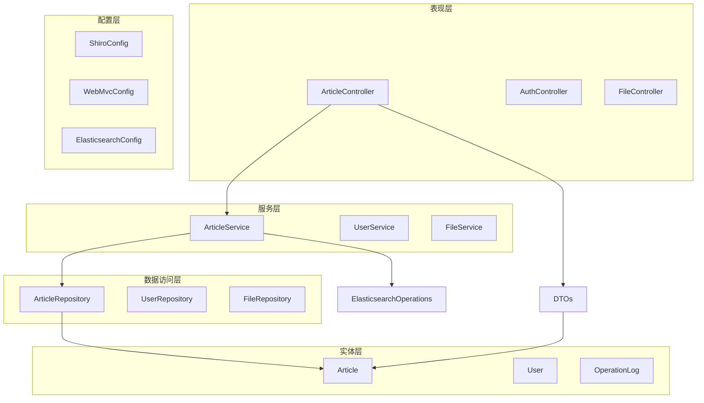
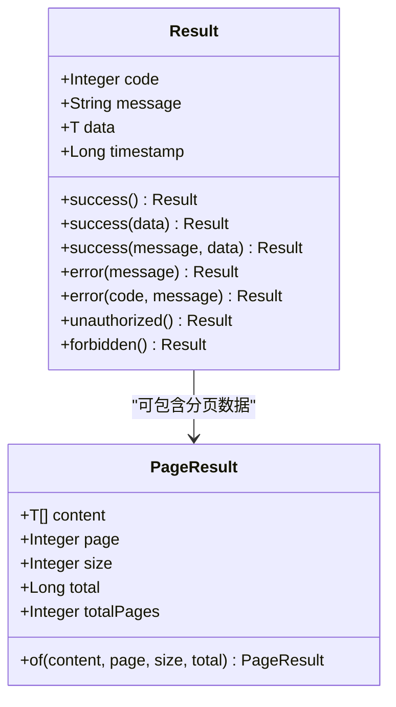
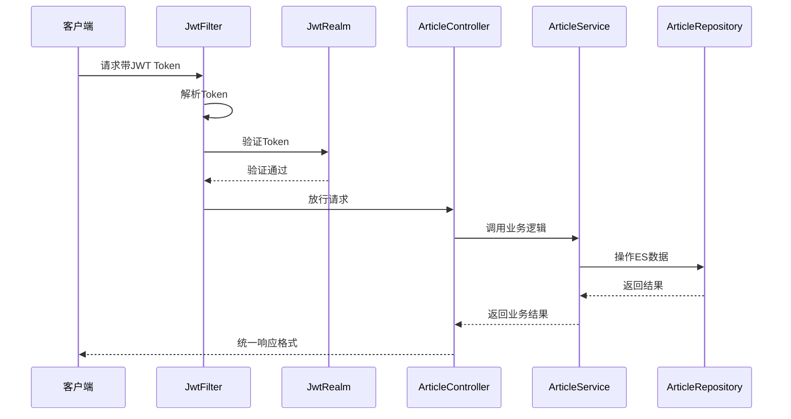
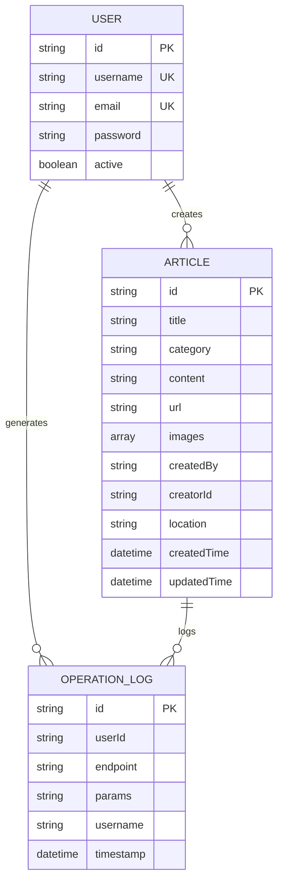
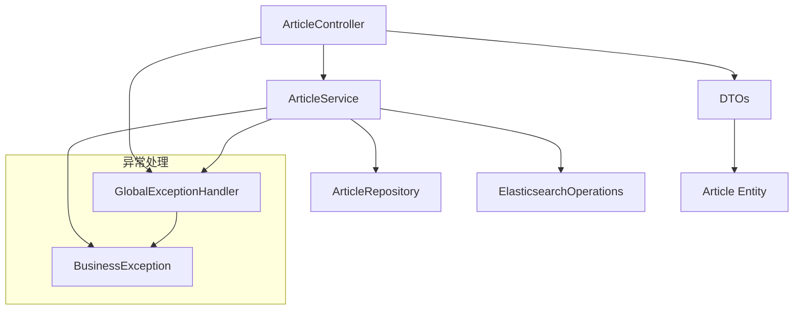
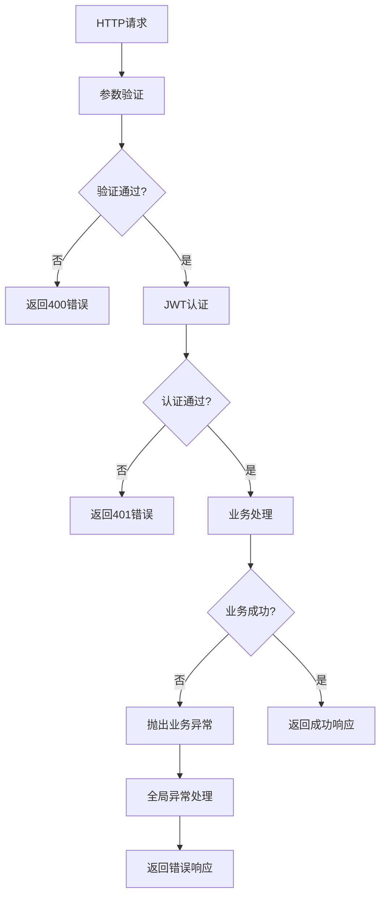

# 文章API接口

<cite>
**本文档引用的文件**
- [ArticleController.java](file://src/main/java/com/zhishilu/controller/ArticleController.java)
- [ArticleService.java](file://src/main/java/com/zhishilu/service/ArticleService.java)
- [ArticleCreateDTO.java](file://src/main/java/com/zhishilu/dto/ArticleCreateDTO.java)
- [ArticleUpdateDTO.java](file://src/main/java/com/zhishilu/dto/ArticleUpdateDTO.java)
- [ArticleQueryDTO.java](file://src/main/java/com/zhishilu/dto/ArticleQueryDTO.java)
- [Article.java](file://src/main/java/com/zhishilu/entity/Article.java)
- [Result.java](file://src/main/java/com/zhishilu/common/Result.java)
- [PageResult.java](file://src/main/java/com/zhishilu/common/PageResult.java)
- [UserContext.java](file://src/main/java/com/zhishilu/util/UserContext.java)
- [JwtFilter.java](file://src/main/java/com/zhishilu/shiro/JwtFilter.java)
- [BusinessException.java](file://src/main/java/com/zhishilu/exception/BusinessException.java)
- [GlobalExceptionHandler.java](file://src/main/java/com/zhishilu/exception/GlobalExceptionHandler.java)
- [ArticleRepository.java](file://src/main/java/com/zhishilu/repository/ArticleRepository.java)
- [README.md](file://README.md)
</cite>

## 目录
1. [简介](#简介)
2. [项目结构](#项目结构)
3. [核心组件](#核心组件)
4. [架构概览](#架构概览)
5. [详细接口规范](#详细接口规范)
6. [依赖关系分析](#依赖关系分析)
7. [性能考虑](#性能考虑)
8. [故障排除指南](#故障排除指南)
9. [结论](#结论)

## 简介

知拾录是一个用于记录和管理个人知识内容的管理系统，支持文章、网站、图片、视频等多种内容类型的收藏和管理。本文档详细说明了文章API接口的完整规范，包括REST接口设计、请求参数验证、响应格式、错误处理机制以及安全认证策略。

## 项目结构

项目采用标准的Spring Boot分层架构，主要包含以下层次：



**图表来源**
- [ArticleController.java](file://src/main/java/com/zhishilu/controller/ArticleController.java#L22-L87)
- [ArticleService.java](file://src/main/java/com/zhishilu/service/ArticleService.java#L34-L200)
- [ArticleRepository.java](file://src/main/java/com/zhishilu/repository/ArticleRepository.java#L12-L29)

**章节来源**
- [README.md](file://README.md#L99-L133)

## 核心组件

### 统一响应格式

系统使用统一的响应格式，确保所有API接口的一致性：



**图表来源**
- [Result.java](file://src/main/java/com/zhishilu/common/Result.java#L8-L71)
- [PageResult.java](file://src/main/java/com/zhishilu/common/PageResult.java#L12-L52)

### 数据传输对象(DTO)

系统使用DTO模式进行数据传输，确保接口的清晰性和安全性：

| DTO类型 | 用途 | 字段数量 |
|---------|------|----------|
| ArticleCreateDTO | 创建文章请求 | 6个字段 |
| ArticleUpdateDTO | 更新文章请求 | 5个字段 |
| ArticleQueryDTO | 查询文章请求 | 8个字段 |

**章节来源**
- [ArticleCreateDTO.java](file://src/main/java/com/zhishilu/dto/ArticleCreateDTO.java#L12-L32)
- [ArticleUpdateDTO.java](file://src/main/java/com/zhishilu/dto/ArticleUpdateDTO.java#L11-L24)
- [ArticleQueryDTO.java](file://src/main/java/com/zhishilu/dto/ArticleQueryDTO.java#L8-L46)

## 架构概览

系统采用基于JWT的认证授权架构，结合Apache Shiro实现权限控制：



**图表来源**
- [JwtFilter.java](file://src/main/java/com/zhishilu/shiro/JwtFilter.java#L29-L109)
- [ArticleController.java](file://src/main/java/com/zhishilu/controller/ArticleController.java#L22-L87)

## 详细接口规范

### 基础信息

- **基础URL**: `/api/article`
- **认证方式**: JWT Token（Authorization头）
- **默认分页**: 每页10条记录
- **排序规则**: 按创建时间降序排列

### 1. 创建文章

#### 接口描述
创建新的文章内容，系统会自动记录创建者信息和时间戳。

#### HTTP请求
- **方法**: `POST`
- **路径**: `/api/article`
- **认证**: 必需

#### 请求头
- `Content-Type: application/json`
- `Authorization: Bearer <JWT_TOKEN>`

#### 请求体参数

| 参数名 | 类型 | 必填 | 长度限制 | 描述 |
|--------|------|------|----------|------|
| title | string | 是 | 最大64字符 | 文章标题 |
| category | string | 是 | 最大32字符 | 文章类别 |
| content | string | 否 | 无限制 | 文章内容 |
| url | string | 否 | 最大64字符 | 来源链接 |
| images | array[string] | 否 | 无限制 | 图片路径列表 |
| location | string | 否 | 无限制 | 创建地点 |

#### 成功响应
- **状态码**: 200
- **响应体**: 统一响应格式，data包含创建的文章对象

#### 错误响应
- **400**: 参数验证失败
- **401**: 未授权访问
- **500**: 服务器内部错误

#### curl示例
```bash
curl -X POST "http://localhost:8080/api/article" \
  -H "Authorization: Bearer YOUR_JWT_TOKEN" \
  -H "Content-Type: application/json" \
  -d '{
    "title": "示例文章",
    "category": "技术",
    "content": "文章内容...",
    "url": "https://example.com",
    "images": ["image1.jpg", "image2.jpg"],
    "location": "北京"
  }'
```

#### JavaScript示例
```javascript
fetch('http://localhost:8080/api/article', {
  method: 'POST',
  headers: {
    'Authorization': 'Bearer YOUR_JWT_TOKEN',
    'Content-Type': 'application/json'
  },
  body: JSON.stringify({
    title: '示例文章',
    category: '技术',
    content: '文章内容...',
    url: 'https://example.com',
    images: ['image1.jpg', 'image2.jpg'],
    location: '北京'
  })
})
.then(response => response.json())
.then(data => console.log(data))
.catch(error => console.error('Error:', error));
```

**章节来源**
- [ArticleController.java](file://src/main/java/com/zhishilu/controller/ArticleController.java#L32-L37)
- [ArticleService.java](file://src/main/java/com/zhishilu/service/ArticleService.java#L45-L59)
- [ArticleCreateDTO.java](file://src/main/java/com/zhishilu/dto/ArticleCreateDTO.java#L13-L32)

### 2. 更新文章

#### 接口描述
更新指定ID的文章内容，仅允许文章创建者进行修改。

#### HTTP请求
- **方法**: `PUT`
- **路径**: `/api/article/{id}`
- **认证**: 必需

#### 路径参数

| 参数名 | 类型 | 必填 | 描述 |
|--------|------|------|------|
| id | string | 是 | 文章唯一标识符 |

#### 请求体参数

| 参数名 | 类型 | 必填 | 长度限制 | 描述 |
|--------|------|------|----------|------|
| title | string | 否 | 最大64字符 | 文章标题 |
| content | string | 否 | 无限制 | 文章内容 |
| url | string | 否 | 最大64字符 | 来源链接 |
| images | array[string] | 否 | 无限制 | 图片路径列表 |

#### 权限控制
- 仅文章创建者可以修改
- 系统会验证当前用户与文章创建者的匹配性

#### 成功响应
- **状态码**: 200
- **响应体**: 统一响应格式，data包含更新后的文章对象

#### 错误响应
- **400**: 参数验证失败或权限不足
- **401**: 未授权访问
- **403**: 没有权限修改此文章
- **500**: 文章不存在或服务器内部错误

#### curl示例
```bash
curl -X PUT "http://localhost:8080/api/article/ARTICLE_ID" \
  -H "Authorization: Bearer YOUR_JWT_TOKEN" \
  -H "Content-Type: application/json" \
  -d '{
    "title": "更新后的标题",
    "content": "更新后的文章内容..."
  }'
```

**章节来源**
- [ArticleController.java](file://src/main/java/com/zhishilu/controller/ArticleController.java#L42-L47)
- [ArticleService.java](file://src/main/java/com/zhishilu/service/ArticleService.java#L64-L88)
- [ArticleUpdateDTO.java](file://src/main/java/com/zhishilu/dto/ArticleUpdateDTO.java#L11-L24)

### 3. 删除文章

#### 接口描述
删除指定ID的文章内容，仅允许文章创建者进行删除。

#### HTTP请求
- **方法**: `DELETE`
- **路径**: `/api/article/{id}`
- **认证**: 必需

#### 权限控制
- 仅文章创建者可以删除
- 系统会验证当前用户与文章创建者的匹配性

#### 成功响应
- **状态码**: 200
- **响应体**: 统一响应格式，message为"删除成功"

#### 错误响应
- **401**: 未授权访问
- **403**: 没有权限删除此文章
- **500**: 文章不存在或服务器内部错误

#### curl示例
```bash
curl -X DELETE "http://localhost:8080/api/article/ARTICLE_ID" \
  -H "Authorization: Bearer YOUR_JWT_TOKEN"
```

**章节来源**
- [ArticleController.java](file://src/main/java/com/zhishilu/controller/ArticleController.java#L52-L57)
- [ArticleService.java](file://src/main/java/com/zhishilu/service/ArticleService.java#L93-L103)

### 4. 获取文章详情

#### 接口描述
根据文章ID获取文章的详细信息。

#### HTTP请求
- **方法**: `GET`
- **路径**: `/api/article/{id}`
- **认证**: 可选

#### 成功响应
- **状态码**: 200
- **响应体**: 统一响应格式，data包含文章对象

#### 错误响应
- **500**: 文章不存在

#### curl示例
```bash
curl -X GET "http://localhost:8080/api/article/ARTICLE_ID" \
  -H "Authorization: Bearer YOUR_JWT_TOKEN"
```

**章节来源**
- [ArticleController.java](file://src/main/java/com/zhishilu/controller/ArticleController.java#L62-L66)
- [ArticleService.java](file://src/main/java/com/zhishilu/service/ArticleService.java#L108-L111)

### 5. 分页查询文章

#### 接口描述
根据多种条件进行分页查询，支持模糊搜索和精确匹配。

#### HTTP请求
- **方法**: `GET`
- **路径**: `/api/article/list`
- **认证**: 可选

#### 查询参数

| 参数名 | 类型 | 必填 | 默认值 | 描述 |
|--------|------|------|--------|------|
| title | string | 否 | 无 | 标题模糊查询 |
| category | string | 否 | 无 | 类别精确查询 |
| content | string | 否 | 无 | 内容模糊查询 |
| username | string | 否 | 无 | 创建者用户名精确查询 |
| location | string | 否 | 无 | 地点精确查询 |
| page | integer | 否 | 0 | 页码（从0开始） |
| size | integer | 否 | 10 | 每页大小 |

#### 查询条件说明
- **模糊查询**: title、content字段使用模糊匹配
- **精确查询**: category、username、location字段使用精确匹配
- **组合查询**: 多个条件同时满足时使用AND逻辑

#### 成功响应
- **状态码**: 200
- **响应体**: 统一响应格式，data为PageResult对象

#### curl示例
```bash
curl -X GET "http://localhost:8080/api/article/list?page=0&size=10&category=技术" \
  -H "Authorization: Bearer YOUR_JWT_TOKEN"
```

**章节来源**
- [ArticleController.java](file://src/main/java/com/zhishilu/controller/ArticleController.java#L71-L75)
- [ArticleService.java](file://src/main/java/com/zhishilu/service/ArticleService.java#L116-L168)
- [ArticleQueryDTO.java](file://src/main/java/com/zhishilu/dto/ArticleQueryDTO.java#L8-L46)

### 6. 获取常用类别

#### 接口描述
获取当前用户最常用的类别统计信息，用于内容推荐。

#### HTTP请求
- **方法**: `GET`
- **路径**: `/api/article/categories/top`
- **认证**: 必需

#### 查询参数

| 参数名 | 类型 | 必填 | 默认值 | 描述 |
|--------|------|------|--------|------|
| limit | integer | 否 | 10 | 返回类别数量限制 |

#### 成功响应
- **状态码**: 200
- **响应体**: 统一响应格式，data为类别统计列表

每个类别对象包含：
- `category`: 类别名称
- `count`: 出现次数

#### curl示例
```bash
curl -X GET "http://localhost:8080/api/article/categories/top?limit=10" \
  -H "Authorization: Bearer YOUR_JWT_TOKEN"
```

**章节来源**
- [ArticleController.java](file://src/main/java/com/zhishilu/controller/ArticleController.java#L80-L86)
- [ArticleService.java](file://src/main/java/com/zhishilu/service/ArticleService.java#L173-L198)

## 依赖关系分析

### 数据模型关系



**图表来源**
- [Article.java](file://src/main/java/com/zhishilu/entity/Article.java#L16-L81)
- [UserContext.java](file://src/main/java/com/zhishilu/util/UserContext.java#L8-L33)

### 服务层依赖



**图表来源**
- [ArticleController.java](file://src/main/java/com/zhishilu/controller/ArticleController.java#L22-L87)
- [ArticleService.java](file://src/main/java/com/zhishilu/service/ArticleService.java#L34-L200)
- [GlobalExceptionHandler.java](file://src/main/java/com/zhishilu/exception/GlobalExceptionHandler.java#L20-L87)

**章节来源**
- [ArticleRepository.java](file://src/main/java/com/zhishilu/repository/ArticleRepository.java#L12-L29)

## 性能考虑

### Elasticsearch优化

1. **索引配置**: 使用IK分词器进行中文分词
2. **字段映射**: 关键字段使用合适的字段类型
3. **查询优化**: 支持模糊查询和精确查询的组合使用

### 缓存策略

- **用户上下文**: 使用ThreadLocal缓存当前用户信息
- **分页查询**: Elasticsearch原生分页支持
- **聚合查询**: 使用ES聚合功能进行类别统计

### 并发控制

- **线程安全**: UserContext使用ThreadLocal保证线程安全
- **事务处理**: 文章操作在单线程环境下执行

## 故障排除指南

### 常见错误及解决方案

| 错误类型 | HTTP状态码 | 错误原因 | 解决方案 |
|----------|------------|----------|----------|
| 参数验证错误 | 400 | DTO参数验证失败 | 检查请求参数格式和长度限制 |
| 未授权访问 | 401 | JWT Token缺失或无效 | 确认Authorization头格式正确 |
| 权限不足 | 403 | 非文章创建者尝试修改 | 确认当前用户身份 |
| 资源不存在 | 500 | 文章ID不存在 | 检查文章ID是否正确 |

### 异常处理流程



**图表来源**
- [GlobalExceptionHandler.java](file://src/main/java/com/zhishilu/exception/GlobalExceptionHandler.java#L20-L87)

**章节来源**
- [BusinessException.java](file://src/main/java/com/zhishilu/exception/BusinessException.java#L8-L23)
- [GlobalExceptionHandler.java](file://src/main/java/com/zhishilu/exception/GlobalExceptionHandler.java#L20-L87)

## 结论

本文档详细介绍了知拾录系统的文章API接口规范，包括：

1. **完整的接口设计**: 覆盖文章的增删改查和查询推荐功能
2. **严格的参数验证**: 基于DTO的参数验证和长度限制
3. **统一的响应格式**: 标准化的JSON响应结构
4. **完善的权限控制**: 基于JWT和Shiro的认证授权机制
5. **健壮的错误处理**: 全局异常处理和详细的错误信息

系统采用现代化的技术栈，结合Elasticsearch实现高效的全文检索，为用户提供良好的内容管理体验。接口设计遵循RESTful原则，具有良好的扩展性和维护性。