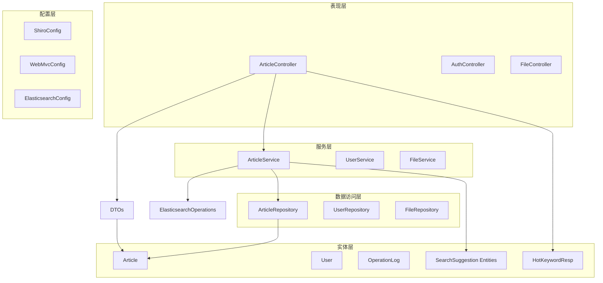
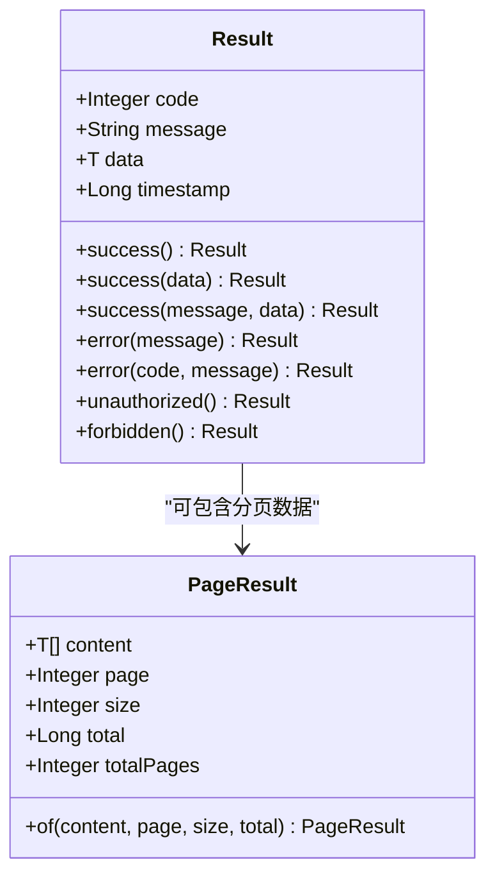
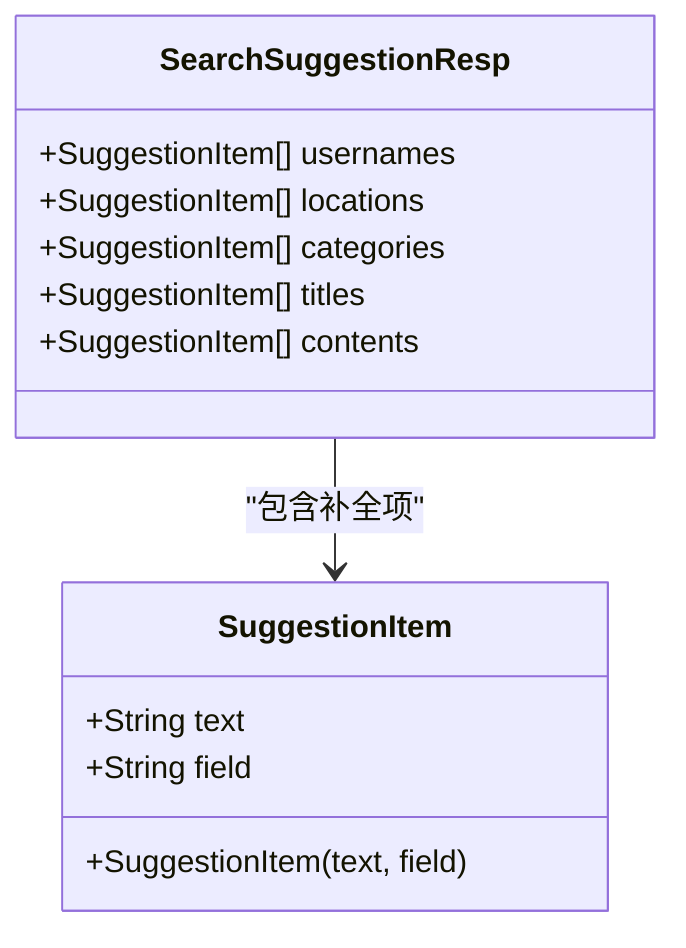
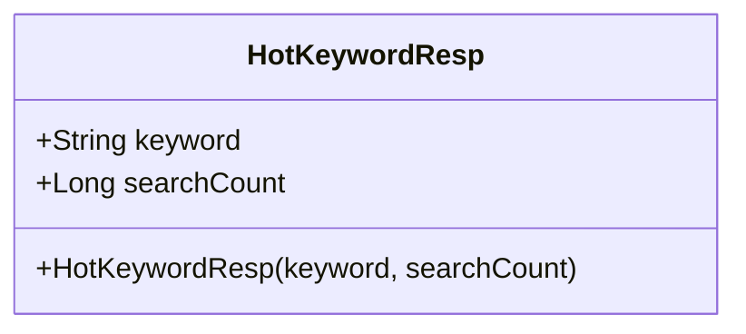
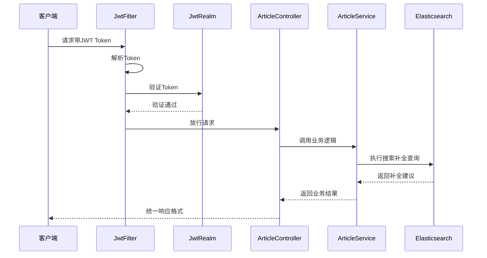
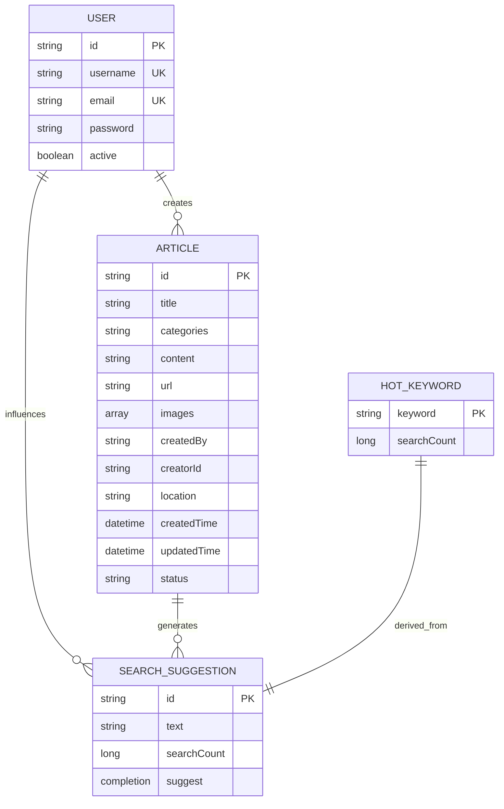
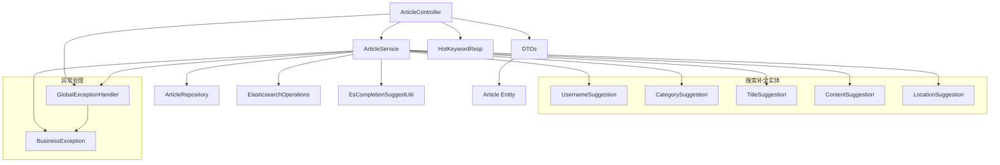
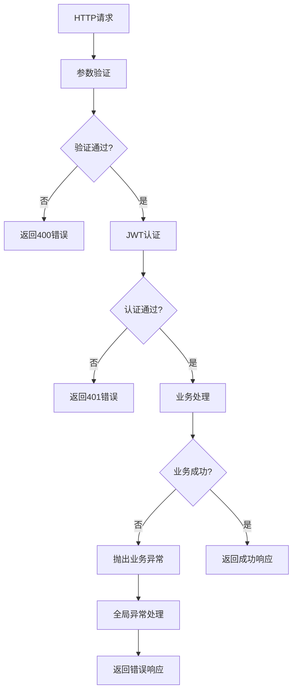
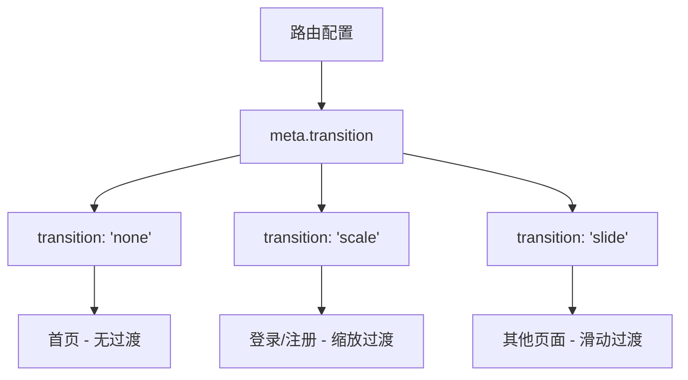

# 文章API接口

<cite>
**本文档引用的文件**
- [ArticleController.java](file://src/main/java/com/zhishilu/controller/ArticleController.java)
- [ArticleService.java](file://src/main/java/com/zhishilu/service/ArticleService.java)
- [HotKeywordResp.java](file://src/main/java/com/zhishilu/resp/HotKeywordResp.java)
- [SearchSuggestionResp.java](file://src/main/java/com/zhishilu/resp/SearchSuggestionResp.java)
- [EsCompletionSuggestUtil.java](file://src/main/java/com/zhishilu/util/EsCompletionSuggestUtil.java)
- [UsernameSuggestion.java](file://src/main/java/com/zhishilu/entity/UsernameSuggestion.java)
- [CategorySuggestion.java](file://src/main/java/com/zhishilu/entity/CategorySuggestion.java)
- [TitleSuggestion.java](file://src/main/java/com/zhishilu/entity/TitleSuggestion.java)
- [ContentSuggestion.java](file://src/main/java/com/zhishilu/entity/ContentSuggestion.java)
- [LocationSuggestion.java](file://src/main/java/com/zhishilu/entity/LocationSuggestion.java)
- [Result.java](file://src/main/java/com/zhishilu/common/Result.java)
- [PageResult.java](file://src/main/java/com/zhishilu/common/PageResult.java)
- [UserContext.java](file://src/main/java/com/zhishilu/util/UserContext.java)
- [JwtFilter.java](file://src/main/java/com/zhishilu/shiro/JwtFilter.java)
- [BusinessException.java](file://src/main/java/com/zhishilu/exception/BusinessException.java)
- [GlobalExceptionHandler.java](file://src/main/java/com/zhishilu/exception/GlobalExceptionHandler.java)
- [HomeView.vue](file://frontend/src/views/HomeView.vue)
- [index.ts](file://frontend/src/router/index.ts)
- [App.vue](file://frontend/src/App.vue)
- [README.md](file://README.md)
</cite>

## 更新摘要
**所做更改**
- 新增热门关键词接口文档
- 更新文章详情接口路径为/detail/{id}
- 新增/get-article-api接口用于获取文章详情
- 新增/get-search-suggestions接口用于搜索补全功能
- 更新接口路径和参数规范
- 新增页面过渡动画配置说明

## 目录
1. [简介](#简介)
2. [项目结构](#项目结构)
3. [核心组件](#核心组件)
4. [架构概览](#架构概览)
5. [详细接口规范](#详细接口规范)
6. [依赖关系分析](#依赖关系分析)
7. [性能考虑](#性能考虑)
8. [故障排除指南](#故障排除指南)
9. [结论](#结论)

## 简介

知拾录是一个用于记录和管理个人知识内容的管理系统，支持文章、网站、图片、视频等多种内容类型的收藏和管理。本文档详细说明了文章API接口的完整规范，包括REST接口设计、请求参数验证、响应格式、错误处理机制以及安全认证策略。

## 项目结构

项目采用标准的Spring Boot分层架构，主要包含以下层次：


```mermaid
graph TB
subgraph "表现层"
AC[ArticleController]
BC[AuthController]
FC[FileController]
end
subgraph "服务层"
AS[ArticleService]
US[UserService]
FS[FileService]
end
subgraph "数据访问层"
AR[ArticleRepository]
UR[UserRepository]
FR[FileRepository]
end
subgraph "实体层"
AE[Article]
UE[User]
OE[OperationLog]
SE[SearchSuggestion Entities]
HE[HotKeywordResp]
end
subgraph "配置层"
SC[ShiroConfig]
WC[WebMvcConfig]
EC[ElasticsearchConfig]
end
AC --> AS
AS --> AR
AR --> AE
AS --> EO[ElasticsearchOperations]
AS --> SE
AC --> DTO[DTOs]
DTO --> AE
AC --> HE
```

**图表来源**
- [ArticleController.java](file://src/main/java/com/zhishilu/controller/ArticleController.java#L28-L31)
- [ArticleService.java](file://src/main/java/com/zhishilu/service/ArticleService.java#L62-L69)
- [HotKeywordResp.java](file://src/main/java/com/zhishilu/resp/HotKeywordResp.java#L8-L25)

**章节来源**
- [README.md](file://README.md#L99-L133)

## 核心组件

### 统一响应格式

系统使用统一的响应格式，确保所有API接口的一致性：


```mermaid
classDiagram
class Result {
+Integer code
+String message
+T data
+Long timestamp
+success() Result
+success(data) Result
+success(message, data) Result
+error(message) Result
+error(code, message) Result
+unauthorized() Result
+forbidden() Result
}
class PageResult {
+T[] content
+Integer page
+Integer size
+Long total
+Integer totalPages
+of(content, page, size, total) PageResult
}
Result --> PageResult : "可包含分页数据"
```

**图表来源**
- [Result.java](file://src/main/java/com/zhishilu/common/Result.java#L8-L71)
- [PageResult.java](file://src/main/java/com/zhishilu/common/PageResult.java#L12-L52)

### 搜索补全响应对象

系统提供完整的搜索补全功能，支持多字段自动完成：


```mermaid
classDiagram
class SearchSuggestionResp {
+SuggestionItem[] usernames
+SuggestionItem[] locations
+SuggestionItem[] categories
+SuggestionItem[] titles
+SuggestionItem[] contents
}
class SuggestionItem {
+String text
+String field
+SuggestionItem(text, field)
}
SearchSuggestionResp --> SuggestionItem : "包含补全项"
```

**图表来源**
- [SearchSuggestionResp.java](file://src/main/java/com/zhishilu/resp/SearchSuggestionResp.java#L10-L58)

### 热门关键词响应对象

系统提供热门搜索关键词功能，基于搜索频率统计：


```mermaid
classDiagram
class HotKeywordResp {
+String keyword
+Long searchCount
+HotKeywordResp(keyword, searchCount)
}
```

**图表来源**
- [HotKeywordResp.java](file://src/main/java/com/zhishilu/resp/HotKeywordResp.java#L8-L25)

## 架构概览

系统采用基于JWT的认证授权架构，结合Apache Shiro实现权限控制：


```mermaid
sequenceDiagram
participant Client as 客户端
participant Filter as JwtFilter
participant Realm as JwtRealm
participant Controller as ArticleController
participant Service as ArticleService
participant ES as Elasticsearch
Client->>Filter : 请求带JWT Token
Filter->>Filter : 解析Token
Filter->>Realm : 验证Token
Realm-->>Filter : 验证通过
Filter->>Controller : 放行请求
Controller->>Service : 调用业务逻辑
Service->>ES : 执行搜索补全查询
ES-->>Service : 返回补全建议
Service-->>Controller : 返回业务结果
Controller-->>Client : 统一响应格式
```

**图表来源**
- [JwtFilter.java](file://src/main/java/com/zhishilu/shiro/JwtFilter.java#L29-L109)
- [ArticleController.java](file://src/main/java/com/zhishilu/controller/ArticleController.java#L28-L31)

## 详细接口规范

### 基础信息

- **基础URL**: `/api/article`
- **认证方式**: JWT Token（Authorization头）
- **默认分页**: 每页10条记录
- **排序规则**: 按创建时间降序排列

### 1. 创建文章

#### 接口描述
创建新的文章内容，系统会自动记录创建者信息和时间戳。

#### HTTP请求
- **方法**: `POST`
- **路径**: `/api/article/create`
- **认证**: 必需

#### 请求头
- `Content-Type: application/json`
- `Authorization: Bearer <JWT_TOKEN>`

#### 请求体参数

| 参数名 | 类型 | 必填 | 长度限制 | 描述 |
|--------|------|------|----------|------|
| title | string | 是 | 最大64字符 | 文章标题 |
| categories | array[string] | 是 | 最多5个类别 | 文章类别数组 |
| content | string | 否 | 无限制 | 文章内容 |
| url | string | 否 | 最大64字符 | 来源链接 |
| images | array[string] | 否 | 无限制 | 图片路径列表 |
| location | string | 否 | 无限制 | 创建地点 |

#### 成功响应
- **状态码**: 200
- **响应体**: 统一响应格式，data包含创建的文章对象

#### 错误响应
- **400**: 参数验证失败
- **401**: 未授权访问
- **500**: 服务器内部错误

#### curl示例
```bash
curl -X POST "http://localhost:8080/api/article/create" \
  -H "Authorization: Bearer YOUR_JWT_TOKEN" \
  -H "Content-Type: application/json" \
  -d '{
    "title": "示例文章",
    "categories": ["技术", "Java"],
    "content": "文章内容...",
    "url": "https://example.com",
    "images": ["image1.jpg", "image2.jpg"],
    "location": "北京"
  }'
```

#### JavaScript示例
```javascript
fetch('http://localhost:8080/api/article/create', {
  method: 'POST',
  headers: {
    'Authorization': 'Bearer YOUR_JWT_TOKEN',
    'Content-Type': 'application/json'
  },
  body: JSON.stringify({
    title: '示例文章',
    categories: ['技术', 'Java'],
    content: '文章内容...',
    url: 'https://example.com',
    images: ['image1.jpg', 'image2.jpg'],
    location: '北京'
  })
})
.then(response => response.json())
.then(data => console.log(data))
.catch(error => console.error('Error:', error));
```

**章节来源**
- [ArticleController.java](file://src/main/java/com/zhishilu/controller/ArticleController.java#L39-L44)
- [ArticleService.java](file://src/main/java/com/zhishilu/service/ArticleService.java#L74-L99)

### 2. 更新文章

#### 接口描述
更新指定ID的文章内容，仅允许文章创建者进行修改。

#### HTTP请求
- **方法**: `PUT`
- **路径**: `/api/article/update/{id}`
- **认证**: 必需

#### 路径参数

| 参数名 | 类型 | 必填 | 描述 |
|--------|------|------|------|
| id | string | 是 | 文章唯一标识符 |

#### 请求体参数

| 参数名 | 类型 | 必填 | 长度限制 | 描述 |
|--------|------|------|----------|------|
| title | string | 否 | 最大64字符 | 文章标题 |
| content | string | 否 | 无限制 | 文章内容 |
| url | string | 否 | 最大64字符 | 来源链接 |
| images | array[string] | 否 | 无限制 | 图片路径列表 |

#### 权限控制
- 仅文章创建者可以修改
- 系统会验证当前用户与文章创建者的匹配性

#### 成功响应
- **状态码**: 200
- **响应体**: 统一响应格式，data包含更新后的文章对象

#### 错误响应
- **400**: 参数验证失败或权限不足
- **401**: 未授权访问
- **403**: 没有权限修改此文章
- **500**: 文章不存在或服务器内部错误

#### curl示例
```bash
curl -X PUT "http://localhost:8080/api/article/update/ARTICLE_ID" \
  -H "Authorization: Bearer YOUR_JWT_TOKEN" \
  -H "Content-Type: application/json" \
  -d '{
    "title": "更新后的标题",
    "content": "更新后的文章内容..."
  }'
```

**章节来源**
- [ArticleController.java](file://src/main/java/com/zhishilu/controller/ArticleController.java#L49-L54)
- [ArticleService.java](file://src/main/java/com/zhishilu/service/ArticleService.java#L198-L200)

### 3. 删除文章

#### 接口描述
删除指定ID的文章内容，仅允许文章创建者进行删除。

#### HTTP请求
- **方法**: `DELETE`
- **路径**: `/api/article/delete/{id}`
- **认证**: 必需

#### 权限控制
- 仅文章创建者可以删除
- 系统会验证当前用户与文章创建者的匹配性

#### 成功响应
- **状态码**: 200
- **响应体**: 统一响应格式，message为"删除成功"

#### 错误响应
- **401**: 未授权访问
- **403**: 没有权限删除此文章
- **500**: 文章不存在或服务器内部错误

#### curl示例
```bash
curl -X DELETE "http://localhost:8080/api/article/delete/ARTICLE_ID" \
  -H "Authorization: Bearer YOUR_JWT_TOKEN"
```

**章节来源**
- [ArticleController.java](file://src/main/java/com/zhishilu/controller/ArticleController.java#L59-L64)
- [ArticleService.java](file://src/main/java/com/zhishilu/service/ArticleService.java#L178-L193)

### 4. 获取文章详情

#### 接口描述
根据文章ID获取文章的详细信息。

#### HTTP请求
- **方法**: `GET`
- **路径**: `/api/article/detail/{id}`
- **认证**: 可选

#### 成功响应
- **状态码**: 200
- **响应体**: 统一响应格式，data包含文章对象

#### 错误响应
- **500**: 文章不存在

#### curl示例
```bash
curl -X GET "http://localhost:8080/api/article/detail/ARTICLE_ID" \
  -H "Authorization: Bearer YOUR_JWT_TOKEN"
```

**章节来源**
- [ArticleController.java](file://src/main/java/com/zhishilu/controller/ArticleController.java#L69-L73)
- [ArticleService.java](file://src/main/java/com/zhishilu/service/ArticleService.java#L619-L629)

### 5. 分页查询文章

#### 接口描述
根据多种条件进行分页查询，支持模糊搜索和精确匹配。

#### HTTP请求
- **方法**: `GET`
- **路径**: `/api/article/list`
- **认证**: 可选

#### 查询参数

| 参数名 | 类型 | 必填 | 默认值 | 描述 |
|--------|------|------|--------|------|
| title | string | 否 | 无 | 标题模糊查询 |
| categories | array[string] | 否 | 无 | 类别精确查询（可多个） |
| content | string | 否 | 无 | 内容模糊查询 |
| username | string | 否 | 无 | 创建者用户名精确查询 |
| location | string | 否 | 无 | 地点精确查询 |
| page | integer | 否 | 0 | 页码（从0开始） |
| size | integer | 否 | 10 | 每页大小 |

#### 查询条件说明
- **模糊查询**: title、content字段使用模糊匹配
- **精确查询**: categories、username、location字段使用精确匹配
- **组合查询**: 多个条件同时满足时使用AND逻辑

#### 成功响应
- **状态码**: 200
- **响应体**: 统一响应格式，data为PageResult对象

#### curl示例
```bash
curl -X GET "http://localhost:8080/api/article/list?page=0&size=10&categories=技术" \
  -H "Authorization: Bearer YOUR_JWT_TOKEN"
```

**章节来源**
- [ArticleController.java](file://src/main/java/com/zhishilu/controller/ArticleController.java#L78-L82)
- [ArticleService.java](file://src/main/java/com/zhishilu/service/ArticleService.java#L430-L432)

### 6. 获取常用类别

#### 接口描述
获取当前用户最常用的类别统计信息，用于内容推荐。

#### HTTP请求
- **方法**: `GET`
- **路径**: `/api/article/categories/top`
- **认证**: 必需

#### 查询参数

| 参数名 | 类型 | 必填 | 默认值 | 描述 |
|--------|------|------|--------|------|
| limit | integer | 否 | 10 | 返回类别数量限制 |

#### 成功响应
- **状态码**: 200
- **响应体**: 统一响应格式，data为类别统计列表

每个类别对象包含：
- `category`: 类别名称
- `count`: 出现次数

#### curl示例
```bash
curl -X GET "http://localhost:8080/api/article/categories/top?limit=10" \
  -H "Authorization: Bearer YOUR_JWT_TOKEN"
```

**章节来源**
- [ArticleController.java](file://src/main/java/com/zhishilu/controller/ArticleController.java#L87-L93)
- [ArticleService.java](file://src/main/java/com/zhishilu/service/ArticleService.java#L588-L614)

### 7. 搜索补全功能

#### 接口描述
提供多字段的搜索补全功能，支持用户名、地点、类别、标题、内容的自动完成。

#### HTTP请求
- **方法**: `GET`
- **路径**: `/api/article/suggestions`
- **认证**: 可选

#### 查询参数

| 参数名 | 类型 | 必填 | 默认值 | 描述 |
|--------|------|------|--------|------|
| keyword | string | 是 | 无 | 搜索关键词 |
| field | string | 否 | all | 搜索字段类型 |

字段类型支持：
- `all`: 全部字段（默认）
- `title`: 标题字段
- `category`: 类别字段
- `content`: 内容字段
- `username`: 用户名字段
- `location`: 地点字段

#### 响应数据结构

响应包含五个字段的补全建议列表：

```json
{
  "usernames": [
    {"text": "张三", "field": "username"},
    {"text": "李四", "field": "username"}
  ],
  "locations": [
    {"text": "北京市", "field": "location"},
    {"text": "上海市", "field": "location"}
  ],
  "categories": [
    {"text": "技术", "field": "category"},
    {"text": "生活", "field": "category"}
  ],
  "titles": [
    {"text": "Spring Boot教程", "field": "title"},
    {"text": "Java开发指南", "field": "title"}
  ],
  "contents": [
    {"text": "开发框架", "field": "content"},
    {"text": "编程语言", "field": "content"}
  ]
}
```

#### 成功响应
- **状态码**: 200
- **响应体**: 统一响应格式，data为SearchSuggestionResp对象

#### 错误响应
- **500**: 搜索补全查询失败

#### curl示例
```bash
curl -X GET "http://localhost:8080/api/article/suggestions?keyword=技术&field=all" \
  -H "Authorization: Bearer YOUR_JWT_TOKEN"
```

#### JavaScript示例
```javascript
fetch('http://localhost:8080/api/article/suggestions?keyword=技术&field=all', {
  method: 'GET',
  headers: {
    'Authorization': 'Bearer YOUR_JWT_TOKEN'
  }
})
.then(response => response.json())
.then(data => console.log(data))
.catch(error => console.error('Error:', error));
```

**章节来源**
- [ArticleController.java](file://src/main/java/com/zhishilu/controller/ArticleController.java#L165-L171)
- [ArticleService.java](file://src/main/java/com/zhishilu/service/ArticleService.java#L439-L500)
- [SearchSuggestionResp.java](file://src/main/java/com/zhishilu/resp/SearchSuggestionResp.java#L10-L58)

### 8. 获取热门搜索关键词

#### 接口描述
根据搜索频率统计返回最热门的关键词，支持从各个搜索字段汇总热门词。

#### HTTP请求
- **方法**: `GET`
- **路径**: `/api/article/hot-keywords`
- **认证**: 可选

#### 查询参数

| 参数名 | 类型 | 必填 | 默认值 | 描述 |
|--------|------|------|--------|------|
| limit | integer | 否 | 15 | 返回关键词数量限制 |

#### 响应数据结构

响应为HotKeywordResp对象数组，每个对象包含：
- `keyword`: 关键词文本
- `searchCount`: 搜索次数

#### 成功响应
- **状态码**: 200
- **响应体**: 统一响应格式，data为热门关键词列表

#### 错误响应
- **500**: 热门关键词查询失败

#### curl示例
```bash
curl -X GET "http://localhost:8080/api/article/hot-keywords?limit=15" \
  -H "Authorization: Bearer YOUR_JWT_TOKEN"
```

#### JavaScript示例
```javascript
fetch('http://localhost:8080/api/article/hot-keywords?limit=15', {
  method: 'GET',
  headers: {
    'Authorization': 'Bearer YOUR_JWT_TOKEN'
  }
})
.then(response => response.json())
.then(data => console.log(data))
.catch(error => console.error('Error:', error));
```

**章节来源**
- [ArticleController.java](file://src/main/java/com/zhishilu/controller/ArticleController.java#L179-L185)
- [ArticleService.java](file://src/main/java/com/zhishilu/service/ArticleService.java#L966-L981)
- [HotKeywordResp.java](file://src/main/java/com/zhishilu/resp/HotKeywordResp.java#L8-L25)

### 9. 获取地理位置

#### 接口描述
根据用户IP地址获取地理位置信息，用于自动填充文章发布时的位置信息。

#### HTTP请求
- **方法**: `GET`
- **路径**: `/api/article/location`
- **认证**: 可选

#### 成功响应
- **状态码**: 200
- **响应体**: 统一响应格式，data为地理位置字符串

#### 错误响应
- **500**: 无法获取位置信息

#### curl示例
```bash
curl -X GET "http://localhost:8080/api/article/location" \
  -H "Authorization: Bearer YOUR_JWT_TOKEN"
```

**章节来源**
- [ArticleController.java](file://src/main/java/com/zhishilu/controller/ArticleController.java#L99-L107)
- [ArticleService.java](file://src/main/java/com/zhishilu/service/ArticleService.java#L800-L822)

## 依赖关系分析

### 数据模型关系


```mermaid
erDiagram
ARTICLE {
string id PK
string title
string categories
string content
string url
array images
string createdBy
string creatorId
string location
datetime createdTime
datetime updatedTime
string status
}
USER {
string id PK
string username UK
string email UK
string password
boolean active
}
SEARCH_SUGGESTION {
string id PK
string text
long searchCount
completion suggest
}
HOT_KEYWORD {
string keyword PK
long searchCount
}
USER ||--o{ ARTICLE : creates
USER ||--o{ SEARCH_SUGGESTION : influences
ARTICLE ||--o{ SEARCH_SUGGESTION : generates
HOT_KEYWORD ||--|| SEARCH_SUGGESTION : derived_from
```

**图表来源**
- [Article.java](file://src/main/java/com/zhishilu/entity/Article.java#L16-L81)
- [UsernameSuggestion.java](file://src/main/java/com/zhishilu/entity/UsernameSuggestion.java#L25-L48)
- [CategorySuggestion.java](file://src/main/java/com/zhishilu/entity/CategorySuggestion.java#L25-L48)
- [HotKeywordResp.java](file://src/main/java/com/zhishilu/resp/HotKeywordResp.java#L8-L25)

### 服务层依赖


```mermaid
graph TD
AC[ArticleController] --> AS[ArticleService]
AS --> AR[ArticleRepository]
AS --> EO[ElasticsearchOperations]
AS --> ES[EsCompletionSuggestUtil]
AS --> BE[BusinessException]
AC --> DTO[DTOs]
DTO --> AE[Article Entity]
AC --> HR[HotKeywordResp]
subgraph "搜索补全实体"
UE[UsernameSuggestion]
CE[CategorySuggestion]
TE[TitleSuggestion]
CEnt[ContentSuggestion]
LE[LocationSuggestion]
end
AS --> UE
AS --> CE
AS --> TE
AS --> CEnt
AS --> LE
subgraph "异常处理"
GE[GlobalExceptionHandler]
BE
GE --> BE
end
AC --> GE
AS --> GE
```

**图表来源**
- [ArticleController.java](file://src/main/java/com/zhishilu/controller/ArticleController.java#L28-L31)
- [ArticleService.java](file://src/main/java/com/zhishilu/service/ArticleService.java#L62-L69)
- [EsCompletionSuggestUtil.java](file://src/main/java/com/zhishilu/util/EsCompletionSuggestUtil.java#L22-L28)

**章节来源**
- [ArticleRepository.java](file://src/main/java/com/zhishilu/repository/ArticleRepository.java#L12-L29)

## 性能考虑

### Elasticsearch优化

1. **索引配置**: 使用IK分词器进行中文分词
2. **字段映射**: 关键字段使用合适的字段类型
3. **查询优化**: 支持模糊查询和精确查询的组合使用
4. **补全索引**: 为搜索补全建立专用的completion suggest索引
5. **热门关键词聚合**: 通过范围查询和排序优化热门词获取性能

### 缓存策略

- **用户上下文**: 使用ThreadLocal缓存当前用户信息
- **分页查询**: Elasticsearch原生分页支持
- **聚合查询**: 使用ES聚合功能进行类别统计
- **搜索频率**: 实时更新搜索补全的频率统计
- **热门关键词缓存**: 前端缓存热门关键词列表

### 并发控制

- **线程安全**: UserContext使用ThreadLocal保证线程安全
- **事务处理**: 文章操作在单线程环境下执行
- **异步处理**: 搜索补全的频率更新采用异步方式
- **页面过渡动画**: 前端使用requestAnimationFrame优化动画性能

## 故障排除指南

### 常见错误及解决方案

| 错误类型 | HTTP状态码 | 错误原因 | 解决方案 |
|----------|------------|----------|----------|
| 参数验证错误 | 400 | DTO参数验证失败 | 检查请求参数格式和长度限制 |
| 未授权访问 | 401 | JWT Token缺失或无效 | 确认Authorization头格式正确 |
| 权限不足 | 403 | 非文章创建者尝试修改 | 确认当前用户身份 |
| 资源不存在 | 500 | 文章ID不存在 | 检查文章ID是否正确 |
| 搜索补全失败 | 500 | Elasticsearch查询异常 | 检查ES连接和索引状态 |
| 热门关键词查询失败 | 500 | suggestion索引查询异常 | 检查各suggestion索引状态 |

### 异常处理流程


```mermaid
flowchart TD
Request[HTTP请求] --> Validation[参数验证]
Validation --> Valid{验证通过?}
Valid --> |否| BadRequest[返回400错误]
Valid --> |是| Auth[JWT认证]
Auth --> AuthOK{认证通过?}
AuthOK --> |否| Unauthorized[返回401错误]
AuthOK --> |是| Business[业务处理]
Business --> BusinessOK{业务成功?}
BusinessOK --> |否| BusinessException[抛出业务异常]
BusinessOK --> |是| Success[返回成功响应]
BusinessException --> GlobalHandler[全局异常处理]
GlobalHandler --> ErrorResp[返回错误响应]
```

**图表来源**
- [GlobalExceptionHandler.java](file://src/main/java/com/zhishilu/exception/GlobalExceptionHandler.java#L20-L87)

**章节来源**
- [BusinessException.java](file://src/main/java/com/zhishilu/exception/BusinessException.java#L8-L23)
- [GlobalExceptionHandler.java](file://src/main/java/com/zhishilu/exception/GlobalExceptionHandler.java#L20-L87)

## 前端页面过渡配置

### 页面过渡动画设置

系统实现了基于路由元信息的页面过渡动画配置：


```mermaid
graph TD
Route[路由配置] --> Meta[meta.transition]
Meta --> None[transition: 'none']
Meta --> Scale[transition: 'scale']
Meta --> Slide[transition: 'slide']
None --> Home[首页 - 无过渡]
Scale --> Auth[登录/注册 - 缩放过渡]
Slide --> Other[其他页面 - 滑动过渡]
```

**图表来源**
- [index.ts](file://frontend/src/router/index.ts#L27-L29)
- [index.ts](file://frontend/src/router/index.ts#L38-L39)
- [index.ts](file://frontend/src/router/index.ts#L56-L57)

### 动画处理机制

前端通过App.vue实现页面过渡动画的统一处理：

- **无过渡页面**: 首页使用`transition: 'none'`避免不必要的动画
- **缩放过渡**: 登录和注册页面使用`transition: 'scale'`提供平滑的缩放效果
- **滑动过渡**: 其他页面使用`transition: 'slide'`提供流畅的页面切换体验
- **性能优化**: 使用`will-change`属性和`requestAnimationFrame`优化动画性能

**章节来源**
- [App.vue](file://frontend/src/App.vue#L9-L25)
- [index.ts](file://frontend/src/router/index.ts#L20-L98)

## 结论

本文档详细介绍了知拾录系统的文章API接口规范，包括：

1. **完整的接口设计**: 覆盖文章的增删改查、查询推荐和搜索补全功能
2. **新增热门关键词功能**: 基于搜索频率统计的热门词获取接口
3. **严格的参数验证**: 基于DTO的参数验证和长度限制
4. **统一的响应格式**: 标准化的JSON响应结构
5. **完善的权限控制**: 基于JWT和Shiro的认证授权机制
6. **健壮的错误处理**: 全局异常处理和详细的错误信息
7. **智能搜索补全**: 基于Elasticsearch completion suggest的多字段自动完成功能
8. **优化的前端体验**: 基于路由元信息的页面过渡动画配置

系统采用现代化的技术栈，结合Elasticsearch实现高效的全文检索和智能搜索补全，为用户提供良好的内容管理体验。接口设计遵循RESTful原则，具有良好的扩展性和维护性。新增的热门关键词接口进一步增强了系统的智能化水平，为用户提供了更好的搜索体验。