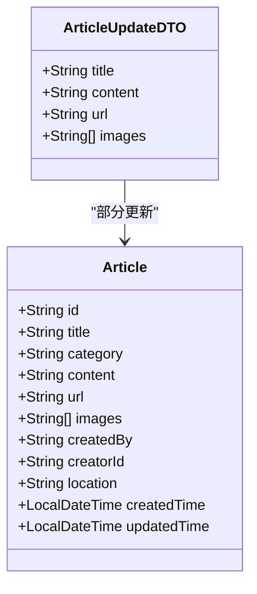
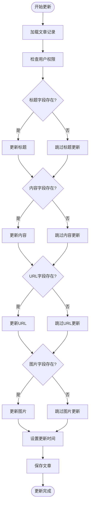
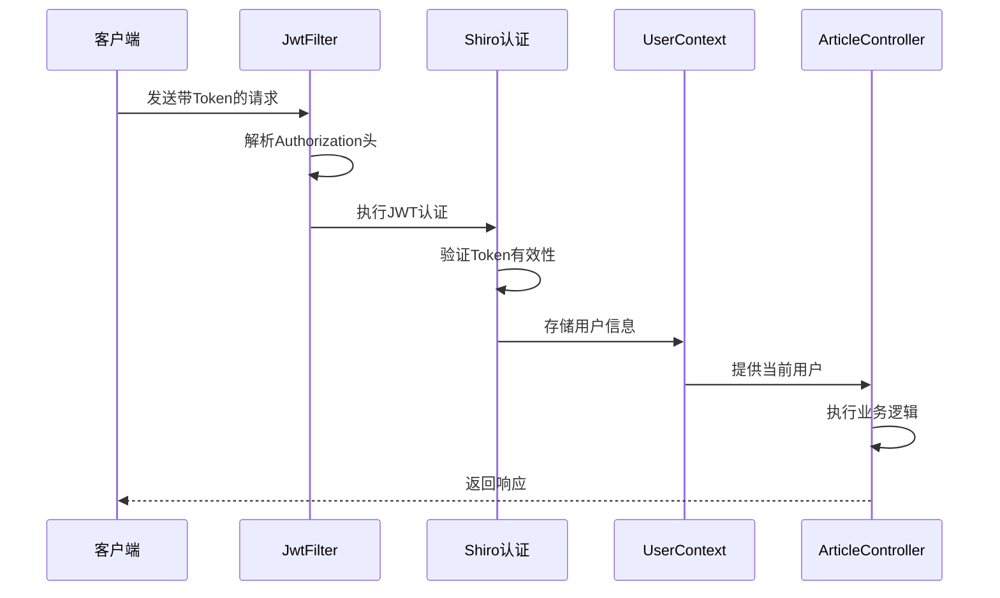
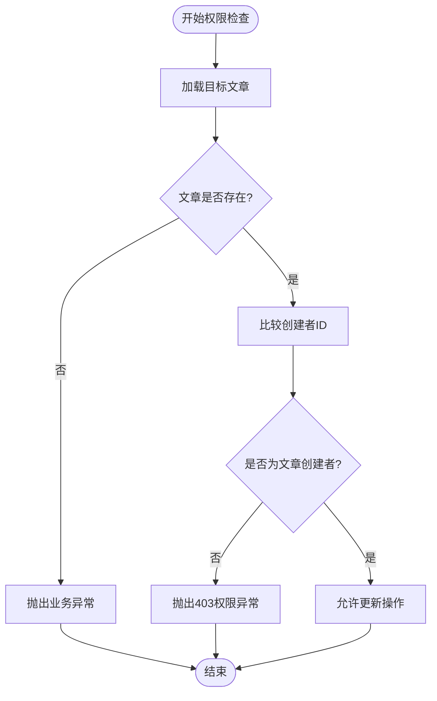
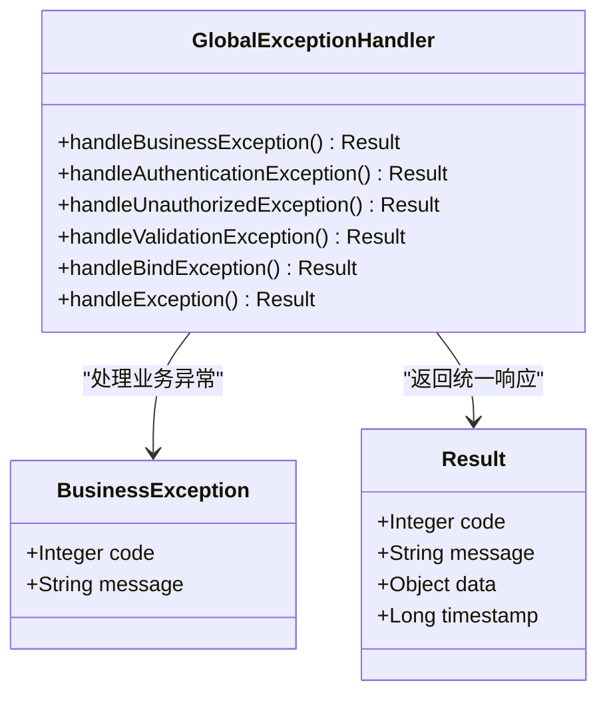

# 更新文章接口

<cite>
**本文档引用的文件**
- [ArticleController.java](file://src/main/java/com/zhishilu/controller/ArticleController.java)
- [ArticleUpdateDTO.java](file://src/main/java/com/zhishilu/dto/ArticleUpdateDTO.java)
- [Article.java](file://src/main/java/com/zhishilu/entity/Article.java)
- [ArticleService.java](file://src/main/java/com/zhishilu/service/ArticleService.java)
- [ArticleRepository.java](file://src/main/java/com/zhishilu/repository/ArticleRepository.java)
- [Result.java](file://src/main/java/com/zhishilu/common/Result.java)
- [JwtFilter.java](file://src/main/java/com/zhishilu/shiro/JwtFilter.java)
- [UserContext.java](file://src/main/java/com/zhishilu/util/UserContext.java)
- [GlobalExceptionHandler.java](file://src/main/java/com/zhishilu/exception/GlobalExceptionHandler.java)
- [BusinessException.java](file://src/main/java/com/zhishilu/exception/BusinessException.java)
- [application.yml](file://src/main/resources/application.yml)
</cite>

## 目录
1. [简介](#简介)
2. [接口规范](#接口规范)
3. [数据模型详解](#数据模型详解)
4. [权限验证机制](#权限验证机制)
5. [资源所有权检查](#资源所有权检查)
6. [异常处理策略](#异常处理策略)
7. [请求示例与响应格式](#请求示例与响应格式)
8. [性能考虑](#性能考虑)
9. [故障排除指南](#故障排除指南)
10. [总结](#总结)

## 简介

更新文章接口是文章管理系统中的核心功能之一，允许用户对已存在的文章进行部分或完全更新。该接口实现了RESTful设计原则，提供了安全、可靠的文档更新能力。

## 接口规范

### 基本信息
- **HTTP方法**: PUT
- **URL路径**: `/api/article/{id}`
- **路径参数**: `id` (字符串类型，文章唯一标识符)
- **请求头**: 
  - `Content-Type: application/json`
  - `Authorization: Bearer {token}` (JWT令牌)

### 路径参数格式要求
- **id参数**: 字符串类型，必须为有效的文章标识符
- **格式**: 支持任意非空字符串，但必须对应数据库中存在的文章记录
- **长度**: 无硬性限制，但建议使用有意义的标识符

### 请求头设置
- **Content-Type**: 必须设置为 `application/json`
- **Authorization**: 使用Bearer Token认证方式
- **自定义配置**: 可通过 `application.yml` 中的 `jwt.header` 和 `jwt.prefix` 进行配置

**章节来源**
- [ArticleController.java](file://src/main/java/com/zhishilu/controller/ArticleController.java#L42-L47)
- [application.yml](file://src/main/resources/application.yml#L26-L31)

## 数据模型详解

### ArticleUpdateDTO 数据模型

ArticleUpdateDTO 是更新文章时使用的数据传输对象，支持部分字段更新：



**图表来源**
- [ArticleUpdateDTO.java](file://src/main/java/com/zhishilu/dto/ArticleUpdateDTO.java#L11-L23)
- [Article.java](file://src/main/java/com/zhishilu/entity/Article.java#L16-L80)

### 字段详细说明

| 字段名 | 类型 | 必填 | 长度限制 | 描述 |
|--------|------|------|----------|------|
| title | String | 否 | 最大64字符 | 文章标题，支持部分更新 |
| content | String | 否 | 无限制 | 文章正文内容，支持部分更新 |
| url | String | 否 | 最大64字符 | 文章来源链接，支持部分更新 |
| images | List<String> | 否 | 无限制 | 图片路径列表，支持部分更新 |

### 部分更新机制

更新接口采用智能的部分更新策略：



**图表来源**
- [ArticleService.java](file://src/main/java/com/zhishilu/service/ArticleService.java#L64-L88)

**章节来源**
- [ArticleUpdateDTO.java](file://src/main/java/com/zhishilu/dto/ArticleUpdateDTO.java#L11-L23)
- [ArticleService.java](file://src/main/java/com/zhishilu/service/ArticleService.java#L73-L84)

## 权限验证机制

### JWT认证流程



**图表来源**
- [JwtFilter.java](file://src/main/java/com/zhishilu/shiro/JwtFilter.java#L39-L75)
- [UserContext.java](file://src/main/java/com/zhishilu/util/UserContext.java#L15-L24)

### 认证配置

- **认证头**: `Authorization`
- **Token前缀**: `Bearer `
- **密钥**: `zhishilu-secret-key-must-be-at-least-256-bits-long-for-hs256`
- **过期时间**: 24小时 (86400000毫秒)

**章节来源**
- [JwtFilter.java](file://src/main/java/com/zhishilu/shiro/JwtFilter.java#L31-L35)
- [application.yml](file://src/main/resources/application.yml#L26-L31)

## 资源所有权检查

### 权限验证逻辑

更新操作包含严格的所有权验证机制：



**图表来源**
- [ArticleService.java](file://src/main/java/com/zhishilu/service/ArticleService.java#L65-L71)

### 验证规则

1. **存在性检查**: 确保目标文章存在于数据库中
2. **所有权验证**: 比较当前用户ID与文章创建者ID
3. **权限控制**: 仅文章创建者可进行更新操作

**章节来源**
- [ArticleService.java](file://src/main/java/com/zhishilu/service/ArticleService.java#L68-L71)

## 异常处理策略

### 异常分类与处理

系统采用统一的异常处理机制：



**图表来源**
- [GlobalExceptionHandler.java](file://src/main/java/com/zhishilu/exception/GlobalExceptionHandler.java#L20-L86)
- [BusinessException.java](file://src/main/java/com/zhishilu/exception/BusinessException.java#L8-L22)

### 异常映射表

| 异常类型 | HTTP状态码 | 错误代码 | 描述 |
|----------|------------|----------|------|
| BusinessException | 500 | 自定义 | 业务逻辑异常 |
| AuthenticationException | 401 | 401 | 认证失败，需要登录 |
| UnauthorizedException | 403 | 403 | 权限不足 |
| MethodArgumentNotValidException | 400 | 400 | 参数验证失败 |
| BindException | 400 | 400 | 参数绑定失败 |
| Exception | 500 | 500 | 系统内部异常 |

**章节来源**
- [GlobalExceptionHandler.java](file://src/main/java/com/zhishilu/exception/GlobalExceptionHandler.java#L27-L85)
- [Result.java](file://src/main/java/com/zhishilu/common/Result.java#L43-L69)

## 请求示例与响应格式

### 请求示例

#### 部分字段更新
```json
{
  "title": "更新后的文章标题",
  "content": "更新后的文章内容"
}
```

#### 完整字段更新
```json
{
  "title": "更新后的文章标题",
  "content": "更新后的文章内容",
  "url": "https://example.com/article",
  "images": ["image1.jpg", "image2.png"]
}
```

### 响应格式

#### 成功响应
```json
{
  "code": 200,
  "message": "更新成功",
  "data": {
    "id": "article-id",
    "title": "更新后的文章标题",
    "category": "技术",
    "content": "更新后的文章内容",
    "url": "https://example.com/article",
    "images": ["image1.jpg", "image2.png"],
    "createdBy": "username",
    "creatorId": "user-id",
    "location": "北京",
    "createdTime": "2024-01-01T12:00:00",
    "updatedTime": "2024-01-02T14:30:00"
  },
  "timestamp": 1704205800000
}
```

#### 错误响应
```json
{
  "code": 400,
  "message": "标题长度不能超过64个字符",
  "data": null,
  "timestamp": 1704205800000
}
```

**章节来源**
- [ArticleController.java](file://src/main/java/com/zhishilu/controller/ArticleController.java#L42-L47)
- [Result.java](file://src/main/java/com/zhishilu/common/Result.java#L35-L41)

## 性能考虑

### 查询优化

1. **Elasticsearch集成**: 使用Spring Data Elasticsearch进行高性能搜索
2. **索引优化**: 文章实体配置了专门的Elasticsearch索引
3. **分页查询**: 支持高效的分页查询机制

### 缓存策略

- **ThreadLocal用户上下文**: 减少用户信息获取的开销
- **JWT令牌缓存**: 避免重复解析相同的Token

### 并发控制

- **线程安全**: UserContext使用ThreadLocal确保线程隔离
- **原子操作**: 更新操作在单事务中完成

## 故障排除指南

### 常见问题及解决方案

#### 1. 认证失败
**症状**: 返回401未授权错误
**原因**: Token缺失或无效
**解决**: 
- 确认Authorization头格式正确
- 检查Token是否过期
- 验证JWT配置是否正确

#### 2. 权限不足
**症状**: 返回403禁止访问错误
**原因**: 当前用户不是文章创建者
**解决**: 
- 确认用户身份验证
- 检查文章所有权关系
- 验证用户权限

#### 3. 参数验证失败
**症状**: 返回400参数错误
**原因**: DTO字段验证失败
**解决**: 
- 检查字段长度限制
- 确认必填字段完整性
- 验证数据类型正确性

#### 4. 文章不存在
**症状**: 返回业务异常
**原因**: 文章ID无效或已被删除
**解决**: 
- 验证文章ID的有效性
- 检查文章状态
- 确认数据库连接正常

**章节来源**
- [GlobalExceptionHandler.java](file://src/main/java/com/zhishilu/exception/GlobalExceptionHandler.java#L36-L85)
- [ArticleService.java](file://src/main/java/com/zhishilu/service/ArticleService.java#L65-L66)

## 总结

更新文章接口提供了完整、安全、高效的文档更新能力。通过JWT认证、严格的权限验证和智能的部分更新机制，确保了系统的安全性与易用性。

### 关键特性

1. **RESTful设计**: 符合HTTP标准的接口规范
2. **安全认证**: 基于JWT的无状态认证机制
3. **权限控制**: 严格的文章所有权验证
4. **灵活更新**: 支持部分字段的智能更新
5. **统一响应**: 标准化的API响应格式
6. **异常处理**: 完善的错误处理和用户反馈

### 最佳实践

- 使用部分更新减少不必要的字段变更
- 确保Authorization头的正确设置
- 验证所有输入数据的格式和长度
- 处理好异常情况下的用户体验
- 合理使用缓存机制提升性能