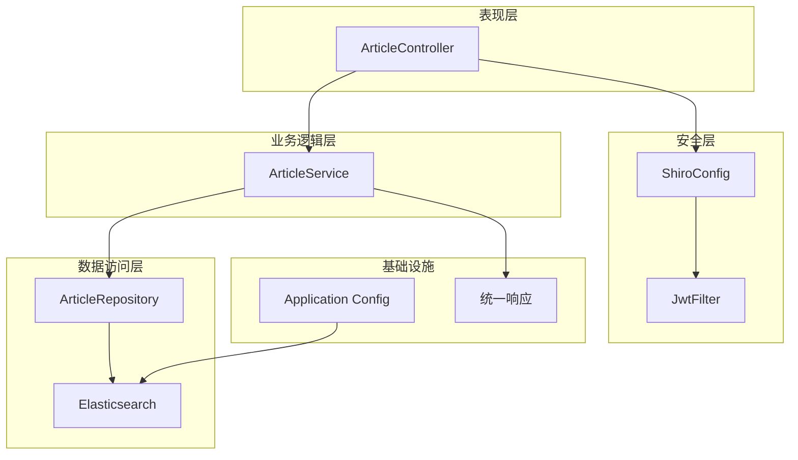
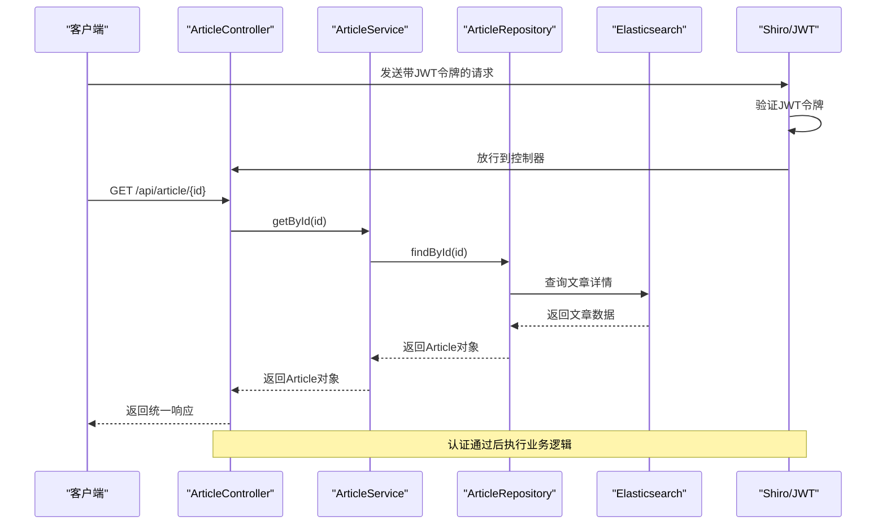
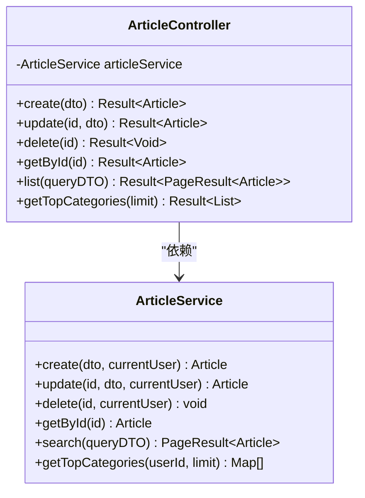
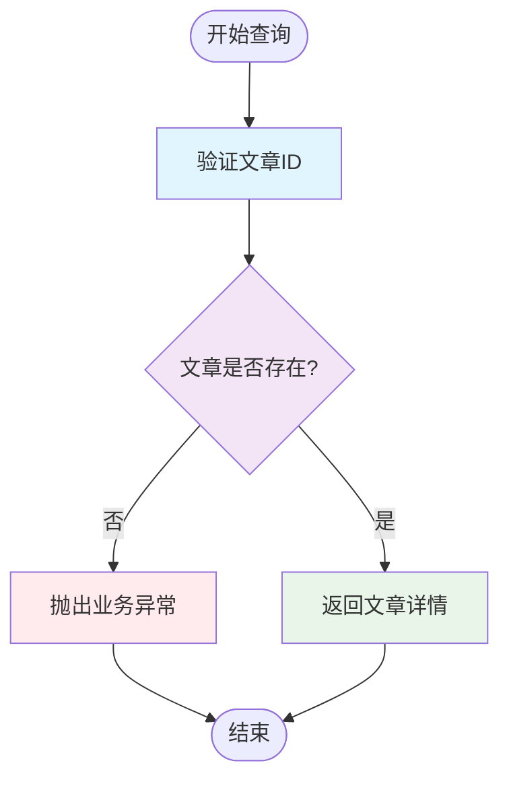
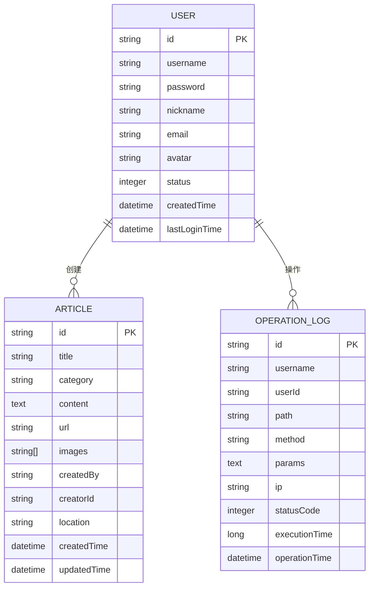
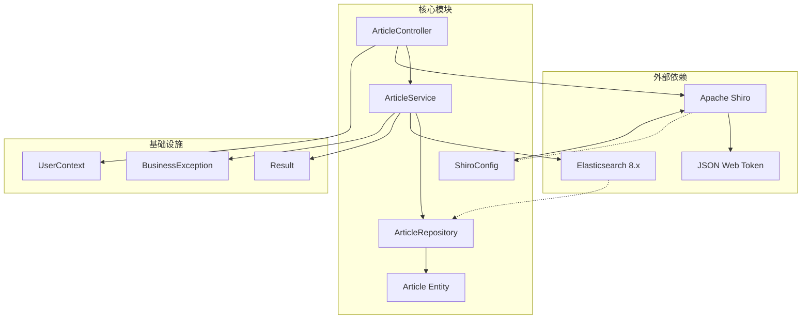
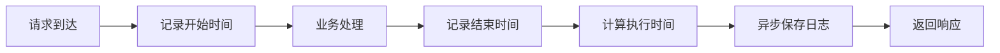
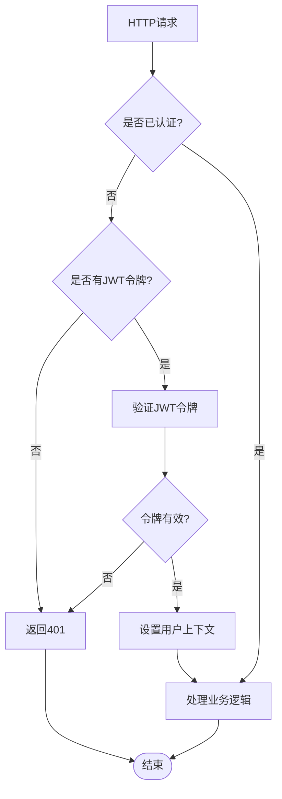

# 获取文章详情接口

<cite>
**本文档引用的文件**
- [ArticleController.java](file://src/main/java/com/zhishilu/controller/ArticleController.java)
- [ArticleService.java](file://src/main/java/com/zhishilu/service/ArticleService.java)
- [Article.java](file://src/main/java/com/zhishilu/entity/Article.java)
- [ArticleRepository.java](file://src/main/java/com/zhishilu/repository/ArticleRepository.java)
- [Result.java](file://src/main/java/com/zhishilu/common/Result.java)
- [BusinessException.java](file://src/main/java/com/zhishilu/exception/BusinessException.java)
- [JwtFilter.java](file://src/main/java/com/zhishilu/shiro/JwtFilter.java)
- [ShiroConfig.java](file://src/main/java/com/zhishilu/config/ShiroConfig.java)
- [UserContext.java](file://src/main/java/com/zhishilu/util/UserContext.java)
- [application.yml](file://src/main/resources/application.yml)
- [ElasticsearchIndexInitializer.java](file://src/main/java/com/zhishilu/config/ElasticsearchIndexInitializer.java)
</cite>

## 目录
1. [简介](#简介)
2. [项目结构](#项目结构)
3. [核心组件](#核心组件)
4. [架构概览](#架构概览)
5. [详细组件分析](#详细组件分析)
6. [依赖关系分析](#依赖关系分析)
7. [性能考虑](#性能考虑)
8. [故障排除指南](#故障排除指南)
9. [结论](#结论)

## 简介

本文档详细说明了获取文章详情接口的完整规范，包括GET /api/article/{id}接口的实现细节。该接口用于根据文章ID查询特定的文章详情，涵盖了完整的请求流程、数据验证、权限控制、异常处理以及性能优化策略。

## 项目结构

基于Spring Boot + Spring Data Elasticsearch + Apache Shiro的架构设计，系统采用分层架构模式：



**图表来源**
- [ArticleController.java](file://src/main/java/com/zhishilu/controller/ArticleController.java#L22-L87)
- [ArticleService.java](file://src/main/java/com/zhishilu/service/ArticleService.java#L34-L200)
- [ShiroConfig.java](file://src/main/java/com/zhishilu/config/ShiroConfig.java#L21-L71)

**章节来源**
- [ArticleController.java](file://src/main/java/com/zhishilu/controller/ArticleController.java#L1-L88)
- [ShiroConfig.java](file://src/main/java/com/zhishilu/config/ShiroConfig.java#L1-L72)

## 核心组件

### 接口规范

**HTTP方法**: GET  
**URL路径**: `/api/article/{id}`  
**路径参数**: `id` - 文章唯一标识符

### 路径参数格式要求

- **类型**: 字符串
- **格式**: UUID格式（32位十六进制数字，包含连字符）
- **示例**: `550e8400-e29b-41d4-a716-446655440000`
- **长度**: 36个字符（包含连字符）

### 请求示例

```bash
# 成功请求示例
curl -X GET "http://localhost:8080/api/article/550e8400-e29b-41d4-a716-446655440000" \
  -H "Authorization: Bearer YOUR_JWT_TOKEN" \
  -H "Content-Type: application/json"
```

### 响应格式

统一响应格式遵循Result<T>模式：

```json
{
  "code": 200,
  "message": "操作成功",
  "data": {
    "id": "550e8400-e29b-41d4-a716-446655440000",
    "title": "示例文章标题",
    "category": "技术",
    "content": "文章内容...",
    "url": "https://example.com",
    "images": ["image1.jpg", "image2.jpg"],
    "createdBy": "username",
    "creatorId": "user-id",
    "location": "北京",
    "createdTime": "2024-01-01T12:00:00.000",
    "updatedTime": "2024-01-01T12:00:00.000"
  },
  "timestamp": 1704067200000
}
```

**章节来源**
- [ArticleController.java](file://src/main/java/com/zhishilu/controller/ArticleController.java#L62-L66)
- [Result.java](file://src/main/java/com/zhishilu/common/Result.java#L8-L71)

## 架构概览

获取文章详情接口的完整调用流程：



**图表来源**
- [ArticleController.java](file://src/main/java/com/zhishilu/controller/ArticleController.java#L62-L66)
- [ArticleService.java](file://src/main/java/com/zhishilu/service/ArticleService.java#L108-L111)
- [JwtFilter.java](file://src/main/java/com/zhishilu/shiro/JwtFilter.java#L39-L85)

## 详细组件分析

### ArticleController - 控制器层

控制器负责处理HTTP请求和响应，提供RESTful API接口：



**图表来源**
- [ArticleController.java](file://src/main/java/com/zhishilu/controller/ArticleController.java#L22-L87)
- [ArticleService.java](file://src/main/java/com/zhishilu/service/ArticleService.java#L34-L200)

### ArticleService - 业务逻辑层

业务服务层实现了核心的业务逻辑，包括文章详情查询：

#### 查询实现逻辑



**图表来源**
- [ArticleService.java](file://src/main/java/com/zhishilu/service/ArticleService.java#L108-L111)

### Article 实体模型

Article实体类定义了文章的完整数据结构：



**图表来源**
- [Article.java](file://src/main/java/com/zhishilu/entity/Article.java#L14-L80)
- [User.java](file://src/main/java/com/zhishilu/entity/User.java#L13-L67)
- [OperationLog.java](file://src/main/java/com/zhishilu/entity/OperationLog.java#L13-L73)

### 数据库映射与索引配置

系统使用Spring Data Elasticsearch进行数据持久化：

| 字段名称 | Elasticsearch类型 | 分析器 | 索引设置 | 描述 |
|---------|-------------------|--------|----------|------|
| id | Keyword | - | 主键 | 文章唯一标识符 |
| title | Text | ik_max_word/ik_smart | 可搜索 | 文章标题 |
| category | Keyword | - | 精确匹配 | 文章分类 |
| content | Text | ik_max_word/ik_smart | 可搜索 | 文章内容 |
| url | Keyword | - | 精确匹配 | 来源链接 |
| images | Keyword | - | 数组存储 | 图片路径列表 |
| createdBy | Keyword | - | 精确匹配 | 创建者用户名 |
| creatorId | Keyword | - | 精确匹配 | 创建者ID |
| location | Keyword | - | 精确匹配 | 创建地点 |
| createdTime | Date | - | 时间排序 | 创建时间 |
| updatedTime | Date | - | 时间排序 | 更新时间 |

**章节来源**
- [Article.java](file://src/main/java/com/zhishilu/entity/Article.java#L14-L80)
- [ElasticsearchIndexInitializer.java](file://src/main/java/com/zhishilu/config/ElasticsearchIndexInitializer.java#L19-L39)

## 依赖关系分析

系统各组件之间的依赖关系：



**图表来源**
- [ArticleController.java](file://src/main/java/com/zhishilu/controller/ArticleController.java#L1-L18)
- [ArticleService.java](file://src/main/java/com/zhishilu/service/ArticleService.java#L1-L30)
- [ShiroConfig.java](file://src/main/java/com/zhishilu/config/ShiroConfig.java#L1-L72)

**章节来源**
- [ArticleController.java](file://src/main/java/com/zhishilu/controller/ArticleController.java#L1-L88)
- [ArticleService.java](file://src/main/java/com/zhishilu/service/ArticleService.java#L1-L200)

## 性能考虑

### Elasticsearch查询优化

1. **单一字段查询**: 使用findById()进行精确查询，避免复杂查询条件
2. **索引优化**: 使用Keyword类型字段进行精确匹配，提高查询性能
3. **分析器选择**: 标题和内容使用中文分词器，平衡查询精度和性能

### 缓存策略

当前实现未集成缓存层，建议的缓存策略：
- **读多写少场景**: 可考虑Redis缓存热门文章
- **缓存失效**: 基于TTL的自动过期机制
- **缓存穿透**: 对不存在的文章ID进行空值缓存

### 性能监控

系统集成了操作日志功能，可监控接口性能：



**章节来源**
- [ArticleService.java](file://src/main/java/com/zhishilu/service/ArticleService.java#L108-L111)
- [OperationLogService.java](file://src/main/java/com/zhishilu/service/OperationLogService.java#L26-L47)

## 故障排除指南

### 常见异常处理

| 异常类型 | HTTP状态码 | 错误信息 | 处理建议 |
|---------|-----------|---------|---------|
| BusinessException | 500 | 文章不存在 | 验证文章ID有效性 |
| BusinessException | 403 | 没有权限修改此文章 | 检查用户权限 |
| Shiro异常 | 401 | 未授权，请先登录 | 检查JWT令牌 |
| 参数验证 | 400 | 参数错误 | 验证请求参数格式 |

### 访问控制机制

系统采用JWT + Shiro的双重认证机制：



**图表来源**
- [JwtFilter.java](file://src/main/java/com/zhishilu/shiro/JwtFilter.java#L39-L85)
- [ShiroConfig.java](file://src/main/java/com/zhishilu/config/ShiroConfig.java#L56-L64)

### 环境配置

系统运行环境配置：

- **服务器端口**: 8080
- **上下文路径**: /api
- **Elasticsearch连接**: localhost:9200
- **JWT过期时间**: 24小时
- **文件上传限制**: 50MB

**章节来源**
- [application.yml](file://src/main/resources/application.yml#L1-L47)
- [BusinessException.java](file://src/main/java/com/zhishilu/exception/BusinessException.java#L8-L23)

## 结论

获取文章详情接口实现了清晰的分层架构设计，具有以下特点：

1. **简洁高效**: 采用单一字段查询，响应速度快
2. **安全可靠**: 集成JWT认证和权限控制
3. **易于维护**: 清晰的代码结构和统一的异常处理
4. **可扩展性**: 基于Spring Boot的模块化设计

建议后续优化方向：
- 添加缓存层提升热点数据访问性能
- 增强日志监控和性能指标收集
- 实现更细粒度的权限控制
- 添加接口限流和防刷机制