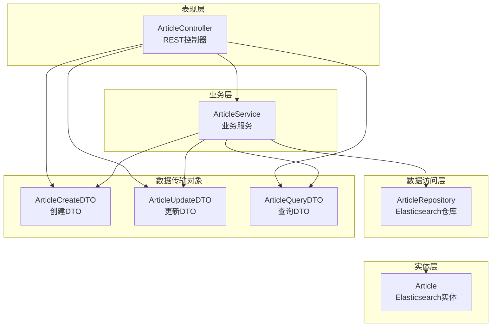
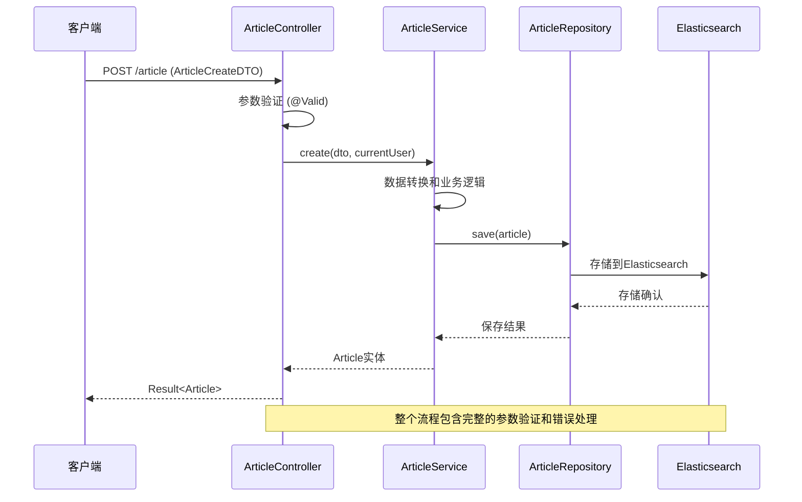
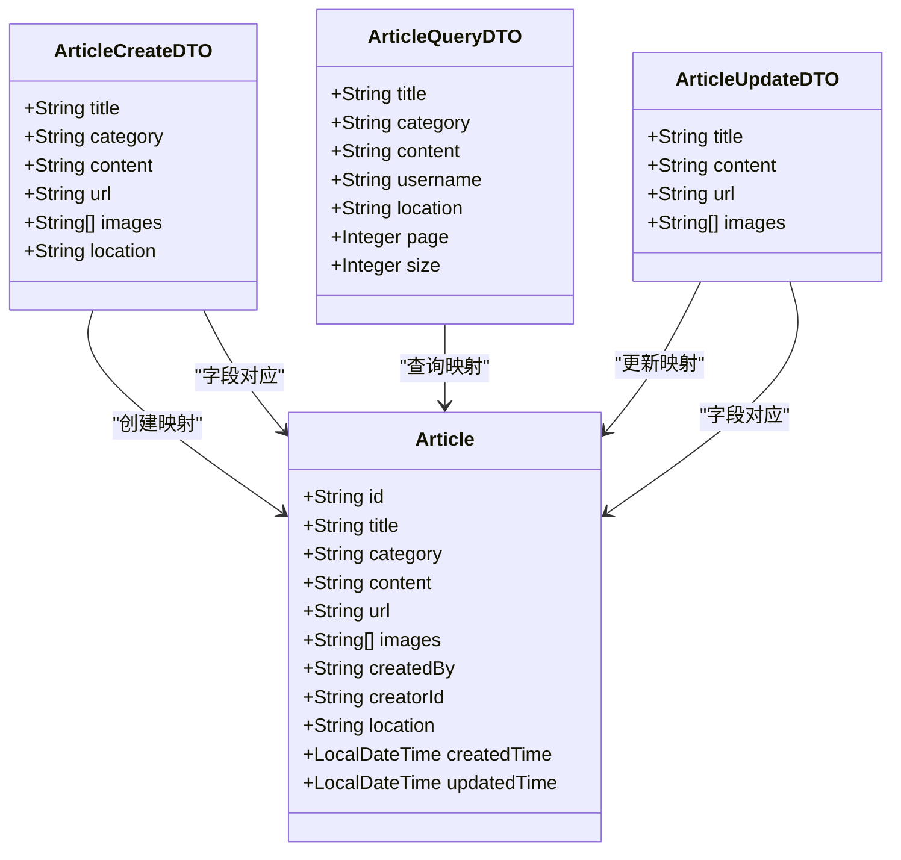
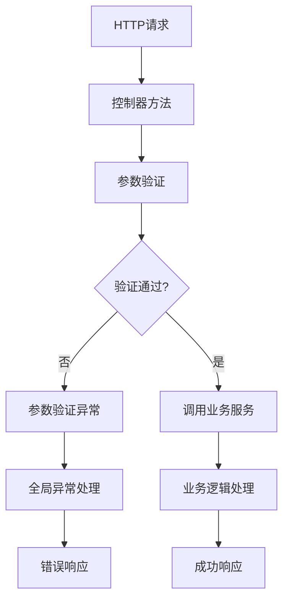
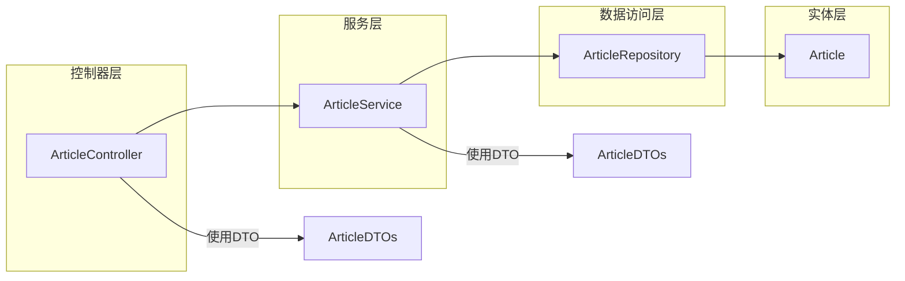
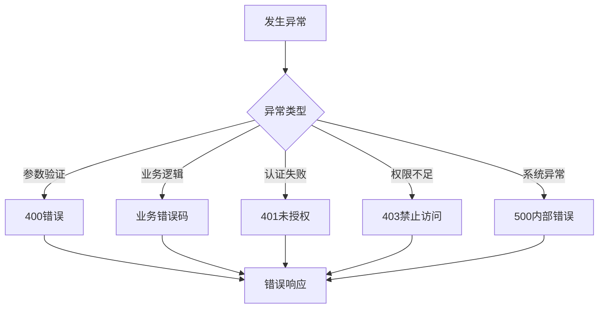

# 文章DTO数据传输对象

<cite>
**本文档引用的文件**
- [ArticleCreateDTO.java](file://src/main/java/com/zhishilu/dto/ArticleCreateDTO.java)
- [ArticleUpdateDTO.java](file://src/main/java/com/zhishilu/dto/ArticleUpdateDTO.java)
- [ArticleQueryDTO.java](file://src/main/java/com/zhishilu/dto/ArticleQueryDTO.java)
- [Article.java](file://src/main/java/com/zhishilu/entity/Article.java)
- [ArticleController.java](file://src/main/java/com/zhishilu/controller/ArticleController.java)
- [ArticleService.java](file://src/main/java/com/zhishilu/service/ArticleService.java)
- [ArticleRepository.java](file://src/main/java/com/zhishilu/repository/ArticleRepository.java)
- [GlobalExceptionHandler.java](file://src/main/java/com/zhishilu/exception/GlobalExceptionHandler.java)
- [BusinessException.java](file://src/main/java/com/zhishilu/exception/BusinessException.java)
- [application.yml](file://src/main/resources/application.yml)
</cite>

## 目录
1. [简介](#简介)
2. [项目结构](#项目结构)
3. [核心组件](#核心组件)
4. [架构概览](#架构概览)
5. [详细组件分析](#详细组件分析)
6. [依赖关系分析](#依赖关系分析)
7. [性能考虑](#性能考虑)
8. [故障排除指南](#故障排除指南)
9. [结论](#结论)

## 简介

本文档详细介绍了文章DTO数据传输对象的设计和实现，包括ArticleCreateDTO、ArticleUpdateDTO和ArticleQueryDTO三个核心数据传输对象。这些DTO对象在系统中扮演着重要的角色，负责封装HTTP请求参数、执行参数验证以及在控制器、服务层和实体之间进行数据转换。

系统采用分层架构设计，通过DTO模式实现了表现层与业务层的有效隔离，确保了数据的安全性和一致性。每个DTO都经过精心设计，既满足功能需求又保持了良好的可维护性。

## 项目结构

基于代码库的分析，项目采用标准的Spring Boot分层架构：



**图表来源**
- [ArticleController.java](file://src/main/java/com/zhishilu/controller/ArticleController.java#L22-L25)
- [ArticleService.java](file://src/main/java/com/zhishilu/service/ArticleService.java#L34-L37)
- [ArticleRepository.java](file://src/main/java/com/zhishilu/repository/ArticleRepository.java#L9-L13)
- [Article.java](file://src/main/java/com/zhishilu/entity/Article.java#L10-L16)

**章节来源**
- [ArticleController.java](file://src/main/java/com/zhishilu/controller/ArticleController.java#L1-L88)
- [ArticleService.java](file://src/main/java/com/zhishilu/service/ArticleService.java#L1-L200)

## 核心组件

### DTO设计原则

三个文章DTO对象遵循统一的设计原则：

1. **单一职责原则**：每个DTO专注于特定的操作场景
2. **验证驱动设计**：使用JSR-303注解确保数据完整性
3. **向后兼容性**：字段设计考虑未来扩展需求
4. **性能优化**：避免不必要的字段传递

### 验证注解体系

系统广泛使用JSR-303 Bean Validation注解来确保数据质量：

- **@NotBlank**：确保字符串不为空，常用于必需字段
- **@Size**：限制字符串长度，提供最大长度约束
- **@NotNull**：确保对象不为null（在相关代码中使用）

**章节来源**
- [ArticleCreateDTO.java](file://src/main/java/com/zhishilu/dto/ArticleCreateDTO.java#L3-L4)
- [ArticleUpdateDTO.java](file://src/main/java/com/zhishilu/dto/ArticleUpdateDTO.java#L3)
- [ArticleQueryDTO.java](file://src/main/java/com/zhishilu/dto/ArticleQueryDTO.java#L3)

## 架构概览

系统采用经典的MVC架构模式，结合Spring Boot的自动配置特性：



**图表来源**
- [ArticleController.java](file://src/main/java/com/zhishilu/controller/ArticleController.java#L32-L37)
- [ArticleService.java](file://src/main/java/com/zhishilu/service/ArticleService.java#L45-L59)
- [ArticleRepository.java](file://src/main/java/com/zhishilu/repository/ArticleRepository.java#L13)

**章节来源**
- [ArticleController.java](file://src/main/java/com/zhishilu/controller/ArticleController.java#L29-L37)
- [ArticleService.java](file://src/main/java/com/zhishilu/service/ArticleService.java#L42-L59)

## 详细组件分析

### ArticleCreateDTO - 文章创建DTO

ArticleCreateDTO是专门用于文章创建操作的数据传输对象，设计目标是确保创建新文章时所需的所有必要信息都被正确提供。

#### 字段定义与验证规则

| 字段 | 类型 | 验证规则 | 用途 |
|------|------|----------|------|
| title | String | @NotBlank, @Size(max=64) | 文章标题，必须提供且不超过64字符 |
| category | String | @NotBlank, @Size(max=32) | 文章类别，必须提供且不超过32字符 |
| content | String | 可选 | 文章正文内容 |
| url | String | @Size(max=64) | 来源网址，不超过64字符 |
| images | List<String> | 可选 | 图片路径列表 |
| location | String | 可选 | 创建地点 |

#### 设计特点

1. **强制验证字段**：title和category使用@NotBlank确保必填
2. **长度限制**：所有字符串字段都有明确的长度限制
3. **灵活性**：content、url、images、location字段可选，适应不同创建场景

**章节来源**
- [ArticleCreateDTO.java](file://src/main/java/com/zhishilu/dto/ArticleCreateDTO.java#L9-L31)

### ArticleUpdateDTO - 文章更新DTO

ArticleUpdateDTO专用于文章更新操作，采用选择性更新策略，只更新传入的字段。

#### 字段定义与验证规则

| 字段 | 类型 | 验证规则 | 用途 |
|------|------|----------|------|
| title | String | @Size(max=64) | 新标题，不超过64字符 |
| content | String | 可选 | 新内容 |
| url | String | @Size(max=64) | 新网址，不超过64字符 |
| images | List<String> | 可选 | 新图片列表 |

#### 更新策略

服务层实现了智能更新逻辑：
- 仅当字段非空时才进行更新
- 自动更新updatedTime字段
- 保持其他字段不变

**章节来源**
- [ArticleUpdateDTO.java](file://src/main/java/com/zhishilu/dto/ArticleUpdateDTO.java#L8-L24)
- [ArticleService.java](file://src/main/java/com/zhishilu/service/ArticleService.java#L64-L88)

### ArticleQueryDTO - 文章查询DTO

ArticleQueryDTO用于文章查询和分页操作，支持多种查询条件和排序规则。

#### 查询条件字段

| 字段 | 类型 | 默认值 | 用途 |
|------|------|--------|------|
| title | String | null | 标题模糊查询 |
| category | String | null | 类别精确查询 |
| content | String | null | 内容模糊查询 |
| username | String | null | 创建者用户名精确查询 |
| location | String | null | 地点精确查询 |
| page | Integer | 0 | 页码（从0开始） |
| size | Integer | 10 | 每页大小 |

#### 查询逻辑

服务层实现了灵活的布尔查询构建：
- 支持多条件组合查询
- 使用Elasticsearch的match和term查询
- 默认按创建时间降序排列

**章节来源**
- [ArticleQueryDTO.java](file://src/main/java/com/zhishilu/dto/ArticleQueryDTO.java#L5-L46)
- [ArticleService.java](file://src/main/java/com/zhishilu/service/ArticleService.java#L116-L168)

### 实体映射关系



**图表来源**
- [ArticleCreateDTO.java](file://src/main/java/com/zhishilu/dto/ArticleCreateDTO.java#L13-L31)
- [ArticleUpdateDTO.java](file://src/main/java/com/zhishilu/dto/ArticleUpdateDTO.java#L12-L23)
- [ArticleQueryDTO.java](file://src/main/java/com/zhishilu/dto/ArticleQueryDTO.java#L9-L45)
- [Article.java](file://src/main/java/com/zhishilu/entity/Article.java#L16-L80)

**章节来源**
- [Article.java](file://src/main/java/com/zhishilu/entity/Article.java#L10-L81)

### 参数验证机制

系统实现了完整的参数验证机制，确保数据的完整性和有效性：



**图表来源**
- [ArticleController.java](file://src/main/java/com/zhishilu/controller/ArticleController.java#L33)
- [GlobalExceptionHandler.java](file://src/main/java/com/zhishilu/exception/GlobalExceptionHandler.java#L56-L63)

**章节来源**
- [ArticleController.java](file://src/main/java/com/zhishilu/controller/ArticleController.java#L12)
- [GlobalExceptionHandler.java](file://src/main/java/com/zhishilu/exception/GlobalExceptionHandler.java#L54-L75)

## 依赖关系分析

### 控制器到服务层的依赖



**图表来源**
- [ArticleController.java](file://src/main/java/com/zhishilu/controller/ArticleController.java#L27)
- [ArticleService.java](file://src/main/java/com/zhishilu/service/ArticleService.java#L39-L40)

### 异常处理依赖关系

系统通过全局异常处理器统一处理各种异常情况：

```mermaid
graph TB
subgraph "异常类型"
VE[MethodArgumentNotValidException<br/>参数验证异常]
BE[BusinessException<br/>业务异常]
AE[AuthenticationException<br/>认证异常]
UE[UnauthorizedException<br/>授权异常]
end
subgraph "异常处理器"
GE[GlobalExceptionHandler]
end
subgraph "响应结果"
RE[Result.error()/success()]
end
VE --> GE
BE --> GE
AE --> GE
UE --> GE
GE --> RE
```

**图表来源**
- [GlobalExceptionHandler.java](file://src/main/java/com/zhishilu/exception/GlobalExceptionHandler.java#L27-L85)
- [BusinessException.java](file://src/main/java/com/zhishilu/exception/BusinessException.java#L9-L22)

**章节来源**
- [ArticleController.java](file://src/main/java/com/zhishilu/controller/ArticleController.java#L29-L75)
- [ArticleService.java](file://src/main/java/com/zhishilu/service/ArticleService.java#L93-L103)

## 性能考虑

### Elasticsearch集成优化

系统使用Elasticsearch作为搜索引擎，针对查询性能进行了专门优化：

1. **字段映射优化**：
   - title和content使用ik分词器支持中文检索
   - category、createdBy、location使用keyword类型支持精确查询
   - images使用keyword类型存储图片路径

2. **查询性能优化**：
   - 使用布尔查询组合多个条件
   - 默认按创建时间倒序排列，提高最新内容优先显示
   - 支持聚合查询获取用户常用类别

3. **连接配置优化**：
   - 连接超时设置为5秒
   - Socket超时设置为30秒
   - 单分片单副本配置简化部署

**章节来源**
- [Article.java](file://src/main/java/com/zhishilu/entity/Article.java#L24-L79)
- [application.yml](file://src/main/resources/application.yml#L13-L18)

### 缓存和性能监控

系统具备以下性能监控能力：
- 详细的日志记录，便于性能分析
- Elasticsearch查询日志输出
- 请求耗时统计和监控

## 故障排除指南

### 常见验证错误及解决方案

| 错误类型 | 触发条件 | 解决方案 |
|----------|----------|----------|
| 标题为空 | 提交空标题或仅包含空白字符 | 确保标题字段非空且去除首尾空白 |
| 类别过长 | 类别长度超过32字符 | 缩短类别名称至32字符以内 |
| 标题过长 | 标题长度超过64字符 | 缩短标题至64字符以内 |
| 网址过长 | URL长度超过64字符 | 简化URL或使用短链接 |
| 权限不足 | 非文章创建者尝试修改 | 确保当前用户是文章创建者 |

### 异常处理流程



**图表来源**
- [GlobalExceptionHandler.java](file://src/main/java/com/zhishilu/exception/GlobalExceptionHandler.java#L27-L85)

**章节来源**
- [GlobalExceptionHandler.java](file://src/main/java/com/zhishilu/exception/GlobalExceptionHandler.java#L24-L85)
- [BusinessException.java](file://src/main/java/com/zhishilu/exception/BusinessException.java#L13-L21)

### 调试建议

1. **启用详细日志**：检查application.yml中的日志级别配置
2. **验证Elasticsearch连接**：确认连接URI、凭据和超时设置
3. **测试参数格式**：使用Postman或curl验证JSON格式正确性
4. **检查用户上下文**：确保JWT令牌有效且用户已登录

## 结论

文章DTO数据传输对象系统展现了良好的软件工程实践，具有以下显著特点：

1. **清晰的职责分离**：三个DTO各司其职，避免了功能混叠
2. **完善的验证机制**：基于JSR-303的参数验证确保数据质量
3. **优雅的错误处理**：全局异常处理器提供一致的错误响应
4. **高性能的搜索实现**：Elasticsearch集成提供了优秀的查询性能
5. **可维护的架构设计**：分层架构便于功能扩展和代码维护

该系统为类似的内容管理应用场景提供了优秀的参考实现，特别是在中文文本处理、权限控制和搜索优化方面积累了宝贵经验。通过合理的DTO设计和严格的验证机制，系统在保证功能完整性的同时，也确保了良好的用户体验和系统的稳定性。