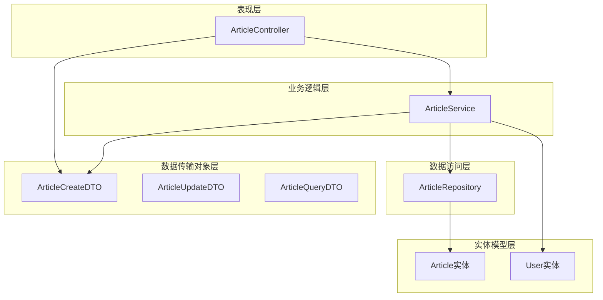
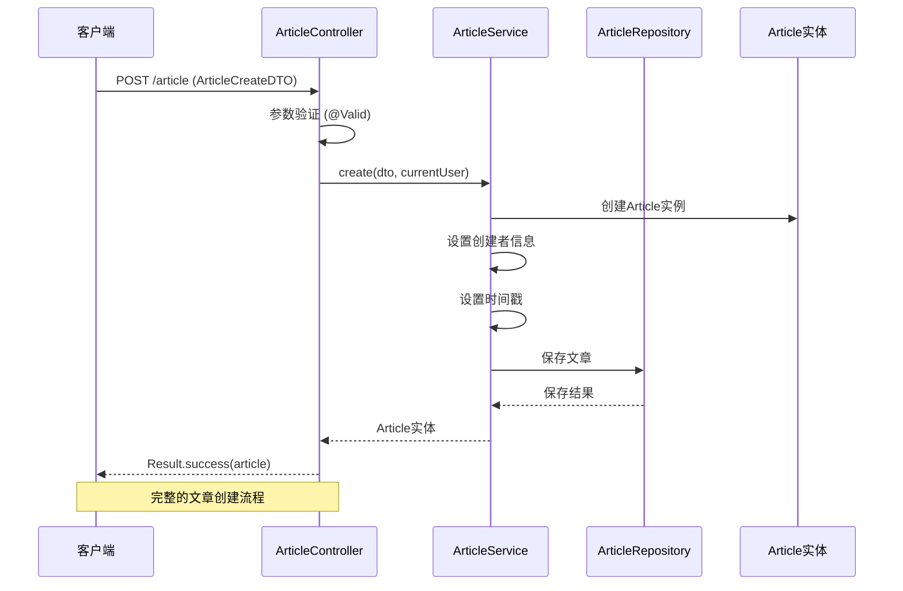
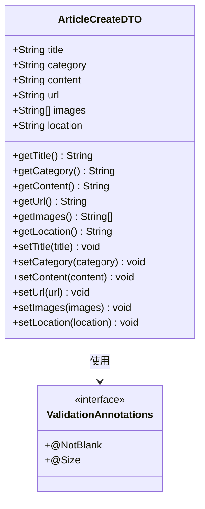
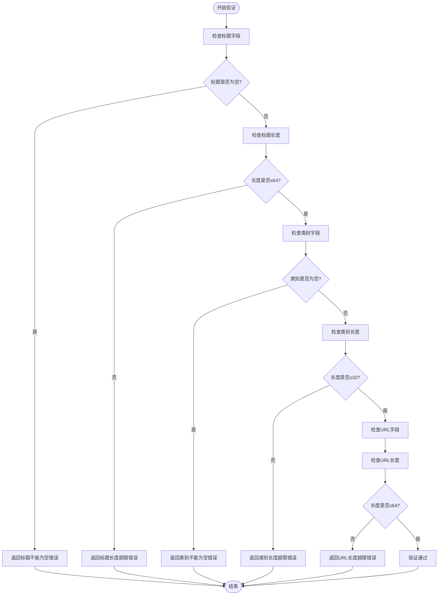
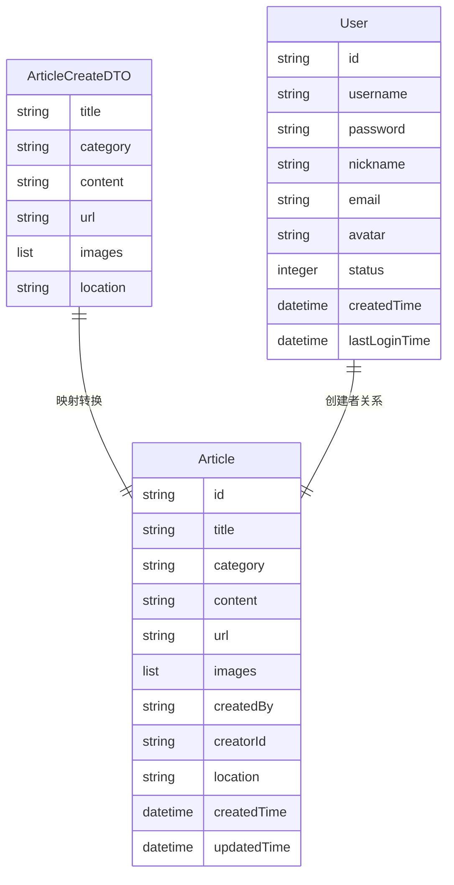
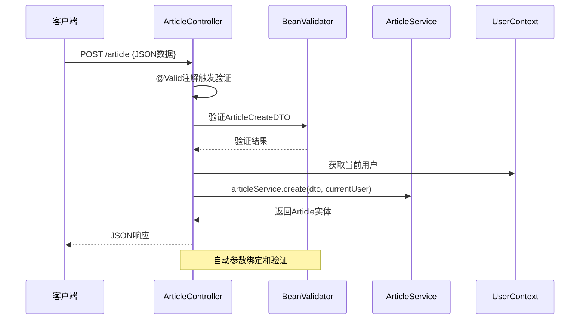
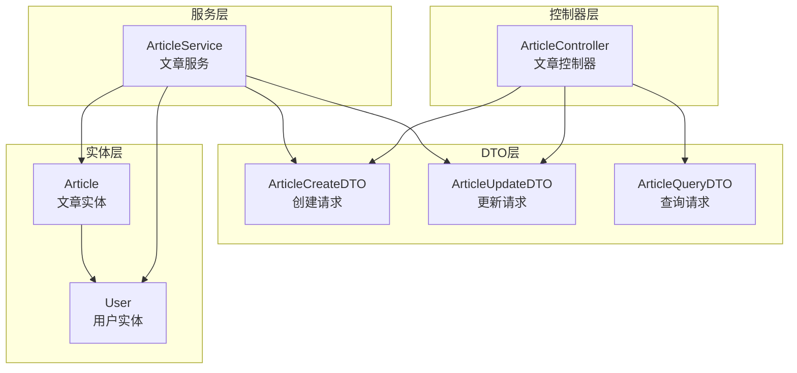

# 文章创建DTO

<cite>
**本文档引用的文件**
- [ArticleCreateDTO.java](file://src/main/java/com/zhishilu/dto/ArticleCreateDTO.java)
- [Article.java](file://src/main/java/com/zhishilu/entity/Article.java)
- [ArticleController.java](file://src/main/java/com/zhishilu/controller/ArticleController.java)
- [ArticleService.java](file://src/main/java/com/zhishilu/service/ArticleService.java)
- [ArticleQueryDTO.java](file://src/main/java/com/zhishilu/dto/ArticleQueryDTO.java)
- [ArticleUpdateDTO.java](file://src/main/java/com/zhishilu/dto/ArticleUpdateDTO.java)
- [User.java](file://src/main/java/com/zhishilu/entity/User.java)
</cite>

## 目录
1. [简介](#简介)
2. [项目结构](#项目结构)
3. [核心组件](#核心组件)
4. [架构概览](#架构概览)
5. [详细组件分析](#详细组件分析)
6. [依赖关系分析](#依赖关系分析)
7. [性能考虑](#性能考虑)
8. [故障排除指南](#故障排除指南)
9. [结论](#结论)

## 简介

本文档详细介绍了文章创建DTO（数据传输对象）的设计和实现。ArticleCreateDTO是系统中用于处理文章创建请求的核心数据结构，它负责接收前端传入的文章信息，并通过验证规则确保数据的有效性和完整性。该DTO在文章创建流程中扮演着关键角色，连接了前端界面、控制器层、服务层和数据持久化层。

## 项目结构

系统采用典型的分层架构设计，主要包含以下层次：

**图表来源**
- [ArticleController.java](file://src/main/java/com/zhishilu/controller/ArticleController.java#L22-L25)
- [ArticleService.java](file://src/main/java/com/zhishilu/service/ArticleService.java#L34-L37)
- [ArticleCreateDTO.java](file://src/main/java/com/zhishilu/dto/ArticleCreateDTO.java#L9-L12)

**章节来源**
- [ArticleController.java](file://src/main/java/com/zhishilu/controller/ArticleController.java#L1-L88)
- [ArticleService.java](file://src/main/java/com/zhishilu/service/ArticleService.java#L1-L200)

## 核心组件

### ArticleCreateDTO类概述

ArticleCreateDTO是一个专门用于文章创建的数据传输对象，采用了Lombok的@Data注解自动生成getter、setter、toString等方法，简化了代码编写。

**章节来源**
- [ArticleCreateDTO.java](file://src/main/java/com/zhishilu/dto/ArticleCreateDTO.java#L1-L32)

### 字段定义与验证规则

#### 标题字段（title）
- **类型**: String
- **验证规则**: 
  - @NotBlank: 确保标题不能为空
  - @Size(max = 64): 限制标题长度不超过64个字符
- **用途**: 存储文章的标题信息
- **验证场景**: 必填字段验证，长度限制验证

#### 类别字段（category）
- **类型**: String
- **验证规则**:
  - @NotBlank: 确保类别不能为空
  - @Size(max = 32): 限制类别长度不超过32个字符
- **用途**: 标识文章的分类或标签
- **验证场景**: 必填字段验证，长度限制验证

#### 内容字段（content）
- **类型**: String
- **验证规则**: 无显式验证注解
- **用途**: 存储文章的正文内容
- **验证场景**: 可选字段，允许为空

#### 网址字段（url）
- **类型**: String
- **验证规则**:
  - @Size(max = 64): 限制网址长度不超过64个字符
- **用途**: 存储文章的来源链接
- **验证场景**: 长度限制验证

#### 图片字段（images）
- **类型**: List<String>
- **验证规则**: 无显式验证注解
- **用途**: 存储文章关联的图片URL列表
- **验证场景**: 可选字段，允许为空

#### 位置字段（location）
- **类型**: String
- **验证规则**: 无显式验证注解
- **用途**: 存储文章创建时的位置信息
- **验证场景**: 可选字段，允许为空

**章节来源**
- [ArticleCreateDTO.java](file://src/main/java/com/zhishilu/dto/ArticleCreateDTO.java#L15-L31)

## 架构概览

文章创建流程展示了完整的MVC架构实现：

**图表来源**
- [ArticleController.java](file://src/main/java/com/zhishilu/controller/ArticleController.java#L32-L37)
- [ArticleService.java](file://src/main/java/com/zhishilu/service/ArticleService.java#L45-L59)

**章节来源**
- [ArticleController.java](file://src/main/java/com/zhishilu/controller/ArticleController.java#L29-L37)
- [ArticleService.java](file://src/main/java/com/zhishilu/service/ArticleService.java#L45-L59)

## 详细组件分析

### ArticleCreateDTO类结构分析

**图表来源**
- [ArticleCreateDTO.java](file://src/main/java/com/zhishilu/dto/ArticleCreateDTO.java#L13-L31)

#### 字段验证机制

每个字段都采用了相应的验证注解来确保数据质量：

**图表来源**
- [ArticleCreateDTO.java](file://src/main/java/com/zhishilu/dto/ArticleCreateDTO.java#L15-L26)

**章节来源**
- [ArticleCreateDTO.java](file://src/main/java/com/zhishilu/dto/ArticleCreateDTO.java#L1-L32)

### 数据转换与映射关系

ArticleService在创建文章时负责将DTO转换为实体对象：

**图表来源**
- [ArticleService.java](file://src/main/java/com/zhishilu/service/ArticleService.java#L45-L59)
- [Article.java](file://src/main/java/com/zhishilu/entity/Article.java#L16-L80)

#### 转换过程详解

在ArticleService.create()方法中，数据转换过程如下：

1. **创建新实体**: 初始化新的Article实例
2. **直接映射**: 将DTO中的对应字段直接赋值给实体
3. **设置元数据**: 添加创建者信息、时间戳等系统字段
4. **保存持久化**: 通过Repository保存到数据库

**章节来源**
- [ArticleService.java](file://src/main/java/com/zhishilu/service/ArticleService.java#L45-L59)

### 控制器集成与参数绑定

ArticleController通过Spring MVC框架集成DTO：

**图表来源**
- [ArticleController.java](file://src/main/java/com/zhishilu/controller/ArticleController.java#L32-L37)

**章节来源**
- [ArticleController.java](file://src/main/java/com/zhishilu/controller/ArticleController.java#L29-L37)

## 依赖关系分析

### DTO体系结构

系统采用了完整的DTO模式，包含三种不同的数据传输对象：

**图表来源**
- [ArticleCreateDTO.java](file://src/main/java/com/zhishilu/dto/ArticleCreateDTO.java#L1-L32)
- [ArticleUpdateDTO.java](file://src/main/java/com/zhishilu/dto/ArticleUpdateDTO.java#L1-L24)
- [ArticleQueryDTO.java](file://src/main/java/com/zhishilu/dto/ArticleQueryDTO.java#L1-L46)

### 验证注解使用场景

不同DTO中验证注解的使用体现了不同的业务需求：

| 字段 | ArticleCreateDTO | ArticleUpdateDTO | 验证场景 |
|------|------------------|------------------|----------|
| title | @NotBlank, @Size(64) | @Size(64) | 必填+长度限制 |
| category | @NotBlank, @Size(32) | 无 | 必填+长度限制 |
| content | 无 | 无 | 可选字段 |
| url | @Size(64) | @Size(64) | 长度限制 |
| images | 无 | 无 | 可选字段 |

**章节来源**
- [ArticleCreateDTO.java](file://src/main/java/com/zhishilu/dto/ArticleCreateDTO.java#L15-L26)
- [ArticleUpdateDTO.java](file://src/main/java/com/zhishilu/dto/ArticleUpdateDTO.java#L14-L22)

## 性能考虑

### 验证性能优化

1. **延迟验证**: Spring Validation采用延迟加载机制，只在需要时进行验证
2. **批处理验证**: 对于批量操作，可以考虑使用分组验证减少重复验证开销
3. **缓存策略**: 对于频繁使用的验证规则，可以考虑缓存验证结果

### 数据传输优化

1. **字段选择**: 只传输必要的字段，避免不必要的数据传输
2. **序列化优化**: 使用合适的JSON序列化库，优化大数据量的传输效率
3. **压缩传输**: 对于大文本内容，可以考虑启用HTTP压缩

## 故障排除指南

### 常见验证错误

| 错误类型 | 触发条件 | 解决方案 |
|----------|----------|----------|
| 标题为空 | title字段为空 | 确保提供非空的标题字符串 |
| 标题过长 | 标题长度>64 | 缩短标题至64字符以内 |
| 类别为空 | category字段为空 | 提供有效的类别标识符 |
| 类别过长 | 类别长度>32 | 缩短类别名称至32字符以内 |
| URL过长 | URL长度>64 | 确保URL地址不超过64字符 |

### 调试技巧

1. **启用详细日志**: 在开发环境中启用Spring Validation的详细日志输出
2. **单元测试**: 为每个验证规则编写单元测试，确保验证逻辑正确
3. **边界测试**: 测试各种边界情况，如最大长度、特殊字符等

**章节来源**
- [ArticleCreateDTO.java](file://src/main/java/com/zhishilu/dto/ArticleCreateDTO.java#L15-L26)

## 结论

ArticleCreateDTO作为文章创建流程的核心数据传输对象，通过精心设计的验证规则和清晰的字段定义，确保了数据的完整性和一致性。其在系统架构中的重要作用体现在：

1. **数据验证**: 通过多种验证注解确保输入数据的有效性
2. **数据转换**: 作为DTO与实体之间的桥梁，实现数据的无缝转换
3. **业务隔离**: 将业务逻辑与数据传输分离，提高代码的可维护性
4. **扩展性**: 支持未来功能的扩展和修改

该设计体现了良好的软件工程实践，为后续的功能扩展和维护奠定了坚实的基础。