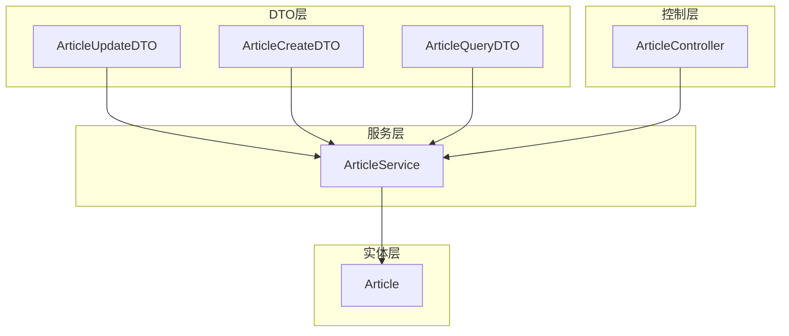
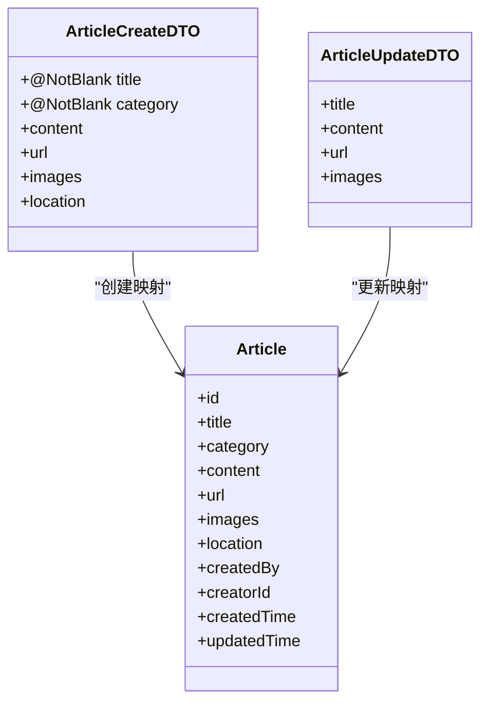
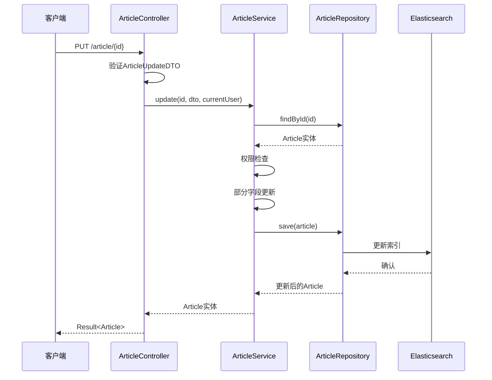
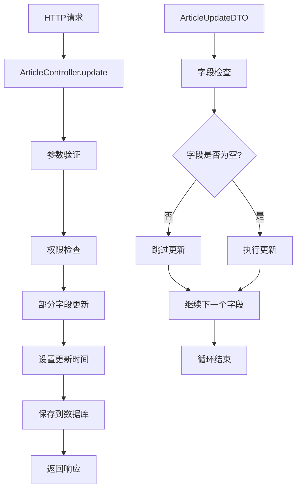
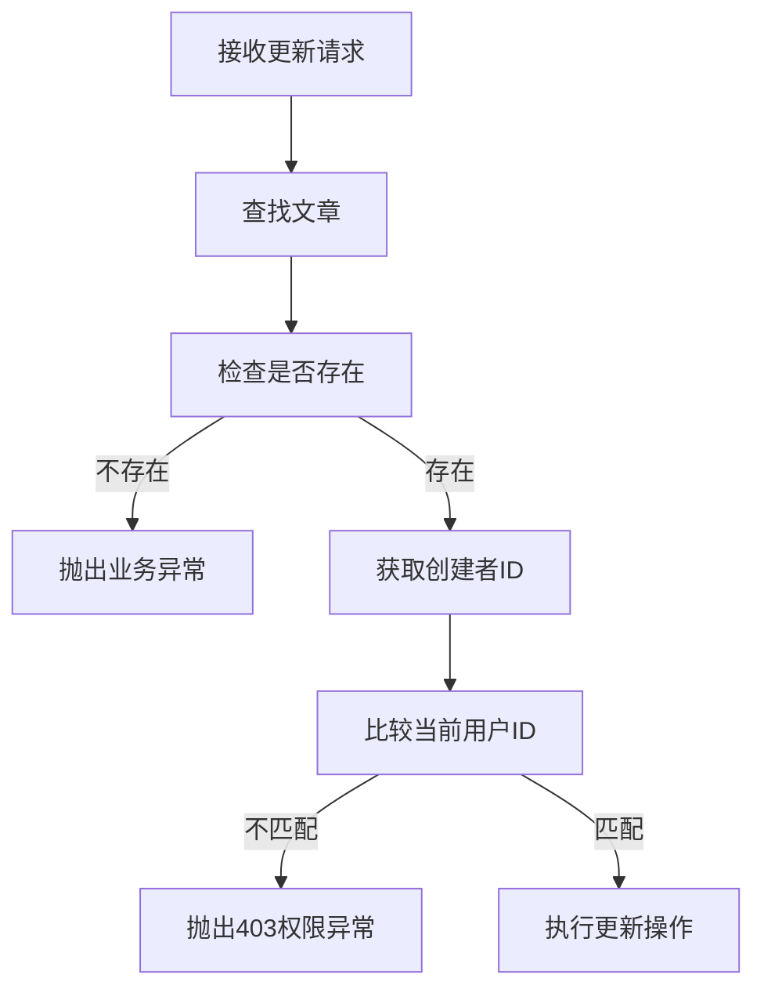
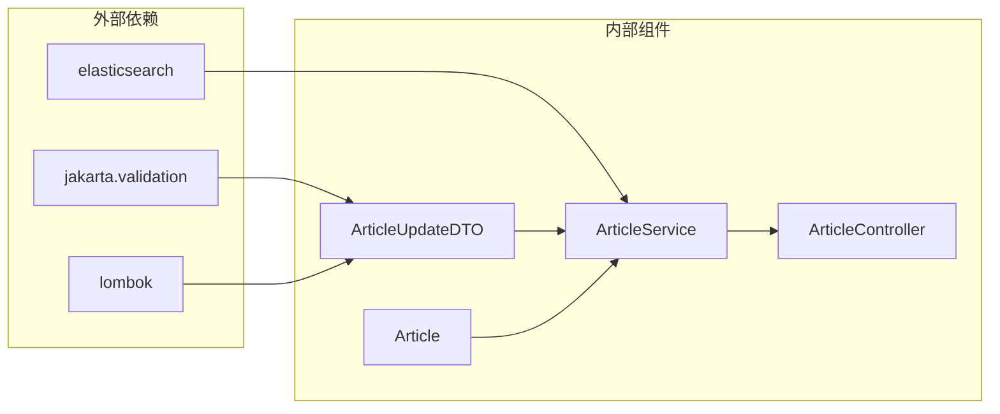

# 文章更新DTO

<cite>
**本文档引用的文件**
- [ArticleUpdateDTO.java](file://src/main/java/com/zhishilu/dto/ArticleUpdateDTO.java)
- [ArticleCreateDTO.java](file://src/main/java/com/zhishilu/dto/ArticleCreateDTO.java)
- [Article.java](file://src/main/java/com/zhishilu/entity/Article.java)
- [ArticleService.java](file://src/main/java/com/zhishilu/service/ArticleService.java)
- [ArticleController.java](file://src/main/java/com/zhishilu/controller/ArticleController.java)
- [application.yml](file://src/main/resources/application.yml)
</cite>

## 目录
1. [简介](#简介)
2. [项目结构](#项目结构)
3. [核心组件](#核心组件)
4. [架构概览](#架构概览)
5. [详细组件分析](#详细组件分析)
6. [依赖关系分析](#依赖关系分析)
7. [性能考虑](#性能考虑)
8. [故障排除指南](#故障排除指南)
9. [结论](#结论)

## 简介

本文档详细介绍了文章更新DTO（Data Transfer Object）的设计和实现。ArticleUpdateDTO是系统中专门用于处理文章更新操作的数据传输对象，它继承了Spring Validation框架的验证注解，确保数据的完整性和有效性。该DTO设计的核心目的是为文章更新操作提供标准化的数据结构，支持部分更新和全量更新两种模式。

与文章创建DTO相比，更新DTO具有不同的验证规则和字段要求，体现了RESTful API中PATCH和PUT方法的不同语义。更新DTO专注于允许客户端选择性地更新文章的部分字段，而创建DTO则要求所有必需字段都必须提供。

## 项目结构

系统采用标准的分层架构设计，ArticleUpdateDTO位于DTO层，负责数据传输和验证。整个项目结构清晰地分离了关注点，便于维护和扩展。



**图表来源**
- [ArticleUpdateDTO.java](file://src/main/java/com/zhishilu/dto/ArticleUpdateDTO.java#L1-L24)
- [ArticleCreateDTO.java](file://src/main/java/com/zhishilu/dto/ArticleCreateDTO.java#L1-L32)
- [ArticleService.java](file://src/main/java/com/zhishilu/service/ArticleService.java#L1-L200)
- [ArticleController.java](file://src/main/java/com/zhishilu/controller/ArticleController.java#L1-L88)

**章节来源**
- [ArticleUpdateDTO.java](file://src/main/java/com/zhishilu/dto/ArticleUpdateDTO.java#L1-L24)
- [ArticleCreateDTO.java](file://src/main/java/com/zhishilu/dto/ArticleCreateDTO.java#L1-L32)
- [ArticleService.java](file://src/main/java/com/zhishilu/service/ArticleService.java#L1-L200)

## 核心组件

### ArticleUpdateDTO类设计

ArticleUpdateDTO是一个轻量级的数据传输对象，专门用于文章更新操作。该类采用了Lombok的@Data注解，自动生成getter、setter、toString等方法，减少了样板代码的编写。

#### 设计目的
- 提供标准化的文章更新数据结构
- 支持部分更新和全量更新操作
- 集成Spring Validation进行数据验证
- 统一API接口的数据格式

#### 字段定义对比

| 字段 | 类型 | 必填性 | 验证规则 | 描述 |
|------|------|--------|----------|------|
| title | String | 可选 | @Size(max=64) | 文章标题，最大64字符 |
| content | String | 可选 | 无 | 文章正文内容 |
| url | String | 可选 | @Size(max=64) | 文章来源URL，最大64字符 |
| images | List<String> | 可选 | 无 | 图片URL列表 |

**章节来源**
- [ArticleUpdateDTO.java](file://src/main/java/com/zhishilu/dto/ArticleUpdateDTO.java#L11-L23)

### 与创建DTO的区别

通过对比ArticleUpdateDTO和ArticleCreateDTO，可以清楚地看到两者在设计上的差异：



**图表来源**
- [ArticleCreateDTO.java](file://src/main/java/com/zhishilu/dto/ArticleCreateDTO.java#L12-L31)
- [ArticleUpdateDTO.java](file://src/main/java/com/zhishilu/dto/ArticleUpdateDTO.java#L12-L23)
- [Article.java](file://src/main/java/com/zhishilu/entity/Article.java#L16-L80)

**章节来源**
- [ArticleCreateDTO.java](file://src/main/java/com/zhishilu/dto/ArticleCreateDTO.java#L12-L31)
- [ArticleUpdateDTO.java](file://src/main/java/com/zhishilu/dto/ArticleUpdateDTO.java#L12-L23)

## 架构概览

文章更新操作遵循标准的MVC架构模式，从HTTP请求到数据库持久化的完整流程如下：



**图表来源**
- [ArticleController.java](file://src/main/java/com/zhishilu/controller/ArticleController.java#L42-L47)
- [ArticleService.java](file://src/main/java/com/zhishilu/service/ArticleService.java#L64-L88)

**章节来源**
- [ArticleController.java](file://src/main/java/com/zhishilu/controller/ArticleController.java#L42-L47)
- [ArticleService.java](file://src/main/java/com/zhishilu/service/ArticleService.java#L64-L88)

## 详细组件分析

### 验证注解详解

ArticleUpdateDTO集成了Spring Validation框架的验证注解，确保数据的有效性：

#### @Size注解
- **标题验证**：`@Size(max = 64)` 确保标题不超过64个字符
- **URL验证**：`@Size(max = 64)` 确保URL不超过64个字符

#### 验证规则说明
- 所有字段都是可选的，支持部分更新
- 字符串字段如果提供，会进行长度限制验证
- 列表字段不进行长度限制，但元素类型必须为String

### 数据流转和转换机制

文章更新操作的数据流转过程体现了良好的分层设计：



**图表来源**
- [ArticleService.java](file://src/main/java/com/zhishilu/service/ArticleService.java#L73-L84)

**章节来源**
- [ArticleService.java](file://src/main/java/com/zhishilu/service/ArticleService.java#L64-L88)

### 部分更新与全量更新处理

ArticleService.update方法实现了智能的部分更新逻辑：

#### 部分更新逻辑
- 标题：仅当提供非空标题时才更新
- 内容：仅当提供非null内容时才更新  
- URL：仅当提供非null URL时才更新
- 图片：仅当提供非null图片列表时才更新

#### 全量更新逻辑
当客户端需要全量更新时，只需在请求体中包含所有需要更新的字段：
```json
{
  "title": "更新后的标题",
  "content": "更新后的内容",
  "url": "https://example.com",
  "images": ["image1.jpg", "image2.jpg"]
}
```

**章节来源**
- [ArticleService.java](file://src/main/java/com/zhishilu/service/ArticleService.java#L73-L84)

### 权限控制机制

系统实现了严格的权限控制，确保只有文章创建者才能修改文章：



**图表来源**
- [ArticleService.java](file://src/main/java/com/zhishilu/service/ArticleService.java#L65-L71)

**章节来源**
- [ArticleService.java](file://src/main/java/com/zhishilu/service/ArticleService.java#L65-L71)

## 依赖关系分析

### 组件耦合度分析

ArticleUpdateDTO与其他组件的依赖关系体现了松耦合的设计原则：



**图表来源**
- [ArticleUpdateDTO.java](file://src/main/java/com/zhishilu/dto/ArticleUpdateDTO.java#L3-L4)
- [ArticleService.java](file://src/main/java/com/zhishilu/service/ArticleService.java#L1-L30)

### 外部依赖管理

系统使用Maven管理依赖，主要依赖包括：
- Spring Boot Starter Web：提供Web开发功能
- Spring Data Elasticsearch：提供Elasticsearch集成
- Lombok：简化Java代码生成
- Jakarta Validation：提供Bean验证功能

**章节来源**
- [application.yml](file://src/main/resources/application.yml#L1-L47)

## 性能考虑

### 更新操作优化

ArticleService.update方法在设计时考虑了性能优化：

- **条件更新**：只对提供的字段进行更新，避免不必要的数据库写操作
- **批量操作**：单次请求可以更新多个字段，减少网络往返
- **权限检查**：在数据库操作之前进行权限验证，避免无效的数据库查询

### 缓存策略

虽然当前实现没有显式的缓存机制，但可以通过以下方式优化：
- 对于频繁更新的字段，可以考虑添加Redis缓存
- 对于热点文章，可以实现本地缓存减少数据库访问

## 故障排除指南

### 常见问题及解决方案

#### 验证失败错误
当ArticleUpdateDTO中的字段不符合验证规则时，会抛出相应的验证异常：
- 标题过长：检查标题长度是否超过64个字符
- URL过长：检查URL长度是否超过64个字符

#### 权限不足错误
当非文章创建者尝试更新文章时，会收到403 Forbidden错误：
- 确认当前登录用户是否为文章创建者
- 检查用户认证状态

#### 文章不存在错误
当更新不存在的文章时，会收到"文章不存在"的业务异常：
- 确认文章ID是否正确
- 检查文章是否已被删除

**章节来源**
- [ArticleService.java](file://src/main/java/com/zhishilu/service/ArticleService.java#L65-L71)

## 结论

ArticleUpdateDTO作为文章更新操作的核心数据传输对象，体现了现代Web应用的最佳实践。其设计特点包括：

1. **简洁性**：只包含必要的字段，避免冗余数据
2. **灵活性**：支持部分更新，满足不同业务场景需求
3. **安全性**：集成权限控制和数据验证
4. **可维护性**：采用标准的分层架构设计

通过合理的验证规则和权限控制，ArticleUpdateDTO确保了数据的完整性和系统的安全性。同时，其部分更新机制提供了灵活的操作方式，既支持精确的字段更新，也支持批量的全量更新。

该设计为后续的功能扩展奠定了良好的基础，如需要添加新的字段或验证规则，可以在不影响现有功能的前提下进行扩展。