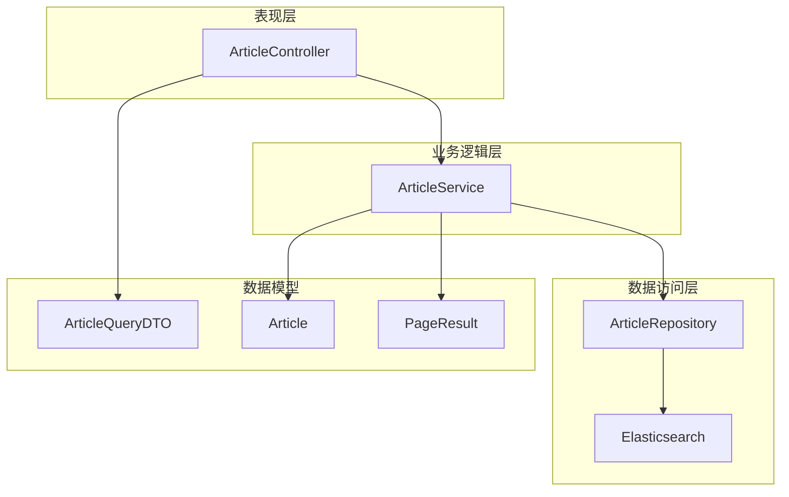
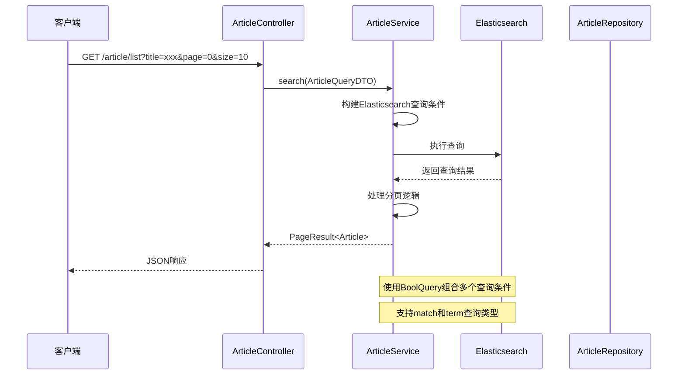
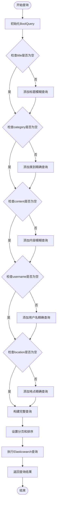
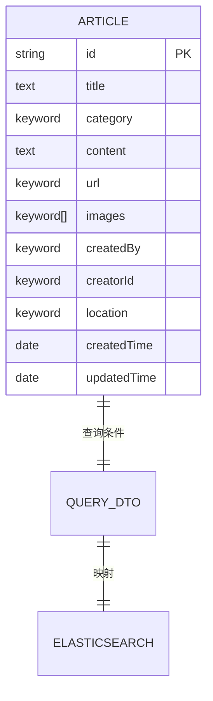
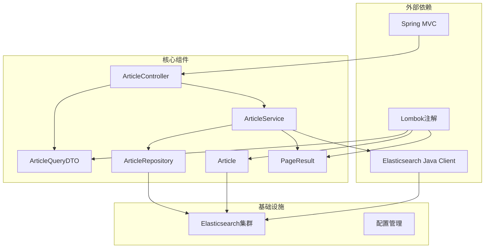
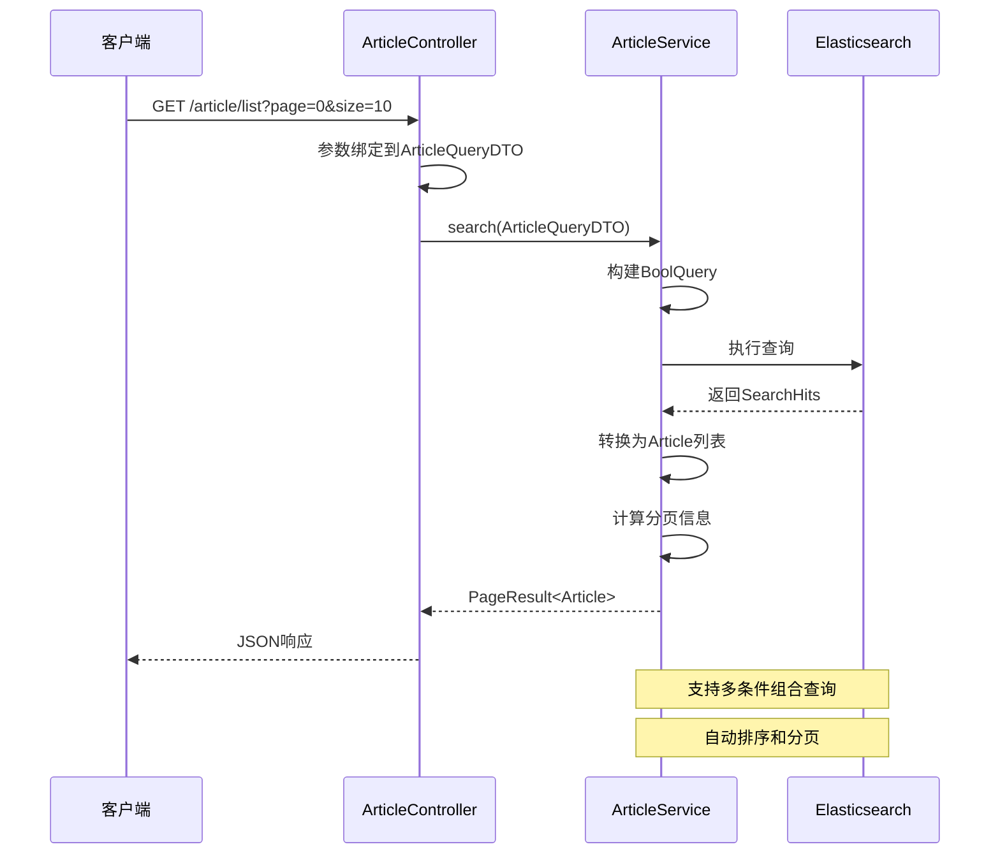

# 文章查询DTO

<cite>
**本文档引用的文件**
- [ArticleQueryDTO.java](file://src/main/java/com/zhishilu/dto/ArticleQueryDTO.java)
- [ArticleController.java](file://src/main/java/com/zhishilu/controller/ArticleController.java)
- [ArticleService.java](file://src/main/java/com/zhishilu/service/ArticleService.java)
- [ArticleRepository.java](file://src/main/java/com/zhishilu/repository/ArticleRepository.java)
- [Article.java](file://src/main/java/com/zhishilu/entity/Article.java)
- [PageResult.java](file://src/main/java/com/zhishilu/common/PageResult.java)
- [ElasticsearchIndexInitializer.java](file://src/main/java/com/zhishilu/config/ElasticsearchIndexInitializer.java)
- [README.md](file://README.md)
</cite>

## 目录
1. [简介](#简介)
2. [项目结构](#项目结构)
3. [核心组件](#核心组件)
4. [架构概览](#架构概览)
5. [详细组件分析](#详细组件分析)
6. [依赖关系分析](#依赖关系分析)
7. [性能考虑](#性能考虑)
8. [故障排除指南](#故障排除指南)
9. [结论](#结论)

## 简介

本文档详细介绍了知拾录系统中的文章查询DTO（Data Transfer Object）设计。ArticleQueryDTO是用于封装文章查询条件的数据传输对象，支持多种查询模式，包括模糊查询、精确查询和分页查询功能。该DTO通过Spring MVC与ArticleController集成，最终调用ArticleService进行Elasticsearch查询操作。

## 项目结构

知拾录系统采用标准的Spring Boot三层架构设计，主要包含以下模块：



**图表来源**
- [ArticleController.java](file://src/main/java/com/zhishilu/controller/ArticleController.java#L22-L88)
- [ArticleService.java](file://src/main/java/com/zhishilu/service/ArticleService.java#L34-L200)
- [ArticleRepository.java](file://src/main/java/com/zhishilu/repository/ArticleRepository.java#L9-L30)

**章节来源**
- [README.md](file://README.md#L1-L133)

## 核心组件

### ArticleQueryDTO类设计

ArticleQueryDTO是专门设计用于文章查询的DTO类，具有以下特点：

#### 设计目的
- 提供统一的文章查询条件封装
- 支持多种查询模式（模糊查询、精确查询）
- 集成分页查询功能
- 与Elasticsearch查询无缝对接

#### 字段定义

| 字段名 | 类型 | 默认值 | 查询模式 | 用途 |
|--------|------|--------|----------|------|
| title | String | null | 模糊查询 | 文章标题搜索 |
| category | String | null | 精确查询 | 文章类别过滤 |
| content | String | null | 模糊查询 | 文章内容全文检索 |
| username | String | null | 精确查询 | 创建者用户名过滤 |
| location | String | null | 精确查询 | 创建地点过滤 |
| page | Integer | 0 | 分页查询 | 当前页码 |
| size | Integer | 10 | 分页查询 | 每页记录数 |

**章节来源**
- [ArticleQueryDTO.java](file://src/main/java/com/zhishilu/dto/ArticleQueryDTO.java#L5-L46)

## 架构概览

文章查询系统的整体架构采用经典的MVC模式，结合Elasticsearch实现高性能的全文检索功能：



**图表来源**
- [ArticleController.java](file://src/main/java/com/zhishilu/controller/ArticleController.java#L68-L75)
- [ArticleService.java](file://src/main/java/com/zhishilu/service/ArticleService.java#L113-L168)

## 详细组件分析

### ArticleQueryDTO字段详解

#### 标题查询（title）
- **查询模式**: 模糊查询（Match Query）
- **实现原理**: 使用Elasticsearch的match查询对title字段进行全文匹配
- **应用场景**: 支持部分关键词匹配，提高搜索灵活性
- **性能特点**: 利用IK分词器进行中文分词处理

#### 类别查询（category）
- **查询模式**: 精确查询（Term Query）
- **实现原理**: 使用Elasticsearch的term查询对category字段进行精确匹配
- **应用场景**: 按类别筛选文章，支持多类别组合查询
- **性能特点**: 性能优异，适合高基数字段

#### 内容查询（content）
- **查询模式**: 模糊查询（Match Query）
- **实现原理**: 对文章正文内容进行全文检索
- **应用场景**: 支持关键词搜索，实现内容发现功能
- **性能特点**: 结合IK分词器，支持中文语义理解

#### 用户名查询（username）
- **查询模式**: 精确查询（Term Query）
- **实现原理**: 查询特定用户的创建内容
- **应用场景**: 个人内容管理，用户内容筛选
- **字段映射**: 映射到Elasticsearch的createdBy字段

#### 地点查询（location）
- **查询模式**: 精确查询（Term Query）
- **实现原理**: 按创建地点筛选文章
- **应用场景**: 地理位置相关内容管理
- **字段映射**: 直接映射到location字段

#### 分页参数
- **page**: 当前页码，默认0（第一页）
- **size**: 每页记录数，默认10条
- **排序规则**: 按createdTime降序排列

**章节来源**
- [ArticleQueryDTO.java](file://src/main/java/com/zhishilu/dto/ArticleQueryDTO.java#L11-L44)

### 查询条件构建流程



**图表来源**
- [ArticleService.java](file://src/main/java/com/zhishilu/service/ArticleService.java#L116-L158)

### Elasticsearch映射关系

#### 字段映射表

| DTO字段 | Elasticsearch字段 | 查询类型 | 分析器 |
|---------|-------------------|----------|--------|
| title | title | match | ik_max_word/ik_smart |
| category | category | term | keyword |
| content | content | match | ik_max_word/ik_smart |
| username | createdBy | term | keyword |
| location | location | term | keyword |

#### 索引配置



**图表来源**
- [Article.java](file://src/main/java/com/zhishilu/entity/Article.java#L14-L80)
- [ArticleQueryDTO.java](file://src/main/java/com/zhishilu/dto/ArticleQueryDTO.java#L9-L45)

**章节来源**
- [Article.java](file://src/main/java/com/zhishilu/entity/Article.java#L24-L67)

### 分页查询实现

#### PageResult类设计

PageResult作为分页查询的结果封装类，提供了完整的分页信息：

| 属性名 | 类型 | 描述 |
|--------|------|------|
| content | List<T> | 查询结果列表 |
| page | Integer | 当前页码 |
| size | Integer | 每页大小 |
| total | Long | 总记录数 |
| totalPages | Integer | 总页数 |

#### 分页算法

```mermaid
flowchart TD
Input[输入: content, page, size, total] --> CalcPages[计算总页数]
CalcPages --> TotalPages[totalPages = ceil(total/size)]
TotalPages --> BuildResult[构建PageResult对象]
BuildResult --> Output[输出分页结果]
```

**图表来源**
- [PageResult.java](file://src/main/java/com/zhishilu/common/PageResult.java#L42-L50)

**章节来源**
- [PageResult.java](file://src/main/java/com/zhishilu/common/PageResult.java#L9-L52)

## 依赖关系分析

### 组件依赖图



**图表来源**
- [ArticleController.java](file://src/main/java/com/zhishilu/controller/ArticleController.java#L1-L88)
- [ArticleService.java](file://src/main/java/com/zhishilu/service/ArticleService.java#L1-L200)
- [ArticleRepository.java](file://src/main/java/com/zhishilu/repository/ArticleRepository.java#L1-L30)

### 查询流程时序图



**图表来源**
- [ArticleController.java](file://src/main/java/com/zhishilu/controller/ArticleController.java#L71-L75)
- [ArticleService.java](file://src/main/java/com/zhishilu/service/ArticleService.java#L116-L168)

**章节来源**
- [ArticleController.java](file://src/main/java/com/zhishilu/controller/ArticleController.java#L68-L75)
- [ArticleService.java](file://src/main/java/com/zhishilu/service/ArticleService.java#L113-L168)

## 性能考虑

### 查询优化策略

#### 1. 查询条件优化
- **条件选择性**: 优先使用选择性高的条件（如category、location）
- **查询类型选择**: 精确匹配使用term，模糊匹配使用match
- **组合查询**: 使用BoolQuery组合多个条件，提高查询效率

#### 2. 分页性能优化
- **合理设置page和size**: 避免过大的page值导致内存压力
- **限制查询范围**: 通过时间范围等条件限制查询结果集
- **索引优化**: 为高频查询字段建立合适的索引

#### 3. Elasticsearch配置优化
- **分片和副本**: 根据数据量调整shards和replicas
- **分析器配置**: 使用适合中文的IK分词器
- **缓存策略**: 合理配置查询缓存和字段数据缓存

#### 4. 应用层优化
- **批量查询**: 支持批量查询减少网络开销
- **结果缓存**: 对热门查询结果进行缓存
- **连接池管理**: 合理配置Elasticsearch连接池

### 性能监控指标

| 指标类型 | 监控目标 | 优化建议 |
|----------|----------|----------|
| 查询延迟 | <100ms | 优化查询条件，增加索引 |
| 查询吞吐量 | >1000 QPS | 使用连接池，优化查询逻辑 |
| 内存使用 | <50% | 合理设置分页大小，避免大数据量查询 |
| CPU使用率 | <80% | 优化复杂查询，使用更高效的查询类型 |

## 故障排除指南

### 常见问题及解决方案

#### 1. 查询无结果
**可能原因**:
- 查询条件过于严格
- 字段映射不正确
- Elasticsearch索引未创建

**解决方法**:
- 检查字段映射关系
- 验证Elasticsearch索引状态
- 调整查询条件宽松度

#### 2. 性能问题
**可能原因**:
- 查询条件组合不当
- 分页参数过大
- 缺少必要的索引

**解决方法**:
- 优化查询条件顺序
- 调整分页大小
- 添加复合索引

#### 3. 字符编码问题
**可能原因**:
- 中文分词器配置错误
- 字符编码不一致

**解决方法**:
- 检查IK分词器配置
- 确保UTF-8编码

### 调试技巧

#### 1. 开启查询日志
```java
// 在application.yml中添加
logging:
  level:
    org.springframework.data.elasticsearch: DEBUG
```

#### 2. 查询条件验证
```java
// 在ArticleService中添加调试信息
log.debug("执行查询条件: {}", queryDTO);
log.debug("生成的Elasticsearch查询: {}", query.toString());
```

#### 3. 性能监控
- 监控查询延迟和吞吐量
- 分析慢查询日志
- 定期检查索引状态

**章节来源**
- [ElasticsearchIndexInitializer.java](file://src/main/java/com/zhishilu/config/ElasticsearchIndexInitializer.java#L23-L38)

## 结论

ArticleQueryDTO作为知拾录系统的核心查询组件，通过精心设计的字段结构和查询逻辑，实现了灵活而高效的全文检索功能。其主要优势包括：

1. **设计简洁**: 字段定义清晰，易于理解和使用
2. **功能完整**: 支持多种查询模式和分页功能
3. **性能优秀**: 通过合理的Elasticsearch配置和查询优化
4. **扩展性强**: 易于添加新的查询条件和功能

该DTO为后续的功能扩展奠定了良好的基础，能够满足个人知识管理系统的多样化查询需求。通过合理的性能优化和监控机制，可以确保系统在高并发场景下的稳定运行。