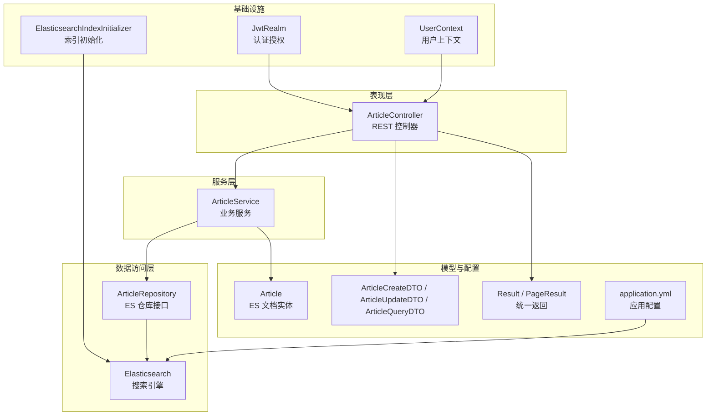
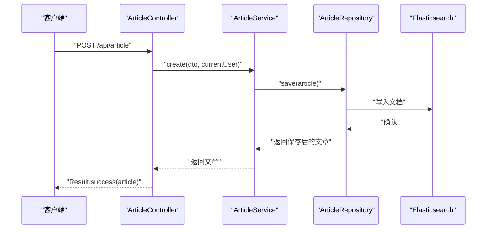
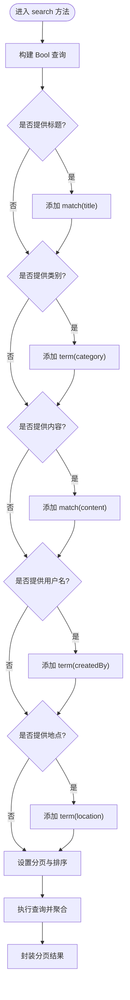
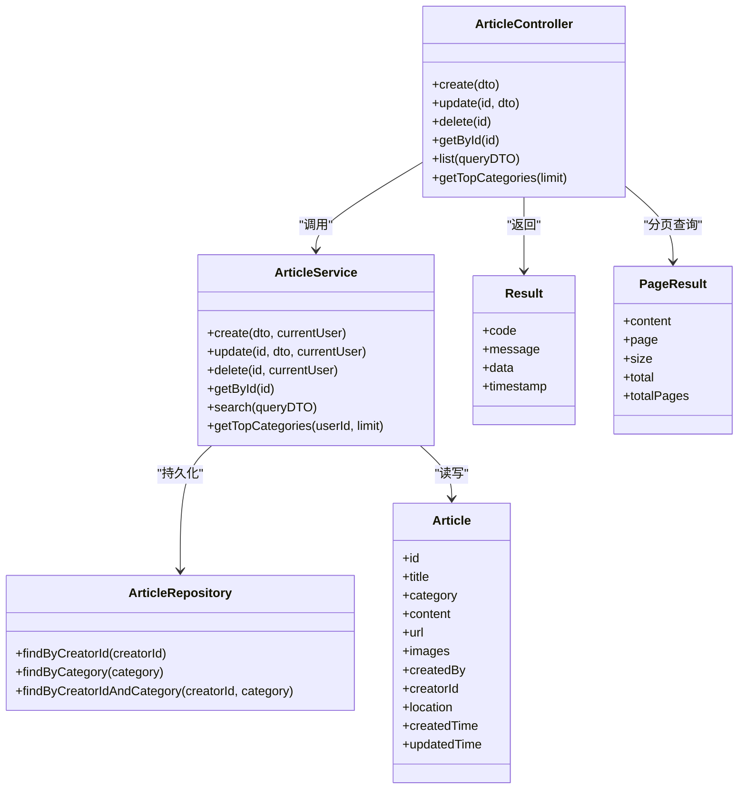

# 文章内容管理

<cite>
**本文引用的文件**
- [主启动类](file://src/main/java/com/zhishilu/ZhishiluApplication.java)
- [文章实体](file://src/main/java/com/zhishilu/entity/Article.java)
- [文章服务](file://src/main/java/com/zhishilu/service/ArticleService.java)
- [文章控制器](file://src/main/java/com/zhishilu/controller/ArticleController.java)
- [文章仓库](file://src/main/java/com/zhishilu/repository/ArticleRepository.java)
- [文章创建DTO](file://src/main/java/com/zhishilu/dto/ArticleCreateDTO.java)
- [文章更新DTO](file://src/main/java/com/zhishilu/dto/ArticleUpdateDTO.java)
- [文章查询DTO](file://src/main/java/com/zhishilu/dto/ArticleQueryDTO.java)
- [分页结果](file://src/main/java/com/zhishilu/common/PageResult.java)
- [统一返回结果](file://src/main/java/com/zhishilu/common/Result.java)
- [应用配置](file://src/main/resources/application.yml)
- [ES索引初始化器](file://src/main/java/com/zhishilu/config/ElasticsearchIndexInitializer.java)
- [JWT Realm](file://src/main/java/com/zhishilu/shiro/JwtRealm.java)
- [用户上下文](file://src/main/java/com/zhishilu/util/UserContext.java)
- [项目说明](file://README.md)
</cite>

## 目录
1. [简介](#简介)
2. [项目结构](#项目结构)
3. [核心组件](#核心组件)
4. [架构总览](#架构总览)
5. [详细组件分析](#详细组件分析)
6. [依赖关系分析](#依赖关系分析)
7. [性能考虑](#性能考虑)
8. [故障排查指南](#故障排查指南)
9. [结论](#结论)
10. [附录](#附录)

## 简介
本项目是“知拾录——个人知识收藏管理系统”，围绕文章内容的增删改查、全文检索、分类统计与权限控制展开。系统采用 Spring Boot + Elasticsearch + Apache Shiro + JWT 的技术栈，使用 Lombok 简化实体与 DTO 定义，通过统一返回包装与分页封装提升接口一致性。

## 项目结构
项目按领域与层次组织，主要模块如下：
- common：统一返回与分页封装
- config：ES索引初始化、Shiro、Web配置
- controller：REST API 控制器
- service：业务服务层
- repository：基于 Spring Data Elasticsearch 的仓库接口
- entity：ES 文档实体
- dto：请求/查询参数对象
- shiro：认证授权组件
- util：工具类（JWT、用户上下文）
- resources：应用配置

图表来源
- [文章控制器](file://src/main/java/com/zhishilu/controller/ArticleController.java#L1-L88)
- [文章服务](file://src/main/java/com/zhishilu/service/ArticleService.java#L1-L200)
- [文章仓库](file://src/main/java/com/zhishilu/repository/ArticleRepository.java#L1-L30)
- [ES索引初始化器](file://src/main/java/com/zhishilu/config/ElasticsearchIndexInitializer.java#L1-L40)
- [JWT Realm](file://src/main/java/com/zhishilu/shiro/JwtRealm.java#L1-L71)
- [用户上下文](file://src/main/java/com/zhishilu/util/UserContext.java#L1-L33)
- [文章实体](file://src/main/java/com/zhishilu/entity/Article.java#L1-L81)
- [应用配置](file://src/main/resources/application.yml#L1-L47)

章节来源
- [主启动类](file://src/main/java/com/zhishilu/ZhishiluApplication.java#L1-L16)
- [项目说明](file://README.md#L1-L133)

## 核心组件
- 文章实体：定义文章在 Elasticsearch 中的映射与字段含义，含标题、类别、正文、URL、图片路径、创建者信息、地点与时间戳等。
- 文章服务：实现创建、更新、删除、查询、分类统计等业务逻辑，包含权限校验与全文检索。
- 文章控制器：暴露 REST API，负责参数接收、调用服务与统一返回。
- 仓库接口：基于 Spring Data Elasticsearch 提供基础 CRUD 与组合查询方法。
- DTO：约束输入参数，保证数据合法性。
- 统一返回与分页：封装标准响应结构与分页信息。
- 配置：ES 连接、Shiro/JWT、文件上传、日志级别等。

章节来源
- [文章实体](file://src/main/java/com/zhishilu/entity/Article.java#L1-L81)
- [文章服务](file://src/main/java/com/zhishilu/service/ArticleService.java#L1-L200)
- [文章控制器](file://src/main/java/com/zhishilu/controller/ArticleController.java#L1-L88)
- [文章仓库](file://src/main/java/com/zhishilu/repository/ArticleRepository.java#L1-L30)
- [文章创建DTO](file://src/main/java/com/zhishilu/dto/ArticleCreateDTO.java#L1-L32)
- [文章更新DTO](file://src/main/java/com/zhishilu/dto/ArticleUpdateDTO.java#L1-L24)
- [文章查询DTO](file://src/main/java/com/zhishilu/dto/ArticleQueryDTO.java#L1-L46)
- [分页结果](file://src/main/java/com/zhishilu/common/PageResult.java#L1-L52)
- [统一返回结果](file://src/main/java/com/zhishilu/common/Result.java#L1-L71)
- [应用配置](file://src/main/resources/application.yml#L1-L47)

## 架构总览
系统采用经典的分层架构：
- 表现层：REST 控制器接收请求，进行参数校验与权限拦截。
- 业务层：服务层实现核心业务，包括全文检索、权限校验、聚合统计。
- 数据访问层：基于 Spring Data Elasticsearch 与原生客户端查询。
- 基础设施：ES 索引初始化、Shiro/JWT 认证授权、用户上下文传递。

图表来源
- [文章控制器](file://src/main/java/com/zhishilu/controller/ArticleController.java#L32-L37)
- [文章服务](file://src/main/java/com/zhishilu/service/ArticleService.java#L45-L59)
- [文章仓库](file://src/main/java/com/zhishilu/repository/ArticleRepository.java#L13-L13)

## 详细组件分析

### 文章实体模型设计
- 索引名称：zhishilu_article
- 字段设计与约束：
  - 标题：文本类型，使用中文分词器；最大长度限制
  - 类别：关键字类型，用于精确匹配
  - 正文：文本类型，支持全文检索
  - URL：关键字类型，最大长度限制
  - 图片路径：关键字数组，存储本地文件路径
  - 创建者用户名/ID：关键字类型，用于权限控制与统计
  - 地点：关键字类型
  - 时间：日期类型，包含时分秒与毫秒
- 业务规则：
  - 创建/更新时自动填充时间戳
  - 创建时记录创建者信息
  - 权限控制：仅创建者可修改/删除

章节来源
- [文章实体](file://src/main/java/com/zhishilu/entity/Article.java#L14-L79)

### 文章服务层实现
- 创建文章：组装实体，填充创建者与时间，持久化到 ES
- 更新文章：权限校验（仅创建者），部分字段更新，更新时间
- 删除文章：权限校验，删除文档
- 查询文章：支持标题/正文模糊匹配、类别/用户名/地点精确匹配，分页排序
- 分类统计：基于聚合统计用户最常用类别（默认前10）

图表来源
- [文章服务](file://src/main/java/com/zhishilu/service/ArticleService.java#L116-L168)
- [ES索引初始化器](file://src/main/java/com/zhishilu/config/ElasticsearchIndexInitializer.java#L24-L38)

章节来源
- [文章服务](file://src/main/java/com/zhishilu/service/ArticleService.java#L45-L198)

### 文章控制器与REST API
- 路径前缀：/api/article
- 接口一览：
  - POST /api/article：创建文章
  - PUT /api/article/{id}：更新文章
  - DELETE /api/article/{id}：删除文章
  - GET /api/article/{id}：获取文章详情
  - GET /api/article/list：分页查询文章
  - GET /api/article/categories/top：获取常用类别（默认前10）
- 参数与响应：
  - 请求参数通过 DTO 校验，失败返回统一错误
  - 成功响应使用统一 Result 包装，查询场景使用 PageResult 分页
- 权限控制：
  - 通过 Shiro + JWT 进行认证
  - 更新/删除接口校验创建者身份

章节来源
- [文章控制器](file://src/main/java/com/zhishilu/controller/ArticleController.java#L32-L86)
- [统一返回结果](file://src/main/java/com/zhishilu/common/Result.java#L20-L70)
- [分页结果](file://src/main/java/com/zhishilu/common/PageResult.java#L42-L50)
- [JWT Realm](file://src/main/java/com/zhishilu/shiro/JwtRealm.java#L44-L69)
- [用户上下文](file://src/main/java/com/zhishilu/util/UserContext.java#L15-L24)

### DTO 与验证规则
- 创建 DTO：
  - 标题：非空，最大64字符
  - 类别：非空，最大32字符
  - URL：最大64字符
  - 其他字段可为空
- 更新 DTO：
  - 标题：最大64字符
  - URL：最大64字符
  - 其他字段可为空
- 查询 DTO：
  - 支持标题/内容模糊查询、类别/用户名/地点精确查询
  - 分页参数 page 默认0，size 默认10

章节来源
- [文章创建DTO](file://src/main/java/com/zhishilu/dto/ArticleCreateDTO.java#L15-L31)
- [文章更新DTO](file://src/main/java/com/zhishilu/dto/ArticleUpdateDTO.java#L14-L23)
- [文章查询DTO](file://src/main/java/com/zhishilu/dto/ArticleQueryDTO.java#L14-L45)

### Elasticsearch 查询实现
- 全文检索：
  - 标题与正文使用 match 查询，支持中文分词
  - 模糊匹配策略：基于查询字符串的分词与评分
- 条件筛选：
  - 类别、用户名、地点使用 term 精确匹配
- 分页与排序：
  - 使用 PageRequest 指定页码与大小
  - 默认按 createdTime 降序排列
- 聚合统计：
  - 使用 terms 聚合统计用户常用类别，支持自定义 top N

章节来源
- [文章服务](file://src/main/java/com/zhishilu/service/ArticleService.java#L116-L198)
- [ES索引初始化器](file://src/main/java/com/zhishilu/config/ElasticsearchIndexInitializer.java#L24-L38)

### 权限控制与用户上下文
- 认证流程：
  - 客户端携带 JWT Token 访问受保护接口
  - JwtRealm 校验 Token 有效性与用户状态
  - 通过认证后，将用户信息放入 Subject
- 用户上下文：
  - UserContext 在线程范围内持有当前用户，供控制器与服务使用
- 权限规则：
  - 更新/删除文章需校验创建者 ID 与当前用户一致

章节来源
- [JWT Realm](file://src/main/java/com/zhishilu/shiro/JwtRealm.java#L44-L69)
- [用户上下文](file://src/main/java/com/zhishilu/util/UserContext.java#L15-L24)
- [文章服务](file://src/main/java/com/zhishilu/service/ArticleService.java#L68-L100)

### 文件路径管理
- 存储策略：
  - 图片等文件存储在本地目录（默认 ./uploads）
  - ES 中仅保存文件路径列表，便于后续下载与展示
- 上传配置：
  - 单文件最大 50MB，请求总大小 100MB
  - 允许类型：jpg、jpeg、png、gif、webp、bmp
  - 单文件最大 10MB

章节来源
- [应用配置](file://src/main/resources/application.yml#L10-L37)

## 依赖关系分析
- 控制器依赖服务层，服务层依赖仓库接口与 ES 操作
- ES 索引初始化器在应用启动时确保索引存在
- Shiro 与 JWT 负责认证授权，UserContext 传递当前用户
- DTO 作为输入约束，Result/PageResult 统一封装输出

图表来源
- [文章控制器](file://src/main/java/com/zhishilu/controller/ArticleController.java#L25-L86)
- [文章服务](file://src/main/java/com/zhishilu/service/ArticleService.java#L37-L198)
- [文章仓库](file://src/main/java/com/zhishilu/repository/ArticleRepository.java#L13-L29)
- [文章实体](file://src/main/java/com/zhishilu/entity/Article.java#L18-L79)
- [统一返回结果](file://src/main/java/com/zhishilu/common/Result.java#L9-L14)
- [分页结果](file://src/main/java/com/zhishilu/common/PageResult.java#L15-L40)

## 性能考虑
- 索引优化：
  - 使用合适的分词器（中文）提升检索质量
  - 合理设置分片与副本（生产环境建议根据数据量调整）
- 查询优化：
  - 尽量使用精确匹配字段（如 category、createdBy、location）减少模糊查询
  - 控制分页大小，避免超大页码
- 聚合统计：
  - 限制聚合桶数量，避免内存压力
- 缓存与异步：
  - 对热点查询可引入缓存
  - 大批量导入可考虑异步写入

## 故障排查指南
- ES 连接失败：
  - 检查 application.yml 中的 ES 地址、凭据与超时配置
  - 确认 ES 服务可用且网络可达
- 索引不存在：
  - 应用启动时会自动创建索引，若失败请查看日志
- 认证失败：
  - 检查 JWT Token 是否有效、未过期
  - 确认用户状态正常
- 权限不足：
  - 确认当前用户与文章创建者一致
- 查询无结果：
  - 检查查询参数是否正确（模糊/精确）
  - 确认文档已写入 ES

章节来源
- [应用配置](file://src/main/resources/application.yml#L13-L18)
- [ES索引初始化器](file://src/main/java/com/zhishilu/config/ElasticsearchIndexInitializer.java#L24-L38)
- [JWT Realm](file://src/main/java/com/zhishilu/shiro/JwtRealm.java#L48-L66)
- [文章服务](file://src/main/java/com/zhishilu/service/ArticleService.java#L68-L100)

## 结论
本系统以 Elasticsearch 为核心存储与检索引擎，结合 Spring Data Elasticsearch 与 Shiro/JWT 实现了完整的文章内容管理能力。通过清晰的分层设计、统一的返回与分页封装、严格的输入验证与权限控制，满足了个人知识管理场景下的高可用需求。建议在生产环境中进一步完善监控、缓存与异步处理机制，持续优化检索性能与用户体验。

## 附录

### REST API 接口规范
- 创建文章
  - 方法：POST
  - 路径：/api/article
  - 请求体：ArticleCreateDTO
  - 响应：Result<Article>
- 更新文章
  - 方法：PUT
  - 路径：/api/article/{id}
  - 路径参数：id
  - 请求体：ArticleUpdateDTO
  - 响应：Result<Article>
- 删除文章
  - 方法：DELETE
  - 路径：/api/article/{id}
  - 路径参数：id
  - 响应：Result<Void>
- 获取文章详情
  - 方法：GET
  - 路径：/api/article/{id}
  - 路径参数：id
  - 响应：Result<Article>
- 分页查询文章
  - 方法：GET
  - 路径：/api/article/list
  - 查询参数：ArticleQueryDTO
  - 响应：Result<PageResult<Article>>
- 获取常用类别
  - 方法：GET
  - 路径：/api/article/categories/top
  - 查询参数：limit（默认10）
  - 响应：Result<List<Map<String,Object>>>

章节来源
- [文章控制器](file://src/main/java/com/zhishilu/controller/ArticleController.java#L32-L86)
- [文章查询DTO](file://src/main/java/com/zhishilu/dto/ArticleQueryDTO.java#L9-L45)
- [统一返回结果](file://src/main/java/com/zhishilu/common/Result.java#L20-L70)
- [分页结果](file://src/main/java/com/zhishilu/common/PageResult.java#L42-L50)