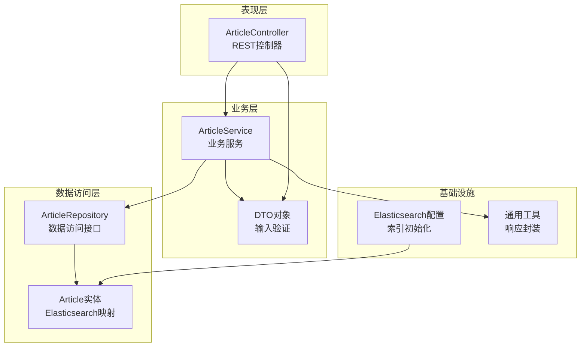
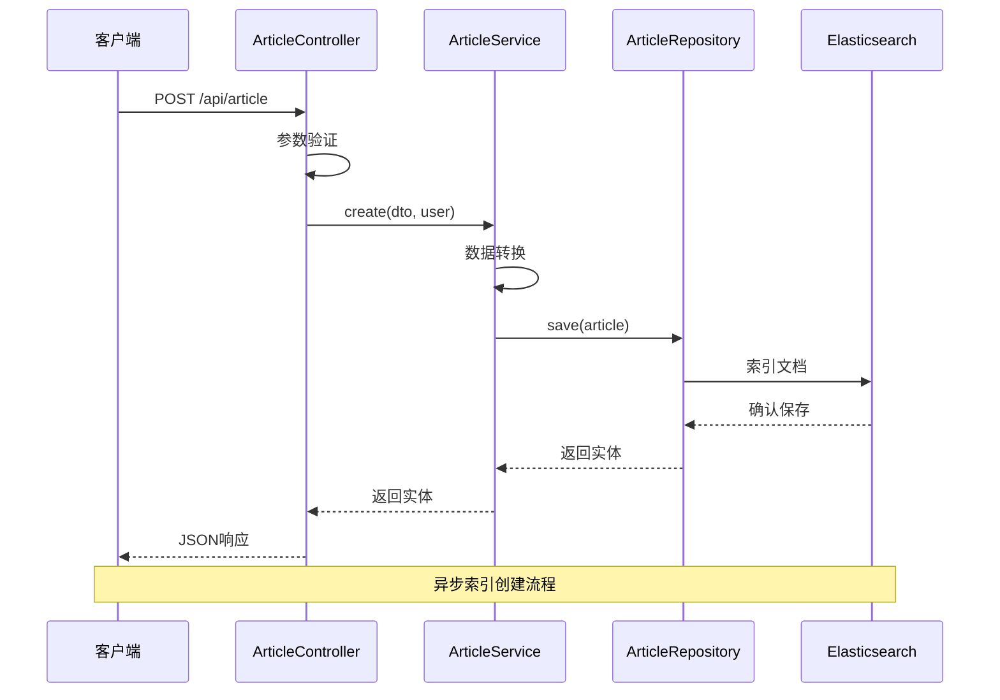
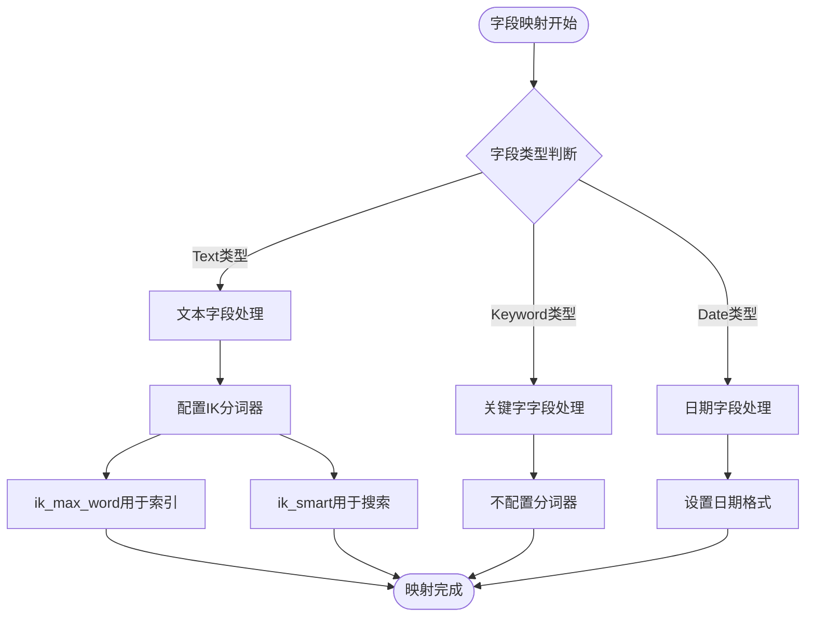
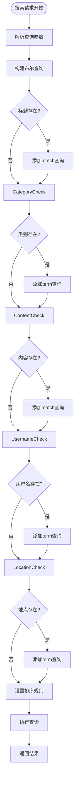
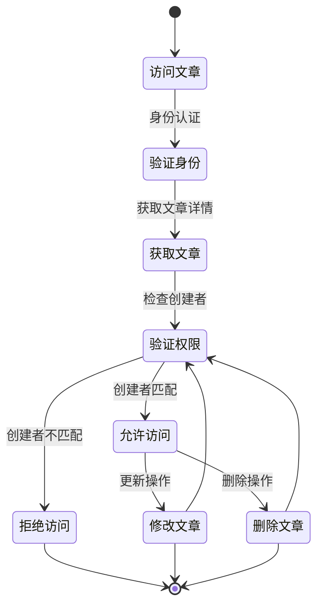
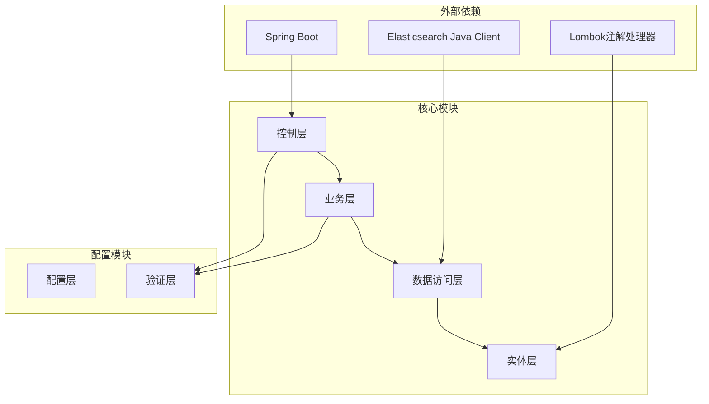

# 文章实体模型

<cite>
**本文档引用的文件**
- [Article.java](file://src/main/java/com/zhishilu/entity/Article.java)
- [ArticleRepository.java](file://src/main/java/com/zhishilu/repository/ArticleRepository.java)
- [ArticleService.java](file://src/main/java/com/zhishilu/service/ArticleService.java)
- [ArticleController.java](file://src/main/java/com/zhishilu/controller/ArticleController.java)
- [ArticleCreateDTO.java](file://src/main/java/com/zhishilu/dto/ArticleCreateDTO.java)
- [ArticleQueryDTO.java](file://src/main/java/com/zhishilu/dto/ArticleQueryDTO.java)
- [ArticleUpdateDTO.java](file://src/main/java/com/zhishilu/dto/ArticleUpdateDTO.java)
- [ElasticsearchIndexInitializer.java](file://src/main/java/com/zhishilu/config/ElasticsearchIndexInitializer.java)
- [application.yml](file://src/main/resources/application.yml)
- [PageResult.java](file://src/main/java/com/zhishilu/common/PageResult.java)
- [Result.java](file://src/main/java/com/zhishilu/common/Result.java)
</cite>

## 目录
1. [简介](#简介)
2. [项目结构](#项目结构)
3. [核心组件](#核心组件)
4. [架构概览](#架构概览)
5. [详细组件分析](#详细组件分析)
6. [依赖关系分析](#依赖关系分析)
7. [性能考虑](#性能考虑)
8. [故障排除指南](#故障排除指南)
9. [结论](#结论)

## 简介

本文档深入解析了基于Spring Data Elasticsearch构建的文章实体模型设计。该系统采用分层架构模式，通过Article实体类为核心，结合DTO验证、Repository数据访问、Service业务逻辑和Controller控制层，实现了完整的文章管理功能。系统特别针对中文文本搜索进行了优化，采用了IK分词器的智能配置策略。

## 项目结构

该项目采用标准的Spring Boot三层架构模式，围绕Article实体类构建完整的CRUD操作体系：

**图表来源**
- [ArticleController.java](file://src/main/java/com/zhishilu/controller/ArticleController.java#L1-L88)
- [ArticleService.java](file://src/main/java/com/zhishilu/service/ArticleService.java#L1-L200)
- [ArticleRepository.java](file://src/main/java/com/zhishilu/repository/ArticleRepository.java#L1-L30)
- [Article.java](file://src/main/java/com/zhishilu/entity/Article.java#L1-L81)

**章节来源**
- [ArticleController.java](file://src/main/java/com/zhishilu/controller/ArticleController.java#L1-L88)
- [ArticleService.java](file://src/main/java/com/zhishilu/service/ArticleService.java#L1-L200)
- [ArticleRepository.java](file://src/main/java/com/zhishilu/repository/ArticleRepository.java#L1-L30)

## 核心组件

### Article实体类设计

Article实体类是整个系统的数据模型核心，采用Spring Data Elasticsearch注解进行数据库映射配置：

#### 基础配置
- **索引名称**: `zhishilu_article`
- **分片数量**: 1
- **副本数量**: 0
- **主键字段**: 使用`@Id`注解标识

#### 字段映射策略

| 字段名 | 数据类型 | ES类型 | 分析器 | 约束条件 | 业务含义 |
|--------|----------|--------|--------|----------|----------|
| id | String | 自动 | - | 主键 | 文章唯一标识符 |
| title | String | Text | ik_max_word/ik_smart | 最大64字符 | 文章标题 |
| category | String | Keyword | - | 最大32字符 | 文章分类标签 |
| content | String | Text | ik_max_word/ik_smart | 无限制 | 文章正文内容 |
| url | String | Keyword | - | 最大64字符 | 来源链接地址 |
| images | List<String> | Keyword | - | 列表形式 | 图片资源路径集合 |
| createdBy | String | Keyword | - | 用户名 | 创建者用户名 |
| creatorId | String | Keyword | - | 用户ID | 创建者唯一标识 |
| location | String | Keyword | - | 地点信息 | 创建地理位置 |
| createdTime | LocalDateTime | Date | - | 时间戳 | 创建时间 |
| updatedTime | LocalDateTime | Date | - | 时间戳 | 更新时间 |

**章节来源**
- [Article.java](file://src/main/java/com/zhishilu/entity/Article.java#L14-L80)

## 架构概览

系统采用经典的MVC架构模式，通过RESTful API提供文章管理服务：

**图表来源**
- [ArticleController.java](file://src/main/java/com/zhishilu/controller/ArticleController.java#L32-L37)
- [ArticleService.java](file://src/main/java/com/zhishilu/service/ArticleService.java#L45-L59)
- [ElasticsearchIndexInitializer.java](file://src/main/java/com/zhishilu/config/ElasticsearchIndexInitializer.java#L24-L38)

## 详细组件分析

### Elasticsearch注解详解

#### @Document注解
- **作用**: 将Java类映射到Elasticsearch索引
- **配置参数**: 
  - `indexName`: 指定索引名称为"zhishilu_article"
- **应用场景**: 定义实体与索引的对应关系

#### @Setting注解
- **作用**: 配置索引的分片和副本策略
- **配置参数**:
  - `shards = 1`: 单一分片，适合开发环境
  - `replicas = 0`: 无副本，减少资源消耗
- **适用场景**: 开发测试环境的简化配置

#### @Field注解
- **作用**: 定义字段的ES映射属性
- **配置参数**:
  - `type`: 指定ES数据类型
  - `analyzer`: 中文分词器（ik_max_word）
  - `searchAnalyzer`: 搜索时使用的分词器（ik_smart）
  - `format`: 日期格式配置
  - `index`: 控制字段是否可被索引

**章节来源**
- [Article.java](file://src/main/java/com/zhishilu/entity/Article.java#L14-L15)
- [Article.java](file://src/main/java/com/zhishilu/entity/Article.java#L24-L37)

### IK分词器配置策略

系统采用IK分词器的智能组合策略：

#### 分词器选择原理

| 分词器类型 | 特点 | 使用场景 | 选择依据 |
|------------|------|----------|----------|
| ik_max_word | 最细粒度切分 | 精确匹配、全文检索 | 内容字段搜索精度要求高 |
| ik_smart | 最少切分 | 快速匹配、搜索效率 | 查询时提升性能 |
| Keyword | 不分词 | 精确匹配、排序过滤 | 标识字段、分类标签 |

#### 字段级别的分词策略

**图表来源**
- [Article.java](file://src/main/java/com/zhishilu/entity/Article.java#L24-L37)
- [Article.java](file://src/main/java/com/zhishilu/entity/Article.java#L72-L79)

**章节来源**
- [Article.java](file://src/main/java/com/zhishilu/entity/Article.java#L24-L37)
- [Article.java](file://src/main/java/com/zhishilu/entity/Article.java#L72-L79)

### 数据验证与约束

系统通过DTO对象实现输入验证：

#### ArticleCreateDTO验证规则
- **title**: 非空验证 + 最大64字符限制
- **category**: 非空验证 + 最大32字符限制  
- **url**: 可选 + 最大64字符限制
- **content**: 可选，无长度限制

#### ArticleUpdateDTO验证规则
- **title**: 可选 + 最大64字符限制
- **url**: 可选 + 最大64字符限制
- **content**: 可选，无长度限制

**章节来源**
- [ArticleCreateDTO.java](file://src/main/java/com/zhishilu/dto/ArticleCreateDTO.java#L15-L26)
- [ArticleUpdateDTO.java](file://src/main/java/com/zhishilu/dto/ArticleUpdateDTO.java#L14-L20)

### 查询与搜索功能

#### 搜索策略实现

**图表来源**
- [ArticleService.java](file://src/main/java/com/zhishilu/service/ArticleService.java#L116-L168)

**章节来源**
- [ArticleService.java](file://src/main/java/com/zhishilu/service/ArticleService.java#L116-L168)

### 权限控制机制

系统实现了基于创建者的权限控制：

**图表来源**
- [ArticleService.java](file://src/main/java/com/zhishilu/service/ArticleService.java#L68-L71)
- [ArticleService.java](file://src/main/java/com/zhishilu/service/ArticleService.java#L97-L100)

**章节来源**
- [ArticleService.java](file://src/main/java/com/zhishilu/service/ArticleService.java#L68-L71)
- [ArticleService.java](file://src/main/java/com/zhishilu/service/ArticleService.java#L97-L100)

## 依赖关系分析

系统采用松耦合的依赖注入架构：

**图表来源**
- [ArticleController.java](file://src/main/java/com/zhishilu/controller/ArticleController.java#L1-L88)
- [ArticleService.java](file://src/main/java/com/zhishilu/service/ArticleService.java#L1-L200)
- [ArticleRepository.java](file://src/main/java/com/zhishilu/repository/ArticleRepository.java#L1-L30)

**章节来源**
- [ArticleController.java](file://src/main/java/com/zhishilu/controller/ArticleController.java#L1-L88)
- [ArticleService.java](file://src/main/java/com/zhishilu/service/ArticleService.java#L1-L200)
- [ArticleRepository.java](file://src/main/java/com/zhishilu/repository/ArticleRepository.java#L1-L30)

## 性能考虑

### 索引优化策略

1. **单分片配置**: 开发环境使用1个分片，减少资源消耗
2. **无副本策略**: 避免不必要的数据冗余
3. **字段选择性**: 关键字字段使用Keyword类型，提高查询效率

### 查询性能优化

1. **IK分词器组合**: 索引使用ik_max_word，搜索使用ik_smart
2. **精确匹配优先**: 分类、用户名、地点使用term查询
3. **模糊匹配降级**: 标题和内容使用match查询

### 缓存策略建议

虽然当前实现未包含缓存层，但建议在生产环境中考虑：

- **热点数据缓存**: 最常用的文章内容
- **查询结果缓存**: 高频搜索结果
- **分页缓存**: 用户浏览历史

## 故障排除指南

### 常见问题及解决方案

#### Elasticsearch连接问题
**症状**: 应用启动时报ES连接失败
**解决方案**:
1. 检查application.yml中的ES配置
2. 确认Elasticsearch服务正在运行
3. 验证网络连通性和认证信息

#### 索引创建失败
**症状**: 启动时索引创建异常
**解决方案**:
1. 检查Elasticsearch版本兼容性
2. 验证索引名称的合法性
3. 确认ES用户权限足够

#### 中文分词异常
**症状**: 中文搜索结果不准确
**解决方案**:
1. 确认IK分词器插件已正确安装
2. 检查分词器配置是否正确
3. 验证测试数据的编码格式

**章节来源**
- [application.yml](file://src/main/resources/application.yml#L13-L18)
- [ElasticsearchIndexInitializer.java](file://src/main/java/com/zhishilu/config/ElasticsearchIndexInitializer.java#L24-L38)

## 结论

该文章实体模型设计体现了现代Spring Boot应用的最佳实践：

### 设计优势
1. **清晰的分层架构**: 各层职责明确，便于维护和扩展
2. **完善的验证机制**: DTO验证确保数据质量
3. **智能化的搜索策略**: IK分词器优化中文文本检索
4. **严格的权限控制**: 基于创建者的访问控制机制

### 技术亮点
1. **Elasticsearch集成**: 完整的索引映射和查询实现
2. **RESTful API设计**: 符合HTTP标准的接口规范
3. **统一响应格式**: 标准化的API响应结构
4. **自动索引管理**: 启动时自动创建和配置索引

### 改进建议
1. **生产环境优化**: 调整分片和副本配置
2. **监控告警**: 添加系统性能监控
3. **缓存层**: 实现多级缓存策略
4. **异步处理**: 对耗时操作进行异步化

该系统为内容管理平台提供了坚实的技术基础，通过合理的架构设计和配置策略，能够满足中文内容搜索的高性能需求。