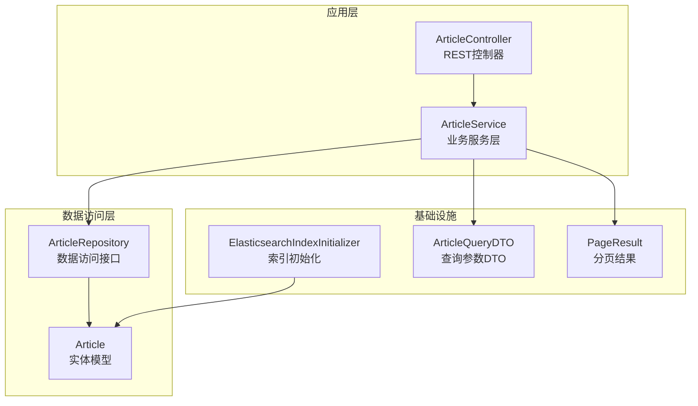
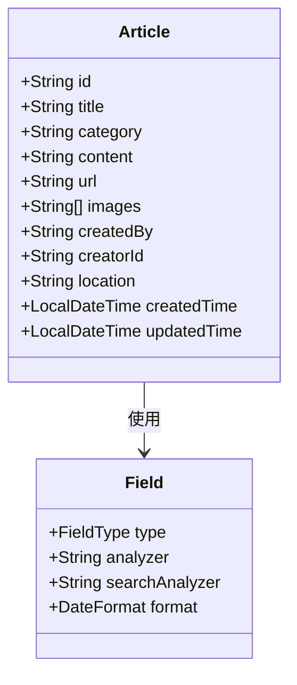
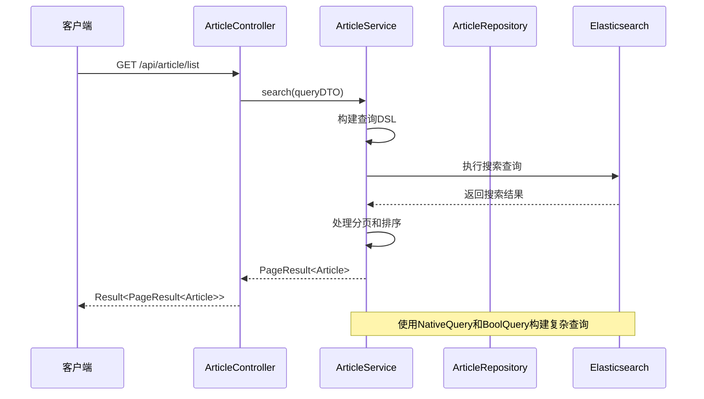
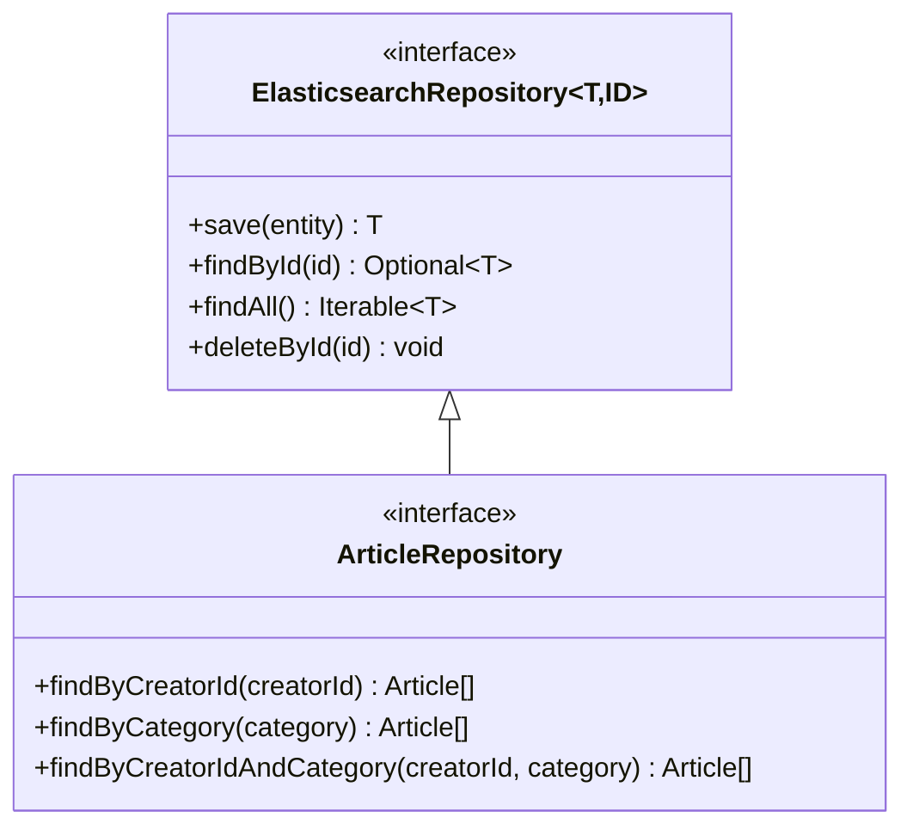
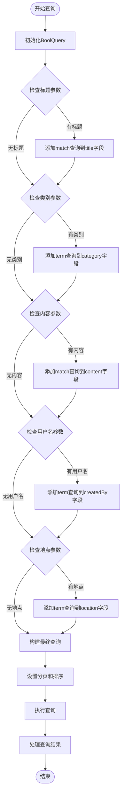
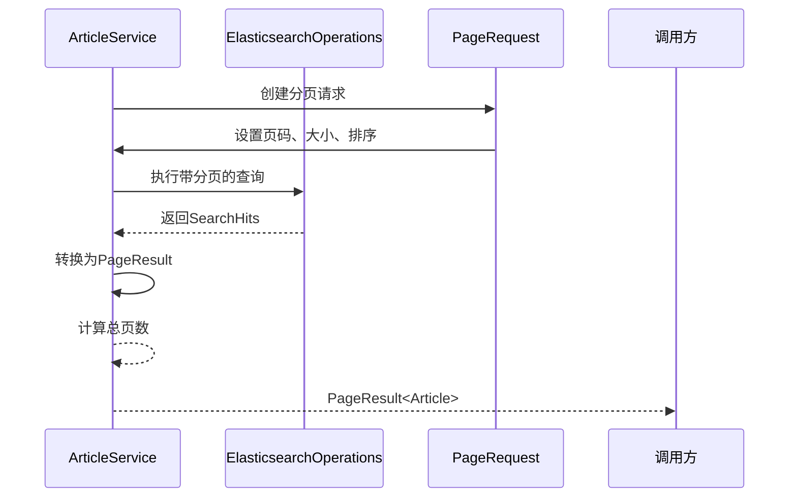
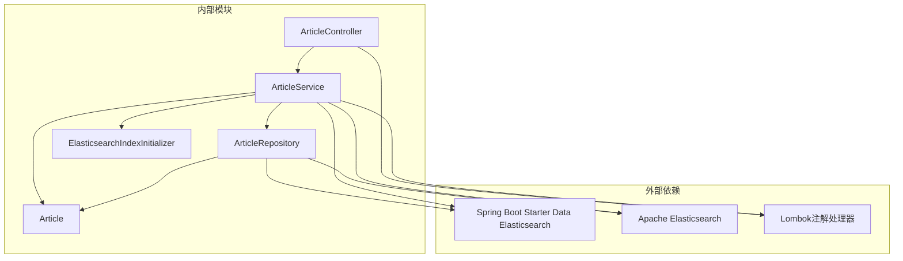

# 文章数据访问层

<cite>
**本文档引用的文件**
- [ArticleRepository.java](file://src/main/java/com/zhishilu/repository/ArticleRepository.java)
- [Article.java](file://src/main/java/com/zhishilu/entity/Article.java)
- [ArticleService.java](file://src/main/java/com/zhishilu/service/ArticleService.java)
- [ArticleController.java](file://src/main/java/com/zhishilu/controller/ArticleController.java)
- [ArticleQueryDTO.java](file://src/main/java/com/zhishilu/dto/ArticleQueryDTO.java)
- [ElasticsearchIndexInitializer.java](file://src/main/java/com/zhishilu/config/ElasticsearchIndexInitializer.java)
- [application.yml](file://src/main/resources/application.yml)
- [PageResult.java](file://src/main/java/com/zhishilu/common/PageResult.java)
- [Result.java](file://src/main/java/com/zhishilu/common/Result.java)
- [pom.xml](file://pom.xml)
</cite>

## 目录
1. [简介](#简介)
2. [项目结构](#项目结构)
3. [核心组件](#核心组件)
4. [架构概览](#架构概览)
5. [详细组件分析](#详细组件分析)
6. [依赖关系分析](#依赖关系分析)
7. [性能考虑](#性能考虑)
8. [故障排除指南](#故障排除指南)
9. [结论](#结论)

## 简介

本文档深入分析了知拾录项目中的文章数据访问层设计与实现。该系统采用Spring Data Elasticsearch技术栈，实现了基于Elasticsearch的高性能文章搜索和管理功能。文档重点涵盖了ArticleRepository接口的设计理念、Elasticsearch查询DSL的使用、分页查询、排序、以及高级查询功能的实现方式。

## 项目结构

该项目采用标准的Spring Boot分层架构，数据访问层位于repository包中，负责与Elasticsearch进行交互。



**图表来源**
- [ArticleController.java](file://src/main/java/com/zhishilu/controller/ArticleController.java#L22-L25)
- [ArticleService.java](file://src/main/java/com/zhishilu/service/ArticleService.java#L34-L37)
- [ArticleRepository.java](file://src/main/java/com/zhishilu/repository/ArticleRepository.java#L12-L13)

**章节来源**
- [ArticleController.java](file://src/main/java/com/zhishilu/controller/ArticleController.java#L1-L88)
- [ArticleService.java](file://src/main/java/com/zhishilu/service/ArticleService.java#L1-L200)
- [ArticleRepository.java](file://src/main/java/com/zhishilu/repository/ArticleRepository.java#L1-L30)

## 核心组件

### ArticleRepository接口设计

ArticleRepository继承了Spring Data Elasticsearch的ElasticsearchRepository泛型接口，采用了类型安全的设计模式：

- **泛型参数配置**：`ElasticsearchRepository<Article, String>`
  - 第一个参数：实体类型为Article
  - 第二个参数：主键类型为String（对应Elasticsearch的文档ID）

该设计提供了以下核心能力：
- 基于方法名的查询自动实现
- 标准的CRUD操作支持
- 自动的索引映射管理

**章节来源**
- [ArticleRepository.java](file://src/main/java/com/zhishilu/repository/ArticleRepository.java#L12-L28)

### Article实体模型

Article实体类通过注解配置了完整的Elasticsearch映射关系：



**图表来源**
- [Article.java](file://src/main/java/com/zhishilu/entity/Article.java#L14-L79)

**章节来源**
- [Article.java](file://src/main/java/com/zhishilu/entity/Article.java#L1-L81)

## 架构概览

系统采用经典的三层架构模式，数据访问层通过Repository模式实现数据持久化抽象。



**图表来源**
- [ArticleController.java](file://src/main/java/com/zhishilu/controller/ArticleController.java#L71-L75)
- [ArticleService.java](file://src/main/java/com/zhishilu/service/ArticleService.java#L116-L168)

**章节来源**
- [ArticleController.java](file://src/main/java/com/zhishilu/controller/ArticleController.java#L68-L86)
- [ArticleService.java](file://src/main/java/com/zhishilu/service/ArticleService.java#L113-L168)

## 详细组件分析

### Repository接口实现

ArticleRepository虽然只声明了3个查询方法，但Spring Data Elasticsearch会自动生成相应的实现：



**图表来源**
- [ArticleRepository.java](file://src/main/java/com/zhishilu/repository/ArticleRepository.java#L12-L28)

**章节来源**
- [ArticleRepository.java](file://src/main/java/com/zhishilu/repository/ArticleRepository.java#L13-L28)

### 高级查询实现

ArticleService中的search方法展示了如何使用原生Elasticsearch查询DSL构建复杂的查询逻辑：

#### 查询构建流程



**图表来源**
- [ArticleService.java](file://src/main/java/com/zhishilu/service/ArticleService.java#L116-L168)

#### 查询类型详解

系统实现了多种Elasticsearch查询类型：

1. **模糊匹配查询（Match Query）**
   - 用于全文搜索，如标题和内容查询
   - 支持分词器处理，提供更灵活的搜索体验

2. **精确匹配查询（Term Query）**
   - 用于类别、用户名、地点等精确匹配场景
   - 不进行分词处理，确保查询精度

3. **布尔查询（Bool Query）**
   - 将多个查询条件组合为复杂的搜索逻辑
   - 支持must、should、must_not等组合操作

**章节来源**
- [ArticleService.java](file://src/main/java/com/zhishilu/service/ArticleService.java#L116-L158)

### 分页查询实现

系统使用Spring Data的PageRequest和PageResult实现高效的分页查询：



**图表来源**
- [ArticleService.java](file://src/main/java/com/zhishilu/service/ArticleService.java#L154-L168)
- [PageResult.java](file://src/main/java/com/zhishilu/common/PageResult.java#L42-L50)

**章节来源**
- [ArticleService.java](file://src/main/java/com/zhishilu/service/ArticleService.java#L154-L168)
- [PageResult.java](file://src/main/java/com/zhishilu/common/PageResult.java#L12-L51)

### 排序功能实现

系统默认按创建时间降序排列，确保最新的文章优先显示：

- **排序字段**：createdTime
- **排序方向**：DESC（降序）
- **排序策略**：基于文档的创建时间戳

**章节来源**
- [ArticleService.java](file://src/main/java/com/zhishilu/service/ArticleService.java#L156-L157)

### 高亮显示功能

虽然当前实现主要展示基础查询功能，但系统已具备实现高亮显示的技术基础。可以通过以下方式扩展：

1. **查询高亮配置**：在NativeQuery中添加highlight选项
2. **高亮字段设置**：指定需要高亮的字段（title、content）
3. **高亮格式化**：使用HTML标签包裹匹配内容

### 聚合查询实现

ArticleService实现了基于用户的文章类别统计功能，展示了Elasticsearch聚合查询的强大能力：


**图表来源**
- [ArticleService.java](file://src/main/java/com/zhishilu/service/ArticleService.java#L173-L198)

**章节来源**
- [ArticleService.java](file://src/main/java/com/zhishilu/service/ArticleService.java#L173-L198)

## 依赖关系分析

系统依赖关系清晰，遵循单一职责原则：



**图表来源**
- [pom.xml](file://pom.xml#L40-L44)
- [ArticleController.java](file://src/main/java/com/zhishilu/controller/ArticleController.java#L1-L88)
- [ArticleService.java](file://src/main/java/com/zhishilu/service/ArticleService.java#L1-L200)

**章节来源**
- [pom.xml](file://pom.xml#L27-L88)
- [application.yml](file://src/main/resources/application.yml#L13-L18)

## 性能考虑

### 索引配置优化

系统通过注解配置了基础的索引设置：
- **分片数量**：1个分片
- **副本数量**：0个副本

这种配置适用于开发环境，生产环境中建议根据数据量和硬件资源调整分片和副本数量。

### 查询性能优化建议

1. **查询缓存**
   - 对热门查询结果进行缓存
   - 使用Redis等内存数据库存储热点数据

2. **查询优化**
   - 合理使用term查询替代match查询以提高性能
   - 限制查询范围，避免全表扫描

3. **索引优化**
   - 为常用查询字段建立合适的索引
   - 定期重建索引以保持查询性能

4. **分页优化**
   - 避免深度分页，使用search_after替代
   - 合理设置每页大小，避免过大的查询负载

### 连接池配置

系统配置了合理的连接超时时间：
- **连接超时**：5秒
- **Socket超时**：30秒

这些配置平衡了响应速度和稳定性需求。

**章节来源**
- [Article.java](file://src/main/java/com/zhishilu/entity/Article.java#L14-L15)
- [application.yml](file://src/main/resources/application.yml#L17-L18)

## 故障排除指南

### 常见问题及解决方案

1. **Elasticsearch连接失败**
   - 检查application.yml中的连接配置
   - 确认Elasticsearch服务正常运行
   - 验证认证凭据是否正确

2. **索引创建失败**
   - 检查Elasticsearch版本兼容性
   - 确认有足够的磁盘空间
   - 验证网络连接状态

3. **查询结果异常**
   - 检查查询参数的有效性
   - 验证字段映射配置
   - 确认数据格式正确

4. **分页查询性能问题**
   - 优化查询条件，减少结果集大小
   - 调整分页大小和页码
   - 考虑使用游标分页替代传统分页

### 调试技巧

1. **启用详细日志**
   ```yaml
   logging:
     level:
       org.springframework.data.elasticsearch: DEBUG
   ```

2. **监控查询性能**
   - 使用Elasticsearch的性能分析功能
   - 监控查询延迟和吞吐量
   - 分析慢查询日志

3. **测试查询DSL**
   - 在Kibana或curl中测试查询语句
   - 验证查询结果的准确性
   - 优化查询性能指标

**章节来源**
- [application.yml](file://src/main/resources/application.yml#L40-L44)
- [ElasticsearchIndexInitializer.java](file://src/main/java/com/zhishilu/config/ElasticsearchIndexInitializer.java#L23-L38)

## 结论

知拾录项目的文章数据访问层展现了现代Spring Data Elasticsearch的最佳实践。通过合理的设计模式和查询优化，系统实现了高效、可维护的文章搜索功能。

### 主要优势

1. **类型安全**：利用泛型和注解确保编译时类型安全
2. **查询灵活性**：支持复杂的布尔查询和聚合分析
3. **性能优化**：通过合理的索引配置和查询策略保证性能
4. **易于扩展**：清晰的分层架构便于功能扩展和维护

### 改进建议

1. **高亮显示**：实现查询结果的关键词高亮功能
2. **查询缓存**：引入多级缓存机制提升查询性能
3. **监控告警**：建立完善的查询性能监控体系
4. **异步处理**：对耗时的聚合查询采用异步处理方式

该数据访问层为整个系统的搜索功能奠定了坚实的基础，为用户提供流畅的文章浏览和搜索体验。